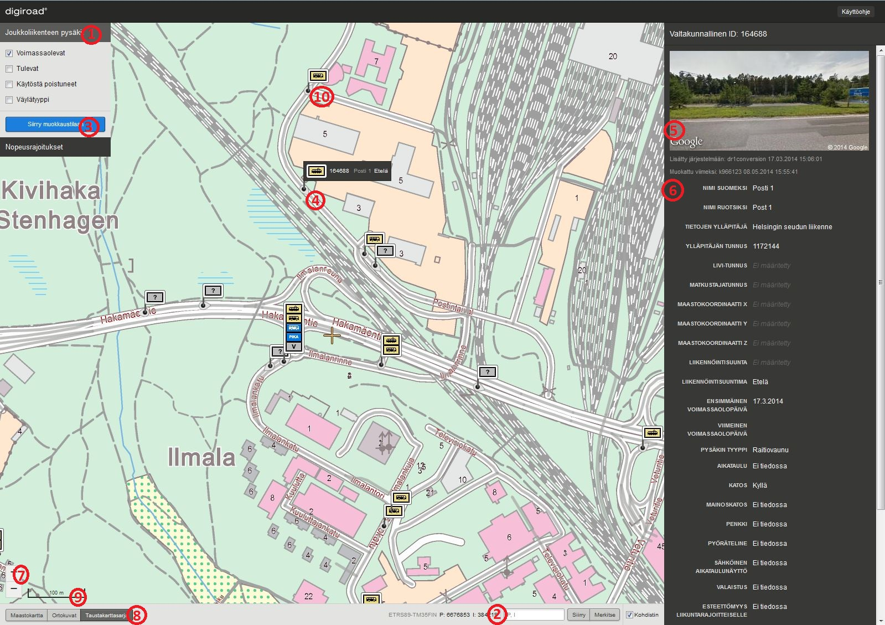
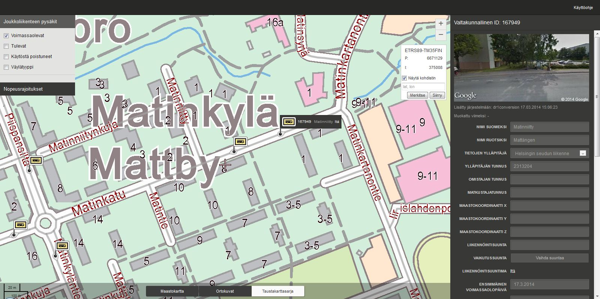
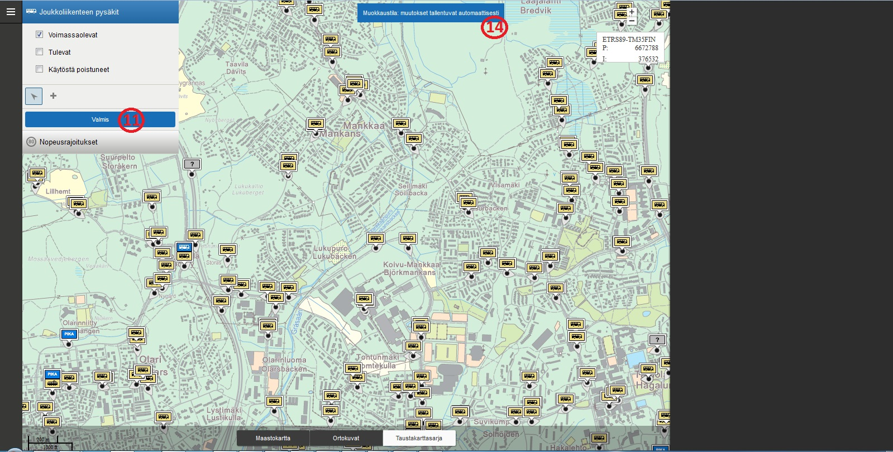
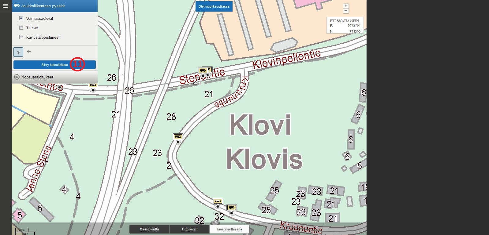
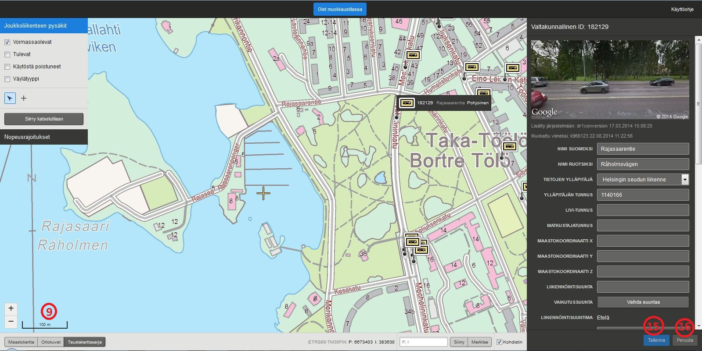
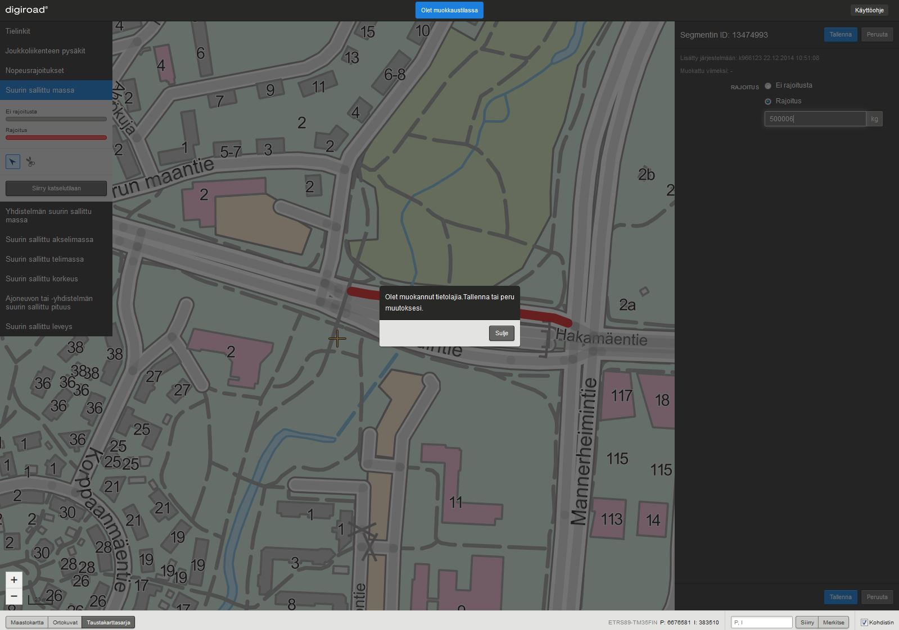

Loppuk&auml;ytt&auml;j&auml;n manuaali
==============================================

###Katselutila - muokkaajan roolissa###



_Katselutila._

1. Tietolajit -paletti
1. Koordinaattihaku
1. "Siirry muokkaustilaan"-painike
1. Valittu kohde
1. Google Street View
1. Ominaisuustieto -n&auml;kym&auml;
1. Mittakaavapainike
1. Taustakartat
1. Mittakaava
1. Pisara

###Katselutila - katselijan roolissa###



_Katselijan roolissa karttak&auml;ytt&ouml;liittym&auml;ss&auml; ei ole "Siirry muokkaustilaan"-painiketta._

###Muokkaustila###


_Muokkaustila._

11."Siirry katselutilaan"-painike
12.Ty&ouml;kalu 1
13.Ty&ouml;kalu 2
14.Muokkaustilan tunnusteksti
15.Tallenna-painike
16.Peruuta-painike

1. Miten p&auml;&auml;st&auml; alkuun?
-----------------------

1. Digiroadiin k&auml;yv&auml;t olemassa olevat Liikenneviraston tunnukset. Mik&auml;li tunnuksia ei ole, ne saa Digiroad-palvelusta: info@digiroad.fi tai 040-507 2301.

1. Digiroad-selainsovellukseen kirjaudutaan osoitteessa: https://testiextranet.liikennevirasto.fi/digiroad/.

1. Kirjautumisen j&auml;lkeen avautuu karttak&auml;ytt&ouml;liittym&auml;ss&auml; katselutila alueelta, johon k&auml;ytt&auml;j&auml;ll&auml; on oikeudet. Oikeudet on rajattu maantieteellisesti sek&auml; k&auml;ytt&auml;j&auml;n roolin mukaan. K&auml;ytt&auml;j&auml;n rooli on joko katselija tai muokkaaja. Katselijan roolissa aineistoja voi ainoastaan katsella. Muokkaajan roolissa aineistoja voi sek&auml; katsella ett&auml; muokata.


Oikeudet jakautuvat maantieteellisesti seuraavasti:

- Kuntak&auml;ytt&auml;j&auml;ll&auml; on oikeudet oman kunnan maantieteellisen kuntarajan sis&auml;puolella oleviin aineistoihin.
- ELY-k&auml;ytt&auml;j&auml;ll&auml; on oikeudet oman ELY-alueensa maantieteellisen rajan sis&auml;puolella oleviin aineistoihin.
- DR-operaattorilla on oikeudet koko Suomen aineistoihin.

Jos kirjautumisen j&auml;lkeen ei avaudu karttak&auml;ytt&ouml;liittym&auml;n katselutilaa, ei kirjautuneelle henkil&ouml;lle ole luotu Digiroad-oikeuksia. T&auml;ll&ouml;in tulee ottaa yhteytt&auml; Digiroad-palveluun: info@digiroad.fi tai 040-507 2301.

1.1 Mist&auml; saada opastusta?
--------------------------

Digiroad-palvelusta saa tarvittavia tunnuksia ja k&auml;ytt&ouml;oikeuksia selainsovellukseen. Palvelu auttaa my&ouml;s ongelmatilanteissa sovelluksen k&auml;yt&ouml;n kanssa.

Yhteystiedot:

Digiroad-palvelu:
info@digiroad.fi
p. 040-507 2301
http://www.digiroad.fi/

Pys&auml;kkeihin liittyv&auml;t asiat:
pysakit@digiroad.fi

1.2 Usein kysytyt kysymykset
-----------------------------

Digiroad 2 -sovelluksen k&auml;yt&ouml;n usein kysytyt kysymykset on koottu Digiroad-sivustolle. Usein kysyttyihin kysymyksiin p&auml;&auml;set [t&auml;&auml;lt&auml;.](http://www.digiroad.fi/yllapito/fi_FI/pysakkiohjeet/ )

2. Kirjautuminen Digiroad-sovellukseen
--------------------------------------

Digiroad-selainsovellukseen kirjaudutaan osoitteessa: https://testiextranet.liikennevirasto.fi/digiroad/. Kirjautumiseen tarvitaan voimassa olevat Liikenneviraston tunnukset. Tunnuksia saa Digiroad-palvelusta (kts. [Miten p&auml;&auml;st&auml; alkuun](#1._Miten_p&auml;&auml;st&auml;_alkuun?)).


_Kirjautuminen Digiroadiin._

Kirjautumisen j&auml;lkeen avautuu Digiroad-selainsovelluksen karttak&auml;ytt&ouml;liittym&auml;n katselutila. Maantieteellisesti kartalla on n&auml;kyviss&auml; alue, johon k&auml;ytt&auml;j&auml;ll&auml; on oikeudet (kts. [Miten p&auml;&auml;st&auml; alkuun](#1._Miten_p&auml;&auml;st&auml;_alkuun?)).


_Karttak&auml;ytt&ouml;liittym&auml;n katselutila._

Mik&auml;li kirjautumisen j&auml;lkeen ei avaudu karttak&auml;ytt&ouml;liittym&auml;n katselutilaa, ei k&auml;ytt&auml;j&auml;ll&auml; ole oikeuksia Digiroad-sovellukseen. Digiroad-oikeuksia voi pyyt&auml;&auml; digiroad-palvelusta (kts. [Miten p&auml;&auml;st&auml; alkuun](#1._Miten_p&auml;&auml;st&auml;_alkuun?)).

3. Yleist&auml;
----------

Sovelluksella on kaksi tilaa: katselu- ja muokkaustila. Jos k&auml;ytt&auml;j&auml;n rooli on katselija, h&auml;n p&auml;&auml;see vain katselutilaan. Muokkaajan roolissa oleva k&auml;ytt&auml;j&auml; p&auml;&auml;see sek&auml; katselu- ett&auml; muokkaustilaan. Kirjautumisen j&auml;lkeen avautuu katselutila, jossa voi ainoastaan katsella eri tietolajeja, esimerkiksi pys&auml;kkej&auml; tai nopeusrajoituksia. Tietolajien muokkaus suoritetaan muokkaustilassa. Molemmissa tiloissa n&auml;kyv&auml;t ainoastaan ne tietolajit, joihin k&auml;ytt&auml;j&auml;ll&auml; on oikeudet (kts. [Miten p&auml;&auml;st&auml; alkuun](#1._Miten_p&auml;&auml;st&auml;_alkuun?)). Kartalle voi valita yhden tietolajin kerrallaan, esimerkiksi pys&auml;kit. Tietolaji valitaan sivun vasemman tietolajit-paletista (1).

Muokkaustilan saa aktivoitua klikkaamalla "Siirry muokkaustilaan"-painiketta (3). Muokkaustilassa kartan yl&auml;osassa on teksti "Olet muokkaustilassa" (14). Muokkaustilassa tehdyt muutokset tallentuvat painamalla "Tallenna"-painiketta (15) ja peruuntuvat painamalla "Peruuta"-painiketta (16). Takaisin katselutilaan p&auml;&auml;see klikkaamalla "Siirry katselutilaan"-painiketta (11).


_Katselutila._



_Muokkaustila._

3.1 Karttan&auml;kym&auml;n muokkaus
--------------------------

####Kartan liikutus####

Karttaa liikutetaan raahaamalla.

####Mittakaavataso####

Kartan mittakaavatasoa muutetaan joko hiiren rullalla, tuplaklikkaamalla, Shift+piirto (alue) tai mittakaavapainikkeista  (7). Mittakaavapainikkeita k&auml;ytt&auml;m&auml;ll&auml; kartan keskitys s&auml;ilyy. Hiiren rullalla, tuplaklikkaamalla tai Shift+piirto (alue) kartan keskitys siirtyy kursorin kohtaan.  K&auml;yt&ouml;ss&auml; oleva mittakaavataso n&auml;kyy kartan vasemmassa alakulmassa (9).

####Koordinaattihaku####

K&auml;ytt&ouml;liittym&auml;ss&auml; on koordinaattihaku (2), joka keskitt&auml;&auml; kartan keskipisteen haettuun pisteeseen. Keskipiste on merkitty kartalle ristin&auml;. Siirry-painike keskitt&auml;&auml; kartan haettuun pisteeseen ja Merkitse-painike luo markerin haettuun pisteeseen. Markeri j&auml;&auml; kartalle, kunnes sille hakee uuden sijainnin. Ristin saa pois n&auml;kyvist&auml; klikkaamalla "N&auml;yt&auml; kohdistin"-valinnan tyhj&auml;ksi. Sy&ouml;tekentt&auml;&auml;n kirjoitetaan kokonaislukuina metrin tarkkuudella pohjois-koordinaatti (7 merkki&auml;) ja it&auml;-koordinaatti (6 merkki&auml;) ETRS35FIN-koordinaattij&auml;rjestelm&auml;ss&auml;. Koordinaatit erotetaan toisistaan pilkulla. Esimerkiksi:

```
6901839,435323
```

Koordinaattihakuun voi sy&ouml;tt&auml;&auml; vain koordinaatteja, jotka osuvat sovelluksen kartalle. Jos koordinaatit eiv&auml;t osu kartalle, sovellus ilmoittaa "Koordinaatit eiv&auml;t osu kartalle". My&ouml;sk&auml;&auml;n kirjaimia tai merkkej&auml; ei voi sy&ouml;tt&auml;&auml;. Jos sy&ouml;te on virheellinen merkkijono, sovellus ilmoittaa "K&auml;yt&auml; koordinaateissa P ja I numeroarvoja".
####Taustakartat####

Taustakartaksi voi valita maastokartan, ortokuvat tai taustakarttasarjan. (8)


_Karttan&auml;kym&auml;n muokkaus._

3.2 Tielinkit
-------------

Tielinkeill&auml; on oletuksena v&auml;rill&auml; korostettu v&auml;yl&auml;tyyppivalinta p&auml;&auml;ll&auml;. Valinnan saa pois klikkamalla tietolajit-valikon (1) "Joukkoliikenteen pys&auml;kit" kohdasta V&auml;yl&auml;tyyppi-valinnan pois. Sininen v&auml;ri tarkoittaa yksityistiet&auml;, vihre&auml; katua ja punainen maantiet&auml;. Harmaalla korostettujen tielinkkien v&auml;yl&auml;tyyppi ei ole tiedossa. 

V&auml;yl&auml;tyyppi kertoo tielinkin omistajasta. Maantiet omistaa valtio. Kadut omistaa kunta, jonka alueella katu on. Yksityistiet omistaa yksityiset tahot: tiekunta, yksityishenkil&ouml;, yritys tms.


_V&auml;yl&auml;tyypit._

3.3 Joukkoliikenteen pys&auml;kkien valinta
--------------------------------------

Karttan&auml;kym&auml;&auml;n voi valita pys&auml;kkej&auml; valitsemalla tietolajit-paletista (1) Joukkoliikenteen pys&auml;kit. Pys&auml;kkej&auml; valitaan pys&auml;kin voimassaolon mukaan: voimassa olevat, tulevat ja/tai k&auml;yt&ouml;st&auml; poistuneet. Valitseminen toimii samalla tavalla sek&auml; katselu- ett&auml; muokkaustilassa.

Joukkoliikenteen pys&auml;kit n&auml;kyv&auml;t vain tarpeeksi tarkalla mittakaavatasolla, joka on 1:20 000 tai tarkempi (9). Sovellus ilmoittaa, kun mittakaavataso on liian ep&auml;tarkka pys&auml;kkien n&auml;kymiselle. Mittakaavataso pys&auml;kkien n&auml;kymiselle on sama sek&auml; katselu- ett&auml; muokkaustilassa.


_Joukkoliikenteen pys&auml;kkien valinta._

####Kelluvat pys&auml;kit####

Joukkoliikenteen pys&auml;kki voi olla kelluva, jos tielinkkigeometria sen alla on muuttunut niin paljon, ettei j&auml;rjestelm&auml; pysty en&auml;&auml; p&auml;&auml;ttelem&auml;&auml;n sen sijaintia geometrialla. Kelluvat pys&auml;kit on korostettu karttan&auml;kym&auml;ss&auml; alla olevan kuvan tavoin, ja niiden ominaisuustieton&auml;kym&auml;ss&auml; on huomautus, että pys&auml;kki tulisi siirt&auml;&auml; tielinkille, jotta kelluvuus poistuu (kts. [Pys&auml;kin siirt&auml;minen](#5.1.2_Pys&auml;kin_siirt&auml;minen)). 


_Kelluvat pys&auml;kit on visualisoitu eri tavoin._

Kelluvista pys&auml;keist&auml; on lista [t&auml;&auml;ll&auml;.](https://testiextranet.liikennevirasto.fi/digiroad/floatingstops.html) Kelluvasta pys&auml;kist&auml; on listassa linkki, josta p&auml;&auml;see suoraan pys&auml;kin kohdalle sovelluksessa ja sen voi siirt&auml;&auml; takaisin geometrialle.


_Kelluvien pys&auml;kkien lista._

3.3.1 Joukkoliikenteen pys&auml;kkien haku
-------------------------------------

Joukkoliikenteen pys&auml;kkej&auml; haetaan pys&auml;kin kansallisella ID:ll&auml; yksil&ouml;idyll&auml; URL-osoitteella. Sovelluksen t&auml;ytyy olla pys&auml;kkin&auml;kym&auml;ss&auml; pys&auml;kki&auml; haettaessa. Esimerkki URL-osoitteesta:

https://testiextranet.liikennevirasto.fi/digiroad/#/asset/95374  (17)

miss&auml; numerosarja 95374 on pys&auml;kin kansallinen ID. Toiminto tarkentaa karttak&auml;ytt&ouml;liittym&auml;n katselutilan haetun pys&auml;kin kohdalle. Pys&auml;kin ominaisuustieton&auml;kym&auml; (6) aukeaa sivun oikealle puolelle. 


_Joukkoliikenteen pys&auml;kkien haku._

3.4 Nopeusrajoitusten valinta
-----------------------------

Karttan&auml;kym&auml;&auml;n voi valita nopeusrajoitukset valitsemalla tietolajit-paletista (1) Nopeusrajoitukset. Nopeusrajoitukset n&auml;kyv&auml;t, kun kartan mittakaavataso on 1:20 000 tai tarkempi (9). Karttaa tarkennettaessa nopeusrajoitukset paksuuntuvat, jotta niiden erottaminen on helpompaa. Nopeusrajoituksilla on nopeusrajoitusl&auml;tk&auml;, joka kertoo nopeusrajoituksen arvon ja linkit on visualisoitu eri v&auml;rein nopeusrajoituksen arvon mukaan. V&auml;rikoodien selitteet n&auml;kyv&auml;t Nopeusrajoitukset-valinnan alla, kun valitsee Nopeusrajoitukset.

Jos tielinkill&auml; ei ole nopeusrajoitusta, sovellus generoi sen itse siten, ett&auml; katujen nopeusrajoitus on 50km/h ja maanteiden sek&auml; yksityisteiden 80km/h. Nopeusrajoitus tulee n&auml;kyviin, kun sovellus on generoinut sen.


_Nopeusrajoitusten valinta._

3.5 Suurin sallittu massa -valinta
------------------------------------

Kartalle voi valita tietolajit-paletista (1) Suurin sallittu massa -valinnan. Suurimmat sallitut massat n&auml;kyv&auml;t, kun kartan mittakaavataso on 1:20 000 tai tarkempi (9). Karttaa tarkennettaessa geometriat paksuuntuvat, jotta niiden erottaminen on helpompaa. Geometriat on visualisoitu punaisella v&auml;rill&auml; ja tielinkit, joilla suurinta sallittua massaa ei ole, on visualisoitu harmaalla v&auml;rill&auml;.

4. Katselutila
--------------

Katselutila on sovelluksen tietolajien katselemista varten. Katselutilassa ei voi muokata tietolajeja.

4.1 Pys&auml;kin tietojen katselu
----------------------------

Pys&auml;kit tulevat n&auml;kyviin, kun kartan mittakaavataso on 1:20 000 tai tarkempi (9). Yksitt&auml;isen pys&auml;kin ominaisuustiedot tulevat n&auml;kyviin, kun pys&auml;kki&auml; klikataan. T&auml;ll&ouml;in sivun oikeaan laitaan avautuu Google Street View (5) ja ominaisuustieto-n&auml;kym&auml; (6). Valitulle pys&auml;kille avautuu infokupla, jossa n&auml;kyy pys&auml;kin valtakunnallinen ID, suomenkielinen nimi, liikenn&ouml;intisuuntima ja pys&auml;kin tyyppi kuvana. (4)

Jos kaksi tai useampi pys&auml;kki ovat alle kuuden metrin p&auml;&auml;ss&auml; toisistaan, esitet&auml;&auml;n pys&auml;kit k&auml;ytt&ouml;liittym&auml;ss&auml; p&auml;&auml;llekk&auml;in ryhmiteltyn&auml;. P&auml;&auml;llekk&auml;in asettelu mahdollistaa pys&auml;kin tarkastelun ilman, ett&auml; samassa sijainnissa olevia pys&auml;kkej&auml; tarvitsee siirt&auml;&auml;. 

Ominaisuustieto-n&auml;kym&auml;ss&auml; kaikki kent&auml;t ovat disabloituja eli niit&auml; ei voi muokata. Google Street View -kuvaa klikkaamalla avautuu Google Street View uudelle v&auml;lilehdelle. Pys&auml;kin valinnan saa pois klikkaamalla karttaa.


_Joukkoliikenteen pys&auml;kin tietojen katselu._

4.2 Nopeusrajoituksen tietojen katselu
--------------------------------------

Nopeusrajoitukset tulevat n&auml;kyviin, kun kartan mittakaavataso on 1:20 000 tai tarkempi (9). Yksitt&auml;isen nopeusrajoituksen voi valita klikkaamalla kartalta sen geometriaa. T&auml;ll&ouml;in valituksi tulevat kaikki nopeusrajoitukset, joilla on sama ID. Nopeusrajoitusketjun geometria tummentuu ja muut nopeusrajoitukset n&auml;kyv&auml;t haaleammalla. Sivun oikeaan laitaan avautuu nopeusrajoituksen ominaisuustieton&auml;kym&auml;.

Ominaisuustieton&auml;kym&auml;ss&auml; on nopeusrajoituksen ID, arvo (km/h) sek&auml; p&auml;&auml;tepisteen 1 ja p&auml;&auml;tepisteen 2 koordinaatit ETRS89-TM35FIN-koordinaattij&auml;rjestelm&auml;ss&auml;.


_Nopeusrajoituksen tietojen katselu._

Nopeusrajoitukset on visualisoitu eri tavoin riippuen vaikutussuunnasta. Nopeusrajoituksen vaikutussuunta voi olla molempiin suuntiin tai vain toiseen suuntaan. Jos vaikutussuunta on molempiin suuntiin, nopeusrajoitus on visualisoitu yhdellä paksulla viivalla (23). Yksisuuntainen vaikutus on visualisoitu ohuemmalla viivalla vaikutussuunnan mukaan tielinjan reunaan (24).


_Nopeusrajoitusten visualisointi._

4.3 Suurimman sallitun massan tietojen katselu
---------------------------------------------

Suurimmat sallitut massat tulevat n&auml;kyviin, kun kartan mittakaavataso on 1:20 000 tai tarkempi (9). Yksitt&auml;isen suurimman sallitun massan voi valita klikkaamalla kartalta sen geometriaa (4). Geometria tummentuu ja muut suurimmat sallitut massat n&auml;kyv&auml;t haaleammalla. Sivun oikeaan laitaan avautuu suurimman sallitun massan ominaisuustieton&auml;kym&auml;.


_Suurin sallittu massa - katsleutila._

5. Muokkaustila
---------------

Muokkaustila aktivoidaan painamalla "Siirry muokkaustilaan"-painiketta (3). Muokkaustila on eri tietolajien muokkaamista varten ja se on ulkoasultaan erilainen kuin katselutila. Kartan yl&auml;osassa on teksti: "Olet muokkaustilassa".

Muokkaustilasta p&auml;&auml;see takaisin katselutilaan klikkaamalla "Siirry katselutilaan" -painiketta (11).


_Muokkaustilaan p&auml;&auml;see klikkaamalla "Siirry muokkaustilaan"-painiketta (3)._



_Muokkaustilasta p&auml;&auml;see pois klikkaamalla "Siirry katselutilaan" -painiketta (11)._

Muokkaustilassa tietolajeihin tehdyt muutokset tallentuvat painamalla ominaisuustieton&auml;kym&auml;ss&auml; olevaa Tallenna-nappia (15). Muutosten tallentamisen j&auml;lkeen tietolajille tallentuu Muokattu viimeksi -kohtaan muokkaajan k&auml;ytt&auml;j&auml;tunnus, p&auml;iv&auml;m&auml;&auml;r&auml; ja kellonaika. Tehdyt muutokset peruuntuvat painamalla Peruuta-nappia (16). Tallenna- ja Peruuta -napit ovat disabloituja, kun muutoksia ei ole tehty. Jos muutoksia on tehnyt eik&auml; niit&auml; peru tai tallenna ja siirtyy muokkaamaan toista kohdetta tai pois auki olevan tietolajin muokkaustilasta, sovellus antaa muutos-dialogin, joka kertoo, ett&auml; muutoksia on tehty ja ne tulee tallentaa tai peruuttaa ennen kuin voi jatkaa. 

Jotta tietolajeja voi muokata, t&auml;ytyy kartan mittakaavan olla 1:20 000 tai tarkempi (9). Ep&auml;tarkemmilla zoomitasoilla sovellus antaa ilmoituksen:"Zoomaa l&auml;hemm&auml;ksi, jos haluat n&auml;hd&auml; kohteita."



_Tietolajin ominaisuustietojen muokkaus._



_Muutos-dialogi._

5.1 Joukkoliikenteen pys&auml;kit
----------------------------

Joukkoliikenteen pys&auml;kit ovat julkisen liikenteen k&auml;yt&ouml;ss&auml; olevia pys&auml;kkej&auml;: linja-autojen paikallisliikenteen, linja-autojen kaukoliikenteen, linja-autojen pikavuorojen ja raitiovaunujen pys&auml;kit sek&auml; virtuaalipys&auml;kit.

5.1.1 Joukkoliikenteen pys&auml;kin ominaisuustietojen muokkaus
--------------------------------------------------------
Yksitt&auml;isen pys&auml;kin ominaisuustietoja voi muokata valitsemalla muokkausty&ouml;kalun (12). Muokattava pys&auml;kki valitaan hiirell&auml; klikkaamalla. P&auml;&auml;llekk&auml;in esitetyist&auml; pys&auml;keist&auml; voi valita yhden pys&auml;kin klikkaamalla pys&auml;kki&auml;. Pinosta valitun pys&auml;kin erottaa sille avautuvasta kuplasta. Valittaessa pys&auml;kin sivun oikeaan laitaan avautuu Google Street View -n&auml;kym&auml; (5) pys&auml;kist&auml; sek&auml; pys&auml;kin ominaisuustiedot (6). Jos pysäkillä ei ole tyyppiä, tulee se asettaa ennen tallentamista. Pys&auml;kkien ominaisuustieton&auml;kym&auml;ss&auml; n&auml;kyy ilmoitus, jos pys&auml;kilt&auml; puuttuu pakollisia tietoja.

Pys&auml;kin valinnan saa pois klikkaamalla karttaa, kun tallennus tai peruutus on tehty.


_Joukkoliikenteen pys&auml;kin ominaisuustietojen muokkaus._

####Pys&auml;kin vaikutussuunnan muuttaminen####

Googlen Street View -n&auml;kym&auml; (5) sivun oikeassa laidassa on suunnattu suuntaan, jossa pys&auml;kin tallennetun vaikutussuunnan mukaan kuuluisi olla. Painamalla n&auml;kym&auml;&auml; avautuu Googlen Street View -v&auml;lilehti, jossa pys&auml;kin ymp&auml;rist&ouml;&auml; voi tarkastella tarkemmin. Kartalla pys&auml;kin vaikutussuunta n&auml;kyy pisarana pys&auml;kkikuvakkeella (10). Pisaran k&auml;rki osoittaa pys&auml;kin liikennevirran suuntaan.

Pys&auml;kin vaikutussuunnan voi muuttaa ominaisuustieton&auml;kym&auml;ss&auml; (6) painamalla "Vaihda suuntaa"-painiketta (18). Pys&auml;kin vaikutussuuntaa muutettaessa Googlen Street View -n&auml;kym&auml; (5) muuttuu vastaamaan uutta vaikutussuuntaa ja pisaran suunta k&auml;&auml;ntyy.


_Joukkoliikenteen pys&auml;kin vaikutussuunnan voi muuttaa painamalla "Vaihda suuntaa"-painiketta (18)._

####Pys&auml;kin voimassaolop&auml;ivien muokkaus####

Ensimm&auml;inen voimassaolop&auml;iv&auml; (19) tarkoittaa p&auml;iv&auml;m&auml;&auml;r&auml;&auml;, josta l&auml;htien pys&auml;kki on k&auml;yt&ouml;ss&auml;. Viimeinen voimassaolop&auml;iv&auml; (20) tarkoittaa p&auml;iv&auml;m&auml;&auml;r&auml;&auml;, jolloin pys&auml;kki on viimeisen kerran k&auml;yt&ouml;ss&auml;. Molempia p&auml;iv&auml;m&auml;&auml;ri&auml; voi muokata ominaisuustieto -n&auml;kym&auml;n (6) kautta. P&auml;iv&auml;m&auml;&auml;ri&auml; voi muokata joko kirjoittamalla ne p&auml;iv&auml;m&auml;&auml;r&auml;kentt&auml;&auml;n muodossa pp.kk.vvvv tai valitsemalla ne kalenterista, joka avautuu, kun p&auml;iv&auml;m&auml;&auml;r&auml;kentt&auml;&auml; klikkaa.

P&auml;iv&auml;m&auml;&auml;ri&auml; ei voi asettaa ristiin siten, ett&auml; "Ensimm&auml;inen voimassaolop&auml;iv&auml;" olisi my&ouml;hemmin kuin "Viimeinen voimassaolop&auml;iv&auml;". Kalenterissa ei-sallitut p&auml;iv&auml;m&auml;&auml;r&auml;t ovat disabloituja. Jos p&auml;iv&auml;m&auml;&auml;r&auml;kentt&auml;&auml;n kirjoittaa p&auml;iv&auml;m&auml;&auml;r&auml;n, joka asettaa p&auml;iv&auml;m&auml;&auml;r&auml;t ristiin, ei p&auml;iv&auml;m&auml;&auml;r&auml; tallennu.

Jos "Ensimm&auml;inen voimassaolop&auml;iv&auml;" tai "Viimeinen voimassaolop&auml;iv&auml;" ei ole tiedossa, voi kalenterista valita "ei tietoa".


_Pys&auml;kin voimassaolop&auml;ivien muokkaus._

####Pys&auml;kin muiden ominaisuustietojen muokkaus####

Muita ominaisuustietoja voi muokata oikeassa laidassa olevan ominaisuustieton&auml;kym&auml;n (6) kautta. Tietoja muokataan joko kirjoittamalla tietokentt&auml;&auml;n, valitsemalla pudotusvalikosta tieto tai merkitsem&auml;ll&auml; rasti ruutuun oikean/oikeiden tietojen kohdalle.


_Joukkoliikenteen pys&auml;kin ominaisuustietojen muokkaus._

####Ominaisuustiedot:####

__Sovellus generoi automaattisesti:__

__Lis&auml;tty j&auml;rjestelm&auml;&auml;n:__ Tiedon luojan k&auml;ytt&auml;j&auml;tunnus tai massaimportin l&auml;hde ja tiedon lis&auml;yshetki. 
__Muokattu viimeksi:__ Muokkaajan k&auml;ytt&auml;j&auml;tunnus ja tiedon muokkaushetki. 
__Liikenn&ouml;intisuuntima:__ Sovellus laskee itse tiegeometriasta. Pohjoinen on nolla astetta ja koko kierros my&ouml;t&auml;p&auml;iv&auml;&auml;n 360 astetta. Ilmoitetaan asteluvun mukaan pohjoinen, it&auml;, etel&auml; tai l&auml;nsi.

__K&auml;ytt&auml;j&auml; lis&auml;&auml; j&auml;rjestelm&auml;&auml;n:__

Ominaisuustietokent&auml;t ovat tekstikentti&auml;, joihin ominaisuustieto kirjoitetaan merkkijonona, monivalintoja, josta voi valita oikeat vaihtoehdot tai pudotusvalikkovalintoja, joista voi valita yhden vaihtoehdon.

__Nimi suomeksi:__ Pys&auml;kin nimi suomen kielell&auml;. Nimen tulee olla valtakunnallisesti yksil&ouml;iv&auml;. Esim. Ei "Linja-autoasema" vaan "Porvoon linja-autoasema".
__Nimi ruotsiksi:__ Pys&auml;kin nimi ruotsin kielell&auml;. 
__Tietojen yll&auml;pit&auml;j&auml;:__ Yll&auml;pit&auml;v&auml; viranomainen: kunta, Helsingin seudun liikenne tai ELY-keskus.
__Yll&auml;pit&auml;j&auml;n tunnus:__ Tietojen yll&auml;pit&auml;j&auml;n sis&auml;inen tunnus pys&auml;kille.
__LIVI-tunnus:__ Pys&auml;kin Livi-tunniste, vastaava tunnus kuin Tierekisteriss&auml;. K&auml;yt&ouml;ss&auml; vain maanteiden pys&auml;keill&auml;.
__Matkustajatunnus:__ Pys&auml;kin tunnus, joka n&auml;kyy matkustajalle.
__Maastokoordinaatti X:__ Pys&auml;kin sijainnin mitattu X-koordinaatti: EUREF FIN ETRS89-TM35FIN.
__Maastokoordinaatti Y:__ Pys&auml;kin sijainnin mitattu Y-koordinaatti: EUREF FIN ETRS89-TM35FIN.
__Maastokoordinaatti Z:__ Pys&auml;kin sijainnin mitattu Z-koordinaatti: N2000 korkeusj&auml;rjestelm&auml;ss&auml;.
__Liikenn&ouml;intisuunta:__ Pys&auml;kin suunta sanallisesti kuvattuna. Esimerkiksi:"Keskustaan".
__Vaikutussuunta:__ Vaikutussuunta on visualisoitu pys&auml;kin liikennevirran suunnaksi pisaralla (9). Google Street View (4) osoittaa suuntaan, jossa pys&auml;kin kuuluisi olla.
__Ensimm&auml;inen voimassaolop&auml;iv&auml;:__ P&auml;iv&auml;m&auml;&auml;r&auml;, jolloin pys&auml;kki on ensimm&auml;isen kerran k&auml;yt&ouml;ss&auml;.
__Viimeinen voimassaolop&auml;iv&auml;:__ P&auml;iv&auml;m&auml;&auml;r&auml;, jolloin pys&auml;kki on viimeisen kerran k&auml;yt&ouml;ss&auml;.
__Pys&auml;kin tyyppi: Pakollinen tieto!__ Linja-autojen paikallisliikenne, raitiovaunu, linja-autojen kaukoliikenne, linja-autojen pikavuoro tai virtuaalipys&auml;kki.
__Aikataulu:__ Paperinen, pys&auml;kin sein&auml;&auml;n tai tolppaan aikataulukehikkoon kiinnitetty aikataulu, joka sis&auml;lt&auml;&auml; tiedot pys&auml;kill&auml; liikenn&ouml;ivien reittien l&auml;ht&ouml;ajoista sek&auml; mahdollisesti my&ouml;s pys&auml;kkikohtaisista ohitusajoista. Mahdolliset arvot: kyll&auml;, ei tai ei tietoa. Oletuksena on "ei tietoa".
__Katos:__  Pys&auml;kkialueella sijaitseva, joukkoliikennev&auml;linett&auml; odottaville matkustajille tarkoitettu s&auml;&auml;lt&auml; suojaava katos. Mahdolliset arvot: kyll&auml;, ei tai ei tietoa. Oletuksena on "ei tietoa".
__Mainoskatos:__  Pys&auml;kkialueella sijaitseva, joukkoliikennev&auml;linett&auml; odottaville matkustajille tarkoitettu s&auml;&auml;lt&auml; suojaava katos, joka sis&auml;lt&auml;&auml; mainoksia. Pys&auml;kin kunnossapidosta vastaa t&auml;ll&ouml;in mainosten yll&auml;pit&auml;j&auml;. Mahdolliset arvot: kyll&auml;, ei tai ei tietoa. Oletuksena on "ei tietoa".
__Penkki:__ Pys&auml;kkialueella sijaitseva, joukkoliikennett&auml; odottavilla matkustajille tarkoitettu penkki, joka sijaitsee yleisimmin pys&auml;kkikatoksen alla. Mahdolliset arvot: kyll&auml;, ei tai ei tietoa. Oletuksena on "ei tietoa".
__Py&ouml;r&auml;teline:__ Kyll&auml;, ei tai ei tietoa. Oletuksena on "ei tietoa".
__S&auml;hk&ouml;inen aikataulun&auml;ytt&ouml;:__ Pys&auml;kkialueelta l&ouml;ytyv&auml; s&auml;hk&ouml;inen aikataulun&auml;ytt&ouml;, joka tuottaa reaaliaikaisen informaation pys&auml;kill&auml; kulkevasta liikenteest&auml;. Mahdolliset arvot: kyll&auml;, ei tai ei tietoa. Oletuksena on "ei tietoa".
__Valaistus:__ Pys&auml;kin valaistuksella tarkoitetaan yleisimmin pys&auml;kin kattoon upotettuja valoelementtej&auml;, jotka tuottavat valaistuksen pys&auml;kkikatoksen sis&auml;lle. Mahdolliset arvot: kyll&auml;, ei tai ei tietoa. Oletuksena on "ei tietoa".
__Esteett&ouml;myys liikuntarajoitteiselle:__ Pys&auml;kki on esteet&ouml;n, mik&auml;li se mahdollistaa itsen&auml;isen, esteett&ouml;m&auml;n matkustamisen ja odottelun my&ouml;s erityisryhmille, esim. py&ouml;r&auml;tuolilla liikkuville. Pys&auml;kin esteett&ouml;myyteen vaikuttavat pys&auml;kki- ja laiturirakenteiden, asema- ja terminaalirakenteiden sek&auml; aikatauluinformaation esteett&ouml;myys. Oletuksena on "ei tiedossa".
__Saattomahdollisuus henkil&ouml;autolla:__ Ilmaisee, mik&auml;li (valtatien varrella olevaa) pys&auml;ki&auml; varten on rakennettu erillinen matkustajien nouto/saatto-alue. Mahdolliset arvot: kyll&auml;, ei tai ei tietoa. Oletuksena on "ei tietoa".
__Liitynt&auml;pys&auml;k&ouml;intipaikkojen m&auml;&auml;r&auml;:__ Keskusta-alueen ulkopuolella olevan pys&auml;kki- tai terminaalialueen l&auml;heisyydess&auml; sijaitsevien, auton pys&auml;k&ouml;imist&auml; varten varattujen parkkipaikkojen m&auml;&auml;r&auml;. Kentt&auml; j&auml;tet&auml;&auml;n tyhj&auml;ksi, mik&auml;li liitynt&auml;pys&auml;k&ouml;intipaikkoja ei ole. Mik&auml;li liitynt&auml;pys&auml;k&ouml;intipaikat palvelevat useampaa pys&auml;kki&auml;, t&auml;ytet&auml;&auml;n tiedot liitynt&auml;pys&auml;k&ouml;innist&auml; erikseen kullekin pys&auml;kille.
__Liitynt&auml;pys&auml;k&ouml;innin lis&auml;tiedot:__ Pys&auml;kin yhteydess&auml; olevien liitynt&auml;pys&auml;k&ouml;intipaikkojen lis&auml;tiedot.
__Pys&auml;kin omistaja:__ Kunta, Helsingin seudun liikenne, ELY-keskus tai Liikennevirasto. Erikoistapauksia varten (esim. uudenmaan ELY).
__Palauteosoite:__ Osoite, johon pys&auml;kist&auml; voi laittaa palautetta. Esimerkiksi s&auml;hk&ouml;postiosoite.
__Lis&auml;tiedot:__ Julkiset kommentit. Esimerkiksi: "Alueella tiet&ouml;it&auml;".

5.1.2 Pys&auml;kin siirt&auml;minen
-----------------------

Pys&auml;kki&auml; siirret&auml;&auml;n k&auml;ytt&auml;m&auml;ll&auml; muokkausty&ouml;kalua (12). Pys&auml;kkej&auml; voi siirt&auml;&auml; vain tarpeeksi tarkalta mittakaavatasolta, joka on 1:10 000 tai tarkempi (9).

Siirt&auml;minen tapahtuu tarttumalla pys&auml;kkiin kiinni ja raahaamalla se oikeaan paikkaan. Pys&auml;kki l&auml;htee liikkeelle, kun siit&auml; on pidetty kiinni 0,1 sekuntia. Pys&auml;kki liikkuu vain olemassa olevia tielinkkej&auml; pitkin ja k&auml;ytt&auml;j&auml;n p&auml;ivitysoikeuksien sallimien maantieteellisten rajojen sis&auml;puolella. Jos pys&auml;kin irrottaa tielinkist&auml;, kiinnittyy se automaattisesti l&auml;himp&auml;&auml;n tielinkkiin, joka on k&auml;ytt&auml;j&auml;n p&auml;ivitysoikeuksien sallimalla maantietellisell&auml; alueella. Jos riitt&auml;v&auml;n l&auml;hell&auml;  ei ole toista tielinkki&auml;, ei pys&auml;kki irtoa linkilt&auml;, jolla se on. Tielinkki, jonka p&auml;&auml;ll&auml; pys&auml;kki on, n&auml;kyy sinisell&auml; korostusv&auml;rill&auml;. Kun pys&auml;kist&auml; p&auml;&auml;stet&auml;&auml;n irti (lasketaan se uuteen sijaintiin), oikealle avautuu Google Street View (5) ja ominaisuustieto -n&auml;kym&auml; (6), jonka kautta voi halutessaan muokata muita ominaisuustietoja. Pys&auml;kin siirt&auml;minen ei muuta pys&auml;kin mitattuja maastokoordinaatteja vaan ne s&auml;ilyv&auml;t ennallaan. Pys&auml;kin uusi sijainti tallettuu painamalla Tallenna-painiketta (15). Painamalla Peruuta-painiketta (16) pys&auml;kki palautuu alkuper&auml;iselle paikalleen. Jos pys&auml;kilt&auml; puuttuu tyyppi, tulee se t&auml;ydent&auml;&auml; ennen tallentamista. Pys&auml;kkien ominaisustieton&auml;kym&auml;ss&auml; n&auml;kyy ilmoitus, jos pys&auml;kilt&auml; puuttuu pakollisia tietoja.

Siirrett&auml;ess&auml; pys&auml;kki&auml;, joka on pinossa, j&auml;&auml; pinoon siirrett&auml;v&auml;n pys&auml;kin kohdalle rako, kunnes siirron tallentaa tai peruuttaa. Jos pys&auml;kin siirt&auml;&auml; alle kuuden metrin p&auml;&auml;h&auml;n toisesta/toisista pys&auml;keist&auml;, siirtyy pysäkki osaksi pinoa.

Pys&auml;kin siirto t&auml;ytyy tallentaa tai peruuttaa ennen kuin voi siirty&auml; muokkaamaan muita pys&auml;kkej&auml; tai pois muokkaustilasta. Sovellus ilmoittaa tehdyst&auml; muutoksesta muutos-dialogilla.


_Joukkoliikenteen pys&auml;kin siirt&auml;minen._

5.1.3 Uuden pys&auml;kin lis&auml;&auml;minen
----------------------------

Uusia pys&auml;kkej&auml; voi lis&auml;t&auml;, kun mittakaavataso on 1:10 000 tai tarkempi. T&auml;m&auml; mittakaavataso on yht&auml; tasoa tarkempi kuin uloin mittakaavataso jolla pys&auml;kit n&auml;ytet&auml;&auml;n. Uusi pys&auml;kki luodaan klikkaamalla kartan tiest&ouml;st&auml; haluttu sijainti pys&auml;kille lis&auml;ysty&ouml;kalulla (13). Jos valitulla kohdalla ei ole tielinkki&auml;, muodostuu pys&auml;kki l&auml;himm&auml;lle tielinkille. Jos pys&auml;kin yritt&auml;&auml; luoda liian kauas l&auml;himm&auml;st&auml; tielinkist&auml;, ei pys&auml;kki&auml; muodostu. Uusi pys&auml;kki on korostettu sinisell&auml; v&auml;rill&auml; (4) ja sivun oikealle puolelle avautuu Google Street View (5) ja ominaisuustieton&auml;kym&auml; (6), jossa pys&auml;kille tallennetaan tiedossa olevat ominaisuustiedot.

Sovellus muodostaa osan ominaisuustiedoista itse, jos niit&auml; ei m&auml;&auml;ritet&auml;. "Ensimm&auml;inen voimassaolop&auml;iv&auml;" oletetaan meneill&auml;&auml;n olevaksi p&auml;iv&auml;m&auml;&auml;r&auml;ksi. Pys&auml;kin vaikutussuunta oletetaan alla olevan linkin digitointisuunnaksi. Kaikkien varusteiden oletusarvo on "Ei tietoa". Lis&auml;ksi valtakunnallinen tunnus muodostuu automaattisesti Digiroadin omasta numeroavaruudesta eik&auml; k&auml;ytt&auml;j&auml;n tarvitse sit&auml; itse asettaa.

Pys&auml;kin tyyppi on pakollinen tieto eik&auml; uutta pys&auml;kki&auml; voi tallentaa, jos sit&auml; ei ole m&auml;&auml;ritetty. Uuden pys&auml;kin ominaisuustieton&auml;kym&auml;ss&auml; n&auml;kyy ilmoitus, jos pys&auml;kin pakollisia tietoja puuttuu. Kun ominaisuustiedot on kirjattu, painetaan Tallenna-painiketta (21) tietojen tallentamiseksi tietokantaan. Jos pys&auml;kki&auml; ei halutakaan luoda, painetaan Peruuta-painiketta (22). Sovellus antaa muokata vain luotavan pys&auml;kin ominaisuustietoja niin kauan, kunnes on klikattu joko "Tallenna" tai "Peruuta".

Uuden pys&auml;kin voi lis&auml;t&auml; alle kuuden metrin p&auml;&auml;h&auml;n olemassa olevasta pys&auml;kist&auml;. 

Uuden pys&auml;kin lis&auml;&auml;misen vaiheet:

1. Aktivoi muokkaustila.
1. Etsi kartalta kohta, jonne haluat pys&auml;kin lis&auml;t&auml;.
1. Tarkenna mittakaava 1:10 000 tai tarkemmaksi (9).
1. Valitse lis&auml;ysty&ouml;kalu (13).
1. Klikkaa linkin kohtaa, johon haluat lis&auml;t&auml; pys&auml;kin.
1. Lis&auml;&auml; ominaisuustieto -n&auml;kym&auml;&auml;n (6) pakolliset ja olemassa olevat tiedot pys&auml;kist&auml;.
1. Jos et haluakaan luoda ko. pys&auml;kki&auml;, paina Peruuta-painiketta (22).
1. Kun olet lis&auml;nnyt haluamasi tiedot, paina Luopainiketta (21).


_Joukkoliikenteen pys&auml;kin lis&auml;&auml;minen._

5.1.4 Pys&auml;kin m&auml;&auml;ritt&auml;minen k&auml;yt&ouml;st&auml; poistuneeksi
------------------------------

Olemassa oleva pys&auml;kki m&auml;&auml;ritet&auml;&auml;n k&auml;yt&ouml;st&auml; poistuneeksi muokkausty&ouml;kalulla (12). Kartan mittakaavan tulee olla 1:20 000 tai tarkempi, jotta pys&auml;kin voi m&auml;&auml;ritt&auml;&auml; k&auml;yt&ouml;st&auml; poistuneeksi (9). K&auml;yt&ouml;st&auml; poistunut pys&auml;kki valitaan klikkaamalla pys&auml;kkikuvaketta, jolloin avautuu ominaisuustieton&auml;kym&auml; (6). Valittu pys&auml;kki korostuu sinisell&auml; huomiov&auml;rill&auml; (4). Pys&auml;kin k&auml;yt&ouml;st&auml; poistuneeksi m&auml;&auml;ritt&auml;minen suoritetaan asettamalla ominaisuustieton&auml;kym&auml;n (6) "Viimeinen voimassaolop&auml;iv&auml;" -kentt&auml;&auml;n (20) pys&auml;kin viimeinen voimassaolop&auml;iv&auml;m&auml;&auml;r&auml;. Pys&auml;kin tila muuttuu k&auml;yt&ouml;st&auml; poistuneeksi viimeist&auml; voimassaolop&auml;iv&auml;m&auml;&auml;r&auml;&auml; seuraavana p&auml;iv&auml;n&auml;. Pys&auml;kin poistamisen voi perua valitsemalla "Viimeinen voimassaolop&auml;iv&auml;" -kentt&auml;&auml;n "Ei tietoa" avautuvasta kalenterista tai pyyhkim&auml;ll&auml; kent&auml;n tyhj&auml;ksi. Jos pys&auml;kilt&auml; puuttuu tyyppi tai suomenkielinen nimi, tulee ne t&auml;ydent&auml;&auml; ennen tallentamista.

Jos pys&auml;kin viimeinen voimassaolop&auml;iv&auml; on menneisyydess&auml;, aktivoituu kartalla "K&auml;yt&ouml;st&auml; poistuneet" -pys&auml;kkivalinta. Pys&auml;kin kuvake h&auml;vi&auml;&auml; kartalta, kun "K&auml;yt&ouml;st&auml; poistuneet" -pys&auml;kkivalinnan sulkee.

Vanhan pys&auml;kin poistamisen vaiheet:

1. Aktivoi muokkaustila.
1. Etsi kartalta pys&auml;kki, jonka haluat poistaa.
1. Tarkenna kartan mittakaava 1:20 000 tai tarkemmaksi (9).
1. Valitse muokkausty&ouml;kalu (12).
1. Klikkaa pys&auml;kki&auml; (4).
1. Aseta pys&auml;kille "Viimeinen voimassaolop&auml;iv&auml;" -kentt&auml;&auml;n (20) viimeinen voimassaolop&auml;iv&auml;m&auml;&auml;r&auml; kirjoittamalla tai valitsemalla se kalenterista, joka avautuu klikkaamalla "Viimeinen voimassaolop&auml;iv&auml;" -kentt&auml;&auml;.
1. Jos et halua poistaa pys&auml;kki&auml;, valitse kalenterista "Ei tietoa".
1. Pys&auml;kin viimeinen voimassaolop&auml;iv&auml;m&auml;&auml;r&auml; tallentuu painamalla Tallenna-nappia (15).


_Joukkoliikenteen pys&auml;kin poistaminen._

5.2 Nopeusrajoitukset
---------------------

Nopeusrajoitus on liikennev&auml;yl&auml;lle asetettu ajoneuvon suurin sallittu nopeus.

5.2.1 Nopeusrajoituksen ominaisuustietojen muokkaus
--------------------------------------------------

Toistaiseksi nopeusrajoituksia voi muokata vain operaattorik&auml;ytt&auml;j&auml;. Muilla k&auml;ytt&auml;jill&auml; ei ole nopeusrajoitusten muokkaustilaa k&auml;yt&ouml;ss&auml;&auml;n. 

Nopeusrajoituksen tietoja muokataan muokkaustilassa muokkausty&ouml;kalulla (12). Muokattava nopeusrajoitus (4) valitaan klikkaamalla sen geometriaa. Tietoja muokataan ominaisuustieton&auml;kym&auml;ss&auml; (6). Muutokset tallennetaan painamalla Tallenna-painiketta oikeasta alakulmasta (8). Ennen Tallenna-painikkeen painamista muutokset voi peruuttaa painamalla Peruuta-painiketta (9). Tallenna- ja peruuta –painikkeet eiv&auml;t ole aktiivisina, jos muutoksia ei ole tehty. Jos muutoksia on tehty eik&auml; niit&auml; ole peruttu tai tallennettu ja siirryt&auml;&auml;n muokkaamaan toista kohdetta tai pois auki olevan tietolajin muokkaustilasta, sovellus antaa muutos-dialogin, joka kertoo, ett&auml; muutoksia on tehty ja ne tulee tallentaa tai peruuttaa ennen kuin voi jatkaa.


_Nopeusrajoituksen ominaisuustietojen muokkaus._

####Nopeusrajoituksen arvon muokkaus####

Uusi nopeusrajoituksen arvo valitaan Rajoitus-pudotusvalikosta. Valinnan yhteydess&auml; nopeusrajoituksen visualisointi muuttuu vastaamaan valitun nopeusrajoituksen arvoa.

5.2.2 Nopeusrajoituksen katkaiseminen
-------------------------------------

Nopeusrajoituksen voi jakaa kahteen osaan leikkausty&ouml;kalulla (13). Leikkausty&ouml;kalulla klikataan nopeusrajoituksen geometriasta kohtaa, josta nopeusrajoitus halutaan katkaista. Nopeusrajoituksen geometrian p&auml;&auml;ll&auml; ty&ouml;kalu n&auml;kyy ristin&auml;, jotta tarkka katkaisukohta on helppo m&auml;&auml;ritt&auml;&auml;.


_Nopeusrajoituksen katkaiseminen._

Katkaistun nopeusrajoituksen osista pidemm&auml;lle j&auml;&auml; alkuper&auml;isen rajoituksen ID ja arvo. Lyhyempi osa tulee valituksi kartalla ja sen ominaisuustiedot avautuvat ominaisuustieton&auml;kym&auml;&auml;n. Rajoitus-pudotusvalikosta voi valita nopeusrajoitukselle uuden arvon. Oletusarvona on sama nopeusrajoituksen arvo kuin alkuper&auml;isell&auml; rajoituksella. 

Uusi nopeusrajoitus tallennetaan Tallenna-painikkeesta. Tallentamisen j&auml;lkeen nopeusrajoitukselle generoidaan taustaj&auml;rjestelm&auml;ss&auml; ID sek&auml; p&auml;&auml;tepisteet 1 ja 2.

Nopeusrajoituksen katkaisemisen voi perua Peruuta-Painikkeesta, joka palauttaa alkuper&auml;isen nopeusrajoituksen voimaan. 

5.3 Suurin sallittu massa
----------------------------

Tien suurin sallittu massa on suurin sallittu massa, jonka avoneuvo saa tiehen kohdistaa.

5.3.1 Suurimman sallitun massan ominaisuustietojen muokkaus
----------------------------------------------------------

Toistaiseksi suurinta sallittua massaa voi muokata vain operaattorik&auml;ytt&auml;j&auml;. Muilla k&auml;ytt&auml;jill&auml; ei ole muokkaustilaa k&auml;yt&ouml;ss&auml;&auml;n.

Suurinta sallittua massaa muokataan muokkaustilassa. Muokattava suurin sallittu massa valitaan klikkaamalla sen geometriaa (4). Tietoja muokataan ominaisuustieton&auml;kym&auml;ss&auml; (6). Muutokset tallennetaan painamalla Tallenna-painiketta oikeasta alakulmasta (8). Ennen Tallenna-painikkeen painamista muutokset voi peruuttaa painamalla Peruuta-painiketta (9). Tallenna- ja Peruuta -painikkeet eiv&auml;t ole aktiivisina, jos muutoksia ei ole tehty. Jos muutoksia on tehty eik&auml; niit&auml; ole tallennettu tai peruutettu ja siirryt&auml;&auml;n pois painorajoituksen valinnasta, sovellus antaa muutos-dialogin. Muutos-dialogi kertoo k&auml;ytt&auml;j&auml;lle, ett&auml; muutoksia on tehty ja ne tulee tallentaa tai peruuttaa ennen kuin voi jatkaa.

Huom! Painorajoituksen arvokent&auml;ss&auml; muiden kuin numeroarvojen tallentaminen aiheuttaa virhetilanteita tallentuvissa painorajoituksissa.


_Suurimman sallitun massan muokkaus._

5.3.2 Suurimman sallitun massan poistaminen
-------------------------------------------

Tielinkin suurin sallittu massa poistetaan ominaisuustieton&auml;kym&auml;ss&auml; (6) valitsemalla Rajoitus-kohdasta "Ei painorajoitusta".


_Suurimman sallitun massan poistaminen._

5.3.3 Uuden suurimman sallitun massan lis&auml;&auml;minen
-----------------------------------------------------------

Tielinkille voi lis&auml;t&auml; suurimman sallitun massan valitsemalla sen geometrian (4) Suurimman sallitun massan muokkaustilassa. Ominaisuustieton&auml;kym&auml;&auml;n (6) avautuu tielinkin suurimman sallitun massan tiedot. Valitaan "Painorajoitus" ja sy&ouml;tet&auml;&auml;n suurimman sallitun massan arvo sy&ouml;tekentt&auml;&auml;n. Suurin sallittu massa tallennetaan painamalla Tallenna (8). Uuden suurimman sallitun massan lis&auml;&auml;misen voi perua Peruuta-painikkeella.


_Suurimman sallitun massan lis&auml;&auml;minen._

5.3.4 Suurimman sallitun massan katkaisu
----------------------------------------

Painorajoituksen voi jakaa kahteen osaan leikkausty&ouml;kalulla (1). Siten leikkausty&ouml;kalun avulla voi m&auml;&auml;ritell&auml; lyhyit&auml; painorajoituksia poistamalla voimasta katkaisussa j&auml;ljelle j&auml;&auml;neit&auml; painorajoituksia. Leikkausty&ouml;kalulla klikataan painorajoituksen geometriasta kohtaa, josta painorajoitus halutaan katkaista. Painorajoituksen geometrian p&auml;&auml;ll&auml; ty&ouml;kalu n&auml;kyy ristin&auml;, jotta tarkka katkaisukohta on helppo m&auml;&auml;ritt&auml;&auml; (2). 


_Suurimman sallitun massan katkaisu._

Katkaistun painorajoituksen osista pidemm&auml;lle jää alkuper&auml;isen painorajoituksen ID ja arvo. Lyhyempi osa tulee valituksi kartalla (3) ja sen ominaisuustiedot avautuvat ominaisuustieton&auml;kym&auml;&auml;n (4). Arvokentt&auml;&auml;n voi kirjata painorajoitukselle uuden arvon, sen voi j&auml;tt&auml;&auml; ennalleen tai poistaa voimasta valitsemalla ”Ei painorajoitusta”. Oletusarvona on sama painorajoituksen arvo kuin alkuper&auml;isell&auml; rajoituksella. Uusi painorajoitus tallennetaan Tallenna-painikkeesta (5). Tallentamisen j&auml;lkeen painorajoitukselle generoidaan taustajärjestelm&auml;ss&auml; ID. Ennen tallennusta painorajoituksen katkaisemisen voi perua Peruuta-painikkeesta, joka palauttaa alkuper&auml;isen painorajoituksen voimaan (6).


_Suurimman sallitun massan katkaisu._