Digiroad-yll&auml;pitosovelluksen k&auml;ytt&ouml;ohje
======================================================

__Huom! Suosittelemme Firefoxia tai Chromea, kun sovelluksella yll&auml;pidet&auml;&auml;n Digiroad-tietoja.__

__Huom! K&auml;ytt&ouml;ohjeen kuvia voi klikata isommaksi, jolloin tekstit erottuvat paremmin.__

1. Miten p&auml;&auml;st&auml; alkuun?
-----------------------

1. Digiroadiin k&auml;yv&auml;t olemassa olevat Liikenneviraston tunnukset. Mik&auml;li tunnuksia ei ole, voi ne tilata Digiroad-palvelusta: info@digiroad.fi tai 040-507 2301.

1. Digiroad-selainsovellukseen kirjaudutaan osoitteessa: <a href=https://extranet.liikennevirasto.fi/digiroad/ target="_blank">https://extranet.liikennevirasto.fi/digiroad/. </a>

1. Kirjautumisen j&auml;lkeen avautuu karttak&auml;ytt&ouml;liittym&auml;ss&auml; katselutila. Oikeudet on rajattu maantieteellisesti sek&auml; k&auml;ytt&auml;j&auml;n roolin mukaan. Katselijan roolissa aineistoja voi ainoastaan katsella. Muokkaajan roolissa aineistoja voi sek&auml; katsella ett&auml; muokata.

Oikeudet jakautuvat maantieteellisesti seuraavasti:

- Ilman Digiroad-oikeuksia Liikenneviraston tunnuksilla p&auml;&auml;see katselemaan kaikkia aineistoja.
- Sovelluksen k&auml;ytt&auml;j&auml;ll&auml; on oikeudet h&auml;nelle m&auml;&auml;riteltyjen kuntien maantieteellisten kuntarajojen sis&auml;puolella oleviin kaikkiin aineistoihin tai vain pys&auml;kkiaineistoihin.
- Digiroad-operaattorilla on oikeudet koko Suomen kaikkiin aineistoihin.

Jos kirjautumisen j&auml;lkeen ei avaudu karttak&auml;ytt&ouml;liittym&auml;n katselutilaa, ei kyseisell&auml; tunnuksella ole p&auml;&auml;sy&auml; Liikenneviraston extranettiin. T&auml;ll&ouml;in tulee ottaa yhteytt&auml; Digiroad-palveluun: info@digiroad.fi tai 040-507 2301.

1.1 Mist&auml; saada opastusta?
--------------------------

Digiroad-palvelusta saa tarvittavia tunnuksia ja k&auml;ytt&ouml;oikeuksia selainsovellukseen. Palvelu auttaa my&ouml;s ongelmatilanteissa sovelluksen k&auml;yt&ouml;n kanssa. Palvelussa vastataan puhelimeen ja s&auml;hk&ouml;posteihin arkip&auml;ivin&auml; klo 9-16.

Yhteystiedot:

Digiroad-palvelu:
info@digiroad.fi
p. 040-507 2301
 <a href=http://www.digiroad.fi/ target="_blank">http://www.digiroad.fi/ </a>

Pys&auml;kkeihin liittyv&auml;t asiat:
pysakit@digiroad.fi

1.2 Usein kysytyt kysymykset ja ongelmatilanteet
------------------------------------------------

Digiroad -sovelluksen k&auml;yt&ouml;n usein kysytyt kysymykset on koottu Digiroad-sivustolle. Usein kysyttyihin kysymyksiin p&auml;&auml;set <a href=http://www.digiroad.fi/yllapito/fi_FI/pysakkiohjeet/  target="_blank">t&auml;&auml;lt&auml;. </a>

####Ongelmatilanteet####

Sovelluksen toimiessa virheellisesti (esim. kaikki aineistot eiv&auml;t lataudu oikein) toimi seuraavasti:

- Lataa sivu uudelleen n&auml;pp&auml;imist&ouml;n F5-painikkeella.
- Tarkista, ett&auml; selaimestasi on k&auml;yt&ouml;ss&auml; ajan tasalla oleva versio ja selaimesi on Mozilla Firefox tai Chrome
- Jos edell&auml; olevat eiv&auml;t korjaa ongelmaa, ota yhteytt&auml; Digiroad-palveluun: info@digiroad.fi 

####Kirjautuminen Digiroad-sovellukseen####

Digiroad-selainsovellukseen kirjaudutaan osoitteessa:  <a href=https://extranet.liikennevirasto.fi/digiroad/  target="_blank">https://extranet.liikennevirasto.fi/digiroad/. </a>Kirjautumiseen tarvitaan voimassa olevat Liikenneviraston tunnukset. Tunnuksia saa Digiroad-palvelusta (kts. [Miten p&auml;&auml;st&auml; alkuun](#1._Miten_p&auml;&auml;st&auml;_alkuun?)).

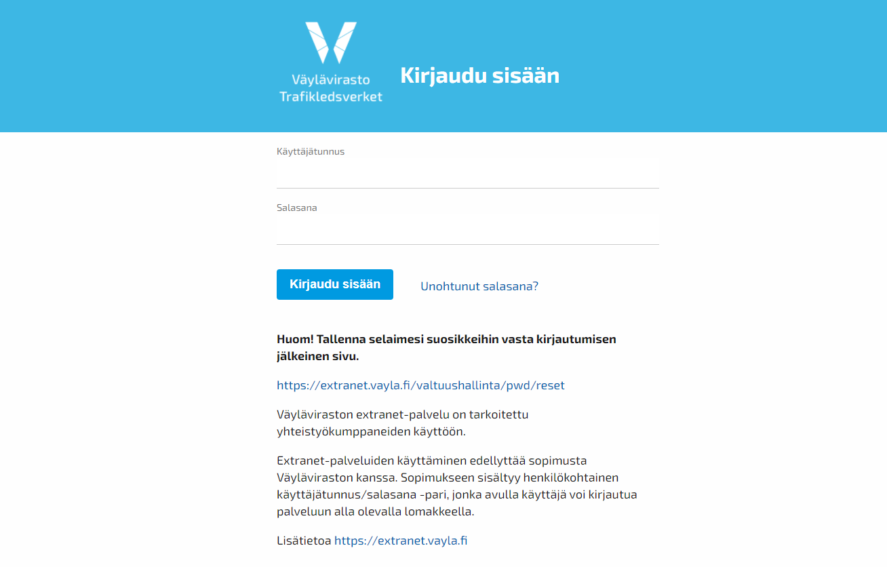

_Kirjautuminen Digiroadiin._

Kirjautumisen j&auml;lkeen avautuu Digiroad-selainsovelluksen karttak&auml;ytt&ouml;liittym&auml;n katselutila. Maantieteellisesti kartalla on n&auml;kyviss&auml; alue, johon k&auml;ytt&auml;j&auml;ll&auml; on oikeudet (kts. [Miten p&auml;&auml;st&auml; alkuun](#1._Miten_p&auml;&auml;st&auml;_alkuun?)).

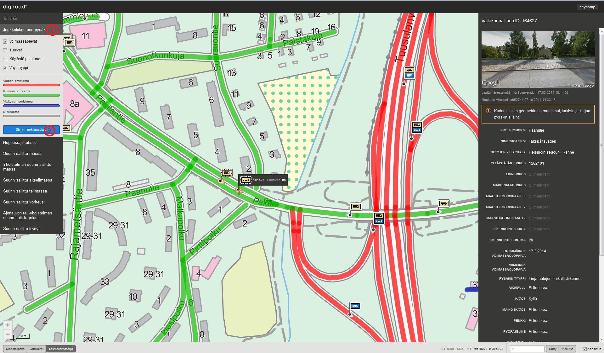

_Karttak&auml;ytt&ouml;liittym&auml;n katselutila._

Mik&auml;li kirjautumisen j&auml;lkeen ei avaudu karttak&auml;ytt&ouml;liittym&auml;n katselutilaa, ei k&auml;ytt&auml;j&auml;ll&auml; ole oikeuksia Digiroad-sovellukseen. Digiroad-oikeuksia voi pyyt&auml;&auml; Digiroad-palvelusta (kts. [Miten p&auml;&auml;st&auml; alkuun](#1._Miten_p&auml;&auml;st&auml;_alkuun?)).

2. Yleist&auml;
----------

Sovelluksella on kaksi tilaa: katselu- ja muokkaustila. Jos k&auml;ytt&auml;j&auml;n rooli on katselija tai vierailija, h&auml;n p&auml;&auml;see vain katselutilaan. Muokkaajan roolissa oleva k&auml;ytt&auml;j&auml; p&auml;&auml;see sek&auml; katselu- ett&auml; muokkaustilaan. Kirjautumisen j&auml;lkeen avautuu katselutila, jossa voi ainoastaan katsella eri tietolajeja, esimerkiksi pys&auml;kkej&auml; ja nopeusrajoituksia. 

Tietolajien muokkaus suoritetaan muokkaustilassa. Molemmissa tiloissa n&auml;kyv&auml;t ainoastaan ne tietolajit, joihin k&auml;ytt&auml;j&auml;ll&auml; on oikeudet (kts. [Miten p&auml;&auml;st&auml; alkuun](#1._Miten_p&auml;&auml;st&auml;_alkuun?)). Kartalle voi valita yhden tietolajin kerrallaan. Tietolaji valitaan sivun vasemman yl&auml;kulman tietolajit-paletista(1).

_Tietolajivalikko._

Muokkaustilan saa aktivoitua tietolajikohtaisesti klikkaamalla "Siirry muokkaustilaan"-painiketta. Muokkaustilassa kartan yl&auml;osassa on teksti "Olet muokkaustilassa. Kuntak&auml;ytt&auml;jien tulee kohdistaa muutokset katuverkolle, ELY-k&auml;ytt&auml;jien maantieverkolle." (2). Muokkaustilassa tehdyt muutokset tallentuvat painamalla "Tallenna"-painiketta (3). Muutosten tallentamisen j&auml;lkeen tietolajille tallentuu Muokattu viimeksi -kohtaan muokkaajan k&auml;ytt&auml;j&auml;tunnus, p&auml;iv&auml;m&auml;&auml;r&auml; ja kellonaika (5). Ennen tallentamista voi tehdyt muutokset peruuttaa painamalla Peruuta-painiketta (4). Tallenna- ja Peruuta -painikkeet eiv&auml;t ole aktiivisia, kun muutoksia ei ole tehty. Jos muutoksia on tehnyt eik&auml; niit&auml; peru tai tallenna ja siirtyy muokkaamaan toista kohdetta tai pois auki olevan tietolajin muokkaustilasta, sovellus antaa muutos-ilmoituksen, joka kertoo, ett&auml; muutoksia on tehty ja ne tulee tallentaa tai peruuttaa ennen kuin voi jatkaa. Takaisin katselutilaan p&auml;&auml;see klikkaamalla "Siirry katselutilaan"-painiketta (6).

Kaikki tietolajit n&auml;kyv&auml;t sek&auml; katselu- ett&auml; muokkaustilassa vain, kun kartan mittakaava on 1:20 000 tai tarkempi. Sovellus ilmoittaa, kun kartan mittakaava on liian ep&auml;tarkka tietolajin n&auml;kymiselle.

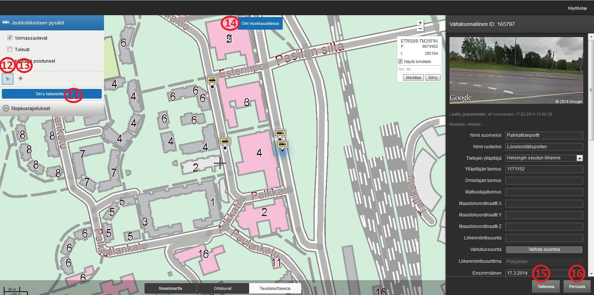

_Muokkaustila._

2.1 Karttan&auml;kym&auml;n muokkaus
--------------------------

####Kartan liikutus####

Karttaa liikutetaan raahaamalla.

####Mittakaavataso####

Kartan mittakaavatasoa muutetaan joko hiiren rullalla, tuplaklikkaamalla, Shift+piirto (alue) tai mittakaavapainikkeista  (7). Mittakaavapainikkeita k&auml;ytt&auml;m&auml;ll&auml; kartan keskitys s&auml;ilyy. Hiiren rullalla, tuplaklikkaamalla tai Shift+piirto (alue) kartan keskitys siirtyy kursorin kohtaan.  K&auml;yt&ouml;ss&auml; oleva mittakaavataso n&auml;kyy kartan oikeassa alakulmassa (9).

####Karttahaut####

K&auml;ytt&ouml;liittym&auml;ss&auml; on hakukentt&auml; (2), jossa voi hakea koordinaateilla, katuosoitteella tai tieosoitteella. Haku suoritetaan kirjoittamalla hakuehto hakukentt&auml;&auml;n ja klikkaamalla Hae. Hakutulos tulee listaan hakukent&auml;n alle. Hakutuloslistassa ylimp&auml;n&auml; on maantieteellisesti kartan nykyist&auml; keskipistett&auml; l&auml;himp&auml;n&auml; oleva kohde. Mik&auml;li hakutuloksia on vain yksi, keskittyy kartta automaattisesti haettuun kohteeseen. Jos hakutuloksia on useampi kuin yksi, t&auml;ytyy listalta valita tulos, jolloin kartta keskittyy siihen. Tyhjenn&auml; tulokset -painike tyhjent&auml;&auml; hakutuloslistan.

Koordinaateilla haku: Koordinaatit sy&ouml;tet&auml;&auml;n muodossa "pohjoinen (7 merkki&auml;), it&auml; (6 merkki&auml;)". Koordinaatit tulee olla ETRS89-TM35FIN -koordinaattij&auml;rjestelm&auml;ss&auml;. Esim. "6975061, 535628".

Katuosoitteella haku: Katuosoitteesta hakukentt&auml;&auml;n voi sy&ouml;tt&auml;&auml; koko ositteen tai sen osan. Esim. "Mannerheimintie" tai "Mannerheimintie 10, Helsinki".

Tieosoitteella haku: Tieosoitteesta hakukentt&auml;&auml;n voi sy&ouml;tt&auml;&auml; koko osoitteen tai osan siit&auml;. Esim. "2" tai "2 1 150".

####Merkitse piste kartalla####

Merkitse-painike (10) merkitsee sinisen pisteen kartan keskipisteeseen. Merkki poistuu vain, kun merkit&auml;&auml;n uusi piste kartalta. Merkitse-painikkeen vieress&auml; olevat koordinaatit seuraavat kartan keskipistett&auml; ja p&auml;ivittyv&auml;t, kun kartan keskipiste muuttuu.

####Taustakartat####

Taustakartaksi voi valita maastokartan, ortokuvat tai taustakarttasarjan. (8)

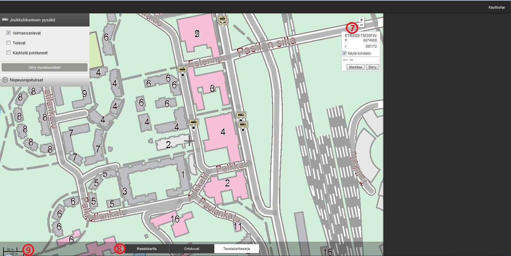

_Karttan&auml;kym&auml;n muokkaus._

##2.2. Historiatietojen esitt&auml;minen kartalla##

OTH:ssa on mahdollista piirt&auml;&auml; n&auml;kyviin my&ouml;s historiatiedot aiemmin poistuneiden geometriatietojen osalta. Toiminnallisuuden tavoitteena on helpottaa yll&auml;pit&auml;j&auml;&auml; t&auml;ydent&auml;m&auml;&auml;n uusien linkkien puuttuvia ominaisuustietoja. Toistaiseksi historiatietoja on mahdollista katsella tielinkkien toiminnallisten luokkien ja nopeusrajoitustiedon osalta. 
Historiatiedot otetaan piirtoon valitsemalla ensin aktiiviseksi se tietolaji, jota halutaan tarkastella. Tietolaji valitaan vasemmassa yl&auml;kulmassa olevasta valikosta (1). Kun haluttu tietolaji on piirrossa, valitaan sivun vasemmasta alalaidasta rasti ruutuun kohdassa ”n&auml;yt&auml; poistuneet linkit” (2).

_Kuvassa on piirrossa linkkien toiminnallisen luokan historiatiedot._

3. Tielinkki
------------

Tielinkki on tien, kadun, kevyen liikenteen v&auml;yl&auml;n tai lauttayhteyden keskilinjageometrian pienin yksikk&ouml;. Tielinkin ominaisuustiedot ovat aina voimassa koko tielinkin matkalla. Karttan&auml;kym&auml;&auml;n valitaan tielinkit valitsemalla tietolajit-paletista Tielinkit.

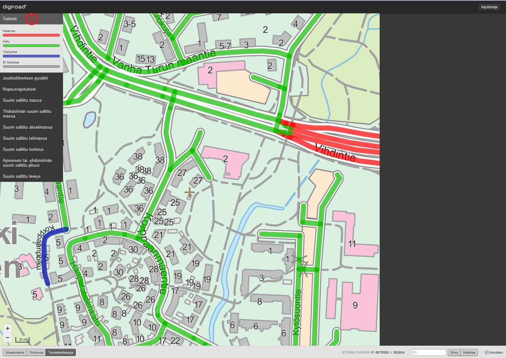

_Tielinkit._

 
####Tielinkkien haku####

Tielinkkej&auml; haetaan tielinkin ID:ll&auml; yksil&ouml;idyll&auml; URL-osoitteella. Linkin ID:n saa k&auml;ytt&ouml;liittym&auml;ss&auml; n&auml;kyviin tuplaklikkaamalla tielinkki&auml;, jolloin oikeaan laitaan avautuu tielinkin ominaisuustieton&auml;kym&auml;. Ominaisuustieton&auml;kym&auml;ss&auml; linkin ID on ylimp&auml;n&auml;. Esimerkki URL-osoitteesta:

 <a href=https://extranet.liikennevirasto.fi/digiroad/#linkProperty/373320541 target="_blank">https://extranet.liikennevirasto.fi/digiroad/#linkProperty/373320541 </a>

jossa numerosarja 373320541 on tielinkin ID. Toiminto tarkentaa karttak&auml;tt&ouml;liittym&auml;n haetun tielinkin kohdalle. Tielinkin ominaisuustieton&auml;kym&auml; aukeaa sivun oikealle puolelle.

##3.1 Tielinkin tietojen katselu##

Yksitt&auml;isen tielinkin voi valita klikkaamalla kartalta sen geometriaa. Tielinkin ominaisuustiedot avautuvat ominaisuustieton&auml;kym&auml;&auml;n (1). Tielinkin ominaisuustietoja ovat:

- Linkin ID
- hallinnollinen luokka
- toiminnallinen luokka
- liikennevirran suunta
- tielinkin tyyppi
- tieto tasosijainnista eli silta, alikulku tai tunneli
- kuntanumero
- tien nimi (suomi, ruotsi, saame)
- tien numero
- tieosanumero
- osoitenumerot vasemmalla ja oikealla (ensimm&auml;inen ja viimeinen numero)
- Maanmittauslaitoksen ID (MML ID)

Kerran klikkaamalla tulee valituksi koko tielinkkiketju. Tielinkkiketjussa kaikilla tielinkeill&auml; on sama hallinnollinen luokka, toiminnallinen luokka, tielinkin tyyppi, liikennevirran suunta ja tiennumero (maantiet) tai tien nimi (katuverkko ja yksityistie). Jos k&auml;ytt&auml;j&auml; haluaa valita vain yhden linkin, sen voi tehd&auml; tuplaklikkaamalla linkki&auml;.

Valitun tielinkkiketjun tai yksitt&auml;isen tielinkin geometria korostuu kartalla. Sivun oikeaan laitaan avautuu tielinkin ominaisuustieton&auml;kym&auml;. Jos tielinkkiketju jatkuu kuntarajan yli, tiennumerolla on useita tien nimi&auml; tai useita tieosanumeroita, kirjataan n&auml;m&auml; kaikki tiedot ominaisuustieton&auml;kym&auml;&auml;n.

Kun tielinkkiketju on valittuna, eiv&auml;t osoitenumerot ja silta, alikulku tai tunneli -tiedot n&auml;y ominaisuustieton&auml;kym&auml;ss&auml;. Jos k&auml;ytt&auml;j&auml; haluaa tarkastella n&auml;it&auml; tietoja, tulee tielinkki valita yksitt&auml;in tuplaklikkaamalla.

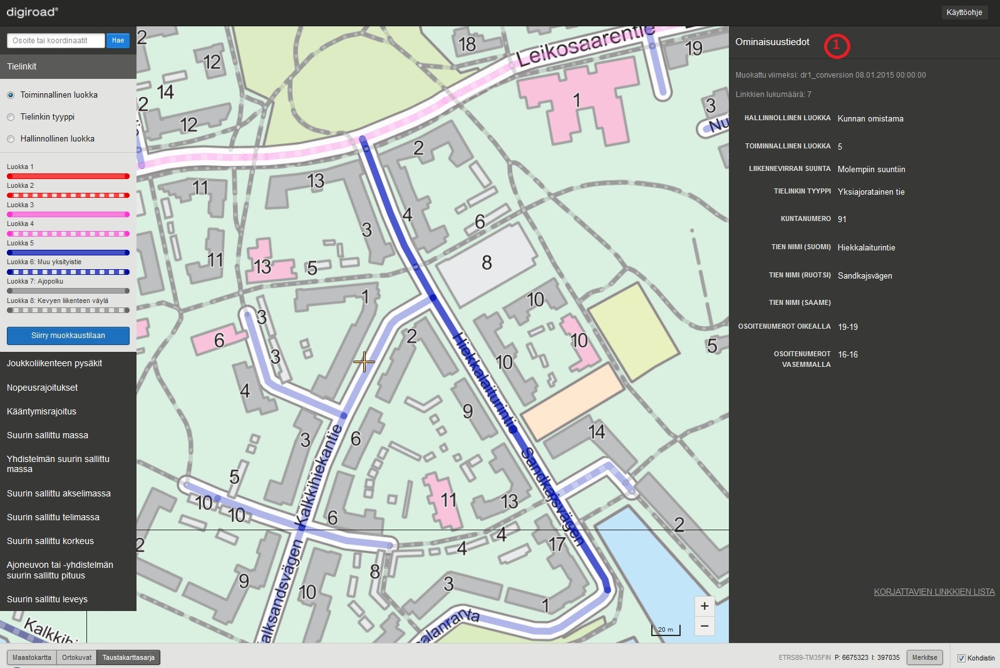

_Tielinkkiketjun valinta (klikattu kerran)._

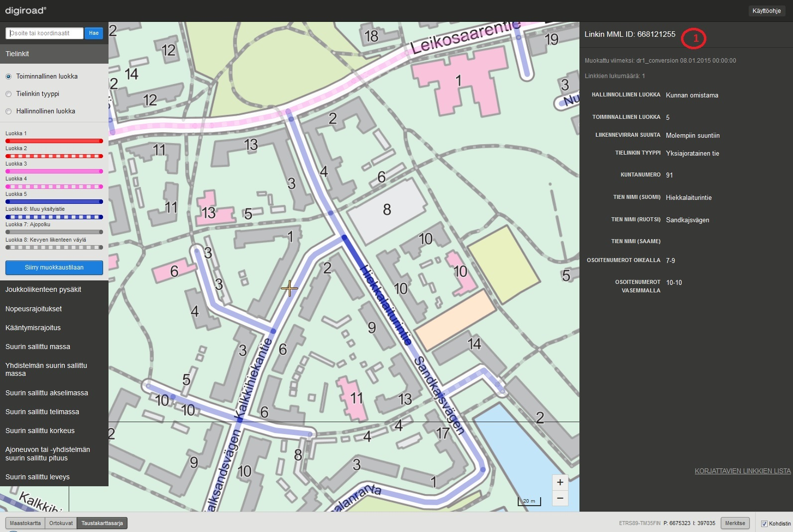

_Yksitt&auml;isen tielinkin valinta (tuplaklikkaus)._

Tielinkeille voi valita visualisoinnin Tietolajit -paletista tielinkkien alta. Visualisoinnin voi valita toiminnallisen luokan, tielinkin tyypin, hallinnollisen luokan tai silta, alikulku tai tunneli -tason mukaan. Silta, alikulku tai tunneli -tasolla kohteet piirret&auml;&auml;n kartalle tasosijainnin mukaisessa j&auml;rjestyksess&auml;, esimerkiksi alikulku piirret&auml;&auml;n silta, taso 1 -linkin alle. Valinnan mukaan visualisoinnin selitteet n&auml;kyv&auml;t sovelluksen vasemmassa laidassa. Lis&auml;ksi tielinkill&auml; on visualisoitu suuntanuoli, mik&auml;li tielinkin liikennevirran suunta on vain toiseen suuntaan.

Toiminnallisen luokan selitteet ovat:

Luokka 1: Ohjeellisesti valtatie tai seudullinen p&auml;&auml;katu
Luokka 2: Ohjeellisesti kantatie tai seudullinen p&auml;&auml;katu
Luokka 3: Ohjeellisesti seututie tai alueellinen p&auml;&auml;katu
Luokka 4: Ohjeellisesti yhdystie tai kokoojakatu
Luokka 5: Liitynt&auml;katu, t&auml;rke&auml; yksityistie
Luokka 6: Muu yksityistie
Luokka 7: Ajopolku
Luokka 8: Kevyen liikenteen v&auml;yl&auml;

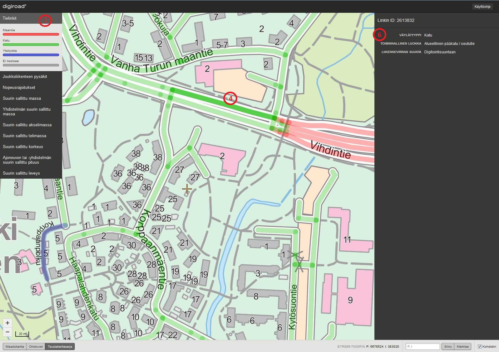

_Tielinkit visualisoitu toiminnallisen luokan mukaan._

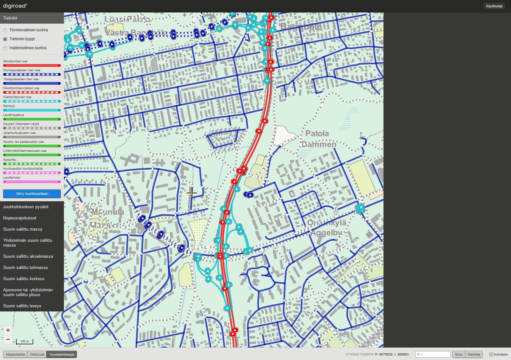

_Tielinkit visualisoitu tielinkin tyypin mukaan._

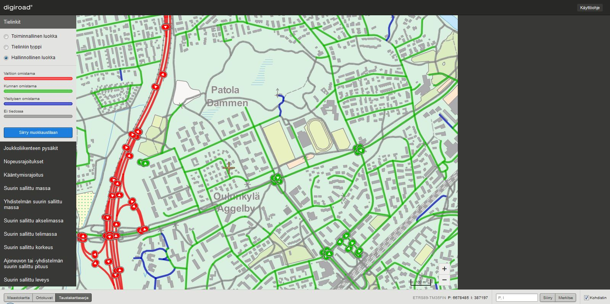

_Tielinkit visualisoitu hallinnollisen luokan mukaan._

_Tielinkit visualisoitu silta, alkulku tai tunneli -tason mukaan._

##3.2 Tielinkin ominaisuustietojen muokkaus##

Yksitt&auml;isen tielinkin ominaisuustietoja voi muokata siirtym&auml;ll&auml; muokkaustilaan.

Muokattava tielinkki valitaan klikkaamalla sen geometriaa (2). Kerran klikkaamalla tulee valituksi koko tielinkkiketju, eli ominaisuustiedoiltaan yhtenev&auml;t tielinkit.

Jos k&auml;ytt&auml;j&auml; haluaa valita vain yhden tielinkin, sen voi tehd&auml; tuplaklikkamalla tielinkki&auml;.

Tielinkin ominaisuustiedoista toiminnallinen luokka, liikennevirran suunta ja tielinkin tyyppi ovat muokattavissa (3). Ketjuvalinta korjaa kaikkien ketjuun valittuna olevien tielinkkien tiedot.

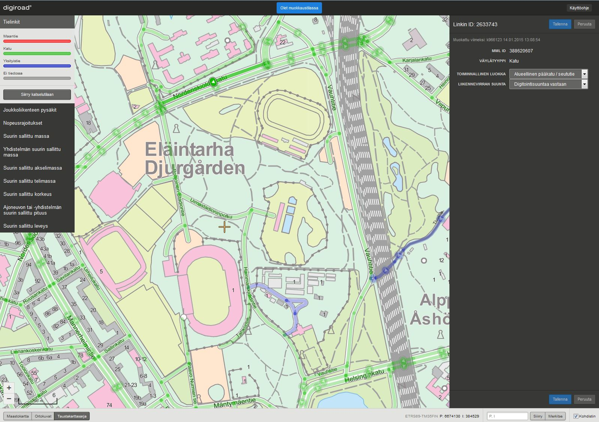

_Tielinkin ominaisuustietojen muokkaus. Valittuna tielinkkiketju (klikattu kerran)._

 
####Tielinkkien muokkaus aluevalintaty&ouml;kalulla####

Useamman tielinkin arvoa tietyll&auml; alueella voi muokata aluevalintaty&ouml;kalulla. Halutut tielinkit valitaan painamalla Ctrl-painike n&auml;pp&auml;imist&ouml;lt&auml; pohjaan ja piirt&auml;m&auml;ll&auml; hiiren vasen painike pohjassa laatikko tielinkkien p&auml;&auml;lle. Valituksi tulevat kaikki tielinkit laatikon sis&auml;ll&auml; ja tielinkit, joita laatikko leikkaa. Valitut tielinkit korostuvat kartalla. Valinnan j&auml;lkeen avautuu ikkuna, jossa voi valita tielinkeille alasvetovalikoista uuden toiminnallisen luokan (3) ja /tai tielinkin tyypin (4). Muutokset tallennetaan tallenna-painikkeesta. Jos alasvetovalikosta ei valita uutta arvoa, s&auml;ilyy tielinkill&auml; vanha arvo. Peruuta-painikkeesta voi perua muutoksen.

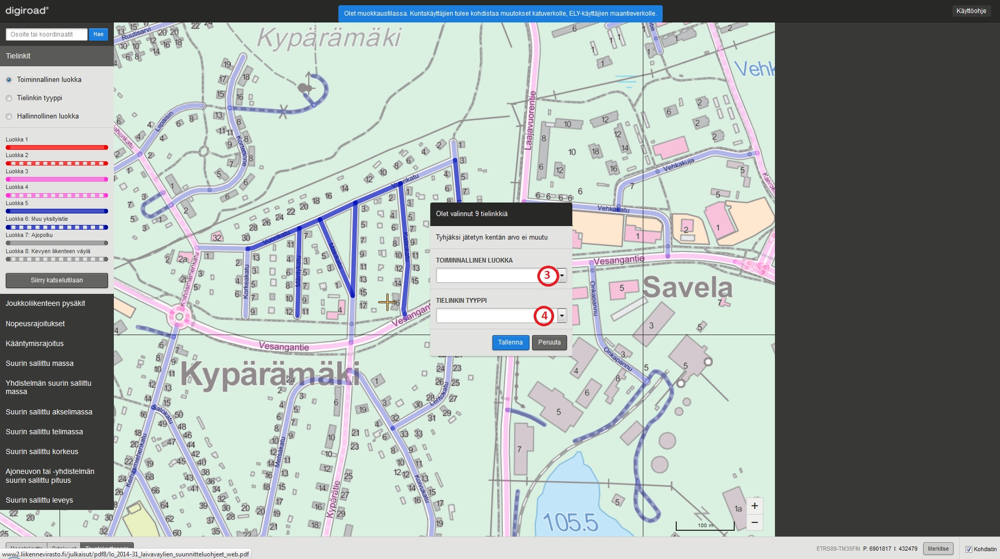

_Tielinkkien p&auml;ivitys aluevalintaty&ouml;kalulla._

 
####Korjattavat tielinkit####

Uudet linkit ovat korjattavien linkkien listalla, koska niilt&auml; puuttuu toiminnallinen luokka tai linkin tyyppi (1). Korjattavien linkkien lista on luokiteltu tien omistajuuden mukaan. Linkki on kartalla musta, kunnes tieto on lis&auml;tty. Korjattavien linkkien listaan p&auml;&auml;see tielinkki-tasolta ominaisuustietotaulun alareunassa olevan painikkeen kautta (2). Listasta voi klikata korjattavaa tielinkki&auml; (3), jolloin sovellus avautuu kyseisen linkin kohdalta. Korjattava linkki poistuu listalta vasta sitten, kun sille on lis&auml;tty sek&auml; toiminnallinen luokka ett&auml; linkkityyppi. 

Korjattavilla linkeill&auml; on liikennevirran suunta -tieto valmiina. Tieto tulee Maanmittauslaitokselta geometriatiedon yhteydess&auml;. Jos tiedoissa on virheit&auml;, voi virheelliset liikennevirran suunta -tiedot voi korjata k&auml;ytt&ouml;liittym&auml;ss&auml; samalla kun linkille lis&auml;t&auml;&auml;n toiminnallinen luokka ja linkkityyppi. Korjattavien linkkien listaan ei tule uusia kevyen liikenteen v&auml;ylien, ajopolkujen ja ajoteiden tielinkkej&auml;, koska n&auml;iden tiedot saadaan Maanmittauslaitokselta. Toiminnallinen luokka ja tielinkin tyyppi t&auml;ydennet&auml;&auml;n n&auml;ille tielinkille automaattisesti. 

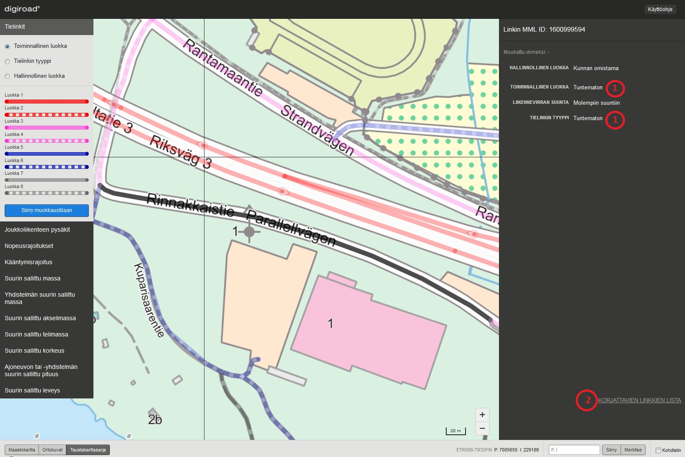

_Korjattava linkki._

_Korjattavien linkkien lista._

4. Joukkoliikenteen pys&auml;kki
--------------------------------

Joukkoliikenteen pys&auml;kit ovat julkisen liikenteen k&auml;yt&ouml;ss&auml; olevia pys&auml;kkej&auml;: linja-autojen paikallisliikenteen, linja-autojen kaukoliikenteen, linja-autojen pikavuorojen ja raitiovaunujen pys&auml;kit sek&auml; virtuaalipys&auml;kit. Karttan&auml;kym&auml;&auml;n voi valita pys&auml;kkej&auml; valitsemalla tietolajit-paletista (1) Joukkoliikenteen pys&auml;kit. Pys&auml;kkej&auml; valitaan pys&auml;kin voimassaolon mukaan: voimassa olevat, tulevat ja/tai k&auml;yt&ouml;st&auml; poistuneet. Valitseminen toimii samalla tavalla sek&auml; katselu- ett&auml; muokkaustilassa.

Tielinkeill&auml; on pys&auml;kkin&auml;kym&auml;ss&auml; oletuksena v&auml;rill&auml; korostettu Hallinnollinen luokka -valinta p&auml;&auml;ll&auml;. Valinnan saa pois klikkamalla tietolajit-valikon (1) "Joukkoliikenteen pys&auml;kit" kohdasta Hallinnollinen luokka-valinnan pois. Sininen v&auml;ri tarkoittaa yksityisen omistamaa tielinkki&auml;, vihre&auml; kunnan omistamaa ja punainen valtion omistamaa. Harmaalla korostettujen tielinkkien omistaja ei ole tiedossa. 

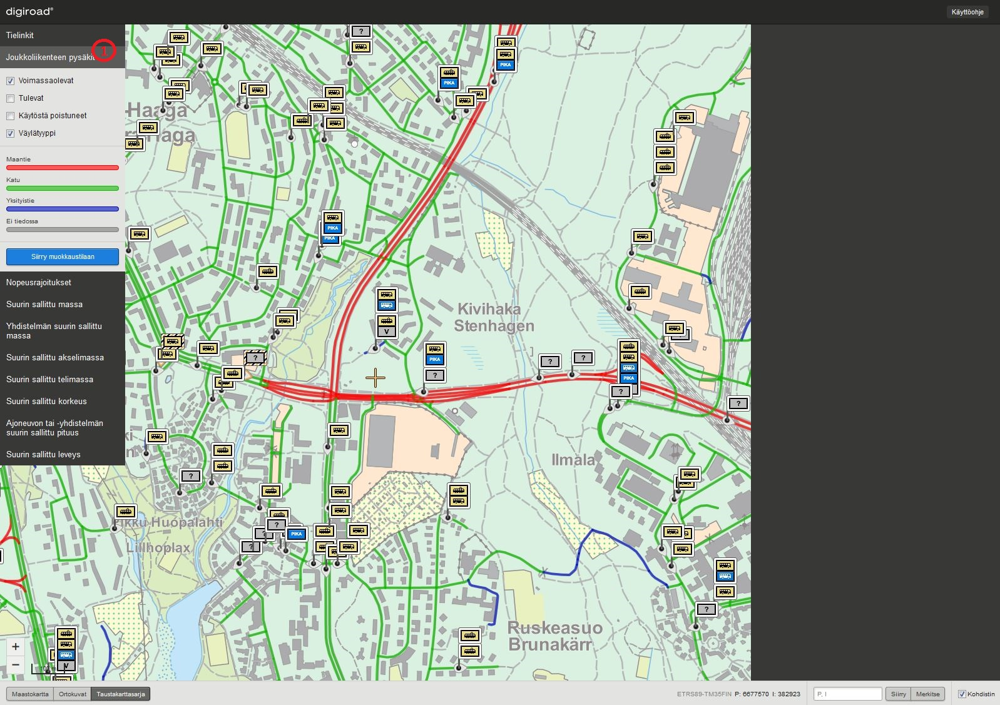

_Joukkoliikenteen pys&auml;kkien valinta._

##4.1 Joukkoliikenteen pys&auml;kkien haku##

Joukkoliikenteen pys&auml;kkej&auml; haetaan pys&auml;kin valtakunnallisella ID:ll&auml; yksil&ouml;idyll&auml; URL-osoitteella. Sovelluksen t&auml;ytyy olla pys&auml;kkin&auml;kym&auml;ss&auml; pys&auml;kki&auml; haettaessa. Esimerkki URL-osoitteesta:

 <a href=https://extranet.liikennevirasto.fi/digiroad/#massTransitStop/95374  target="_blank">https://extranet.liikennevirasto.fi/digiroad/#massTransitStop/95374   </a>(17)

jossa numerosarja 95374 on pys&auml;kin valtakunnallinen ID. Toiminto tarkentaa karttak&auml;ytt&ouml;liittym&auml;n katselutilan haetun pys&auml;kin kohdalle. Pys&auml;kin ominaisuustieton&auml;kym&auml; (6) aukeaa sivun oikealle puolelle. 

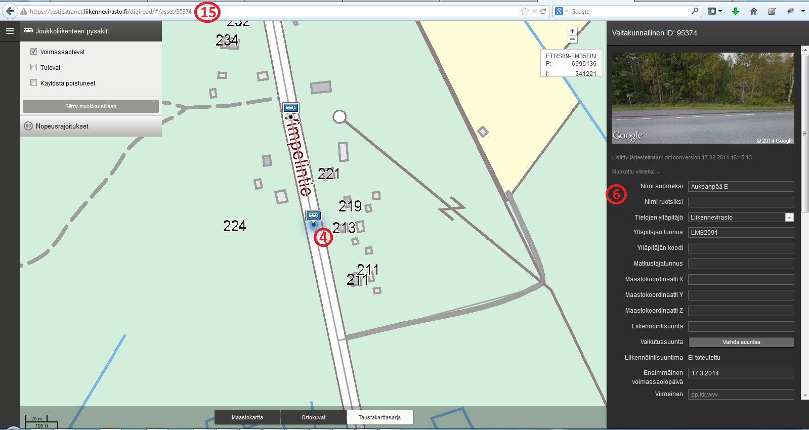

_Joukkoliikenteen pys&auml;kkien haku._

##4.2 Pys&auml;kin tietojen katselu##

Yksitt&auml;isen pys&auml;kin ominaisuustiedot tulevat n&auml;kyviin, kun pys&auml;kki&auml; klikataan. T&auml;ll&ouml;in sivun oikeaan laitaan avautuu Google Street View (5) ja ominaisuustieto -n&auml;kym&auml;t (6). Valitulle pys&auml;kille avautuu infokupla, jossa n&auml;kyy pys&auml;kin valtakunnallinen ID, suomenkielinen nimi, liikenn&ouml;intisuuntima ja pys&auml;kin tyyppi kuvana. (4)

Jos kaksi tai useampi pys&auml;kki ovat alle kuuden metrin p&auml;&auml;ss&auml; toisistaan, esitet&auml;&auml;n pys&auml;kit k&auml;ytt&ouml;liittym&auml;ss&auml; p&auml;&auml;llekk&auml;in ryhmiteltyn&auml;. P&auml;&auml;llekk&auml;in asettelu mahdollistaa pys&auml;kin tarkastelun ilman, ett&auml; samassa sijainnissa olevia pys&auml;kkej&auml; tarvitsee siirt&auml;&auml;. 

Ominaisuustieto-n&auml;kym&auml;ss&auml; kentti&auml; ei voi muokata. Google Street View -kuvaa klikkaamalla avautuu Google Street View uudelle v&auml;lilehdelle. Huom! Kun Google Street View avautuu, ei k&auml;ytt&auml;j&auml; ole siell&auml; t&auml;ysin samassa kohdassa, mik&auml; sovelluksessa n&auml;kyy pys&auml;kin ominaisuustiedoissa. Sijaintiheitto on noin 50-100 metri&auml;. Virhe johtuu Googlen tekemist&auml; muutoksista Street Viewiin. T&auml;m&auml; ei kuitenkaan vaikuta pys&auml;kin asetteluun Digiroad-sovelluksessa siell&auml; n&auml;kyv&auml;n Street View n&auml;kym&auml;n avulla.

Pys&auml;kin valinnan saa pois klikkaamalla karttaa.

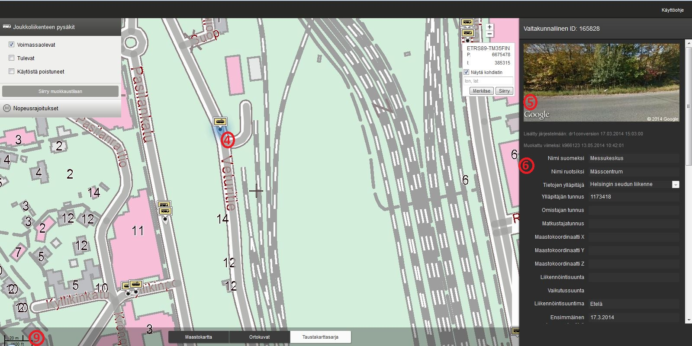

_Joukkoliikenteen pys&auml;kin tietojen katselu._

##4.3 Kelluvat pys&auml;kit##

Joukkoliikenteen pys&auml;kki voi olla kelluva, jos tielinkkigeometria sen alla on muuttunut niin paljon, ettei j&auml;rjestelm&auml; pysty en&auml;&auml; p&auml;&auml;ttelem&auml;&auml;n sen sijaintia geometrialla. Kelluvat pys&auml;kit on korostettu karttan&auml;kym&auml;ss&auml; alla olevan kuvan tavoin, ja niiden ominaisuustieton&auml;kym&auml;ss&auml; on huomautus, ett&auml; pys&auml;kki tulisi siirt&auml;&auml; tielinkille, jotta kelluvuus poistuu (kts. [Pys&auml;kin siirt&auml;minen](#Pys&auml;kin_siirt&auml;minen)). 

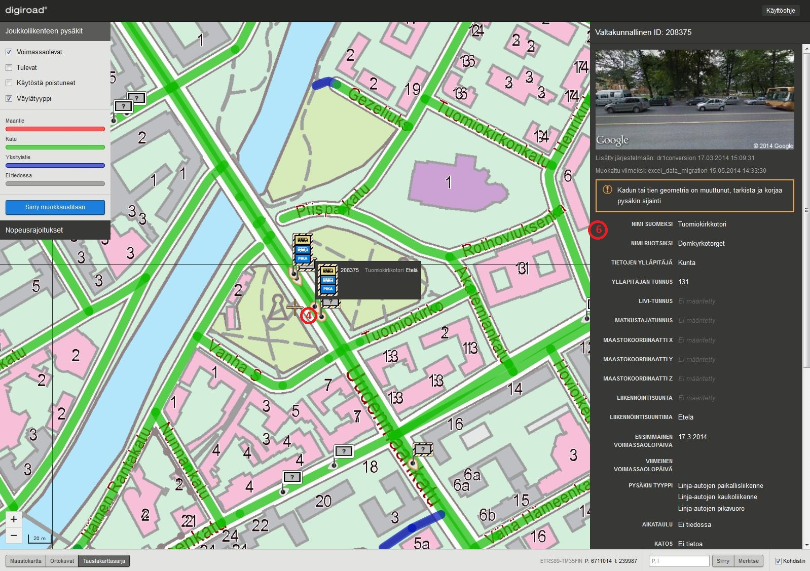

_Kelluvat pys&auml;kit on visualisoitu eri tavoin._

 
Kelluvat pys&auml;kit on listattu omaan listaan, johon on linkki pys&auml;kkien ominaisuustieton&auml;kym&auml;ss&auml; (1). Pys&auml;kit on jaoteltu listalle kunnan sek&auml; kunnan sis&auml;ll&auml; hallinnollisen luokan (kunta, valtio, yksityinen) mukaan. Listalla n&auml;kyy vain ne pys&auml;kit, joihin k&auml;ytt&auml;j&auml;ll&auml; on muokkausoikeus. Kelluvasta pys&auml;kist&auml; on listassa linkki, josta p&auml;&auml;see suoraan pys&auml;kin kohdalle sovelluksessa ja sen voi siirt&auml;&auml; takaisin geometrialle. Lista sulkeutuu Sulje lista -painikkeesta.

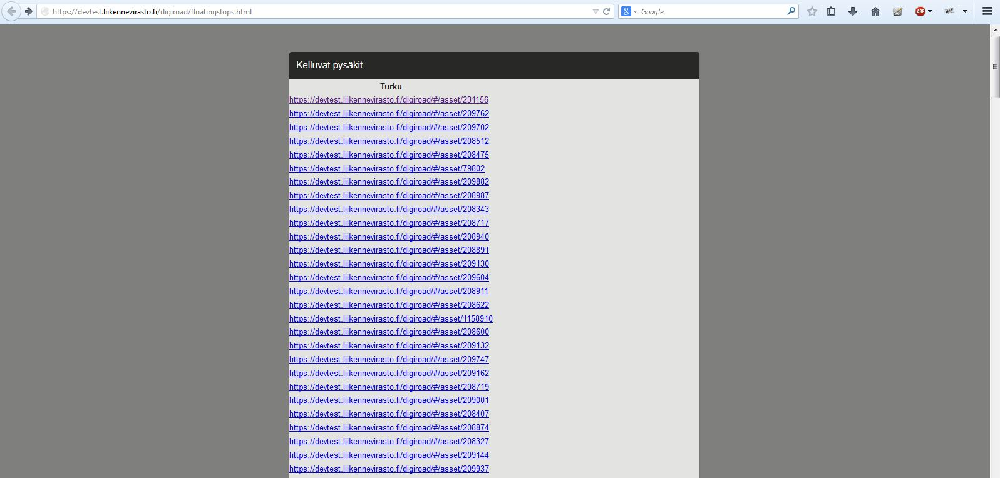

_Kelluvien pys&auml;kkien lista._

##4.4 Joukkoliikenteen pys&auml;kin ominaisuustietojen muokkaus##

Yksitt&auml;isen pys&auml;kin ominaisuustietoja voi muokata valitsemalla muokkausty&ouml;kalun (12). Muokattava pys&auml;kki valitaan hiirell&auml; klikkaamalla. P&auml;&auml;llekk&auml;in esitetyist&auml; pys&auml;keist&auml; voi valita yhden pys&auml;kin klikkaamalla pys&auml;kki&auml;. Pinosta valitun pys&auml;kin erottaa sille avautuvasta infoikkunasta. Valittaessa pys&auml;kin sivun oikeaan laitaan avautuu Google Street View -n&auml;kym&auml; (5) pys&auml;kist&auml; sek&auml; pys&auml;kin ominaisuustiedot (6). Jos pys&auml;kill&auml; ei ole tyyppi&auml;, tulee se asettaa ennen tallentamista. Pys&auml;kkien ominaisuustieton&auml;kym&auml;ss&auml; n&auml;kyy ilmoitus, jos pys&auml;kilt&auml; puuttuu pakollisia tietoja.

Pys&auml;kin valinnan saa pois klikkaamalla karttaa, kun tallennus tai peruutus on tehty.

Muokkaustoiminnallisuudet poikkeavat hieman kunnan kadun ja maantien pys&auml;kkien v&auml;lill&auml;, riippuen siit&auml; onko pys&auml;kki kunnan vai Elyn yll&auml;pit&auml;m&auml;, eri ominaisuustietojen t&auml;ytt&auml;minen on sallittua. P&auml;&auml;s&auml;&auml;nt&ouml;n&auml; on, ett&auml; kuntak&auml;ytt&auml;j&auml;ll&auml; muokattavissa on kaikki ne kent&auml;t, joita h&auml;nen on enimmill&auml;&auml;n tarpeen muokata. Samoin ELYn pys&auml;kkivastaavalla on muokattavissa ne kent&auml;t, joita h&auml;nen on tarpeen yll&auml;pit&auml;&auml; (t&auml;ydent&auml;v&auml;t varustetiedot yll&auml;pidet&auml;&auml;n HARJA-j&auml;rjestelm&auml;ss&auml; ja ovat OTH-sovelluksessa ainoastaan read-only n&auml;kym&auml;n&auml;).

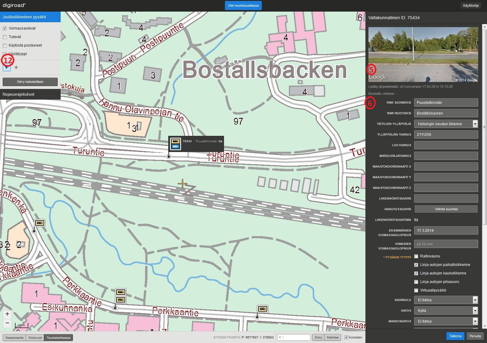

_Joukkoliikenteen pys&auml;kin ominaisuustietojen muokkaus._

##4.5 Pys&auml;kin vaikutussuunnan muuttaminen##

Googlen Street View -n&auml;kym&auml; (5) sivun oikeassa laidassa on suunnattu suuntaan, jossa pys&auml;kin tallennetun vaikutussuunnan mukaan kuuluisi olla. Painamalla n&auml;kym&auml;&auml; avautuu Googlen Street View -v&auml;lilehti, jossa pys&auml;kin ymp&auml;rist&ouml;&auml; voi tarkastella tarkemmin. Kartalla pys&auml;kin vaikutussuunta n&auml;kyy pisarana pys&auml;kkikuvakkeella (10). Pisaran k&auml;rki osoittaa pys&auml;kin vaikutussuunnan suuntaan.

Pys&auml;kin vaikutussuunnan voi muuttaa ominaisuustieton&auml;kym&auml;ss&auml; (6) painamalla "Vaihda suuntaa"-painiketta (18). Pys&auml;kin vaikutussuuntaa muutettaessa Googlen Street View -n&auml;kym&auml; (5) muuttuu vastaamaan uutta vaikutussuuntaa ja pisaran suunta k&auml;&auml;ntyy. Mik&auml;li ”Vaihda suuntaa” – painike ei ole valittavissa, on pys&auml;kki yksisuuntaisella tielinkill&auml;, eik&auml; sen suuntaa voida k&auml;&auml;nt&auml;&auml; ajoradan liikennevirran suunnan vastaiseksi. Jos tielinkin suunta on virheellinen (tai sen kuuluisi olla molempiin suuntiin, tulee ensin korjata tielinkin suunta, jotta pys&auml;kin suunta voidaan korjata).

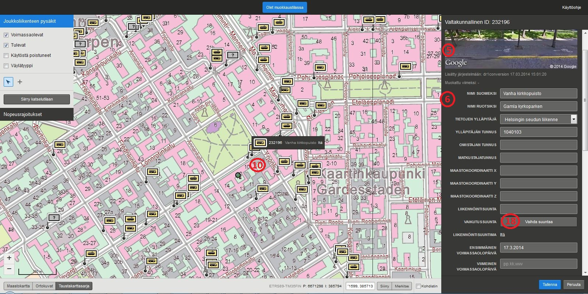

_Joukkoliikenteen pys&auml;kin vaikutussuunnan voi muuttaa painamalla "Vaihda suuntaa"-painiketta (18)._

##4.6 Pys&auml;kin voimassaolop&auml;ivien muokkaus##

Ensimm&auml;inen voimassaolop&auml;iv&auml; (19) tarkoittaa p&auml;iv&auml;m&auml;&auml;r&auml;&auml;, josta l&auml;htien pys&auml;kki on k&auml;yt&ouml;ss&auml;. Viimeinen voimassaolop&auml;iv&auml; (20) tarkoittaa p&auml;iv&auml;m&auml;&auml;r&auml;&auml;, jolloin pys&auml;kki on viimeisen kerran k&auml;yt&ouml;ss&auml;. Molempia p&auml;iv&auml;m&auml;&auml;ri&auml; voi muokata ominaisuustieto -n&auml;kym&auml;n (6) kautta. P&auml;iv&auml;m&auml;&auml;ri&auml; voi muokata joko kirjoittamalla ne p&auml;iv&auml;m&auml;&auml;r&auml;kentt&auml;&auml;n muodossa pp.kk.vvvv tai valitsemalla ne kalenterista, joka avautuu, kun p&auml;iv&auml;m&auml;&auml;r&auml;kentt&auml;&auml; klikkaa.

P&auml;iv&auml;m&auml;&auml;ri&auml; ei voi asettaa ristiin siten, ett&auml; "Ensimm&auml;inen voimassaolop&auml;iv&auml;" olisi my&ouml;hemmin kuin "Viimeinen voimassaolop&auml;iv&auml;". Kalenterissa ei-sallitut p&auml;iv&auml;m&auml;&auml;r&auml;t eiv&auml;t ole valittavissa. Jos p&auml;iv&auml;m&auml;&auml;r&auml;kentt&auml;&auml;n kirjoittaa p&auml;iv&auml;m&auml;&auml;r&auml;n, joka asettaa p&auml;iv&auml;m&auml;&auml;r&auml;t ristiin, ei p&auml;iv&auml;m&auml;&auml;r&auml; tallennu.

Jos "Ensimm&auml;inen voimassaolop&auml;iv&auml;" tai "Viimeinen voimassaolop&auml;iv&auml;" ei ole tiedossa, voi kalenterista valita "ei tietoa".
Maantien pys&auml;keille tallennetaan lis&auml;ksi inventointip&auml;iv&auml; tierekisterin tarpeita varten. Mik&auml;li inventointip&auml;iv&auml;-kentt&auml; j&auml;tet&auml;&auml;n tyhj&auml;ksi, generoi OTH siihen automaattisesti pys&auml;kin tallennushetken p&auml;iv&auml;m&auml;&auml;r&auml;n. Inventointip&auml;iv&auml; on muokattavissa sovelluksessa.

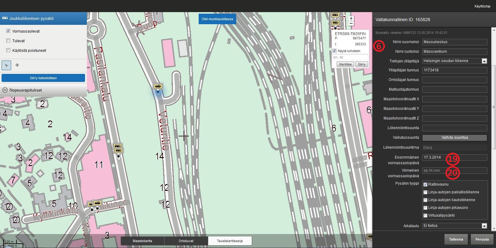

_Pys&auml;kin voimassaolop&auml;ivien muokkaus._

##4.7 Pys&auml;kin muiden ominaisuustietojen muokkaus##

Muita ominaisuustietoja voi muokata oikeassa laidassa olevan ominaisuustieton&auml;kym&auml;n (6) kautta. Tietoja muokataan joko kirjoittamalla tietokentt&auml;&auml;n, valitsemalla pudotusvalikosta tieto tai merkitsem&auml;ll&auml; rasti ruutuun oikean/oikeiden tietojen kohdalle.

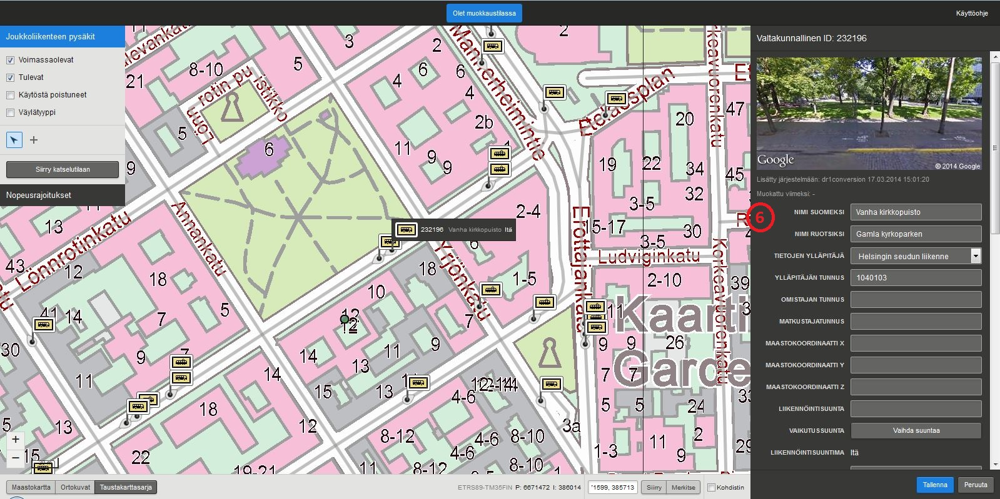

_Joukkoliikenteen pys&auml;kin ominaisuustietojen muokkaus._

 

####Ominaisuustiedot:####

Ominaisuustiedot ovat j&auml;rjestelm&auml;n generoimia tai k&auml;ytt&auml;j&auml;n sy&ouml;tt&auml;mi&auml;. Sy&ouml;tett&auml;v&auml;t ominaisuustietokent&auml;t ovat tekstikentti&auml;, joihin ominaisuustieto kirjoitetaan merkkijonona, monivalintoja, josta voi valita oikeat vaihtoehdot tai pudotusvalikkovalintoja, joista voi valita yhden vaihtoehdon. Maantien pys&auml;kin varustetiedoista ne, joita ei voi muokata sovelluksessa p&auml;ivittyv&auml;t tierekisterin kautta.

|Ominaisuustieto|Kuvaus|Sovellus generoi|T&auml;ydennet&auml;&auml;n vain kunnan pys&auml;kille|T&auml;ydennet&auml;&auml;n vain ELYn pys&auml;kille|
|------------------|--------------------------------------------------------------------------|:----------------:|:---------------:|:--------------:|
|Valtakunnallinen ID|Pys&auml;kin valtakunnallinen ID|X|||
|Lis&auml;tty j&auml;rjestelm&auml;&auml;n|Tiedon luojan k&auml;ytt&auml;j&auml;tunnus tai massaimportin l&auml;hde ja tiedon lis&auml;yshetki.|X|||
|Muokattu viimeksi|Muokkaajan k&auml;ytt&auml;j&auml;tunnus ja tiedon muokkaushetki.|X|||
|Nimi suomeksi|Pys&auml;kin nimi suomen kielell&auml;. Nimen tulee olla valtakunnallisesti yksil&ouml;iv&auml;. Esim. Ei "Linja-autoasema" vaan "Porvoo linja-autoasema".||||
|Nimi ruotsiksi|Pys&auml;kin nimi ruotsin kielell&auml;.||||
|Osoite suomeksi|Pys&auml;kin osoite suomen kielell&auml;. Tieto haettu pys&auml;keille tielinkilt&auml;. Lis&auml;t&auml;&auml;n manuaalisesti uusille pys&auml;keille ennen tallennusta||||
|Osoite ruotsiksi|Pys&auml;kin osoite ruotsin kielell&auml;.||||
|Tietojen yll&auml;pit&auml;j&auml;|Yll&auml;pit&auml;v&auml; viranomainen: kunta, ELY-keskus tai Helsingin seudun liikenne||||
|Yll&auml;pit&auml;j&auml;n tunnus|Tietojen yll&auml;pit&auml;j&auml;n sis&auml;inen tunnus pys&auml;kille.||||
|LIVI-tunnus|Pys&auml;kin Livi-tunniste, tallentuu automaattisesti my&ouml;s Tierekisteriin. K&auml;yt&ouml;ss&auml; vain maanteiden pys&auml;keill&auml;.|x||x|
|Matkustajatunnus|Pys&auml;kin tunnus, joka n&auml;kyy matkustajalle.||||
|Maastokoordinaatti X|Pys&auml;kin sijainnin mitattu X-koordinaatti: EUREF FIN ETRS89-TM35FIN.||||
|Maastokoordinaatti Y|Pys&auml;kin sijainnin mitattu Y-koordinaatti: EUREF FIN ETRS89-TM35FIN.||||
|Maastokoordinaatti Z|Pys&auml;kin sijainnin mitattu Z-koordinaatti: N2000 korkeusj&auml;rjestelm&auml;ss&auml;.||||
|Liikenn&ouml;intisuunta|Pys&auml;kin suunta sanallisesti kuvattuna. Esimerkiksi:"Keskustaan".||||
|Vaikutussuunta|Vaikutussuunta on visualisoitu pys&auml;kin liikennevirran suunnaksi pisaralla (9). Google Street View (4) osoittaa suuntaan, jossa pys&auml;kin kuuluisi olla.||||
|Liikenn&ouml;intisuuntima|Sovellus laskee itse tiegeometriasta. Pohjoinen on nolla astetta ja koko kierros my&ouml;t&auml;p&auml;iv&auml;&auml;n 360 astetta. Ilmoitetaan asteluvun mukaan pohjoinen, it&auml;, etel&auml; tai l&auml;nsi.|x|||
|Ensimm&auml;inen voimassaolop&auml;iv&auml;|P&auml;iv&auml;m&auml;&auml;r&auml;, jolloin pys&auml;kki on ensimm&auml;isen kerran k&auml;yt&ouml;ss&auml;.||||
|Viimeinen voimassaolop&auml;iv&auml;|P&auml;iv&auml;m&auml;&auml;r&auml;, jolloin pys&auml;kki on viimeisen kerran k&auml;yt&ouml;ss&auml;.||||
|Inventointip&auml;iv&auml;|Maantien pys&auml;kin muokkausp&auml;iv&auml;m&auml;&auml;r&auml;|||x|
|Pys&auml;kin tyyppi|Pakollinen tieto! Linja-autojen paikallisliikenne, raitiovaunu, linja-autojen kaukoliikenne, linja-autojen pikavuoro tai virtuaalipys&auml;kki (virtuaalipys&auml;kin kanssa ei voi valita muita tyyppej&auml;).||||
|Korotettu|Kyll&auml;, ei tai ei tietoa. Oletuksena on "ei tietoa".||||
|Katos|Pys&auml;kkialueella sijaitseva, joukkoliikennev&auml;linett&auml; odottaville matkustajille tarkoitettu s&auml;&auml;lt&auml; suojaava katos. Mahdolliset arvot: kyll&auml;, ei tai ei tietoa. Oletuksena on "ei tietoa".||||
|Mainoskatos|Pys&auml;kkialueella sijaitseva, joukkoliikennev&auml;linett&auml; odottaville matkustajille tarkoitettu s&auml;&auml;lt&auml; suojaava katos, joka sis&auml;lt&auml;&auml; mainoksia. Pys&auml;kin kunnossapidosta vastaa t&auml;ll&ouml;in mainosten yll&auml;pit&auml;j&auml;. Mahdolliset arvot: kyll&auml;, ei tai ei tietoa. Oletuksena on "ei tietoa".||||
|Roska-astia|Kyll&auml;, ei tai ei tietoa. Oletuksena on "ei tietoa". Maantien pys&auml;kille tieto Tierekisterist&auml;.||x||
|Py&ouml;r&auml;teline|Kyll&auml;, ei tai ei tietoa. Oletuksena on "ei tietoa". Maantien pys&auml;kille tieto Tierekisterist&auml;.||x||
|Valaistus|Pys&auml;kin valaistuksella tarkoitetaan yleisimmin pys&auml;kin kattoon upotettuja valoelementtej&auml;, jotka tuottavat valaistuksen pys&auml;kkikatoksen sis&auml;lle. Mahdolliset arvot: kyll&auml;, ei tai ei tietoa. Oletuksena on "ei tietoa". Maantien pys&auml;kille tieto Tierekisterist&auml;.||x||
|Penkki|Pys&auml;kkialueella sijaitseva, joukkoliikennett&auml; odottavilla matkustajille tarkoitettu penkki, joka sijaitsee yleisimmin pys&auml;kkikatoksen alla. Mahdolliset arvot: kyll&auml;, ei tai ei tietoa. Oletuksena on "ei tietoa". Maantien pys&auml;kille tieto Tierekisterist&auml;.||x||
|Aikataulu|Paperinen, pys&auml;kin sein&auml;&auml;n tai tolppaan aikataulukehikkoon kiinnitetty aikataulu, joka sis&auml;lt&auml;&auml; tiedot pys&auml;kill&auml; liikenn&ouml;ivien reittien l&auml;ht&ouml;ajoista sek&auml; mahdollisesti my&ouml;s pys&auml;kkikohtaisista ohitusajoista. Mahdolliset arvot: kyll&auml;, ei tai ei tietoa. Oletuksena on "ei tietoa".  Maantien pys&auml;kille tieto Tierekisterist&auml;.||x||
|S&auml;hk&ouml;inen aikataulun&auml;ytt&ouml;|Pys&auml;kkialueelta l&ouml;ytyv&auml; s&auml;hk&ouml;inen aikataulun&auml;ytt&ouml;, joka tuottaa reaaliaikaisen informaation pys&auml;kill&auml; kulkevasta liikenteest&auml;. Mahdolliset arvot: kyll&auml;, ei tai ei tietoa. Oletuksena on "ei tietoa".||||
|Esteett&ouml;myys liikuntarajoitteiselle|Pys&auml;kki on esteet&ouml;n, mik&auml;li se mahdollistaa itsen&auml;isen, esteett&ouml;m&auml;n matkustamisen ja odottelun my&ouml;s erityisryhmille, esim. py&ouml;r&auml;tuolilla liikkuville. Pys&auml;kin esteett&ouml;myyteen vaikuttavat pys&auml;kki- ja laiturirakenteiden, asema- ja terminaalirakenteiden sek&auml; aikatauluinformaation esteett&ouml;myys. Oletuksena on "ei tiedossa".||||
|Saattomahdollisuus henkil&ouml;autolla|Ilmaisee, mik&auml;li (valtatien varrella olevaa) pys&auml;ki&auml; varten on rakennettu erillinen matkustajien nouto/saatto-alue. Mahdolliset arvot: kyll&auml;, ei tai ei tietoa. Oletuksena on "ei tietoa".||||
|Liitynt&auml;pys&auml;k&ouml;intipaikkojen m&auml;&auml;r&auml;|Keskusta-alueen ulkopuolella olevan pys&auml;kki- tai terminaalialueen l&auml;heisyydess&auml; sijaitsevien, auton pys&auml;k&ouml;imist&auml; varten varattujen parkkipaikkojen m&auml;&auml;r&auml;. Kentt&auml; j&auml;tet&auml;&auml;n tyhj&auml;ksi, mik&auml;li liitynt&auml;pys&auml;k&ouml;intipaikkoja ei ole. Mik&auml;li liitynt&auml;pys&auml;k&ouml;intipaikat palvelevat useampaa pys&auml;kki&auml;, t&auml;ytet&auml;&auml;n tiedot liitynt&auml;pys&auml;k&ouml;innist&auml; erikseen kullekin pys&auml;kille.||||
|Liitynt&auml;pys&auml;k&ouml;innin lis&auml;tiedot|Pys&auml;kin yhteydess&auml; olevien liitynt&auml;pys&auml;k&ouml;intipaikkojen lis&auml;tiedot.||||
|Pys&auml;kin omistaja|Kunta, Helsingin seudun liikenne, ELY-keskus tai Liikennevirasto. Erikoistapauksia varten (esim. uudenmaan ELY).||||
|Palauteosoite|Osoite, johon pys&auml;kist&auml; voi laittaa palautetta. Esimerkiksi s&auml;hk&ouml;postiosoite.||||
|Lis&auml;tiedot|Julkiset kommentit. Esimerkiksi: "Alueella tiet&ouml;it&auml;".||||

##4.8 Pys&auml;kin siirt&auml;minen##

Pys&auml;kki&auml; siirret&auml;&auml;n k&auml;ytt&auml;m&auml;ll&auml; muokkausty&ouml;kalua (12). Pys&auml;kkej&auml; voi siirt&auml;&auml; vain tarpeeksi tarkalta mittakaavatasolta, joka on 1:10 000 tai tarkempi (9).

Siirt&auml;minen tapahtuu tarttumalla pys&auml;kkiin kiinni ja raahaamalla se oikeaan paikkaan. Pys&auml;kki liikkuu vain olemassa olevia tielinkkej&auml; (ei tielinkeill&auml;, jotka ovat kevyen liikenteen v&auml;yli&auml; tai lautta/lossi v&auml;yli&auml;) pitkin ja k&auml;ytt&auml;j&auml;n p&auml;ivitysoikeuksien sallimien maantieteellisten rajojen sis&auml;puolella. Jos pys&auml;kin irrottaa tielinkist&auml;, kiinnittyy se automaattisesti l&auml;himp&auml;&auml;n tielinkkiin, joka on k&auml;ytt&auml;j&auml;n p&auml;ivitysoikeuksien sallimalla maantietellisell&auml; alueella. Jos riitt&auml;v&auml;n l&auml;hell&auml;  ei ole toista tielinkki&auml;, ei pys&auml;kki irtoa linkilt&auml;, jolla se on. Tielinkki, jonka p&auml;&auml;ll&auml; pys&auml;kki on, n&auml;kyy sinisell&auml; korostusv&auml;rill&auml;. Kun pys&auml;kist&auml; p&auml;&auml;stet&auml;&auml;n irti (lasketaan se uuteen sijaintiin), oikealle avautuu Google Street View (5) ja ominaisuustieto -n&auml;kym&auml; (6), jonka kautta voi halutessaan muokata muita ominaisuustietoja. Pys&auml;kin siirt&auml;minen ei muuta pys&auml;kin mitattuja maastokoordinaatteja vaan ne s&auml;ilyv&auml;t ennallaan. 

**Kunnan yll&auml;pit&auml;m&auml;n pys&auml;kin siirt&auml;minen**

Kunnan yll&auml;pit&auml;m&auml;&auml; pys&auml;kki&auml; siirrett&auml;ess&auml; yli 50 metri&auml; sovellus kysyy varmistuksen siirrolle. Pys&auml;kin siirto yli 50 metri&auml; ei muuta pys&auml;kin ominaisuustietoja.

**Elyn yll&auml;pit&auml;m&auml;n pys&auml;kin siirt&auml;minen**
Maantien pys&auml;kki&auml; siirrett&auml;ess&auml; yli 50 metri&auml; sovellus kysyy varmistuksen pys&auml;kin siirrolle. Jos pys&auml;kki&auml; siirret&auml;&auml;n yli 50 metri&auml;, lakkautetaan vanha pys&auml;kki ja luodaan uusi pys&auml;kki. Pys&auml;kki saa uuden valtakunnallisen Id:n ja Livi-tunnuksen. 

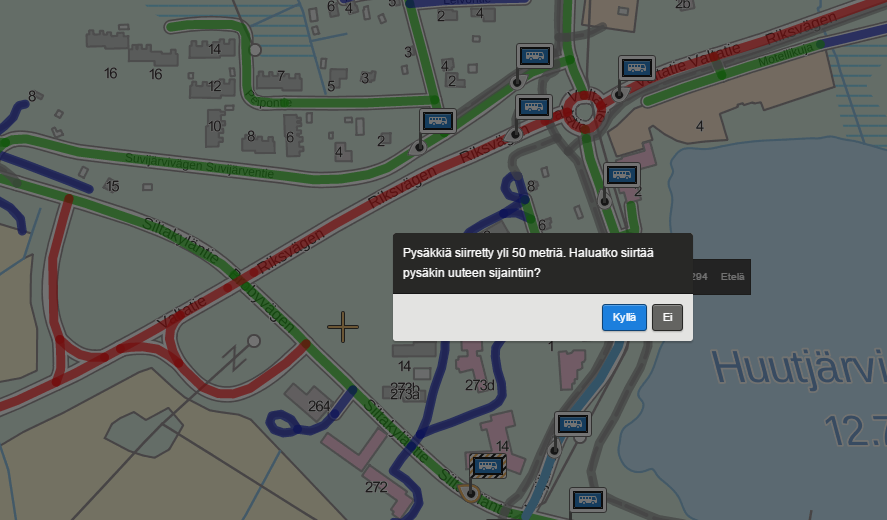

_Pys&auml;kin siirto yli 50 metri&auml;._

 
Pys&auml;kin uusi sijainti tallettuu painamalla Tallenna-painiketta (15). Painamalla Peruuta-painiketta (16) pys&auml;kki palautuu alkuper&auml;iselle paikalleen. Jos pys&auml;kilt&auml; puuttuu tyyppi, tulee se t&auml;ydent&auml;&auml; ennen tallentamista. Pys&auml;kkien ominaisustieton&auml;kym&auml;ss&auml; n&auml;kyy ilmoitus, jos pys&auml;kilt&auml; puuttuu pakollisia tietoja.

Siirrett&auml;ess&auml; pys&auml;kki&auml;, joka on pinossa, j&auml;&auml; pinoon siirrett&auml;v&auml;n pys&auml;kin kohdalle rako, kunnes siirron tallentaa tai peruuttaa. Jos pys&auml;kin siirt&auml;&auml; alle kuuden metrin p&auml;&auml;h&auml;n toisesta/toisista pys&auml;keist&auml;, siirtyy pys&auml;kki osaksi pinoa.

Pys&auml;kin siirto t&auml;ytyy tallentaa tai peruuttaa ennen kuin voi siirty&auml; muokkaamaan muita pys&auml;kkej&auml; tai pois muokkaustilasta. Sovellus ilmoittaa tehdyst&auml; muutoksesta muutos-dialogilla.

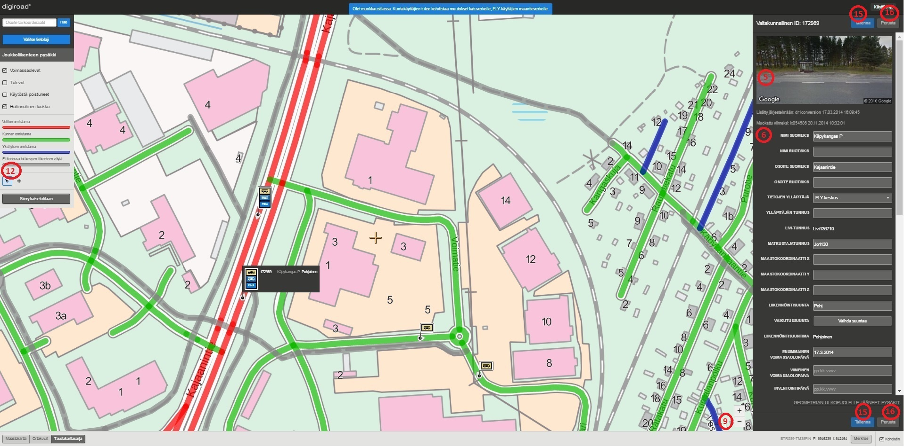

_Joukkoliikenteen pys&auml;kin siirt&auml;minen._

##4.9 Uuden pys&auml;kin lis&auml;&auml;minen##

Uusia pys&auml;kkej&auml; voi lis&auml;t&auml;, kun mittakaavataso on 1:10 000 tai tarkempi. T&auml;m&auml; mittakaavataso on yht&auml; tasoa tarkempi kuin uloin mittakaavataso jolla pys&auml;kit n&auml;ytet&auml;&auml;n. Uusi pys&auml;kki luodaan klikkaamalla kartan tiest&ouml;st&auml; haluttu sijainti pys&auml;kille lis&auml;ysty&ouml;kalulla (13). Jos valitulla kohdalla ei ole tielinkki&auml;, muodostuu pys&auml;kki l&auml;himm&auml;lle tielinkille. Jos pys&auml;kin yritt&auml;&auml; luoda liian kauas l&auml;himm&auml;st&auml; tielinkist&auml;, ei pys&auml;kki&auml; muodostu. Uusi pys&auml;kki on korostettu sinisell&auml; v&auml;rill&auml; (4) ja sivun oikealle puolelle avautuu Google Street View (5) ja ominaisuustieton&auml;kym&auml; (6), jossa pys&auml;kille tallennetaan tiedossa olevat ominaisuustiedot.

Sovellus muodostaa osan ominaisuustiedoista itse, jos niit&auml; ei m&auml;&auml;ritet&auml;. "Ensimm&auml;inen voimassaolop&auml;iv&auml;" oletetaan meneill&auml;&auml;n olevaksi p&auml;iv&auml;m&auml;&auml;r&auml;ksi. Pys&auml;kin vaikutussuunta oletetaan alla olevan linkin digitointisuunnaksi. Kaikkien varusteiden oletusarvo on "Ei tietoa". Lis&auml;ksi valtakunnallinen tunnus ja Livi-tunnus maantien pys&auml;kille muodostuu automaattisesti Digiroadin omasta numeroavaruudesta eik&auml; k&auml;ytt&auml;j&auml;n tarvitse sit&auml; itse asettaa.

Pys&auml;kin tyyppi on pakollinen tieto eik&auml; uutta pys&auml;kki&auml; voi tallentaa, jos sit&auml; ei ole m&auml;&auml;ritetty. Uuden pys&auml;kin ominaisuustieton&auml;kym&auml;ss&auml; n&auml;kyy ilmoitus, jos pys&auml;kin pakollisia tietoja puuttuu. Kun ominaisuustiedot on kirjattu, painetaan Tallenna-painiketta (21) tietojen tallentamiseksi tietokantaan. Jos pys&auml;kki&auml; ei halutakaan luoda, painetaan Peruuta-painiketta (22). Sovellus antaa muokata vain luotavan pys&auml;kin ominaisuustietoja niin kauan, kunnes on klikattu joko "Tallenna" tai "Peruuta".

Uuden pys&auml;kin voi lis&auml;t&auml; alle kuuden metrin p&auml;&auml;h&auml;n olemassa olevasta pys&auml;kist&auml;. Kunta yll&auml;pit&auml;j&auml; ei voi lis&auml;t&auml; uutta pys&auml;kki&auml; maantielle.

__Uuden pys&auml;kin lis&auml;&auml;misen vaiheet:__

1. Aktivoi muokkaustila.
1. Etsi kartalta kohta, jonne haluat pys&auml;kin lis&auml;t&auml;.
1. Tarkenna mittakaava 1:10 000 tai tarkemmaksi (9).
1. Valitse lis&auml;ysty&ouml;kalu (13).
1. Klikkaa linkin kohtaa, johon haluat lis&auml;t&auml; pys&auml;kin.
1. Lis&auml;&auml; ominaisuustieto -n&auml;kym&auml;&auml;n (6) pakolliset ja olemassa olevat tiedot pys&auml;kist&auml;.
1. Jos et haluakaan luoda ko. pys&auml;kki&auml;, paina Peruuta-painiketta (22).
1. Kun olet lis&auml;nnyt haluamasi tiedot, paina Tallenna-painiketta (21).

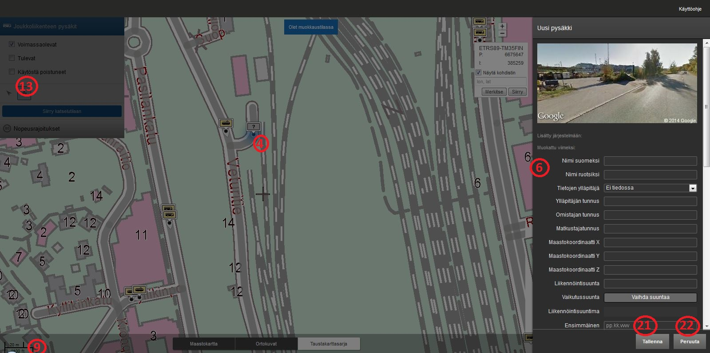

_Joukkoliikenteen pys&auml;kin lis&auml;&auml;minen._

##4.10 Pys&auml;kin m&auml;&auml;ritt&auml;minen k&auml;yt&ouml;st&auml; poistuneeksi##

Olemassa oleva pys&auml;kki m&auml;&auml;ritet&auml;&auml;n k&auml;yt&ouml;st&auml; poistuneeksi muokkausty&ouml;kalulla (12). Kartan mittakaavan tulee olla 1:20 000 tai tarkempi, jotta pys&auml;kin voi m&auml;&auml;ritt&auml;&auml; k&auml;yt&ouml;st&auml; poistuneeksi (9). K&auml;yt&ouml;st&auml; poistunut pys&auml;kki valitaan klikkaamalla pys&auml;kkikuvaketta, jolloin avautuu ominaisuustieton&auml;kym&auml; (6). Valittu pys&auml;kki korostuu sinisell&auml; huomiov&auml;rill&auml; (4). Pys&auml;kin k&auml;yt&ouml;st&auml; poistuneeksi m&auml;&auml;ritt&auml;minen suoritetaan asettamalla ominaisuustieton&auml;kym&auml;n (6) "Viimeinen voimassaolop&auml;iv&auml;" -kentt&auml;&auml;n (20) pys&auml;kin viimeinen voimassaolop&auml;iv&auml;m&auml;&auml;r&auml;. Jos haluat palauttaa pys&auml;kin voimassaolevaksi, valitse viimeinen voimassaolop&auml;iv&auml;-aikavalikosta ”ei tietoa”. Pys&auml;kki palautuu voimassaolevaksi tallentamalla valinta.

Jos pys&auml;kki on poistettu maastosta kokonaan, eik&auml; k&auml;yt&ouml;st&auml; poistunutta pys&auml;kki&auml; tulla en&auml;&auml; ottamaan uudelleen k&auml;ytt&ouml;&ouml;n, voi pys&auml;kin poistaa kokonaan valitsemalla ominaisuustaulun (6) alareunasta Poista Poistunutta pys&auml;kki&auml; ei voi en&auml;&auml; palauttaa voimassaolevaksi. Jos pys&auml;kin viimeinen voimassaolop&auml;iv&auml; on menneisyydess&auml;, aktivoituu kartalla "K&auml;yt&ouml;st&auml; poistuneet" -pys&auml;kkivalinta. Pys&auml;kin kuvake h&auml;vi&auml;&auml; kartalta, kun "K&auml;yt&ouml;st&auml; poistuneet" -pys&auml;kkivalinnan sulkee.

__Vanhan pys&auml;kin poistamisen vaiheet:__

1. Aktivoi muokkaustila.
1. Etsi kartalta pys&auml;kki, jonka haluat poistaa.
1. Tarkenna kartan mittakaava 1:20 000 tai tarkemmaksi (9).
1. Valitse muokkausty&ouml;kalu (12).
1. Klikkaa pys&auml;kki&auml; (4).
1. Aseta pys&auml;kille "Viimeinen voimassaolop&auml;iv&auml;" -kentt&auml;&auml;n (20) viimeinen voimassaolop&auml;iv&auml;m&auml;&auml;r&auml; kirjoittamalla tai valitsemalla se kalenterista, joka avautuu klikkaamalla "Viimeinen voimassaolop&auml;iv&auml;" -kentt&auml;&auml;.
1. Jos et halua poistaa pys&auml;kki&auml;, valitse kalenterista "Ei tietoa".
1. Pys&auml;kin viimeinen voimassaolop&auml;iv&auml;m&auml;&auml;r&auml; tallentuu painamalla Tallenna-painiketta (15).
1. Jos pys&auml;kki on poistettu maastosta, eik&auml; poistuvaa pys&auml;kki&auml; ole tarkoitus ottaa uudelleen k&auml;ytt&ouml;&ouml;n, valitaan ominaisuustaulun lopusta ”Poista”. HUOM! Poistettua pys&auml;kki&auml; ei voi en&auml;&auml; palauttaa olemassaolevaksi!

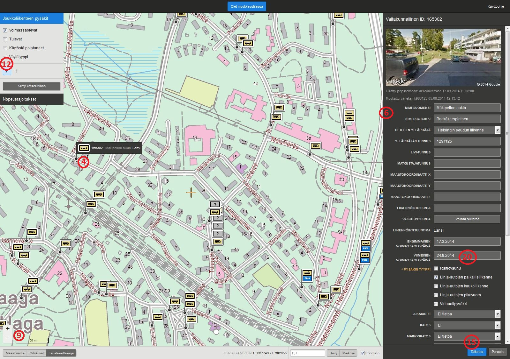

_Joukkoliikenteen pys&auml;kin poistaminen._

5. Nopeusrajoitus
--------------------

Nopeusrajoitus on liikennev&auml;yl&auml;lle asetettu ajoneuvon suurin sallittu nopeus. Karttan&auml;kym&auml;&auml;n voi valita nopeusrajoitukset valitsemalla tietolajit-paletista (1) Nopeusrajoitukset. Karttaa tarkennettaessa nopeusrajoitukset paksuuntuvat, jotta niiden erottaminen on helpompaa. Nopeusrajoitukset on visualisoitu eri v&auml;rein nopeusrajoituksen arvon mukaan. Lis&auml;ksi nopeusrajoituksilla on ympyr&auml;, joka kertoo nopeusrajoituksen arvon. V&auml;rikoodien selitteet n&auml;kyv&auml;t Nopeusrajoitukset-valinnan alla, kun valitsee Nopeusrajoitukset.

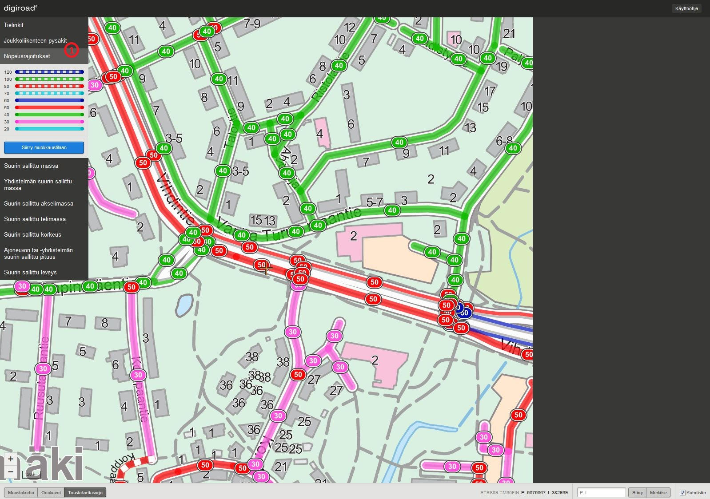

_Nopeusrajoitusten valinta._

##5.1 Nopeusrajoituksen tietojen katselu##

Yksitt&auml;isen nopeusrajoituksen voi valita klikkaamalla kartalta sen geometriaa.

Kerran klikkaamalla tulee valituksi koko nopeusrajoitusketju, eli kaikki nopeusrajoitukset, joilla on sama nopeusrajoituksen arvo ja tiennumero (maantiell&auml;) tai tien nimi (katuverkko ja yksityistie). Jos k&auml;ytt&auml;j&auml; haluaa valita vain yhden linkin mittaisen p&auml;tk&auml;n tarkasteluun, sen voi tehd&auml; tuplaklikkamalla nopeusrajoitusta.

Huom! Nopeusrajoituksien ketjuvalinta ei toimi yksisuuntaisille nopeusrajoituksille.

Valitun nopeusrajoitusketjun tai yksitt&auml;isen nopeusrajoituksen geometria korostuu kartalla. Sivun oikeaan laitaan avautuu nopeusrajoituksen ominaisuustieton&auml;kym&auml;.

Ominaisuustieton&auml;kym&auml;ss&auml; on nopeusrajoituksen arvo (km/h), valittujen linkkien lukum&auml;&auml;r&auml; sek&auml; lis&auml;tty j&auml;rjestelm&auml;&auml;n ja muokattu viimeksi -tiedot.

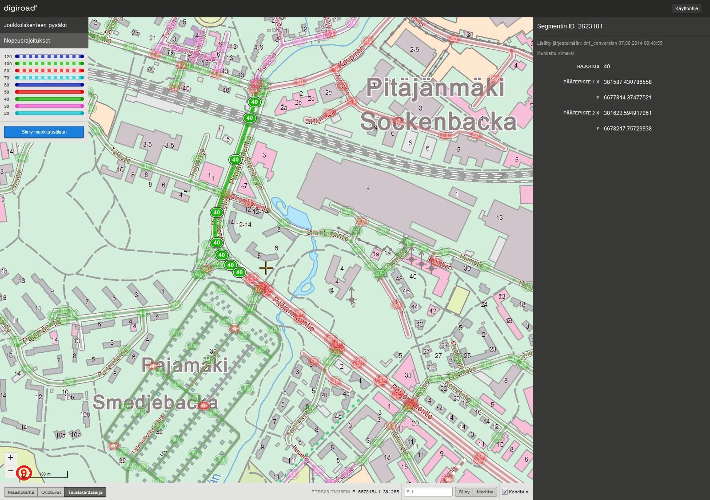

_Nopeusrajoituksen tietojen katselu, kun valittuna on nopeusrajoitusketju (klikattu kerran)._

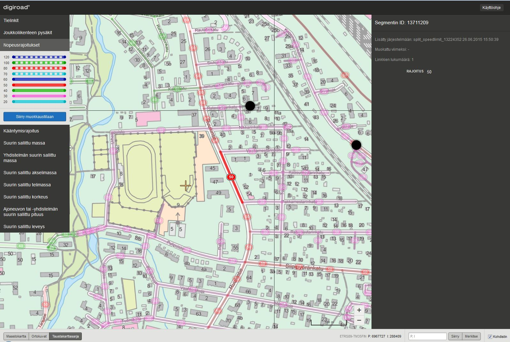

_Nopeusrajoituksen tietojen katselu, kun valittuna on yksitt&auml;inen nopeusrajoitus (tuplaklikkaus)._

###Nopeusrajoitusten visualisointi###

Nopeusrajoitukset on visualisoitu eri tavoin riippuen vaikutussuunnasta. Nopeusrajoituksen vaikutussuunta voi olla molempiin suuntiin tai vain toiseen suuntaan. Jos vaikutussuunta on molempiin suuntiin, nopeusrajoitus on visualisoitu yhdell&auml; paksulla viivalla (1). Yksisuuntainen vaikutus on visualisoitu ohuemmalla viivalla vaikutussuunnan mukaan tielinjan reunaan (2).

Digiroad-yll&auml;pitosovellus yhdist&auml;&auml; nopeusrajoitukset molempiin suuntiin voimassa olevaksi, jos tielinkill&auml; on vain yksinopeusrajoitus. K&auml;yt&auml;nn&ouml;ss&auml; siis kaikki tapaukset, joissa nopeusrajoituksen arvo molempiin suuntiin on sama, eik&auml; arvo vaihdu kesken tielinkin, visualisoidaan molempiin suuntiin voimassa olevana. Erityisesti risteysalueella nopeusrajoitukset voivat muuttua kesken tielinkin (2) tai rajoituksen arvo eri suuntiin on eri (2, 3), jolloin ne visualisoituvat yll&auml;pitosovelluksessa ohuemmilla viivoilla tiegeometrian viereen.

Nopeusrajoituksen muokkauksessa on mahdollisuus jakaa molempiin suuntiin voimassa oleva nopeusrajoitus yhteen suuntaan voimassa olevaksi.

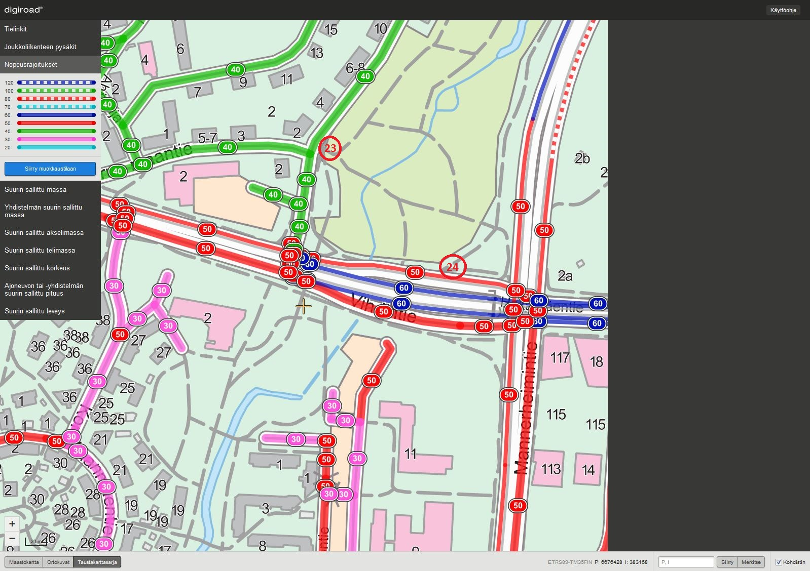

_Nopeusrajoitusten visualisointi._

##5.2 Nopeusrajoituksien muokkaus##

Muokkaustilassa nopeusrajoituksille voi antaa uusia arvoja, niit&auml; voi katkaista sek&auml; muuttaa yksisuuntaisiksi. Nopeusrajoituksien arvoja voi muokata kolmella tavalla:

1. Koko nopeusrajoitusketjulle.
1. Yksitt&auml;isen linkin mittaiselle osuudelle.
1. Monivalinnan avulla kokonaiselle alueelle.

###Nopeusrajoituksen arvon muokkaus###

Muokattava nopeusrajoitus valitaan klikkaamalla sen geometriaa (4). Kerran klikkaamalla tulee valituksi koko nopeusrajoitusketju, eli kaikki nopeusrajoitukset, joilla on sama nopeusrajoituksen arvo ja tiennumero (maantiell&auml;) tai tien nimi (katuverkko ja yksityistie). 

Jos k&auml;ytt&auml;j&auml; haluaa valita vain yhden linkin mittaisen p&auml;tk&auml;n tarkasteluun, sen voi tehd&auml; tuplaklikkamalla nopeusrajoitusta.

Huom! Nopeusrajoituksien ketjuvalinta ei toimi yksisuuntaisille nopeusrajoituksille.

Tietoja muokataan ominaisuustieton&auml;kym&auml;ss&auml; valitsemalla nopeusrajoitukselle uusi arvo alasvetovalikosta (5). Muutokset tallennetaan painamalla Tallenna-painiketta. Ennen Tallenna-painikkeen painamista muutokset voi perua painamalla Peruuta-painiketta. Tallenna- ja peruuta –painikkeet eiv&auml;t ole aktiivisina, jos muutoksia ei ole tehty. Jos muutoksia on tehty eik&auml; niit&auml; ole peruttu tai tallennettu ja siirryt&auml;&auml;n muokkaamaan toista kohdetta tai pois auki olevan tietolajin muokkaustilasta, sovellus antaa muutos-dialogin, joka kertoo, ett&auml; muutoksia on tehty ja ne tulee tallentaa tai peruuttaa ennen kuin voi jatkaa.

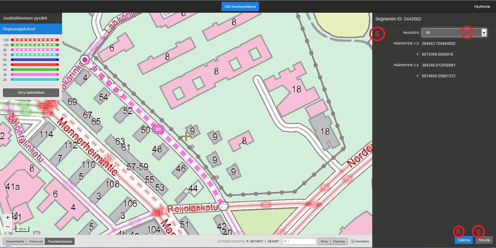

_Nopeusrajoitusketjun arvon muokkaus (klikattu kerran)._

 
####Nopeusrajoituksien muokkaus monivalintaty&ouml;kalulla####

Useamman kuin yhden nopeusrajoituksen arvon voi muuttaa kerralla. Halutut nopeusrajoitukset valitaan painamalla Ctrl-painike n&auml;pp&auml;imist&ouml;lt&auml; pohjaan ja piirt&auml;m&auml;ll&auml; hiiren vasen painike pohjassa laatikko nopeusrajoitusten p&auml;&auml;lle. Valituksi tulevat kaikki nopeusrajoitukset laatikon sis&auml;ll&auml; ja nopeusrajoitukset, joita laatikko leikkaa. Valinnan j&auml;lkeen avautuu ikkuna, jossa valitaan nopeusrajoituksille tallentuva arvo ja painetaan tallenna. Peruuta-painikkeesta voi perua muutoksen.

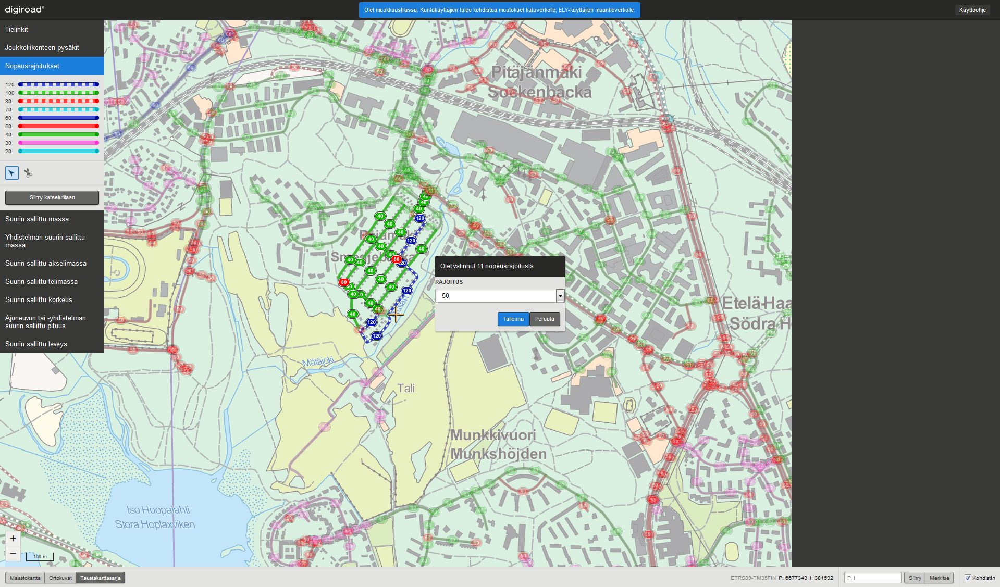

_Useamman nopeusrajoituksen arvon muokkaus kerralla._

 
####Nopeusrajoituksen katkaiseminen####

Nopeusrajoituksen voi jakaa kahteen osaan leikkausty&ouml;kalulla (13). Leikkausty&ouml;kalulla klikataan nopeusrajoituksen geometriasta kohtaa, josta nopeusrajoitus halutaan katkaista. Nopeusrajoituksen geometrian p&auml;&auml;ll&auml; ty&ouml;kalu n&auml;kyy ristin&auml;, jotta tarkka katkaisukohta on helppo m&auml;&auml;ritt&auml;&auml;.

Nopeusrajoituksen katkaisu valitsee aina vain linkin mittaisen osion nopeusrajoitusta, ei nopeusrajoitusketjua.

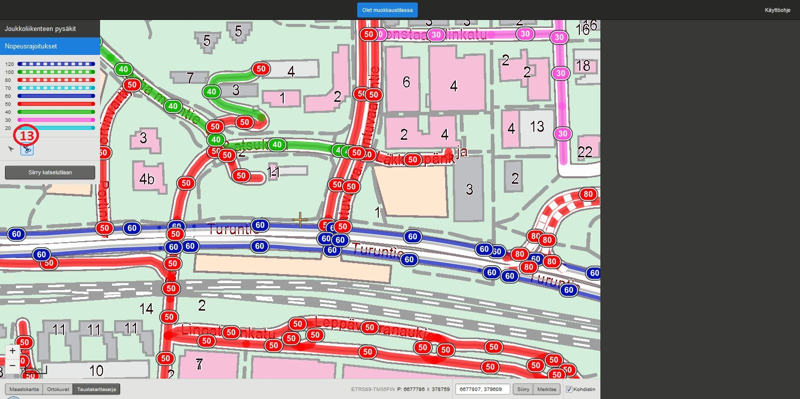

_Nopeusrajoituksen katkaiseminen._

 
Nopeusrajoituksen katkaisussa uusille rajoituksille valitaan arvot oikean laidan alasvetovalikoista (4). Kartalla ja alasvetovalikkojen vieress&auml; olevat kirjaimet osoittavat, kummasta rajoituksesta on kyse (5). Uudet nopeusrajoitukset tallennetaan tallenna-painikkeesta (6). Katkaisun voi peruuttaa peruuta-painikkeella (7), jolloin alkuper&auml;inen rajoitus j&auml;&auml; voimaan.

Huom! Nopeusrajoituksen katkaisussa tulee m&auml;&auml;ritt&auml;&auml; nopeusrajoituksille eri arvot, jotta tallennus on mahdollista.

###Nopeusrajoituksen muuttaminen yksisuuntaiseksi###

Molempiin suuntiin voimassa olevan nopeusrajoituksen voi muuttaa yksisuuntaiseksi, jos kyseisell&auml; tielinkill&auml; liikennevirran suunta on molempiin suuntiin. Muutos tehd&auml;&auml;n siis tielinkkikohtaisesti.

Muutos tehd&auml;&auml;n tuplaklikkaamalla kyseist&auml; nopeusrajoitusta (1), jolloin oikeaan laitaan tulee painike "Jaa nopeusrajoitus yksisuuntaiseksi" (2).

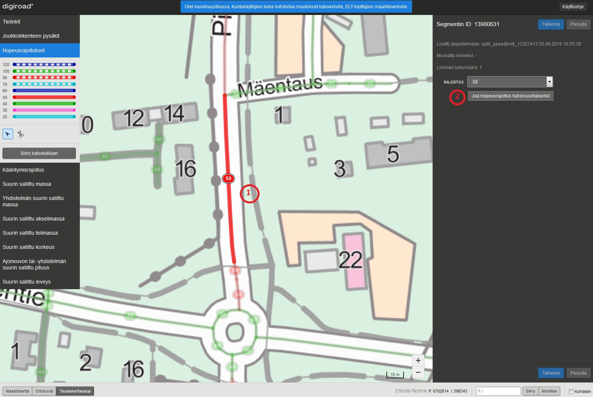

_Nopeusrajoituksen valinta ja muuttaminen yksisuuntaiseksi._

Painikkeen painamisen j&auml;lkeen voi uusille nopeusrajoituksille antaa arvot alasvetovalikoista (3). Kirjaimet alasvetovalikkojen vieress&auml; vastaavat nopeusrajoituksia kartalla (4). Arvojen pit&auml;&auml; erota toisistaan, jotta tallentaminen on mahdollista.

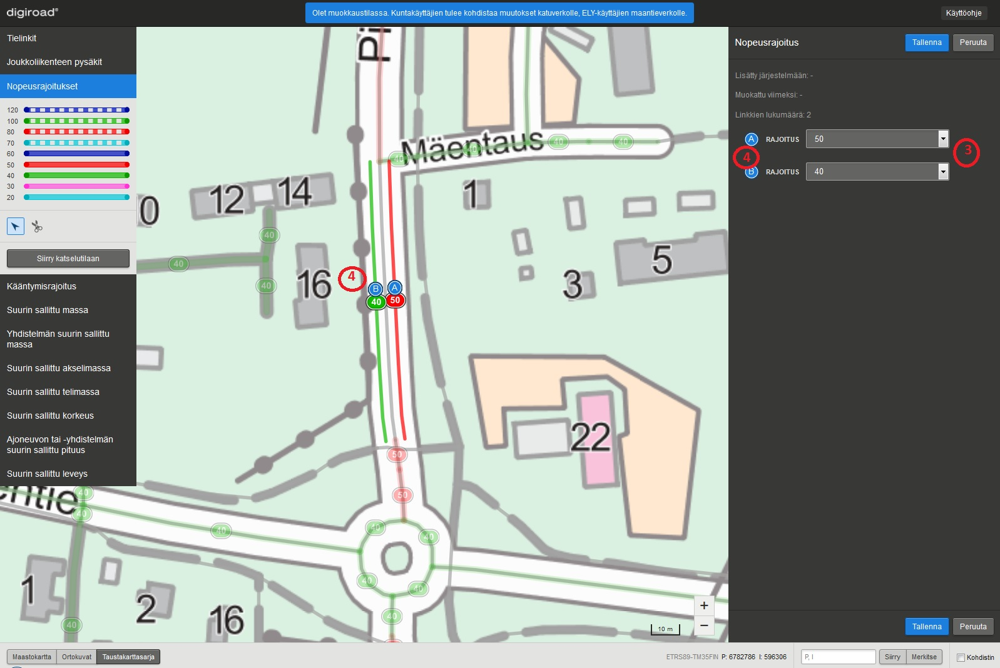

_Uusien yksisuuntaisten nopeusrajoitusten arvon valinta._

 
Uudet nopeusrajoitukset tallennetaan tallenna-painikkeesta. Jakamisen voi peruuttaa peruuta-painikkeella, jolloin alkuper&auml;inen rajoitus j&auml;&auml; voimaan.

Jos tallennuksen j&auml;lkeen yhteen suuntaan voimassa oleville nopeusrajoituksille antaa saman arvon, sovellus yhdist&auml;&auml; ne molempiin voimassa oleviksi.

###Tuntemattomat nopeusrajoitukset###

Jos nopeusrajoitus ko. linkill&auml; ei ole tiedossa, n&auml;kyy se k&auml;ytt&ouml;liittym&auml;ss&auml; mustana eli tuntemattomana nopeusrajoituksena.

Nopeusrajoitus on tuntematon, jos nopeusrajoitustietoa ei ole toimitettu Digiroad-j&auml;rjestelm&auml;&auml;n. Uusille, j&auml;rjestelm&auml;&auml;n lis&auml;tyille tielinkeille, tulee lis&auml;t&auml; nopeusrajoitus.

Tuntemattomalle nopeusrajoitukselle voi antaa arvon alasvetovalikosta ja niit&auml; voi muokata my&ouml;s monivalintaty&ouml;kalun avulla. Tuntemattomia nopeusrajoituksia ei kuitenkaan voi katkaista katkaisuty&ouml;kalulla, eik&auml; niit&auml; voi jakaa yksisuuntaisiksi. Tuntemattomille nopeusrajoituksille tulee antaa ensin arvo, jotta niiden muokkaus t&auml;ydellisesti onnistuu.

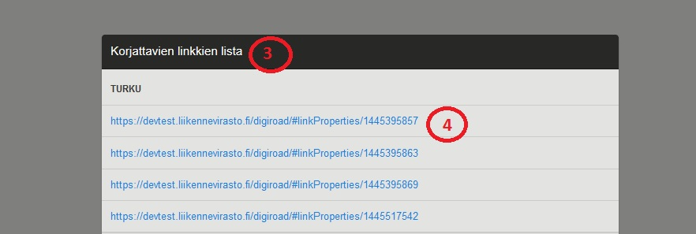

_Tuntematon nopeusrajoitus._

Tuntemattomista nopeusrajoituksista on lista, johon p&auml;&auml;see nopeusrajoitusten ominaisuustieton&auml;kym&auml;st&auml; (1). Nopeusrajoitukset on jaoteltu listalle kunnan sek&auml; kunnan sis&auml;ll&auml; hallinnollisen luokan (kunta, valtio, yksityinen) mukaan. Listan pituus on rajoitettu kymmeneen nopeusrajoitukseen, mutta kunkin hallinnollisen luokan vieress&auml; lukee my&ouml;s korjattavien nopeusrajoitusten kokonaism&auml;&auml;r&auml;.

Nopeusrajoituksesta on listassa linkki, josta p&auml;&auml;see suoraan nopeusrajoituksen kohdalle sovelluksessa ja sille voi asettaa arvon. Nopeusrajoituslinkin voi avata uuteen v&auml;lilehteen klikkaamalla linkki&auml; Ctrl-painike pohjassa. Muuten linkki avautuu samaan v&auml;lilehteen. Lista sulkeutuu Sulje lista -painikkeesta.

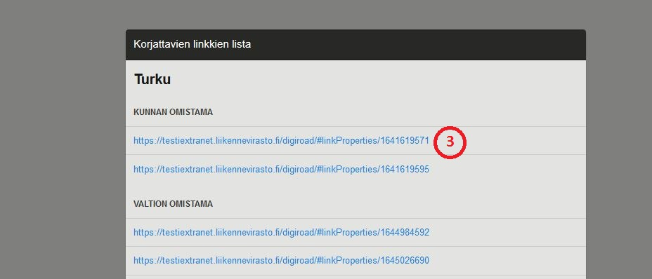

_Tuntemattomien nopeusrajoitusten lista._

6. K&auml;&auml;ntymisrajoitus
----------------------------------

Kartalle voi valita k&auml;&auml;ntymisrajoitukset valitsemalla tietolajit-paletista (1) K&auml;&auml;ntymisrajoitus. Karttaa tarkennettaessa k&auml;&auml;ntymisrajoitukset tulevat n&auml;kyviin paksumpina viivoina, jotta niiden erottaminen olisi helpompaa. K&auml;&auml;ntymism&auml;&auml;r&auml;ykset on visualisoitu siten, ett&auml; linkki, jolta ei saa k&auml;&auml;nty&auml; (2), on sininen ja linkki, jolle ei saa k&auml;&auml;nty&auml; (3) on punainen.

Joissain tapauksissa (U-k&auml;&auml;nn&ouml;s, liikenneympyr&auml;n ohittava erillinen k&auml;&auml;ntymiskaista oikealle) k&auml;&auml;ntymisrajoitus saattaa koostua useammista linkeist&auml;. T&auml;ll&ouml;in ns. v&auml;lilinkki (4) on visualisoitu vihre&auml;ksi. V&auml;lilinkki yhdist&auml;&auml; sen linkin, jolta k&auml;&auml;ntyminen on kielletty (sininen linkki) siihen linkkiin, jolle k&auml;&auml;ntyminen on kielletty&auml; (punainen linkki).

Visualisoinnin selitteet n&auml;kyv&auml;t K&auml;&auml;ntymisrajoitus-valinnan alla tietolajit-paletissa. Tielinkeill&auml;, joiden liikennevirran suunta on vain yhteen suuntaan, on visualisoitu suuntanuoli kuvaamaan liikennevirran suuntaa.

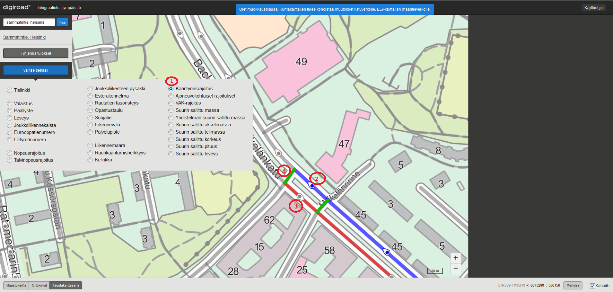

_K&auml;&auml;ntymisrajoitusten valinta._

##6.1 K&auml;&auml;ntymisrajoituksen tietojen katselu##

Yksitt&auml;isen k&auml;&auml;ntymisrajoituksen voi valita klikkaamalla kartalta sen geometriaa.  Valittu k&auml;&auml;ntymisrajoitus (4) korostuu kartalla ja sen ominaisuustiedot avautuvat ominaisuustieton&auml;kym&auml;&auml;n (6).

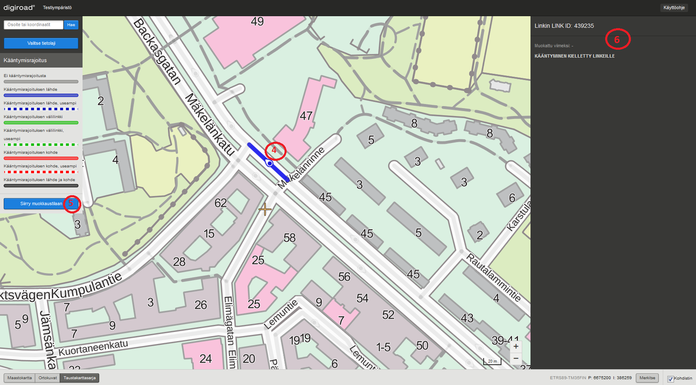

_K&auml;&auml;ntymisrajoituksen tietojen katselu._

##6.2 K&auml;&auml;ntymisrajoitusten muokkaus##

K&auml;&auml;ntymisrajoituksia muokataan muokkaustilassa (5). Muokattava kohde valitaan klikkaamalla sen geometriaa (6). Tietoja muokataan ominaisuustieton&auml;kym&auml;ss&auml; (7), josta valitaan haluttu k&auml;&auml;ntymisrajoitus, klikkaamalla muokkaa-painiketta (8). Muokattavia tietoja ovat k&auml;&auml;ntymisrajoituksen lis&auml;kilven mukainen voimassaoloaika, ajoneuvotyypit, joita k&auml;&auml;ntymisrajoitus ei koske eli poikkeukset sek&auml; mahdollinen muu tarkenne. 

Muokkaustilassa on mahdollista my&ouml;s poistaa olemassaolevia k&auml;&auml;ntymisrajoituksia rastimalla Poista-sarake (9). Muokkaukset ja poisto hyv&auml;ksyt&auml;&auml;n Tallenna-painiketta (10) klikkaamalla. Poiston yhteydess&auml; h&auml;vi&auml;&auml; koko k&auml;&auml;ntymisrajoitus ja sit&auml; koskevat poikkeukset! Jos muutoksia on tehty eik&auml; niit&auml; ole tallennettu tai peruutettu ja siirryt&auml;&auml;n pois k&auml;&auml;ntymisrajoituksen valinnasta, sovellus avaa muutos-dialogin. Muutos-dialogi kertoo k&auml;ytt&auml;j&auml;lle, ett&auml; muutoksia on tehty ja ne tulee tallentaa tai peruuttaa ennen kuin voi jatkaa. 

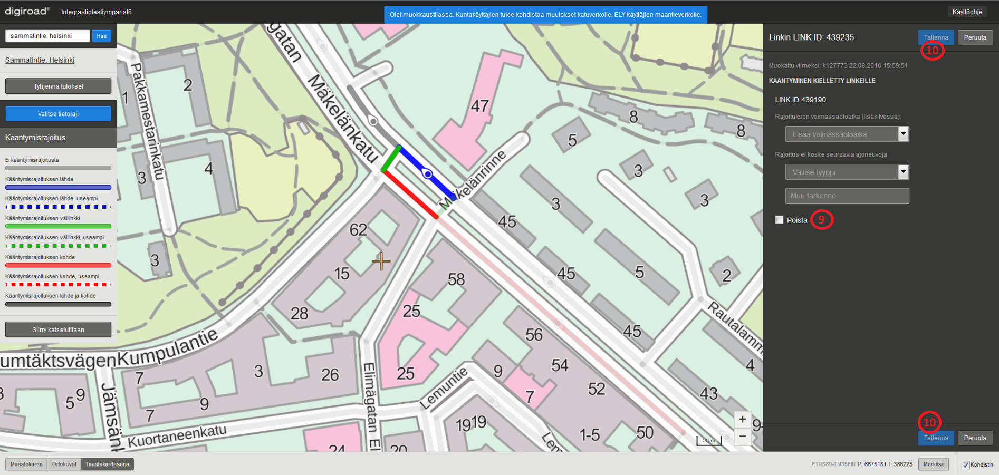

_K&auml;&auml;ntymisrajoitusten muokkaus._

 
####Uuden k&auml;&auml;ntymisrajoituksen lis&auml;&auml;minen####

Uusi k&auml;&auml;ntymisrajoitus lis&auml;t&auml;&auml;n valitsemalla kartalta se tielinkki, joka on k&auml;&auml;ntymisrajoituksen l&auml;hde (mist&auml; k&auml;&auml;ntyminen jonnekin toisaalle on rajoitettu liikennemerkill&auml;). Sivun oikeaan laitaan aukeaa ominaisuustieton&auml;kym&auml; (11), jossa on n&auml;kyvill&auml; valitulta tielinkilt&auml; l&auml;htev&auml;t tielinkit sek&auml; niit&auml; karttan&auml;kym&auml;ss&auml; vastaavat kirjaimet (12). Piirto saattaa kest&auml;&auml; jonkin aikaa, joten valinnan j&auml;lkeen odota rauhassa, ett&auml; kirjaimet piirtyv&auml;t n&auml;kyviin! 

Valitse se linkki, jolle haluat k&auml;&auml;ntymisrajoituksen kohdistaa klikkaamalla kyseisen linkin kohdalla Uusi rajoitus -painiketta (13). Ominaisuustieton&auml;kym&auml;&auml;n aukeaa lomake (14), johon voi tallentaa k&auml;&auml;ntymisrajoitukseen liittyv&auml;t lis&auml;kilven tiedot. Valitse tarvittavat lis&auml;tiedot vetovalikoista, mik&auml;li tarpeen. T&auml;m&auml;n j&auml;lkeen siirry ominaisuustieton&auml;kym&auml;ss&auml; alemmas kohtaan "Jatka k&auml;&auml;ntymisrajoitusta" (15). Valitse viimeinen linkki -painike, mik&auml;li aiemmin valitsemasi linkki on k&auml;&auml;ntymisrajoituksen kohde linkki. Vahvista valinta painamalla tallenna-nappulaa.
 
 Huom! K&auml;&auml;ntymisrajoitukseen valittuja linkkej&auml; ei ole mahdollista poistaa/lis&auml;t&auml; yksitellen vaan koko k&auml;&auml;ntymisrajoitus tulee poistaa, mik&auml;li siihen kuuluvien linkkien sijaintia/m&auml;&auml;r&auml;&auml; on tarve muokata. Poista vanha rajoitus valitsemalla sen l&auml;hdelinkki ja painamalla muokkaa-nappia. T&auml;m&auml;n j&auml;lkeen ominaisuustieton&auml;kym&auml;&auml;n ilmestyy Poista-sarake (9). Sen rastimalla ja tallentamalla valinnan k&auml;&auml;ntymisrajoitus poistuu.

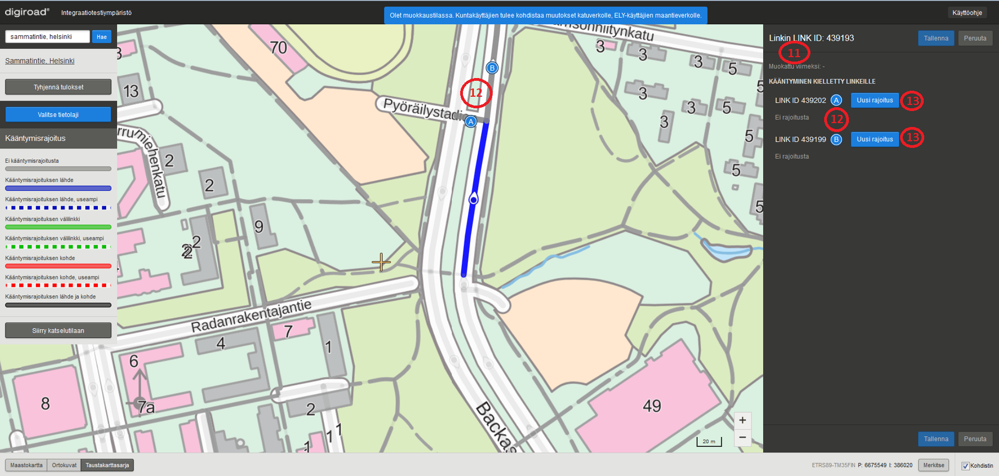

_K&auml;&auml;ntymisrajoitusten lis&auml;&auml;minen._

 
####Uuden k&auml;&auml;ntymisrajoituksen lis&auml;&auml;minen usealle per&auml;kk&auml;iselle linkille (U-k&auml;&auml;nn&ouml;kset tai liikenneympyr&auml;n ohittavat rampit)####

Mik&auml;li haluat tehd&auml; k&auml;&auml;ntymisrajoituksen, jossa k&auml;&auml;ntymisrajoituksen l&auml;hde ja kohde eiv&auml;t ole per&auml;kk&auml;iset linkit, lue n&auml;m&auml; ohjeet! Kahden linkin mittaisen rajoituksen tekeminen onnistuu yll&auml;olevan ohjeen avulla.

Uusi k&auml;&auml;ntymisrajoitus lis&auml;t&auml;&auml;n valitsemalla kartalta se tielinkki, joka on k&auml;&auml;ntymisrajoituksen l&auml;hde (mist&auml; k&auml;&auml;ntyminen jonnekin toisaalle on rajoitettu liikennemerkill&auml;). Sivun oikeaan laitaan aukeaa ominaisuustieton&auml;kym&auml; (11), jossa on n&auml;kyvill&auml; valitulta tielinkilt&auml; l&auml;htev&auml;t tielinkit sek&auml; niit&auml; karttan&auml;kym&auml;ss&auml; vastaavat kirjaimet (12). Piirto saattaa kest&auml;&auml; jonkin aikaa, joten valinnan j&auml;lkeen odota rauhassa, ett&auml; kirjaimet piirtyv&auml;t n&auml;kyviin!

Valitse se linkki, jolle haluat k&auml;&auml;ntymisrajoituksen kohdistaa klikkaamalla kyseisen linkin kohdalla Uusi rajoitus -painiketta (13). Ominaisuustieton&auml;kym&auml;&auml;n aukeaa lomake (14), johon voi tallentaa k&auml;&auml;ntymisrajoitukseen liittyv&auml;t lis&auml;kilven tiedot. Valitse tarvittavat lis&auml;tiedot vetovalikoista, mik&auml;li tarpeen. T&auml;m&auml;n j&auml;lkeen siirry ominaisuustieton&auml;kym&auml;ss&auml; alemmas kohtaan "Jatka k&auml;&auml;ntymisrajoitusta" (15). Valitse listalta se linkki, jolle haluat jatkaa k&auml;&auml;ntymisrajoitusta (16). Jos t&auml;m&auml; linkki on muodostamasi ketjun viimeinen, valitse "viimeinen linkki". Piirto saattaa kest&auml;&auml; jonkin aikaa, joten odota rauhassa ennen muutosten tallentamista. 

Muussa tapauksessa toista edellinen vaihe ja valitse listalta se linkki, jolle haluat k&auml;&auml;ntymisrajoitusta jatkaa. Etene n&auml;in, kunnes olet valinnut ketjun viimeisen linkin (k&auml;&auml;ntymisrajoituksen kohdelinkin). Lopuksi paina Tallenna-nappia, jolloin tekem&auml;si k&auml;&auml;ntymisrajoitus tallentuu.

_Uuden k&auml;&auml;ntymisrajoituksen lis&auml;&auml;minen usealle per&auml;kk&auml;iselle linkille_

 
####Uuden k&auml;&auml;ntymisrajoituksen poistaminen####

K&auml;&auml;ntymisrajoitus poistetaan valitsemalla halutun rajoituksen l&auml;hdelinkki ja painamalla muokkaa-nappia. T&auml;m&auml;n j&auml;lkeen ominaisuustieton&auml;kym&auml;&auml;n ilmestyy Poista-sarake (9). Sen rastimalla ja tallentamalla valinnan k&auml;&auml;ntymisrajoitus poistuu.

7. Suurin sallittu X 7
----------------------

Kartalle voi valita tietolajit-paletista (1) Suurin sallittu -valinnan. Karttaa tarkennettaessa geometriat paksuuntuvat, jotta niiden erottaminen on helpompaa. Geometriat on visualisoitu punaisella v&auml;rill&auml; ja tielinkit, joilla suurinta sallittua arvoa ei ole, on visualisoitu harmaalla v&auml;rill&auml;.

Suurin sallittu x7:

__Suurin sallittu massa__
__Yhdistelm&auml;n suurin sallittu massa__
__Suurin sallittu akselimassa__
__Suurin sallittu telimassa__
__Suurin sallittu korkeus__
__Ajoneuvon- tai yhdistelm&auml;n suurin sallittu pituus__
__Suurin sallittu leveys__

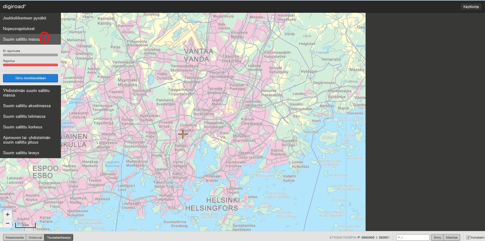

_Suurin sallittu -valinta._

##7.1 Suurin sallittu x7 tietojen katselu##

Yksitt&auml;isen suurin sallittu -kohteen voi valita klikkaamalla kartalta sen geometriaa (4). Kerran klikkaamalla tulee valituksi koko rajoitusketju, eli kaikki rajoitukset, joilla on sama rajoituksen arvo ja tiennumero (maantiell&auml;) tai tien nimi (katuverkko ja yksityistie). Jos k&auml;ytt&auml;j&auml; haluaa valita vain yhden linkin mittaisen p&auml;tk&auml;n tarkasteluun, sen voi tehd&auml; tuplaklikkaamalla rajoitusta. Geometria tummentuu ja muut geometriat n&auml;kyv&auml;t haaleammalla. Sivun oikeaan laitaan avautuu valitun rajoituksen tai rajoitusketjun ominaisuustieton&auml;kym&auml; (6).

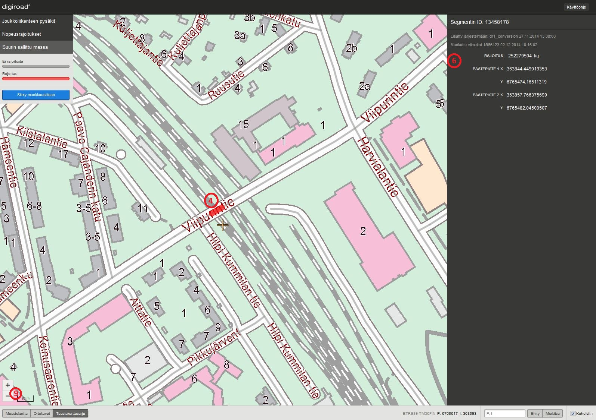

_Suurin sallittu -katselutila._

##7.2 Suurin sallittu x7 ominaisuustietojen muokkaus##

Muokkaustilassa Suurin sallittu -rajoituksille voi antaa uusia arvoja ja niit&auml; voi katkaista. Rajoituksien arvoja voi muokata kolmella tavalla:
1.	Koko rajoitusketjulle kerralla.
2.	Yksitt&auml;isen linkin mittaiselle osuudelle.
3.	Monivalinnan avulla kokonaiselle alueelle.

###Rajoituksen arvon muokkaus###

Suurin sallittu -valintaa muokataan muokkaustilassa. Muokattava kohde valitaan klikkaamalla sen geometriaa (4). Kerran klikkaamalla tulee valituksi koko rajoitusketju, eli kaikki per&auml;kk&auml;iset rajoitukset, joilla on sama arvo ja tiennumero (maantiell&auml;) tai tien nimi (katuverkko ja yksityistie). Tietoja muokataan ominaisuustieton&auml;kym&auml;ss&auml; (6). Muutokset tallennetaan painamalla Tallenna-painiketta oikeasta alakulmasta (8). Ennen Tallenna-painikkeen painamista muutokset voi peruuttaa painamalla Peruuta-painiketta (9).

Tallenna- ja Peruuta -painikkeet eiv&auml;t ole aktiivisina, jos muutoksia ei ole tehty. Jos muutoksia on tehty eik&auml; niit&auml; ole tallennettu tai peruutettu ja siirryt&auml;&auml;n pois painorajoituksen valinnasta, sovellus antaa muutos-dialogin. Muutos-dialogi kertoo k&auml;ytt&auml;j&auml;lle, ett&auml; muutoksia on tehty ja ne tulee tallentaa tai peruuttaa ennen kuin voi jatkaa.

Huom! Rajoituksen arvokent&auml;ss&auml; muiden kuin numeroarvojen tallentaminen aiheuttaa virhetilanteita tallentuvissa rajoituksissa.

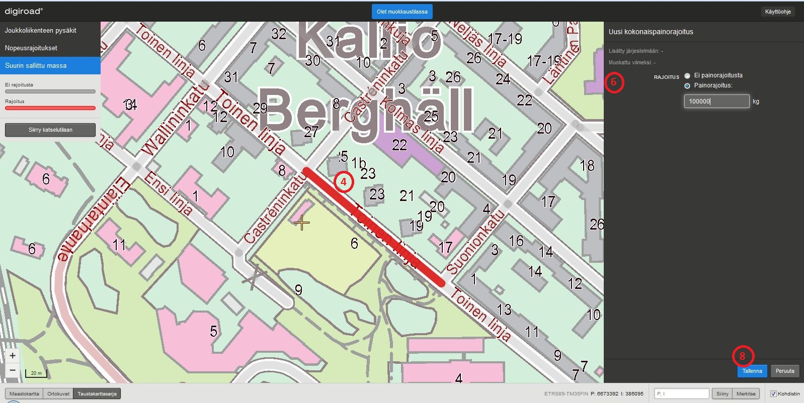

_Suurin sallittu -valinnan muokkaus._

###Suurin sallittu -kohteiden muokkaus monivalintaty&ouml;kalulla###

Useamman kuin yhden rajoituksen arvon voi muuttaa kerralla. Halutut rajoitukset valitaan painamalla Ctrl-painike n&auml;pp&auml;imist&ouml;lt&auml; pohjaan ja piirt&auml;m&auml;ll&auml; hiiren vasen painike pohjassa laatikko rajoitusten p&auml;&auml;lle. Valituksi tulevat kaikki linkit laatikon sis&auml;ll&auml; ja linkit, joita laatikko leikkaa. Valinnan j&auml;lkeen avautuu ikkuna, jossa valitaan rajoituksille tallentuva arvo ja painetaan tallenna. Peruuta-painikkeesta voi perua muutoksen.

_Useamman rajoituksen arvon muokkaus kerralla._

 
####Suurin sallittu -kohteen katkaisu####

Rajoituksen voi jakaa kahteen osaan leikkausty&ouml;kalulla (1). Siten leikkausty&ouml;kalun avulla voi m&auml;&auml;ritell&auml; lyhyit&auml; rajoituksia poistamalla voimasta katkaisussa j&auml;ljelle j&auml;&auml;neit&auml; rajoituksia. Leikkausty&ouml;kalulla klikataan rajoituksen geometriasta kohtaa, josta rajoitus halutaan katkaista. Rajoituksen geometrian p&auml;&auml;ll&auml; ty&ouml;kalu n&auml;kyy ristin&auml;, jotta tarkka katkaisukohta on helppo m&auml;&auml;ritt&auml;&auml; (2). 

Rajoituksen katkaisu valitsee aina vain linkin mittaisen osion rajoituksesta, ei koko rajoitusketjua.

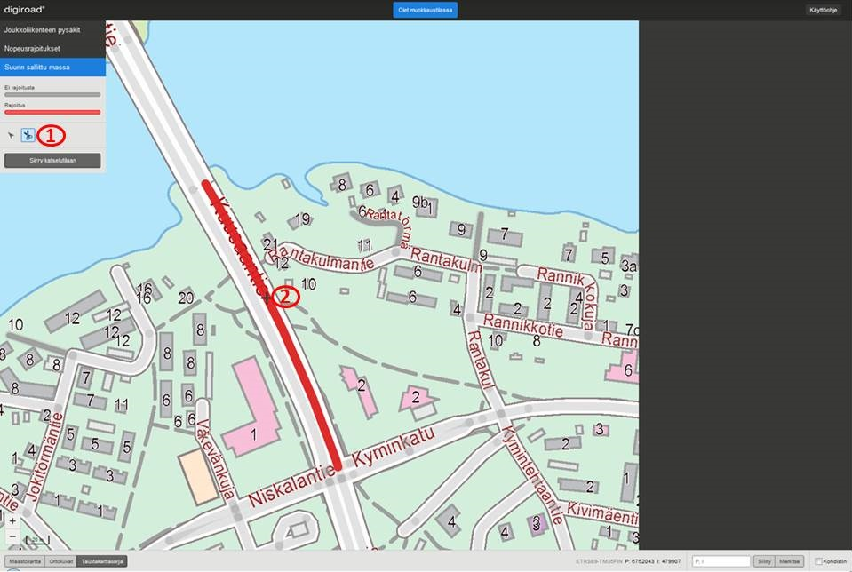

_Suurin sallittu -kohteen katkaisu._

 
Katkaistun rajoituksen osista pidemm&auml;lle j&auml;&auml; alkuper&auml;isen ID, ja lyhyemm&auml;lle generoidaan uusi ID. Rajoituksen katkaisussa uusille rajoituksille valitaan arvot oikean laidan valikoista (4). Kartalla ja valikkojen vieress&auml; olevat kirjaimet osoittavat, kummasta rajoituksesta on kyse (5). Uudet rajoitukset tallennetaan tallenna-painikkeesta (6). Katkaisun voi peruuttaa peruuta-painikkeella (7), jolloin alkuper&auml;inen rajoitus j&auml;&auml; voimaan.

Huom! Rajoituksen katkaisussa tulee m&auml;&auml;ritt&auml;&auml; uusille rajoituksille eri arvot, jotta tallennus on mahdollista.

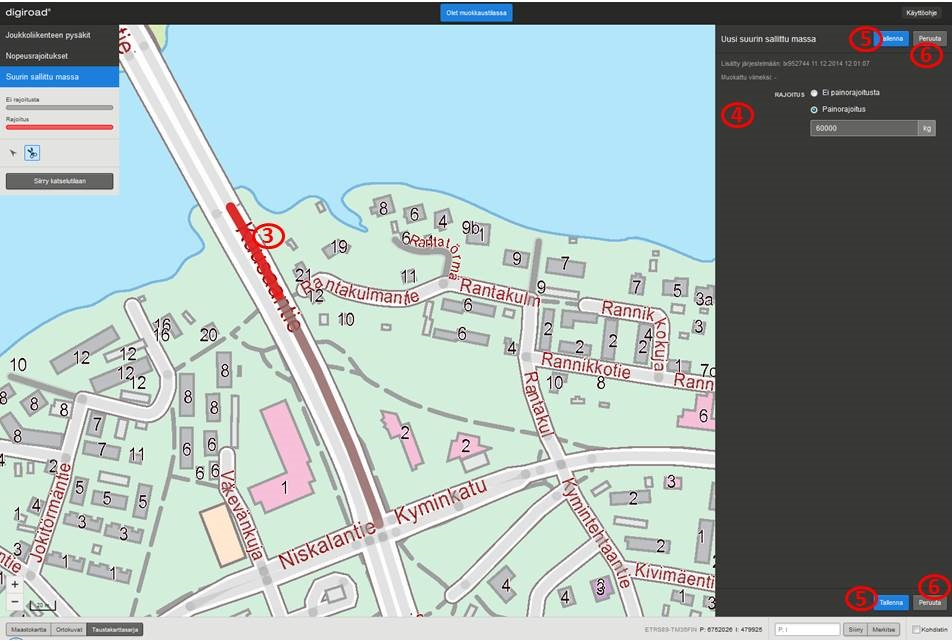

_Suurin sallittu -kohteen katkaisu._

 
####Suurin sallittu -kohteen poistaminen####

Tielinkin suurin sallittu -kohde poistetaan ominaisuustieton&auml;kym&auml;ss&auml; (6) valitsemalla Rajoitus-kohdasta "Ei rajoitusta".

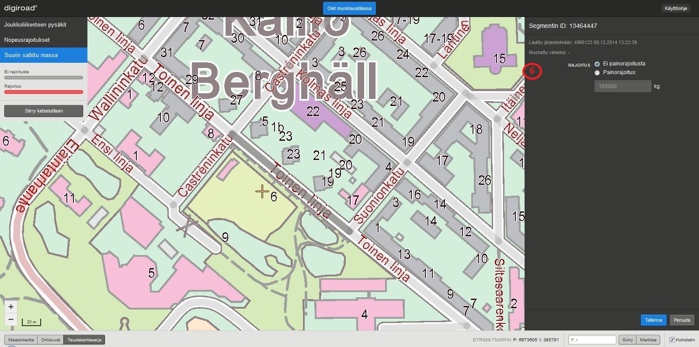

_Suurin sallittu -kohteen poistaminen._

 
####Uuden suurin sallittu -kohteen lis&auml;&auml;minen####

Tielinkille voi lis&auml;t&auml; suurin sallittu -kohteen valitsemalla linkin geometrian (4) Suurin sallittu -muokkaustilassa. Ominaisuustieton&auml;kym&auml;&auml;n (6) avautuu tielinkin suurin sallittu -kohteen tiedot. Valitaan "Rajoitus" ja sy&ouml;tet&auml;&auml;n suurin sallittu arvo sy&ouml;tekentt&auml;&auml;n. Suurin sallittu arvo tallennetaan painamalla Tallenna (8). Uuden suurin sallittu -kohteen lis&auml;&auml;misen voi perua Peruuta-painikkeella (9).

_Suurin sallittu -kohteen lis&auml;&auml;minen._

8. Valaistu tie
----------------------

Valaistu tie on viivamainen kohde. Valaistus voi olla tielinkin mittainen tai sit&auml; lyhyempi viiva. Valaistu tie -tietolajin saa kartalle valitsemalla sen tietolaji-paletista (1). Kohteet tulevat n&auml;kyviin kartalle, kun zoomaa l&auml;hemm&auml;ksi. Jos tielinkille on ilmoitettu valaistus, se piirtyy kartalle punaisella viivalla (2). Valaisemattomat tielinkit ovat harmaita (3). Valaistuksen arvo on kyll&auml; tai ei. 

_Valaistu tie._

##8.1 Valaistustietojen katselu##

Kun kohdetta klikkaa kartalta, se korostuu (4). ja ominaisuustietotauluun tulee n&auml;kyviin sen tiedot (5). Kerran klikkaamalla tulee valituksi koko valaistusketju, eli kaikki linkit, joilla on sama valaistustieto ja tiennumero (maantiell&auml;) tai tien nimi (katuverkko ja yksityistie). Jos k&auml;ytt&auml;j&auml; haluaa valita vain yhden linkin mittaisen p&auml;tk&auml;n tarkasteluun, sen voi tehd&auml; tuplaklikkaamalla linkki&auml;. Valaistuksella on ID, lis&auml;tty j&auml;rjestelm&auml;&auml;n ja muokattu viimeksi -tiedot sek&auml; valaistuksen arvo kyll&auml;/ei, sek&auml; tieto linkkien lukum&auml;&auml;r&auml;st&auml; valaistusketjussa.

_Valaistustiedon katselu._

##8.2 Valaistustietojen muokkaus##

Valaistus-tietoja voi muokata muokkaustilassa. Valaistuksen voi lis&auml;t&auml;, poistaa ja valaistusgeometrian voi katkaista. Muutokset tallennetaan aina Tallenna-painikkeesta tai perutaan Peruuta-painikkeesta, jolloin alkuper&auml;inen tieto j&auml;&auml; voimaan.

###Valaistustiedon lis&auml;ys###

Uusi valaistus lis&auml;t&auml;&auml;n valitsemalla kartalta harmaa geometria ja valitsemalla oikean laidan ominaisuustietotaulussa "Valaistus" (6). Uusi valaistus-tieto n&auml;kyy kartalla punaisena.

_Valaistustiedon lis&auml;ys._

###Valaistustiedon poistaminen###

Valaistustiedon voi poistaa valitsemalla valaistun kohteen ja oikean laidan ominaisuustietotaulusta kohdan "Ei valaistusta" (7). Kun valaistustieto on poistettu, kohde muuttuu kartalla harmaaksi.

_Valaistustiedon poistaminen._

###Valaistuksen muokkaus monivalintaty&ouml;kalulla###

Usealle linkille voi lis&auml;t&auml; tai poistaa valaistuksen kerralla pit&auml;m&auml;ll&auml; muokkaustilassa n&auml;pp&auml;imist&ouml;lt&auml; Ctrl-painiketta pohjassa ja piirt&auml;m&auml;ll&auml; laatikko haluttujen linkkien p&auml;&auml;lle hiiren vasemmalla n&auml;pp&auml;imell&auml;. Valituksi tulevat kaikki linkit laatikon sis&auml;ll&auml; ja linkit, joita laatikko leikkaa. Valinnan j&auml;lkeen avautuu ikkuna, jossa valitaan valaistuksen arvo ja painetaan tallenna. Peruuta-painikkeesta voi perua muutoksen.

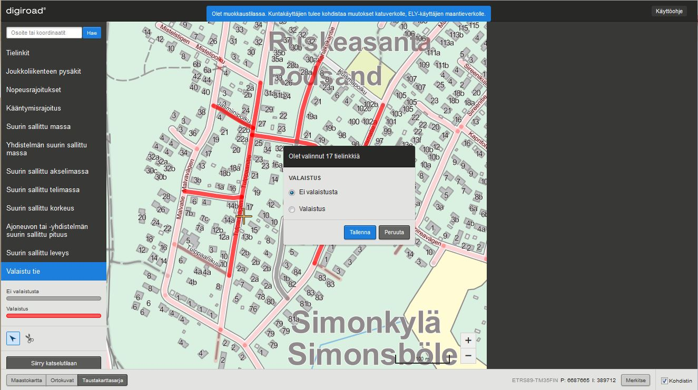

_Valaistuksen monivalinta._

###Valaistuksen katkaisu###

Tarvittaessa valaistuksen voi katkaista leikkausty&ouml;kalulla (8). Leikkausty&ouml;kalulla klikataan valaistuksen geometriasta kohtaa, josta se halutaan katkaista. Valaistuksen geometrian p&auml;&auml;ll&auml; ty&ouml;kalu n&auml;kyy ristin&auml;, jotta tarkka katkaisukohta on helppo m&auml;&auml;ritt&auml;&auml;. Rajoituksen katkaisussa uusille rajoituksille valitaan arvot oikean laidan valikoista (4). Kartalla ja valikkojen vieress&auml; olevat kirjaimet osoittavat, kummasta rajoituksesta on kyse (5). Uudet valaistustiedot tallennetaan tallenna-painikkeesta (6). Katkaisun voi peruuttaa peruuta-painikkeella (7), jolloin alkuper&auml;inen rajoitus j&auml;&auml; voimaan.

Huom! Valaistuksen katkaisussa tulee m&auml;&auml;ritt&auml;&auml; uusille rajoituksille eri arvot, jotta tallennus on mahdollista.

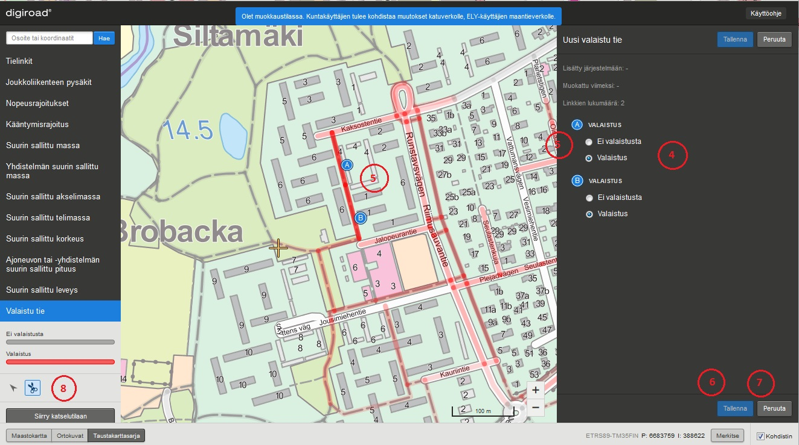

_Valaistusgeometrian katkaisu._

9. Kelirikko
----------------------

Kelirikko on viivamainen kohde. Kelirikko voi olla tielinkin mittainen tai sit&auml; lyhyempi viiva. Kelirikko -tietolajin saa kartalle valitsemalla sen tietolaji-paletista (1). Kohteet tulevat n&auml;kyviin kartalle, kun zoomaa l&auml;hemm&auml;ksi. Jos tielinkille on ilmoitettu kelirikko, se piirtyy kartalle punaisella viivalla (2). Tielinkit, joilla ei ole kelirikkoa ovat harmaita (3). Kelirikon arvo on kyll&auml; tai ei.

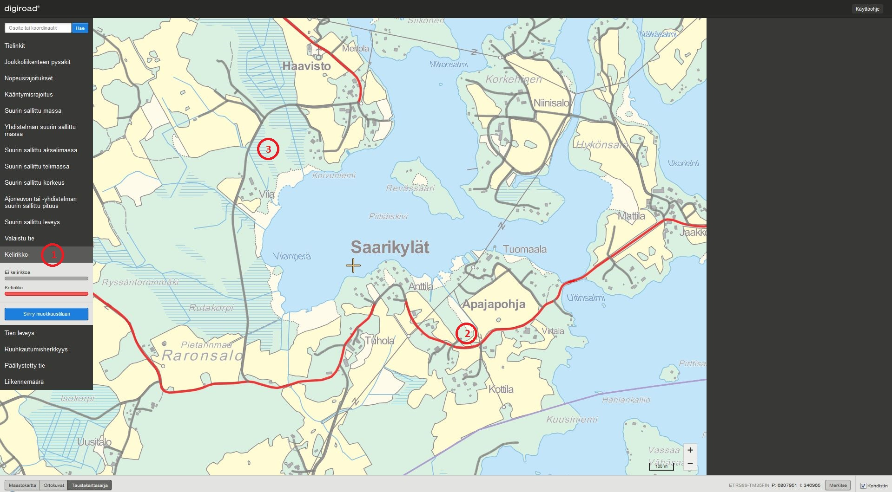

_Kelirikko._

##9.1 Kelirikkotietojen katselu##

Kun kohdetta klikkaa kartalta, se korostuu (4) ja ominaisuustietotauluun tulee n&auml;kyviin sen tiedot (5). Kerran klikkaamalla tulee valituksi koko kelirikkoketju, eli kaikki linkit, joilla on sama kelirikkotieto ja tiennumero (maantiell&auml;) tai tien nimi (katuverkko ja yksityistie). Jos k&auml;ytt&auml;j&auml; haluaa valita vain yhden linkin mittaisen p&auml;tk&auml;n tarkasteluun, sen voi tehd&auml; tuplaklikkaamalla linkki&auml;. Kelirikkotiedolla on lis&auml;tty j&auml;rjestelm&auml;&auml;n ja muokattu viimeksi -tiedot sek&auml; kelirikon arvo kyll&auml;/ei, sek&auml; tieto linkkien lukum&auml;&auml;r&auml;st&auml; kelirikkoketjussa. 

_Kelirikkotiedon katselu._

##9.2 Kelirikkotietojen muokkaus##

Kelirikkotietoja voi muokata muokkaustilassa. Muutokset tallennetaan aina Tallenna-painikkeesta tai perutaan Peruuta-painikkeesta, jolloin alkuper&auml;inen tieto j&auml;&auml; voimaan.
Muokkaustilassa kelirikolle voi antaa uuden arvon (kyll&auml;/ei) ja niit&auml; voi katkaista. Kelirikon arvoa voi muokata kolmella tavalla:

1. Koko kelirikkoketjulle kerralla.
2. Yksitt&auml;isen linkin mittaiselle osuudelle.
3. Monivalinnan avulla kokonaiselle alueelle.

_Kelirikkotiedon muokkaus._

###Kelirikkotiedon lis&auml;ys###
Uusi kelirikkotieto lis&auml;t&auml;&auml;n valitsemalla kartalta harmaa geometria ja valitsemalla oikean laidan ominaisuustietotaulussa "Kelirikko" (6). Uusi kelirikkotieto n&auml;kyy kartalla punaisena.

_Kelirikkotiedon lis&auml;ys._

###Kelirikkotiedon poistaminen###

Kelirikkotiedon voi poistaa valitsemalla tielinkin, jolla on kelirikko ja oikean laidan ominaisuustietotaulusta kohdan "Ei kelirikkoa" (7). Kun kelirikkotieto on poistettu, kohde muuttuu kartalla harmaaksi.

_Kelirikkotiedon poistaminen._

###Kelirikkojen muokkaus monivalintaty&ouml;kalulla###

Usealle linkille voi lis&auml;t&auml; tai poistaa kelirikon kerralla pit&auml;m&auml;ll&auml; muokkaustilassa n&auml;pp&auml;imist&ouml;lt&auml; Ctrl-painiketta pohjassa ja piirt&auml;m&auml;ll&auml; laatikko haluttujen linkkien p&auml;&auml;lle hiiren vasemmalla n&auml;pp&auml;imell&auml;. Valituksi tulevat kaikki linkit laatikon sis&auml;ll&auml; ja linkit, joita laatikko leikkaa. Valinnan j&auml;lkeen avautuu ikkuna, jossa valitaan kelirikon arvo ja painetaan tallenna. Peruuta-painikkeesta voi perua muutoksen.

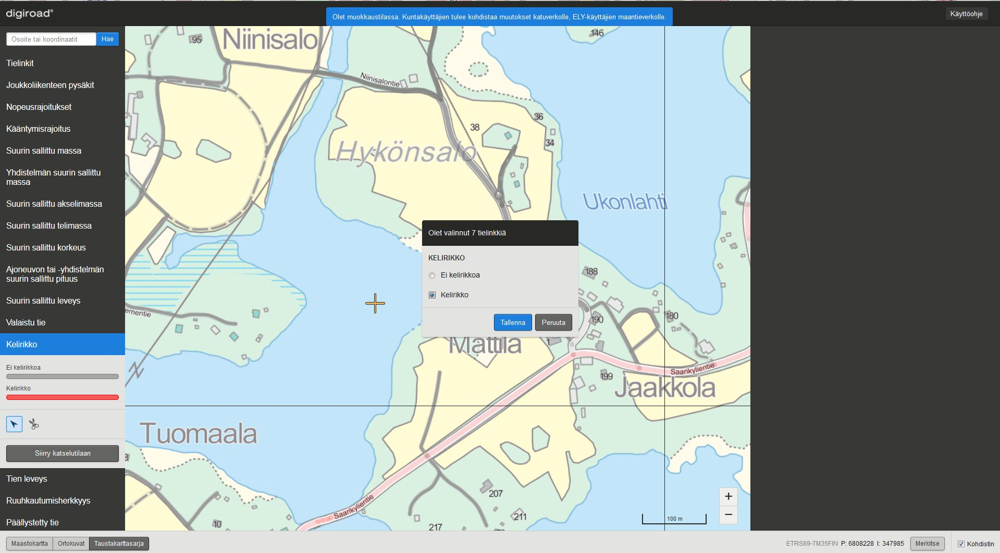

_Kelirikon monivalinta._

###Kelirikkotiedon katkaisu###

Tarvittaessa kelirikon voi katkaista leikkausty&ouml;kalulla (8). Leikkausty&ouml;kalulla klikataan kelirikon geometriasta kohtaa, josta se halutaan katkaista. Kelirikon geometrian p&auml;&auml;ll&auml; ty&ouml;kalu n&auml;kyy ristin&auml;, jotta tarkka katkaisukohta on helppo m&auml;&auml;ritt&auml;&auml;. Kelirikon katkaisussa uusille geometrioille valitaan arvot oikean laidan valikoista (4). Kartalla ja valikkojen vieress&auml; olevat kirjaimet osoittavat, kummasta geometriasta on kyse (5). Uudet kelirikkotiedot tallennetaan tallenna-painikkeesta (6). Katkaisun voi peruuttaa peruuta-painikkeella (7), jolloin alkuper&auml;inen tieto j&auml;&auml; voimaan.
Katkaisuty&ouml;kalu valitsee aina vain linkin mittaisen osion geometriasta, ei koko kelirikkoketjua.

Huom! Kelirikon katkaisussa tulee m&auml;&auml;ritt&auml;&auml; uusille geometrioille eri arvot, jotta tallennus on mahdollista.

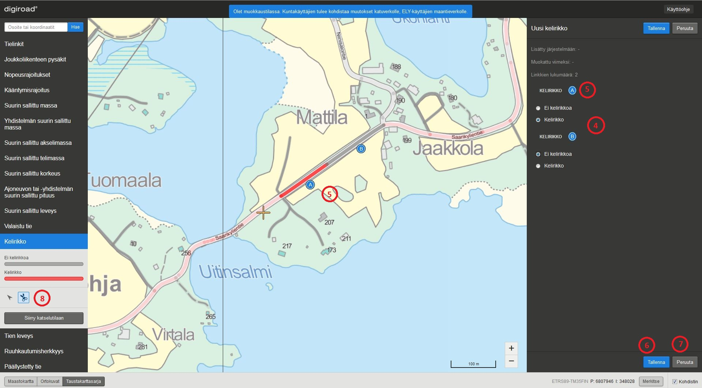

_Kelirikkogeometrian katkaisu._

10. Tien leveys
----------------------

Kartalle voi valita tietolajit-paletista (1) Tien leveys -valinnan. Karttaa tarkennettaessa geometriat paksuuntuvat, jotta niiden erottaminen on helpompaa. Tielinkit, joiden leveys tiedet&auml;&auml;n on visualisoitu punaisella v&auml;rill&auml; ja tielinkit, joiden leveys ei ole tiedossa, on visualisoitu harmaalla v&auml;rill&auml;. Tien leveys ilmoitetaan senttimetrein&auml; (cm).

_Tien leveys -valinta._

##10.1 Tien leveyden katselu##

Yksitt&auml;isen tien leveys -kohteen voi valita klikkaamalla kartalta sen geometriaa (4). Kerran klikkaamalla tulee valituksi koko leveysketju, eli kaikki linkit, joilla on sama tien leveys ja tiennumero (maantiell&auml;) tai tien nimi (katuverkko ja yksityistie). Jos k&auml;ytt&auml;j&auml; haluaa valita vain yhden linkin mittaisen p&auml;tk&auml;n tarkasteluun, sen voi tehd&auml; tuplaklikkaamalla tielinkki&auml;. Geometria tummentuu ja muut geometriat n&auml;kyv&auml;t haaleammalla. Sivun oikeaan laitaan avautuu valitun tielinkin tai linkkiketjun ominaisuustieton&auml;kym&auml; (6). Tien leveydell&auml; on ID, lis&auml;tty j&auml;rjestelm&auml;&auml;n ja muokattu viimeksi -tiedot sek&auml; tien leveyden arvo senttimetrein&auml;, sek&auml; tieto linkkien lukum&auml;&auml;r&auml;st&auml; valittuna olevasta tielinkkiketjusta.

_Tien leveys -katselutila._

##10.2 Tien leveys -kohteiden muokkaus##

Tien leveys -tietoja voi muokata muokkaustilassa. Muutokset tallennetaan aina Tallenna-painikkeesta tai perutaan Peruuta-painikkeesta, jolloin alkuper&auml;inen tieto j&auml;&auml; voimaan.
Muokkaustilassa tien leveydelle voi antaa uuden arvon (cm), tietoja voi poistaa sek&auml; leveysgeometrian voi katkaista. Tien leveyden arvoa voi muokata kolmella tavalla:

1. Koko leveysketjulle kerralla.
2. Yksitt&auml;isen linkin mittaiselle osuudelle.
3. Monivalinnan avulla kokonaiselle alueelle.

###Tien leveyden muokkaus###

Tien leveys -valintaa muokataan muokkaustilassa. Muokattava kohde valitaan klikkaamalla sen geometriaa (4). Kerran klikkaamalla tulee valituksi koko leveysketju, eli kaikki per&auml;kk&auml;iset tielinkit, joilla on sama leveys ja tiennumero (maantiell&auml;) tai tien nimi (katuverkko ja yksityistie). Tietoja muokataan ominaisuustieton&auml;kym&auml;ss&auml; (6). Muutokset tallennetaan painamalla Tallenna-painiketta oikeasta alakulmasta (8). Ennen Tallenna-painikkeen painamista muutokset voi peruuttaa painamalla Peruuta-painiketta (9). Tallenna- ja Peruuta -painikkeet eiv&auml;t ole aktiivisina, jos muutoksia ei ole tehty. Jos muutoksia on tehty eik&auml; niit&auml; ole tallennettu tai peruutettu ja siirryt&auml;&auml;n pois tielinkin valinnasta, sovellus antaa muutos-dialogin. Muutos-dialogi kertoo k&auml;ytt&auml;j&auml;lle, ett&auml; muutoksia on tehty ja ne tulee tallentaa tai peruuttaa ennen kuin voi jatkaa.

Huom! Tien leveyden arvokent&auml;ss&auml; muiden kuin numeroarvojen tallentaminen aiheuttaa virhetilanteita tallentuvissa tiedoissa.

_Tien leveyden muokkaus._

###Tien leveyden muokkaus monivalintaty&ouml;kalulla###

Useamman kuin yhden tielinkin leveyden voi muuttaa kerralla. Halutut tielinkit valitaan painamalla Ctrl-painike n&auml;pp&auml;imist&ouml;lt&auml; pohjaan ja piirt&auml;m&auml;ll&auml; hiiren vasen painike pohjassa laatikko linkkien p&auml;&auml;lle. Valituksi tulevat kaikki linkit laatikon sis&auml;ll&auml; ja linkit, joita laatikko leikkaa. Valinnan j&auml;lkeen avautuu ikkuna, jossa valitaan tien leveyden arvo ja painetaan tallenna. Peruuta-painikkeesta voi perua muutoksen.

_Useamman tien leveyden muokkaus kerralla._

###Tien leveys -kohteen katkaisu###

Tien leveys -kohteen voi jakaa kahteen osaan leikkausty&ouml;kalulla (1). Siten leikkausty&ouml;kalun avulla voi muuttaa tien leveytt&auml; lyhyill&auml; tieosuuksilla. Leikkausty&ouml;kalulla klikataan leveyden geometriasta kohtaa, josta leveystieto halutaan katkaista. Leveyden geometrian p&auml;&auml;ll&auml; ty&ouml;kalu n&auml;kyy ristin&auml;, jotta tarkka katkaisukohta on helppo m&auml;&auml;ritt&auml;&auml; (2).
Katkaisuty&ouml;kalu valitsee aina vain linkin mittaisen osion geometriasta, ei koko leveysketjua.

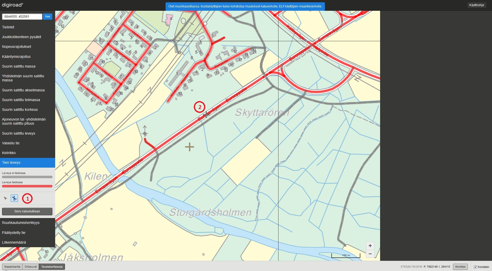

_Tien leveys -geometrian katkaisu._

Katkaistun leveystiedon osista pidemm&auml;lle j&auml;&auml; alkuper&auml;isen ID, ja lyhyemm&auml;lle generoidaan uusi ID. Geometrian katkaisussa uusille geometrioille m&auml;&auml;ritell&auml;&auml;n arvot oikean laidan kentiss&auml; (4). Kartalla ja valikkojen vieress&auml; olevat kirjaimet osoittavat, kummasta geometriasta on kyse (5). Uudet leveystiedot tallennetaan tallenna-painikkeesta (6). Katkaisun voi peruuttaa peruuta-painikkeella (7), jolloin alkuper&auml;inen tien leveys j&auml;&auml; voimaan.

Huom! Geometrian katkaisussa tulee m&auml;&auml;ritt&auml;&auml; uusille tieosuuksille eri arvot, jotta tallennus on mahdollista.

_Tien leveys -kohteen katkaisu._

###Tien leveys -kohteen poistaminen###

Tielinkin tien leveys -kohde poistetaan ominaisuustieton&auml;kym&auml;ss&auml; (6) valitsemalla Leveys-kohdasta "Leveys ei tiedossa".

_Tien leveys -kohteen poistaminen._

###Uuden tien leveys -kohteen lis&auml;&auml;minen###

Tielinkille voi lis&auml;t&auml; tien leveys -kohteen valitsemalla linkin geometrian (4) Tien leveys -muokkaustilassa. Ominaisuustieton&auml;kym&auml;&auml;n (6) avautuu tielinkin leveyden tiedot. Valitaan "Leveys tiedossa" ja sy&ouml;tet&auml;&auml;n leveys sy&ouml;tekentt&auml;&auml;n.  Tien leveys tallennetaan painamalla Tallenna (8). Uuden tien leveys -kohteen lis&auml;&auml;misen voi perua Peruuta-painikkeella (9).

_Tien leveys -kohteen lis&auml;&auml;minen._

11. Ruuhkautumisherkkyys
----------------------

Ruuhkautumisherkkyys on viivamainen kohde. Ruuhkautumisherkkyys voi olla tielinkin mittainen tai sit&auml; lyhyempi viiva. Ruuhkautumisherkkyys -tietolajin saa kartalle valitsemalla sen tietolaji-paletista (1). Kohteet tulevat n&auml;kyviin kartalle, kun zoomaa l&auml;hemm&auml;ksi. Jos tielinkille on ilmoitettu ruuhkautumisherkkyys, se piirtyy kartalle punaisella viivalla (2). Ruuhkautumattomat tielinkit ovat harmaita (3). Ruuhkautumisherkkyyden arvo on kyll&auml; tai ei.

_Ruuhkautumisherkkyys._

##11.1 Ruuhkautumisherkkyystietojen katselu##

Kun kohdetta klikkaa kartalta, se korostuu (4). ja ominaisuustietotauluun tulee n&auml;kyviin sen tiedot (5). Kerran klikkaamalla tulee valituksi koko ruuhkautumisherkkyysketju, eli kaikki linkit, joilla on sama ruuhkautumisherkkyystieto ja tiennumero (maantiell&auml;) tai tien nimi (katuverkko ja yksityistie). Jos k&auml;ytt&auml;j&auml; haluaa valita vain yhden linkin mittaisen p&auml;tk&auml;n tarkasteluun, sen voi tehd&auml; tuplaklikkaamalla linkki&auml;. Ruuhkautumisherkkyydell&auml; on ID, lis&auml;tty j&auml;rjestelm&auml;&auml;n ja muokattu viimeksi -tiedot sek&auml; ruuhkautumisherkkyyden arvo kyll&auml;/ei, sek&auml; tieto linkkien lukum&auml;&auml;r&auml;st&auml; valittuna olevasta tielinkkiketjusta.

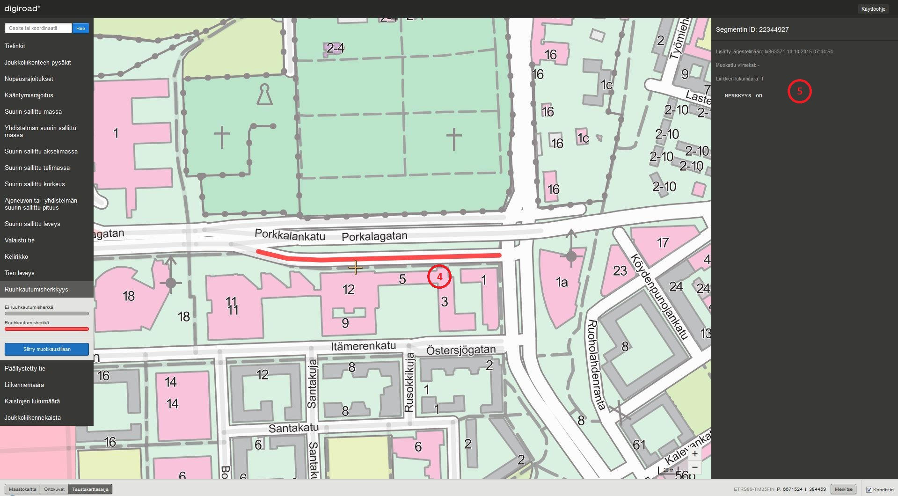

_Ruuhkautumisherkkyystiedon katselu._

##11.2 Ruuhkautumisherkkyystietojen muokkaus##

Ruuhkautumisherkkyys-tietoja voi muokata muokkaustilassa. Ruuhkautumisherkkyyden voi lis&auml;t&auml;, poistaa ja ruuhkautumisherkkyysgeometrian voi katkaista. Muutokset tallennetaan aina Tallenna-painikkeesta tai perutaan Peruuta-painikkeesta, jolloin alkuper&auml;inen tieto j&auml;&auml; voimaan.
Ruuhkautumisherkkyyden arvoa voi muokata kolmella tavalla:

1. Koko ruuhkautumisherkkyysketjulle kerralla.
2. Yksitt&auml;isen linkin mittaiselle osuudelle.
3. Monivalinnan avulla kokonaiselle alueelle.

###Ruuhkautumisherkkyystiedon lis&auml;ys###

Uusi ruuhkautumisherkkyystieto lis&auml;t&auml;&auml;n valitsemalla kartalta harmaa geometria ja valitsemalla oikean laidan ominaisuustietotaulussa "Ruuhkautumisherkk&auml;" (6). Uusi ruuhkautumisherkkyys-tieto n&auml;kyy kartalla punaisena.

_Ruuhkautumisherkkyystiedon lis&auml;ys._

###Ruuhkautumisherkkyystiedon poistaminen###

Ruuhkautumisherkkyystiedon voi poistaa valitsemalla ruuhkautumisherk&auml;n kohteen ja oikean laidan ominaisuustietotaulusta kohdan "Ei ruuhkautumisherkk&auml; " (7). Kun ruuhkautumisherkkyystieto on poistettu, kohde muuttuu kartalla harmaaksi.

_Ruuhkautumisherkkyystiedon poistaminen._

###Ruuhkautumisherkkyyden muokkaus monivalintaty&ouml;kalulla###

Usealle linkille voi lis&auml;t&auml; tai poistaa ruuhkautumisherkkyystiedon kerralla pit&auml;m&auml;ll&auml; muokkaustilassa n&auml;pp&auml;imist&ouml;lt&auml; Ctrl-painiketta pohjassa ja piirt&auml;m&auml;ll&auml; laatikko haluttujen linkkien p&auml;&auml;lle hiiren vasemmalla n&auml;pp&auml;imell&auml;. Valituksi tulevat kaikki linkit laatikon sis&auml;ll&auml; ja linkit, joita laatikko leikkaa. Valinnan j&auml;lkeen avautuu ikkuna, jossa valitaan ruuhkautumisherkkyyden arvo ja painetaan tallenna. Peruuta-painikkeesta voi perua muutoksen.

_Ruuhkautumisherkkyyden monivalinta._

###Ruuhkautumisherkkyystiedon katkaisu###

Tarvittaessa ruuhkautumisherkkyystiedon voi katkaista leikkausty&ouml;kalulla (8). Leikkausty&ouml;kalulla klikataan ruuhkautumisherkkyyden geometriasta kohtaa, josta se halutaan katkaista. Ruuhkautumisherkkyyden geometrian p&auml;&auml;ll&auml; ty&ouml;kalu n&auml;kyy ristin&auml;, jotta tarkka katkaisukohta on helppo m&auml;&auml;ritt&auml;&auml;. Ruuhkautumisherkkyystiedon katkaisussa uusille geometrioille valitaan arvot oikean laidan valikoista (4). Kartalla ja valikkojen vieress&auml; olevat kirjaimet osoittavat, kummasta tieosuudesta on kyse (5). Uudet ruuhkautumisherkkyystiedot tallennetaan tallenna-painikkeesta (6). Katkaisun voi peruuttaa peruuta-painikkeella (7), jolloin alkuper&auml;inen tieto j&auml;&auml; voimaan.

Huom! Ruuhkautumisherkkyystiedon katkaisussa tulee m&auml;&auml;ritt&auml;&auml; uusille geometrioille eri arvot, jotta tallennus on mahdollista.

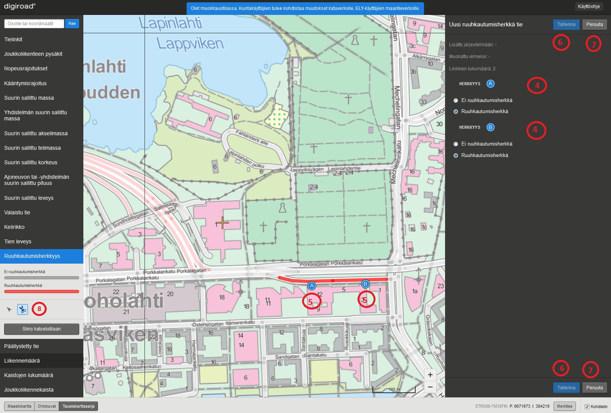

_Ruuhkautumisherkkyysgeometrian katkaisu._

12. P&auml;&auml;llystetty tie
----------------------

P&auml;&auml;llystetty tie on viivamainen kohde. P&auml;&auml;llystys voi olla tielinkin mittainen tai sit&auml; lyhyempi viiva. P&auml;&auml;llystetty tie -tietolajin saa kartalle valitsemalla sen tietolaji-paletista (1). Kohteet tulevat n&auml;kyviin kartalle, kun zoomaa l&auml;hemm&auml;ksi. Jos tielinkille on ilmoitettu p&auml;&auml;llyste, se piirtyy kartalle punaisella viivalla (2). P&auml;&auml;llyst&auml;m&auml;tt&ouml;m&auml;ksi merkatut tielinkit ovat harmaita (3). P&auml;&auml;llystyksen arvo on kyll&auml; tai ei.
P&auml;&auml;llyste -tiedon l&auml;hde tielinkille on Maanmittauslaitoksen maastotietokanta.

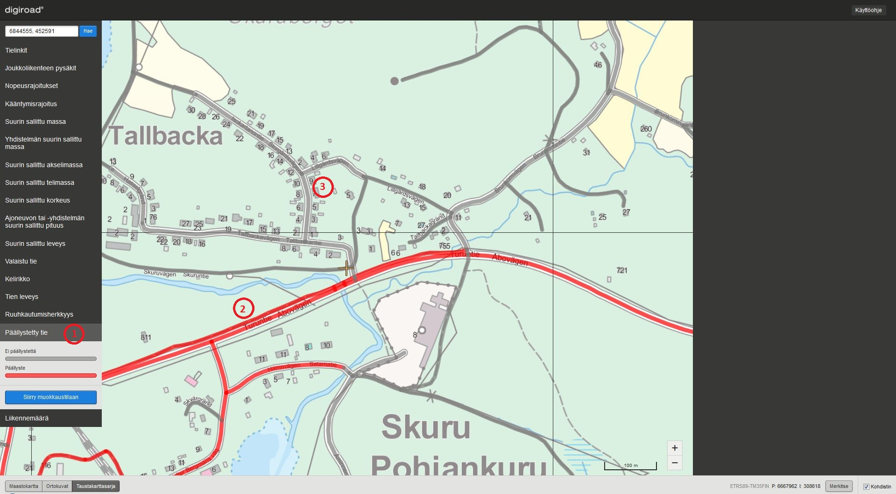

_P&auml;&auml;llystetty tie._

##12.1 P&auml;&auml;llystetietojen katselu##

Kun kohdetta klikkaa kartalta, se korostuu (4). ja ominaisuustietotauluun tulee n&auml;kyviin sen tiedot (5). Kerran klikkaamalla tulee valituksi koko p&auml;&auml;llysteketju, eli kaikki linkit, joilla on sama p&auml;&auml;llystetieto ja tiennumero (maantiell&auml;) tai tien nimi (katuverkko ja yksityistie). Jos k&auml;ytt&auml;j&auml; haluaa valita vain yhden linkin mittaisen p&auml;tk&auml;n tarkasteluun, sen voi tehd&auml; tuplaklikkaamalla linkki&auml;. P&auml;&auml;llystyksell&auml; on ID, lis&auml;tty j&auml;rjestelm&auml;&auml;n ja muokattu viimeksi -tiedot sek&auml; p&auml;&auml;llystyksen arvo kyll&auml;/ei, sek&auml; tieto linkkien lukum&auml;&auml;r&auml;st&auml; p&auml;&auml;llysteketjussa.

_P&auml;&auml;llystetiedon katselu._

##12.2 P&auml;&auml;llystetietojen muokkaus##

P&auml;&auml;llystetietoja voi muokata muokkaustilassa. P&auml;&auml;llystetiedon voi lis&auml;t&auml;, poistaa ja p&auml;&auml;llystegeometrian voi katkaista. Muutokset tallennetaan aina Tallenna-painikkeesta tai perutaan Peruuta-painikkeesta, jolloin alkuper&auml;inen tieto j&auml;&auml; voimaan.
P&auml;&auml;llysteen arvoa voi muokata kolmella tavalla:

1. Koko p&auml;&auml;llysteketjulle kerralla.
2. Yksitt&auml;isen linkin mittaiselle osuudelle.
3. Monivalinnan avulla kokonaiselle alueelle.

###P&auml;&auml;llystetiedon lis&auml;ys###

Uusi p&auml;&auml;llystetieto lis&auml;t&auml;&auml;n valitsemalla kartalta harmaa geometria ja valitsemalla oikean laidan ominaisuustietotaulussa "P&auml;&auml;llyste" (6). Uusi p&auml;&auml;llystystieto n&auml;kyy kartalla punaisena.

_P&auml;&auml;llystetiedon lis&auml;ys._

###P&auml;&auml;llystetiedon poistaminen###

P&auml;&auml;llystetiedon voi poistaa valitsemalla p&auml;&auml;llystetyn kohteen ja oikean laidan ominaisuustietotaulusta kohdan "Ei p&auml;&auml;llystett&auml;" (7). Kun p&auml;&auml;llystetieto on poistettu, kohde muuttuu kartalla harmaaksi.

_P&auml;&auml;llystetiedon poistaminen._

###P&auml;&auml;llystetiedon muokkaus monivalintaty&ouml;kalulla###

Usealle linkille voi lis&auml;t&auml; tai poistaa p&auml;&auml;llystetiedon kerralla pit&auml;m&auml;ll&auml; muokkaustilassa n&auml;pp&auml;imist&ouml;lt&auml; Ctrl-painiketta pohjassa ja piirt&auml;m&auml;ll&auml; laatikko haluttujen linkkien p&auml;&auml;lle hiiren vasemmalla n&auml;pp&auml;imell&auml;. Valituksi tulevat kaikki linkit laatikon sis&auml;ll&auml; ja linkit, joita laatikko leikkaa. Valinnan j&auml;lkeen avautuu ikkuna, jossa valitaan p&auml;&auml;llysteen arvo ja painetaan tallenna. Peruuta-painikkeesta voi perua muutoksen.

_P&auml;&auml;llysteen monivalinta._

###P&auml;&auml;llysteen katkaisu###

Tarvittaessa p&auml;&auml;llysteen voi katkaista leikkausty&ouml;kalulla (8). Leikkausty&ouml;kalulla klikataan p&auml;&auml;llysteen geometriasta kohtaa, josta se halutaan katkaista. P&auml;&auml;llysteen geometrian p&auml;&auml;ll&auml; ty&ouml;kalu n&auml;kyy ristin&auml;, jotta tarkka katkaisukohta on helppo m&auml;&auml;ritt&auml;&auml;. P&auml;&auml;llysteen katkaisussa uusille tieosuuksille valitaan arvot oikean laidan valikoista (4). Kartalla ja valikkojen vieress&auml; olevat kirjaimet osoittavat, kummasta geometriasta on kyse (5). Uudet p&auml;&auml;llystetiedot tallennetaan tallenna-painikkeesta (6). Katkaisun voi peruuttaa peruuta-painikkeella (7), jolloin alkuper&auml;inen p&auml;&auml;llystetieto j&auml;&auml; voimaan.

Huom! P&auml;&auml;llysteen katkaisussa tulee m&auml;&auml;ritt&auml;&auml; uusille geometrioille eri arvot, jotta tallennus on mahdollista.

_P&auml;&auml;llystegeometrian katkaisu._

13. Liikennem&auml;&auml;r&auml;
----------------------

Kartalle voi valita tietolajit-paletista (1) Liikennem&auml;&auml;r&auml;-valinnan. Liikennem&auml;&auml;r&auml; on viivamainen tietolaji, ja sen arvo ilmoitetaan kokonaisulukuna ajoneuvoa/vuorokausi. Karttaa tarkennettaessa geometriat paksuuntuvat, jotta niiden erottaminen on helpompaa. Geometriat on visualisoitu punaisella v&auml;rill&auml; (2) ja tielinkit, joiden liikennem&auml;&auml;r&auml; ei ole tiedossa, on visualisoitu harmaalla v&auml;rill&auml; (3).

_Liikennem&auml;&auml;r&auml; -valinta._

##13.1 Liikennem&auml;&auml;r&auml;tietojen katselu##

Yksitt&auml;isen liikennem&auml;&auml;r&auml;kohteen voi valita klikkaamalla kartalta sen geometriaa (4). Kerran klikkaamalla tulee valituksi koko liikennem&auml;&auml;r&auml;ketju, eli kaikki tieosuudet, joilla on sama liikennem&auml;&auml;r&auml;n arvo ja tiennumero (maantiell&auml;) tai tien nimi (katuverkko ja yksityistie). Jos k&auml;ytt&auml;j&auml; haluaa valita vain yhden linkin mittaisen p&auml;tk&auml;n tarkasteluun, sen voi tehd&auml; tuplaklikkaamalla linkki&auml;. Geometria tummentuu ja muut geometriat n&auml;kyv&auml;t haaleammalla. Sivun oikeaan laitaan avautuu valitun tielinkin tai linkkiketjun ominaisuustieton&auml;kym&auml; (6). Liikennem&auml;&auml;r&auml;ll&auml; on ID, lis&auml;tty j&auml;rjestelm&auml;&auml;n ja muokattu viimeksi -tiedot sek&auml; liikennem&auml;&auml;r&auml;n arvo (kokonaisluku), sek&auml; tieto linkkien lukum&auml;&auml;r&auml;st&auml; p&auml;&auml;llysteketjussa.

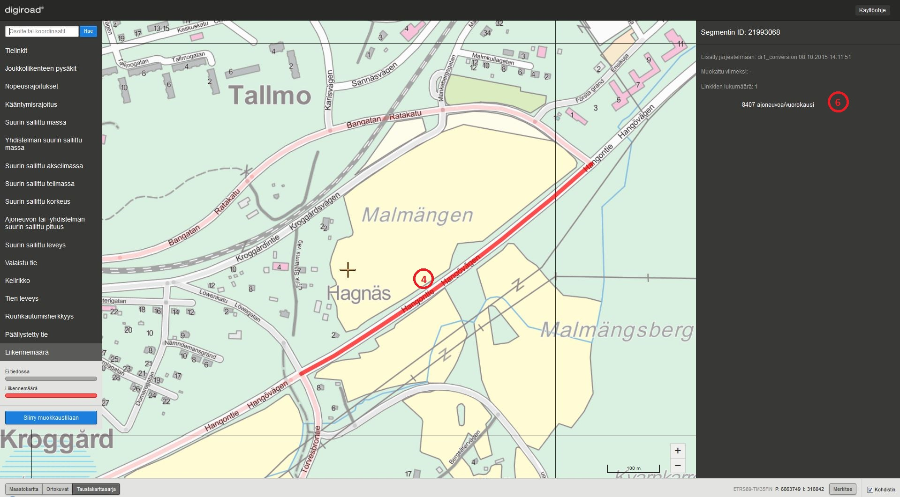

_Liikennem&auml;&auml;r&auml;-katselutila._

##13.2 Liikennem&auml;&auml;rien ominaisuustietojen muokkaus##

Liikennem&auml;&auml;r&auml;n voi muokata muokkaustilassa. Muutokset tallennetaan aina Tallenna-painikkeesta tai perutaan Peruuta-painikkeesta, jolloin alkuper&auml;inen tieto j&auml;&auml; voimaan.
Muokkaustilassa liikennem&auml;&auml;r&auml;lle voi antaa uuden arvon (kokonaisluku ajoneuvoa/vuorokausi), tietoja voi poistaa sek&auml; liikennem&auml;&auml;r&auml;geometrian voi katkaista. Liikennem&auml;&auml;r&auml;n arvoa voi muokata kolmella tavalla:

1. Koko liikennem&auml;&auml;r&auml;ketjulle kerralla.
2. Yksitt&auml;isen linkin mittaiselle osuudelle.
3. Monivalinnan avulla kokonaiselle alueelle.

###Liikennem&auml;&auml;r&auml;n arvon muokkaus###

Liikennem&auml;&auml;r&auml;valintaa muokataan muokkaustilassa. Muokattava kohde valitaan klikkaamalla sen geometriaa (4). Kerran klikkaamalla tulee valituksi koko tielinkkiketju, eli kaikki per&auml;kk&auml;iset tielinkit, joilla on sama arvo ja tiennumero (maantiell&auml;) tai tien nimi (katuverkko ja yksityistie). Tietoja muokataan ominaisuustieton&auml;kym&auml;ss&auml; (6). Muutokset tallennetaan painamalla Tallenna-painiketta oikeasta alakulmasta (8). Ennen Tallenna-painikkeen painamista muutokset voi peruuttaa painamalla Peruuta-painiketta (9). Tallenna- ja Peruuta -painikkeet eiv&auml;t ole aktiivisina, jos muutoksia ei ole tehty. Jos muutoksia on tehty eik&auml; niit&auml; ole tallennettu tai peruutettu ja siirryt&auml;&auml;n pois tielinkin valinnasta, sovellus antaa muutos-dialogin. Muutos-dialogi kertoo k&auml;ytt&auml;j&auml;lle, ett&auml; muutoksia on tehty ja ne tulee tallentaa tai peruuttaa ennen kuin voi jatkaa.

Huom! Liikennem&auml;&auml;r&auml;n arvokent&auml;ss&auml; muiden kuin numeroarvojen tallentaminen aiheuttaa virhetilanteita tallentuvissa tiedoissa.

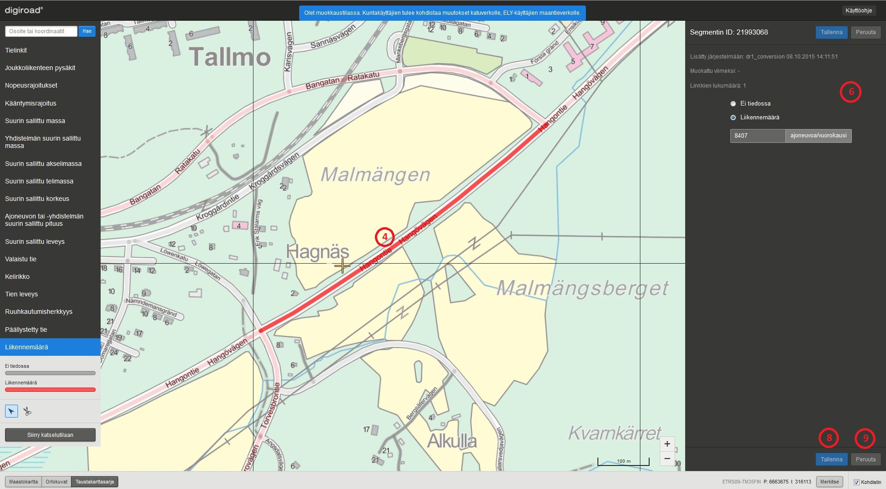

_Liikennem&auml;&auml;r&auml;n muokkaus._

###Liikennem&auml;&auml;rien muokkaus monivalintaty&ouml;kalulla###

Useamman kuin yhden tielinkin liikennem&auml;&auml;r&auml;arvon voi muuttaa kerralla. Halutut geometriat valitaan painamalla Ctrl-painike n&auml;pp&auml;imist&ouml;lt&auml; pohjaan ja piirt&auml;m&auml;ll&auml; hiiren vasen painike pohjassa laatikko rajoitusten p&auml;&auml;lle. Valituksi tulevat kaikki linkit laatikon sis&auml;ll&auml; ja linkit, joita laatikko leikkaa. Valinnan j&auml;lkeen avautuu ikkuna, jossa valitaan liikennem&auml;&auml;r&auml;lle tallentuva arvo ja painetaan tallenna. Peruuta-painikkeesta voi perua muutoksen.

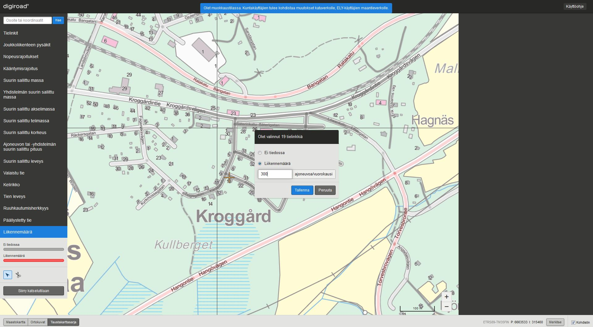

_Useamman tieosuuden liikennem&auml;&auml;r&auml;n muokkaus kerralla._

###Liikennem&auml;&auml;r&auml;kohteen katkaisu###

Liikennem&auml;&auml;r&auml;kohteen voi jakaa kahteen osaan leikkausty&ouml;kalulla (1). Leikkausty&ouml;kalulla klikataan tielinkin geometriasta kohtaa, josta liikennem&auml;&auml;r&auml;tieto halutaan katkaista. Tielinkin geometrian p&auml;&auml;ll&auml; ty&ouml;kalu n&auml;kyy ristin&auml;, jotta tarkka katkaisukohta on helppo m&auml;&auml;ritt&auml;&auml;. Liikennem&auml;&auml;r&auml;geometrian katkaisu valitsee aina vain linkin mittaisen osion geometriasta, ei koko liikennem&auml;&auml;r&auml;ketjua.
Katkaistun geometrian osista pidemm&auml;lle j&auml;&auml; alkuper&auml;isen ID, ja lyhyemm&auml;lle generoidaan uusi ID. Geometrian katkaisussa uusille geometrioille valitaan arvot oikean laidan valikoista (4). Kartalla ja valikkojen vieress&auml; olevat kirjaimet osoittavat, kummasta geometriasta on kyse (5). Uudet rajoitukset tallennetaan tallenna-painikkeesta (6). Katkaisun voi peruuttaa peruuta-painikkeella (7), jolloin alkuper&auml;inen liikennem&auml;&auml;r&auml;tieto j&auml;&auml; voimaan.

Huom! Geometrian katkaisussa tulee m&auml;&auml;ritt&auml;&auml; uusille liikennem&auml;&auml;r&auml;tiedoille eri arvot, jotta tallennus on mahdollista.

_Liikennem&auml;&auml;r&auml;kohteen katkaisu._

###Liikennem&auml;&auml;r&auml;kohteen poistaminen###

Tielinkin suurin liikennem&auml;&auml;r&auml;tieto poistetaan ominaisuustieton&auml;kym&auml;ss&auml; (6) valitsemalla "Ei tiedossa".

_Liikennem&auml;&auml;r&auml;tiedon poistaminen._

###Uuden liikennem&auml;&auml;r&auml;tiedon lis&auml;&auml;minen###

Tielinkille voi lis&auml;t&auml; liikennem&auml;&auml;r&auml;tiedon valitsemalla linkin geometrian (4) Liikennem&auml;&auml;r&auml; -muokkaustilassa. Ominaisuustieton&auml;kym&auml;&auml;n (6) avautuu tielinkin liikennem&auml;&auml;r&auml;tiedot. Valitaan "Liikennem&auml;&auml;r&auml;" ja sy&ouml;tet&auml;&auml;n arvo sy&ouml;tekentt&auml;&auml;n. Liikennem&auml;&auml;r&auml;tieto tallennetaan painamalla Tallenna (8). Uuden liikennem&auml;&auml;r&auml;tiedon lis&auml;&auml;misen voi perua Peruuta-painikkeella (9).

_Liikennem&auml;&auml;r&auml;tiedon lis&auml;&auml;minen._

14. Talvinopeusrajoitus
----------------------

Kartalle voi valita tietolajit-paletista (1) Talvinopeusrajoitus-tietolajin. Karttaa tarkennettaessa geometriat paksuuntuvat, jotta niiden erottaminen on helpompaa. Geometriat on visualisoitu punaisella v&auml;rill&auml; ja tielinkit, joilla talvinopeusrajoitusta ei ole, on visualisoitu harmaalla v&auml;rill&auml;.

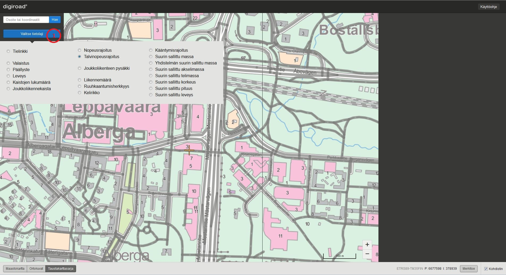

_Talvinopeusrajoitusvalinta._

##14.1 Talvinopeusrajoituksen tietojen katselu##

Yksitt&auml;isen talvinopeusrajoituksen voi valita klikkaamalla kartalta sen geometriaa (4). Kerran klikkaamalla tulee valituksi koko rajoitusketju, eli kaikki rajoitukset, joilla on sama rajoituksen arvo ja tiennumero (maantiell&auml;) tai tien nimi (katuverkko ja yksityistie). Jos k&auml;ytt&auml;j&auml; haluaa valita vain yhden linkin mittaisen p&auml;tk&auml;n tarkasteluun, sen voi tehd&auml; tuplaklikkaamalla rajoitusta. Geometria tummentuu ja muut geometriat n&auml;kyv&auml;t haaleammalla. Sivun oikeaan laitaan avautuu valitun rajoituksen tai rajoitusketjun ominaisuustieton&auml;kym&auml; (6).

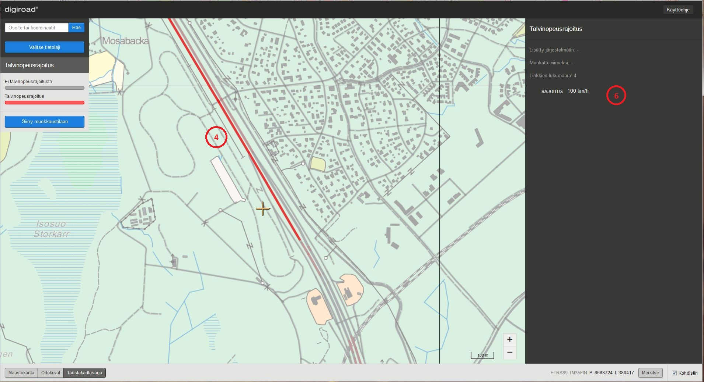

_Talvinopeusrajoituksen katselutila._

##14.2 Talvinopeusrajoituksen ominaisuustietojen muokkaus##

Muokkaustilassa talvinopeusrajoituksille voi antaa uusia arvoja ja niit&auml; voi katkaista. Rajoituksien arvoja voi muokata kolmella tavalla:
1. Koko rajoitusketjulle kerralla.
2. Yksitt&auml;isen linkin mittaiselle osuudelle.
3. Monivalinnan avulla kokonaiselle alueelle.

###Rajoituksen arvon muokkaus###

Talvinopeusrajoitusta muokataan muokkaustilassa. Muokattava kohde valitaan klikkaamalla sen geometriaa (4). Kerran klikkaamalla tulee valituksi koko rajoitusketju, eli kaikki per&auml;kk&auml;iset rajoitukset, joilla on sama arvo ja tiennumero (maantiell&auml;) tai tien nimi (katuverkko ja yksityistie). Tietoja muokataan ominaisuustieton&auml;kym&auml;ss&auml; (6). Muutokset tallennetaan painamalla Tallenna-painiketta oikeasta alakulmasta (8). Ennen Tallenna-painikkeen painamista muutokset voi peruuttaa painamalla Peruuta-painiketta (9). Tallenna- ja Peruuta -painikkeet eiv&auml;t ole aktiivisina, jos muutoksia ei ole tehty. Jos muutoksia on tehty eik&auml; niit&auml; ole tallennettu tai peruutettu ja siirryt&auml;&auml;n pois talvinopeusrajoituksen valinnasta, sovellus antaa muutos-dialogin. Muutos-dialogi kertoo k&auml;ytt&auml;j&auml;lle, ett&auml; muutoksia on tehty ja ne tulee tallentaa tai peruuttaa ennen kuin voi jatkaa.

_Talvinopeusrajoituksen muokkaus._

###Talvinopeusrajoitusten muokkaus monivalintaty&ouml;kalulla###

Useamman kuin yhden rajoituksen arvon voi muuttaa kerralla. Halutut rajoitukset valitaan painamalla Ctrl-painike n&auml;pp&auml;imist&ouml;lt&auml; pohjaan ja piirt&auml;m&auml;ll&auml; hiiren vasen painike pohjassa laatikko rajoitusten p&auml;&auml;lle. Valituksi tulevat kaikki linkit laatikon sis&auml;ll&auml; ja linkit, joita laatikko leikkaa. Valinnan j&auml;lkeen avautuu ikkuna, jossa valitaan rajoituksille tallentuva arvo ja painetaan tallenna. Peruuta-painikkeesta voi perua muutoksen.

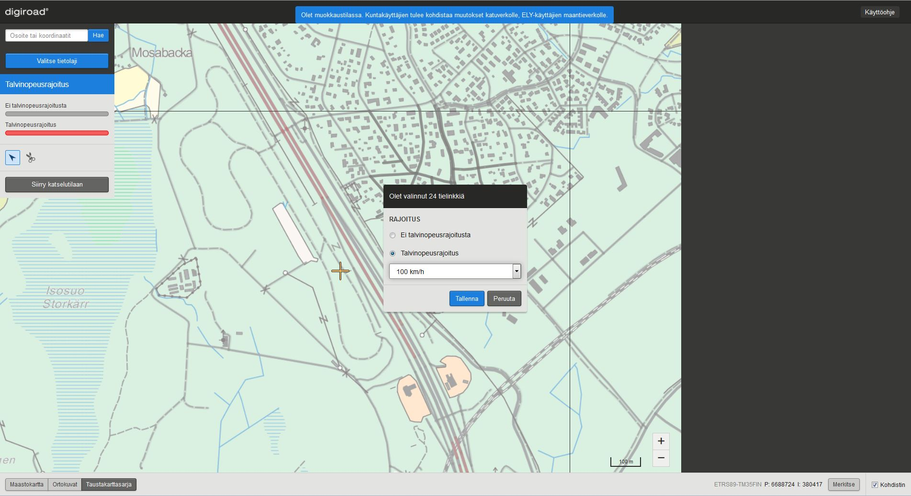

_Useamman rajoituksen arvon muokkaus kerralla._

###Talvinopeusrajoituskohteen katkaisu###

Talvinopeusrajoituksen voi jakaa kahteen osaan leikkausty&ouml;kalulla (1). Siten leikkausty&ouml;kalun avulla voi m&auml;&auml;ritell&auml; lyhyit&auml; rajoituksia poistamalla voimasta katkaisussa j&auml;ljelle j&auml;&auml;neit&auml; rajoituksia. Leikkausty&ouml;kalulla klikataan rajoituksen geometriasta kohtaa, josta rajoitus halutaan katkaista. Rajoituksen geometrian p&auml;&auml;ll&auml; ty&ouml;kalu n&auml;kyy ristin&auml;, jotta tarkka katkaisukohta on helppo m&auml;&auml;ritt&auml;&auml; (2).

Rajoituksen katkaisu valitsee aina vain linkin mittaisen osion rajoituksesta, ei koko rajoitusketjua.

_Talvinopeusrajoituskohteen katkaisu._

Katkaistun rajoituksen osista pidemm&auml;lle j&auml;&auml; alkuper&auml;isen ID, ja lyhyemm&auml;lle generoidaan uusi ID. Rajoituksen katkaisussa uusille rajoituksille valitaan arvot oikean laidan valikoista (4). Kartalla ja valikkojen vieress&auml; olevat kirjaimet osoittavat, kummasta rajoituksesta on kyse (5). Uudet rajoitukset tallennetaan tallenna-painikkeesta (6). Katkaisun voi peruuttaa peruuta-painikkeella (7), jolloin alkuper&auml;inen rajoitus j&auml;&auml; voimaan.

Huom! Rajoituksen katkaisussa tulee m&auml;&auml;ritt&auml;&auml; uusille rajoituksille eri arvot, jotta tallennus on mahdollista.

_Talvinopeusrajoituskohteen katkaisu._

###Talvinopeusrajoituksen poistaminen###

Tielinkin talvinopeusrajoitus poistetaan ominaisuustieton&auml;kym&auml;ss&auml; (6) valitsemalla Rajoitus-kohdasta "Ei talvinopeusrajoitusta".

_Talvinopeusrajoituksen poistaminen._

###Uuden talvinopeusrajoituksen lis&auml;&auml;minen###

Tielinkille voi lis&auml;t&auml; talvinopeusrajoituksen valitsemalla linkin geometrian (4) Talvinopeusrajoitus-muokkaustilassa. Ominaisuustieton&auml;kym&auml;&auml;n (6) avautuu tielinkin talvinopeusrajoituksen tiedot. Valitaan "Talvinopeusrajoitus" ja valitaan rajoituksen arvo valikosta. Talvinopeusrajoitus tallennetaan painamalla Tallenna (8). Talvinopeusrajoituksen lis&auml;&auml;misen voi perua Peruuta-painikkeella (9).

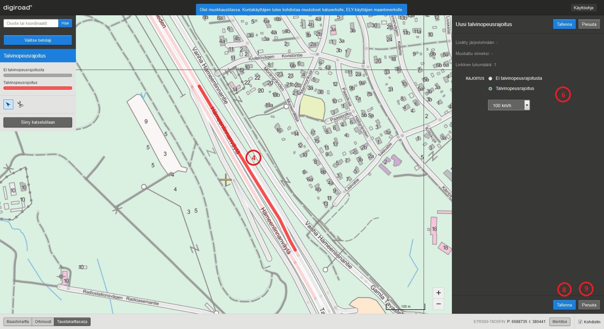

_Talvinopeusrajoituksen lis&auml;&auml;minen._

15. Joukkoliikennekaista
----------------------

Joukkoliikennekaista on viivamainen kohde. Joukkoliikennekaista voi olla tielinkin mittainen tai sit&auml; lyhyempi viiva. Joukkoliikennekaista-tietolajin saa kartalle valitsemalla sen tietolaji-paletista (1). Kohteet tulevat n&auml;kyviin kartalle, kun zoomaa l&auml;hemm&auml;ksi. Jos tielinkille on ilmoitettu joukkoliikennekaista, se piirtyy kartalle punaisella viivalla (2). Tielinkit ilman joukkoliikennekaistaa ovat harmaita (3). Joukkoliikennekaistan arvo on kyll&auml; tai ei.

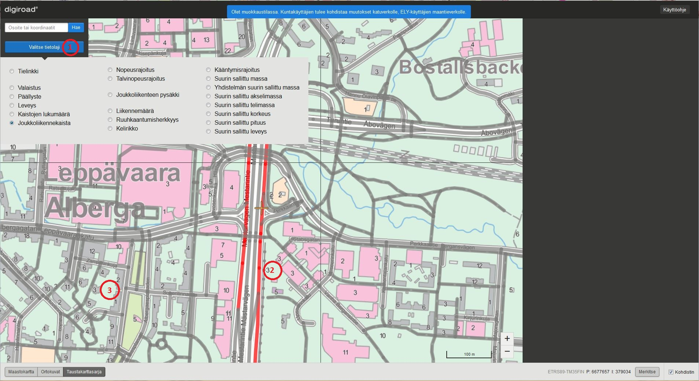

_Joukkoliikennekaista._

##15.1 Joukkoliikennekaistatietojen katselu##

Kun kohdetta klikkaa kartalta, se korostuu (4) ja ominaisuustietotauluun tulee n&auml;kyviin sen tiedot (5). Kerran klikkaamalla tulee valituksi koko joukkoliikennekaistaketju, eli kaikki linkit, joilla on sama tieto joukkoliikennekaistasta ja tiennumero (maantiell&auml;) tai tien nimi (katuverkko ja yksityistie). Jos k&auml;ytt&auml;j&auml; haluaa valita vain yhden linkin mittaisen p&auml;tk&auml;n tarkasteluun, sen voi tehd&auml; tuplaklikkaamalla linkki&auml;. Joukkoliikennekaistatiedolla on ID, lis&auml;tty j&auml;rjestelm&auml;&auml;n ja muokattu viimeksi -tiedot sek&auml; joukkoliikennekaistan arvo kyll&auml;/ei, sek&auml; tieto linkkien lukum&auml;&auml;r&auml;st&auml; joukkoliikennekaistaketjussa.

_Joukkoliikennekaistatiedon katselu._

##15.2 Joukkoliikennekaistatietojen muokkaus##

Joukkoliikennekaistatietoja voi muokata muokkaustilassa. Joukkoliikennekaistan voi lis&auml;t&auml;, poistaa ja geometrian voi katkaista. Muutokset tallennetaan aina Tallenna-painikkeesta tai perutaan Peruuta-painikkeesta, jolloin alkuper&auml;inen tieto j&auml;&auml; voimaan.

###Joukkoliikennekaistan lis&auml;ys###

Uusi joukkoliikennekaista lis&auml;t&auml;&auml;n valitsemalla kartalta harmaa geometria ja valitsemalla oikean laidan ominaisuustietotaulussa "Joukkoliikennekaista" (6). Uusi joukkoliikennekaistatieto n&auml;kyy kartalla punaisena.

_Joukkoliikennekaistan lis&auml;ys._

###Joukkoliikennekaistan poistaminen###

Joukkoliikennekaistan voi poistaa valitsemalla joukkoliikennekaistatiedon ja oikean laidan ominaisuustietotaulusta kohdan "Ei joukkoliikennekaistaa" (7). Kun joukkoliikennekaista on poistettu, kohde muuttuu kartalla harmaaksi.

_Joukkoliikennekaistan poistaminen._

###Joukkoliikennekaistatietojen muokkaus monivalintaty&ouml;kalulla###

Usealle linkille voi lis&auml;t&auml; tai poistaa joukkoliikennekaistan kerralla pit&auml;m&auml;ll&auml; muokkaustilassa n&auml;pp&auml;imist&ouml;lt&auml; Ctrl-painiketta pohjassa ja piirt&auml;m&auml;ll&auml; laatikko haluttujen linkkien p&auml;&auml;lle hiiren vasemmalla n&auml;pp&auml;imell&auml;. Valituksi tulevat kaikki linkit laatikon sis&auml;ll&auml; ja linkit, joita laatikko leikkaa. Valinnan j&auml;lkeen avautuu ikkuna, jossa valitaan onko linkeill&auml; joukkoliikennekaistaa vai ei ja painetaan tallenna. Peruuta-painikkeesta voi perua muutoksen.

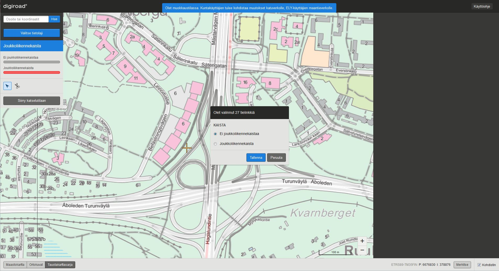

_Joukkoliikennekaistan monivalinta._

###Joukkoliikennekaistatiedon katkaisu###

Tarvittaessa joukkoliikennekaistatiedon voi katkaista leikkausty&ouml;kalulla (8). Leikkausty&ouml;kalulla klikataan joukkoliikennekaistan geometriasta kohtaa, josta se halutaan katkaista. Joukkoliikennekaistan geometrian p&auml;&auml;ll&auml; ty&ouml;kalu n&auml;kyy ristin&auml;, jotta tarkka katkaisukohta on helppo m&auml;&auml;ritt&auml;&auml;. Joukkoliikennekaistan katkaisussa uusille geometrioille valitaan arvot oikean laidan valikoista (4). Kartalla ja valikkojen vieress&auml; olevat kirjaimet osoittavat, kummasta geometriasta on kyse (5). Uudet joukkoliikennekaistatiedot tallennetaan tallenna-painikkeesta (6). Katkaisun voi peruuttaa peruuta-painikkeella (7), jolloin alkuper&auml;inen joukkoliikennekaistatieto j&auml;&auml; voimaan.

Huom! Joukkoliikennekaistan katkaisussa tulee m&auml;&auml;ritt&auml;&auml; uusille geometrioille eri arvot, jotta tallennus on mahdollista.

_Joukkoliikennekaistageometrian katkaisu._

16. Kaistojen lukum&auml;&auml;r&auml; (toistaiseksi n&auml;kyviss&auml; vain operaattorik&auml;ytt&auml;jille)
----------------------

Kaistojen lukum&auml;&auml;r&auml; n&auml;kyy t&auml;ll&auml; hetkell&auml; vain operaattorik&auml;ytt&auml;jille, koska tietolajia ei ole m&auml;&auml;ritelty uuteen Digiroad-j&auml;rjestelm&auml;&auml;n.

Kartalle voi valita tietolajit-paletista (1) Kaistojen lukum&auml;&auml;r&auml; -valinnan. Karttaa tarkennettaessa geometriat paksuuntuvat, jotta niiden erottaminen on helpompaa. Geometriat on visualisoitu punaisella v&auml;rill&auml; ja tielinkit, joilla kaistojen lukum&auml;&auml;r&auml; ei ole tiedossa, on visualisoitu harmaalla v&auml;rill&auml;.

_Kaistojen lukum&auml;&auml;r&auml; -valinta._

##16.1 Kaistojen lukum&auml;&auml;r&auml; -tietojen katselu##

Yksitt&auml;isen kaistojen lukum&auml;&auml;r&auml; -kohteen voi valita klikkaamalla kartalta sen geometriaa (4). Kerran klikkaamalla tulee valituksi koko tielinkkiketju, eli kaikki geometriat, joilla on sama kaistojen lukum&auml;&auml;r&auml;n arvo ja tiennumero (maantiell&auml;) tai tien nimi (katuverkko ja yksityistie). Jos k&auml;ytt&auml;j&auml; haluaa valita vain yhden linkin mittaisen p&auml;tk&auml;n tarkasteluun, sen voi tehd&auml; tuplaklikkaamalla tielinkki&auml;. Geometria tummentuu ja muut geometriat n&auml;kyv&auml;t haaleammalla. Sivun oikeaan laitaan avautuu valitun tielinkin tai tielinkkiketjun kaistojen lukum&auml;&auml;r&auml;n ominaisuustieton&auml;kym&auml; (6).
Kaistojen lukum&auml;&auml;r&auml; –tietolajin m&auml;&auml;rittely on toistaiseksi kesken, eik&auml; sen arvoja / lukum&auml;&auml;r&auml;n ilmaisutapaa ole viel&auml; p&auml;&auml;tetty.

_Kaistojen lukum&auml;&auml;r&auml; -katselutila._

##16.2 Kaistojen lukum&auml;&auml;r&auml;n muokkaus##

Muokkaustilassa kaistojen lukum&auml;&auml;r&auml;&auml; voi muuttaa ja geometrioita voi katkaista. Kaistojen lukum&auml;&auml;r&auml; -tietoja voi muokata kolmella tavalla:
1. Koko tielinkkiketjulle kerralla.
2. Yksitt&auml;isen linkin mittaiselle osuudelle.
3. Monivalinnan avulla kokonaiselle alueelle.

###Kaistojen lukum&auml;&auml;r&auml;n muokkaus###

Kaistojen lukum&auml;&auml;r&auml;&auml; muokataan muokkaustilassa. Muokattava kohde valitaan klikkaamalla sen geometriaa (4). Kerran klikkaamalla tulee valituksi koko ketju, eli kaikki per&auml;kk&auml;iset tielinkit, joilla on sama kaistojen lukum&auml;&auml;r&auml;n arvo ja tiennumero (maantiell&auml;) tai tien nimi (katuverkko ja yksityistie). Tietoja muokataan ominaisuustieton&auml;kym&auml;ss&auml; (6). Muutokset tallennetaan painamalla Tallenna-painiketta oikeasta alakulmasta (8). Ennen Tallenna-painikkeen painamista muutokset voi peruuttaa painamalla Peruuta-painiketta (9). Tallenna- ja Peruuta -painikkeet eiv&auml;t ole aktiivisina, jos muutoksia ei ole tehty. Jos muutoksia on tehty eik&auml; niit&auml; ole tallennettu tai peruutettu ja siirryt&auml;&auml;n pois kaistojen lukum&auml;&auml;r&auml; -valinnasta, sovellus antaa muutos-dialogin. Muutos-dialogi kertoo k&auml;ytt&auml;j&auml;lle, ett&auml; muutoksia on tehty ja ne tulee tallentaa tai peruuttaa ennen kuin voi jatkaa.

Huom! Kaistojen lukum&auml;&auml;r&auml;n arvokent&auml;ss&auml; muiden kuin numeroarvojen tallentaminen aiheuttaa virhetilanteita tallentuvissa tiedoissa.

_Kaistojen lukum&auml;&auml;r&auml;n muokkaus._

###Kaistojen lukum&auml;&auml;r&auml;n muokkaus monivalintaty&ouml;kalulla###

Useamman kuin yhden kaistojen lukum&auml;&auml;r&auml;n arvon voi muuttaa kerralla. Halutut rajoitukset valitaan painamalla Ctrl-painike n&auml;pp&auml;imist&ouml;lt&auml; pohjaan ja piirt&auml;m&auml;ll&auml; hiiren vasen painike pohjassa laatikko tielinkkien p&auml;&auml;lle. Valituksi tulevat kaikki linkit laatikon sis&auml;ll&auml; ja linkit, joita laatikko leikkaa. Valinnan j&auml;lkeen avautuu ikkuna, jossa sy&ouml;tet&auml;&auml;n kaistojen lukum&auml;&auml;r&auml; ja painetaan tallenna. Peruuta-painikkeesta voi perua muutoksen.

_Kaistojen lukum&auml;&auml;r&auml;n muokkaus monivalintaty&ouml;kalulla._

###Kaistojen lukum&auml;&auml;r&auml; kohteen katkaisu###

Kaistojen lukum&auml;&auml;r&auml;n geometrian voi jakaa kahteen osaan leikkausty&ouml;kalulla (1). Siten leikkausty&ouml;kalun avulla voi m&auml;&auml;ritell&auml; tielinkki&auml; lyhyemmille tieosuuksille eri kaistojen lukum&auml;&auml;ri&auml;. Leikkausty&ouml;kalulla klikataan tielinkin geometriasta kohtaa, josta rajoitus halutaan katkaista. Tielinkin geometrian p&auml;&auml;ll&auml; ty&ouml;kalu n&auml;kyy ristin&auml;, jotta tarkka katkaisukohta on helppo m&auml;&auml;ritt&auml;&auml; (2).

Tielinkin katkaisu valitsee aina vain linkin mittaisen osion rajoituksesta, ei koko rajoitusketjua.

_Kaistojen lukum&auml;&auml;r&auml; -kohteen katkaisu._

Katkaistun tielinkin osista pidemm&auml;lle j&auml;&auml; alkuper&auml;isen ID, ja lyhyemm&auml;lle generoidaan uusi ID. Tielinkin katkaisussa uusille kohteille valitaan arvot oikean laidan valikoista (4). Kartalla ja valikkojen vieress&auml; olevat kirjaimet osoittavat, kummasta geometriasta on kyse (5). Uudet kaistojen lukum&auml;&auml;r&auml;tiedot tallennetaan tallenna-painikkeesta (6). Katkaisun voi peruuttaa peruuta-painikkeella (7), jolloin alkuper&auml;inen tieto j&auml;&auml; voimaan.

Huom! Katkaisussa tulee m&auml;&auml;ritt&auml;&auml; uusille osuuksille eri arvot, jotta tallennus on mahdollista.

_Kaistojen lukum&auml;&auml;r&auml; -kohteen katkaisu._

###Kaistojen lukum&auml;&auml;r&auml; -tiedon poistaminen###

Tielinkin kaistojen lukum&auml;&auml;r&auml; -tieto poistetaan ominaisuustieton&auml;kym&auml;ss&auml; (6) valitsemalla Lukum&auml;&auml;r&auml;-kohdasta "Linkin mukainen tyypillinen kaistam&auml;&auml;r&auml;".

_Kaistojen lukum&auml;&auml;r&auml; -kohteen poistaminen._

###Uuden kaistojen lukum&auml;&auml;r&auml; -tiedon lis&auml;&auml;minen###

Tielinkille voi lis&auml;t&auml; kaistojen lukum&auml;&auml;r&auml;tiedon valitsemalla linkin geometrian (4) Kaistojen lukum&auml;&auml;r&auml; -muokkaustilassa. Ominaisuustieton&auml;kym&auml;&auml;n (6) avautuu tielinkin kaistojen lukum&auml;&auml;r&auml;n tiedot. Valitaan "Kaistojen lukum&auml;&auml;r&auml; / suunta" ja sy&ouml;tet&auml;&auml;n kaistojen lukum&auml;&auml;r&auml; sy&ouml;tekentt&auml;&auml;n. Kaistojen lukum&auml;&auml;r&auml; tallennetaan painamalla Tallenna (8). Uuden kaistojen lukum&auml;&auml;r&auml;tiedon lis&auml;&auml;misen voi perua Peruuta-painikkeella (9).

_Kaistojen lukum&auml;&auml;r&auml;tiedon lis&auml;&auml;minen._

17. Ajoneuvokohtainen rajoitus 
----------------------

Ajoneuvokohtaiset rajoutukset ovat rajoituksia, jotka koskevat vain tiettyj&auml; ajoneuvoja. N&auml;it&auml; ovat esimerkiksi moottoriajoneuvokiellot. My&ouml;s l&auml;piajokiellot ovat ajoneuvokohtaisia rajoituksia. Ajoneuvokohtaisessa rajoituksessa voi olla my&ouml;s poikkeus, esimerkiksi huoltoajo sallittu. Karttan&auml;kym&auml;&auml;n voi valita ajoneuvokohtaiset rajoitukset valitsemalla tietolajit-paletista (1) Ajoneuvokohtaiset rajoitukset. Karttaa tarkennettaessa rajoitukset tulevat n&auml;kyviin. Tielinkit, joilla on ajoneuvokohtainen rajoitus, on visualisoitu punaisella v&auml;rill&auml;.

_Ajoneuvokohtaisen rajoituksen valinta._

##17.1 Ajoneuvokohtaisen rajoituksen katselu##

Yksitt&auml;isen ajoneuvokohtaisen rajoituksen voi valita klikkaamalla kartalta sen geometriaa (1).
Kerran klikkaamalla tulee valituksi koko rajoitusketju, eli osuus, jossa ajoneuvokohtaisella rajoituksella on samat tiedot ja sama tien nimi (katuverkko) tai tien numero (maantie). 

Jos k&auml;ytt&auml;j&auml; haluaa valita vain yhden linkin mittaisen p&auml;tk&auml;n tarkasteluun, sen voi tehd&auml; tuplaklikkamalla rajoitusta. Valitun rajoitusketjun tai yksitt&auml;isen rajoituksen geometria korostuu kartalla. Sivun oikeaan laitaan avautuu ajoneuvokohtaisen rajoituksen ominaisuustieton&auml;kym&auml; (2). Ominaisuustieton&auml;kym&auml;ss&auml; on ajoneuvokohtaisen rajoituksen tiedot kyseisell&auml; tielinkill&auml;/tielinkeill&auml;, valittujen linkkien lukum&auml;&auml;r&auml; sek&auml; lis&auml;tty j&auml;rjestelm&auml;&auml;n ja muokattu viimeksi -tiedot.

_Ajoneuvokohtaisen rajoituksen tietojen katselu._

Ajoneuvokohtaiset rajoitukset on visualisoitu eri tavoin riippuen vaikutussuunnasta. Rajoituksen vaikutussuunta voi olla molempiin suuntiin tai vain toiseen suuntaan.  Jos vaikutussuunta on molempiin suuntiin, rajoitus on visualisoitu yhdell&auml; paksulla viivalla (1). Yksisuuntainen vaikutus on visualisoitu ohuemmalla viivalla vaikutussuunnan mukaan tielinjan reunaan (2).

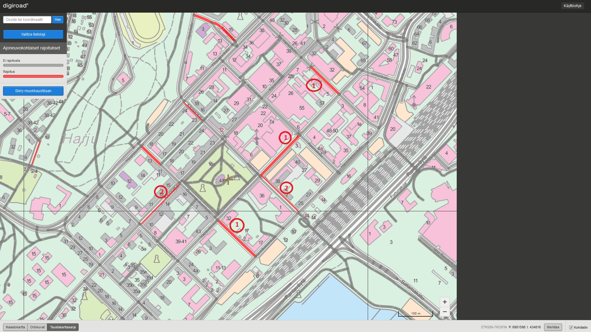

_Ajoneuvokohtaisen rajoituksen vaikutussuunnan visualisointi._

##17.2 Ajoneuvokohtaisen rajoituksen muokkaus##

Ajoneuvokohtaisille rajoituksille voi antaa muokkaustilassa tietoja. Muutokset tallennetaan tallenna-painikkeesta ja ennen tallennusta ne voi peruuttaa peruuta-painikkeesta.

Ajoneuvokohtaisia rajoituksia voi muokata kolmella tavalla:
1.	Koko ajoneuvorajoitusketjulle (esim. koko kadulle).
2.	Yksitt&auml;isen linkin mittaiselle osuudelle.
3.	Monivalinnan avulla kokonaiselle alueelle.

###Ajoneuvokohtaisen rajoituksen muokkaus ja lis&auml;ys###

Muokattava rajoitus valitaan klikkaamalla sen geometriaa (4). Kerran klikkaamalla tulee valituksi koko rajoitusketju, eli kaikki rajoitukset, joilla on samat arvot ja tiennumero (maantiell&auml;) tai tien nimi (katuverkko ja yksityistie). 
Jos k&auml;ytt&auml;j&auml; haluaa valita vain yhden linkin mittaisen p&auml;tk&auml;n tarkasteluun, sen voi tehd&auml; tuplaklikkamalla ajoneuvokohtaista rajoitusta.

Tietoja muokataan ominaisuustieton&auml;kym&auml;ss&auml; olevien alasvetovalikkojen avulla (5). Ajoneuvokohtaisella rajoituksella voi olla my&ouml;s poikkeuksia (ajoneuvoja, joita rajoitus ei koske) (6) sek&auml; voimassaolokellonaika ma-pe, la, su (7). Kellonaika ilmoitetaan samassa muodossa, mit&auml; se on maastossa olevassa lis&auml;kilvess&auml;.

_Ajoneuvokohtaisen rajoituksen muokkaus._

Tielinkit, joilla ei ole ajoneuvokohtaista rajoitusta on visualisoitu kartalle harmaalla v&auml;rill&auml;. Uusi ajoneuvokohtainen rajoitus lis&auml;t&auml;&auml;n valitsemalla kartalta geometria, jolle se halutaan lis&auml;t&auml; (8). Valitsemalla alasvetovalikosta rajoituksen tyyppi (9), tulee t&auml;m&auml;n j&auml;lkeen n&auml;kyviin lis&auml;&auml; valikkoja voimassaolokellonajalle ja poikkeuksille.

_Ajoneuvokohtaisen rajoituksen lis&auml;ys._

###Ajoneuvokohtaisen rajoituksen poistaminen###

Ajoneuvokohtaisia rajoituksia voi poistaa valitsemalla kartalta rajoituksen, ja ruksimalla ominaisuustieton&auml;kym&auml;st&auml; rajoituksen pois (1). My&ouml;s rajoituksen ominaisuuksia eli voimassaoloaikaa ja poikkeuksia voi poistaa ominaisuustieton&auml;kym&auml;n rukseista. (2) 

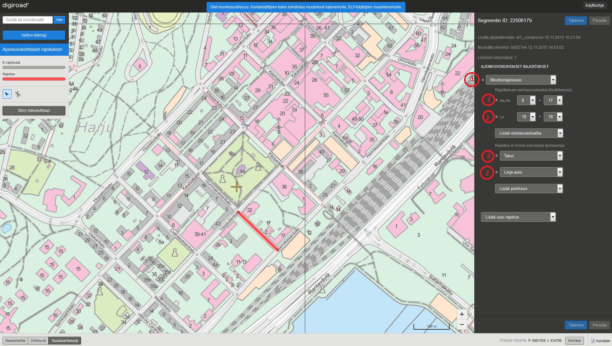

_Ajoneuvokohtaisen rajoituksen poistaminen._

###Useamman ajoneuvokohtaisen rajoituksen muokkaus monivalintaty&ouml;kalulla###

Useamman kuin yhden tielinkin ajoneuvokohtaiset rajoitustiedot voi muuttaa kerralla. Halutut tielinkit valitaan painamalla Ctrl-painike n&auml;pp&auml;imist&ouml;lt&auml; pohjaan ja piirt&auml;m&auml;ll&auml; hiiren vasen painike pohjassa laatikko tielinkkien p&auml;&auml;lle. Valituksi tulevat kaikki tielinkit laatikon sis&auml;ll&auml; ja tielinkit, joita laatikko leikkaa. Valinnan j&auml;lkeen avautuu ikkuna (1), jossa valitaan ajoneuvokohtaisenrajoituksien tiedot ko. alueella ja valitut linkit ovat korostettuna kartalla (2). Peruuta-painikkeesta voi perua muutoksen.

Huom! Muutos kumoaa kaikki valitun alueen aiemmat ajoneuvokohtaisten rajoitusten tiedot. P&auml;&auml;llekk&auml;isi&auml; rajoituksia ei voi siis luoda.

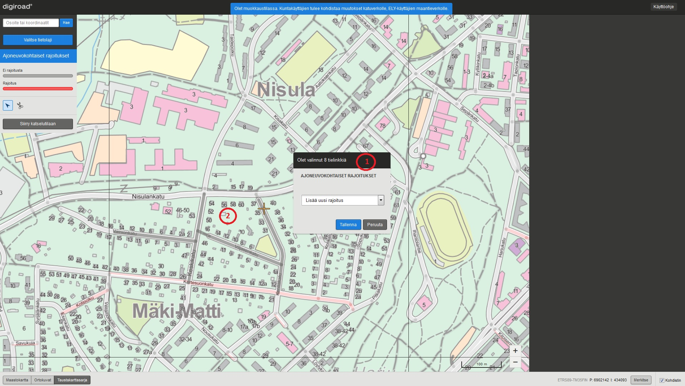

_Useamman ajoneuvokohtaisen rajoituksen tietojen muokkaus kerralla._

###Ajoneuvokohtaisen rajoituksen katkaiseminen###

Ajoneuvokohtaisen rajoituksen voi jakaa kahteen osaan leikkausty&ouml;kalulla (1). Leikkausty&ouml;kalulla klikataan rajoituksen geometriasta kohtaa, josta se halutaan katkaista. Rajoituksen geometrian p&auml;&auml;ll&auml; ty&ouml;kalu n&auml;kyy ristin&auml;, jotta tarkka katkaisukohta on helppo m&auml;&auml;ritt&auml;&auml;. Katkaisu valitsee aina vain tielinkin mittaisen osion rajoitusta, ei koko ketjua.

Ajoneuvokohtaisen rajoituksen katkaisussa uusille rajoituksille valitaan arvot oikean laidan alasvetovalikoista (4). Kartalla ja alasvetovalikkojen vieress&auml; olevat kirjaimet osoittavat, kummasta rajoituksesta on kyse (5).

Huom! Katkaisussa tulee m&auml;&auml;ritt&auml;&auml; uusille kohteille eri arvot, jotta tallennus on mahdollista.

_Ajoneuvokohtaisen rajoituksen katkaiseminen._

###Ajoneuvokohtaisen rajoituksen muuttaminen yksisuuntaiseksi###

Molempiin suuntiin voimassa olevan ajoneuvokohtaisen rajoituksen voi muuttaa yksisuuntaiseksi, jos kyseisell&auml; tielinkill&auml; liikennevirran suunta on molempiin suuntiin. Muutos tehd&auml;&auml;n siis tielinkkikohtaisesti.

Muutos tehd&auml;&auml;n tuplaklikkaamalla kyseist&auml; ajoneuvokohtaista rajoitusta (1), jolloin oikeaan laitaan tulee painike "Jaa kaksisuuntaiseksi" (2).

_Ajoneuvokohtaisen rajoituksen valinta ja muuttaminen yksisuuntaiseksi._

Painikkeen painamisen j&auml;lkeen voi uusille ajoneuvokohtaisille rajoituksille antaa arvot alasvetovalikoista (3). Kirjaimet alasvetovalikkojen vieress&auml; vastaavat kohteita kartalla (4). 

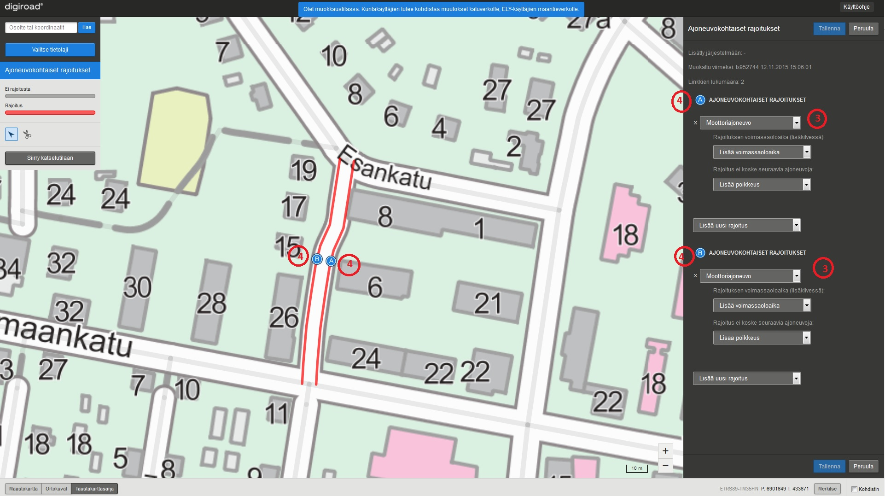

_Uusien yksisuuntaisten ajoneuvokohtaisen rajoitusten arvojen valinta._

Uudet rajoitukset tallennetaan tallenna-painikkeesta. Jakamisen voi peruuttaa peruuta-painikkeella, jolloin alkuper&auml;inen rajoitus j&auml;&auml; voimaan.

18. Vaarallisten aineiden kuljetus (VAK)
----------------------------------------

Vaarallisten aineiden kuljetus –rajoitus eli VAK-rajoitukset ovat rajoituksia, jotka koskevat vain tiettyj&auml; ajoneuvoja. VAK-rajoituksessa voi olla my&ouml;s poikkeus, kuten kellonaika, jolloin rajoitus on voimassa. Karttan&auml;kym&auml;&auml;n voi valita VAK-rajoitukset valitsemalla tietolajit-paletista (1) VAK-rajoitus. Karttaa tarkennettaessa rajoitukset tulevat n&auml;kyviin. Tielinkit, joilla on VAK-rajoitus, on visualisoitu punaisella v&auml;rill&auml;.

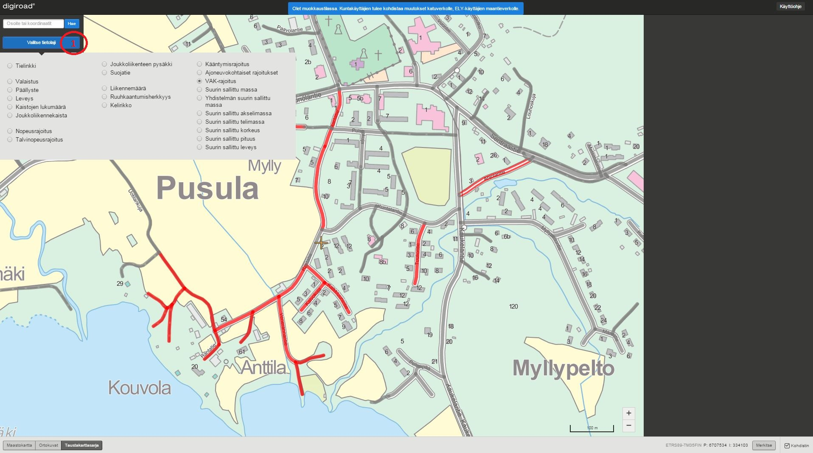

_VAK-rajoituksen valinta._

##18.1 VAK-rajoituksen tietojen katselu##

Yksitt&auml;isen VAK-rajoituksen voi valita klikkaamalla kartalta sen geometriaa. Kerran klikkaamalla tulee valituksi koko rajoitusketju, eli osuus, jossa VAK-rajoituksella on samat tiedot ja sama tien nimi (katuverkko) tai tien numero (maantie). 

Jos k&auml;ytt&auml;j&auml; haluaa valita vain yhden linkin mittaisen p&auml;tk&auml;n tarkasteluun, sen voi tehd&auml; tuplaklikkamalla rajoitusta. Valitun rajoitusketjun tai yksitt&auml;isen rajoituksen geometria korostuu kartalla. Sivun oikeaan laitaan avautuu VAK-rajoituksen ominaisuustieton&auml;kym&auml;. Ominaisuustieton&auml;kym&auml;ss&auml; on VAK-rajoituksen tiedot kyseisell&auml; tielinkill&auml;/tielinkeill&auml;, valittujen linkkien lukum&auml;&auml;r&auml; sek&auml; lis&auml;tty j&auml;rjestelm&auml;&auml;n ja muokattu viimeksi -tiedot.

_VAK-rajoituksen tietojen katselu._

VAK-rajoitukset on visualisoitu eri tavoin riippuen vaikutussuunnasta. Rajoituksen vaikutussuunta voi olla molempiin suuntiin tai vain toiseen suuntaan.  Jos vaikutussuunta on molempiin suuntiin, rajoitus on visualisoitu yhdell&auml; paksulla viivalla (1). Yksisuuntainen vaikutus on visualisoitu ohuemmalla viivalla vaikutussuunnan mukaan tielinjan reunaan (2).

_VAK-rajoituksen vaikutussuunnan visualisointi._

##18.2 VAK-rajoituksen muokkaus##

VAK-rajoituksille voi antaa muokkaustilassa tietoja. VAK-rajoituksia voi muokata kolmella tavalla:

1.	Koko VAK-rajoitusketjulle (esim. koko kadulle).
1.	Yksitt&auml;isen linkin mittaiselle osuudelle.
1.	Monivalinnan avulla kokonaiselle alueelle.

###VAK-rajoituksen muokkaus ja lis&auml;ys###

Muokattava rajoitus valitaan klikkaamalla sen geometriaa (1). Kerran klikkaamalla tulee valituksi koko rajoitusketju, eli kaikki rajoitukset, joilla on samat arvot ja tiennumero (maantiell&auml;) tai tien nimi (katuverkko ja yksityistie). Jos k&auml;ytt&auml;j&auml; haluaa valita vain yhden linkin mittaisen p&auml;tk&auml;n tarkasteluun, sen voi tehd&auml; tuplaklikkamalla VAK-rajoitusta.

Tietoja muokataan ominaisuustieton&auml;kym&auml;ss&auml; olevien alasvetovalikkojen avulla (2). VAK-rajoituksella voi olla my&ouml;s voimassaolokellonaika (3). Kellonaika ilmoitetaan samassa muodossa, mit&auml; se on maastossa olevassa lis&auml;kilvess&auml;.

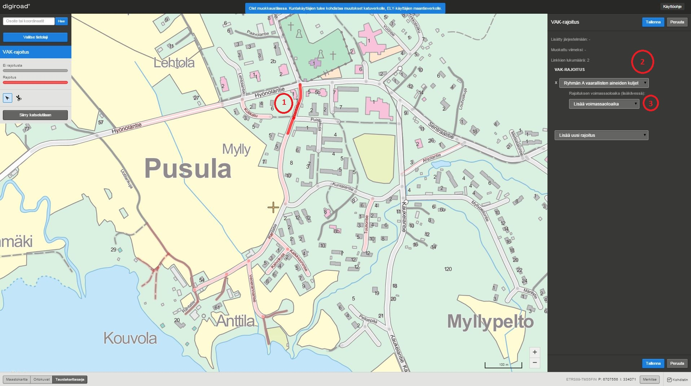

_VAK-rajoituksen muokkaus._

Tielinkit, joilla ei ole VAK-rajoitusta on visualisoitu kartalle harmaalla v&auml;rill&auml;. Uusi VAK-rajoitus lis&auml;t&auml;&auml;n valitsemalla kartalta geometria, jolle se halutaan lis&auml;t&auml; (4). Valitsemalla alasvetovalikosta rajoituksen tyyppi (5), tulee t&auml;m&auml;n j&auml;lkeen n&auml;kyviin lis&auml;&auml; valikkoja voimassaolokellonajalle ja toiselle rajoitukselle.

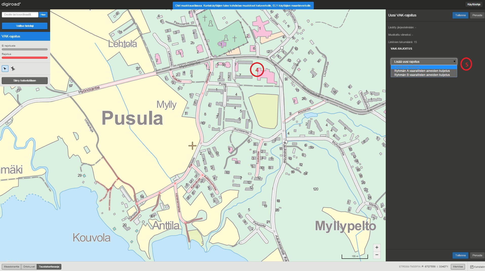

_VAK-rajoituksen lis&auml;ys_

###VAK-rajoituksen poistaminen###

VAK-rajoituksia voi poistaa valitsemalla kartalta rajoituksen, ja ruksimalla ominaisuustieton&auml;kym&auml;st&auml; rajoituksen pois (1). My&ouml;s rajoituksen voimassaoloajan voi poistaa ominaisuustieton&auml;kym&auml;n rukseista (2). Muutokset tallentuu tallenna-napista.

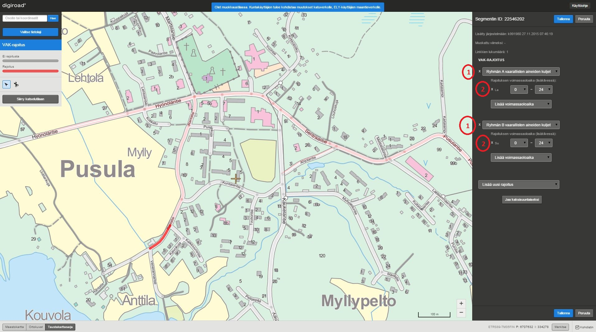

_VAK-rajoituksen poistaminen._

###Useamman VAK-rajoituksen muokkaus monivalintaty&ouml;kalulla###

Useamman kuin yhden tielinkin VAK-rajoitustiedot voi muuttaa kerralla. Halutut tielinkit valitaan painamalla Ctrl-painike n&auml;pp&auml;imist&ouml;lt&auml; pohjaan ja piirt&auml;m&auml;ll&auml; hiiren vasen painike pohjassa laatikko tielinkkien p&auml;&auml;lle. Valituksi tulevat kaikki tielinkit laatikon sis&auml;ll&auml; ja tielinkit, joita laatikko leikkaa. Valinnan j&auml;lkeen avautuu ikkuna (1), jossa valitaan VAK-rajoituksien tiedot ko. alueella ja valitut linkit ovat korostettuna kartalla (2). Peruuta-painikkeesta voi perua muutoksen.

Huom! Muutos kumoaa kaikki valitun alueen aiemmat VAK-rajoitusten tiedot. P&auml;&auml;llekk&auml;isi&auml; rajoituksia ei voi siis luoda.

_Useamman VAK-rajoituksen tietojen muokkaus kerralla._

###VAK-rajoituksen katkaiseminen###

VAK-rajoituksen voi jakaa kahteen osaan leikkausty&ouml;kalulla (1). Leikkausty&ouml;kalulla klikataan rajoituksen geometriasta kohtaa, josta se halutaan katkaista. Rajoituksen geometrian p&auml;&auml;ll&auml; ty&ouml;kalu n&auml;kyy ristin&auml;, jotta tarkka katkaisukohta on helppo m&auml;&auml;ritt&auml;&auml;. Katkaisu valitsee aina vain tielinkin mittaisen osion rajoitusta, ei koko ketjua.

VAK-rajoituksen katkaisussa uusille rajoituksille valitaan arvot oikean laidan alasvetovalikoista (2). Kartalla ja alasvetovalikkojen vieress&auml; olevat kirjaimet osoittavat, kummasta rajoituksesta on kyse (3). Muutokset tallennetaan tallenna-painikkeesta tai vastaavasti kumotaan peruuta-painikkeesta.

Huom! Katkaisussa tulee m&auml;&auml;ritt&auml;&auml; uusille kohteille eri arvot, jotta tallennus on mahdollista.

_VAK-rajoituksen katkaiseminen._

##18.3 VAK-rajoituksen muuttaminen yksisuuntaiseksi##

Molempiin suuntiin voimassa olevan VAK-rajoituksen voi muuttaa yksisuuntaiseksi, jos kyseisell&auml; tielinkill&auml; liikennevirran suunta on molempiin suuntiin. Muutos tehd&auml;&auml;n siis tielinkkikohtaisesti. Muutos tehd&auml;&auml;n tuplaklikkaamalla kyseist&auml; VAK-rajoitusta (1), jolloin oikeaan laitaan tulee painike "Jaa kaksisuuntaiseksi" (2).

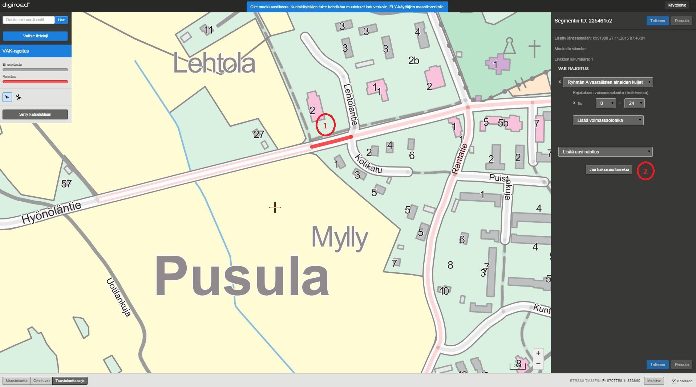

_VAK-rajoituksen valinta ja muuttaminen yksisuuntaiseksi._

Painikkeen painamisen j&auml;lkeen voi uusille VAK-rajoituksille antaa arvot alasvetovalikoista (3). Kirjaimet alasvetovalikkojen vieress&auml; vastaavat kohteita kartalla (4).

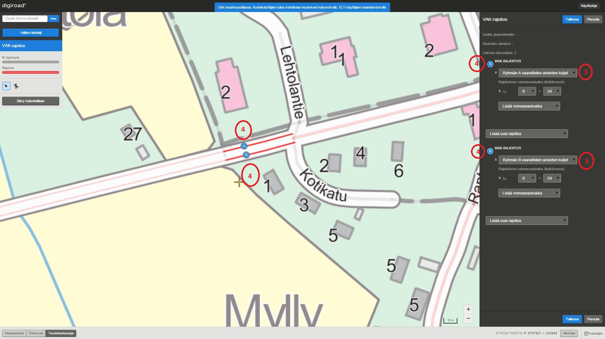

_Uusien yksisuuntaisten VAK-rajoitusten arvojen valinta._

Uudet rajoitukset tallennetaan tallenna-painikkeesta. Jakamisen voi peruuttaa peruuta-painikkeella, jolloin alkuper&auml;inen rajoitus j&auml;&auml; voimaan.

19. Suojatie
----------------------

Suojatie on ajoradan ylitt&auml;miseen tarkoitettu kohta. Karttan&auml;kym&auml;&auml;n voi valita suojatiet tietolajit-paletista (1) ”Suojatie”. Kartalle tulevat esiin suojatiemerkinn&auml;t sinisen&auml; ympyr&auml;n&auml;. Punaisella ympyr&auml;ll&auml; olevat suojatiemerkinn&auml;t kuvaavat geometrian ulkopuolella olevia suojateit&auml;.

_Suojatiemerkinn&auml;n valinta._

##19.1 Suojatiemerkinn&auml;n tietojen katselu##

Yksitt&auml;isen suojatiemerkinn&auml;n voi valita klikkaamalla kartalta sen geometriaa. Valitun merkinn&auml;n geometria korostuu. Sivun oikeaan laitaan avautuu suojatiemerkinn&auml;n ominaisuustieton&auml;kym&auml;. Ominaisuustieton&auml;kym&auml;ss&auml; n&auml;kyy lis&auml;tty j&auml;rjestelm&auml;&auml;n ja muokattu viimeksi -tiedot. Valinnan voi purkaa klikkaamalla taustakarttaa.

_Suojatien katselu._

##19.2 Suojatiemerkinn&auml;n muokkaus##

Suojatiemerkinn&auml;n voi poistaa, siirt&auml;&auml; tai lis&auml;t&auml; uuden merkinn&auml;n muokkaustilassa. Muokkaustilaan p&auml;&auml;see Siirry muokkaustilaan -painikkeesta. N&auml;yt&ouml;n yl&auml;osioon tulee ilmoitus muokkaustilaan siirtymisest&auml;.

###Suojatiemerkinn&auml;n poisto, siirto ja lis&auml;ys###

Muokattava suojatie valitaan klikkaamalla sen geometriaa. Valitun merkinn&auml;n geometria korostuu. Valittu suojatiemerkint&auml; voidaan poistaa raksittamalla oikeassa laidassa oleva poista-ruutu (4) ja painamalla tallenna painiketta (5). Muutokset voidaan kumota peruuta-napilla.

Yksitt&auml;ist&auml; suojatiemerkint&auml;&auml; voidaan my&ouml;s siirt&auml;&auml; valitsemalla kohde. Ensin klikataan siirrett&auml;v&auml; kohde valituksi. T&auml;m&auml;n j&auml;lkeen merkint&auml; voidaan raahata haluttuun kohtaan. Linkki, jolle suojatie siirtyy, korostuu sinisell&auml;. Siirto tallentuu tallenna-painikkeella (5). Muutokset voidaan kumota peruuta-napilla.

_Suojatien muokkaustila._

 
Suojatiemerkint&auml; voidaan lis&auml;t&auml; valitsemalla vasemmalta lis&auml;ys-ty&ouml;kalu (plussa) (6). Suojatiemerkint&auml; lis&auml;t&auml;&auml;n haluttuun tien kohtaan ja painetaan Tallenna-nappia. Takaisin katselutilaan p&auml;&auml;see siirry katselutilaan –painikkeella (7).

###Geometrian ulkopuolelle j&auml;&auml;neet suojatiet###

Geometrian ulkopuolelle j&auml;&auml;neet suojatiet on korostettu kartalla punaisella ympyr&auml;ll&auml;. N&auml;in voi k&auml;yd&auml; jos tielinkkigeometria sen alla on muuttunut niin paljon, ettei j&auml;rjestelm&auml; pysty en&auml;&auml; p&auml;&auml;ttelem&auml;&auml;n sen sijaintia geometrialla. Suojatiemerkint&auml;&auml; siirt&auml;m&auml;ll&auml; geometriavirhe poistuu.

_Geometrian ulkopuolinen suojatiemerkint&auml; on v&auml;rilt&auml;&auml;n punainen._

 
Geometrian ulkopuolelle j&auml;&auml;neill&auml; suojateill&auml; on oma lista (2). Suojatiet on jaoteltu listalle kunnan sek&auml; kunnan sis&auml;ll&auml; hallinnollisen luokan (kunta, valtio, yksityinen) mukaan. Listalla n&auml;kyy vain ne suojatiet, joihin k&auml;ytt&auml;j&auml;ll&auml; on muokkausoikeus. Suojatiest&auml; on listassa linkki, josta p&auml;&auml;see suoraan suojatien kohdalle sovelluksessa ja sen voi siirt&auml;&auml; takaisin geometrialle. Lista sulkeutuu Sulje lista -painikkeesta.

_Geometrian ulkopuolelle j&auml;&auml;neiden suojateiden lista._

20. Esterakennelma
----------------------

Esterakennelma on tien normaalin k&auml;yt&ouml;n est&auml;v&auml; rakennelma. Esterakennelmat jaetaan avattaviin puomeihin ja suljettuihin yhteyksiin. Kartalle voi valita esterakennelmat valitsemalle tietolajit(1) -paletista "Esterakennelma". Suljetut yhteydet n&auml;kyv&auml;t kartalla sinisell&auml; ympyr&auml;ll&auml; ja avattavat puomit vihre&auml;ll&auml; ympyr&auml;ll&auml;. Punaiset ympyr&auml;t ovat geometrian ulkopuolelle j&auml;&auml;neit&auml; esterakennelmia.

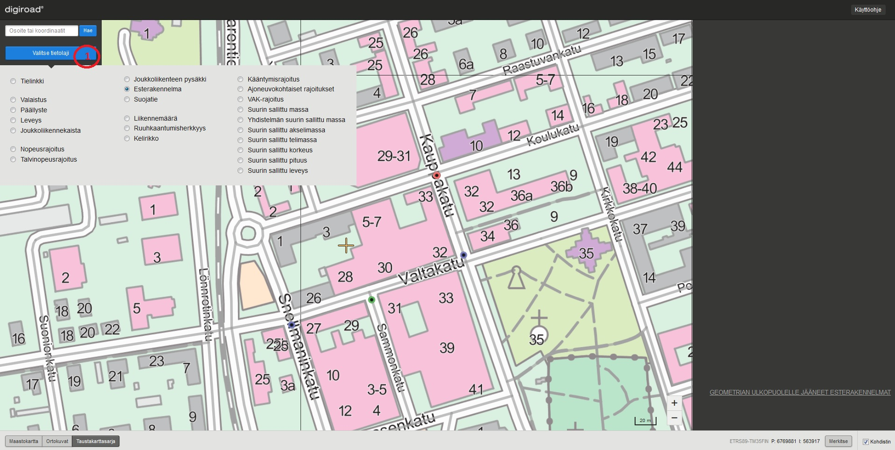

_Esterakennelman valinta._

##20.1 Esterakennelman tietojen katselu##

Yksitt&auml;isen esterakennelman voi valita klikkaamalla kartalta sen geometriaa. Valitun kohteen geometria korostuu (2). Sivun oikeaan laitaan avautuu esterakennelman ominaisuustieton&auml;kym&auml; (3). Ominaisuustieton&auml;kym&auml;ss&auml; n&auml;kyy lis&auml;tty j&auml;rjestelm&auml;&auml;n ja muokattu viimeksi -tiedot sek&auml; esterakennelman tyyppi eli suljettu yhteys tai avattava puomi. Valinnan voi poistaa klikkaamalla muualle.

_Esterakennelman katselu._

##20.2 Esterakennelman muokkaus##

Esterakennelman voi poistaa, siirt&auml;&auml; tai lis&auml;t&auml;. Lis&auml;ksi olemassa olevan esterakennelman tyyppi&auml; voi vaihtaa avattavan puomin ja suljetun yhteyden v&auml;lill&auml; alasvetovalikosta. Muokkaustilaan p&auml;&auml;see Siirry muokkaustilaan -painikkeesta. N&auml;yt&ouml;n yl&auml;osioon tulee ilmoitus muokkaustilaan siirtymisest&auml;.

###Esterakennelman poisto, siirto, lis&auml;ys ja tyyppi###

Muokattava esterakennelma valitaan klikkaamalla sen geometriaa. Valitun merkinn&auml;n geometria korostuu. Valittu esterakennelma voidaan poistaa raksittamalla oikeassa laidassa oleva poista-ruutu (4) ja painamalla tallenna painiketta. Muutokset voidaan kumota peruuta-napilla. Olemassa olevan esterakennelman tyyppi&auml; voi vaihtaa oikean laidan alasvetovalikosta valitsemalla suljettu yhteys tai avattava puomi (5). Kohteen visualisointi kartalla muuttuu valinnan mukaan.

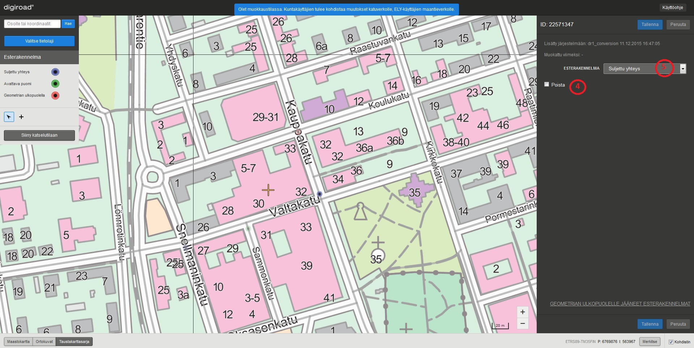

_Esterakennelman muokkaus._

Yksitt&auml;ist&auml; esterakennelma voidaan my&ouml;s siirt&auml;&auml; valitsemalla kohde. Ensin klikataan siirrett&auml;v&auml; kohde valituksi. T&auml;m&auml;n j&auml;lkeen kohde voidaan raahata haluttuun kohtaan. Linkki, jolle esterakennelma siirtyy, korostuu kartalla sinisell&auml; (8). Siirto tallentuu tallenna-painikkeella. Muutokset voidaan kumota peruuta-napilla.

_Esterakennelman siirto._

Esterakennelma voidaan lis&auml;t&auml; valitsemalla vasemmalta lis&auml;ys-ty&ouml;kalu (plussa) (7). Esterakennelma lis&auml;t&auml;&auml;n haluttuun tien kohtaan klikkaamalla karttaa (8), jolloin karttan&auml;kym&auml; tummenee. Esterakennelmalle valitaan oikeasta laidasta tyyppi eli suljettu yhteys tai avattava puomi (9). Uusi kohde tallennetaan painamalla Tallenna-nappia. 

_Esterakennelman lis&auml;ys._

Takaisin katselutilaan p&auml;&auml;see siirry katselutilaan –painikkeella.

###Geometrian ulkopuolelle j&auml;&auml;neet esterakennelmat###

Geometrian ulkopuolelle j&auml;&auml;neet esterakennelmat on korostettu kartalla punaisella ympyr&auml;ll&auml;. N&auml;in voi k&auml;yd&auml; jos tielinkkigeometria sen alla on muuttunut niin paljon, ettei j&auml;rjestelm&auml; pysty en&auml;&auml; p&auml;&auml;ttelem&auml;&auml;n sen sijaintia geometrialla. Esterakennelmaa siirt&auml;m&auml;ll&auml; geometriavirhe poistuu.

Geometrian ulkopuolelle j&auml;&auml;neill&auml; esterakennelmilla on oma lista (2). Esterakennelmat on jaoteltu listalle kunnan sek&auml; kunnan sis&auml;ll&auml; hallinnollisen luokan (kunta, valtio, yksityinen) mukaan. Listalla n&auml;kyy vain ne esterakennelmat, joihin k&auml;ytt&auml;j&auml;ll&auml; on muokkausoikeus. Korjattavaan esterakennelmaan on listassa linkki, josta p&auml;&auml;see suoraan esterakennelman kohdalle sovelluksessa ja sen voi siirt&auml;&auml; takaisin geometrialle. Lista sulkeutuu Sulje lista -painikkeesta.

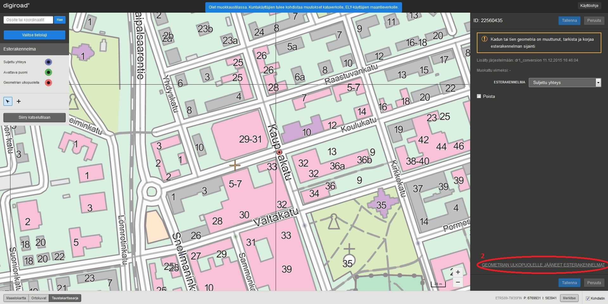

_Geometrian ulkopuolinen esterakennelma on v&auml;rilt&auml;&auml;n punainen._

_Geometrian ulkopuolelle j&auml;&auml;neiden esterakennelmien lista._

21. Rautatien tasoristeys
----------------------

Kartalle voi valita rautatien tasoristeykset valitsemalle tietolajit(1) -paletista "Rautatien tasoristeys". Rautatien tasoristeykset n&auml;kyv&auml;t kartalla sinisen&auml; ympyr&auml;n&auml;. Punaiset ympyr&auml;t ovat geometrian ulkopuolelle j&auml;&auml;neit&auml; tasoristeyksi&auml;.

_Rautatien tasoristeyksen valinta._

##21.1 Rautatien tasoristeyksen tietojen katselu##

Yksitt&auml;isen tasoristeyksen voi valita klikkaamalla kartalta sen geometriaa. Valitun kohteen geometria korostuu (2). Sivun oikeaan laitaan avautuu tasoristeyksen ominaisuustieton&auml;kym&auml; (3). Ominaisuustieton&auml;kym&auml;ss&auml; n&auml;kyy lis&auml;tty j&auml;rjestelm&auml;&auml;n ja muokattu viimeksi -tiedot, tasoristeyksen turvavarustus sek&auml; nimi. Valinnan voi poistaa klikkaamalla muualle.

_Rautatien tasoristeyksen katselu._

##21.2 Rautatien tasoristeyksen muokkaus##

Rautatien tasoristeyksen voi poistaa, siirt&auml;&auml; tai lis&auml;t&auml;. Lis&auml;ksi olemassa olevan tasoristeyksen turvavarustusta voi muokata alasvetovalikosta ja nime&auml; voi muokata. Muokkaustilaan p&auml;&auml;see Siirry muokkaustilaan -painikkeesta. N&auml;yt&ouml;n yl&auml;osioon tulee ilmoitus muokkaustilaan siirtymisest&auml;.

###Rautatien tasoristeyksen ominaisuustietojen muokkaus, siirto, poisto ja lis&auml;ys###

Muokattava tasoristeys valitaan klikkaamalla sen geometriaa. Valitun merkinn&auml;n geometria korostuu. Valittu tasoristeys voidaan poistaa raksittamalla oikeassa laidassa oleva poista-ruutu (4). Olemassa olevan tasoristeyksen turvavarustuksen tietoja voi vaihtaa oikean laidan alasvetovalikosta. Muutokset tallennetaan tallenna-painikkeesta tai voi perua peruuta-painikkeesta (6).

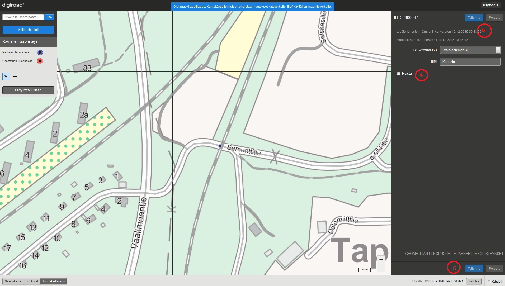

_Rautatien tasoristeyksen muokkaus._

Yksitt&auml;ist&auml; tasoristeyst&auml; voidaan my&ouml;s siirt&auml;&auml; valitsemalla kohde. Ensin klikataan siirrett&auml;v&auml; kohde valituksi. T&auml;m&auml;n j&auml;lkeen kohde voidaan raahata haluttuun kohtaan. Linkki, jolle tasoristeys siirtyy, korostuu kartalla sinisell&auml; (8). Siirto tallentuu tallenna-painikkeella. Muutokset voidaan kumota peruuta-napilla.

_Rautatien tasoristeyksen siirto._

Uusi tasoristeys voidaan lis&auml;t&auml; valitsemalla vasemmalta lis&auml;ys-ty&ouml;kalu (plussa) (7). Tasoristeys lis&auml;t&auml;&auml;n haluttuun tien kohtaan klikkaamalla karttaa (8), jolloin karttan&auml;kym&auml; tummenee. Tasoristeykselle valitaan oikean laidan alasvetovalikosta turvavarustus-tieto sek&auml; kirjoitetaan nimi (9). Uusi kohde tallennetaan painamalla Tallenna-nappia. Lis&auml;yksen voi perua peruuta-painikkeesta.

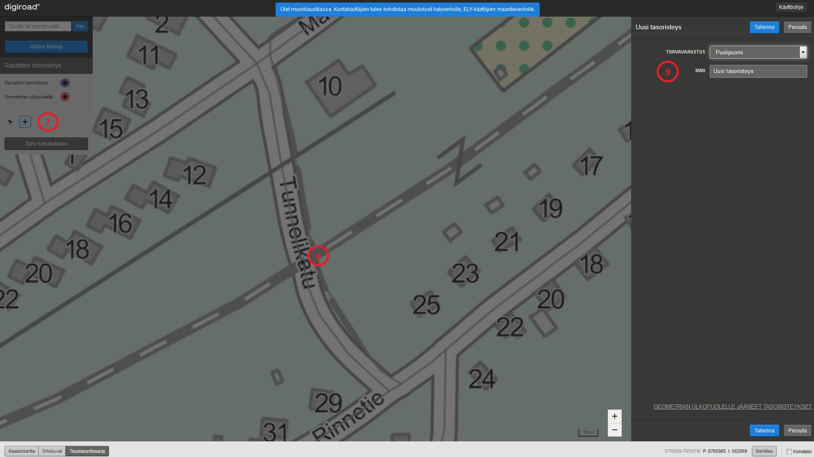

_Rautatien tasoristeyksen lis&auml;ys._

Takaisin katselutilaan p&auml;&auml;see siirry katselutilaan –painikkeella.

###Geometrian ulkopuolelle j&auml;&auml;neet rautatien tasoristeykset###

Geometrian ulkopuolelle j&auml;&auml;neet tasoristeykset on korostettu kartalla punaisella ympyr&auml;ll&auml; (1). N&auml;in voi k&auml;yd&auml; jos tielinkkigeometria sen alla on muuttunut niin paljon, ettei j&auml;rjestelm&auml; pysty en&auml;&auml; p&auml;&auml;ttelem&auml;&auml;n sen sijaintia geometrialla. Tasoristeyst&auml; siirt&auml;m&auml;ll&auml; geometriavirhe poistuu.

Geometrian ulkopuolelle j&auml;&auml;neill&auml; tasoristeyksill&auml; on oma lista (2). Tasoristeykset on jaoteltu listalle kunnan sek&auml; kunnan sis&auml;ll&auml; hallinnollisen luokan (kunta, valtio, yksityinen) mukaan. Listalla n&auml;kyy vain ne tasoristeykset, joihin k&auml;ytt&auml;j&auml;ll&auml; on muokkausoikeus. Korjattavaan tasoristeykseen on listassa linkki, josta p&auml;&auml;see suoraan tasoristeyksen kohdalle sovelluksessa ja sen voi siirt&auml;&auml; takaisin geometrialle. Lista sulkeutuu Sulje lista -painikkeesta.

_Geometrian ulkopuolinen rautatien tasoristeys on v&auml;rilt&auml;&auml;n punainen._

_Geometrian ulkopuolelle j&auml;&auml;neiden rautatien tasoristeysten lista._

22. Opastustaulu ja sen informaatio
----------------------

Opastustaulu ja sen informaatio ovat moottori- ja moottoriliikenneteill&auml; sijaitseva tai niille opastava tienviitta. Karttan&auml;kym&auml;&auml;n voi valita opastustaulut tietolajit-paletista (1). Kartalle tulevat esiin opastustaulut sinisen&auml; nuolena. Nuolen suunta kuvaa opastustaulun vaikutussuuntaa. Punaisella nuolella olevat opastustaulut kuvaavat geometrian ulkopuolella olevia opastustauluja.

_Opastustaulun valinta._

##22.1 Opastustaulun tietojen katselu##

Yksitt&auml;isen opastustaulun voi valita klikkaamalla kartalta sen geometriaa. Valitun merkinn&auml;n geometria korostuu. Sivun oikeaan laitaan avautuu opastustaulun ominaisuustieton&auml;kym&auml;. Ominaisuustieton&auml;kym&auml;ss&auml; n&auml;kyy lis&auml;tty j&auml;rjestelm&auml;&auml;n ja muokattu viimeksi -tiedot ja opastustaulun informaatio. Valinnan voi purkaa klikkaamalla taustakarttaa.

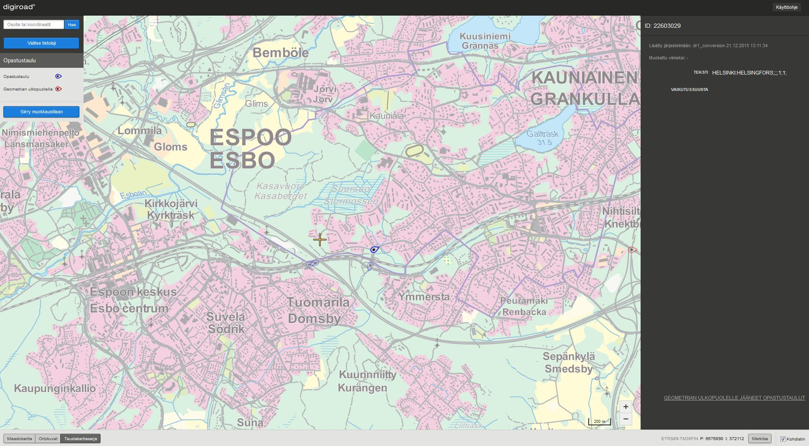

_Opastustaulun katselu._

__Opastustaulun informaation sis&auml;lt&ouml;__

Informaatiokent&auml;ss&auml; on seuraavat tiedot puolipisteell&auml; eroteltuina ja useampi kohde rivinvaihdolla:

PAIKKAKUNNAT;V&auml;RI;SIJAINTI
PAIKKAKUNNAT;V&auml;RI;SIJAINTI

Kenttien sis&auml;ll&auml; tiedot on eroteltu kaksoispisteell&auml;. Esim:

HELSINKI:HELSINGFORS;1;500

Merkkijonon osien tarkennukset informaatiokent&auml;ss&auml;:

Paikkakunnat: Paikkakuntien nimet samalla tavalla kirjoitettuna kuin opastustaulussa (kaikki kirjaimet ovat ISOJA). Jos opastustaulussa on useampi kuin yksi paikkakunta, niin ne tulee erotella rivinvaihdoilla.

Taustav&auml;ri:
1 ei tietoa
2 vihre&auml; (moottori- tai moottoriliikennetie)
3 sininen (maantie)
4 valkoinen (paikalliskohde, esim. kaupunginosa)
	
Sijainti: Taulun et&auml;isyys liittym&auml;st&auml; metrein&auml;.

##22.2 Opastustaulun muokkaus##

Opastustaulun voi poistaa, siirt&auml;&auml; tai lis&auml;t&auml; uuden merkinn&auml;n muokkaustilassa. Muokkaustilaan p&auml;&auml;see Siirry muokkaustilaan -painikkeesta. N&auml;yt&ouml;n yl&auml;osaan tulee ilmoitus muokkaustilaan siirtymisest&auml;.

###Opastustaulun siirto, muokkaus ja poisto###

Muokattava opastustaulu valitaan klikkaamalla sen geometriaa. Valitun merkinn&auml;n geometria korostuu. Valittu opastustaulu voidaan poistaa raksittamalla oikeassa laidassa oleva poista-ruutu (3) ja painamalla tallenna painiketta (4). Muutokset voidaan kumota peruuta-napilla (5).

Yksitt&auml;ist&auml; opastustaulua voidaan my&ouml;s siirt&auml;&auml;. Ensin klikataan siirrett&auml;v&auml; kohde valituksi. T&auml;m&auml;n j&auml;lkeen merkint&auml; voidaan raahata haluttuun kohtaan. Tielinkki, jolle opastustaulu siirtyy, korostuu sinisell&auml;. Siirto tallentuu tallenna-painikkeella (4). Muutokset voidaan kumota peruuta-napilla(5).

Muokkaustilassa opastustaulun tekstikentt&auml;&auml;n (6) pystyy my&ouml;s lis&auml;t&auml; informaatiota ja vaihtaa vaikutussuuntaa (7). 

_Opastustaulun muokkaus._

###Opastustaulun lis&auml;ys###

Opastustaulu voidaan lis&auml;t&auml; painamalla vasemmassa yl&auml;kulmasta lis&auml;&auml;-painiketta (8). Opastustaulu lis&auml;t&auml;&auml;n haluttuun tien kohtaan ja painetaan Tallenna-nappia (4). Takaisin katselutilaan p&auml;&auml;see siirry katselutilaan –painikkeella (9).

###Geometrian ulkopuolelle j&auml;&auml;neet opastustaulut###

Geometrian ulkopuolelle j&auml;&auml;neet opastustaulut on korostettu kartalla punaisella nuolella. N&auml;in voi k&auml;yd&auml; jos tielinkkigeometria sen alla on muuttunut niin paljon, ettei j&auml;rjestelm&auml; pysty en&auml;&auml; p&auml;&auml;ttelem&auml;&auml;n sen sijaintia geometrialla. Opastustaulumerkint&auml;&auml; siirt&auml;m&auml;ll&auml; geometriavirhe poistuu. Ennen opastustaulun korjaamista tiegeometrialle, tulee alla olevan tielinkit tiedot olla tarvittaessa korjattu.

Geometrian ulkopuolelle j&auml;&auml;neill&auml; opastustauluilla on oma lista (2). Opastustaulut on jaoteltu listalle kunnan sek&auml; kunnan sis&auml;ll&auml; hallinnollisen luokan (kunta, valtio, yksityinen) mukaan. Listalla n&auml;kyy vain ne opastustaulut, joihin k&auml;ytt&auml;j&auml;ll&auml; on muokkausoikeus. Opastustauluista on listassa linkki, josta p&auml;&auml;see suoraan opastustaulun kohdalle sovelluksessa ja sen voi siirt&auml;&auml; takaisin geometrialle. Lista sulkeutuu Sulje lista -painikkeesta.

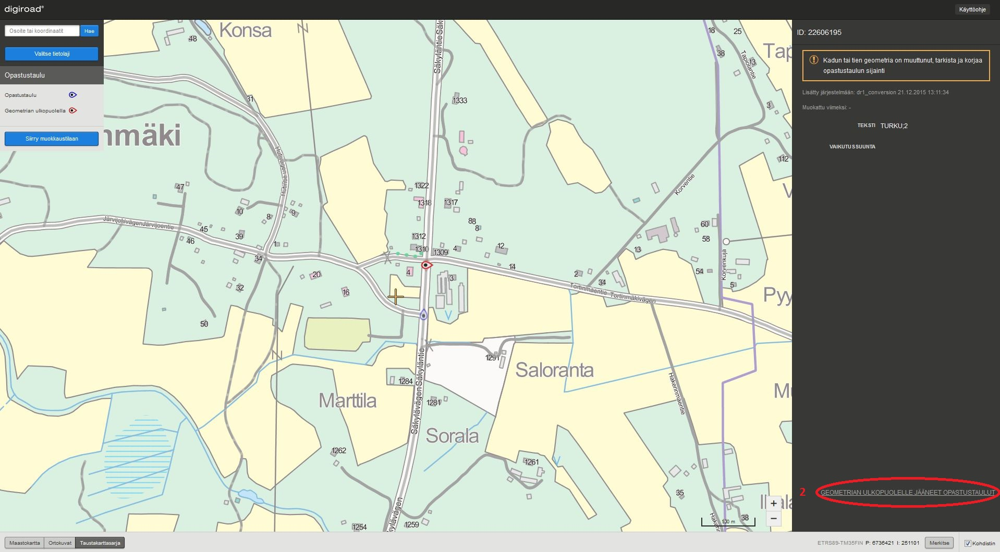

_Geometrian ulkopuolinen opastustaulu on v&auml;rilt&auml;&auml;n punainen._

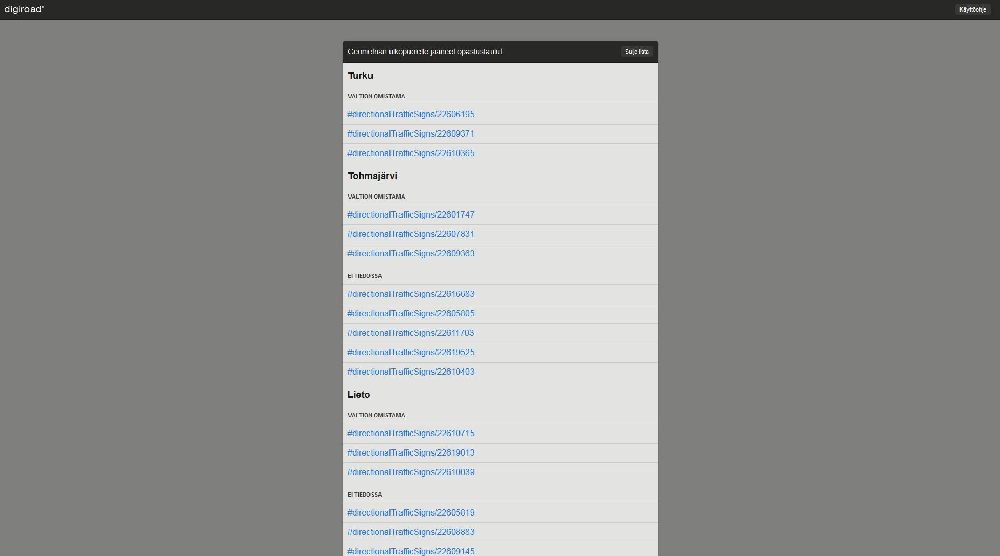

_Geometrian ulkopuolelle j&auml;&auml;neiden opastustaulujen lista._

23. Palvelupiste
----------------------

Palvelu on liikenneverkon k&auml;ytt&auml;j&auml;&auml; auttava ja tukeva palvelu kuten pys&auml;k&ouml;intitalo tai linja-autoasema. Palvelulla on geometriapiste (palvelupiste), joka sijaitsee palvelun sijaintikohdassa (rakennuksen tai kiinteist&ouml;n keskikohdassa). Yhdess&auml; palvelupisteess&auml; voi olla useita palveluita. Karttan&auml;kym&auml;&auml;n voi valita palvelupisteet tietolajit-paletista (1). Kartalle tulevat esiin palvelupisteet sinisen&auml; ympyr&auml;n&auml;.
 

_Palvelupisteiden valinta._

##23.1 Palvelupisteen tietojen katselu##

Yksitt&auml;isen palvelupisteen voi valita klikkaamalla kartalta sen geometriaa.

Valitun kohteen geometria korostuu. Sivun oikeaan laitaan avautuu palvelupisteen ominaisuustieton&auml;kym&auml;. Ominaisuustieton&auml;kym&auml;ss&auml; n&auml;kyy lis&auml;tty j&auml;rjestelm&auml;&auml;n ja muokattu viimeksi –tiedot. Palvelulla on nimi, palvelun tyyppi, lis&auml;tieto ja  lepoalueella, pys&auml;k&ouml;intialueella, kuorma-autojen pys&auml;k&ouml;intialueella ja rautatieasemalla on tarkentava tyyppi. Valinnan voi purkaa klikkaamalla taustakarttaa.
 
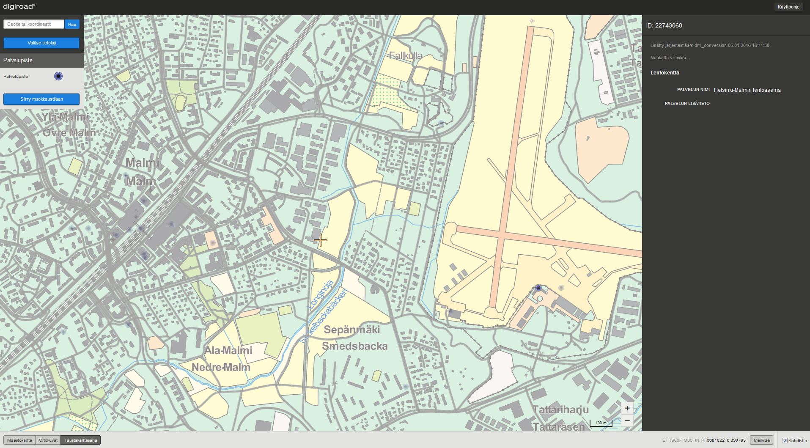

_Palvelupisteiden katselu._

##23.2 Palvelupisteen muokkaus##

Palvelupisteen voi poistaa, siirt&auml;&auml; tai lis&auml;t&auml; uuden merkinn&auml;n muokkaustilassa. Muokkaustilaan p&auml;&auml;see Siirry muokkaustilaan -painikkeesta. N&auml;yt&ouml;n yl&auml;osaan tulee ilmoitus muokkaustilaan siirtymisest&auml;.

###Palvelupisteen poisto###

Muokattava palvelupiste valitaan klikkaamalla sen geometriaa. Valitun kohteen geometria korostuu. Valittu palvelupiste voidaan poistaa raksittamalla oikeassa laidassa oleva poista-ruutu (2) ja painamalla tallenna painiketta (3). Muutokset voidaan kumota peruuta-napilla (4).

###Palvelupsiteen siirto ja muokkaus###

Yksitt&auml;ist&auml; palvelupistett&auml; voidaan my&ouml;s siirt&auml;&auml;. Ensin klikataan siirrett&auml;v&auml; kohde valituksi. T&auml;m&auml;n j&auml;lkeen merkint&auml; voidaan raahata haluttuun kohtaan. Palvelupisteen sijainti ei ole riippuvainen tien geometriasta, vaan sen voi sijoittaa mihin kohtaan tahansa. Siirto tallentuu tallenna-painikkeella (3). Muutokset voidaan kumota peruuta-napilla(4).

Muokkaustilassa palvelupisteeseen voidaan lis&auml;t&auml; uusi palvelu (5) tai yksitt&auml;inen palvelu voidaan poistaa (6). Palveluun voidaan m&auml;&auml;ritt&auml;&auml; palvelun nimi (7) ja lis&auml;tieto (8). Joihinkin palveluihin on valittavissa my&ouml;s tarkentava lis&auml;kentt&auml; (9), kuten lepoalueella, pys&auml;k&ouml;intialueella, kuorma-autojen pys&auml;k&ouml;intialueella ja rautatieasemalla.

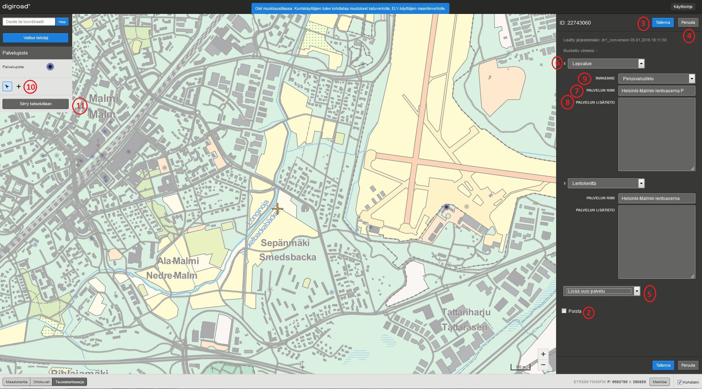

_Palvelupisteiden muokkaus._

###Palvelupisteen lis&auml;ys###

Palvelupiste voidaan lis&auml;t&auml; painamalla vasemmassa yl&auml;kulmasta lis&auml;&auml;-painiketta (10). Palvelupiste lis&auml;t&auml;&auml;n haluttuun kohtaan ja painetaan Tallenna-nappia (3) tai kumotaan Peruuta-painikkeesta (4). Takaisin katselutilaan p&auml;&auml;see siirry katselutilaan –painikkeella (11).

24. Eurooppatienumero
----------------------

Eurooppatien numerot kattavat maantiet ja muutaman kaupungin kadut. Eurooppatienumerot ovat muotoa E+nro. Karttan&auml;kym&auml;&auml;n voi valita eurooppatienumerot tietolajit-paletista (1). Karttaa tarkennettaessa kohteet tulevat n&auml;kyviin. Punaisella v&auml;rill&auml; on visualisoitu ne tielinkit, joilla on eurooppatienumero.
 
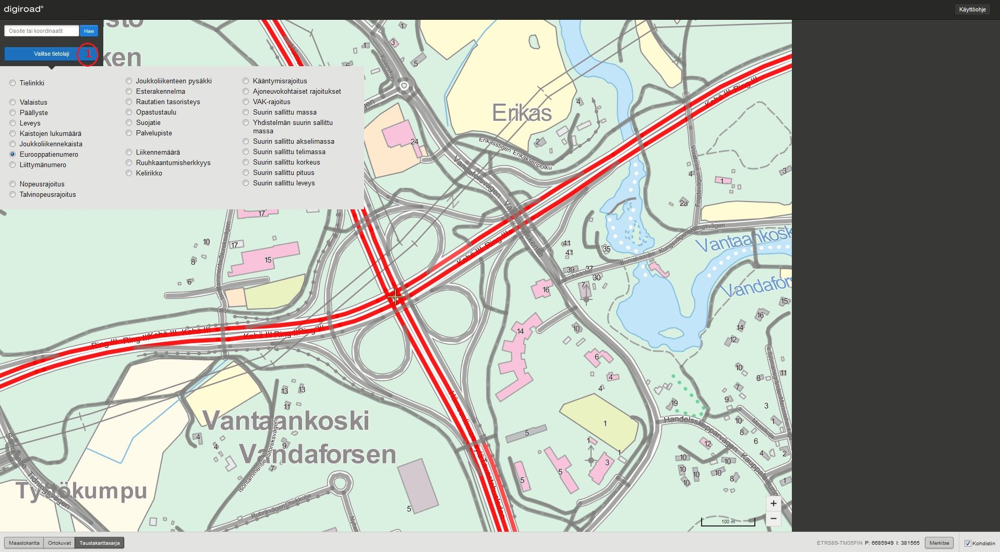

_Eurooppatienumeroiden valinta._

##24.1 Eurooppatienumeron tietojen katselu##

Eurooppatienumeron voi valita klikkaamalla kartalta sen geometriaa.

Kerran klikkaamalla tulee valituksi koko ketju, eli osuus, jossa eurooppatienumerolla on samat tiedot ja sama tien nimi (katuverkko) tai tien numero (maantie). 

Jos k&auml;ytt&auml;j&auml; haluaa valita vain yhden linkin mittaisen p&auml;tk&auml;n tarkasteluun, sen voi tehd&auml; tuplaklikkamalla eurooppatienumerollista tielinkki&auml;. Valittu ketjun tai yksitt&auml;isen tielinkin mittainen osuus geometriasta korostuu kartalla. Sivun oikeaan laitaan avautuu eurooppatienumeron ominaisuustieton&auml;kym&auml;.

Ominaisuustieton&auml;kym&auml;ss&auml; on eurooppatienumeron tiedot kyseisell&auml; tielinkill&auml;/tielinkeill&auml;, valittujen linkkien lukum&auml;&auml;r&auml; sek&auml; lis&auml;tty j&auml;rjestelm&auml;&auml;n ja muokattu viimeksi -tiedot.

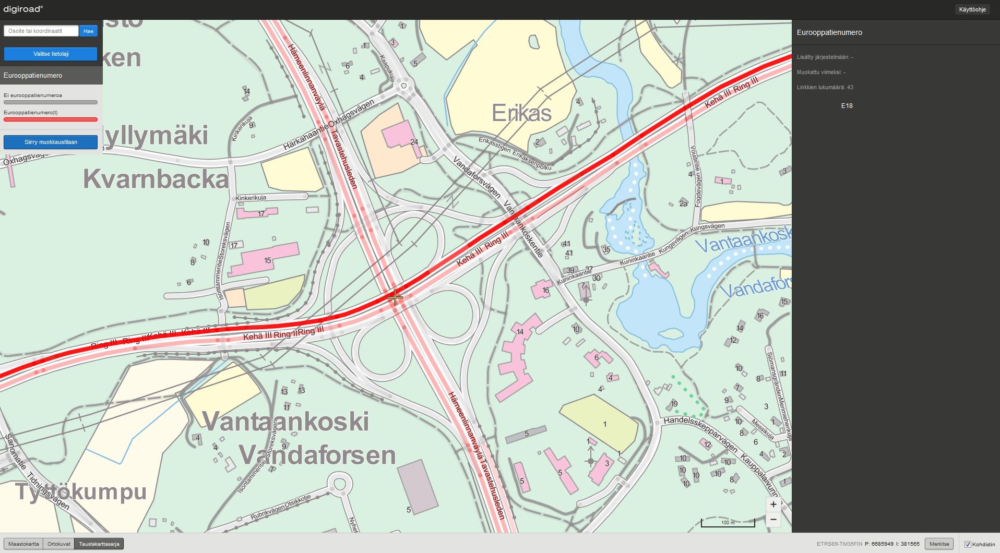

_Eurooppatienumeron tietojen katselu._

##24.2 Eurooppatienumeron muokkaus##

Eurooppatienumero viivageometrialle voi antaa muokkaustilassa tietoja. Eurooppatienumeroa voi muokata kolmella tavalla:

1.	Koko eurooppatienumeroketjulle
2.	Yksitt&auml;isen linkin mittaiselle osuudelle
3.	Monivalinnan avulla kokonaiselle alueelle.

Jos samalla tielinkill&auml; on kaksi eurooppatienumeroa, ne erotetaan lis&auml;&auml;m&auml;ll&auml; rivin vaihto tekstikentt&auml;&auml;n (enter), esimerkiksi
E4
E8

###Eurooppatienumeron muokkaus ja lis&auml;ys###

Muokattava kohde valitaan klikkaamalla sen geometriaa. Kerran klikkaamalla tulee valituksi koko tielinkkiketju, joilla on samat arvot ja tiennumero (maantiell&auml;) tai tien nimi (katuverkko ja yksityistie).  Jos k&auml;ytt&auml;j&auml; haluaa valita vain yhden linkin mittaisen p&auml;tk&auml;n tarkasteluun, sen voi tehd&auml; tuplaklikkamalla kohdetta. Tekstikentt&auml;&auml;n voidaan p&auml;ivitt&auml;&auml; eurooppatienumero (2).

Tielinkit, joilla ei ole eurooppatienumeroa on visualisoitu kartalle harmaalla v&auml;rill&auml; (4). Uusi eurooppatienumero lis&auml;t&auml;&auml;n valitsemalla kartalta geometria, jolle se halutaan lis&auml;t&auml;. Radionapista (3) valitaan eurooppatienumero ja testikentt&auml;&auml;n (2) kirjoitetaan eurooppatien numero.
 

_Eurooppatienumeroiden muokkaus._

###Eurooppatienumeron poistaminen###

Eurooppatienumeron voi poistaa valitsemalla kartalta halutun viivan, ja valitsemalla radionapeista (3) ei eurooppatienumeroa. Muutokset tallentuu tallenna-napista (5) tai ne voi kumota peruuta-napista (6).

###Useamman eurooppatienumero muokkaus monivalintaty&ouml;kalulla###

Useamman kuin yhden tielinkin eurooppatienumeron voi muuttaa kerralla. Halutut tielinkit valitaan painamalla Ctrl-painike n&auml;pp&auml;imist&ouml;lt&auml; pohjaan ja piirt&auml;m&auml;ll&auml; hiiren vasen painike pohjassa laatikko tielinkkien p&auml;&auml;lle. Valituksi tulevat kaikki tielinkit laatikon sis&auml;ll&auml; ja tielinkit, joita laatikko leikkaa. Valinnan j&auml;lkeen avautuu ikkuna (7), jossa kirjataan eurooppatienumero ko. viivoille (8). Muutos tallennetaan tai peruuta-painikkeesta voi kumota muutoksen.

Huom! Muutos kumoaa kaikki valitun alueen aiemmat eurooppatienumero tiedot. P&auml;&auml;llekk&auml;isi&auml; kohteita ei voi siis luoda.

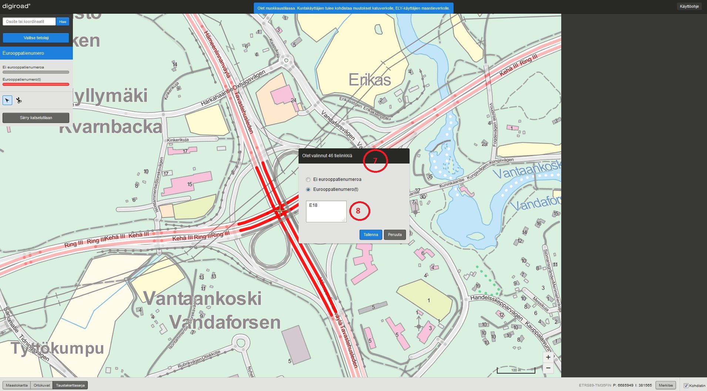

_Useamman eurooppatienumeron tietojen muokkaus kerralla._

###Eurooppatienumeron katkaiseminen###

Eurooppatienumeron geometrian voi jakaa kahteen osaan leikkausty&ouml;kalulla (9). Leikkausty&ouml;kalulla klikataan eurooppatienumeron geometriasta kohtaa, josta se halutaan katkaista. Kohteen geometrian p&auml;&auml;ll&auml; ty&ouml;kalu n&auml;kyy ristin&auml;, jotta tarkka katkaisukohta on helppo m&auml;&auml;ritt&auml;&auml;. Katkaisu valitsee aina vain tielinkin mittaisen osion, ei koko ketjua.

Eurooppatienumeron katkaisussa uusille kohteille valitaan arvot oikean laidan radionapeista (10). Kartalla ja alasvetovalikkojen vieress&auml; olevat kirjaimet osoittavat, kummasta kohteesta on kyse (11). Muutokset tallennetaan tallenna-painikkeesta tai vastaavasti kumotaan peruuta-painikkeesta.

Huom! Katkaisussa tulee m&auml;&auml;ritt&auml;&auml; uusille kohteille eri arvot, jotta tallennus on mahdollista.

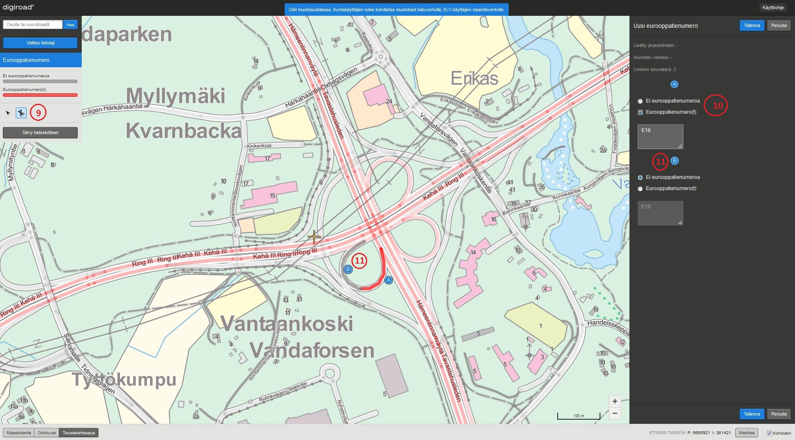

_Eurooppatienumeron katkaiseminen._

25. Liittym&auml;numero
----------------------

Liittym&auml;numeroilla tarkoitetaan numeroituja moottoriteiden eritasoliittymi&auml;. Liittym&auml;numerot annetaan Digiroadissa rampeille. Karttan&auml;kym&auml;&auml;n voi valita liittym&auml;numerot tietolajit-paletista (1). Kohteet tulevat n&auml;kyviin kartalle, kun zoomaa l&auml;hemm&auml;ksi. Punaisella v&auml;rill&auml; on visualisoitu ne tielinkit, joilla on liittym&auml;numerot.
 
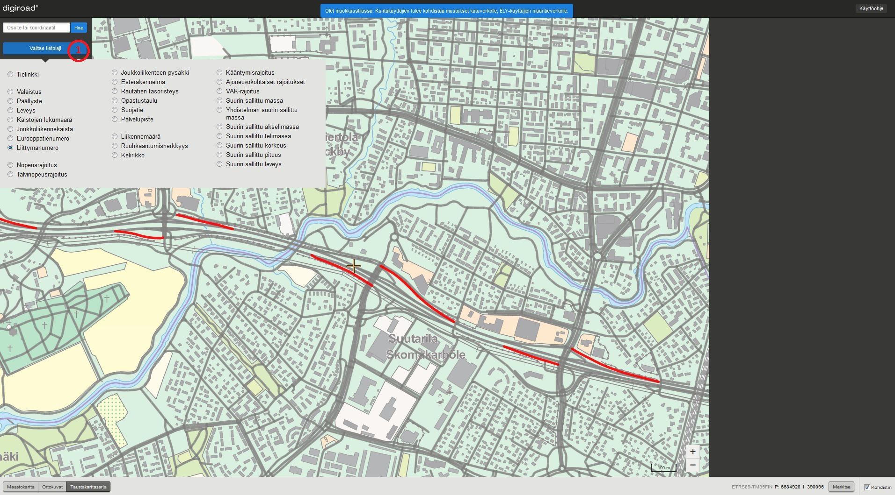

_Liittym&auml;numeron valinta._

##25.1 Liittym&auml;numeron tietojen katselu##

Liittym&auml;numeron voi valita klikkaamalla kartalta sen geometriaa. Kerran klikkaamalla tulee valituksi koko liittym&auml;numeroketju, eli osuus, jossa liittym&auml;numerolla on samat tiedot ja sama tien nimi (katuverkko) tai tien numero (maantie). Jos k&auml;ytt&auml;j&auml; haluaa valita vain yhden linkin mittaisen p&auml;tk&auml;n tarkasteluun, sen voi tehd&auml; tuplaklikkamalla liittym&auml;numerollista tielinkki&auml;. Valitun tielinkkiketjun tai yksitt&auml;isen kohteen geometria korostuu kartalla. Sivun oikeaan laitaan avautuu liittym&auml;numeron ominaisuustieton&auml;kym&auml;.

Ominaisuustieton&auml;kym&auml;ss&auml; on liittym&auml;numeron tiedot kyseisell&auml; tielinkill&auml;/tielinkeill&auml;, valittujen linkkien lukum&auml;&auml;r&auml; sek&auml; lis&auml;tty j&auml;rjestelm&auml;&auml;n ja muokattu viimeksi -tiedot.

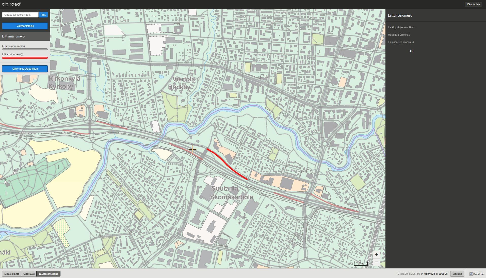

_Liittym&auml;numeron tietojen katselu._

##25.2 Liittym&auml;numeron muokkaus##

Liittym&auml;numeron viivageometrialle voi antaa muokkaustilassa tietoja. Liittym&auml;numeroa voi muokata kolmella tavalla:

1.	Koko liittym&auml;numeroketjulle
2.	Yksitt&auml;isen linkin mittaiselle osuudelle
3.	Monivalinnan avulla kokonaiselle alueelle (ei yleens&auml; tarpeen t&auml;ss&auml; tietolajissa).

###Liittym&auml;numeron muokkaus ja lis&auml;ys###

Muokattava tielinkki valitaan klikkaamalla sen geometriaa. Kerran klikkaamalla tulee valituksi koko tielinkkiketju, joilla on samat arvot ja tiennumero (maantiell&auml;) tai tien nimi (katuverkko ja yksityistie).  Jos k&auml;ytt&auml;j&auml; haluaa valita vain yhden linkin mittaisen p&auml;tk&auml;n tarkasteluun, sen voi tehd&auml; tuplaklikkamalla kohdetta. Tekstikentt&auml;&auml;n voidaan p&auml;ivitt&auml;&auml; liittym&auml;numero (2).

Tielinkit, joilla ei ole liittym&auml;numeroa on visualisoitu kartalle harmaalla v&auml;rill&auml;. Uusi liittym&auml;numero lis&auml;t&auml;&auml;n valitsemalla kartalta geometria, jolle se halutaan lis&auml;t&auml;. Radionapista (3) valitaan liittym&auml;numero(t) ja testikentt&auml;&auml;n (2) kirjoitetaan liittym&auml;n numero. Yhdell&auml; tielinkill&auml; on yleens&auml; yksi liittym&auml;numero, mutta niit&auml; voi olla my&ouml;s kaksi tai useampi. Ne eritell&auml;&auml;n rivinvaihdolla (enter) tekstikent&auml;ss&auml; (2).

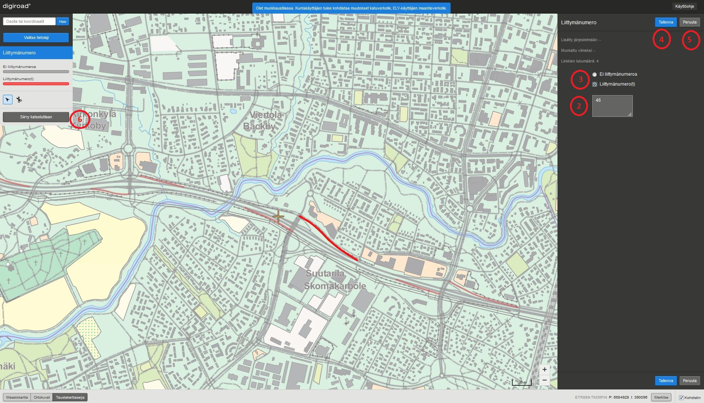

_Liittym&auml;numeron muokkaus._

###Liittym&auml;numeron poistaminen###

Liittym&auml;numeron voi poistaa valitsemalla kartalta halutun viivan, ja valitsemalla radionapeista (3) ei liittym&auml;numeroa. Muutokset tallentuu tallenna-napista (4) tai ne voi kumota peruuta-napista (5). Siirry katselutilaan –painikkeesta (6) p&auml;&auml;see pois muokkaustilasta.

###Useamman liittym&auml;numeron muokkaus monivalintaty&ouml;kalulla###

Useamman kuin yhden tielinkin liittym&auml;numeron voi muuttaa kerralla. Halutut tielinkit valitaan painamalla Ctrl-painike n&auml;pp&auml;imist&ouml;lt&auml; pohjaan ja piirt&auml;m&auml;ll&auml; hiiren vasen painike pohjassa laatikko tielinkkien p&auml;&auml;lle. Valituksi tulevat kaikki tielinkit laatikon sis&auml;ll&auml; ja tielinkit, joita laatikko leikkaa. Valinnan j&auml;lkeen avautuu ikkuna (10), jossa kirjataan liittym&auml;numero ko. viivoille (11). Muutos tallennetaan tai peruuta-painikkeesta voi kumota muutoksen.

Huom! Muutos kumoaa kaikki valitun alueen aiempien liittym&auml;numeroiden tiedot. P&auml;&auml;llekk&auml;isi&auml; kohteita ei voi siis luoda.
 

_Useamman liittym&auml;numeron tietojen muokkaus kerralla._

###Liittym&auml;numeron katkaiseminen###

Liittym&auml;numeron voi jakaa kahteen osaan leikkausty&ouml;kalulla (7). Leikkausty&ouml;kalulla klikataan kohteen geometriasta kohtaa, josta se halutaan katkaista. Liittym&auml;numeron geometrian p&auml;&auml;ll&auml; ty&ouml;kalu n&auml;kyy ristin&auml;, jotta tarkka katkaisukohta on helppo m&auml;&auml;ritt&auml;&auml;. Katkaisu valitsee aina vain tielinkin mittaisen osion, ei koko ketjua.

Liittym&auml;numeron katkaisussa kohteille valitaan arvot oikean laidan radionapeista (8). Kartalla ja alasvetovalikkojen vieress&auml; olevat kirjaimet osoittavat, kummasta kohteesta on kyse (9). Muutokset tallennetaan tallenna-painikkeesta tai vastaavasti kumotaan peruuta-painikkeesta.

Huom! Katkaisussa tulee m&auml;&auml;ritt&auml;&auml; uusille kohteille eri arvot, jotta tallennus on mahdollista.

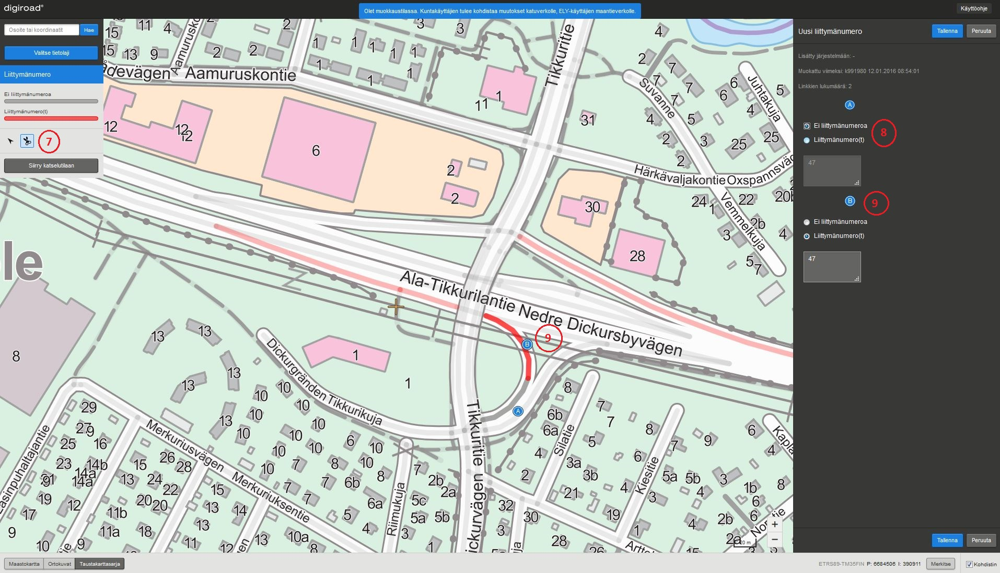

_Liittym&auml;numeron katkaiseminen._

26. Liikennevalo
----------------------

Valo-ohjatuissa liittymiss&auml; liikennevalo on kuvattu pisteen&auml;. Karttan&auml;kym&auml;&auml;n voi valita liikennevalot tietolajit-paletista (1). Kartalle tulevat esiin liikennevalot sinisen&auml; pisteen&auml;. Punaisella pisteell&auml; olevat liikennevalot ovat geometrian ulkopuolella olevia liikennevaloja.
 

_Liikennevalojen valinta._

##26.1 Liikennevalon tietojen katselu##

Yksitt&auml;isen liikennevalon voi valita klikkaamalla kartalta sen geometriaa.  Valitun kohteen geometria korostuu. Sivun oikeaan laitaan avautuu liikennevalon ominaisuustieton&auml;kym&auml;. Ominaisuustieton&auml;kym&auml;ss&auml; n&auml;kyy liikennevalon ID, lis&auml;tty j&auml;rjestelm&auml;&auml;n ja muokattu viimeksi -tiedot. Valinnan voi purkaa klikkaamalla taustakarttaa.

_Liikennevalokohteen katselu._

###Geometrian ulkopuolelle j&auml;&auml;neet liikennevalot###

Geometrian ulkopuolelle j&auml;&auml;neet liikennevalot on korostettu kartalla punaisella pisteell&auml;. N&auml;in voi k&auml;yd&auml; jos tielinkkigeometria sen alla on muuttunut niin paljon, ettei j&auml;rjestelm&auml; pysty en&auml;&auml; p&auml;&auml;ttelem&auml;&auml;n sen sijaintia geometrialla. Liikennevaloa siirt&auml;m&auml;ll&auml; geometriavirhe poistuu.

_Geometrian ulkopuolinen liikennevalo on n&auml;kyy kartalla punaisena pisteen&auml;._

Geometrian ulkopuolelle j&auml;&auml;neill&auml; liikennevaloilla on oma lista (2). Liikennevalot on jaoteltu listalle kunnan sek&auml; kunnan sis&auml;ll&auml; hallinnollisen luokan (kunta, valtio, yksityinen) mukaan. Listalla n&auml;kyy vain ne liikennevalot, joihin k&auml;ytt&auml;j&auml;ll&auml; on muokkausoikeus. Liikennevalosta on listassa linkki, josta p&auml;&auml;see suoraan pisteen kohdalle sovelluksessa ja sen voi siirt&auml;&auml; takaisin geometrialle. Lista sulkeutuu Sulje lista -painikkeesta.

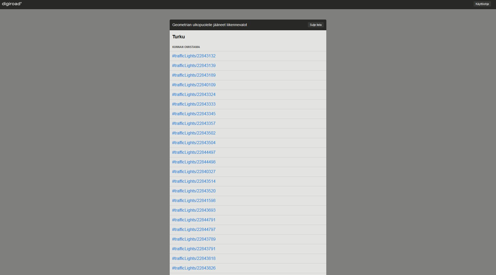

_Geometrian ulkopuoliset liikennevalot._

##26.2 Liikennevalon muokkaus##

Liikennevalon voi poistaa, siirt&auml;&auml; tai lis&auml;t&auml; uuden kohteen muokkaustilassa. Muokkaustilaan p&auml;&auml;see Siirry muokkaustilaan -painikkeesta. N&auml;yt&ouml;n yl&auml;osaan tulee ilmoitus muokkaustilaan siirtymisest&auml;.

###Liikennevalon poisto, siirto ja lis&auml;ys###

Muokattava kohde valitaan klikkaamalla sen geometriaa. Valitun kohteen geometria korostuu. Valittu liikennevalo voidaan poistaa raksittamalla oikeassa laidassa oleva poista-ruutu (4) ja painamalla tallenna painiketta (5). Muutokset voidaan kumota peruuta-napilla (6).

Yksitt&auml;ist&auml; liikennevaloa voidaan my&ouml;s siirt&auml;&auml;. Ensin klikataan siirrett&auml;v&auml; kohde valituksi. T&auml;m&auml;n j&auml;lkeen merkint&auml; voidaan raahata haluttuun kohtaan. Tielinkki, jolle liikennevalo siirtyy, korostuu kartalla sinisell&auml; v&auml;rill&auml;. Siirto tallentuu tallenna-painikkeella (5). Muutokset voidaan kumota peruuta-napilla (6).

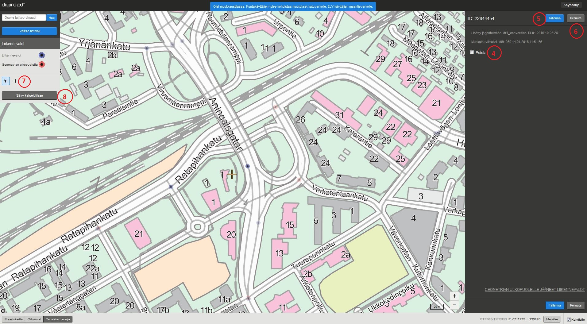

_Liikennevalokohteiden muokkaus._

Liikennevalomerkint&auml; voidaan lis&auml;t&auml; klikkaamalla vasemmassa yl&auml;kulmasta plussaa eli lis&auml;ys-ty&ouml;kalua (7). Liikennevalo lis&auml;t&auml;&auml;n haluttuun tien kohtaan ja painetaan Tallenna-nappia. Takaisin katselutilaan p&auml;&auml;see siirry katselutilaan –painikkeella (8).

