Digiroad-ylläpitosovelluksen käyttöohje
==============

__Huom! Suosittelemme, että Digiroad-sovellusta käytetään Firefox-, Chrome- tai Edge-selaimella.__

__Huom! K&auml;ytt&ouml;ohjeen kuvia voi näpäyttää hiirellä suuremmaksi, jolloin tekstit erottuvat paremmin.__

# 1. Miten pääsen alkuun

1. Digiroad-sovellukseen kirjaudutaan voimassa olevilla Väyläviraston tunnuksilla. Mik&auml;li tunnuksia ei ole, voi ne tilata Digiroad-operaattorilta sähköpostitse osoitteesta info@digiroad.fi.

2. Digiroad-selainsovellukseen kirjaudutaan osoitteessa: <a href=https://digiroad.vaylapilvi.fi/ target="_blank">https://digiroad.vaylapilvi.fi. </a>

3. Kirjautumisen j&auml;lkeen avautuu karttak&auml;ytt&ouml;&auml;ss&auml; katselutila. Käyttöoikeudet on rajattu maantieteellisesti kunnan tai ELY-alueen sekä k&auml;ytt&auml;j&auml;n roolin mukaan. Katselijan roolissa aineistoja voi ainoastaan katsella käyttöliittymässä. Muokkaajan roolissa aineistoja voi sek&auml; katsella ett&auml; muokata.

Oikeudet jakautuvat maantieteellisesti seuraavasti:

- Väyläviraston tunnuksilla p&auml;&auml;see katselemaan sovelluksessa kaikkia aineistoja, vaikka Digiroadin muokkausoikeuksia ei olisi.
- Sovelluksen käyttäjälle on voitu myöntää muokkausoikeuksia h&auml;nelle m&auml;&auml;riteltyjen kuntien maantieteellisten kuntarajojen sis&auml;puolella oleviin aineistoihin. Muokkausoikeudet voidaan myöntää kunnan tai ELY-alueen aineistoihin.
- Digiroad-operaattorilla on oikeudet koko Suomen kaikkiin kunta-aineistoihin.

Jos karttak&auml;ytt&ouml;liittym&auml;n katselutila ei avaudu sovellukseen kirjautumisen jälkeen, ei kyseisell&auml; tunnuksella ole p&auml;&auml;sy&auml; Väyläviraston extranetiin. T&auml;ll&ouml;in tulee ottaa yhteytt&auml; Digiroad-operaattoriin sähköpostitse osoitteeseen info@digiroad.fi tai puhelimitse numeroon 040 507 2301.

## 1.1 Mistä saan opastusta?

Digiroad-operaattorilta saa tarvittavat tunnukset ja k&auml;ytt&ouml;oikeudet selainsovellukseen. Operaattori auttaa my&ouml;s ongelmatilanteissa sovelluksen k&auml;yt&ouml;n kanssa. Asiakaspalveluun voi olla yhteydessä sähköpostitse osoitteeseen info@digiroad.fi tai puhelimitse numeroon 040 507 2301 arkipäivisin klo 9-16.

Yhteystiedot:

Digiroad-operaattori:
info@digiroad.fi
040 507 2301
 <a href=http://www.vayla.fi/digiroad target="_blank">vayla.fi/digiroad </a>

Pys&auml;kkeihin liittyv&auml;t asiat:
pysakit@digiroad.fi

## 1.2 Usein kysytyt kysymykset (UKK) ja ongelmatilanteet

Digiroad-sovelluksen k&auml;yt&ouml;n usein kysytyt kysymykset on koottu Digiroad-sivustolle. Usein kysyttyihin kysymyksiin p&auml;&auml;set <a href=https://vayla.fi/vaylista/aineistot/digiroad/yllapito/usein-kysytyt-kysymykset  target="_blank">t&auml;&auml;lt&auml;. </a>

### Ongelmatilanteet

Sovelluksen toimiessa virheellisesti tee näin:

- Lataa sivu uudelleen n&auml;pp&auml;imist&ouml;n F5-painikkeella.
- Tarkista, ett&auml; selaimestasi on k&auml;yt&ouml;ss&auml; ajan tasalla oleva versio ja selaimesi on Mozilla Firefox tai Chrome.
- Poista evästeet ja välimuisti (lukon kuva osoitepalkin vasemassa laidassa, Cookies englanniksi).
- Jos edell&auml; olevat eiv&auml;t korjaa ongelmaa, ota yhteytt&auml; Digiroad-operaattoriin sähköpostitse info@digiroad.fi tai soittamalla numeroon 040 507 2301.

### Kirjautuminen Digiroad-sovellukseen

Digiroad-selainsovellukseen kirjaudutaan osoitteessa:  <a href=https://digiroad.vaylapilvi.fi/  target="_blank">https://digiroad.vaylapilvi.fi. </a>Kirjautumiseen tarvitaan voimassa olevat Väyläviraston tunnukset. Tunnuksia saa Digiroad-operaattorilta (kts. [Miten p&auml;&auml;st&auml; alkuun](https://digiroad.vaylapilvi.fi/manual/index.html#!index.md#1._Miten_p%C3%A4%C3%A4sen_alkuun?)).

_Kirjautuminen Digiroadiin._

Kirjautumisen j&auml;lkeen avautuu Digiroad-selainsovelluksen karttak&auml;ytt&ouml;liittym&auml;n katselutila. Maantieteellisesti kartalla on n&auml;kyviss&auml; alue, johon k&auml;ytt&auml;j&auml;ll&auml; on oikeudet (kts. [Miten p&auml;&auml;st&auml; alkuun](https://digiroad.vaylapilvi.fi/manual/index.html#!index.md#1._Miten_p%C3%A4%C3%A4sen_alkuun?)).

_Karttak&auml;ytt&ouml;liittym&auml;n katselutila._

Mik&auml;li karttak&auml;ytt&ouml;liittym&auml;n katselutila ei avaudu sovellukseen kirjautumisen jälkeen, ei k&auml;ytt&auml;j&auml;ll&auml; ole oikeuksia Digiroad-sovellukseen. Digiroad-oikeuksia voi pyyt&auml;&auml; Digiroad-operaattorilta (kts. [Miten p&auml;&auml;st&auml; alkuun](#1._Miten_p&auml;&auml;st&auml;_alkuun?)).

# 2. Yleistä 

Sovelluksella on kaksi tilaa: katselu- ja muokkaustila. Kirjautumisen j&auml;lkeen ruudulle avautuu oletuksena katselutila. Jos käyttäjälle ei ole myönnetty muokkausoikeuksia kunnan tai ELY-keskuksen alueelle, voi hän ainoastaan katsella Digiroadin eri tietolajeja sovelluksessa. Muokkausoikeudet saatuaan käyttäjä voi sekä katsella että muokata eri tietolajeja. Muokkausoikeudet myönnetään käyttäjälle aina alueellisesti yhden tai useamman kunnan tai Ely-keskuksen rajojen sisäpuolella oleviin aineistoihin.

Tietolajien muokkaus suoritetaan muokkaustilassa, jolloin käyttäjä pääsee muokkaamaan niitä tietoja, joihin hänelle on myönnetty ylläpito-oikeudet. (kts. [Miten p&auml;&auml;st&auml; alkuun](#1._Miten_p&auml;&auml;st&auml;_alkuun?)). Kartalle voi valita yhden tietolajin kerrallaan. Tietolaji valitaan käyttöliittymän vasemmassa reunassa olevan tietolajipaneelin tietolajivalikosta (1).

_Tietolajivalikko._

Muokkaustilan saa aktivoitua napauttamalla tietolajipaneelin alareunassa olevaa Siirry muokkaustilaan -painiketta. Muokkaustilassa kartan yläpalkkiin ilmestyy teksti "Olet muokkaustilassa. Kuntakäyttäjien tulee kohdistaa muutokset katuverkolle, ELY-käyttäjien maantieverkolle." (2). Muokkaustilassa tehdyt muutokset tallentuvat painamalla Tallenna-painiketta (3). Muutosten tallentamisen jälkeen tietolajille tallentuu Muokattu viimeksi -kohtaan muokkaajan käyttäjätunnus, päivämäärä ja kellonaika (4). Ennen uusien tietojen tallentamista voi tehdyt muutokset peruuttaa napauttamalla Peruuta-painiketta (3). Tallenna- ja Peruuta -painikkeet eivät ole aktiivisia silloin, kun muutoksia ei ole tehty. Tehdyt muutokset tulee tallentaa tai perua ennen kun sovellus antaa siirtyä muokkaamaan uutta kohdetta. Takaisin katselutilaan pääsee napauttamalla Siirry katselutilaan -painiketta (5).

Kaikki tietolajit n&auml;kyv&auml;t sek&auml; katselu- ett&auml; muokkaustilassa vain, kun kartan mittakaavajanalla näkyy 200 m tai vähemmän. Sovellus ilmoittaa, kun kartan mittakaava on liian ep&auml;tarkka tietolajin n&auml;kymiselle.

_Muokkaustila._

## 2.1 Karttaikkunan muokkaus

### Kartan liikutus

Karttaa liikutetaan hiirellä raahaamalla.

### Mittakaavataso

Kartan mittakaavatasoa muutetaan joko hiiren rullalla, kaksoisnapauttamalla, Shift+piirto (alue) tai mittakaavapainikkeista (7). Mittakaavapainikkeita k&auml;ytt&auml;m&auml;ll&auml; kartan keskitys s&auml;ilyy. Hiiren rullalla, kaksoisnapauttamalla tai Shift+piirto (alue) kartan keskitys siirtyy kursorin kohtaan.  K&auml;yt&ouml;ss&auml; oleva mittakaavataso n&auml;kyy karttaikkunan oikeassa alakulmassa (8).

### Karttahaut

K&auml;ytt&ouml;liittym&auml;ss&auml; on hakukentt&auml; (6), jossa voi hakea haluttua sijantia kohteen koordinaateilla, katuosoitteella tai tieosoitteella. Haku suoritetaan kirjoittamalla hakuehto hakukentt&auml;&auml;n ja napauttamalla Hae-painiketta. Hakutulos tulee listaan hakukent&auml;n alle. Hakutuloslistassa ylimp&auml;n&auml; on maantieteellisesti kartan nykyist&auml; keskipistett&auml; l&auml;himp&auml;n&auml; oleva kohde. Mik&auml;li hakutuloksia on vain yksi, keskittyy kartta automaattisesti haettuun kohteeseen. Jos hakutuloksia on useampi kuin yksi, t&auml;ytyy listalta valita tulos, johon kartta keskittyy. Tyhjenn&auml; tulokset -painike tyhjent&auml;&auml; hakutuloslistan.

Koordinaateilla haku: Koordinaatit sy&ouml;tet&auml;&auml;n hakukenttään ETRS89-TM35FIN -koordinaattijärjestelmässä, siten, että pohjoinen ja eteläinen arvo ovat pilkuin erotettu. Esimerkiksi: 6975061, 535628.

Katuosoitteella haku: Katuosoitteesta hakukentt&auml;&auml;n voi sy&ouml;tt&auml;&auml; koko ositteen tai sen osan. Esimerkiksi: Mannerheimintie tai Mannerheimintie 10, Helsinki.

Tieosoitteella haku: Tieosoitteesta hakukentt&auml;&auml;n voi sy&ouml;tt&auml;&auml; koko osoitteen tai osan siit&auml;. Esimerkiksi 2 tai 2 1 150.

### Merkitse piste kartalle

Merkitse-painike käyttöliittymän alapalkin vasemmassa reunassa (10) merkitsee sinisen pisteen kartan keskipisteeseen. Merkki poistuu vain, kun merkit&auml;&auml;n uusi piste kartalta. Merkitse-painikkeen vieress&auml; olevat koordinaatit seuraavat kartan keskipistett&auml; ja p&auml;ivittyv&auml;t, kun kartan keskipiste muuttuu.

### Taustakartat

Karttaikkunan taustakartaksi voi valita maastokartan, ortokuvan tai taustakarttasarjan. (9)

_Karttaikkunan muokkaus._

## 2.2 Historiatiedot

Sovelluksessa on mahdollista piirt&auml;&auml; n&auml;kyviin my&ouml;s tielinkkien historiatiedot aiemmin poistuneiden tielinkkien osalta. Toiminnallisuuden tavoitteena on helpottaa yll&auml;pit&auml;j&auml;&auml; t&auml;ydent&auml;m&auml;&auml;n uusien tielinkkien puuttuvia ominaisuustietoja. Toistaiseksi historiatietoja on mahdollista katsella ainoastaan tielinkkien toiminnallisten luokkien ja nopeusrajoitustiedon osalta. 
Historiatiedot otetaan piirtoon valitsemalla ensin aktiiviseksi se tietolaji, jota halutaan tarkastella. Tietolaji valitaan tietolajipaneelin yl&auml;kulmassa olevasta tietolajivalikosta (1). Kun haluttu tietolaji on visualisoitu karttaikkunaan, aktivoidaan tietolajipaneelin alalaidasta Näytä poistuneet tielinkit -valintaruutu (2).

_Kuvassa on piirrossa linkkien toiminnallisen luokan historiatiedot, jotka visualisoituvat vaaleansinisinä ohuempina viivoina kartalle._

## 2.3 Käyttöliittymän osien kuvaus

*Käyttöliittymä*

**Yläpalkki** (1) on käyttöliittymän ylin osa. Siinä on Digiroad-logo, sekä oikealla painikkeet:
* Lisätyt viivamaiset kohteet
	* Lista viivamaisista kohteista, jotka luodaan yöllä liikennemerkkien luomisen/päivityksen seurauksena.
* Tietolajien kuntasivu
	* Kuntakäyttäjä voi merkitä tietolajeja tarkistetuiksi, sekä tarkistaa yksityisteiden ilmoitusten tilanteen.
* Tiedotteet
	* Tiedotteita liittyen Digiroadiin.
* Käyttöohje
	* Linkki Digiroad-ylläpitosovelluksen käyttöohjeeseen.
* Palaute työkalusta
	* Avaa ikkunan, jossa käyttäjä voi lähettää palautetta liittyen ylläpitosovellukseen.

**Alapalkki** (2) on käyttöliittymän alin osa. Siinä on vasemmalta oikealle:
* Valintapainikkeet kartan taustalle: Maastokartta, Ortokuvat ja Taustakarttasarja (oletus). 
* Tietolajeja ladatessa tähän keskelle ilmestyy latauspalkki. 
* Painikkeesta ”Muokkaa aloitussivua” voi käyttäjä muokata sitä, mikä näkymä hänelle latautuu aina ylläpitosovellusta käynnistäessä. 
* Tieto kunnasta, minkä alueella karttaikkuna on.
* ETRS89-TM35FIN koordinaatit kartalla näkyvän kohdistin -ristin (3) kohdalla.
* ”Merkitse” -painike, jota napauttamalla voi asettaa merkin itselleen kartalla näkyvän kohdistin -ristin kohdalle.
* ”Kohdistin” -valintaruutu, jota napauttamalla saa kohdistin -ristin pois ja päälle.
* ”Tieosoiteinfo” -valintaruutu, jota napauttamalla saa tieosoitetiedot näkyviin viemällä hiiren tielinkin päälle.

Keskellä ruutua on **Karttaikkuna** (4). Karttaikkunassa näkyy käyttäjän valitsema tausta sekä visualisoitavaksi valittu tietolaji. Karttaikkunan oikeassa alalaidassa on **Zoomauspainikkeet** (5), joita naputtamalla voi loitontaa tai lähentää karttaikkunaa.

Vasemmalla käyttöliittymässä ylhäältä alaspäin lähdettäessä on ensimmäisenä **Hakukenttä** (6), josta voi etsiä tietoa edellä mainitusti.

Hakukentän alla on painike (7), jolla saa auki **Tietolajivalikon**. Tästä valikosta voi valita tietolajin, joka näkyy karttaikkunassa. 

Näiden alla on **Tietolajipaneeli**	 (8), joka sisältää:
* Riippuen tietolajista, tietolajipainikkeen alla on mahdollisesti **Radionappeja** tai **Valintaruutuja** (9), joista voi valita mitä ominaisuutta tietolajista visualisoidaan kartalla. 
* Näiden alla (tai niiden puuttuessa) on **Selite** (10). Selitteessä kerrotaan, millä tavalla tietolajit on kuvattu karttaikkunassa. 
* Näiden alla on tietolajista riippuen mahdollisesti valintaruutuja, joista saa näkyviin ja pois näkyviltä tiettyjä ominaisuuksia. 
* Toisilla tietolajeilla on **Työkalupainikkeet** (11), joita napauttamalla saa valittua erilaisia työkaluja tietolajien muokkaamiseen.
* Alimmaisena tietolajipaneelissa on ”Siirry muokkaustilaan” -painike (12), jota painamalla siirrytään muokkaustilaan.

Oikealla käyttöliittymässä on **Ominaisuustietoikkuna** (13). Tähän kuvautuu valitun kohteen ominaisuustiedot eri lailla tietolajista riippuen. Erilaisia vaihtoehtoja muokkaustilassa oleville ominaisuustietojen kuvauksille on:
* **Syötekenttä**, johon voi syöttää näppäimistöltä tekstiä.
* **Alasvetovalikko**, josta voi valita tietolajille ominaisia valintoja.
* **Radionapit** ja **Valintaruudut**: pyöreistä radionapeista voi valita vain yhden, kun taas neliömäisistä valintaruuduista voi valita haluamansa määrän.

Asioita tallentaessa ja joskus uusia alueita ladatessa karttaikkunaan ilmestyy **Spinneri** (14) ilmoittamaan käynnissä olevasta latauksesta. 

*Spinneri*

# 3. Tietolajien kuntasivu ja tietolajin merkitseminen tarkistetuksi

Kuntakäyttäjän kirjautuessa Digiroadiin, näkymään aukeaa Tietolajien päivitystilanne -ikkuna (1). Ikkunassa on listattu kunnan viimeisimmät päivitykset sekä lista tärkeimmistä tietolajeista ja niiden tarkistustilanteesta. Ikkunasta pääsee siirtymään suoraan tietolajien kuntasivulle Siirry tietolajien kuntasivulle -painikkeesta (2). Tietolajien kuntasivulla kuntakäyttäjä voi merkitä tietolajeja tarkistetuiksi, tarkistaa yksityisteiden ilmoitusten tilanteen sekä tarkistaa vihjetietoja. Sininen pallura Siirry tietolajien kuntasivulle -painikkeessa tarkoittaa, että kunnassa on läpikäymättömiä vihjeitä. Vaihtoehtoisesti ikkunan voi sulkea Sulje-painikkeesta. Tietolajien päivitystilanne -ikkuna aukeaa vain kerran päivässä kuntakäyttäjän kirjautuessa ensimmäistä kertaa Digiroadiin. Digiroad-käyttöliittymän yläpalkista pääsee myös siirtymään suoraan Tietolajien kuntasivulle (3).

_Tietolajien päivitystilanne -ikkuna_

_Tietolajien kuntasivun hakeminen._

## 3.1. Tietolajien kuntasivu

Tietolajien kuntasivulla on listattuna Digiroadin tietolajit (4). Lisäksi sivulla on listattuna pistemäisten tietolajien kohdalla kohteiden määrä kunnassa ja viivamaisten tietolajien kohdalla tieto siitä, löytyykö kohteita kunnasta. Tietolajien kuntasivulla voidaan myös tarkastella, milloin tietolajeja on viimeksi päivitetty (5). Vihjeet-sarakkeessa nähdään, jos jollekin tietolajille on annettu vihjetietoja (6). Vihjetietojen listaukseen pääse napauttamalla numeroa vihjeet-sarakkeessa kunkin tietolajin kohdalla. Kunnan yksityisteiden ilmoitusten tilannetta pääsee tarkastelemaan Yksityistiet-painiketta napauttamalla (6).

_Tietolajien kuntasivu._

## 3.2. Tietolajin merkitseminen tarkistetuksi

Tarkistettu sarakkeessa nähdään, milloin jokin tietolaji on tarkistettu edellisen kerran (8). Kun tietolaji on tarkistettu ja esimerkiksi vihjeet käyty läpi, voidaan tietolaji merkitä tarkistetuksi valitsemalla tietolaji (9) ja tämän jälkeen napauttamalla Merkitse tarkistetuksi -painiketta (10). Tämän jälkeen valituille tietolajeille päivittyvät tarkistuspäivämäärä ja tietolajin tarkistaja.

_Tietolajin merkitseminen tarkastetuksi._

Tarkistettu tietolaji näkyy myös Digiroad-sovelluksessa. Kun käyttäjä on merkinnyt tietolajin tarkistetuksi, käyttöliittymä näyttää OK-merkin tietolajin jatkeena käyttöliittymässä (11).

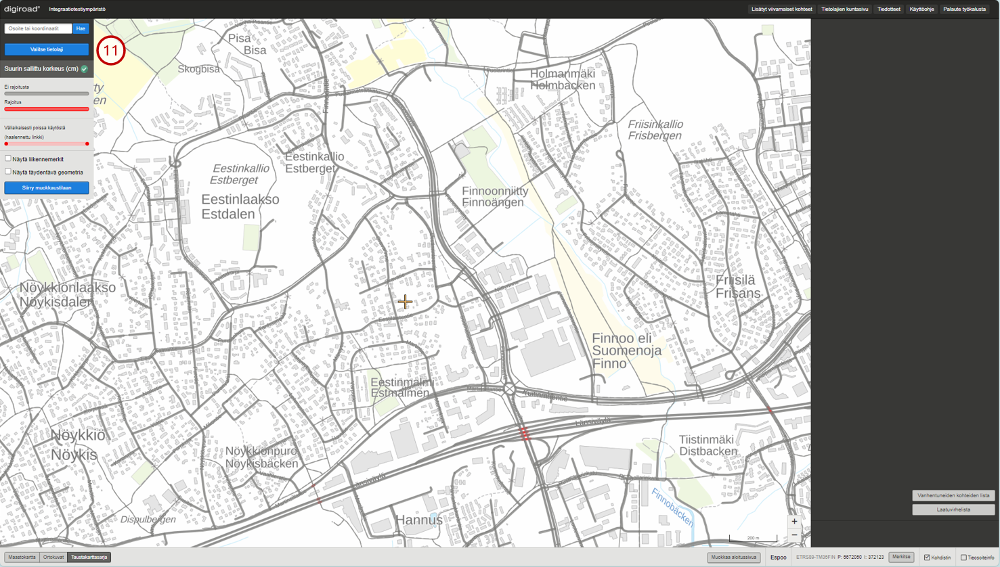

_Tarkistetun tietolajin näkyminen käyttöliittymässä._

# 4. Vihjetietojen käsittely 

Vihjetiedot ovat tietolajeille asetettuja vihjeellisiä tietoja, jotka kuntakäyttäjän on tarkistettava. Vihjetietoa on voitu lisätä tietolajille, jos on epäilys, että kohde puuttuu tai sen arvo on muuten virheellinen. Annettuja vihjetietoja pääsee muokkaamaan tietolajien kuntasivulta (1). Vihjetiedon erottaa sen mustasta kysymysmerkistä.

_Tietolajien kuntasivun hakeminen._

## 4.1 Vihjetietojen tarkastelu

Tietolajien kuntasivulla vihjetiedot näkyvät vihjetietosarakkeessa numerona sen tietolajin kohdalla, jolla on vihjetietoa (2). Vihjetietojen listaukseen pääsee napauttamalla numeroa. Vihjetiedot-listauksessa näkyvät kunnalle asetetut vihjetiedot. Vihjetiedon luokse pääsee napauttamalla vihjetietoa listauksessa (3). 

_Vihjetiedon näkyminen kuntasivunäkymässä._

_Vihjetietojen listaus._

## 4.2 Vihjetietojen korjaaminen

Vihjetieto on esimerkiksi voitu merkitä, koska alikululta puuttuu suurin sallittu korkeus. Mahdollinen suurin sallittu korkeus on merkattu alikululle vihjetietona (4). Vihjetiedon tunnistaa mustasta kysymysmerkistä. Kuntakäyttäjän pitää tarkistaa, pitääkö vihjetieto paikkaansa. Jos vihjetieto pitää paikkaansa, muutetaan ominaisuustietoikkunassa vihjetiedon valinta pois päältä (5). Jos vihjetieto ei pidä paikkaansa, poistetaan vihjetieto valitsemalla vihjetieto pois päältä ja muuttamalla rajoituksen status ”Ei rajoitusta” (6). Tiedot tallennetaan Tallenna-painiketta (7) painamalla. Käsitellyt vihjetiedot eivät poistu vihjetietolistauksesta heti (3), vaan käsitelly vihjetiedot poistuvat listasta seuraavan yön aikana. Takaisin vihjetietojen listaukseen pääsee Tietolajien kuntasivun kautta.

_Vihjetiedon muokkaaminen._

Vihjetieto on myös voitu merkitä, jos alikululla on havaittu mahdollisesti virheellinen korkeusrajoitus. Vihjetieto mahdollisesta oikeasta korkeusrajoituksesta on asetettu nykyisen rajoituksen viereen (8). Kuntakäyttäjän pitää tarkistaa, onko alikulun nykyinen suurin sallittu korkeus oikein Digiroadissa. Jos nykyinen korkeusrajoitus pitää paikkaansa, suurin sallittu korkeutta ei tarvitse korjata. Jos nykyisessä korkeusrajoituksessa on korjattavaa, korkeusrajoitus korjataan valitsemalla nykyinen korkeusrajoitus ja muuttamalla sen tiedot oikeaksi ominaisuustietoikkunassa. Kun tarkistus on tehty, voidaan vihjetieto poistaa oikean rajoituksen vierestä valitsemalla korkeusrajoituksen vihjetieto ja poistamalla vihjetiedon valinta, korkeusrajoituksen korkeus ja valitsemalla ”Ei rajoitusta” (8). Tiedot tallennetaan Tallenna-painiketta (7) painamalla, jolloin vihjetiedon kysymysmerkki tai koko korkeusrajoitus poistuvat näkymästä. 

_Vihjetiedon poistaminen._

# 5. Tielinkki

Tielinkki on tien, kadun, kävelyn ja pyöräilyn väylän tai lauttayhteyden keskilinjageometrian pienin yksikk&ouml;. Tielinkin ominaisuustiedot ovat aina voimassa koko tielinkin matkalla. Karttaikkunaan valitaan tielinkit valitsemalla tietolajivalikosta Tielinkit.

_Tielinkit._

## 5.1 Tielinkkien haku

Tielinkkej&auml; haetaan tielinkin ID:ll&auml; yksil&ouml;idyll&auml; URL-osoitteella. Linkin ID:n saa n&auml;kyviin karttaikkunassa kaksoisnapauttamalla tielinkki&auml;, jolloin sovelluksen oikeaan laitaan avautuu tielinkin ominaisuustietoikkuna. Ominaisuustietoikkunassa linkin ID on ylimp&auml;n&auml;. Esimerkki URL-osoitteesta:

 <a href=https://digiroad.vaylapilvi.fi/#linkProperty/450541 target="_blank">https://digiroad.vaylapilvi.fi/#linkProperty/450541</a>

jossa numerosarja 450541 on tielinkin ID. Toiminto tarkentaa karttaikkunan haetun tielinkin kohdalle. Tielinkin ominaisuustietoikkuna aukeaa sivun oikealle puolelle.

## 5.2 Tielinkin tietojen katselu

Yksitt&auml;isen tielinkin voi valita napauttamalla kartalta sen geometriaa. Tielinkin ominaisuustiedot avautuvat ominaisuustietoikkunaan (1). Tielinkin ominaisuustietoja ovat:

- Linkin ID
- hallinnollinen luokka
- toiminnallinen luokka
- liikennevirran suunta
- tielinkin tyyppi
- tieto tasosijainnista eli onko kyseessä silta, alikulku tai tunneli
- kuntanumero
- tiennimi (suomi, ruotsi, saame)
- tienumero
- tieosanumero
- osoitenumerot vasemmalla ja oikealla (ensimm&auml;inen ja viimeinen numero)
- Maanmittauslaitoksen ID (MML ID)

Kerran tielinkkiä napauttamalla tulee valituksi koko tielinkkiketju. Tielinkkiketjussa kaikilla tielinkeill&auml; on sama hallinnollinen luokka, toiminnallinen luokka, tielinkin tyyppi, liikennevirran suunta ja tienumero (maantiet) tai tiennimi (katuverkko ja yksityistie). Jos karttaikkunassa haluaa valita vain yhden linkin, sen voi tehd&auml; kaksoisnapauttamalla linkki&auml;.

Valitun tielinkkiketjun tai yksitt&auml;isen tielinkin geometria korostuu karttaikkunassa. Sivun oikeaan laitaan avautuu tielinkin ominaisuustietoikkuna. Jos tielinkkiketju jatkuu kuntarajan yli, tienumerolla on useita tiennimi&auml; tai useita tieosanumeroita, kirjataan n&auml;m&auml; kaikki tiedot ominaisuustietoikkunaan.

Kun tielinkkiketju on valittuna, eiv&auml;t osoitenumerot ja silta, alikulku tai tunneli -tiedot n&auml;y ominaisuustietoikkunassa. Jos k&auml;ytt&auml;j&auml; haluaa tarkastella n&auml;it&auml; tietoja, tulee tielinkki valita yksitt&auml;in kaksoisnapauttamalla.

_Tielinkkiketjun valinta (napautettu kerran)._

_Yksitt&auml;isen tielinkin valinta kaksoisnapauttamalla._

Tielinkeille voi valita visualisointitason sovelluksen vasemman reunan karttaselitenäkymästä. Visualisoinnin voi valita toiminnallisen luokan, tielinkin tyypin, hallinnollisen luokan tai silta, alikulku tai tunneli -tason mukaan. Silta, alikulku tai tunneli -tasolla kohteet piirret&auml;&auml;n kartalle tasosijainnin mukaisessa j&auml;rjestyksess&auml;, esimerkiksi alikulku piirret&auml;&auml;n silta, taso 1 -linkin alle. Valinnan mukaan visualisoinnin selitteet n&auml;kyv&auml;t sovelluksen vasemmassa laidassa. Lis&auml;ksi tielinkill&auml; on visualisoitu suuntanuoli, mik&auml;li tielinkin liikennevirran suunta on vain toiseen suuntaan.

Toiminnallisen luokan selitteet ovat:

* Luokka 1: Ohjeellisesti valtatie tai seudullinen p&auml;&auml;katu
* Luokka 2: Ohjeellisesti kantatie tai seudullinen p&auml;&auml;katu
* Luokka 3: Ohjeellisesti seututie tai alueellinen p&auml;&auml;katu
* Luokka 4: Ohjeellisesti yhdystie tai kokoojakatu
* Luokka 5: Liitynt&auml;katu tai t&auml;rke&auml; yksityistie
* Luokka 6: Muu yksityistie
* Luokka 7: Ajopolku
* Luokka 8: Kävelyn ja pyöräilyn väylä
* Luokka 9: Huoltoaukko tai erikoiskuljetusyhteys

_Tielinkit visualisoitu toiminnallisen luokan mukaan._

_Tielinkit visualisoitu tielinkin tyypin mukaan._

_Tielinkit visualisoitu hallinnollisen luokan mukaan._

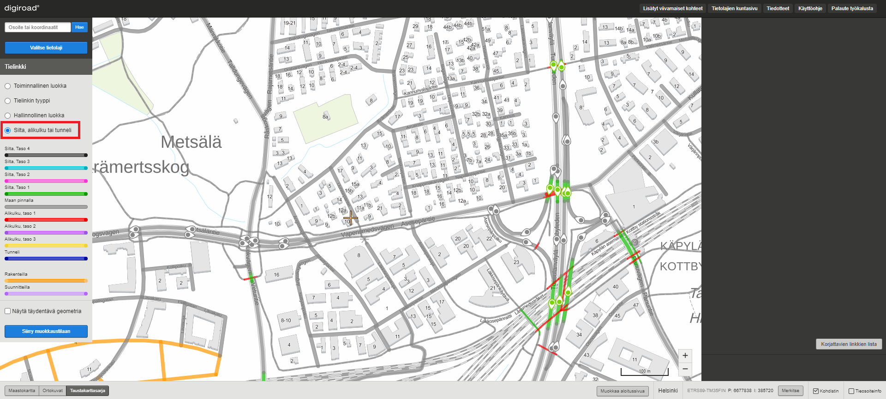

_Tielinkit visualisoitu silta, alkulku tai tunneli -tason mukaan._

## 5.3 Tielinkin ominaisuustietojen muokkaus

Yksitt&auml;isen tielinkin ominaisuustietoja voi muokata siirtym&auml;ll&auml; muokkaustilaan.

Muokattava tielinkki valitaan napauttamalla sen geometriaa (2). Kerran napauttamalla tulee valituksi koko tielinkkiketju, eli ominaisuustiedoiltaan yhtenev&auml;t tielinkit.

Jos k&auml;ytt&auml;j&auml; haluaa valita vain yhden tielinkin, sen voi tehd&auml; kaksoisnapauttamalla tielinkki&auml;.

Tielinkin ominaisuustiedoista toiminnallinen luokka, liikennevirran suunta ja tielinkin tyyppi ovat muokattavissa (3). Ketjuvalinta korjaa kaikkien ketjuun valittuna olevien tielinkkien tiedot.

_Tielinkin ominaisuustietojen muokkaus. Valittuna tielinkkiketju (napautettu kerran)._

## 5.4 Korjattavat tielinkit

Digiroadin sovelluksessa uudet tielinkit ovat korjattavien linkkien listalla, koska niilt&auml; puuttuu toiminnallinen luokka tai linkin tyyppi (2). Korjattavien linkkien lista on luokiteltu tien omistajuuden mukaan (kunta, valtio, yksityinen). Linkki on kartalla mustaksi visualisoituneena (1), kunnes toiminnallinen luokka tai linkin tyyppitiedot on lis&auml;tty järjestelmään. Korjattavien linkkien listaan p&auml;&auml;see tielinkkitasolta ominaisuustietoikkunan alareunassa olevan painikkeen kautta (3). Listasta voi napauttaa korjattavaa tielinkki&auml; (4), jolloin sovellus avautuu kyseisen linkin kohdalta. Korjattava linkki poistuu listalta sen jälkeen, kun sille on lis&auml;tty sek&auml; toiminnallinen luokka ett&auml; linkkityyppi. 

Korjattavilla linkeill&auml; on liikennevirran suunta -tieto valmiina. Tieto tulee Maanmittauslaitokselta geometriatiedon yhteydess&auml;. Jos tiedoissa on virheit&auml;, voi virheelliset liikennevirran suunta -tiedot korjata k&auml;ytt&ouml;liittym&auml;ss&auml; samalla kun linkille lis&auml;t&auml;&auml;n toiminnallinen luokka ja linkkityyppi. Korjattavien linkkien listaan ei tule uusia kävelyn ja pyöräilyn v&auml;ylien, ajopolkujen ja ajoteiden tielinkkej&auml;, koska n&auml;iden tiedot saadaan Maanmittauslaitokselta. Toiminnallinen luokka ja tielinkin tyyppi t&auml;ydennet&auml;&auml;n n&auml;ille tielinkille automaattisesti. 

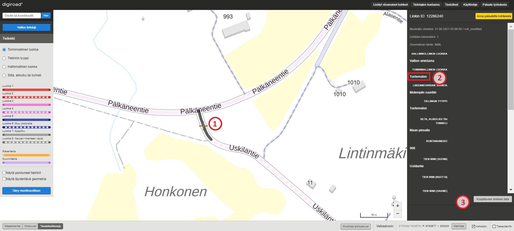

_Korjattava linkki._

_Korjattavien linkkien lista._

# 6. Kaistan mallinnustyökalu

Kartalle voi valita tietolajivalikosta (1) Kaistan mallinnustyökalu -valinnan. Työkalu mahdollistaa aiempaa tarkempien kaistatietojen ylläpitämisen mm. liikenneohjauslaitteiden sijoittamisen sujuvoittamiseksi. Karttaikkunaa zoomaamalla geometriat visualisoituvat kaistatietojen mukaan, joiden kategoriat ovat:

* Pääkaista
* Lisäkaista
* Tielinkillä 1 lisäkaista
* Tielenkillä 2 lisäkaistaa
* Tielinkillä 3 lisäkaistaa
* Tielinkillä 4 lisäkaistaa
* Tielinkillä 5 lisäkaistaa
* Tielinkillä 6 lisäkaistaa tai enemmän

Jos tielle ei ole kaistatietoa saatavilla, se visualisoituu harmaalla värillä. Lisäksi liikennöintisuuntaa osoittavat nuolet visualisoituvat yksisuuntaisten tielinkkien kaistoille.

_Kaistan mallinnustyökalu -valinta._

## 6.1 Kaistan mallinnustyökalu -tietojen katselu

Kaistan mallinnustyökalun kohteita voidaan valita napauttamalla kartalta sen geometriaa (2). Kerran napauttamalla tulee valituksi koko kaistajoukko, eli kaikki geometriat, joilla on samat kaistatiedot tietolajissa, sama tieosanumero sekä tiennumero (maantiell&auml;) tai tien nimi (katuverkko ja yksityistie). Jos k&auml;ytt&auml;j&auml; haluaa valita vain yhden linkin mittaisen p&auml;tk&auml;n tarkasteluun, sen voi tehd&auml; kaksoisnapauttamalla tielinkki&auml;. Valitut tielinkit korostuvat karttaikkunassa ja muut geometriat n&auml;kyv&auml;t haaleammalla. Sivun oikeaan laitaan avautuu valitun tielinkin tai kaistajoukon ominaisuustietoikkuna (3). Ominaisuustietoikkunan yläosassa on visualisoitu tielinkillä olevien kaistojen numerot ja niiden sijainnit suhteessa toisiinsa. Valittu kaista on korostettuna keltaisella värillä (4). Lisäksi tietolajipaneelin selitteessä (5) eritelty kaistavaihtoehdot toisistaan. Kaistavalintaa voi muuttaa napauttamalla ominaisuustietoikkunassa lisäkaistan kuvaketta (6) , jolloin karttaikkunaan visualisoituu lisäkaista pääkaistan rinnalle (7). Ominaisuustietoikkunassa on nähtävissä myös valinnan tieosoitetiedot sekä kaistan tiedot. Lisäksi ominaisuustietoikkunassa näkyy, milloin tiedot on lisätty järjestelmään sekä milloin niitä on muokattu viimeksi. 

_Kaistan mallinnustyökalu -katselutila._

Kaistojen numerot (8) visualisoituvat karttaikkunassa, kun valitaan yksittäisen tielinkin mittainen kaista tai kaistajoukko.

Kaistanumerointi muodostuu seuraavasti:

* 1 = pääkaista
* 2 = ensimmäinen lisäkaista pääkaistan vasemmalla puolella
* 3 = ensimmäinen lisäkaista pääkaistan oikealla puolella
* 4 = toinen lisäkaista pääkaistan vasemmalla puolella
* 5 = toinen lisäkaista pääkaistan oikealla puolella
* 6 = kolmas lisäkaista pääkaistan vasemmalla puolella
* 7 = kolmas lisäkaista pääkaistan oikealla puolella
* 8 = neljäs lisäkaista pääkaistan vasemmalla puolella
* 9 = neljäs lisäkaista pääkaistan oikealla puolella

_Kaistan mallinnustyökalu -katselutila ja lisävalinnat._

## 6.2 Kaistojen muokkaus mallinnustyökalulla 

Kaistoja muokataan muokkaustilassa (10). Muokattava kohde valitaan napauttamalla sen geometriaa. Kerran napauttamalla tulee valituksi koko kaistajoukko, eli kaikki geometriat, joilla on samat kaistatiedot tietolajissa, sama tieosanumero sekä tiennumero (maantiell&auml;) tai tien nimi (katuverkko ja yksityistie). Jos k&auml;ytt&auml;j&auml; haluaa valita vain yhden linkin mittaisen p&auml;tk&auml;n tarkasteluun, sen voi tehd&auml; kaksoisnapauttamalla tielinkki&auml;. Tietoja muokataan ominaisuustietoikkunassa (11). Muutokset tallennetaan painamalla Tallenna-painiketta (12) oikeasta alakulmasta. Ennen Tallenna-painikkeen painamista muutokset voi peruuttaa painamalla Peruuta-painiketta (13). Tallenna- ja Peruuta -painikkeet eiv&auml;t ole aktiivisina, jos muutoksia ei ole tehty. Jos muutoksia on tehty eik&auml; niit&auml; ole tallennettu tai peruutettu ja siirryt&auml;&auml;n pois kaistan mallinnustyökalu -valinnasta, sovellus antaa muutos-dialogin. Muutos-dialogi kertoo k&auml;ytt&auml;j&auml;lle, ett&auml; muutoksia on tehty ja ne tulee tallentaa tai peruuttaa ennen kuin voi jatkaa.

_Kaistan mallinnustyökalu -muokkaustila._

### Kaistojen lisääminen tielinkkien avulla

Pääkaistalle voi lisätä lisäkaistoja ensin valitsemalla linkin geometrian (14) (yksittäinen tielinkki tai kaistajoukko) sovelluksen ollessa kaistan mallinnustyökalun muokkaustilassa. Ominaisuustietoikkunaan avautuu linkin/kaistajoukon kaistatiedot, minkä jälkeen ominaisuustietoikkunan alaosasta voi valita kummalle puolelle tielinkkiä kaista lisätään (15).  

_Kaistan lisääminen tielinkkien avulla 1._

Seuraavaksi lisätty kaista piirtyy karttaikkunaan pääkaistan rinnalle (16) ja ominaisuustietoikkunan yläosaan keltaisella korostettuna (17). Lisäkaistan ominaisuustietoihin muodostuu automaattisesti pääkaistan mukaiset tieosoitetiedot (18) sekä kaistanumero. Lisäkaistalle tulee lisäksi määrittää kaistan tyyppi (useita eri vaihtoehtoja), kaistan alkupäivämäärä (pakollinen tieto) sekä mahdollinen loppupäivämäärä (jos tiedossa) (19). Poista kaista -painiketta (20) painamalla voi lisäysvaiheessa poistaa virheellisen lisäkaistan, jos on tarve. Muutokset tallennetaan tallenna-painikkeesta ja peruutetaan painamalla peruuta.

_Kaistan lisääminen linkkien avulla 2._

### Kaistan lisääminen tieosoitteen avulla

Kaistatietoja voi tarkastella kaistan mallinnustyökalussa myös tieosoiteinfo-työkalulla. Työkalu (21) valitaan alapalkin valintaruudusta valituksi, minkä jälkeen tielinkkien päällä voi leijutella hiirtä, jolloin näkyviin ilmestyy tieosoitetiedot ja kaistatiedot (22).

_Tieosoiteinfo-työkalu ja kaistatiedot._

Pääkaistalle voi lisätä lisäkaistoja tieosoitteen avulla, jos kaista sijaitsee valtion tiellä, ja sille on tieosoite saatavilla. Lisääminen tapahtuu valitsemalla linkin geometrian (yksittäinen tielinkki tai kaistajoukko) sovelluksen ollessa kaistan mallinnustyökalun muokkaustilassa, jolloin ominaisuustietoikkunaan avautuu linkin/kaistajoukon kaistatiedot. Tämän jälkeen valitaan kummalla puolelle pääkaistaa lisäkaista halutaan lisätä, minkä jälkeen "lisää kaista tieosoitteen avulla" -valinta muuttuu aktiiviseksi (23).

_Lisää kaista tieosoitteen avulla -valinta._

Tämän jälkeen valintaa napauttamalla ominaisuustietoikkunaan ilmestyy kaista alkaa ja kaista loppuu -valinnat (24), jotka voi asettaa esim. tieosoiteinfo-työkalua hyödyntämällä (25). Lisäksi ominaisuustietoikkunassa täydennetään kaistan tiedot (kaistan tyyppi, alkupäivämäärä sekä mahdollinen loppupäivämäärä). Muutokset tallennetaan tallenna-painikkeesta tai peruutetaan peruuta-painikkeella.

_Kaistan lisääminen tieosoitteen avulla._

### Kaistojen katkaiseminen mallinnustyökalulla

Lisäkaistoja voi tarvittaessa katkaista leikkaustyökalua käyttämällä (huom! pääkaistoja ei voi katkoa työkalulla). Ensin muokkaustilassa käyttäjä valitsee yksittäisen katkaistavan tielinkin valintatyökalua (26) käyttämällä (hiirellä kaksoisnapautetaan tielinkkiä), minkä jälkeen ominaisuustietoikkunan yläosan kaistavisualisoinnista (27) valitaan lisäkaista karttaikkunaan näkyviin. 

_Kaistan katkaisu 1._

Leikkaustyökalulla (28) voi määrittää lyhyille tiepätkille tarkat lisäkaistatiedot. Leikkausty&ouml;kalulla napautetaan tielinkin geometriasta kohtaa, josta kaista halutaan katkaista. Tielinkin geometrian p&auml;&auml;ll&auml; ty&ouml;kalu n&auml;kyy ristin&auml;, jotta tarkka katkaisukohta on helppo m&auml;&auml;ritt&auml;&auml;. Katkaistun lisäkaistan osille voi määrittää eriävät lisäkaistatiedot. Uusille kohteille valitaan arvot oikean laidan ominaisuustietoikkunasta. Kartalla ja valikkojen vieress&auml; olevat kirjaimet osoittavat, kummasta geometriasta on kyse (29). Ominaisuustietoikkunassa on myös mahdollista poistaa jomman kumman katkaistun osan napauttamalla poista kaista -painiketta. Uudet kaistojen lukum&auml;&auml;r&auml;tiedot tallennetaan tallenna-painikkeesta. Katkaisun voi peruuttaa peruuta-painikkeella, jolloin alkuper&auml;inen tieto j&auml;&auml; voimaan.

Huom! Katkaisussa tulee m&auml;&auml;ritt&auml;&auml; uusille osuuksille eri arvot, jotta tallennus on mahdollista.

_Kaistan katkaisu 2._

### Kaistatiedon päättäminen

Olemassa olevan lisäkaistan voi merkata päättyneeksi muokkaustilassa, jolloin kaista poistuu sovelluksesta ja merkataan historiatietoihin päättyneeksi kaistaksi. Tämä tapahtuu ensin valitsemalla lisäkaista näkyviin ominaisuustietoikkunan kautta sekä päätä kaista -painiketta painamalla (30). Valinnan jälkeen näytölle ilmestyy ponnahdusikkuna, jossa varmistetaan haluatko varmasti päättää kaistan.

_Kaistan päättäminen._

### Pääkaistan paikan vaihtaminen

Lisäkaistan voi muuttaa pääkaistaksi käyttöliittymässä valitsemalla yksittäisen tielinkin tai kaistajoukon, jolloin lisäkaistakuvaketta (31) napauttamalla tulee "Muuta kaista pääkaistaksi" -valinta (32) aktiiviseksi. Tämä valinta muuttaa kyseisen kaistan numeroksi 1 ja vanha pääkaista vaihtaa myös numeroa. Ennen tallentamista pitää tallentaa kaistoille tiedot (kaistatyyppi ja päivämäärät).

_Pääkaistan paikan vaihtaminen._

## 6.3 Kaistatietojen tarkastelu tieosoiteinfo-työkalulla

Kaistatietoja voi tarkastella kaistan mallinnustyökalun lisäksi myös tieosoiteinfo-työkalulla. Työkalu (21) valitaan alapalkin valintaruudusta valituksi, minkä jälkeen tielinkkien päällä voi leijutella hiirtä, jolloin näkyviin ilmestyy tieosoitetiedot ja kaistatiedot (22).

_Tieosoiteinfo-työkalu ja kaistatiedot._

# 7. Nopeusrajoitus

Nopeusrajoitus on liikenneväylälle asetettu tieto ajoneuvon suurimmasta sallitusta ajonopeudesta. Nopeusrajoitukset voi asettaa aktiiviseksi tasoksi tietolajivalikosta (1). Kartan eri mittakaavatasoilla nopeusrajoitusten visualisointi muuttuu, jotta niiden erottaminen olisi helpompaa. Nopeusrajoitukset on visualisoitu eri v&auml;rein nopeusrajoituksen arvon mukaan. V&auml;rikoodien selitteet n&auml;kyv&auml;t sovelluksen vasemman reunan selitteessä tietolajipaneelissa.

_Nopeusrajoitusten valinta._

## 7.1 Nopeusrajoitusten tietojen katselu

Yksitt&auml;isen nopeusrajoituksen voi valita napauttamalla kartalta sen geometriaa.

Kerran napauttamalla tulee valituksi koko nopeusrajoitusketju, eli kaikki nopeusrajoitukset, joilla on sama nopeusrajoituksen arvo ja tienumero (maantiell&auml;) tai tiennimi (katuverkolla ja yksityistillä). Jos käyttäjä haluaa valita vain yhden tielinkin tarkasteluun, voi sen tehdä kaksoisnapauttamalla nopeusrajoituksen geometriaa karttaikkunassa.

Huom! Nopeusrajoitusten ketjuvalinta ei toimi yksisuuntaisille nopeusrajoituksille.

Valitun nopeusrajoitusketjun tai yksitt&auml;isen nopeusrajoituksen geometria korostuu kartalla ja karttaikkunan oikeaan laitaan avautuu nopeusrajoituksen ominaisuustietoikkuna. Ominaisuustietoikkuna sisältää tiedot nopeusrajoituksen arvosta (km/h), valittujen linkkien lukumäärästä ja historiatiedoista eli milloin tieto on lisätty järjestelmään ja millon sitä on viimeksi muokattu.

_Nopeusrajoituksen tietojen katselu, kun valittuna on nopeusrajoitusketju (napautettu kerran)._

_Nopeusrajoituksen tietojen katselu, kun valittuna on yksitt&auml;inen nopeusrajoitus (kaksoisnapautus)._

### Nopeusrajoitusten visualisointi

Nopeusrajoitukset on visualisoitu kartalle eri tavoin riippuen niiden vaikutussuunnasta. Nopeusrajoituksen vaikutussuunta voi olla molempiin suuntiin tai vain toiseen suuntaan. Jos vaikutussuunta on molempiin suuntiin, nopeusrajoitus on visualisoitu yhdell&auml; paksulla viivalla (1). Yksisuuntainen vaikutus on visualisoitu ohuemmalla viivalla vaikutussuunnan mukaan tielinjan reunaan (2).

Digiroad-yll&auml;pitosovellus yhdist&auml;&auml; nopeusrajoitukset molempiin suuntiin voimassa olevaksi, jos tielinkill&auml; on vain yksi nopeusrajoitus. Käytännössä tämä tarkoittaa sitä, että kaikki tapaukset, joissa nopeusrajoituksen arvo molempiin suuntiin on sama, visualisoituu rajoitus molempiin suuntiin voimassa olevana. Joissain tapauksissa nopeusrajoitukset voivat muuttua kesken tielinkin tai nopeurajoitusarvo on eri suuntiin kulkeville kaistoille eri. Tällöin nopeusrajoitukset visualisoituvat ylläpitosovelluksessa ohuemmilla viivoilla tiegeometrian viereen (2). 

Nopeusrajoituksen muokkauksessa on mahdollisuus jakaa molempiin suuntiin voimassa oleva nopeusrajoitus yhteen suuntaan voimassa olevaksi.

_Nopeusrajoitusten visualisointi._

## 7.2 Nopeusrajoitusten muokkaus

Muokkaustilassa nopeusrajoituksille voi antaa uusia arvoja, niit&auml; voi katkaista ja muuttaa yksisuuntaisiksi. Nopeusrajoitusten arvoja voi muokata kolmella tavalla:

1. Koko nopeusrajoitusketjulle.
1. Yksitt&auml;isen linkin mittaiselle osuudelle tai tielinkin osalle.
1. Monivalinnan avulla kokonaiselle alueelle.

### Nopeusrajoituksen arvon muokkaus

Muokattava nopeusrajoitus valitaan napauttamalla sen geometriaa. Kerran napauttamalla tulee valituksi koko nopeusrajoitusketju, eli kaikki nopeusrajoitukset, joilla on sama nopeusrajoituksen arvo sekä tienumero (maantiell&auml;) tai tiennimi (katuverkolla ja yksityistiellä). 

Jos k&auml;ytt&auml;j&auml; haluaa valita vain yhden linkin mittaisen p&auml;tk&auml;n tarkasteluun, voi sen tehd&auml; kaksoisnapauttamalla nopeusrajoitusta.

Huom! Nopeusrajoitusten ketjuvalinta ei toimi yksisuuntaisille nopeusrajoituksille.

Tietoja muokataan ominaisuustietoikkunassa valitsemalla nopeusrajoitukselle uusi arvo ominaisuustietoikkunan alasvetovalikosta (3). Muutokset tulee tallentaa tai perua ennen kuin siirrytään muokkaamaan uutta kohdetta. 

_Nopeusrajoitusketjun arvon muokkaus (napautettu kerran)._

### Nopeusrajoitusten muokkaus monivalintaty&ouml;kalulla

Usean tielinkin nopeusrajoitusarvon voi muuttaa kerralla monivalintatyökalulla, jota kuvaa Digiroad-sovelluksen työkaluvalikon suora- ja viisikulmiosymbolit (4). Monivalintatyökalun aktivoimisen jälkeen kartalle on mahdollista piirtää aluerajaus, jolloin valituksi tulevat kaikki nopeusrajoitukset piirretyn alueen sisällä ja nopeusrajoitukset, joita alue leikkaa. Valinnan jälkeen karttaikkunaan avautuu alasvetovalikko (5), josta nopeusrajoituksille määritellään uusi arvo. Muutokset tulee tallentaa tai perua ennen seuraavaan kohteeseen siirtymistä.

_Useamman nopeusrajoituksen arvon muokkaus kerralla._

### Nopeusrajoituksen katkaiseminen

Nopeusrajoituksen voi jakaa kahteen osaan leikkaus- eli saksityökalulla, joka löytyy työkaluvalikosta (6). Leikkaustyökalulla napautetaan nopeusrajoituksen geometriasta kohtaa, josta nopeusrajoitus halutaan katkaista. Nopeusrajoituksen geometrian päällä työkalu näkyy ristinä, jotta tarkka katkaisukohta on helppo määrittää. Nopeusrajoituksen katkaisu valitsee aina vain yhden tielinkin mittaisen osion nopeusrajoitusta, ei nopeusrajoitusketjua.

_Nopeusrajoituksen katkaiseminen._

Nopeusrajoituksen katkaisussa tielinkin osille valitaan uudet nopeusrajoitusarvot sovelluksen oikean reunan ominaisuustietoikkunan alasvetovalikoista (8). Kartalla ja alasvetovalikkojen vieress&auml; olevat kirjaimet A ja B osoittavat, kummasta rajoituksesta on kyse. Uudet nopeusrajoitukset tallennetaan tallenna-painikkeella ja tai perutaan peruuta-painikkeella (9), jolloin alkuper&auml;inen rajoitus j&auml;&auml; voimaan.

Huom! Nopeusrajoituksen katkaisussa tulee m&auml;&auml;ritt&auml;&auml; nopeusrajoituksille eri arvot (7), jotta tallennus on mahdollista.

### Nopeusrajoituksen muuttaminen yksisuuntaiseksi

Molempiin suuntiin voimassa olevan nopeusrajoituksen voi muuttaa yksisuuntaiseksi, jos kyseisell&auml; tielinkill&auml; liikennevirran suunta on molempiin suuntiin. Muutos tehd&auml;&auml;n tielinkkikohtaisesti.

Muutos tehd&auml;&auml;n kaksoisnapauttamalla kyseist&auml; nopeusrajoitusta (10), jolloin oikeaan laitaan tulee painike "Jaa nopeusrajoitus yksisuuntaiseksi" (11).

_Nopeusrajoituksen valinta ja muuttaminen yksisuuntaiseksi._

Painikkeen painamisen j&auml;lkeen voi uusille nopeusrajoituksille antaa arvot alasvetovalikoista (12). A ja B -kirjaimet alasvetovalikkojen vieress&auml; vastaavat nopeusrajoituksia kartalla (13). Arvojen pit&auml;&auml; erota toisistaan, jotta tallentaminen on mahdollista.

_Uusien yksisuuntaisten nopeusrajoitusten arvon valinta._

Uudet nopeusrajoitukset tallennetaan tallenna-painikkeesta. Jakamisen voi peruuttaa peruuta-painikkeella, jolloin alkuper&auml;inen rajoitus j&auml;&auml; voimaan.

Jos tallennuksen j&auml;lkeen yhteen suuntaan voimassa oleville nopeusrajoituksille antaa saman arvon, sovellus yhdist&auml;&auml; ne molempiin voimassa oleviksi.

### Tuntemattomat nopeusrajoitukset

Jos tielinkille ei ole asetettu nopeusrajoitusta, n&auml;kyy se k&auml;ytt&ouml;liittym&auml;ss&auml; mustana eli tuntemattomana nopeusrajoituksena. Nopeusrajoitus on tuntematon, jos nopeusrajoitustietoa ei ole toimitettu Digiroad-j&auml;rjestelm&auml;&auml;n. Uusille, j&auml;rjestelm&auml;&auml;n lis&auml;tyille tielinkeille, tulee lis&auml;t&auml; nopeusrajoitus.

Tuntemattomalle nopeusrajoitukselle voi antaa arvon alasvetovalikosta ja niit&auml; voi muokata my&ouml;s monivalintaty&ouml;kalun avulla. Tuntemattomia nopeusrajoituksia ei kuitenkaan voi katkaista katkaisutyökalulla, eikä niitä voi jakaa yksisuuntaisiksi ennen nopeusrajoituksen määrittämistä. Kun tuntemattomalle nopeusrajoitukselle on annettu arvo, onnistuu niiden muokkaus täydellisesti.

_Tuntematon nopeusrajoitus._

Tuntemattomista nopeusrajoituksista on lista, johon p&auml;&auml;see nopeusrajoitusten ominaisuustietoikkunasta (14). Nopeusrajoitukset on jaoteltu listalle kunnan sek&auml; kunnan sis&auml;ll&auml; hallinnollisen luokan (kunta, valtio, yksityinen) mukaan. Listan pituus on rajoitettu kymmeneen nopeusrajoitukseen, mutta kunkin hallinnollisen luokan vieress&auml; lukee korjattavien nopeusrajoitusten kokonaism&auml;&auml;r&auml;.

Nopeusrajoituksesta on listassa linkki, jota napauttamalla karttaikkuna kohdistuu suoraan nopeusrajoituksen kohdalle ja sille voi asettaa arvon. Nopeusrajoituslinkin voi avata uuteen v&auml;lilehteen napauttamalla linkki&auml; Ctrl-painike pohjassa. Muuten linkki avautuu samaan v&auml;lilehteen. Lista sulkeutuu Sulje lista -painikkeesta.

_Tuntemattomien nopeusrajoitusten lista._

# 8. Kääntymisrajoitus

Kartalle voi valita k&auml;&auml;ntymisrajoitukset valitsemalla tietolajivalikosta (1) K&auml;&auml;ntymisrajoitus. Karttaa tarkennettaessa k&auml;&auml;ntymisrajoitukset tulevat n&auml;kyviin paksumpina viivoina, jotta niiden erottaminen olisi helpompaa. K&auml;&auml;ntymism&auml;&auml;r&auml;ykset on visualisoitu siten, ett&auml; linkki, jolta ei saa k&auml;&auml;nty&auml; (2), on sininen ja linkki, jolle ei saa k&auml;&auml;nty&auml; (3) on punainen.

Joissain tapauksissa (U-k&auml;&auml;nn&ouml;s, liikenneympyr&auml;n ohittava erillinen k&auml;&auml;ntymiskaista oikealle) k&auml;&auml;ntymisrajoitus saattaa koostua useammista linkeist&auml;. T&auml;ll&ouml;in ns. v&auml;lilinkki (4) on visualisoitu vihre&auml;ksi. V&auml;lilinkki yhdist&auml;&auml; sen linkin, jolta k&auml;&auml;ntyminen on kielletty (sininen linkki) siihen linkkiin, jolle k&auml;&auml;ntyminen on kielletty&auml; (punainen linkki).

Visualisoinnin selitteet n&auml;kyv&auml;t K&auml;&auml;ntymisrajoitus-valinnan alla tietolajivalikossa. Tielinkeill&auml;, joiden liikennevirran suunta on vain yhteen suuntaan, on visualisoitu suuntanuoli kuvaamaan liikennevirran suuntaa.

_K&auml;&auml;ntymisrajoitusten valinta._

## 8.1 K&auml;&auml;ntymisrajoituksen tietojen katselu

Yksitt&auml;isen k&auml;&auml;ntymisrajoituksen voi valita napauttamalla kartalta sen geometriaa.  Valittu k&auml;&auml;ntymisrajoitus (5) korostuu kartalla ja sen ominaisuustiedot avautuvat ominaisuustietoikkunaan (6).

_K&auml;&auml;ntymisrajoituksen tietojen katselu._

## 8.2 K&auml;&auml;ntymisrajoitusten muokkaus

K&auml;&auml;ntymisrajoituksia muokataan muokkaustilassa (7). Muokattava kohde valitaan napauttamalla sen geometriaa (8). Tietoja muokataan ominaisuustietoikkunassa (9), josta valitaan haluttu k&auml;&auml;ntymisrajoitus, napauttamalla muokkaa-painiketta (10). Muokattavia tietoja ovat k&auml;&auml;ntymisrajoituksen lis&auml;kilven mukainen voimassaoloaika, ajoneuvotyypit, joita k&auml;&auml;ntymisrajoitus ei koske eli poikkeukset sek&auml; mahdollinen muu tarkenne. 

Muokkaustilassa on mahdollista my&ouml;s poistaa olemassaolevia k&auml;&auml;ntymisrajoituksia rastimalla Poista-sarake (11). Muokkaukset ja poisto hyv&auml;ksyt&auml;&auml;n Tallenna-painiketta (12) painamalla. Poiston yhteydess&auml; h&auml;vi&auml;&auml; koko k&auml;&auml;ntymisrajoitus ja sit&auml; koskevat poikkeukset! Jos muutoksia on tehty eik&auml; niit&auml; ole tallennettu tai peruutettu ja siirryt&auml;&auml;n pois k&auml;&auml;ntymisrajoituksen valinnasta, sovellus avaa muutos-dialogin. Muutos-dialogi kertoo k&auml;ytt&auml;j&auml;lle, ett&auml; muutoksia on tehty ja ne tulee tallentaa tai peruuttaa ennen kuin voi jatkaa. 

_K&auml;&auml;ntymisrajoitusten muokkaus._

### Uuden k&auml;&auml;ntymisrajoituksen lis&auml;&auml;minen

Uusi k&auml;&auml;ntymisrajoitus lis&auml;t&auml;&auml;n valitsemalla kartalta se tielinkki, joka on k&auml;&auml;ntymisrajoituksen l&auml;hde (mist&auml; k&auml;&auml;ntyminen jonnekin toisaalle on rajoitettu liikennemerkill&auml;). Sivun oikeaan laitaan aukeaa ominaisuustietoikkuna (13), jossa on n&auml;kyvill&auml; valitulta tielinkilt&auml; l&auml;htev&auml;t tielinkit sek&auml; niit&auml; karttaikkunassa vastaavat kirjaimet (14). Piirto saattaa kest&auml;&auml; jonkin aikaa, joten valinnan j&auml;lkeen odota rauhassa, ett&auml; kirjaimet piirtyv&auml;t n&auml;kyviin! 

Valitse se linkki, jolle haluat k&auml;&auml;ntymisrajoituksen kohdistaa painamalla kyseisen linkin kohdalla Uusi rajoitus -painiketta (15). Ominaisuustietoikunaan aukeaa lomake (16), johon voi tallentaa k&auml;&auml;ntymisrajoitukseen liittyv&auml;t lis&auml;kilven tiedot. Valitse tarvittavat lis&auml;tiedot vetovalikoista, mik&auml;li tarpeen. T&auml;m&auml;n j&auml;lkeen siirry ominaisuustietoikkunassa alemmas kohtaan "Jatka k&auml;&auml;ntymisrajoitusta" (17). Valitse viimeinen linkki -painike, mik&auml;li aiemmin valitsemasi linkki on k&auml;&auml;ntymisrajoituksen kohdelinkki. Vahvista valinta painamalla tallenna-nappulaa.
 
 Huom! K&auml;&auml;ntymisrajoitukseen valittuja linkkej&auml; ei ole mahdollista poistaa/lis&auml;t&auml; yksitellen vaan koko k&auml;&auml;ntymisrajoitus tulee poistaa, mik&auml;li siihen kuuluvien linkkien sijaintia/m&auml;&auml;r&auml;&auml; on tarve muokata. Poista vanha rajoitus valitsemalla sen l&auml;hdelinkki ja painamalla muokkaa-nappia. T&auml;m&auml;n j&auml;lkeen ominaisuustietoikkunaan ilmestyy Poista-sarake (11). Sen rastimalla ja tallentamalla valinnan k&auml;&auml;ntymisrajoitus poistuu.

_K&auml;&auml;ntymisrajoitusten lis&auml;&auml;minen._

### Uuden k&auml;&auml;ntymisrajoituksen lis&auml;&auml;minen usealle per&auml;kk&auml;iselle linkille (U-k&auml;&auml;nn&ouml;kset tai liikenneympyr&auml;n ohittavat rampit)

Mik&auml;li haluat tehd&auml; k&auml;&auml;ntymisrajoituksen, jossa k&auml;&auml;ntymisrajoituksen l&auml;hde ja kohde eiv&auml;t ole per&auml;kk&auml;iset linkit, lue n&auml;m&auml; ohjeet! Kahden linkin mittaisen rajoituksen tekeminen onnistuu yll&auml;olevan ohjeen avulla.

Uusi k&auml;&auml;ntymisrajoitus lis&auml;t&auml;&auml;n valitsemalla kartalta se tielinkki, joka on k&auml;&auml;ntymisrajoituksen l&auml;hde (mist&auml; k&auml;&auml;ntyminen jonnekin toisaalle on rajoitettu liikennemerkill&auml;). Sivun oikeaan laitaan aukeaa ominaisuustietoikkuna, jossa on n&auml;kyvill&auml; valitulta tielinkilt&auml; l&auml;htev&auml;t tielinkit sek&auml; niit&auml; karttaikkunassa vastaavat kirjaimet (14). Piirto saattaa kest&auml;&auml; jonkin aikaa, joten valinnan j&auml;lkeen odota rauhassa, ett&auml; kirjaimet piirtyv&auml;t n&auml;kyviin!

Valitse se linkki, jolle haluat k&auml;&auml;ntymisrajoituksen kohdistaa painamalla kyseisen linkin kohdalla Uusi rajoitus -painiketta (15). Ominaisuustietoikkunaan aukeaa lomake (16), johon voi tallentaa k&auml;&auml;ntymisrajoitukseen liittyv&auml;t lis&auml;kilven tiedot. Valitse tarvittavat lis&auml;tiedot vetovalikoista, mik&auml;li tarpeen. T&auml;m&auml;n j&auml;lkeen siirry ominaisuustietoikkunassa alemmas kohtaan "Jatka k&auml;&auml;ntymisrajoitusta" (17). Valitse listalta se linkki, jolle haluat jatkaa k&auml;&auml;ntymisrajoitusta (18). Jos t&auml;m&auml; linkki on muodostamasi ketjun viimeinen, valitse "viimeinen linkki". Piirto saattaa kest&auml;&auml; jonkin aikaa, joten odota rauhassa ennen muutosten tallentamista. 

Muussa tapauksessa toista edellinen vaihe ja valitse listalta se linkki, jolle haluat k&auml;&auml;ntymisrajoitusta jatkaa. Etene n&auml;in, kunnes olet valinnut ketjun viimeisen linkin (k&auml;&auml;ntymisrajoituksen kohdelinkin). Lopuksi paina Tallenna-nappia, jolloin tekem&auml;si k&auml;&auml;ntymisrajoitus tallentuu.

_Uuden k&auml;&auml;ntymisrajoituksen lis&auml;&auml;minen usealle per&auml;kk&auml;iselle linkille_

### Uuden k&auml;&auml;ntymisrajoituksen poistaminen

K&auml;&auml;ntymisrajoitus poistetaan valitsemalla halutun rajoituksen l&auml;hdelinkki ja painamalla muokkaa-nappia. T&auml;m&auml;n j&auml;lkeen ominaisuustietoikkunaan ilmestyy Poista-sarake (11). Sen rastimalla ja tallentamalla valinnan k&auml;&auml;ntymisrajoitus poistuu.

# 9. Ajoneuvokohtaiset rajoitukset 

Ajoneuvokohtaiset rajoutukset ovat rajoituksia, jotka koskevat vain tiettyj&auml; ajoneuvoja. N&auml;it&auml; ovat esimerkiksi moottoriajoneuvokiellot. My&ouml;s l&auml;piajokiellot ovat ajoneuvokohtaisia rajoituksia. Ajoneuvokohtaisessa rajoituksessa voi olla my&ouml;s poikkeus, esimerkiksi huoltoajo sallittu. Karttaikkunaan voi valita ajoneuvokohtaiset rajoitukset valitsemalla tietolajivalikosta (1) Ajoneuvokohtaiset rajoitukset. Karttaa tarkennettaessa rajoitukset tulevat n&auml;kyviin. Tielinkit, joilla on ajoneuvokohtainen rajoitus, on visualisoitu punaisella v&auml;rill&auml;.

_Ajoneuvokohtaisen rajoituksen valinta._

## 9.1 Ajoneuvokohtaisen rajoituksen katselu

Yksitt&auml;isen ajoneuvokohtaisen rajoituksen voi valita napauttamalla kartalta sen geometriaa (2).
Kerran napauttamalla tulee valituksi koko rajoitusketju, eli osuus, jossa ajoneuvokohtaisella rajoituksella on samat tiedot ja sama tien nimi (katuverkko) tai tien numero (maantie). 

Jos k&auml;ytt&auml;j&auml; haluaa valita vain yhden linkin mittaisen p&auml;tk&auml;n tarkasteluun, sen voi tehd&auml; kaksoisnapauttamalla rajoitusta. Valitun rajoitusketjun tai yksitt&auml;isen rajoituksen geometria korostuu kartalla. Sivun oikeaan laitaan avautuu ajoneuvokohtaisen rajoituksen ominaisuustietoikkuna (3). Ominaisuustietoikkunassa on ajoneuvokohtaisen rajoituksen tiedot kyseisell&auml; tielinkill&auml;/tielinkeill&auml;, valittujen linkkien lukum&auml;&auml;r&auml; sek&auml; lis&auml;tty j&auml;rjestelm&auml;&auml;n ja muokattu viimeksi -tiedot.

_Ajoneuvokohtaisen rajoituksen tietojen katselu._

Ajoneuvokohtaiset rajoitukset on visualisoitu eri tavoin riippuen vaikutussuunnasta. Rajoituksen vaikutussuunta voi olla molempiin suuntiin tai vain toiseen suuntaan.  Jos vaikutussuunta on molempiin suuntiin, rajoitus on visualisoitu yhdell&auml; paksulla viivalla (4). Yksisuuntainen vaikutus on visualisoitu ohuemmalla viivalla vaikutussuunnan mukaan tielinjan reunaan (5).

_Ajoneuvokohtaisen rajoituksen vaikutussuunnan visualisointi._

## 9.2 Ajoneuvokohtaisen rajoituksen muokkaus

Ajoneuvokohtaisille rajoituksille voi antaa muokkaustilassa tietoja. Muutokset tallennetaan tallenna-painikkeesta ja ennen tallennusta ne voi peruuttaa peruuta-painikkeesta.

Ajoneuvokohtaisia rajoituksia voi muokata kolmella tavalla:
1.	Koko ajoneuvorajoitusketjulle (esim. koko kadulle).
2.	Yksitt&auml;isen linkin mittaiselle osuudelle.
3.	Monivalinnan avulla kokonaiselle alueelle.

### Ajoneuvokohtaisen rajoituksen muokkaus ja lis&auml;ys

Muokattava rajoitus valitaan napauttamalla sen geometriaa (6). Kerran napauttamalla tulee valituksi koko rajoitusketju, eli kaikki rajoitukset, joilla on samat arvot ja tiennumero (maantiell&auml;) tai tien nimi (katuverkko ja yksityistie). 
Jos k&auml;ytt&auml;j&auml; haluaa valita vain yhden linkin mittaisen p&auml;tk&auml;n tarkasteluun, sen voi tehd&auml; kaksoisnapauttamalla ajoneuvokohtaista rajoitusta.

Tietoja muokataan ominaisuustietoikkunassa olevien alasvetovalikkojen avulla (7). Ajoneuvokohtaisella rajoituksella voi olla my&ouml;s poikkeuksia (ajoneuvoja, joita rajoitus ei koske) (8) sek&auml; voimassaolokellonaika ma-pe, la, su (9). Kellonaika ilmoitetaan samassa muodossa, mit&auml; se on maastossa olevassa lis&auml;kilvess&auml;.

_Ajoneuvokohtaisen rajoituksen muokkaus._

Tielinkit, joilla ei ole ajoneuvokohtaista rajoitusta on visualisoitu kartalle harmaalla v&auml;rill&auml;. Uusi ajoneuvokohtainen rajoitus lis&auml;t&auml;&auml;n valitsemalla kartalta geometria, jolle se halutaan lis&auml;t&auml; (10). Valitsemalla alasvetovalikosta rajoituksen tyyppi (11), tulee t&auml;m&auml;n j&auml;lkeen n&auml;kyviin lis&auml;&auml; valikkoja voimassaolokellonajalle ja poikkeuksille.

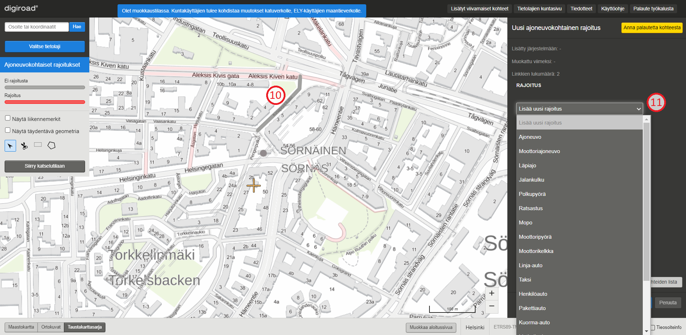

_Ajoneuvokohtaisen rajoituksen lis&auml;ys._

### Ajoneuvokohtaisen rajoituksen poistaminen

Ajoneuvokohtaisia rajoituksia voi poistaa valitsemalla kartalta rajoituksen, ja ruksimalla ominaisuustietoikkunasta rajoituksen pois (12). My&ouml;s rajoituksen ominaisuuksia eli voimassaoloaikaa ja poikkeuksia voi poistaa ominaisuustietoikkunan rukseista. (13) 

_Ajoneuvokohtaisen rajoituksen poistaminen._

### Useamman ajoneuvokohtaisen rajoituksen muokkaus monivalintaty&ouml;kalulla

Useamman kuin yhden tielinkin ajoneuvokohtaiset rajoitustiedot voi muuttaa kerralla. Halutut rajoitukset valitaan painamalla joko laatikko- (14) tai monikulmiovalintatyökalu (15) päälle. Laatikkovalintatyökalulla voi vetää laatikon, jota leikkaavat ja sen sisällä olevat rajoitukset tulevat valituiksi. Monikulmiovalintatyökalulla voi napauttelemalla luoda kulmia monikulmiolle ja kaksoisnapauttamalla lopettaa kulmion luomisen. Kaikki kulmiota leikkaavat ja sen sisällä olevat rajoitukset tulevat valituiksi. Valinnan j&auml;lkeen avautuu ikkuna (16), jossa valitaan ajoneuvokohtaisen rajoituksien tiedot ko. alueella ja valitut linkit ovat korostettuna kartalla (17). Peruuta-painikkeesta voi perua muutoksen.

Huom! Muutos kumoaa kaikki valitun alueen aiemmat ajoneuvokohtaisten rajoitusten tiedot. P&auml;&auml;llekk&auml;isi&auml; rajoituksia ei voi siis luoda.

_Useamman ajoneuvokohtaisen rajoituksen tietojen muokkaus kerralla._

### Ajoneuvokohtaisen rajoituksen katkaiseminen

Ajoneuvokohtaisen rajoituksen voi jakaa kahteen osaan leikkausty&ouml;kalulla (18). Leikkausty&ouml;kalulla napautetaan rajoituksen geometriasta kohtaa, josta se halutaan katkaista. Rajoituksen geometrian p&auml;&auml;ll&auml; ty&ouml;kalu n&auml;kyy ristin&auml;, jotta tarkka katkaisukohta on helppo m&auml;&auml;ritt&auml;&auml;. Katkaisu valitsee aina vain tielinkin mittaisen osion rajoitusta, ei koko ketjua.

Ajoneuvokohtaisen rajoituksen katkaisussa uusille rajoituksille valitaan arvot oikean laidan alasvetovalikoista (19). Kartalla ja alasvetovalikkojen vieress&auml; olevat kirjaimet osoittavat, kummasta rajoituksesta on kyse (20).

Huom! Katkaisussa tulee m&auml;&auml;ritt&auml;&auml; uusille kohteille eri arvot, jotta tallennus on mahdollista.

_Ajoneuvokohtaisen rajoituksen katkaiseminen._

### Ajoneuvokohtaisen rajoituksen muuttaminen yksisuuntaiseksi

Molempiin suuntiin voimassa olevan ajoneuvokohtaisen rajoituksen voi muuttaa yksisuuntaiseksi, jos kyseisell&auml; tielinkill&auml; liikennevirran suunta on molempiin suuntiin. Muutos tehd&auml;&auml;n siis tielinkkikohtaisesti.

Muutos tehd&auml;&auml;n kaksoisnapauttamalla kyseist&auml; ajoneuvokohtaista rajoitusta (21), jolloin oikeaan laitaan tulee painike "Jaa kaksisuuntaiseksi" (22).

_Ajoneuvokohtaisen rajoituksen valinta ja muuttaminen yksisuuntaiseksi._

Painikkeen painamisen j&auml;lkeen voi uusille ajoneuvokohtaisille rajoituksille antaa arvot alasvetovalikoista (23). Kirjaimet alasvetovalikkojen vieress&auml; vastaavat kohteita kartalla (24). 

_Uusien yksisuuntaisten ajoneuvokohtaisen rajoitusten arvojen valinta._

Uudet rajoitukset tallennetaan tallenna-painikkeesta. Jakamisen voi peruuttaa peruuta-painikkeella, jolloin alkuper&auml;inen rajoitus j&auml;&auml; voimaan.

# 10. Pysäköintikielto

Pysäköintikielto on viivamainen kohde. Pysäköintikielto voi olla tielinkin mittainen tai sitä lyhyempi viiva. Pysäköintikielto-tietolajin saa kartalle valitsemalla sen tietolajivalikosta (1). Kohteet tulevat näkyviin kartalle, kun zoomaa lähemmäksi. Jos tielinkille on ilmoitettu pysähtymiskielto, se piirtyy kartalle punaisella viivalla (2) tai jos sille on ilmoitettu pysäköintikielto, se piirtyy kartalle turkoosilla viivalla (3). Kiellottomat tielinkit ovat harmaita (4). Joissain tapauksissa pysäköintikiellot voivat muuttua kesken tielinkin tai pysäköintikieltoarvo on eri suuntiin kulkeville kaistoille eri. Tällöin pysäköintikiellot visualisoituvat ylläpitosovelluksessa ohuemmilla viivoilla tiegeometrian viereen.
Pysäköintikiellon muokkauksessa on mahdollisuus jakaa molempiin suuntiin voimassa oleva nopeusrajoitus yhteen suuntaan voimassa olevaksi.

*Pysäköintikielto-tietolaji*

## 10.1 Pysäköintikieltotietojen katselu

Kun kohdetta napauttaa kartalta, se korostuu (5). ja ominaisuustietoikkunaan tulee näkyviin sen tiedot (6). Kerran napauttamalla tulee valituksi koko pysäköintikieltoketju, eli kaikki linkit, joilla on sama pysäköintikieltotieto ja tiennumero (maantiellä) tai tiennimi (katuverkko ja yksityistie). Jos käyttäjä haluaa valita vain yhden linkin mittaisen pätkän tarkasteluun, sen voi tehdä kaksoisnapauttamalla linkkiä. Pysäköintikiellolla on: 
* ID
* lisätty järjestelmään ja muokattu viimeksi -tiedot
* tieto linkkien lukumäärästä pysäköintikieltoketjussa
* radionappi valinnalle ”Ei pysäköintikieltoa” ja ”Pysäköintikielto”, jonka valinnan jälkeen aktivoituu kaksi alasvetovalikkoa, joista ensimmäisestä voi valita joko ”Pysäköinti-” tai ”Pysähtyminen kielletty, ja toisesta voi valita voimassaoloajan. 
Myös kaksisuuntaiseksi jakamisen nappi aktivoituu.

*Pysäköintikieltotiedon katselu*

## 10.2 Pysäköintikieltotietojen muokkaus

Pysäköintikieltotietoja voi muokata muokkaustilassa. Pysäköintikiellon voi lisätä, poistaa ja pysäköintikieltogeometrian voi katkaista sekä muuttaa kaksisuuntaisiksi. Myös pysäköintikiellon tyyppiä ja aikaa voi muokata. Muutokset tallennetaan aina Tallenna-painikkeesta tai perutaan Peruuta-painikkeesta, jolloin alkuperäinen tieto jää voimaan.

### Pysäköintikieltotiedon lisäys

Uusi pysäköintikielto lisätään valitsemalla kartalta harmaa geometria ja valitsemalla oikean laidan ominaisuustietoikkunassa "Pysäköintikielto" (7). Tämän alta alasvetovalikosta (8) valitaan joko pysäköinti- tai pysähtymiskielto. Uusi pysäköintikieltotieto näkyy kartalla turkoosina ja pysähtymiskielto punaisena.

Pysäköintikiellon voi myös lisätä lisäämällä tielle liikennemerkin C37 tai C38 (pysäyttäminen tai pysäköinti kielletty). Tällöin kaikille linkeille, joilla on sama tiennumero (maantiellä) tai tiennimi (katuverkko ja yksityistie) generoituu seuraavan yön aikana automaattisesti pysäköintikieltotieto.

*Pysäköintikieltotiedon lisäys*

### Pysäköintikieltotiedon poistaminen

Pysäköintikieltotiedon voi poistaa valitsemalla valaistun kohteen ja oikean laidan ominaisuustietoikkunasta kohdan "Ei pysäköintikieltoa" (9) ja painamalla tallenna-painiketta. Kun pysäköintikieltotieto on poistettu, kohde muuttuu kartalla harmaaksi.

*Pysäköintikieltotiedon poistaminen*

### Pysäköintikiellon muokkaus monivalintatyökalulla

Usealle linkille voi lisätä tai poistaa pysäköintikiellon kerralla valitsemalla ctrl-näppäin pohjassa useamman tielinkin valintatyökalulla (10), jolloin ctrl-näppäimen irti päästämällä avautuu pysäköintikiellon muokkausikkuna. Toinen tapa on valita aluevalintatyökaluilla tielinkit käyttämällä joko laatikkotyökalua (11) tai monikulmiotyökalua (12). Laatikkotyökalua käytettäessä valinta päättyy, kun laatikon piirto on lukittu painamalla hiiren vasenta näppäintä. Monikulmiotyökalulla piirtäminen lopetetaan kaksoisnapauttamalla hiiren vasenta näppäintä. Valituksi tulevat kaikki linkit laatikon/monikulmion sisällä ja linkit, joita alueet leikkaavat. Valinnan jälkeen avautuu ikkuna, jossa pysäköintikieltotietoa voi muokata ja painetaan tallenna. Peruuta-painikkeesta voi perua muutoksen.

*Pysäköintikiellon monivalinta*

### Pysäköintikiellon katkaisu

Tarvittaessa pysäköintikiellon voi katkaista leikkaustyökalulla (13). Leikkaustyökalulla napautetaan kiellon geometriasta kohtaa, josta se halutaan katkaista. Kiellon geometrian päällä työkalu näkyy ristinä, jotta tarkka katkaisukohta on helppo määrittää. Kiellon katkaisu valitsee aina vain yhden tielinkin mittaisen osion kieltoa, ei kieltoketjua. Kiellon katkaisussa uusille kielloille valitaan arvot ominaisuustietoikkunassa (14). Kartalla ja valikkojen vieressä olevat kirjaimet osoittavat, kummasta rajoituksesta on kyse (15). Uudet pysäköintikieltotiedot tallennetaan tallenna-painikkeesta (16). Katkaisun voi peruuttaa peruuta-painikkeella (17), jolloin alkuperäinen rajoitus jää voimaan.
Huom! Pysäköintikiellon katkaisussa tulee määrittää uusille rajoituksille eri arvot, jotta tallennus on mahdollista.

*Pysäköintikiellon katkaisu*

### Pysäköintikiellon muuttaminen kaksisuuntaiseksi

Molempiin suuntiin voimassa olevan kiellon voi muuttaa kaksisuuntaiseksi, eli molempiin suuntiin eri arvoiksi, jos kyseisellä tielinkillä liikennevirran suunta on molempiin suuntiin. Muutos tehdään tielinkkikohtaisesti.

Muutos tehdään kaksoisnapauttamalla kyseistä kieltoa (18), jolloin oikeaan laitaan tulee painike "Jaa kaksisuuntaiseksi" (19). Jos napauttaa kiellotonta linkkiä ja tekee tämän kaksisuuntaiseksi jaon, muuttaa sovellus linkille vain pysähtymiskiellon. Kaksisuuntaiseksi jako tuleekin tehdä vain linkille, jolla on jo valmiiksi kielto.

*Pysäköintikiellon valinta ja muuttaminen kaksisuuntaiseksi*

Painikkeen painamisen jälkeen voi uusille kielloille antaa arvot alasvetovalikoista (20). A ja B -kirjaimet alasvetovalikkojen vieressä vastaavat kieltoja kartalla (21). Arvojen pitää erota toisistaan, jotta tallentaminen on mahdollista.

*Uusien kaksisuuntaisten pysäköintikieltojen arvon valinta*

Uudet kiellot tallennetaan tallenna-painikkeesta. Jakamisen voi peruuttaa peruuta-painikkeella, jolloin alkuperäinen kielto jää voimaan.
Jos tallennuksen jälkeen yhteen suuntaan voimassa oleville kielloille antaa saman arvon, sovellus yhdistää ne molempiin voimassa oleviksi.

# 11. VAK-rajoitus (Vaarallisten aineiden kuljetus)

Vaarallisten aineiden kuljetus –rajoitus eli VAK-rajoitukset ovat rajoituksia, jotka koskevat vain tiettyj&auml; ajoneuvoja. VAK-rajoituksessa voi olla my&ouml;s poikkeus, kuten kellonaika, jolloin rajoitus on voimassa. Karttaikkunaan voi valita VAK-rajoitukset valitsemalla tietolajivalikosta (1) VAK-rajoitus. Karttaa tarkennettaessa rajoitukset tulevat n&auml;kyviin. Tielinkit, joilla on VAK-rajoitus, on visualisoitu punaisella v&auml;rill&auml;.

_VAK-rajoituksen valinta._

## 11.1 VAK-rajoituksen tietojen katselu

Yksitt&auml;isen VAK-rajoituksen voi valita napauttamalla kartalta sen geometriaa. Kerran napauttamalla tulee valituksi koko rajoitusketju, eli osuus, jossa VAK-rajoituksella on samat tiedot ja sama tien nimi (katuverkko) tai tien numero (maantie). 

Jos k&auml;ytt&auml;j&auml; haluaa valita vain yhden linkin mittaisen p&auml;tk&auml;n tarkasteluun, sen voi tehd&auml; kaksoisnapauttamalla rajoitusta. Valitun rajoitusketjun tai yksitt&auml;isen rajoituksen geometria korostuu kartalla (2). Sivun oikeaan laitaan avautuu VAK-rajoituksen ominaisuustietoikkuna. Ominaisuustietoikkunassa on VAK-rajoituksen tiedot (3) kyseisell&auml; tielinkill&auml;/tielinkeill&auml;, valittujen linkkien lukum&auml;&auml;r&auml; sek&auml; lis&auml;tty j&auml;rjestelm&auml;&auml;n ja muokattu viimeksi -tiedot.

_VAK-rajoituksen tietojen katselu._

VAK-rajoitukset on visualisoitu eri tavoin riippuen vaikutussuunnasta. Rajoituksen vaikutussuunta voi olla molempiin suuntiin tai vain toiseen suuntaan.  Jos vaikutussuunta on molempiin suuntiin, rajoitus on visualisoitu yhdell&auml; paksulla viivalla. Yksisuuntainen vaikutus on visualisoitu ohuemmalla viivalla vaikutussuunnan mukaan tielinjan reunaan.

## 11.2 VAK-rajoituksen muokkaus

VAK-rajoituksille voi antaa muokkaustilassa tietoja. VAK-rajoituksia voi muokata kolmella tavalla:

1.	Koko VAK-rajoitusketjulle (esim. koko kadulle).
1.	Yksitt&auml;isen linkin mittaiselle osuudelle.
1.	Monivalinnan avulla kokonaiselle alueelle.

### VAK-rajoituksen muokkaus ja lis&auml;ys

Muokattava rajoitus valitaan napauttamalla sen geometriaa (4). Kerran napauttamalla tulee valituksi koko rajoitusketju, eli kaikki rajoitukset, joilla on samat arvot ja tiennumero (maantiell&auml;) tai tien nimi (katuverkko ja yksityistie). Jos k&auml;ytt&auml;j&auml; haluaa valita vain yhden linkin mittaisen p&auml;tk&auml;n tarkasteluun, sen voi tehd&auml; kaksoisnapauttamalla VAK-rajoitusta.

Tietoja muokataan ominaisuustietoikkunassa olevien alasvetovalikkojen avulla (5). VAK-rajoituksella voi olla my&ouml;s voimassaolokellonaika (6). Kellonaika ilmoitetaan samassa muodossa, mit&auml; se on maastossa olevassa lis&auml;kilvess&auml;.

_VAK-rajoituksen muokkaus._

Tielinkit, joilla ei ole VAK-rajoitusta on visualisoitu kartalle harmaalla v&auml;rill&auml;. Uusi VAK-rajoitus lis&auml;t&auml;&auml;n valitsemalla kartalta geometria, jolle se halutaan lis&auml;t&auml; (7). Valitsemalla alasvetovalikosta rajoituksen tyyppi (8), tulee t&auml;m&auml;n j&auml;lkeen n&auml;kyviin lis&auml;&auml; valikkoja voimassaolokellonajalle ja toiselle rajoitukselle.

VAK-rajoituksen voi myös lisätä lisäämällä tielle liikennemerkin C8 Vaarallisten aineiden kuljettaminen kielletty. Tällöin kaikille linkeille, joilla on sama tiennumero (maantiellä) tai tiennimi (katuverkko ja yksityistie) generoituu seuraavan yön aikana automaattisesti VAK-kieltotieto.

_VAK-rajoituksen lis&auml;ys_

### VAK-rajoituksen poistaminen

VAK-rajoituksia voi poistaa valitsemalla kartalta rajoituksen, ja ruksimalla ominaisuustietoikkunasta rajoituksen pois (9). My&ouml;s rajoituksen voimassaoloajan voi poistaa ominaisuustietoikkunan rukseista (10). Muutokset tallentuu tallenna-painikkeesta.

_VAK-rajoituksen poistaminen._

### Useamman VAK-rajoituksen muokkaus monivalintaty&ouml;kalulla

Useamman kuin yhden tielinkin VAK-rajoitustiedot voi muuttaa kerralla. Halutut tielinkit valitaan painamalla Ctrl-painike n&auml;pp&auml;imist&ouml;lt&auml; pohjaan ja napauttamalla hiiren vasemmalla painikkeella muokattavia tielinkkejä. Toinen vaihtoehto on käyttää työkalupalkin aluevalintatyökaluja (11), joita ovat monikulmio- ja laatikkotyökalut. Työkaluilla piirretään alue hiiren vasemmalla painikkeella. Valituksi tulevat kaikki tielinkit monikulmion/laatikon sis&auml;ll&auml; ja tielinkit, joita laatikko leikkaa. Valinnan j&auml;lkeen avautuu ikkuna (12), jossa valitaan VAK-rajoituksien tiedot ko. alueella ja valitut linkit ovat korostettuna kartalla (13). Peruuta-painikkeesta voi perua muutoksen.

Huom! Muutos kumoaa kaikki valitun alueen aiemmat VAK-rajoitusten tiedot. P&auml;&auml;llekk&auml;isi&auml; rajoituksia ei voi siis luoda.

_Useamman VAK-rajoituksen tietojen muokkaus kerralla._

### VAK-rajoituksen katkaiseminen

VAK-rajoituksen voi jakaa kahteen osaan leikkausty&ouml;kalulla (14). Leikkausty&ouml;kalulla napautetaan rajoituksen geometriasta kohtaa, josta se halutaan katkaista. Rajoituksen geometrian p&auml;&auml;ll&auml; ty&ouml;kalu n&auml;kyy ristin&auml;, jotta tarkka katkaisukohta on helppo m&auml;&auml;ritt&auml;&auml;. Katkaisu valitsee aina vain tielinkin mittaisen osion rajoitusta, ei koko ketjua.

VAK-rajoituksen katkaisussa uusille rajoituksille valitaan arvot oikean laidan alasvetovalikoista (15). Kartalla ja alasvetovalikkojen vieress&auml; olevat kirjaimet osoittavat, kummasta rajoituksesta on kyse (16). Muutokset tallennetaan tallenna-painikkeesta tai vastaavasti kumotaan peruuta-painikkeesta.

Huom! Katkaisussa tulee m&auml;&auml;ritt&auml;&auml; uusille kohteille eri arvot, jotta tallennus on mahdollista.

_VAK-rajoituksen katkaiseminen._

### VAK-rajoituksen muuttaminen yksisuuntaiseksi

Molempiin suuntiin voimassa olevan VAK-rajoituksen voi muuttaa yksisuuntaiseksi, jos kyseisell&auml; tielinkill&auml; liikennevirran suunta on molempiin suuntiin. Muutos tehd&auml;&auml;n siis tielinkkikohtaisesti. Muutos tehd&auml;&auml;n kaksoisnapauttamalla kyseist&auml; VAK-rajoitusta (17), jolloin oikeaan laitaan tulee painike "Jaa kaksisuuntaiseksi" (18).

_VAK-rajoituksen valinta ja muuttaminen yksisuuntaiseksi._

Painikkeen painamisen j&auml;lkeen voi uusille VAK-rajoituksille antaa arvot alasvetovalikoista (19). Kirjaimet kartalla vastaavat alasvetovalikkojen vieressä olevia kirjaimia (20).

_Uusien yksisuuntaisten VAK-rajoitusten arvojen valinta._

Uudet rajoitukset tallennetaan tallenna-painikkeesta. Jakamisen voi peruuttaa peruuta-painikkeella, jolloin alkuper&auml;inen rajoitus j&auml;&auml; voimaan.

# 12. Käpy tietolaji (ei vielä otettu ylläpidettäväksi)

Käpy tietolaji on useisiin väylätyyppeihin jakautunut viivamainen tietolaji, joka kuvaa onko tielinkeillä sallittu kävellä tai pyöräillä. Karttaikkunaan saa tietolajin näkyviin valitsemalla sen tietolajivalikosta (1). Karttaa tarkennettaessa tietolajia kuvaavat väylätyypit tulevat näkyviin eri väreillä.

_Käpy tietolajin valinta._

## 12.1 Käpy tietolajin tietojen katselu

Yksitt&auml;isen Käpy tietolajin kohteen voi valita napauttamalla kartalta sen geometriaa. Kerran napauttamalla tulee valituksi koko ketju, eli osuus, jossa linkeillä on samat käpy-väylätiedot ja sama tien nimi (katuverkko) tai tien numero (maantie). Karttaikkunan vasemman puolen tietolajipaneelin legendassa on eritelty kävelyyn ja pyöräilyyn liittyvät väylätyypit (2).

Jos käyttäjä haluaa valita vain yhden linkin mittaisen pätkän tarkasteluun, sen voi tehd&auml; kaksoisnapauttamalla geometriaa. Valitun ketjun tai yksitt&auml;isen käpykohteen geometria korostuu kartalla (3). Sivun oikeaan laitaan avautuu Käpy tietolajin ominaisuustietoikkuna. Ominaisuustietoikkunassa on Käpy tietolajin tiedot (4) kyseisell&auml; tielinkill&auml;/tielinkeill&auml; (ei/kyllä käpy tietolaji sekä väylätyypin tarkenne), valittujen linkkien lukum&auml;&auml;r&auml; sek&auml; lis&auml;tty j&auml;rjestelm&auml;&auml;n ja muokattu viimeksi -tiedot.

_Käpytietojen katselu._

Väylätyyppejä ja tarkennuksia:

* Pyöräily ja kävely kielletty
* Pyöräily kielletty
* Jalankulun ja pyöräilyn väylä (tyyppi tuntematon)
* Katu
  * Kunnan omistama katuverkko
* Maantie tai yksityistie
* Pyöräkatu
  * Pääasiassa pyöräilyn käyttöön tarkoitettu katu, jolla autot ovat väistämisvelvollisia pyöräilijään nähden
* Kylätie
  * Väylä, jolla on tiemerkinnällä tai muuten erotettu ajoradasta levennetty osa jalankulun ja pyöräilyn käyttöön
* Pihakatu
  * Jalankulkijalla on esteetön liikkumisoikeus ja väylä on sallittu ajoneuvoliikenteelle nopeusrajoitus 20 km/h
* Kävelykatu
  * Ensisijaisesti jalankulun käyttöön varattu alue, jolla suurin sallittu ajonopeus on 20 km/h
* Pyöräkaista
* Pyörätie
  * Pyörätie on lähtökohtaisesti yksisuuntainen
* Kaksisuuntainen pyörätie
* Yhdistetty pyörätie ja jalkakäytävä, yksisuuntainen pyörille
  * Väylätyypillä jalankulkijat ja pyöräilijät käyttävät samoja alueita ja väylä koostuu lähtökohtaisesti aina vain yhdestä kaistasta
  * Jos ajosuunnat on erotettu toisistaan keskiviivalla, väylälle voidaan lisätä kaksi kaistaa jotka kuvaavat ajosuuntia. Tällöin kuvataan rinnakkain kaksi vierekkäistä yhdistetty pyörätie ja jalkakäytävä kaistaa, joilla on eri suunta
* Yhdistetty pyörätie ja jalkakäytävä, kaksisuuntainen pyörille
* Puistokäytävä
  * Polkua hoidetumpi ja yleensä leveämpi puistokäytävä, joka on usein merkittävä osa jalankulun ja pyöräilyn verkkoa
* Jalkakäytävä
  * Jalankulkijoille tarkoitettu tien osa
  * jalkakäytävää ei ole aina merkitty erikseen, mutta pyörätie on. Siten merkitsemätön korotettu väylä katuverkolla on lähtökohtaisesti jalkakäytävä
  * Jalkakäytävällä ei ole suuntaa, ellei erityistapauksessa sitä ole erikseen osoitettu esimerkiksi tiemerkinnällä
* Pururata
  * Pururata muistuttaa puistokäytävää, mutta pyöräily on lähtökohtaisesti kielletty
* Ajopolku
  * Muu yksityis- tai metsätie, joka on jalankulun ja pyöräilyn käytössä ja on ajattavissa maastoajoneuvolla
* Polku
  * Kapeampi ja usein heikommin hoidettu väylä
  * "Maastoa"
* Lossi tai lautta

Käpy tietolajin kohteet on visualisoitu eri tavoin riippuen vaikutussuunnasta. Tieto voi olla suuntautunut väylällä molempiin suuntiin tai vain toiseen suuntaan.  Jos vaikutussuunta on molempiin suuntiin, väylätieto on visualisoitu yhdell&auml; paksulla viivalla. Yksisuuntainen vaikutus on visualisoitu ohuemmalla viivalla vaikutussuunnan mukaan tielinjan reunaan.

## 12.2 Käpy tietolajin muokkaus

Käpy tietolajin tietoja voi muokata muokkaustilassa kolmella tavalla:

1.	Koko Käpy tietolajin ketjulle (esim. koko kadulle).
2.	Yksitt&auml;isen linkin mittaiselle osuudelle.
3.	Monivalinnan avulla kokonaiselle alueelle.

### Käpy tietolajin muokkaus ja lis&auml;ys

Muokattava tielinkki valitaan napauttamalla sen geometriaa (5). Kerran napauttamalla tulee valituksi koko käpy-väyläketju, eli kaikki linkit, joilla on samat arvot ja tiennumero (maantiell&auml;) tai tien nimi (katuverkko ja yksityistie). Jos k&auml;ytt&auml;j&auml; haluaa valita vain yhden linkin mittaisen p&auml;tk&auml;n tarkasteluun, sen voi tehd&auml; kaksoisnapauttamalla tielinkkiä.

Tietoja muokataan ominaisuustietoikkunassa olevien valintojen avulla (6), joissa voi muokata tietoa siitä onko väylä käpy tietolajiin kuuluva vai ei (eli jalankulun ja pyöräilyn väylä). Lisäksi käpy-väylätyyppiä voi muuttaa tarvittaessa.

Tielinkit, jotka eivät ole Käpy tietolajiin kuuluvia on visualisoitu kartalle harmaalla v&auml;rill&auml;. Uusi käpy tietolajin kohde lis&auml;t&auml;&auml;n valitsemalla kartalta geometria, jolle se halutaan lis&auml;t&auml;. Sen jälkeen ominaisuustietoikkunassa valitaan radionapista väylä käpy tietolajiin kuuluvaksi sekä mahdollinen väylätyypin tarkennus.

_Käpy tietolajin muokkaus._

### Käpy tietolajin kohteen poistaminen

Käpy-kohteita voi poistaa valitsemalla kartalta kohteen, ja painamalla ominaisuustietoikkunan radionapista "ei käpy tietolaji" (7). Muutokset tallentuvat tallenna-painikkeesta ja peruuntuvat peruuta-painikkeesta (8).

_Käpy tietolajin kohteen poistaminen._

### Useamman Käpy-kohteen muokkaus monivalintaty&ouml;kalulla

Useamman kuin yhden tielinkin käpy-tiedot voi muuttaa kerralla. Halutut tielinkit valitaan painamalla Ctrl-painike n&auml;pp&auml;imist&ouml;lt&auml; pohjaan ja napauttamalla hiiren vasemmalla painikkeella muokattavia tielinkkejä. Toinen vaihtoehto on käyttää työkalupalkin aluevalintatyökaluja (9), joita ovat monikulmio- ja laatikkotyökalut. Työkaluilla piirretään alue hiiren vasemmalla painikkeella. Valituksi tulevat kaikki tielinkit monikulmion/laatikon sis&auml;ll&auml; ja tielinkit, joita laatikko leikkaa. Valinnan j&auml;lkeen avautuu ikkuna (10), jossa valitaan Käpy tietolajin tiedot ko. alueella ja valitut linkit ovat korostettuna kartalla. Peruuta-painikkeesta voi perua muutoksen.

Huom! Muutos kumoaa kaikki valitun alueen aiemmat Käpy tietolajin tiedot. P&auml;&auml;llekk&auml;isi&auml; tietoja ei voi siis luoda.

_Useamman Käpy-kohteen tietojen muokkaus kerralla._

### Käpy tietolajin kohteen katkaiseminen

Käpy tietolajin kohteen voi jakaa kahteen osaan leikkausty&ouml;kalulla (11). Leikkausty&ouml;kalulla napautetaan tiegeometriasta kohtaa, josta se halutaan katkaista. Käpy-kohteen geometrian p&auml;&auml;ll&auml; ty&ouml;kalu n&auml;kyy ristin&auml;, jotta tarkka katkaisukohta on helppo m&auml;&auml;ritt&auml;&auml;. Katkaisu valitsee aina vain tielinkin mittaisen käpy-kohteen, ei koko ketjua.

Käpy tietolajin kohteen katkaisussa uusille kohteille valitaan tiedot oikean laidan ominaisuustietovalikossa (12). Kartalla ja ominaisuustietoikkunassa olevat kirjaimet osoittavat, kummasta käpy-kohteesta on kyse (13). Muutokset tallennetaan tallenna-painikkeesta tai vastaavasti kumotaan peruuta-painikkeesta.

Huom! Katkaisussa tulee m&auml;&auml;ritt&auml;&auml; uusille kohteille eri arvot, jotta tallennus on mahdollista.

_Käpy tietolajin kohteen katkaiseminen._

## 12.3 Käpy tietolajin kohteen muuttaminen yksisuuntaiseksi

Molempiin suuntiin voimassa olevan Käpy-kohteen voi muuttaa yksisuuntaiseksi, jos kyseisell&auml; tielinkill&auml; liikennevirran suunta on molempiin suuntiin. Muutos tehd&auml;&auml;n siis tielinkkikohtaisesti. Muutos tehd&auml;&auml;n kaksoisnapauttamalla kyseist&auml; Käpy tietolajin kohdetta (14), jolloin oikeaan laitaan tulee painike "Jaa kaksisuuntaiseksi" (15).

_Käpy tietolajin kohteen valinta ja muuttaminen yksisuuntaiseksi._

Painikkeen painamisen j&auml;lkeen voi valita uusille Käpy-kohteille tietoja (16). Kirjaimet kartalla vastaavat ominaisuustietoikkunassa olevia kirjaimia (17).

_Uusien yksisuuntaisten Käpy tietolajikohteiden tietojen valinta._

Uudet tiedot tallennetaan tallenna-painikkeesta. Jakamisen voi peruuttaa peruuta-painikkeella, jolloin alkuper&auml;inen tieto j&auml;&auml; voimaan.

# 13. Suurin sallittu -tietolajit

Kartalle voi valita tietolajivalikosta (1) Suurin sallittu -tietolajeja. Suurin sallittu -arvon omaavat geometriat on visualisoitu punaisella v&auml;rill&auml; ja tielinkit, joilla suurinta sallittua arvoa ei ole, on visualisoitu harmaalla v&auml;rill&auml;.

Suurin sallittu -tietolajit (7 tietolajia):

* __Suurin sallittu massa__
* __Yhdistelm&auml;n suurin sallittu massa__
* __Suurin sallittu akselimassa__
* __Suurin sallittu telimassa__
* __Suurin sallittu korkeus__
* __Suurin sallittu pituus__
* __Suurin sallittu leveys__

_Suurin sallittu -valinta._

## 13.1 Suurin sallittu -tietojen katselu

Yksitt&auml;isen suurin sallittu -kohteen voi valita napauttamalla kartalta sen geometriaa (2). Kerran napauttamalla tulee valituksi koko rajoitusketju, eli kaikki rajoitukset, joilla on sama rajoituksen arvo ja tiennumero (maantiell&auml;) tai tien nimi (katuverkko ja yksityistie). Jos k&auml;ytt&auml;j&auml; haluaa valita vain yhden linkin mittaisen p&auml;tk&auml;n tarkasteluun, sen voi tehd&auml; kaksoisnapauttamalla rajoitusta. Geometria tummentuu ja muut geometriat n&auml;kyv&auml;t haaleammalla. Sivun oikeaan laitaan avautuu valitun rajoituksen tai rajoitusketjun ominaisuustietoikkuna (3).

_Suurin sallittu -katselutila._

## 13.2 Suurin sallittu -ominaisuustietojen muokkaus

Muokkaustilassa Suurin sallittu -rajoituksille voi antaa uusia arvoja ja niit&auml; voi katkaista. Rajoituksien arvoja voi muokata kolmella tavalla:
1.	Koko rajoitusketjulle kerralla.
2.	Yksitt&auml;isen linkin mittaiselle osuudelle.
3.	Monivalinnan avulla kokonaiselle alueelle.

### Rajoituksen arvon muokkaus

Suurin sallittu -valintaa muokataan muokkaustilassa. Muokattava kohde valitaan napauttamalla sen geometriaa (4). Kerran napauttamalla tulee valituksi koko rajoitusketju, eli kaikki per&auml;kk&auml;iset rajoitukset, joilla on sama arvo ja tiennumero (maantiell&auml;) tai tien nimi (katuverkko ja yksityistie). Jos käyttäjä haluaa valita vain yhden linkin mittaisen pätkän muokattavaksi, sen voi tehdä kaksoisnapauttamalla tielinkkiä. Tietoja muokataan ominaisuustietoikkunassa (5). Muutokset tallennetaan painamalla Tallenna-painiketta oikeasta alakulmasta (6). Ennen Tallenna-painikkeen painamista muutokset voi peruuttaa painamalla Peruuta-painiketta (7).

Tallenna- ja Peruuta -painikkeet eiv&auml;t ole aktiivisina, jos muutoksia ei ole tehty. Jos muutoksia on tehty eik&auml; niit&auml; ole tallennettu tai peruutettu ja siirryt&auml;&auml;n pois painorajoituksen valinnasta, sovellus antaa muutos-dialogin. Muutos-dialogi kertoo k&auml;ytt&auml;j&auml;lle, ett&auml; muutoksia on tehty ja ne tulee tallentaa tai peruuttaa ennen kuin voi jatkaa.

Huom! Rajoituksen arvokent&auml;ss&auml; muiden kuin numeroarvojen tallentaminen aiheuttaa virhetilanteita tallentuvissa rajoituksissa.

_Suurin sallittu -valinnan muokkaus._

### Suurin sallittu -kohteiden muokkaus monivalintatyökaluilla

Useamman kuin yhden rajoituksen arvon voi muuttaa kerralla. Halutut rajoitukset valitaan valitsemalla ctrl-näppäin pohjassa useamman tielinkin valintatyökalulla (8), jolloin ctrl-näppäimen irti päästämällä avautuu rajoituksen muokkausikkuna. Toinen tapa on valita aluevalintatyökaluilla tielinkit käyttämällä joko laatikkotyökalua (9) tai monikulmiotyökalua (10). Laatikkotyökalua käytettäessä valinta päättyy, kun laatikon piirto on lukittu painamalla hiiren vasenta näppäintä. Monikulmiotyökalulla piirtäminen lopetetaan kaksoisnapauttamalla hiiren vasenta näppäintä. Valituksi tulevat kaikki linkit laatikon/monikulmion sis&auml;ll&auml; ja linkit, joita alueet leikkaa. Valinnan j&auml;lkeen avautuu ikkuna, jossa valitaan rajoituksille tallentuva arvo ja painetaan tallenna. Peruuta-painikkeesta voi perua muutoksen.

_Useamman rajoituksen arvon muokkaus kerralla._

### Suurin sallittu -kohteen katkaisu

Rajoituksen voi jakaa kahteen osaan leikkausty&ouml;kalulla (11). Siten leikkausty&ouml;kalun avulla voi m&auml;&auml;ritell&auml; lyhyit&auml; rajoituksia poistamalla voimasta katkaisussa j&auml;ljelle j&auml;&auml;neit&auml; rajoituksia. Leikkausty&ouml;kalulla napautetaan rajoituksen geometriasta kohtaa, josta rajoitus halutaan katkaista. Rajoituksen geometrian p&auml;&auml;ll&auml; ty&ouml;kalu n&auml;kyy ristin&auml;, jotta tarkka katkaisukohta on helppo m&auml;&auml;ritt&auml;&auml; (12). 

Rajoituksen katkaisu valitsee aina vain linkin mittaisen osion rajoituksesta, ei koko rajoitusketjua.

_Suurin sallittu -kohteen katkaisu._

Katkaistun rajoituksen osista pidemm&auml;lle j&auml;&auml; alkuper&auml;isen ID, ja lyhyemm&auml;lle generoidaan uusi ID. Rajoituksen katkaisussa uusille rajoituksille valitaan arvot oikean laidan ominaisuustietoikkunasta (13). Kartalla ja valikkojen vieress&auml; olevat kirjaimet osoittavat, kummasta rajoituksesta on kyse (14). Uudet rajoitukset tallennetaan tallenna-painikkeesta (15). Katkaisun voi peruuttaa peruuta-painikkeella (16), jolloin alkuper&auml;inen rajoitus j&auml;&auml; voimaan.

Huom! Rajoituksen katkaisussa tulee m&auml;&auml;ritt&auml;&auml; uusille rajoituksille eri arvot, jotta tallennus on mahdollista.

_Suurin sallittu -kohteen katkaisu._

### Suurin sallittu -kohteen poistaminen

Tielinkin suurin sallittu -kohde poistetaan ominaisuustietoikkunassa (17) valitsemalla Rajoitus-kohdasta "Ei rajoitusta".

_Suurin sallittu -kohteen poistaminen._

### Uuden suurin sallittu -kohteen lis&auml;&auml;minen

Tielinkille voi lis&auml;t&auml; suurin sallittu -kohteen valitsemalla linkin geometrian (18) Suurin sallittu -muokkaustilassa. Ominaisuustietoikkunaan (19) avautuu tielinkin suurin sallittu -kohteen tiedot. Valitaan "Rajoitus" ja sy&ouml;tet&auml;&auml;n suurin sallittu arvo sy&ouml;tekentt&auml;&auml;n. Suurin sallittu arvo tallennetaan painamalla Tallenna (20). Uuden suurin sallittu -kohteen lis&auml;&auml;misen voi perua Peruuta-painikkeella (21).

_Suurin sallittu -kohteen lis&auml;&auml;minen._

# 14. Päällyste

"Päällyste" on viivamainen kohde, joka voi olla tielinkin mittainen tai sit&auml; lyhyempi viiva. Päällyste-tietolajin saa kartalle valitsemalla sen tietolajivalikosta (1). Kohteet tulevat n&auml;kyviin kartalle, kun zoomaa l&auml;hemm&auml;ksi. Jos tielinkille on ilmoitettu p&auml;&auml;llyste, se piirtyy kartalle (2). P&auml;&auml;llyst&auml;m&auml;tt&ouml;m&auml;ksi merkatut tielinkit ovat harmaita (3). P&auml;&auml;llystyksen mahdollisina arvoina on useita päällysteisiin viittaavia päällysteluokkia.
P&auml;&auml;llystetiedon l&auml;hde tielinkille on Maanmittauslaitoksen maastotietokanta.

_Päällystenäkymä._

## 14.1 P&auml;&auml;llystetietojen katselu

Kun kohdetta napauttaa kartalta, se korostuu (4). ja ominaisuustietoikkunaan tulee n&auml;kyviin sen tiedot (5). Kerran napauttamalla tulee valituksi koko p&auml;&auml;llysteketju, eli kaikki linkit, joilla on sama p&auml;&auml;llystetieto ja tiennumero (maantiell&auml;) tai tien nimi (katuverkko ja yksityistie). Jos k&auml;ytt&auml;j&auml; haluaa valita vain yhden linkin mittaisen p&auml;tk&auml;n tarkasteluun, sen voi tehd&auml; kaksoisnapauttamalla linkki&auml;. P&auml;&auml;llystyksell&auml; on ID, lis&auml;tty j&auml;rjestelm&auml;&auml;n ja muokattu viimeksi -tiedot sek&auml; p&auml;&auml;llystyksen arvo kyll&auml;/ei. Taulussa on myös tieto päällysteluokasta, jossa on useita mahdollisia vaihtoehtoja, sekä tieto linkkien lukum&auml;&auml;r&auml;st&auml; p&auml;&auml;llysteketjussa.

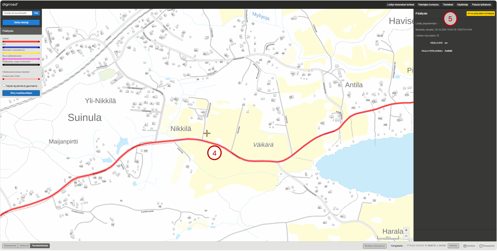

_P&auml;&auml;llystetiedon katselu._

## 14.2 P&auml;&auml;llystetietojen muokkaus

P&auml;&auml;llystetietoja voi muokata muokkaustilassa. P&auml;&auml;llystetiedon voi lis&auml;t&auml;, poistaa ja p&auml;&auml;llystegeometrian voi katkaista. Muutokset tallennetaan aina Tallenna-painikkeesta tai perutaan Peruuta-painikkeesta, jolloin alkuper&auml;inen tieto j&auml;&auml; voimaan.
P&auml;&auml;llysteen arvoa voi muokata kolmella tavalla:

1. Koko p&auml;&auml;llysteketjulle kerralla.
2. Yksitt&auml;isen linkin mittaiselle osuudelle.
3. Monivalinnan avulla kokonaiselle alueelle.

### P&auml;&auml;llystetiedon lis&auml;ys

Uusi p&auml;&auml;llystetieto lis&auml;t&auml;&auml;n valitsemalla kartalta geometria ja valitsemalla oikean laidan ominaisuustietoikkunassa "P&auml;&auml;llyste" sekä päällysteluokka (6). Uusi p&auml;&auml;llystystieto n&auml;kyy kartalla päällysteluokalle ominaisella värillä.

_P&auml;&auml;llystetiedon lis&auml;ys._

### P&auml;&auml;llystetiedon poistaminen

P&auml;&auml;llystetiedon voi poistaa valitsemalla p&auml;&auml;llystetyn kohteen ja oikean laidan ominaisuustietoikkunasta kohdan "Ei p&auml;&auml;llystett&auml;" (7). Kun p&auml;&auml;llystetieto on poistettu, kohde muuttuu kartalla harmaaksi.

_P&auml;&auml;llystetiedon poistaminen._

### P&auml;&auml;llystetiedon muokkaus monivalintaty&ouml;kalulla

Usealle linkille voi lis&auml;t&auml; tai poistaa p&auml;&auml;llystetiedon kerralla painamalla valintatyökalua (8) sekä pit&auml;m&auml;ll&auml; muokkaustilassa n&auml;pp&auml;imist&ouml;lt&auml; Ctrl-painiketta pohjassa valitsemalla useita tielinkkejä hiiren vasemmalla näppäimellä. Lisäksi on mahdollista käyttää laatikko- (9) ja monikulmiovalintatyökaluja (10). Valituksi tulevat kaikki linkit laatikon/monikulmion sis&auml;ll&auml; ja linkit, joita kuvio leikkaa. Valinnan j&auml;lkeen avautuu ikkuna, jossa valitaan p&auml;&auml;llysteen arvo sekä päällysteluokka ja painetaan tallenna. Peruuta-painikkeesta voi perua muutoksen.

_P&auml;&auml;llysteen monivalinta._

### P&auml;&auml;llysteen katkaisu

Tarvittaessa p&auml;&auml;llysteen voi katkaista leikkausty&ouml;kalulla (11). Leikkausty&ouml;kalulla napautetaan p&auml;&auml;llysteen geometriasta kohtaa, josta se halutaan katkaista. P&auml;&auml;llysteen geometrian p&auml;&auml;ll&auml; ty&ouml;kalu n&auml;kyy ristin&auml;, jotta tarkka katkaisukohta on helppo m&auml;&auml;ritt&auml;&auml;. P&auml;&auml;llysteen katkaisussa uusille tieosuuksille valitaan arvot oikean laidan ominaisuustietoikkunasta (12). Kartalla ja valikkojen vieress&auml; olevat kirjaimet osoittavat, kummasta geometriasta on kyse (13). Uudet p&auml;&auml;llystetiedot tallennetaan tallenna-painikkeesta (14). Katkaisun voi peruuttaa peruuta-painikkeella (15), jolloin alkuper&auml;inen p&auml;&auml;llystetieto j&auml;&auml; voimaan.

Huom! P&auml;&auml;llysteen katkaisussa tulee m&auml;&auml;ritt&auml;&auml; uusille geometrioille eri arvot, jotta tallennus on mahdollista.

_P&auml;&auml;llystegeometrian katkaisu._

# 15. Leveys

Kartalle voi valita tietolajivalikosta (1) Leveys-valinnan, joka kuvaa tien leveyttä. Karttaa tarkennettaessa geometriat paksuuntuvat, jotta niiden erottaminen on helpompaa. Tielinkit, joiden leveys tiedet&auml;&auml;n on visualisoitu punaisella v&auml;rill&auml; ja tielinkit, joiden leveys ei ole tiedossa, on visualisoitu harmaalla v&auml;rill&auml;. Tien leveys ilmoitetaan senttimetrein&auml; (cm).

_Leveys-valinta._

## 15.1 Leveyden katselu

Yksitt&auml;isen leveyskohteen voi valita napauttamalla kartalta sen geometriaa (2). Kerran napauttamalla tulee valituksi koko leveysketju, eli kaikki linkit, joilla on sama tien leveys ja tiennumero (maantiell&auml;) tai tien nimi (katuverkko ja yksityistie). Jos k&auml;ytt&auml;j&auml; haluaa valita vain yhden linkin mittaisen p&auml;tk&auml;n tarkasteluun, sen voi tehd&auml; kaksoisnapauttamalla tielinkki&auml;. Geometria tummentuu ja muut geometriat n&auml;kyv&auml;t haaleammalla. Sivun oikeaan laitaan avautuu valitun tielinkin tai linkkiketjun ominaisuustietoikkuna (3). Tien leveydell&auml; on ID, lis&auml;tty j&auml;rjestelm&auml;&auml;n ja muokattu viimeksi -tiedot sek&auml; tieto siitä, onko kohteessa leveys-arvoa ja tien leveyden arvo senttimetrein&auml;. Taulusta löytyy myös tieto linkkien lukum&auml;&auml;r&auml;st&auml; valittuna olevasta tielinkkiketjusta.

_Leveys-katselutila._

## 15.2 Leveyskohteiden muokkaus

Leveystietoja voi muokata muokkaustilassa. Muutokset tallennetaan aina Tallenna-painikkeesta tai perutaan Peruuta-painikkeesta, jolloin alkuper&auml;inen tieto j&auml;&auml; voimaan.
Muokkaustilassa leveydelle voi antaa uuden arvon (cm), tietoja voi poistaa sek&auml; leveysgeometrian voi katkaista. Tien leveyden arvoa voi muokata kolmella tavalla:

1. Koko leveysketjulle kerralla.
2. Yksitt&auml;isen linkin mittaiselle osuudelle.
3. Monivalinnan avulla kokonaiselle alueelle.

### Leveyden muokkaus

Leveysvalintaa muokataan muokkaustilassa. Muokattava kohde valitaan napauttamalla sen geometriaa (4). Kerran napauttamalla tulee valituksi koko leveysketju, eli kaikki per&auml;kk&auml;iset tielinkit, joilla on sama leveys ja tiennumero (maantiell&auml;) tai tien nimi (katuverkko ja yksityistie). Tietoja muokataan ominaisuustietoikkunassa (5). Muutokset tallennetaan painamalla Tallenna-painiketta oikeasta alakulmasta (6). Ennen Tallenna-painikkeen painamista muutokset voi peruuttaa painamalla Peruuta-painiketta (7). Tallenna- ja Peruuta -painikkeet eiv&auml;t ole aktiivisina, jos muutoksia ei ole tehty. Jos muutoksia on tehty eik&auml; niit&auml; ole tallennettu tai peruutettu ja siirryt&auml;&auml;n pois tielinkin valinnasta, sovellus antaa muutos-dialogin. Muutos-dialogi kertoo k&auml;ytt&auml;j&auml;lle, ett&auml; muutoksia on tehty ja ne tulee tallentaa tai peruuttaa ennen kuin voi jatkaa.

Huom! Leveyden arvokent&auml;ss&auml; muiden kuin numeroarvojen tallentaminen aiheuttaa virhetilanteita tallentuvissa tiedoissa.

_Leveyden muokkaus._

### Leveyden muokkaus monivalintaty&ouml;kalulla

Useamman kuin yhden tielinkin leveyden voi muuttaa kerralla. Halutut tielinkit valitaan valintatyökalulla (8) painamalla Ctrl-painike n&auml;pp&auml;imist&ouml;lt&auml; pohjaan ja napauttamalla hiiren vasemmalla näppäimellä halutut tielinkit. Vaihtoehtoisesti voi käyttää laatikko- (9) tai monikulmiovalintatyökaluja (10), joilla piirretään linkkien päälle valinta-alueet. Valituksi tulevat kaikki linkit laatikon sis&auml;ll&auml; ja linkit, joita laatikko leikkaa. Valinnan j&auml;lkeen avautuu ikkuna, jossa valitaan tien leveyden arvo ja painetaan tallenna. Peruuta-painikkeesta voi perua muutoksen.

_Useamman leveystiedon muokkaus kerralla._

### Leveyskohteen katkaisu

Leveyskohteen voi jakaa kahteen osaan leikkausty&ouml;kalulla (11). Siten leikkausty&ouml;kalun avulla voi muuttaa tien leveytt&auml; lyhyill&auml; tieosuuksilla. Leikkausty&ouml;kalulla napautetaan leveyden geometriasta kohtaa, josta leveystieto halutaan katkaista. Leveyden geometrian p&auml;&auml;ll&auml; ty&ouml;kalu n&auml;kyy ristin&auml;, jotta tarkka katkaisukohta on helppo m&auml;&auml;ritt&auml;&auml; (12).
Katkaisuty&ouml;kalu valitsee aina vain linkin mittaisen osion geometriasta, ei koko leveysketjua.

_Leveysgeometrian katkaisu._

Katkaistun leveystiedon osista pidemm&auml;lle j&auml;&auml; alkuper&auml;isen ID, ja lyhyemm&auml;lle generoidaan uusi ID. Geometrian katkaisussa uusille geometrioille m&auml;&auml;ritell&auml;&auml;n arvot oikean laidan ominaisuustietoikkunan kentiss&auml; (13). Kartalla ja valikkojen vieress&auml; olevat kirjaimet osoittavat, kummasta geometriasta on kyse (14). Uudet leveystiedot tallennetaan tallenna-painikkeesta (15). Katkaisun voi peruuttaa peruuta-painikkeella (16), jolloin alkuper&auml;inen tien leveys j&auml;&auml; voimaan.

Huom! Geometrian katkaisussa tulee m&auml;&auml;ritt&auml;&auml; uusille tieosuuksille eri arvot, jotta tallennus on mahdollista.

_Leveyskohteen katkaisu._

### Leveyskohteen poistaminen

Tielinkin leveyskohde poistetaan ominaisuustietoikkunassa (17) valitsemalla Leveys-kohdasta "Leveys ei tiedossa".

_Leveyskohteen poistaminen._

### Uuden leveyskohteen lis&auml;&auml;minen

Tielinkille voi lis&auml;t&auml; leveyskohteen valitsemalla linkin geometrian (18) leveyden muokkaustilassa. Ominaisuustietoikkunaan (19) avautuu tielinkin leveyden tiedot. Valitaan "Leveys tiedossa" ja sy&ouml;tet&auml;&auml;n leveys sy&ouml;tekentt&auml;&auml;n.  Leveys tallennetaan painamalla Tallenna (20). Uuden tien leveys -kohteen lis&auml;&auml;misen voi perua Peruuta-painikkeella (21).

_Leveyskohteen lis&auml;&auml;minen._

# 16. Valaistus

Valaistus on viivamainen kohde. Valaistus voi olla tielinkin mittainen tai sit&auml; lyhyempi viiva. Valaistus-tietolajin saa kartalle valitsemalla sen tietolajivalikosta (1). Kohteet tulevat n&auml;kyviin kartalle, kun zoomaa l&auml;hemm&auml;ksi. Jos tielinkille on ilmoitettu valaistus, se piirtyy kartalle punaisella viivalla (2). Valaisemattomat tielinkit ovat harmaita (3). Valaistuksen arvo on kyll&auml; tai ei. 

_Valaistus-tietolaji._

## 16.1 Valaistustietojen katselu

Kun kohdetta napauttaa kartalta, se korostuu (4). ja ominaisuustietoikkunaan tulee n&auml;kyviin sen tiedot (5). Kerran napauttamalla tulee valituksi koko valaistusketju, eli kaikki linkit, joilla on sama valaistustieto ja tiennumero (maantiell&auml;) tai tien nimi (katuverkko ja yksityistie). Jos k&auml;ytt&auml;j&auml; haluaa valita vain yhden linkin mittaisen p&auml;tk&auml;n tarkasteluun, sen voi tehd&auml; kaksoisnapauttamalla linkki&auml;. Valaistuksella on ID, lis&auml;tty j&auml;rjestelm&auml;&auml;n ja muokattu viimeksi -tiedot sek&auml; valaistuksen arvo kyll&auml;/ei, sek&auml; tieto linkkien lukum&auml;&auml;r&auml;st&auml; valaistusketjussa.

_Valaistustiedon katselu._

## 16.2 Valaistustietojen muokkaus

Valaistus-tietoja voi muokata muokkaustilassa. Valaistuksen voi lis&auml;t&auml;, poistaa ja valaistusgeometrian voi katkaista. Muutokset tallennetaan aina Tallenna-painikkeesta tai perutaan Peruuta-painikkeesta, jolloin alkuper&auml;inen tieto j&auml;&auml; voimaan.

### Valaistustiedon lis&auml;ys

Uusi valaistus lis&auml;t&auml;&auml;n valitsemalla kartalta harmaa geometria ja valitsemalla oikean laidan ominaisuustietoikkunassa "Valaistus" (6). Uusi valaistus-tieto n&auml;kyy kartalla punaisena.

_Valaistustiedon lis&auml;ys._

### Valaistustiedon poistaminen

Valaistustiedon voi poistaa valitsemalla valaistun kohteen ja oikean laidan ominaisuustietoikkunasta kohdan "Ei valaistusta" (7). Kun valaistustieto on poistettu, kohde muuttuu kartalla harmaaksi.

_Valaistustiedon poistaminen._

### Valaistuksen muokkaus monivalintaty&ouml;kalulla

Usealle linkille voi lisätä tai poistaa valaistuksen kerralla valitsemalla ctrl-näppäin pohjassa useamman tielinkin valintatyökalulla (8), jolloin ctrl-näppäimen irti päästämällä avautuu valaistuksen muokkausikkuna. Toinen tapa on valita aluevalintatyökaluilla tielinkit käyttämällä joko laatikkotyökalua (9) tai monikulmiotyökalua (10). Laatikkotyökalua käytettäessä valinta päättyy, kun laatikon piirto on lukittu napauttamalla hiiren vasenta näppäintä. Monikulmiotyökalulla piirtäminen lopetetaan kaksoisnapauttamalla hiiren vasenta näppäintä. Valituksi tulevat kaikki linkit laatikon/monikulmion sisällä ja linkit, joita alueet leikkaa. Valinnan jälkeen avautuu ikkuna, jossa valaistustietoa voi muokata ja painetaan tallenna. Peruuta-painikkeesta voi perua muutoksen.

_Valaistuksen monivalinta._

### Valaistuksen katkaisu

Tarvittaessa valaistuksen voi katkaista leikkausty&ouml;kalulla (11). Leikkausty&ouml;kalulla napautetaan valaistuksen geometriasta kohtaa, josta se halutaan katkaista. Valaistuksen geometrian p&auml;&auml;ll&auml; ty&ouml;kalu n&auml;kyy ristin&auml;, jotta tarkka katkaisukohta on helppo m&auml;&auml;ritt&auml;&auml;. Rajoituksen katkaisussa uusille rajoituksille valitaan arvot ominaisuustietoikkunassa (12). Kartalla ja valikkojen vieress&auml; olevat kirjaimet osoittavat, kummasta rajoituksesta on kyse (13). Uudet valaistustiedot tallennetaan tallenna-painikkeesta (14). Katkaisun voi peruuttaa peruuta-painikkeella (15), jolloin alkuper&auml;inen rajoitus j&auml;&auml; voimaan.

Huom! Valaistuksen katkaisussa tulee m&auml;&auml;ritt&auml;&auml; uusille rajoituksille eri arvot, jotta tallennus on mahdollista.

_Valaistusgeometrian katkaisu._

# 17. Kantavuus

Kantavuus-tietolajia ei ole vielä otettu käyttöön Digiroadissa.

Kantavuus on liikenneväylälle asetettu tieto tien suurimmasta kantavuudesta. Kantavuuksien lisäksi tietolajissa on kuvattu routivuuskerroin. Kantavuudet voi asettaa aktiiviseksi tasoksi tietolajivalikosta (1) ja kevätkantavuuden tai routivuuskertoimen voi asettaa visualisoitavaksi tietolajipaneelin radionapeista (2). Kartan eri mittakaavatasoilla kantavuuksien visualisointi muuttuu, jotta niiden erottaminen olisi helpompaa. Kantavuudet on visualisoitu eri v&auml;rein kantavuuden arvon mukaan. V&auml;rikoodien selitteet n&auml;kyv&auml;t sovelluksen vasemman reunan selitteessä tietolajipaneelissa.

_Kantavuuksien valinta._

## 17.1 Kantavuuksien tietojen katselu

Yksitt&auml;isen kantavuuden voi valita napauttamalla kartalta sen geometriaa.

Kerran napauttamalla tulee valituksi koko kantavuusketju, eli kaikki kantavuudet, joilla on sama kantavuuden arvo ja tienumero (maantiell&auml;) tai tiennimi (katuverkolla ja yksityisteillä). Jos käyttäjä haluaa valita vain yhden tielinkin tarkasteluun, voi sen tehdä kaksoisnapauttamalla kantavuuden geometriaa karttaikkunassa.

Valitun kantavuusketjun tai yksitt&auml;isen kantavuuden geometria korostuu kartalla ja karttaikkunan oikeaan laitaan avautuu kantavuuden ominaisuustietoikkuna. Ominaisuustietoikkuna sisältää tiedot kantavuustiedon lisäys- ja muokkauspäivämäärästä, valittujen linkkien lukumäärästä, tiedon siitä, onko kantavuutta vai ei, kevätkantavuuden arvon, routivuuskertoimen ja mittauspäivän. 

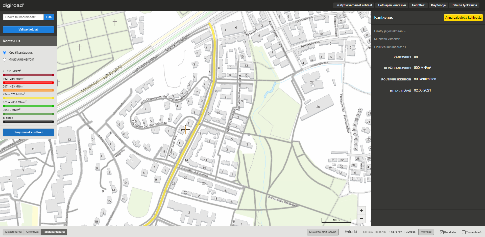

_Kantavuuden tietojen katselu, kun valittuna on kantavuusketju (napautettu kerran)._

_Kantavuuden tietojen katselu, kun valittuna on yksitt&auml;inen kantavuus (kaksoisnapautus)._

## 17.2 Kantavuuksien muokkaus

Muokkaustilassa kantavuuksille voi antaa uusia arvoja tai poistaa olemassaolevia. Kantavuuksien arvoja voi muokata kolmella tavalla:

1. Koko kantavuusketjulle.
1. Yksitt&auml;isen linkin mittaiselle osuudelle tai tielinkin osalle.
1. Monivalinnan avulla kokonaiselle alueelle.

### Kantavuuden arvon muokkaus

Muokattava kantavuus valitaan napauttamalla sen geometriaa (3). Kerran napauttamalla tulee valituksi koko kantavuusketju, eli kaikki kantavuudet, joilla on sama kantavuuden arvo sekä tienumero (maantiell&auml;) tai tiennimi (katuverkolla ja yksityistiellä). 

Jos k&auml;ytt&auml;j&auml; haluaa valita vain yhden linkin mittaisen p&auml;tk&auml;n tarkasteluun, voi sen tehd&auml; kaksoisnapauttamalla kantavuutta.

Tietoja muokataan ominaisuustietoikkunassa syöttämällä kantavuudelle uusi arvo ominaisuustietotaulun syötekenttään (4), valitsemalla routivuuskertoimelle uuden arvon alasvetovalikosta (5) ja/tai syöttämällä uusi arvo mittauspäivälle (6). Muutokset tulee tallentaa tai perua ennen kuin siirrytään muokkaamaan uutta kohdetta. Kantavuus tulee olla valittuna radionapeista (7), jotta arvoja voi syöttää ja muokata

_Kantavuusketjun arvon muokkaus (napautettu kerran)._

### Kantavuuksien muokkaus monivalintaty&ouml;kalulla

Usean tielinkin kantavuusarvon voi muuttaa kerralla monivalintatyökalulla, jota kuvaa Digiroad-sovelluksen työkaluvalikon suora- ja viisikulmiosymbolit (8). Monivalintatyökalun aktivoimisen jälkeen kartalle on mahdollista piirtää aluerajaus, jolloin valituksi tulevat kaikki kantavuudet piirretyn alueen sisällä ja kantavuudet, joita alue leikkaa. Valinnan jälkeen karttaikkunaan avautuu ikkuna (9), josta kantavuuksille määritellään uudet arvot. Muutokset tulee tallentaa tai perua ennen seuraavaan kohteeseen siirtymistä.

_Useamman kantavuuden arvon muokkaus kerralla._

### Kantavuuden katkaiseminen

Kantavuuden voi jakaa kahteen osaan leikkaus- eli saksityökalulla, joka löytyy työkaluvalikosta (10). Leikkaustyökalulla klikataan kantavuuden geometriasta kohtaa, josta kantavuus halutaan katkaista. Kantavuuden geometrian päällä työkalu näkyy ristinä, jotta tarkka katkaisukohta on helppo määrittää. Kantavuuden katkaisu valitsee aina vain yhden tielinkin mittaisen osion kantavuusta, ei kantavuusketjua.

_Kantavuuden katkaiseminen._

Kantavuuden katkaisussa tielinkin osille valitaan uudet kantavuusarvot sovelluksen oikean reunan ominaisuustietotaulusta (11). Kartalla ja alasvetovalikkojen vieress&auml; olevat kirjaimet A ja B (12) osoittavat, kummasta rajoituksesta on kyse. Uudet kantavuudet tallennetaan tallenna-painikkeella ja tai perutaan peruuta-painikkeella (13), jolloin alkuper&auml;inen rajoitus j&auml;&auml; voimaan.

Huom! Kantavuuden katkaisussa tulee m&auml;&auml;ritt&auml;&auml; kantavuuksille eri arvot, jotta tallennus on mahdollista.

# 18. Kelirikko

Kelirikko on viivamainen tietolaji, joka kuvaa kelirikon aikaisia rajoituksia ja tien alttiutta kelirikolle. Kelirikko voi olla tielinkin mittainen tai sitä lyhyempi. Kelirikko-tietolajin saa näkyviin kartalle valitsemalla sen aktiiviseksi tietolajivalikosta (1). Kohteet tulevat näkyviin kartalle, kun liikkuu kartalla lähemmäksi. Jos tielinkille on ilmoitettu kelirikko, joka on katseluhetkellä voimassa, se piirtyy kartalle punaisella viivalla. Siniset tielinkit puolestaan tarkoittavat, että tielle on määritelty kelirikkoaikainen rajoitus, mutta se ei ole katseluhetkellä voimassa. Tiet, joilla ei ole kelirikkoa ovat harmaita. Kelirikko voidaan ilmoittaa vuosittain tiettynä aikana toistuvasti voimassa olevaksi tai yleisenä tietona siitä, että tie on kelirikolle altis. Kelirikolle voidaan määritellä tietty painorajoitus.

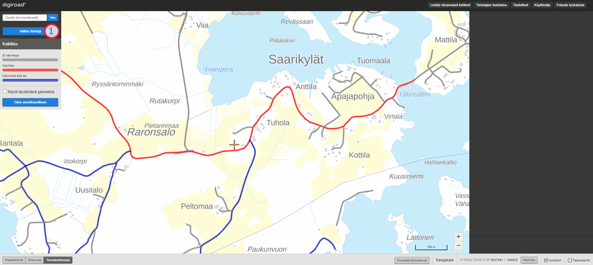

_Kelirikko._

## 18.1 Kelirikkotietojen katselu

Kun kelirikkokohdetta napauttaa kartalta, se korostuu (2) ja ominaisuustietoikkunaan avautuu kohteen tiedot. Kerran napauttamalla tulee valituksi koko kelirikkoketju, eli kaikki tielinkit, joilla on sama kelirikkotieto ja tienumero (maantiellä) tai tiennimi (katuverkolla ja yksityistiellä). Jos käyttäjä haluaa valita vain yhden tielinkin tarkasteluun, voi sen tehdä kaksoisnapauttamalla tielinkkiä. Kelirikon ominaisuustietoja ovat (3) kelirikon aikainen painorajoitus, kelirikkokausi, kelirikon toistuvuus vuosittain (kyllä/ei). Lisäksi ominaisuustietoikkunassa näkyy, milloin tieto on lisätty järjestelmään ja milloin sitä muokattu viimeksi, sekä tieto linkkien lukumäärästä kelirikkoketjussa (4).

_Kelirikkotiedon katselu._

## 18.2 Kelirikkotietojen muokkaus

Kelirikkotietoja voi muokata muokkaustilassa. Muutokset tallennetaan aina Tallenna-painikkeesta tai perutaan Peruuta-painikkeesta, jolloin alkuper&auml;inen tieto j&auml;&auml; voimaan.
Muokkaustilassa kelirikolle voi antaa uudet ominaisuustiedot ja niit&auml; voi katkaista saksi-työkalulla. Kelirikon arvoa voi muokata kolmella tavalla:

1. Koko kelirikkoketjulle kerralla.
2. Yksitt&auml;isen linkin mittaiselle osuudelle.
3. Monivalinnan avulla kokonaiselle alueelle.

_Kelirikkotiedon muokkaus._

### Kelirikkotiedon lis&auml;ys

Uusi kelirikkotieto lisätään järjestelmään asettamalla ensin tietolajivalikosta kelirikko-tietolaji aktiiviseksi. Tämän jälkeen tulee karttaikkunasta napauttaa tielinkin geometriaa, jolle kelirikkotieto halutaan lisätä. Karttaikkunan oikean reunan ominaisuustietoikkunaan tulee asettaa Kelirikko-radionappi aktiiviseksi (5), jonka jälkeen tarkentavia ominaisuustietoja kuten kelirikkoaikainen painorajoitus (6), kelirikkokausi (7) voidaan asettaa. Kelirikko voidaan kelirikkokauden avulla laittaa vuosittain toistuvaksi (8). Kelirikkotiedon pystyy tallentamaan myös ilman tarkentavia tietoja, jolloin tielle asetetaan yleinen kelirikkotieto eli tieto siitä, että tie on kelirikolle altis (10). Kelirikkotieto näkyy karttaikkunassa punaisena (9) silloin kuin kelirikko on katseluhetkellä voimassa ja sinisenä silloin, kun tiellä on kelirikko, mutta se ei ole katseluhetkellä voimassa tai tie on altis kelirikolle. Tiedot tallennetaan painamalla Tallenna-painiketta (11).

_Kelirikkotiedon lis&auml;ys._

### Kelirikkotiedon poistaminen

Kelirikkotiedon voi poistaa napauttamalla karttaikkunasta tielinkkiä, jolta kelirikko halutaan poistaa. Tällöin ruudun oikeaan reunaan avautuu kohteen ominaisuustietoikkuna, jossa radionappi "Ei kelirikkoa" (12) mahdollistaa kelirikkotiedon poistamisen kyseiseltä tielinkiltä tai linkkiketjulta. Muutos tulee tallentaa tai peruuttaa ennen uuden kohteen muokkaamista. Kun kelirikkotieto on poistettu, kohde muuttuu karttaikkunassa harmaaksi.

_Kelirikkotiedon poistaminen._

### Kelirikkojen muokkaus monivalintaty&ouml;kalulla

Kelirikkotietoa voi muokata tai asettaa useammalle tielinkille kerralla. Tielinkit, joille kelirikkotieto halutaan asettaa, valitaan napauttamalla niitä ctrl-näppäin pohjassa, jolloin ctrl-näppäimen irti päästämällä avautuu kelirikon muokkausikkuna. Toinen tapa on valita aluevalintatyökaluilla tielinkit käyttämällä joko laatikkotyökalua tai monikulmiotyökalua (13). Laatikkotyökalua käytettäessä valinta päättyy, kun laatikon piirto on lukittu painamalla hiiren vasenta näppäintä. Monikulmiotyökalulla piirtäminen lopetetaan kaksoisnapauttamalla hiiren vasenta näppäintä. Valituksi tulevat kaikki tielinkit laatikon tai monikulmion sisällä ja linkit, joita alueet leikkaavat. Valinnan jälkeen karttaikkunaan avautuu ikkuna (14), jossa määritellään kelirikon ominaisuustiedot. Muutokset tulee tallentaa tai perua ennen seuraavaan kohteeseen siirtymistä.

_Kelirikon monivalinta._

### Kelirikkotiedon katkaisu

Tarvittaessa kelirikon voi katkaista leikkaustyökalulla. Leikkaustyökalulla napautetaan kelirikon geometriasta kohtaa, josta se halutaan katkaista (15). Kelirikon tiegeometrian päällä työkalu näkyy ristinä, jotta tarkka katkaisukohta on helppo määrittää. Kelirikon katkaisussa uusille geometrioille asetetaan uudet ominaisuustiedot karttaikkunan oikean reunan ominaisuustietoikkunasta (16). Kartalla ja valikkojen vieressä olevat A ja B kirjaimet osoittavat, kummasta geometriasta on kyse. Uudet kelirikkotiedot tallennetaan tallenna-painikkeesta. Katkaisun voi peruuttaa peruuta-painikkeella, jolloin alkuperäinen tieto jää voimaan. Katkaisutyökalu valitsee aina vain yhden linkin mittaisen osion geometriasta, ei koko kelirikkoketjua.

Huom! Kelirikon katkaisussa tulee m&auml;&auml;ritt&auml;&auml; uusille geometrioille eri arvot, jotta tallennus on mahdollista.

_Kelirikkogeometrian katkaisu._

# 19. Tietyöt

Tietyöt on viivamainen tietolaji, joka kuvaa tieverkkojen kohteita, joilla suoritetaan tietöitä. Tietyö voi olla tielinkin mittainen tai sitä lyhyempi. Tietyö-tietolajin saa näkyviin kartalle valitsemalla sen aktiiviseksi tietolajivalikosta (1). Kohteet tulevat näkyviin kartalle, kun liikkuu kartalla lähemmäksi. Jos tielinkille on ilmoitettu tietyö, joka on katseluhetkellä voimassa, se piirtyy kartalle punaisella viivalla. Siniset tielinkit puolestaan tarkoittavat, että tielle on määritelty tuleva tai mennyt tietyö. Tiet, joilla ei ole tietyötä ovat harmaita. Tietyölle voidaan asettaa myös työn yksilöivä tunnus.

_Tietyö._

## 19.1 Tietyötietojen katselu

Kun tietyökohdetta napauttaa kartalta, se korostuu (2) ja ominaisuustietoikkunaan avautuu kohteen tiedot. Kerran napauttamalla tulee valituksi koko tietyöketju, eli kaikki tielinkit, joilla on sama tietyötieto ja tienumero (maantiellä) tai tiennimi (katuverkolla ja yksityistiellä). Jos käyttäjä haluaa valita vain yhden tielinkin tarkasteluun, voi sen tehdä kaksoisnapauttamalla tielinkkiä. Tietyön ominaisuustietoja ovat (3) tietyö (on/ei vaihtoehdot), työn tunnus sekä tietyön arvioitu kesto. Lisäksi ominaisuustietoikkunassa näkyy, milloin tieto on lisätty järjestelmään ja milloin sitä muokattu viimeksi sekä tieto linkkien lukumäärästä tietyöketjussa (4).

_Tietyötietojen katselu._

## 19.2 Tietyötietojen muokkaus ja lisäys

Tietyön tietoja voi muokata muokkaustilassa. Muutokset tallennetaan aina Tallenna-painikkeesta tai perutaan Peruuta-painikkeesta, jolloin alkuper&auml;inen tieto j&auml;&auml; voimaan.
Muokkaustilassa tietyölle voi antaa uudet ominaisuustiedot ja niit&auml; voi katkaista leikkaustyökalulla. Tietyön arvoa voi muokata kolmella tavalla:

1. Koko tietyöketjulle kerralla.
2. Yksitt&auml;isen linkin mittaiselle osuudelle.
3. Monivalinnan avulla kokonaiselle alueelle.

### Tietyötiedon lis&auml;ys

Uusi tietyötieto lisätään järjestelmään asettamalla ensin tietolajivalikosta tietyö-tietolaji aktiiviseksi. Tämän jälkeen tulee karttaikkunasta napauttaa tielinkin geometriaa, jolle tietyötieto halutaan lisätä. Karttaikkunan oikean reunan ominaisuustietoikkunaan tulee asettaa Tietyö-radionappi aktiiviseksi (5), jonka jälkeen tarkentavia ominaisuustietoja kuten työn tunnus (6) ja arvioitu kesto (7) voidaan asettaa. Tietyölle pakollinen tieto on sen kesto eli arvioitu alkamis- ja päättymispäivämäärä. Valinnaisena lisätietona tietyölle voi asettaa työn tunnuksen. Tietyötieto näkyy karttaikkunassa punaisena silloin kuin tietyö on katseluhetkellä voimassa ja sinisenä (8) silloin, kun tielle on tulossa tietyö tai se on päättynyt. Tiedot tallennetaan painamalla Tallenna-painiketta (9).

Tietyötiedon voi myös lisätä lisäämällä tielle liikennemerkin A11 Tietyö, ja kirjaamalla merkille alku- ja loppupäivämäärän. Tällöin kaikille linkeille, joilla on sama tiennumero (maantiellä) tai tiennimi (katuverkko ja yksityistie) generoituu seuraavan yön aikana automaattisesti tietyötieto.

_Tietyötiedon lis&auml;ys._

### Tietyötietojen poistaminen

Tietyötiedon voi poistaa napauttamalla karttaikkunasta tielinkkiä, jolta tietyö halutaan poistaa. Tällöin ruudun oikeaan reunaan avautuu kohteen ominaisuustietoikkuna, jossa radionappi "Ei tietyötä" (10) mahdollistaa tietyötietojen poistamisen kyseiseltä tielinkiltä tai linkkiketjulta. Muutos tulee tallentaa tai peruuttaa ennen uuden kohteen muokkaamista. Kun tietyötieto on poistettu, kohde muuttuu karttaikkunassa harmaaksi.

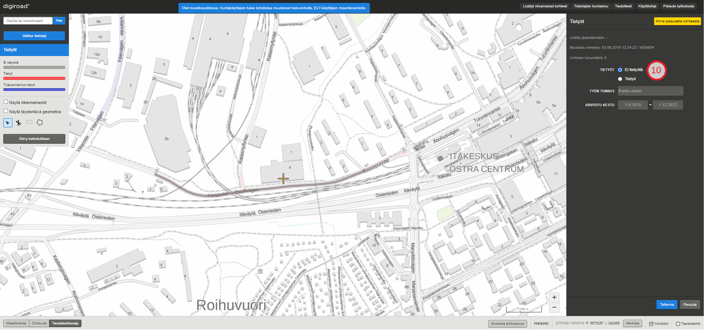

_Tietyötiedon poistaminen._

### Tietyötietojen muokkaus monivalintaty&ouml;kalulla

Tietyötietoa voi muokata tai asettaa useammalle tielinkille kerralla. Tielinkit, joille tietyötieto halutaan asettaa, valitaan napauttamalla niitä ctrl-näppäin pohjassa, jolloin ctrl-näppäimen irti päästämällä avautuu tietyön muokkausikkuna. Toinen tapa on valita aluevalintatyökaluilla tielinkit käyttämällä joko laatikkotyökalua tai monikulmiotyökalua (11). Laatikkotyökalua käytettäessä valinta päättyy, kun laatikon piirto on lukittu painamalla hiiren vasenta näppäintä. Monikulmiotyökalulla piirtäminen lopetetaan kaksoisnapauttamalla hiiren vasenta näppäintä. Valituksi tulevat kaikki tielinkit laatikon tai monikulmion sisällä ja linkit, joita alueet leikkaavat. Valinnan jälkeen karttaikkunaan avautuu ikkuna (12), jossa määritellään tietyön ominaisuustiedot. Muutokset tulee tallentaa tai perua ennen seuraavaan kohteeseen siirtymistä.

_Tietyön monivalinta._

### Tietyötiedon katkaisu

Tarvittaessa tietyön voi katkaista leikkaustyökalulla. Leikkaustyökalulla napautetaan tietyön geometriasta kohtaa, josta se halutaan katkaista (13). Tietyön tiegeometrian päällä työkalu näkyy ristinä, jotta tarkka katkaisukohta on helppo määrittää. Tietyön katkaisussa uusille geometrioille asetetaan uudet ominaisuustiedot karttaikkunan oikean reunan ominaisuustietoikkunasta (14). Kartalla ja valikkojen vieressä olevat A ja B kirjaimet osoittavat, kummasta geometriasta on kyse. Uudet tietyötiedot tallennetaan tallenna-painikkeesta. Katkaisun voi peruuttaa peruuta-painikkeella, jolloin alkuperäinen tieto jää voimaan. Katkaisutyökalu valitsee aina vain yhden linkin mittaisen osion geometriasta, ei koko tietyöketjua.

Huom! Tietyön katkaisussa tulee m&auml;&auml;ritt&auml;&auml; uusille geometrioille eri arvot, jotta tallennus on mahdollista.

_Tietyögeometrian katkaisu._

# 20. Eurooppatienumero

Eurooppatien numerot kattavat maantiet ja muutaman kaupungin kadut. Eurooppatienumerot merkitään vain numerolla (ei lisätä E-kirjainta). Karttaikkunaan voi valita eurooppatienumerot tietolajivalikosta (1). Karttaa tarkennettaessa kohteet tulevat n&auml;kyviin. Punaisella v&auml;rill&auml; on visualisoitu ne tielinkit, joilla on eurooppatienumero.
 

_Eurooppatienumeroiden valinta._

## 20.1 Eurooppatienumeron tietojen katselu

Eurooppatienumeron voi valita napauttamalla kartalta sen geometriaa.

Kerran napauttamalla tulee valituksi koko ketju, eli osuus, jossa eurooppatienumerolla on samat tiedot ja sama tien nimi (katuverkko) tai tien numero (maantie). 

Jos k&auml;ytt&auml;j&auml; haluaa valita vain yhden linkin mittaisen p&auml;tk&auml;n tarkasteluun, sen voi tehd&auml; kaksoisnapauttamalla eurooppatienumerollista tielinkki&auml;. Valitun ketjun tai yksitt&auml;isen tielinkin mittainen osuus geometriasta korostuu kartalla. Sivun oikeaan laitaan avautuu eurooppatienumeron ominaisuustietoikkuna.

Ominaisuustietoikkunassa on eurooppatienumeron tiedot kyseisell&auml; tielinkill&auml;/tielinkeill&auml;, valittujen linkkien lukum&auml;&auml;r&auml; sek&auml; lis&auml;tty j&auml;rjestelm&auml;&auml;n ja muokattu viimeksi -tiedot.

_Eurooppatienumeron tietojen katselu._

## 20.2 Eurooppatienumeron muokkaus

Eurooppatienumero viivageometrialle voi antaa muokkaustilassa tietoja. Eurooppatienumeroa voi muokata kolmella tavalla:

1.	Koko eurooppatienumeroketjulle
2.	Yksitt&auml;isen linkin mittaiselle osuudelle
3.	Laatikko- tai monikulmiovalintatyökalun avulla kokonaiselle alueelle.

Jos samalla tielinkill&auml; on kaksi eurooppatienumeroa, ne erotetaan lis&auml;&auml;m&auml;ll&auml; pilkku ja väli syötekentt&auml;&auml;n numeroiden välille, esimerkiksi 4, 8

### Eurooppatienumeron muokkaus ja lis&auml;ys

Muokattava kohde valitaan napauttamalla sen geometriaa. Kerran napauttamalla tulee valituksi koko tielinkkiketju, joilla on samat arvot ja tiennumero (maantiell&auml;) tai tien nimi (katuverkko ja yksityistie).  Jos k&auml;ytt&auml;j&auml; haluaa valita vain yhden linkin mittaisen p&auml;tk&auml;n tarkasteluun, sen voi tehd&auml; kaksoisnapauttamalla kohdetta. Syötekentt&auml;&auml;n voidaan p&auml;ivitt&auml;&auml; eurooppatienumero (2).

Tielinkit, joilla ei ole eurooppatienumeroa on visualisoitu kartalle harmaalla v&auml;rill&auml;. Uusi eurooppatienumero lis&auml;t&auml;&auml;n valitsemalla kartalta geometria, jolle se halutaan lis&auml;t&auml;. Radionapista (3) valitaan eurooppatienumero ja syötekentt&auml;&auml;n (2) kirjoitetaan eurooppatien numero.
 

_Eurooppatienumeroiden muokkaus._

### Eurooppatienumeron poistaminen

Eurooppatienumeron voi poistaa valitsemalla kartalta halutun viivan, ja valitsemalla radionapeista (3) ei eurooppatienumeroa. Muutokset tallentuu tallenna-painikkeesta (4) tai ne voi kumota peruuta-painikkeesta (5).

### Useamman eurooppatienumero muokkaus monivalintaty&ouml;kalulla

Useamman kuin yhden tielinkin eurooppatienumeron voi muuttaa kerralla. Halutut tielinkit valitaan painamalla joko laatikko- (6) tai monikulmiovalintatyökalu (7) päälle. Laatikkovalintatyökalulla voi vetää laatikon, jota leikkaavat ja sen sisällä olevat linkit tulevat valituiksi. Monikulmiovalintatyökalulla voi napsauttelemalla luoda kulmia monikulmiolle ja kaksoisnapauttamalla lopettaa kulmion luomisen. Kaikki kulmiota leikkaavat ja sen sisällä olevat linkit tulevat valituiksi. Valinnan j&auml;lkeen avautuu ikkuna (8), jossa kirjataan eurooppatienumero ko. viivoille (9). Muutos tallennetaan tai peruuta-painikkeesta voi kumota muutoksen.

Huom! Muutos kumoaa kaikki valitun alueen aiemmat eurooppatienumerotiedot. P&auml;&auml;llekk&auml;isi&auml; kohteita ei voi siis luoda.

_Useamman eurooppatienumeron tietojen muokkaus kerralla._

### Eurooppatienumeron katkaiseminen

Eurooppatienumeron geometrian voi jakaa kahteen osaan leikkausty&ouml;kalulla (10). Leikkausty&ouml;kalulla napautetaan eurooppatienumeron geometriasta kohtaa, josta se halutaan katkaista. Kohteen geometrian p&auml;&auml;ll&auml; ty&ouml;kalu n&auml;kyy ristin&auml;, jotta tarkka katkaisukohta on helppo m&auml;&auml;ritt&auml;&auml;. Katkaisu valitsee aina vain tielinkin mittaisen osion, ei koko ketjua.

Eurooppatienumeron katkaisussa uusille kohteille valitaan arvot oikean laidan radionapeista (11). Kartalla ja alasvetovalikkojen vieress&auml; olevat kirjaimet osoittavat, kummasta kohteesta on kyse (12). Muutokset tallennetaan tallenna-painikkeesta tai vastaavasti kumotaan peruuta-painikkeesta.

Huom! Katkaisussa tulee m&auml;&auml;ritt&auml;&auml; uusille kohteille eri arvot, jotta tallennus on mahdollista.

_Eurooppatienumeron katkaiseminen._

# 21. Liittymänumero

Liittym&auml;numeroilla tarkoitetaan numeroituja moottoriteiden eritasoliittymi&auml;. Liittym&auml;numerot annetaan Digiroadissa rampeille. Karttaikkunaan voi valita liittym&auml;numerot tietolajivalikosta (1). Kohteet tulevat n&auml;kyviin kartalle, kun zoomaa l&auml;hemm&auml;ksi. Punaisella v&auml;rill&auml; on visualisoitu ne tielinkit, joilla on liittym&auml;numerot.
 

_Liittym&auml;numeron valinta._

## 21.1 Liittym&auml;numeron tietojen katselu

Liittym&auml;numeron voi valita napauttamalla kartalta sen geometriaa. Kerran napauttamalla tulee valituksi koko liittym&auml;numeroketju, eli osuus, jossa liittym&auml;numerolla on samat tiedot ja sama tien nimi (katuverkko) tai tien numero (maantie). Jos k&auml;ytt&auml;j&auml; haluaa valita vain yhden linkin mittaisen p&auml;tk&auml;n tarkasteluun, sen voi tehd&auml; kaksoisnapauttamalla liittym&auml;numerollista tielinkki&auml;. Valitun tielinkkiketjun tai yksitt&auml;isen kohteen geometria korostuu kartalla. Sivun oikeaan laitaan avautuu liittym&auml;numeron ominaisuustietoikkuna.

Ominaisuustietoikkunassa on kohteen ID, liittym&auml;numeron tiedot kyseisell&auml; tielinkill&auml;/tielinkeill&auml;, valittujen linkkien lukum&auml;&auml;r&auml; sek&auml; lis&auml;tty j&auml;rjestelm&auml;&auml;n ja muokattu viimeksi -tiedot.

_Liittym&auml;numeron tietojen katselu._

## 21.2 Liittym&auml;numeron muokkaus

Liittym&auml;numeron viivageometrialle voi antaa muokkaustilassa tietoja. Liittym&auml;numeroa voi muokata kolmella tavalla:

1.	Koko liittym&auml;numeroketjulle
2.	Yksitt&auml;isen linkin mittaiselle osuudelle
3.	Monivalinnan avulla kokonaiselle alueelle (ei yleens&auml; tarpeen t&auml;ss&auml; tietolajissa).

### Liittym&auml;numeron muokkaus ja lis&auml;ys

Muokattava tielinkki valitaan napauttamalla sen geometriaa. Kerran napauttamalla tulee valituksi koko tielinkkiketju, joilla on samat arvot ja tiennumero (maantiell&auml;) tai tien nimi (katuverkko ja yksityistie).  Jos k&auml;ytt&auml;j&auml; haluaa valita vain yhden linkin mittaisen p&auml;tk&auml;n tarkasteluun, sen voi tehd&auml; tuplanapauttamalla kohdetta. Syötekenttään voidaan p&auml;ivitt&auml;&auml; liittym&auml;numero (2).

Tielinkit, joilla ei ole liittym&auml;numeroa on visualisoitu kartalle harmaalla v&auml;rill&auml;. Uusi liittym&auml;numero lis&auml;t&auml;&auml;n valitsemalla kartalta geometria, jolle se halutaan lis&auml;t&auml;. Radionapista (3) valitaan liittym&auml;numero(t) ja syötekenttään (2) kirjoitetaan liittym&auml;n numero. Yhdell&auml; tielinkill&auml; on yleens&auml; yksi liittym&auml;numero, mutta niit&auml; voi olla my&ouml;s kaksi tai useampi. Ne eritell&auml;&auml;n pilkulla ja välilyönnillä syötekentässä (2).

_Liittym&auml;numeron muokkaus._

### Liittym&auml;numeron poistaminen

Liittym&auml;numeron voi poistaa valitsemalla kartalta halutun viivan, ja valitsemalla radionapeista (3) ei liittym&auml;numeroa. Muutokset tallentuu tallenna-painikkeesta (4) tai ne voi kumota peruuta-painikkeesta (5). Siirry katselutilaan –painikkeesta (6) p&auml;&auml;see pois muokkaustilasta.

### Useamman liittym&auml;numeron muokkaus monivalintaty&ouml;kalulla

Useamman kuin yhden tielinkin liittym&auml;numeron voi muuttaa kerralla. Halutut tielinkit valitaan painamalla Ctrl-painike n&auml;pp&auml;imist&ouml;lt&auml; pohjaan ja napauttamalla hiiren vasemmalla painikkeella valittavia tielinkkejä. Toinen tapa on käyttää muokkaustilan työkalupalkin (7) monikulmio- ja laatikkovalintatyökaluja. Valituksi tulevat kaikki tielinkit laatikon/monikulmion sis&auml;ll&auml; ja tielinkit, joita laatikko/monikulmio leikkaa. Valinnan j&auml;lkeen avautuu ikkuna (8), jossa kirjataan liittym&auml;numero ko. viivoille (9). Muutos tallennetaan tai peruuta-painikkeesta voi kumota muutoksen.

Huom! Muutos kumoaa kaikki valitun alueen aiempien liittym&auml;numeroiden tiedot. P&auml;&auml;llekk&auml;isi&auml; kohteita ei voi siis luoda.
 

_Useamman liittym&auml;numeron tietojen muokkaus kerralla._

### Liittym&auml;numeron katkaiseminen

Liittym&auml;numeron voi jakaa kahteen osaan leikkausty&ouml;kalulla (10). Leikkausty&ouml;kalulla napautetaan kohteen geometriasta kohtaa, josta se halutaan katkaista. Liittym&auml;numeron geometrian p&auml;&auml;ll&auml; ty&ouml;kalu n&auml;kyy ristin&auml;, jotta tarkka katkaisukohta on helppo m&auml;&auml;ritt&auml;&auml;. Katkaisu valitsee aina vain tielinkin mittaisen osion, ei koko ketjua.

Liittym&auml;numeron katkaisussa kohteille valitaan arvot oikean laidan radionapeista (11). Kartalla ja alasvetovalikkojen vieress&auml; olevat kirjaimet osoittavat, kummasta kohteesta on kyse (12). Muutokset tallennetaan tallenna-painikkeesta tai vastaavasti kumotaan peruuta-painikkeesta.

Huom! Katkaisussa tulee m&auml;&auml;ritt&auml;&auml; uusille kohteille eri arvot, jotta tallennus on mahdollista.

_Liittym&auml;numeron katkaiseminen._

# 22. Hoitoluokat

Hoitoluokat on viivamainen tietolaji, joka jakautuu kahteen hoitoluokkaan: talvihoitoluokkaan ja viherhoitoluokkaan. Talvihoitoluokka kuvaa hoidon tarpeen tasoa talvella sekä sitä, kuinka nopeasti hoitotoimenpiteet on aloitettava. Viherhoitoluokka puolestaan kuvaa viheralueen yleistä ilmettä, käyttöä sekä hoidon huoltotasoja. Hoitoluokat-tietolajin saa näkyviin kartalle valitsemalla sen aktiiviseksi tietolajivalikosta (1). Kohteet tulevat näkyviin kartalle, kun liikkuu kartalla lähemmäksi. Jos tielinkille on määritetty hoitoluokka, se värjäytyy hoitoluokalla ominaisella tavalla. Tiet, joille ei ole määritelty hoitoluokkaa ovat harmaita. 

_Hoitoluokat._

## 22.1 Hoitoluokkatietojen katselu

Kun hoitoluokkakohdetta napauttaa kartalta, se korostuu (2) ja ominaisuustietoikkunaan avautuu kohteen tiedot. Kerran napauttamalla tulee valituksi koko hoitoluokkaketju, eli kaikki tielinkit, joilla on sama hoitoluokka ja tienumero (maantiellä) tai tiennimi (katuverkolla). Jos käyttäjä haluaa valita vain yhden tielinkin tarkasteluun, voi sen tehdä kaksoisnapauttamalla tielinkkiä. Hoitoluokan ominaisuustietoja ovat (3) hoitoluokka (on/ei valinnat), talvihoitoluokka sekä viherhoitoluokka. Lisäksi ominaisuustietoikkunassa näkyy, milloin tieto on lisätty järjestelmään ja milloin sitä muokattu viimeksi, sekä tieto linkkien lukumäärästä hoitoluokkaketjussa. Vasemman laidan tietolajipaneelissa (4) on valittavissa radionapilla talvi- tai viherhoitoluokka. Valinnan myötä karttaikkunan näkymä ja tietolajipaneelin selite muuttuu vastaamaan valittua hoitoluokkaa.

_Hoitoluokkatietojen katselu._

Valtion teillä on erilainen talvihoitoluokittelu kuin kunnan omistamilla teillä. Lisäksi kunnan omistamilla teillä ei määritellä viherhoitoluokkaa ollenkaan.

Talvihoitoluokat valtion teillä:

* lse = Liukkaudentorjunta ilman toimenpideaikaa
* ls = Normaalisti aina paljaana
* l = Normaalisti paljaana
* lb = Pääosin suolattava, ajoittain hieman liukas
* lc = Pääosin hiekoitettava, ohut lumipolanne sallittu
* II = Pääosin lumipintainen
* III = Pääosin lumipintainen, pisin toimenpideaika
* L = Kävelyn ja pyöräilyn laatukäytävät
* K1 = Melko vilkkaat kävelyn ja pyöräilyn väylät
* K2 = Kävelyn ja pyöräilyn väylien perus talvihoitotaso
* Kävelyn ja pyöräilyn väylät, joilla ei talvihoitoa

Talvihoitoluokat kuntien omistamilla teillä:

* Pääkadut ja vilkkaat väylät
* Kokoojakadut
* Tonttikadut

Kävelyn ja pyöräilyn väylät:
* A-luokan väylät
* B-luokan väylät
* C-luokan väylät

Viherhoitoluokat:

Normaalit hoitoluokat:
* N1 = 2-ajorataiset tiet
* N2 = Valta- ja kantatiet sekä vilkkaat seututiet
* N3 = Muut tiet

Taajamien hoitoluokat: 
* T1 = Puistomainen taajamassa
* T2 = Luonnonmukainen taajamassa

Erityisalueet:
* E1 = Puistomainen erityisalue
* E2 = Luonnonmukainen erityisalue
* Y = Ympäristötekijä

Lisäksi tietolajipaneelin selitteessä on kategoriat linkeille, joilla on "Vain viherhoitoluokka" (musta) sekä "Ei hoitoluokkaa" (harmaa).

## 22.2 Hoitoluokkatietojen muokkaus

Hoitoluokkatietoja voi muokata muokkaustilassa. Muutokset tallennetaan aina Tallenna-painikkeesta tai perutaan Peruuta-painikkeesta, jolloin alkuper&auml;inen tieto j&auml;&auml; voimaan.
Muokkaustilassa hoitoluokalle voi antaa uudet ominaisuustiedot ja niit&auml; voi katkaista leikkaustyökalulla. Hoitoluokkaa voi muokata kolmella tavalla:

1. Koko hoitoluokkaketjulle kerralla.
2. Yksitt&auml;isen linkin mittaiselle osuudelle.
3. Monivalinnan avulla kokonaiselle alueelle.

_Hoitoluokkatietojen muokkaus._

### Hoitoluokkatiedon lis&auml;ys

Uusi hoitoluokkatieto lisätään järjestelmään asettamalla ensin tietolajivalikosta Hoitoluokat-tietolaji aktiiviseksi. Tämän jälkeen tulee tietolajipaneelin radionapeista valita joko talvi- tai viherhoitoluokka (huom. vain kunnan omistamilla teillä on mahdollista muokata tietoja). Karttaikkunassa tulee napauttaa tielinkin geometriaa, jolle hoitoluokka halutaan lisätä. Karttaikkunan oikean reunan ominaisuustietoikkunaan tulee asettaa Hoitoluokka-radionappi aktiiviseksi (5), minkä jälkeen tarkennetaan hoitoluokka alasvetovalikosta. Tiedot tallennetaan painamalla Tallenna-painiketta (6).

### Hoitoluokkatiedon poistaminen

Hoitoluokkatiedon voi poistaa napauttamalla karttaikkunasta tielinkkiä, jolta hoitoluokka halutaan poistaa. Tällöin ruudun oikeaan reunaan avautuu kohteen ominaisuustietoikkuna, jossa radionappi "Ei hoitoluokkaa" (7) mahdollistaa hoitoluokkatietojen poistamisen kyseiseltä tielinkiltä tai linkkiketjulta. Muutos tulee tallentaa tai peruuttaa ennen uuden kohteen muokkaamista. Kun hoitoluokkatieto on poistettu, kohde muuttuu karttaikkunassa harmaaksi.

_Hoitoluokkatiedon poistaminen._

### Hoitoluokkatietojen muokkaus monivalintaty&ouml;kalulla

Hoitoluokkatietoja voi muokata tai asettaa useammalle tielinkille kerralla. Tielinkit, joille hoitoluokka halutaan asettaa, valitaan napauttamalla niitä ctrl-näppäin pohjassa, jolloin ctrl-näppäimen irti päästämällä avautuu hoitoluokan muokkausikkuna. Toinen tapa on valita aluevalintatyökaluilla tielinkit käyttämällä joko laatikkotyökalua tai monikulmiotyökalua (8). Laatikkotyökalua käytettäessä valinta päättyy, kun laatikon piirto on lukittu painamalla hiiren vasenta näppäintä. Monikulmiotyökalulla piirtäminen lopetetaan kaksoisnapauttamalla hiiren vasenta näppäintä. Valituksi tulevat kaikki tielinkit laatikon tai monikulmion sisällä ja linkit, joita alueet leikkaavat. Valinnan jälkeen karttaikkunaan avautuu ikkuna (9), jossa määritellään hoitoluokan ominaisuustiedot. Muutokset tulee tallentaa tai perua ennen seuraavaan kohteeseen siirtymistä.

_Hoitoluokan monivalinta._

### Hoitoluokkatiedon katkaisu

Tarvittaessa hoitoluokkaketjun voi katkaista leikkaustyökalulla (10). Leikkaustyökalulla napautetaan hoitoluokkageometriasta kohtaa, josta se halutaan katkaista (11). Hoitoluokan tiegeometrian päällä työkalu näkyy ristinä, jotta tarkka katkaisukohta on helppo määrittää. Hoitoluokan katkaisussa uusille geometrioille asetetaan uudet ominaisuustiedot karttaikkunan oikean reunan ominaisuustietoikkunasta (12). Kartalla ja valikkojen vieressä olevat A ja B kirjaimet osoittavat, kummasta geometriasta on kyse. Uudet hoitoluokkatiedot tallennetaan tallenna-painikkeesta. Katkaisun voi peruuttaa peruuta-painikkeella, jolloin alkuperäinen tieto jää voimaan. Katkaisutyökalu valitsee aina vain yhden linkin mittaisen osion geometriasta, ei koko hoitoluokkaketjua.

Huom! Hoitoluokan katkaisussa tulee m&auml;&auml;ritt&auml;&auml; uusille geometrioille eri arvot, jotta tallennus on mahdollista.

_Hoitoluokkaketjun katkaisu._

# 23. Kaistojen lukumäärä

Kartalle voi valita tietolajivalikosta (1) Kaistojen lukum&auml;&auml;r&auml; -valinnan. Karttaa tarkennettaessa geometriat paksuuntuvat, jotta niiden erottaminen on helpompaa. Geometriat on visualisoitu punaisella v&auml;rill&auml; ja tielinkit, joilla kaistojen lukum&auml;&auml;r&auml; ei ole tiedossa, on visualisoitu harmaalla v&auml;rill&auml;.

_Kaistojen lukum&auml;&auml;r&auml; -valinta._

## 23.1 Kaistojen lukum&auml;&auml;r&auml; -tietojen katselu

Yksitt&auml;isen kaistojen lukum&auml;&auml;r&auml; -kohteen voi valita napauttamalla kartalta sen geometriaa (2). Kerran napauttamalla tulee valituksi koko tielinkkiketju, eli kaikki geometriat, joilla on sama kaistojen lukum&auml;&auml;r&auml;n arvo ja tiennumero (maantiell&auml;) tai tien nimi (katuverkko ja yksityistie). Jos k&auml;ytt&auml;j&auml; haluaa valita vain yhden linkin mittaisen p&auml;tk&auml;n tarkasteluun, sen voi tehd&auml; kaksoisnapauttamalla tielinkki&auml;. Geometria tummentuu ja muut geometriat n&auml;kyv&auml;t haaleammalla. Sivun oikeaan laitaan avautuu valitun tielinkin tai tielinkkiketjun kaistojen lukum&auml;&auml;r&auml;n ominaisuustietoikkuna (3).

_Kaistojen lukum&auml;&auml;r&auml; -katselutila._

## 23.2 Kaistojen lukum&auml;&auml;r&auml;n muokkaus

Muokkaustilassa kaistojen lukum&auml;&auml;r&auml;&auml; voi muuttaa ja geometrioita voi katkaista. Kaistojen lukum&auml;&auml;r&auml; -tietoja voi muokata kolmella tavalla:
1. Koko tielinkkiketjulle kerralla.
2. Yksitt&auml;isen linkin mittaiselle osuudelle.
3. Monivalinnan avulla kokonaiselle alueelle.

### Kaistojen lukum&auml;&auml;r&auml;n muokkaus

Kaistojen lukum&auml;&auml;r&auml;&auml; muokataan muokkaustilassa. Muokattava kohde valitaan napauttamalla sen geometriaa (4). Kerran napauttamalla tulee valituksi koko ketju, eli kaikki per&auml;kk&auml;iset tielinkit, joilla on sama kaistojen lukum&auml;&auml;r&auml;n arvo ja tiennumero (maantiell&auml;) tai tien nimi (katuverkko ja yksityistie). Tietoja muokataan ominaisuustietoikkunassa(5). Muutokset tallennetaan painamalla Tallenna-painiketta oikeasta alakulmasta (6). Ennen Tallenna-painikkeen painamista muutokset voi peruuttaa painamalla Peruuta-painiketta (7). Tallenna- ja Peruuta -painikkeet eiv&auml;t ole aktiivisina, jos muutoksia ei ole tehty. Jos muutoksia on tehty eik&auml; niit&auml; ole tallennettu tai peruutettu ja siirryt&auml;&auml;n pois kaistojen lukum&auml;&auml;r&auml; -valinnasta, sovellus antaa muutos-dialogin. Muutos-dialogi kertoo k&auml;ytt&auml;j&auml;lle, ett&auml; muutoksia on tehty ja ne tulee tallentaa tai peruuttaa ennen kuin voi jatkaa.

Huom! Kaistojen lukum&auml;&auml;r&auml;n arvokent&auml;ss&auml; muiden kuin numeroarvojen tallentaminen aiheuttaa virhetilanteita tallentuvissa tiedoissa.

_Kaistojen lukum&auml;&auml;r&auml;n muokkaus._

### Kaistojen lukum&auml;&auml;r&auml;n muokkaus monivalintaty&ouml;kalulla

Usealle linkille voi lisätä tai poistaa kaistojen lukumäärä-tiedon kerralla valitsemalla ctrl-näppäin pohjassa useamman tielinkin valintatyökalulla (8), jolloin ctrl-näppäimen irti päästämällä avautuu valaistuksen muokkausikkuna. Toinen tapa on valita aluevalintatyökaluilla tielinkit käyttämällä joko laatikkotyökalua (9) tai monikulmiotyökalua (10). Laatikkotyökalua käytettäessä valinta päättyy, kun laatikon piirto on lukittu napauttamalla hiiren vasenta näppäintä. Monikulmiotyökalulla piirtäminen lopetetaan kaksoisnapauttamalla hiiren vasenta näppäintä. Valituksi tulevat kaikki linkit laatikon/monikulmion sisällä ja linkit, joita alueet leikkaavat. Valinnan jälkeen avautuu ikkuna, jossa kaistojen lukumäärä-tietoa voi muokata ja painetaan tallenna. Peruuta-painikkeesta voi perua muutoksen.

_Kaistojen lukum&auml;&auml;r&auml;n muokkaus monivalintaty&ouml;kalulla._

### Kaistojen lukum&auml;&auml;r&auml; kohteen katkaisu

Kaistojen lukum&auml;&auml;r&auml;n geometrian voi jakaa kahteen osaan leikkausty&ouml;kalulla (11). Siten leikkausty&ouml;kalun avulla voi m&auml;&auml;ritell&auml; tielinkki&auml; lyhyemmille tieosuuksille eri kaistojen lukum&auml;&auml;ri&auml;. Leikkausty&ouml;kalulla napautetaan tielinkin geometriasta kohtaa, josta rajoitus halutaan katkaista. Tielinkin geometrian p&auml;&auml;ll&auml; ty&ouml;kalu n&auml;kyy ristin&auml;, jotta tarkka katkaisukohta on helppo m&auml;&auml;ritt&auml;&auml; (12).

Tielinkin katkaisu valitsee aina vain linkin mittaisen osion rajoituksesta, ei koko rajoitusketjua.

_Kaistojen lukum&auml;&auml;r&auml; -kohteen katkaisu._

Katkaistun tielinkin osille generoidaan molemmille uusi ID. Tielinkin katkaisussa uusille kohteille valitaan arvot oikean laidan ominausuustietoikkunasta (13). Kartalla ja valikkojen vieress&auml; olevat kirjaimet osoittavat, kummasta geometriasta on kyse (14). Uudet kaistojen lukum&auml;&auml;r&auml;tiedot tallennetaan tallenna-painikkeesta (15). Katkaisun voi peruuttaa peruuta-painikkeella (16), jolloin alkuper&auml;inen tieto j&auml;&auml; voimaan.

Huom! Katkaisussa tulee m&auml;&auml;ritt&auml;&auml; uusille osuuksille eri arvot, jotta tallennus on mahdollista.

_Kaistojen lukum&auml;&auml;r&auml; -kohteen katkaisu._

### Kaistojen lukumäärän jakaminen yksisuuntaiseksi

Molempiin suuntiin voimassa olevan kaistojen lukumäärä-tiedon voi muuttaa yksisuuntaiseksi, jos kyseisellä tielinkillä liikennevirran suunta on molempiin suuntiin. Muutos tehdään siis tielinkkikohtaisesti. Muutos tehdään kaksoisnapauttamalla kyseistä kaistojen lukumäärää (17), jolloin oikeaan laitaan tulee painike "Jaa kaksisuuntaiseksi" (18). 

_Kaistojen lukumäärän jakaminen yksisuuntaiseksi._

Painikkeen painamisen jälkeen voi uusille kaistojen lukumäärille syöttää arvot syötekenttään (19). Kirjaimet kartalla vastaavat alasvetovalikkojen vieressä olevia kirjaimia (20). Uudet lukumäärät tallennetaan tallenna-painikkeesta. Jakamisen voi peruuttaa peruuta-painikkeella, jolloin alkuperäinen lukumäärä jää voimaan.

_Kaistojen lukumäärän jakaminen yksisuuntaiseksi._

### Kaistojen lukum&auml;&auml;r&auml; -tiedon poistaminen

Tielinkin kaistojen lukum&auml;&auml;r&auml; -tieto poistetaan ominaisuustietoikkunassa valitsemalla Lukum&auml;&auml;r&auml;-kohdasta "Ei tietoa" (21).

_Kaistojen lukum&auml;&auml;r&auml; -kohteen poistaminen._

### Uuden kaistojen lukum&auml;&auml;r&auml; -tiedon lis&auml;&auml;minen

Tielinkille voi lis&auml;t&auml; kaistojen lukum&auml;&auml;r&auml;tiedon valitsemalla linkin geometrian (22) Kaistojen lukum&auml;&auml;r&auml; -muokkaustilassa. Ominaisuustietoikkunaan (23) avautuu tielinkin kaistojen lukum&auml;&auml;r&auml;n tiedot. Valitaan "Kaistojen lukum&auml;&auml;r&auml; / suunta" ja sy&ouml;tet&auml;&auml;n kaistojen lukum&auml;&auml;r&auml; sy&ouml;tekentt&auml;&auml;n. Kaistojen lukum&auml;&auml;r&auml; tallennetaan painamalla Tallenna (24). Uuden kaistojen lukum&auml;&auml;r&auml;tiedon lis&auml;&auml;misen voi perua Peruuta-painikkeella (25).

_Kaistojen lukum&auml;&auml;r&auml;tiedon lis&auml;&auml;minen._

# 24. Joukkoliikennekaista

Joukkoliikennekaista on viivamainen kohde, joka voi olla tielinkin mittainen tai sit&auml; lyhyempi viiva. Joukkoliikennekaista-tietolajin saa kartalle valitsemalla sen tietolajivalikosta (1). Kohteet tulevat n&auml;kyviin kartalle, kun zoomaa l&auml;hemm&auml;ksi. Jos tielinkille on ilmoitettu joukkoliikennekaista, se piirtyy kartalle punaisella viivalla (2). Tielinkit ilman joukkoliikennekaistaa ovat harmaita (3). Joukkoliikennekaistan arvo on kyll&auml; tai ei.

_Joukkoliikennekaista._

## 24.1 Joukkoliikennekaistatietojen katselu

Kun kohdetta napauttaa kartalta, se korostuu (4) ja ominaisuustietoikkunaan tulee n&auml;kyviin sen tiedot (5). Kerran napauttamalla tulee valituksi koko joukkoliikennekaistaketju, eli kaikki linkit, joilla on sama tieto joukkoliikennekaistasta ja tiennumero (maantiell&auml;) tai tien nimi (katuverkko ja yksityistie). Jos k&auml;ytt&auml;j&auml; haluaa valita vain yhden linkin mittaisen p&auml;tk&auml;n tarkasteluun, sen voi tehd&auml; kaksoisnapauttamalla linkki&auml;. Joukkoliikennekaistatiedolla on ID, lis&auml;tty j&auml;rjestelm&auml;&auml;n ja muokattu viimeksi -tiedot sek&auml; joukkoliikennekaistan arvo kyll&auml;/ei, tieto siitä, milloin tiedot on tarkistettu sek&auml; tieto linkkien lukum&auml;&auml;r&auml;st&auml; joukkoliikennekaistaketjussa.

_Joukkoliikennekaistatiedon katselu._

## 24.2 Joukkoliikennekaistatietojen muokkaus

Joukkoliikennekaistatietoja voi muokata muokkaustilassa. Joukkoliikennekaistan voi lis&auml;t&auml;, poistaa ja geometrian voi katkaista. Muutokset tallennetaan aina Tallenna-painikkeesta tai perutaan Peruuta-painikkeesta, jolloin alkuper&auml;inen tieto j&auml;&auml; voimaan.

### Joukkoliikennekaistan lis&auml;ys

Uusi joukkoliikennekaista lis&auml;t&auml;&auml;n valitsemalla kartalta harmaa geometria ja valitsemalla oikean laidan ominaisuustietoikkunasta "Joukkoliikennekaista" sekä mahdollinen tarkennus kaistan lisäkilvessä ilmoitetusta voimassaoloajasta (6). Uusi joukkoliikennekaistatieto n&auml;kyy kartalla punaisena.

_Joukkoliikennekaistan lis&auml;ys._

### Joukkoliikennekaistan poistaminen

Joukkoliikennekaistan voi poistaa valitsemalla joukkoliikennekaistatiedon ja oikean laidan ominaisuustietoikkunasta kohdan "Ei joukkoliikennekaistaa" (7). Kun joukkoliikennekaista on poistettu, kohde muuttuu kartalla harmaaksi.

_Joukkoliikennekaistan poistaminen._

### Joukkoliikennekaistatietojen muokkaus monivalintaty&ouml;kalulla

Usealle linkille voi lis&auml;t&auml; tai poistaa joukkoliikennekaistan valintatyökalulla (8) kerralla pit&auml;m&auml;ll&auml; muokkaustilassa n&auml;pp&auml;imist&ouml;lt&auml; Ctrl-painiketta pohjassa ja napauttamalla tielinkkejä hiiren vasemmalla näppäimellä. Toinen tapa on käyttää laatikko- (9) tai monikulmiotyökalua (10), joilla voi piirtää tielinkkien päälle alueen.  Valituksi tulevat kaikki linkit laatikon/monikulmion sis&auml;ll&auml; ja linkit, joita kuvio leikkaa. Valinnan j&auml;lkeen avautuu ikkuna, jossa valitaan onko linkeill&auml; joukkoliikennekaistaa vai ei sekä mahdollisen lisäkilvessä ilmoitetun voimassaolon tiedot. Tiedot tallennetaan painamalla tallenna ja peruuta-painikkeesta voi perua muutokset.

_Joukkoliikennekaistan monivalinta._

### Joukkoliikennekaistatiedon katkaisu

Tarvittaessa joukkoliikennekaistatiedon voi katkaista leikkausty&ouml;kalulla (11). Leikkausty&ouml;kalulla napautetaan joukkoliikennekaistan geometriasta kohtaa, josta se halutaan katkaista. Joukkoliikennekaistan geometrian p&auml;&auml;ll&auml; ty&ouml;kalu n&auml;kyy ristin&auml;, jotta tarkka katkaisukohta on helppo m&auml;&auml;ritt&auml;&auml;. Joukkoliikennekaistan katkaisussa uusille geometrioille valitaan arvot oikean laidan ominaisuustietoikkunasta (12). Kartalla ja valikkojen vieress&auml; olevat kirjaimet osoittavat, kummasta geometriasta on kyse (13). Uudet joukkoliikennekaistatiedot tallennetaan tallenna-painikkeesta (14). Katkaisun voi peruuttaa peruuta-painikkeella (15), jolloin alkuper&auml;inen joukkoliikennekaistatieto j&auml;&auml; voimaan.

Huom! Joukkoliikennekaistan katkaisussa tulee m&auml;&auml;ritt&auml;&auml; uusille geometrioille eri arvot, jotta tallennus on mahdollista.

_Joukkoliikennekaistageometrian katkaisu._

# 25. Talvinopeusrajoitus

Kartalle voi valita tietolajivalikosta (1) Talvinopeusrajoitus-tietolajin. Karttaa tarkennettaessa geometriat paksuuntuvat, jotta niiden erottaminen on helpompaa. Talvinopeusrajoitukset on visualisoitu geometrioihin eri väreillä riippuen nopeusrajoituksesta ja tielinkit, joilla talvinopeusrajoitusta ei ole, on visualisoitu harmaalla v&auml;rill&auml;.

_Talvinopeusrajoitusvalinta._

## 25.1 Talvinopeusrajoituksen tietojen katselu

Yksitt&auml;isen talvinopeusrajoituksen voi valita napauttamalla kartalta sen geometriaa (2). Kerran napauttamalla tulee valituksi koko rajoitusketju, eli kaikki rajoitukset, joilla on sama rajoituksen arvo ja tiennumero (maantiell&auml;) tai tien nimi (katuverkko ja yksityistie). Jos k&auml;ytt&auml;j&auml; haluaa valita vain yhden linkin mittaisen p&auml;tk&auml;n tarkasteluun, sen voi tehd&auml; kaksoisnapauttamalla rajoitusta. Geometria tummentuu ja muut geometriat n&auml;kyv&auml;t haaleammalla. Sivun oikeaan laitaan avautuu valitun rajoituksen tai rajoitusketjun ominaisuustietoikkuna (3).

_Talvinopeusrajoituksen katselutila._

## 25.2 Talvinopeusrajoituksen ominaisuustietojen muokkaus

Muokkaustilassa talvinopeusrajoituksille voi antaa uusia arvoja ja niit&auml; voi katkaista. Rajoituksien arvoja voi muokata kolmella tavalla:
1. Koko rajoitusketjulle kerralla.
2. Yksitt&auml;isen linkin mittaiselle osuudelle.
3. Monivalinnan avulla kokonaiselle alueelle.

### Rajoituksen arvon muokkaus

Talvinopeusrajoitusta muokataan muokkaustilassa. Muokattava kohde valitaan napauttamalla sen geometriaa (4). Kerran napauttamalla tulee valituksi koko rajoitusketju, eli kaikki per&auml;kk&auml;iset rajoitukset, joilla on sama arvo ja tiennumero (maantiell&auml;) tai tien nimi (katuverkko ja yksityistie). Tietoja muokataan ominaisuustietoikkunassa (5). Muutokset tallennetaan painamalla Tallenna-painiketta (6). Ennen Tallenna-painikkeen painamista muutokset voi peruuttaa painamalla Peruuta-painiketta (7). Tallenna- ja Peruuta -painikkeet eiv&auml;t ole aktiivisina, jos muutoksia ei ole tehty. Jos muutoksia on tehty eik&auml; niit&auml; ole tallennettu tai peruutettu ja siirryt&auml;&auml;n pois talvinopeusrajoituksen valinnasta, sovellus antaa muutos-dialogin. Muutos-dialogi kertoo k&auml;ytt&auml;j&auml;lle, ett&auml; muutoksia on tehty ja ne tulee tallentaa tai peruuttaa ennen kuin voi jatkaa.

_Talvinopeusrajoituksen muokkaus._

### Talvinopeusrajoitusten muokkaus monivalintaty&ouml;kalulla

Useamman kuin yhden rajoituksen arvon voi muuttaa kerralla. Halutut rajoitukset valitaan painamalla Ctrl-painike n&auml;pp&auml;imist&ouml;lt&auml; pohjaan ja napauttamalla hiiren vasemmalla painikkeella valittavia tielinkkejä. Toinen tapa on käyttää työkalupalkin aluevalintatyökaluja, joita ovat monikulmio- ja laatikkotyökalut (alla olevassa kuvassa huomioitu punaisella). Työkalujen avulla piirretään kartalle alue, jolta tielinkit valitaan. Valituksi tulevat kaikki linkit alueen sis&auml;ll&auml; ja linkit, joita alue leikkaa. Valinnan j&auml;lkeen avautuu ikkuna, jossa valitaan rajoituksille tallentuva arvo ja painetaan tallenna. Peruuta-painikkeesta voi perua muutoksen.

_Useamman rajoituksen arvon muokkaus kerralla._

### Talvinopeusrajoituskohteen katkaisu

Talvinopeusrajoituksen voi jakaa kahteen osaan leikkausty&ouml;kalulla (8). Siten leikkausty&ouml;kalun avulla voi m&auml;&auml;ritell&auml; lyhyit&auml; rajoituksia poistamalla voimasta katkaisussa j&auml;ljelle j&auml;&auml;neit&auml; rajoituksia. Leikkausty&ouml;kalulla napautetaan rajoituksen geometriasta kohtaa, josta rajoitus halutaan katkaista. Rajoituksen geometrian p&auml;&auml;ll&auml; ty&ouml;kalu n&auml;kyy ristin&auml;, jotta tarkka katkaisukohta on helppo m&auml;&auml;ritt&auml;&auml; (9).

Rajoituksen katkaisu valitsee aina vain linkin mittaisen osion rajoituksesta, ei koko rajoitusketjua.

_Talvinopeusrajoituskohteen katkaisu._

Katkaistun rajoituksen osista pidemm&auml;lle j&auml;&auml; alkuper&auml;isen ID, ja lyhyemm&auml;lle generoidaan uusi ID. Rajoituksen katkaisussa uusille rajoituksille valitaan arvot oikean laidan ominaisuustietoikkunasta (10). Kartalla ja valikkojen vieress&auml; olevat kirjaimet osoittavat, kummasta rajoituksesta on kyse (11). Uudet rajoitukset tallennetaan tallenna-painikkeesta (12). Katkaisun voi peruuttaa peruuta-painikkeella (13), jolloin alkuper&auml;inen rajoitus j&auml;&auml; voimaan.

Huom! Rajoituksen katkaisussa tulee m&auml;&auml;ritt&auml;&auml; uusille rajoituksille eri arvot, jotta tallennus on mahdollista.

_Talvinopeusrajoituskohteen katkaisu._

### Talvinopeusrajoituksen poistaminen

Tielinkin talvinopeusrajoitus poistetaan ominaisuustietoikkunassa (14) valitsemalla Rajoitus-kohdasta "Ei talvinopeusrajoitusta".

_Talvinopeusrajoituksen poistaminen._

### Uuden talvinopeusrajoituksen lis&auml;&auml;minen

Tielinkille voi lis&auml;t&auml; talvinopeusrajoituksen valitsemalla linkin geometrian (15) Talvinopeusrajoitus-muokkaustilassa. Ominaisuustietoikkunaan (16) avautuu tielinkin talvinopeusrajoituksen tiedot. Valitaan "Talvinopeusrajoitus" ja valitaan rajoituksen arvo valikosta. Talvinopeusrajoitus tallennetaan painamalla Tallenna-painiketta (17). Talvinopeusrajoituksen lis&auml;&auml;misen voi perua Peruuta-painikkeella (18).

_Talvinopeusrajoituksen lis&auml;&auml;minen._

# 26. Liikennem&auml;&auml;r&auml;

Kartalle voi valita tietolajipaletista (1) Liikennem&auml;&auml;r&auml;-valinnan. Liikennem&auml;&auml;r&auml; on viivamainen tietolaji, ja sen arvo ilmoitetaan kokonaisulukuna ajoneuvoa/vuorokausi. Karttaa tarkennettaessa geometriat paksuuntuvat, jotta niiden erottaminen on helpompaa. Geometriat, joille liikennemäärä on merkattu on visualisoitu punaisella v&auml;rill&auml; (2) ja tielinkit, joiden liikennem&auml;&auml;r&auml; ei ole tiedossa, on visualisoitu harmaalla v&auml;rill&auml; (3).

_Liikennem&auml;&auml;r&auml; -valinta._

## 26.1 Liikennem&auml;&auml;r&auml;tietojen katselu

Yksitt&auml;isen liikennem&auml;&auml;r&auml;kohteen voi valita napauttamalla kartalta sen geometriaa (4). Kerran napauttamalla tulee valituksi koko liikennem&auml;&auml;r&auml;ketju, eli kaikki tieosuudet, joilla on sama liikennem&auml;&auml;r&auml;n arvo ja tiennumero (maantiell&auml;) tai tien nimi (katuverkko ja yksityistie). Jos k&auml;ytt&auml;j&auml; haluaa valita vain yhden linkin mittaisen p&auml;tk&auml;n tarkasteluun, sen voi tehd&auml; kaksoisnapauttamalla linkki&auml;. Geometria tummentuu ja muut geometriat n&auml;kyv&auml;t haaleammalla. Sivun oikeaan laitaan avautuu valitun tielinkin tai linkkiketjun ominaisuustietoikkuna (5). Liikennem&auml;&auml;r&auml;ll&auml; on ID, lis&auml;tty j&auml;rjestelm&auml;&auml;n ja muokattu viimeksi -tiedot, tieto linkkien lukum&auml;&auml;r&auml;st&auml; linkkiketjussa sekä liikennem&auml;&auml;r&auml;n arvo (kokonaisluku).

_Liikennem&auml;&auml;r&auml;-katselutila._

## 26.2 Liikennem&auml;&auml;rien ominaisuustietojen muokkaus

Liikennem&auml;&auml;r&auml;n voi muokata muokkaustilassa. Muutokset tallennetaan aina Tallenna-painikkeesta tai perutaan Peruuta-painikkeesta, jolloin alkuper&auml;inen tieto j&auml;&auml; voimaan.
Muokkaustilassa liikennem&auml;&auml;r&auml;lle voi antaa uuden arvon (kokonaisluku ajoneuvoa/vuorokausi), tietoja voi poistaa sek&auml; liikennem&auml;&auml;r&auml;geometrian voi katkaista. Liikennem&auml;&auml;r&auml;n arvoa voi muokata kolmella tavalla:

1. Koko liikennem&auml;&auml;r&auml;ketjulle kerralla.
2. Yksitt&auml;isen linkin mittaiselle osuudelle.
3. Monivalinnan avulla kokonaiselle alueelle.

### Liikennem&auml;&auml;r&auml;n arvon muokkaus

Liikennem&auml;&auml;r&auml;valintaa muokataan muokkaustilassa. Muokattava kohde valitaan napauttamalla sen geometriaa (6). Kerran napauttamalla tulee valituksi koko tielinkkiketju, eli kaikki per&auml;kk&auml;iset tielinkit, joilla on sama arvo ja tiennumero (maantiell&auml;) tai tien nimi (katuverkko ja yksityistie). Tietoja muokataan ominaisuustietoikkunassa (7). Muutokset tallennetaan painamalla Tallenna-painiketta oikeasta alakulmasta (8). Ennen Tallenna-painikkeen painamista muutokset voi peruuttaa painamalla Peruuta-painiketta (9). Tallenna- ja Peruuta -painikkeet eiv&auml;t ole aktiivisina, jos muutoksia ei ole tehty. Jos muutoksia on tehty eik&auml; niit&auml; ole tallennettu tai peruutettu ja siirryt&auml;&auml;n pois tielinkin valinnasta, sovellus antaa muutos-dialogin. Muutos-dialogi kertoo k&auml;ytt&auml;j&auml;lle, ett&auml; muutoksia on tehty ja ne tulee tallentaa tai peruuttaa ennen kuin voi jatkaa.

Huom! Liikennem&auml;&auml;r&auml;n arvokent&auml;ss&auml; muiden kuin numeroarvojen tallentaminen aiheuttaa virhetilanteita tallentuvissa tiedoissa.

_Liikennem&auml;&auml;r&auml;n muokkaus._

### Liikennem&auml;&auml;rien muokkaus monivalintaty&ouml;kalulla

Usean tielinkin liikennemääräarvon voi muuttaa kerralla monivalintatyökalulla, jota kuvaa Digiroad-sovelluksen työkaluvalikon suora- ja viisikulmiosymbolit (10). Monivalintatyökalun aktivoimisen jälkeen kartalle on mahdollista piirtää aluerajaus, jolloin valituksi tulevat kaikki liikennemäärät piirretyn alueen sisällä ja liikennemäärät, joita alue leikkaa. Valinnan jälkeen karttaikkunaan avautuu ikkuna (11), josta liikennemäärille määritellään uudet arvot. Muutokset tulee tallentaa tai perua ennen seuraavaan kohteeseen siirtymistä.

_Useamman tieosuuden liikennem&auml;&auml;r&auml;n muokkaus kerralla._

### Liikennem&auml;&auml;r&auml;kohteen katkaisu

Liikennem&auml;&auml;r&auml;kohteen voi jakaa kahteen osaan leikkausty&ouml;kalulla (12). Leikkausty&ouml;kalulla klikataan tielinkin geometriasta kohtaa, josta liikennem&auml;&auml;r&auml;tieto halutaan katkaista. Tielinkin geometrian p&auml;&auml;ll&auml; ty&ouml;kalu n&auml;kyy ristin&auml;, jotta tarkka katkaisukohta on helppo m&auml;&auml;ritt&auml;&auml;. Liikennem&auml;&auml;r&auml;geometrian katkaisu valitsee aina vain linkin mittaisen osion geometriasta, ei koko liikennem&auml;&auml;r&auml;ketjua.
Geometrian katkaisussa uusille geometrioille valitaan arvot oikean laidan valikoista (14). Kartalla ja valikkojen vieress&auml; olevat kirjaimet osoittavat, kummasta geometriasta on kyse (13). Uudet rajoitukset tallennetaan tallenna-painikkeesta (8). Katkaisun voi peruuttaa peruuta-painikkeella (9), jolloin alkuper&auml;inen liikennem&auml;&auml;r&auml;tieto j&auml;&auml; voimaan.

Huom! Geometrian katkaisussa tulee m&auml;&auml;ritt&auml;&auml; uusille liikennem&auml;&auml;r&auml;tiedoille eri arvot, jotta tallennus on mahdollista.

_Liikennem&auml;&auml;r&auml;kohteen katkaisu._

### Liikennem&auml;&auml;r&auml;kohteen poistaminen

Tielinkin liikennemäärätieto poistetaan ominaisuustietonäkymässä (15) valitsemalla "Ei tiedossa".

_Liikennem&auml;&auml;r&auml;tiedon poistaminen._

### Uuden liikennem&auml;&auml;r&auml;tiedon lis&auml;&auml;minen

Tielinkille voi lis&auml;t&auml; liikennem&auml;&auml;r&auml;tiedon valitsemalla linkin geometrian Liikennem&auml;&auml;r&auml; -muokkaustilassa. Ominaisuustietoikkunaan avautuu tielinkin liikennem&auml;&auml;r&auml;tiedot. Valitaan "Liikennem&auml;&auml;r&auml;" ja sy&ouml;tet&auml;&auml;n arvo sy&ouml;tekentt&auml;&auml;n. Liikennem&auml;&auml;r&auml;tieto tallennetaan painamalla Tallenna. Uuden liikennem&auml;&auml;r&auml;tiedon lis&auml;&auml;misen voi perua Peruuta-painikkeella.

# 27. Joukkoliikenteen pysäkki

_Tierekisteri poistui käytöstä keväällä 2022 ja sen tilalla on Tievelho._

Joukkoliikenteen pysäkit ovat julkisen liikenteen käytössä olevia pysäkkejä. Digiroadissa ylläpidettävät pysäkkityypit ovat linja-autopysäkit, raitiovaunujen pysäkit sekä virtuaalipysäkit. Vanhan tieliikennelain mukaisia linja-autojen paikallisliikenne-, pikavuoro- ja kaukoliikenne -pysäkkityyppejä ei enää ylläpidetä Digiroadissa. Digiroadissa pysäkin sijainti on sidottu keskilinjageometriaan, eikä pysäkki voi olla tieverkon ulkopuolella.

Karttaikkunaan voi valita pysäkkejä valitsemalla tietolajivalikosta (1) "Joukkoliikenteen pysäkki". Pysäkkejä valitaan tietolajipaneelissa (2) karttanäkymään pysäkin voimassaolon mukaan: voimassa olevat, tulevat ja/tai käytöstä poistuneet. Pysäkit näkyvät kartalla, kun mittakaavataso on 1:20 000 tai tarkempi (3).  Pysäkin sijainti ja vaikutussuunta keskilinjageometrialla on visualisoitu pisaran muotoisella pisteellä ja sen tyyppi pysäkkikilpi-kuvakkeella. Pysäkin tyyppi ilmoittaa, minkälaista liikennettä pysäkki palvelee. Linja-autopysäkit (4) kattavat kaikki vanhan tieliikennelain mukaiset linja-autopysäkkityypit, ja raitiovaunupysäkit (5) ovat vain raitiovaunuliikenteen käytössä olevia pysäkkejä. Virtuaalipysäkit ovat maastoon merkitsemättömiä, vakituisia ja sovittuja pysähtymispaikkoja (6). Terminaalipysäkit (7) eivät itsessään ole varsinaisia pysäkkejä, vaan erillisiä pistekohteita, joihin voi liittää samalla terminaalialueella olevat pysäkit (ks. Terminaalipysäkit [27.8](#278-Terminaalipysakin-lisaaminen-ja-pysakin-liittaminen-terminaaliin)).

Tielinkeillä on pysäkkinäkymässä oletuksena värillä korostettu Hallinnollinen luokka -valinta päällä. Visualisoinnin saa pois ottamalla tietolajipaneelin valintaruuduista Hallinnollinen luokka -valinnan pois. Sininen väri tarkoittaa yksityisen omistamaa tielinkkiä, vihreä kunnan omistamaa (katu) ja punainen valtion omistamaa (maantie). Harmaalla korostettujen tielinkkien omistaja ei ole tiedossa. Lisäksi tietolajipaneelissa on oletuksena näkyvillä palvelupisteet, johon kuuluu erilaisia julkisen liikenteen palvelupisteitä, kuten metroasemat ja rautatieasemat. Täydentävä geometria (8) on myös oletuksena näkyvillä karttanäkymässä, kun joukkoliikenteen pysäkit -tietolaji on valittuna. Digiroad-operaattori tekee pysäkin sijoittamista varten pyynnöstä täydentävää geometriaa alueille, joilla ei ole valmista keskilinjageometriaa, kuten linja-autoasemat ja piha-alueet.

_Joukkoliikenteen pys&auml;kki -tietolaji._

## 27.1 Joukkoliikenteen pys&auml;kkien haku

Joukkoliikenteen pysäkkejä haetaan pysäkin valtakunnallisella ID:llä yksilöidyllä URL-osoitteella tai hakukentässä. Sovelluksen täytyy olla pysäkkinäkymässä pysäkkiä haettaessa. 

Esimerkki URL-osoitteesta:

 [https://digiroad.vaylapilvi.fi/#massTransitStopNationalId/307273](https://digiroad.vaylapilvi.fi/#massTransitStopNationalId/307273)(9)

Numerosarja 307273 esimerkin URL-osoitteessa on pysäkin valtakunnallinen ID. Hakemalla pysäkin, karttakäyttöliittymä kohdistetaan pysäkin kohdalle ja pysäkin ominaisuustietoikkuna (10) aukeaa sivun oikealle puolelle.

Pysäkkejä voi hakea hakukentästä (11) syöttämällä hakukenttään valtakunnallisen ID:n. Jos haluaa etsiä pysäkkiä sen matkustajatunnuksen perusteella (esim. Po3030), tulee hakukenttään kirjoittaa aluksi "mt" ja sitten pysäkin matkustajatunnus (esim. mt Po3030).

_Joukkoliikenteen pys&auml;kkien haku._

## 27.2 Pys&auml;kin tietojen katselu

Yksittäisen pysäkin tietoja voi tarkastella, kun pysäkki on valittu. Pysäkki valitaan joko napauttamalla pysäkkipistettä karttanäkymässä, kun mittakaavataso on 1:20 000 tai tarkempi, tai hakemalla luvun [27.1](#271-Joukkoliikenteen-pys&auml;kkien-haku) mukaisesti, jolloin sivun oikeaan laitaan avautuu ominaisuustietoikkuna (12). Valitulle pysäkille avautuu karttanäkymään tietokupla (13), jossa näkyy pysäkin valtakunnallinen ID, suomenkielinen nimi, liikennöintisuuntima ja pysäkin tyyppi kuvakkeena. Muut pysäkit näkyvät haalennettuna niin kauan, kuin yksittäinen pysäkki on valittu.

Jos kaksi tai useampi pysäkki ovat alle kuuden metrin päässä toisistaan, esitetään pysäkit käyttöliittymässä päällekkäin ryhmiteltynä. Päällekkäin asettelu mahdollistaa pysäkin tarkastelun ilman, että samassa sijainnissa olevia pysäkkejä tarvitsee siirtää.

Ominaisuustietoikkunan Google Street View -kuvaa (14) napauttamalla avautuu Google Maps -katunäkymä uudelle välilehdelle.

Pysäkin valinnan saa pois napauttamalla karttanäkymää.

_Joukkoliikenteen pys&auml;kin tietojen katselu._

## 27.3 Kelluvat pys&auml;kit

Joukkoliikenteen pysäkki voi olla kelluva, jos tielinkkigeometria sen alla on muuttunut niin paljon, ettei järjestelmä pysty enää päättelemään sen sijaintia geometrialla tai jos alla olevan tielinkin hallinnollinen luokka on muuttunut niin, että pysäkin ylläpitäjä ja tien hallinnollinen luokka ovat ristiriidassa. Karttanäkymässä kelluvan pysäkin tunnistaa siitä, että sen pisteellä on oranssi reunus 15), ja kun sen valitsee, ominaisuustietoikkunassa näkyy kellumisen syyn mukainen huomautus (16). Pysäkin sijainti tulisi tarkistaa ja korjata, jotta kelluvuus poistuu (kts. [Pys&auml;kin siirt&auml;minen](#255-Pys&auml;kin-siirt&auml;minen)). 

_Kelluvat pys&auml;kit on visualisoitu eri tavoin._

Kelluvat pysäkit on koottu omaan listaan, johon on linkki pysäkkien ominaisuustietoikkunassa (17). Pysäkit on jaoteltu listalle kunnan sekä kunnan sisällä hallinnollisen luokan (kunta, valtio, yksityinen) mukaan. Listalla näkyy vain ne pysäkit, joihin käyttäjällä on muokkausoikeus. Kelluvat pysäkit on listattu linkkeinä, ja linkistä pääsee suoraan muokkaamaan pysäkkiä (siirtämään takaisin geometrialle) sovelluksessa. Lista sulkeutuu Sulje lista -painikkeesta.

_Kelluvien pys&auml;kkien lista._

## 27.4 Joukkoliikenteen pys&auml;kin ominaisuustietojen muokkaus

Pysäkkien muokkaus tapahtuu muokkaustilassa (18). Pysäkkien valinta ja haku toimii samoin kuin katselutilassa, mutta nyt tietolajipaneelin alaosassa näkyy rivi työkaluja. Pysäkin voi valita kartalta, kun valintatyökalu (19) on aktiivisena ja mittakaavataso on 1:20 000 tai tarkempi. 

Pysäkin ominaisuustietoja muokataan ominaisuustietoikkunassa (20) erilaisiin kenttätyyppeihin. Ominaisuustietokentät ovat tekstikenttiä, joihin ominaisuustieto kirjoitetaan merkkijonona, monivalintoja, josta voi valita oikeat vaihtoehdot tai pudotusvalikkoja, joista voi valita yhden vaihtoehdon. Pysäkin muokkaustoiminnallisuudet poikkeavat hieman kadun ja maantien pysäkkien välillä. Riippuen siitä onko pysäkki kunnan vai ELYn ylläpitämä, eri ominaisuustietojen täyttäminen on sallittua. Pääsääntönä on, että kuntakäyttäjällä muokattavissa on kaikki ne kentät, joita hänen on enimmillään tarpeen muokata. Samoin ELYn pysäkkivastaavalla on muokattavissa ne kentät, joita hänen on tarpeen ylläpitää. Maanteiden pysäkeille ne varustetiedot, joita ei voi muokata sovelluksessa, päivittyvät tulevaisuudessa Tievelhon kautta.

Luvuissa [27.4.1](#2741-Pysakin-vaikutussuunnan-muuttaminen) ja [27.4.2](#2742-Pysakin-voimassaolopäivien-muokkaus) kerrotaan tarkemmin pysäkin vaikutussuunnan ja voimassaolon muokkauksesta. Kaikki pysäkin ominaisuustiedot sekä lyhyet kuvaukset niistä on listattu luvussa [27.4.3](#2743-Pys&auml;kin-ominaisuustiedot).

Jos pysäkin tietoihin tekee muutoksen, tiedot tulee joko tallentaa napauttamalla “Tallenna” -painiketta (21) ominaisuustietoikkunan alaosassa tai “Peruuta” -painiketta, jos muokkauksia ei halua tallentaa. Tämän jälkeen pysäkin valinnan saa pois normaalisti napauttamalla karttanäkymää tai valitsemalla toisen pysäkin muokattavaksi. Pysäkkiä ei voi tallentaa, jos siltä puuttuu pakollisia tietoja. Nämä ovat tietojen ylläpitäjä ja pysäkin tyyppi, ja niiden tietokenttien nimet on korostettu oranssilla värillä. Pysäkkien ominaisuustietoikkunassa näkyy ilmoitus, jos pysäkiltä puuttuu pakollisia tietoja. Pysäkin voi tallentaa vain, jos mittakaavataso on 1:20 000 tai tarkempi. Sovellus antaa virheilmoituksen, jos pysäkin yrittää tallentaa väärällä mittakaavatasolla.

_Joukkoliikenteen pys&auml;kin ominaisuustietojen muokkaus._

### 27.4.1 Pysäkin vaikutussuunnan muuttaminen

Googlen Street View -näkymä (22) ominaisuustietoikkunan yläosassa on suunnattu suuntaan, jossa pysäkin tallennetun vaikutussuunnan mukaan kuuluisi olla. Napauttamalla näkymää avautuu Google Mapsin Street View -välilehti, jossa pysäkin ympäristöä voi tarkastella tarkemmin. Kartalla pysäkin vaikutussuunta näkyy pisarana pysäkkipisteellä (23). Pisaran kärki osoittaa pysäkin vaikutussuuntaan.

Pysäkin vaikutussuunnan voi muuttaa ominaisuustietoikkunassa napauttamalla "Vaihda suuntaa"-painiketta (24). Pysäkin vaikutussuuntaa muutettaessa Googlen Street View -näkymä muuttuu vastaamaan uutta vaikutussuuntaa ja pisaran suunta kääntyy. Mikäli pysäkki on yksisuuntaisella tielinkillä, ja pysäkin suunnan vaihtaa ajoradan liikennevirran suunnan vastaiseksi, pysäkkiä ei voi tallentaa (sovellus ilmoittaa virheestä tallentaessa ja peruuttaa suunnanvaihdon). Jos tielinkin suunta on virheellinen (tai sen kuuluisi olla molempiin suuntiin), tulee ensin korjata tielinkin suunta, jotta pysäkin suunta voidaan korjata. Poikkeuksena ovat raitiovaunupysäkit, joiden vaikutussuuntaa ei rajoita tielinkin yksisuuntaisuus, eli ne voi tallentaa myös yksisuuntaisen linkin vaikutussuuntaan nähden vastakkaiseen suuntaan. Tämä johtuu siitä, että vaikka tie on yksisuuntainen, ajoradalla tai sen vieressä olevat raitiolinjat voivat silti kulkea molempiin suuntiin.

_Joukkoliikenteen pysäkin vaikutussuunnan voi muuttaa napauttamalla "Vaihda suuntaa"-painiketta (24)._

### 27.4.2 Pysäkin voimassaolopäivien muokkaus

Ensimmäinen voimassaolopäivä tarkoittaa päivämäärää, josta lähtien pysäkki on käytössä. Viimeinen voimassaolopäivä tarkoittaa päivämäärää, jolloin pysäkki poistuu käytöstä. Molempia päivämääriä voi muokata ominaisuustietoikkunan (25) kautta. Päivämääriä voi muokata joko kirjoittamalla ne päivämääräkenttään muodossa pp.kk.vvvv tai valitsemalla ne kalenterista, joka avautuu, kun päivämääräkenttää napauttaa (26).

Päivämääriä ei voi asettaa ristiin siten, että "Ensimmäinen voimassaolopäivä" olisi myöhemmin kuin "Viimeinen voimassaolopäivä". Kalenterissa ei-sallitut päivämäärät eivät ole valittavissa. Jos päivämääräkenttään kirjoittaa päivämäärän, joka asettaa päivämäärät ristiin, ei päivämäärä tallennu.

Jos "Ensimmäinen voimassaolopäivä" tai "Viimeinen voimassaolopäivä" ei ole tiedossa, voi kalenterista valita "ei tietoa", jolloin kenttä tyhjenee/jää tyhjäksi. Kentät ovat oletuksena tyhjiä uusilla pysäkeillä.

Pysäkin voimassaolo näkyy karttanäkymässä pysäkin kuvakkeen (kilven) eri väreinä. Voimassa olevan pysäkin kilvellä on valkoinen reunus, lakkautetulla pysäkillä (pysäkillä, jonka viimeinen voimassaolopäivä on menneisyydessä) on punainen reunus ja tulevalla pysäkillä (pysäkillä, jolla ensimmäinen voimassaolopäivä on tulevaisuudessa) on vihreä reunus.

ELYn ylläpitämille pysäkeille tallennetaan lisäksi inventointipäivä. Mikäli inventointipäivä-kenttä jätetään tyhjäksi, tallentaa sovellus siihen automaattisesti pysäkin tallennushetken päivämäärän. Inventointipäivä on muokattavissa sovelluksessa.

Lisää viimeisestä voimassaolopäivästä ja pysäkin määrittämisestä poistuneeksi luvussa [27.7](#277-Pys&auml;kin-m&auml;&auml;ritt&auml;minen-k&auml;yt&ouml;st&auml;-poistuneeksi).

_Pysäkin voimassaolopäivien muokkaus._

### 27.4.3 Pys&auml;kin ominaisuustiedot

Ominaisuustiedot voivat olla joko järjestelmän generoimia tai käyttäjän syöttämiä. Kaikki tiedot eivät ole muokattavissa. Ominaisuustietoikkunassa ovat näkyvillä seuraavat pysäkin tiedot: 

|Ominaisuustieto|Kuvaus|Sovellus generoi|T&auml;ydennet&auml;&auml;n vain kunnan pys&auml;kille|T&auml;ydennet&auml;&auml;n vain ELYn pys&auml;kille|
|------------------|--------------------------------------------------------------------------|:----------------:|:---------------:|:--------------:|
|Valtakunnallinen ID|Pys&auml;kin valtakunnallinen ID|X|||
|Lis&auml;tty j&auml;rjestelm&auml;&auml;n|Tiedon luojan k&auml;ytt&auml;j&auml;tunnus tai massaimportin l&auml;hde ja tiedon lis&auml;yshetki.|X|||
|Muokattu viimeksi|Muokkaajan k&auml;ytt&auml;j&auml;tunnus ja tiedon muokkaushetki.|X|||
|Nimi suomeksi|Pysäkin nimi suomen kielellä. Nimen tulee olla valtakunnallisesti yksilöivä. Esim. Ei "Linja-autoasema" vaan "Porvoo linja-autoasema". Ei pakollinen, mutta toivottava tieto.||||
|Nimi ruotsiksi|Pys&auml;kin nimi ruotsin kielell&auml;.||||
|Osoite suomeksi|Pysäkin osoite suomen kielellä. Tieto haetaan automaattisesti uusille pysäkeille tielinkiltä tallennuksen jälkeen. Voidaan lisätä/muokata manuaalisesti.||||
|Osoite ruotsiksi|Pys&auml;kin osoite ruotsin kielell&auml;.||||
|Tietojen yll&auml;pit&auml;j&auml;  PAKOLLINEN TIETO|Pakollinen tieto! Ylläpitävä viranomainen: kunta, ELY-keskus tai Helsingin seudun liikenne||||
|Yll&auml;pit&auml;j&auml;n tunnus|Mahdollinen tietojen ylläpitäjän omassa järjestelmässään käyttämä pysäkin yksilöivä tunnus.||||
|LIVI-tunnus|Pysäkin Livi-tunniste, käytössä vain ELYn (maanteiden) pysäkeillä. Sovellus generoi, ei voi muokata. |x||x|
|Matkustajatunnus|Mahdollinen pysäkin tunnus, joka näkyy matkustajalle.||||
|Laiturinumero| Pysäkin mahdollinen laiturinumero, joka ilmoitettu maastossa.||||
|Vyöhyketieto|Mahdollinen seudullisen matkustajaliikenteen ilmoittama tieto siitä, mihin liikennöintivyöhykkeeseen pysäkki kuuluu.||||
|Vaihtoehtoinen link_ID|Mikäli tieverkon geometrian kuvaus estää pysäkille ohjauksen esim. rampista, vaikka maastossa pysäkkiä on mahdollista käyttää sekä päätien että rampin kautta, tässä kentässä on mahdollista ilmoittaa rampin link_ID, jolta pysäkille on mahdollista kulkea.|||| 
|Liitetty terminaaliin|Mikäli pysäkki on liitetty johonkin pysäkkiterminaaliin (esim. linja-autoasemaan), näkyy kentässä terminaalipysäkin ID. Jos pysäkki ei kuulu terminaaliin, kenttä ei ole näkyvissä.||||
|Maastokoordinaatti X|Pys&auml;kin sijainnin mitattu X-koordinaatti: EUREF FIN ETRS89-TM35FIN.||||
|Maastokoordinaatti Y|Pys&auml;kin sijainnin mitattu Y-koordinaatti: EUREF FIN ETRS89-TM35FIN.||||
|Maastokoordinaatti Z|Pys&auml;kin sijainnin mitattu Z-koordinaatti: N2000 korkeusj&auml;rjestelm&auml;ss&auml;.||||
|Liikenn&ouml;intisuunta|Pys&auml;kin suunta sanallisesti kuvattuna. Esimerkiksi: "Keskustaan".||||
|Vaikutussuunta|Vaikutussuunta on visualisoitu pysäkin liikennevirran suunnaksi pisaralla. Google Street View osoittaa suuntaan, jossa pysäkin kuuluisi olla. Suunta muuttuu painiketta napauttamalla. Näkyy vain muokkaustilassa.||||
|Liikenn&ouml;intisuuntima|Sovellus laskee itse tiegeometriasta. Pohjoinen on nolla astetta ja koko kierros my&ouml;t&auml;p&auml;iv&auml;&auml;n 360 astetta. Ilmoitetaan asteluvun mukaan pohjoinen, it&auml;, etel&auml; tai l&auml;nsi.|x|||
|Ensimm&auml;inen voimassaolop&auml;iv&auml;|P&auml;iv&auml;m&auml;&auml;r&auml;, jolloin pys&auml;kki on ensimm&auml;isen kerran k&auml;yt&ouml;ss&auml;.||||
|Viimeinen voimassaolop&auml;iv&auml;|Päivämäärä, jolloin pysäkki poistuu käytöstä.||||
|Inventointip&auml;iv&auml;|Maantien (ELY) pysäkin maastoinventointipäivä. Oletuksena pysäkin perustamispäivä.|||x|
|Pys&auml;kin tyyppi  PAKOLLINEN TIETO|Pakollinen tieto! Virtuaalipysäkki, raitiovaunu tai linja-autopysäkki.||||
|Pysäkin palvelutaso|Ilmaisee pysäkin palvelutason. Mahdolliset arvot: "Terminaali", "Keskeinen solmupysäkki", "Vilkas pysäkki", "Peruspysäkki", "Vähän käytetty pysäkki", "Jättöpysäkki", "Virtuaalipysäkki", "Pysäkit, jotka eivät ole linja-autoliikenteen käytössä" & "Ei tietoa" (oletus).||||
|Korotettu|Kyll&auml;, ei tai ei tietoa. Oletuksena on "ei tietoa".||||
|Katos|Pys&auml;kkialueella sijaitseva, joukkoliikennev&auml;linett&auml; odottaville matkustajille tarkoitettu s&auml;&auml;lt&auml; suojaava katos. Mahdolliset arvot: kyll&auml;, ei tai ei tietoa. Oletuksena on "ei tietoa".||||
|Mainoskatos|Pys&auml;kkialueella sijaitseva, joukkoliikennev&auml;linett&auml; odottaville matkustajille tarkoitettu s&auml;&auml;lt&auml; suojaava katos, joka sis&auml;lt&auml;&auml; mainoksia. Pys&auml;kin kunnossapidosta vastaa t&auml;ll&ouml;in mainosten yll&auml;pit&auml;j&auml;. Mahdolliset arvot: kyll&auml;, ei tai ei tietoa. Oletuksena on "ei tietoa".||||
|Roska-astia|Kyllä, ei tai ei tietoa. Oletuksena on "ei tietoa". ||x||
|Py&ouml;r&auml;teline|Kyllä, ei tai ei tietoa. Oletuksena on "ei tietoa". ||x||
|Valaistus|Pysäkin valaistuksella tarkoitetaan yleisimmin pysäkin kattoon upotettuja valoelementtejä, jotka tuottavat valaistuksen pysäkkikatoksen sisälle. Mahdolliset arvot: kyllä, ei tai ei tietoa. Oletuksena on "ei tietoa".||x||
|Penkki|Pysäkkialueella sijaitseva, joukkoliikennettä odottavilla matkustajille tarkoitettu penkki, joka sijaitsee yleisimmin pysäkkikatoksen alla. Mahdolliset arvot: kyllä, ei tai ei tietoa. Oletuksena on "ei tietoa".||x||
|Aikataulu|Paperinen, pysäkin seinään tai tolppaan aikataulukehikkoon kiinnitetty aikataulu, joka sisältää tiedot pysäkillä liikennöivien reittien lähtöajoista sekä mahdollisesti myös pysäkkikohtaisista ohitusajoista. Mahdolliset arvot: kyllä, ei tai ei tietoa. Oletuksena on "ei tietoa".||x||
|S&auml;hk&ouml;inen aikataulun&auml;ytt&ouml;|Pys&auml;kkialueelta l&ouml;ytyv&auml; s&auml;hk&ouml;inen aikataulun&auml;ytt&ouml;, joka tuottaa reaaliaikaisen informaation pys&auml;kill&auml; kulkevasta liikenteest&auml;. Mahdolliset arvot: kyll&auml;, ei tai ei tietoa. Oletuksena on "ei tietoa".||||
|Esteett&ouml;myys liikuntarajoitteiselle|Pys&auml;kki on esteet&ouml;n, mik&auml;li se mahdollistaa itsen&auml;isen, esteett&ouml;m&auml;n matkustamisen ja odottelun my&ouml;s erityisryhmille, esim. py&ouml;r&auml;tuolilla liikkuville. Pys&auml;kin esteett&ouml;myyteen vaikuttavat pys&auml;kki- ja laiturirakenteiden, asema- ja terminaalirakenteiden sek&auml; aikatauluinformaation esteett&ouml;myys. Oletuksena on "ei tiedossa".||||
|Saattomahdollisuus henkil&ouml;autolla|Ilmaisee, mik&auml;li (valtatien varrella olevaa) pys&auml;ki&auml; varten on rakennettu erillinen matkustajien nouto/saatto-alue. Mahdolliset arvot: kyll&auml;, ei tai ei tietoa. Oletuksena on "ei tietoa".||||
|Liitynt&auml;pys&auml;k&ouml;intipaikkojen m&auml;&auml;r&auml;|Keskusta-alueen ulkopuolella olevan pys&auml;kki- tai terminaalialueen l&auml;heisyydess&auml; sijaitsevien, auton pys&auml;k&ouml;imist&auml; varten varattujen parkkipaikkojen m&auml;&auml;r&auml;. Kentt&auml; j&auml;tet&auml;&auml;n tyhj&auml;ksi, mik&auml;li liitynt&auml;pys&auml;k&ouml;intipaikkoja ei ole. Mik&auml;li liitynt&auml;pys&auml;k&ouml;intipaikat palvelevat useampaa pys&auml;kki&auml;, t&auml;ytet&auml;&auml;n tiedot liitynt&auml;pys&auml;k&ouml;innist&auml; erikseen kullekin pys&auml;kille.||||
|Liitynt&auml;pys&auml;k&ouml;innin lis&auml;tiedot|Pys&auml;kin yhteydess&auml; olevien liitynt&auml;pys&auml;k&ouml;intipaikkojen lis&auml;tiedot.||||
|Pys&auml;kin omistaja|Kunta, Helsingin seudun liikenne, ELY-keskus tai Väylävirasto. Erikoistapauksia varten (esim. Uudenmaan ELY).||||
|Palauteosoite|Osoite, johon pys&auml;kist&auml; voi laittaa palautetta. Esimerkiksi s&auml;hk&ouml;postiosoite.||||
|Lis&auml;tiedot|Julkiset kommentit. Esimerkiksi: "Alueella tiet&ouml;it&auml;".||||

## 27.5 Pys&auml;kin siirt&auml;minen

Pysäkkejä voi siirtää muokkaustilassa, kun pysäkki on valittu ja karttanäkymän mittakaavataso on 1:20 000 tai tarkempi (27).

Siirtäminen tapahtuu tarttumalla pysäkkiin kiinni ja raahaamalla se haluttuun paikkaan. Pysäkki liikkuu vain tielinkeillä (ei kävelyn ja pyöräilyn- tai lautta/lossi väylillä) ja käyttäjän päivitysoikeuksien sallimien maantieteellisten rajojen sisäpuolella. Raitiovaunupysäkkejä voi siirtää kävelyn ja pyöräilyn väylille, jos valinta on päällä tietolajipaneelissa (30). Jos pysäkin irrottaa tielinkistä, kiinnittyy se automaattisesti lähimpään mahdolliseen tielinkkiin. Jos riittävän lähellä ei ole toista tielinkkiä, ei pysäkki irtoa linkiltä, jolla se on. Tielinkki, jonka päällä pysäkkiä liikutellaan, näkyy sinisellä korostusvärillä (28). 

Ominaisuustietoikkunan Google Street View -näkymä (29) päivittyy siirron mukana. Pysäkin siirtäminen ei muuta pysäkin mahdollisia mitattuja maastokoordinaatteja, vaan ne säilyvät ennallaan. Pysäkkiä siirrettäessä yli 50 metriä sovellus kysyy varmistuksen siirrolle. Pysäkin siirto yli 50 metriä ei muuta pysäkin ominaisuustietoja. Jos pysäkin siirtää linkille, jolla on eri tiennimi kuin mikä pysäkin osoite -kenttään on tallennettu, sovellus kysyy, halutaanko osoitetieto pitää samana vai päivittää linkin tiennimen mukaiseksi.

Siirrettäessä pysäkkiä, joka on pinossa, jää pinoon siirrettävän pysäkin kohdalle rako, kunnes siirron tallentaa tai peruuttaa. Jos pysäkin siirtää alle kuuden metrin päähän toisesta/toisista pysäkeistä, siirtyy pysäkki osaksi pinoa.

Pysäkin uusi sijainti tallentuu napauttamalla Tallenna-painiketta (31). Napauttamalla Peruuta-painiketta pysäkki palautuu alkuperäiselle paikalleen. 

Pysäkin siirto (tai muu muokkaus) täytyy tallentaa tai peruuttaa ennen kuin voi siirtyä muokkaamaan muita pysäkkejä tai poistua muokkaustilasta. 

_Joukkoliikenteen pysäkin siirtäminen._

## 27.6 Uuden pys&auml;kin lis&auml;&auml;minen

Uusia pysäkkejä voi lisätä, kun lisäystyökalu (+) on aktiivisena (32) ja mittakaavataso on 1:20 000 tai tarkempi. Uusi pysäkki luodaan napauttamalla kartan tiestöstä haluttu sijainti pysäkille. Pysäkin voi luoda olemassa olevalle tielinkille käyttäjän päivitysoikeuksien sallimalla maantieteellisellä alueella. Kuntaylläpitäjä ei voi lisätä uutta pysäkkiä maantielle. Jos lisättävä pysäkki on tyypiltään raitiovaunu, voi sen luoda myös kävelyn ja pyöräilyn väylälle, jos valinta on päällä tietolajipaneelissa (edellinen kuva 30). Jos valitulla kohdalla ei ole tielinkkiä, muodostuu pysäkki lähimmälle tielinkille. Jos kyseessä on tavallisen tieverkon ulkopuolelle lisättävä pysäkki (esim. linja-autoasema), eikä halutussa sijainnissa ole valmista geometriaa, voi Digiroad-operaattoria pyytää tekemään täydentävää geometriaa. Pyyntö tehdään lähettämällä sähköpostia osoitteeseen pysakit@digiroad.fi

Kun pysäkki on asetettu, sivun oikealle puolelle avautuu ominaisuustietoikkuna (33), jossa pysäkille tallennetaan tiedossa olevat ominaisuustiedot (ks. luku [27.4](#274-Joukkoliikenteen-pys&auml;kin-ominaisuustietojen-muokkaus)).

Sovellus muodostaa osan ominaisuustiedoista itse, jos niitä ei määritetä. Valtakunnallinen ID, eli pysäkin valtakunnallisesti yksilöivä tunnus, sekä Livi-tunnus (ELYn/maanteiden pysäkeille) muodostuvat Digiroadin omasta numeroavaruudesta, kun pysäkin tallentaa. Käyttäjä ei voi asettaa tai muokata niitä itse. Ennen tallennusta pysäkin valtakunnallisen ID:n sijaan ominaisuustietoikkunan yläosassa lukee “Uusi pysäkki” (34).

Pysäkin tyyppi ja tietojen ylläpitäjä ovat pakollisia tietoja, eikä uutta pysäkkiä voi tallentaa, jos niitä ei ole määritetty. Uuden pysäkin ominaisuustietoikkunassa näkyy ilmoitus, jos pysäkin pakollisia tietoja puuttuu (35). Huomaa myös tarkistaa, että pysäkin vaikutussuunta on oikein; suunta on oletuksena linkin digitointisuuntaan (yksisuuntaisella liikennevirran suuntaan). Kun ominaisuustiedot on kirjattu, napautetaan Tallenna-painiketta tietojen tallentamiseksi tietokantaan. Jos pysäkkiä ei halutakaan luoda, napautetaan Peruuta-painiketta. Muut sovelluksen toiminnot eivät ole käytössä niin kauan kuin uuden pysäkin lisäys on kesken. Kun uusi pysäkki on luotu, lisäystyökalu jää aktiiviseksi. Jos luodun pysäkin tietoja haluaa tarkastella, tulee vaihtaa valintatyökaluun.

__Uuden pys&auml;kin lis&auml;&auml;misen vaiheet:__

1.	Aktivoi muokkaustila.
2.	Etsi kartalta kohta, jonne haluat pysäkin lisätä.
3.	Tarkenna mittakaava 1:20 000 tai tarkemmaksi, jos se ei jo ole.
4.	Valitse lisäystyökalu (+) (32).
5.	Napauta linkin kohtaa, johon haluat lisätä pysäkin.
6.	Lisää ominaisuustietoikkunaan pakolliset ja olemassa olevat tiedot pysäkistä (33).
7.	Tarkista pysäkin vaikutussuunta.
8.	Jos et haluakaan luoda ko. pysäkkiä, napauta Peruuta-painiketta.
9.	Kun olet lisännyt haluamasi tiedot, napauta Tallenna-painiketta.

_Joukkoliikenteen pys&auml;kin lis&auml;&auml;minen._

## 27.7 Pys&auml;kin m&auml;&auml;ritt&auml;minen k&auml;yt&ouml;st&auml; poistuneeksi

Olemassa oleva pysäkki määritetään käytöstä poistuneeksi muokkaustilassa. Kartan mittakaavan tulee olla 1:20 000 tai tarkempi, jotta pysäkin tietoja voi muokata. Kun pysäkki on valittuna, määritetään se käytöstä poistuneeksi asettamalla ominaisuustietoikkunan "Viimeinen voimassaolopäivä" -kenttään (36) päivämäärä, jolloin pysäkin on tarkoitus poistua käytöstä. Jos pysäkki halutaan palauttaa voimassa olevaksi, tyhjennetään kenttä (valitsemalla viimeinen voimassaolopäivä-kalenterinäkymästä "ei tietoa" (37)). Pysäkki palautuu voimassa olevaksi tallentamalla.

Jos pysäkille asetetaan viimeinen voimassaolopäivä, aktivoituu kartalla "Käytöstä poistuneet" -pysäkkivalinta (38). Lakkautetun pysäkin kilvellä näkyy punainen reunus. Pysäkin kuvake häviää karttanäkymästä, kun "Käytöstä poistuneet" -pysäkkivalinnan sulkee.

Jos pysäkki on poistettu maastosta kokonaan, eikä käytöstä poistunutta pysäkkiä tulla enää ottamaan uudelleen käyttöön, voi pysäkin poistaa valitsemalla ominaisuustietoikkunan alareunasta "Poista" (39) ja tallentamalla. Tätä toimintoa on kuitenkin käytettävä harkitusti, sillä poistettua pysäkkiä ei voi enää palauttaa voimassa olevaksi. Jos esim. pysäkkilevike on edelleen maastossa, mutta pysäkkikilpi on poistettu, kannattaa poiston sijaan antaa pysäkille viimeinen voimassaolopäivä. Näin pysäkin saa helposti otettua tietoineen takaisin käyttöön. Pysäkkiä ja sen valtakunnallista ID:tä saattaa lisäksi edelleen käyttää jokin taho, mikä ei ole pysäkin ylläpitäjän tiedossa.

__Pysäkin lakkauttamisen vaiheet:__

1.	Aktivoi muokkaustila.
2.	Hae tai valitse kartalta pysäkki, jonka haluat lakkauttaa.
3.	Tarkenna mittakaava 1:20 000 tai tarkemmaksi, jos se ei jo ole.
4.	Aseta pysäkille "Viimeinen voimassaolopäivä" -kenttään päivämäärä, jolloin pysäkki poistuu käytöstä (36).
5.	Jos et halua lakkauttaa pysäkkiä, valitse kalenterista "Ei tietoa" (37).
6.	Pysäkin viimeinen voimassaolopäivämäärä tallentuu napauttamalla Tallenna-painiketta.
7.	Jos pysäkki on poistettu maastosta kokonaan, eikä poistuvaa pysäkkiä ole tarkoitus ottaa uudelleen käyttöön, valitaan ominaisuustaulun lopusta ”Poista” (39). HUOM! Poistettua pysäkkiä ei voi enää palauttaa olemassa olevaksi, joten pysäkki kannattaa poistaa vain, jos maastossa ei ole enää mitään pysäkkiin viittaavaa varustetta tai pysäkkilevikettä!

_Joukkoliikenteen pysäkin määrittäminen käytöstä poistuneeksi._

## 27.8 Terminaalipysäkin lisääminen ja pysäkin liittäminen terminaaliin

Terminaalipysäkit ovat pistekohteita, joilla voidaan koota yhdelle pysäkkialueelle, kuten linja-autoasemalle, luotuja eri laitureiden pysäkkejä. Terminaalipysäkit itsessään eivät ole pysäkkejä, ja niiden ominaisuustiedot poikkeavat varsinaisten pysäkkien tiedoista; valtakunnallinen ID, terminaalin nimi ja lista terminaaliin liitettyjen pysäkkien valtakunnallisista ID:stä.

Kun terminaalipysäkki on valittu muokkaustilassa, ominaisuustietoikkunassa on listattuna kaikki pysäkit, jotka voi liittää terminaaliin (40). Karttanäkymässä näkyy tietokupla (41) kaikille niille pysäkeille, jotka on liitetty terminaaliin. Pysäkit, jotka voidaan liittää, näkyvät ilman tietokuplaa (42). Karttanäkymässä pysäkit, jotka ovat liian kaukana terminaalipisteestä, näkyvät haalennettuna, eikä niitä voi liittää terminaaliin. Jos terminaalipysäkin valitsee katselutilassa, listattuna ja näkyvillä ovat vain sillä hetkellä liitetyt pysäkit.

Uuden terminaalipisteen voi lisätä, kun terminaalipysäkin lisäystyökalu (+T) on aktiivisena (43) ja mittakaavataso on 1:20 000 tai tarkempi. Uusi terminaali asetetaan napauttamalla kartan tiestöstä haluttua sijaintia. Terminaalin voi luoda olemassa olevalle tielinkille käyttäjän päivitysoikeuksien sallimalla maantieteellisellä alueella. Usein terminaali kuitenkin halutaan lisätä alueelle, jolla ei ole valmista geometriaa. Tällöin Digiroad-operaattoria voi pyytää tekemään täydentävää geometriaa lähettämällä pyynnön sähköpostilla osoitteeseen pysakit@digiroad.fi 

Terminaaliin on lisättävä vähintään yksi pysäkki, joten jos alueella ei ole vielä tavallista pysäkkiä, on se luotava ensin. Kun terminaalin tiedot on täytetty, voidaan se tallentaa.

Olemassa oleva pysäkki lisätään terminaaliin valitsemalla ensin terminaali muokkaustilassa, ja valitsemalla sitten ominaisuustietoikkunassa liitettävän pysäkin valintaruutu (44) ja tallentamalla. Yhteys terminaaliin näkyy tämän jälkeen pysäkin ominaisuustiedoissa. Pysäkin voi irrottaa terminaalista terminaalin ominaisuustietoikkunassa ottamalla valinnan pois irrotettavan pysäkin valintaruudusta ja tallentamalla, jolloin pysäkin ominaisuustiedoista poistuu yhteys terminaaliin.

_Terminaalipysäkit_

# 28. Esterakennelma

Esterakennelma on tien normaalin k&auml;yt&ouml;n est&auml;v&auml; rakennelma. Esterakennelmat jaetaan muihin suljettuihin yhteyksiin, avattaviin puomeihin ja kaivanteisiin. Kartalle voi valita esterakennelmat valitsemalla tietolajivalikosta (1) "Esterakennelma". Muut pysyvät esterakennelmat näkyvät kartalla sinisellä ympyrällä, avattavat puomit vihreällä ympyrällä ja kaivanteet keltaisella ympyrällä. Esterakennelman tyyppi voi myös olla "ei tiedossa", jolloin se näkyy kartalla harmaalla ympyrällä. Punaiset ympyrät ovat geometrian ulkopuolelle jääneitä esterakennelmia.

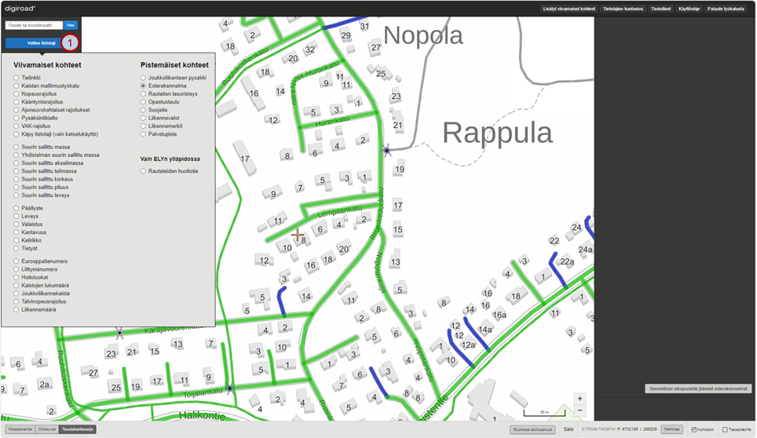

_Esterakennelman valinta._

## 28.1 Esterakennelman tietojen katselu

Yksittäisen esterakennelman voi valita napauttamalla kartalta sen geometriaa. Valitun kohteen geometria korostuu (2). Sivun oikeaan laitaan avautuu esterakennelman ominaisuustietoikkuna (3). Ominaisuustietoikkunassa näkyy esterakennelman ID, lisätty järjestelmään ja muokattu viimeksi -tiedot sekä esterakennelman tyyppi eli muu suljettu yhteys, avattava puomi, kaivanne tai ei tiedossa. Valinnan voi poistaa napauttamalla muualle.

_Esterakennelman katselu._

## 28.2 Esterakennelman muokkaus

Esterakennelman voi poistaa, siirtää tai lisätä. Lisäksi olemassa olevan esterakennelman tyyppiä voi vaihtaa muun suljetun yhteyden, avattavan puomin, kaivanteen ja tyypin ei tiedossa välillä alasvetovalikosta. Muokkaustilaan pääsee Siirry muokkaustilaan -painikkeesta. Näytön yläosioon tulee ilmoitus muokkaustilaan siirtymisestä.

### Esterakennelman poisto, siirto, lis&auml;ys ja tyyppi

Muokattava esterakennelma valitaan napauttamalla sen geometriaa. Valitun merkinnän geometria korostuu. Valittu esterakennelma voidaan poistaa raksittamalla oikeassa laidassa oleva poista-ruutu (4) ja painamalla tallenna-painiketta. Muutokset voidaan kumota peruuta-napilla. Olemassa olevan esterakennelman tyyppiä voi vaihtaa oikean laidan alasvetovalikosta valitsemalla muu suljettu yhteys, avattava puomi, kaivanne tai ei tiedossa (5). Kohteen visualisointi kartalla muuttuu valinnan mukaan.

_Esterakennelman muokkaus._

Yksittäinen esterakennelma voidaan myös siirtää valitsemalla kohde. Ensin napautetaan siirrettävä kohde valituksi. Tämän jälkeen kohde voidaan raahata haluttuun kohtaan. Linkki, jolle esterakennelma siirtyy, korostuu kartalla sinisellä (6). Siirto tallentuu tallenna-painikkeella. Muutokset voidaan kumota peruuta-napilla.

_Esterakennelman siirto._

Esterakennelma voidaan lisätä valitsemalla vasemmalta lisäys-työkalu (plussa) (7). Esterakennelma lisätään haluttuun tien kohtaan napauttamalla karttaa (8), jolloin karttaikkuna tummenee. Esterakennelmalle valitaan oikeasta laidasta tyyppi eli muu suljettu yhteys, avattava puomi, kaivanne tai ei tiedossa (9). Uusi kohde tallennetaan painamalla Tallenna-nappia.

_Esterakennelman lis&auml;ys._

Takaisin katselutilaan p&auml;&auml;see siirry katselutilaan –painikkeella.

### Geometrian ulkopuolelle j&auml;&auml;neet esterakennelmat

Geometrian ulkopuolelle jääneet esterakennelmat on korostettu kartalla punaisella ympyrällä. Näin voi käydä, jos tielinkkigeometria sen alla on muuttunut niin paljon, ettei järjestelmä pysty enää päättelemään sen sijaintia geometrialla. Esterakennelmaa siirtämällä geometriavirhe poistuu.

Geometrian ulkopuolelle jääneillä esterakennelmilla on oma lista (10). Esterakennelmat on jaoteltu listalle kunnan sekä kunnan sisällä hallinnollisen luokan (kunta, valtio, yksityinen) mukaan. Listalla näkyy vain ne esterakennelmat, joihin käyttäjällä on muokkausoikeus. Korjattavaan esterakennelmaan on listassa linkki, josta pääsee suoraan esterakennelman kohdalle sovelluksessa ja sen voi siirtää takaisin geometrialle. Lista sulkeutuu Sulje lista -painikkeesta.

_Geometrian ulkopuolinen esterakennelma on v&auml;rilt&auml;&auml;n punainen._

_Geometrian ulkopuolelle j&auml;&auml;neiden esterakennelmien lista._

# 29. Rautatien tasoristeys

Karttaikkunaan voi valita rautatien tasoristeykset valitsemalle tietolajivalikosta (1) "Rautatien tasoristeys". Rautatien tasoristeykset n&auml;kyv&auml;t kartalla sinisen&auml; ympyr&auml;n&auml;. Punaiset ympyr&auml;t ovat geometrian ulkopuolelle j&auml;&auml;neit&auml; tasoristeyksi&auml;.

_Rautatien tasoristeyksen valinta._

## 29.1 Rautatien tasoristeyksen tietojen katselu

Yksitt&auml;isen tasoristeyksen voi valita napauttamalla kartalta sen geometriaa. Valitun kohteen geometria korostuu (2). Sivun oikeaan laitaan avautuu tasoristeyksen ominaisuustietoikkuna (3). Ominaisuustietoikkunassa n&auml;kyy lis&auml;tty j&auml;rjestelm&auml;&auml;n ja muokattu viimeksi -tiedot, tasoristeystunnus, tasoristeyksen turvavarustus sek&auml; nimi. Valinnan voi poistaa napauttamalla muualle.

_Rautatien tasoristeyksen katselu._

## 29.2 Rautatien tasoristeyksen muokkaus

Rautatien tasoristeyksen voi poistaa, siirt&auml;&auml; tai lis&auml;t&auml;. Lis&auml;ksi olemassa olevan tasoristeyksen turvavarustusta voi muokata alasvetovalikosta ja tasoristeystunnusta sekä nime&auml; voi muokata. Muokkaustilaan p&auml;&auml;see Siirry muokkaustilaan -painikkeesta. N&auml;yt&ouml;n yl&auml;osioon tulee ilmoitus muokkaustilaan siirtymisest&auml;.

### Rautatien tasoristeyksen ominaisuustietojen muokkaus, siirto, poisto ja lis&auml;ys

Muokattava tasoristeys valitaan napauttamalla sen geometriaa. Valitun merkinn&auml;n geometria korostuu. Valittu tasoristeys voidaan poistaa raksittamalla oikeassa laidassa oleva poista-ruutu (4). Olemassa olevan tasoristeyksen turvavarustuksen tietoja voi vaihtaa oikean laidan alasvetovalikosta. Muutokset tallennetaan tallenna-painikkeesta tai voi perua peruuta-painikkeesta (5).

_Rautatien tasoristeyksen muokkaus._

Yksitt&auml;ist&auml; tasoristeyst&auml; voidaan my&ouml;s siirt&auml;&auml; valitsemalla kohde. Ensin napautetaan siirrett&auml;v&auml; kohde valituksi. T&auml;m&auml;n j&auml;lkeen kohde voidaan raahata haluttuun kohtaan. Linkki, jolle tasoristeys siirtyy, korostuu kartalla sinisell&auml; (6). Siirto tallentuu tallenna-painikkeella. Muutokset voidaan kumota peruuta-painikkeella.

_Rautatien tasoristeyksen siirto._

Uusi tasoristeys voidaan lis&auml;t&auml; valitsemalla vasemmalta lis&auml;ys-ty&ouml;kalu (plussa) (7). Tasoristeys lis&auml;t&auml;&auml;n haluttuun tien kohtaan napauttamalla karttaa (8), jolloin karttaikkuna tummenee. Tasoristeykselle valitaan oikean laidan alasvetovalikosta turvavarustus-tieto sek&auml; kirjoitetaan tasoristeystunnus ja nimi (9). Uusi kohde tallennetaan painamalla tallenna-painiketta. Lis&auml;yksen voi perua peruuta-painikkeesta.

_Rautatien tasoristeyksen lis&auml;ys._

Takaisin katselutilaan p&auml;&auml;see siirry katselutilaan –painikkeella.

### Geometrian ulkopuolelle j&auml;&auml;neet rautatien tasoristeykset

Geometrian ulkopuolelle j&auml;&auml;neet tasoristeykset on korostettu kartalla punaisella ympyr&auml;ll&auml; (10). N&auml;in voi k&auml;yd&auml; jos tielinkkigeometria sen alla on muuttunut niin paljon, ettei j&auml;rjestelm&auml; pysty en&auml;&auml; p&auml;&auml;ttelem&auml;&auml;n sen sijaintia geometrialla. Tasoristeyst&auml; siirt&auml;m&auml;ll&auml; geometriavirhe poistuu.

Geometrian ulkopuolelle j&auml;&auml;neill&auml; tasoristeyksill&auml; on oma lista (11). Tasoristeykset on jaoteltu listalle kunnan sek&auml; kunnan sis&auml;ll&auml; hallinnollisen luokan (kunta, valtio, yksityinen) mukaan. Listalla n&auml;kyy vain ne tasoristeykset, joihin k&auml;ytt&auml;j&auml;ll&auml; on muokkausoikeus. Korjattavaan tasoristeykseen on listassa linkki, josta p&auml;&auml;see suoraan tasoristeyksen kohdalle sovelluksessa ja sen voi siirt&auml;&auml; takaisin geometrialle. Lista sulkeutuu Sulje lista -painikkeesta.

_Geometrian ulkopuolinen rautatien tasoristeys on v&auml;rilt&auml;&auml;n punainen._

_Geometrian ulkopuolelle j&auml;&auml;neiden rautatien tasoristeysten lista._

# 30. Opastustaulu ja sen informaatio

Opastustaulu ja sen informaatio ovat moottori- ja moottoriliikenneteill&auml; sijaitseva tai niille opastava tienviitta. Karttaikkunaan voi valita opastustaulut tietolajivalikosta (1). Kartalle tulevat esiin opastustaulut sinisen&auml; nuolena. Nuolen suunta kuvaa opastustaulun vaikutussuuntaa. Punaisella nuolella olevat opastustaulut kuvaavat geometrian ulkopuolella olevia opastustauluja.

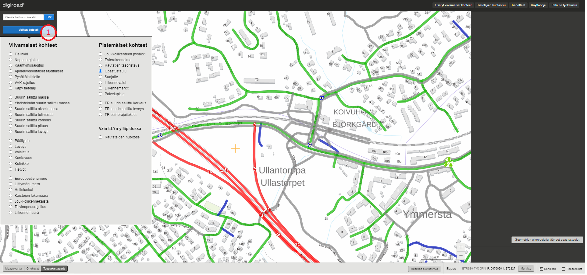

_Opastustaulun valinta._

## 30.1 Opastustaulun tietojen katselu

Yksitt&auml;isen opastustaulun voi valita napauttamalla kartalta sen geometriaa. Valitun merkinn&auml;n geometria korostuu. Sivun oikeaan laitaan avautuu opastustaulun ominaisuustietoikkuna. Ominaisuustietoikkunassa n&auml;kyy opastustaulun ID, lis&auml;tty j&auml;rjestelm&auml;&auml;n ja muokattu viimeksi -tiedot sekä opastustaulun informaatio. Valinnan voi purkaa napauttamalla taustakarttaa.

_Opastustaulun katselu._

__Opastustaulun informaation sis&auml;lt&ouml;__

Informaatiokent&auml;ss&auml; on seuraavat tiedot puolipisteell&auml; eroteltuina ja useampi kohde rivinvaihdolla:

PAIKKAKUNNAT;VÄRI;SIJAINTI
PAIKKAKUNNAT;VÄRI;SIJAINTI

Kenttien sis&auml;ll&auml; tiedot on eroteltu kaksoispisteell&auml;. Esim:

HELSINKI:HELSINGFORS;1;500

Merkkijonon osien tarkennukset informaatiokent&auml;ss&auml;:

Paikkakunnat: Paikkakuntien nimet samalla tavalla kirjoitettuna kuin opastustaulussa (kaikki kirjaimet ovat ISOJA). Jos opastustaulussa on useampi kuin yksi paikkakunta, niin ne tulee erotella rivinvaihdoilla.

Taustav&auml;ri:
1 ei tietoa
2 vihre&auml; (moottori- tai moottoriliikennetie)
3 sininen (maantie)
4 valkoinen (paikalliskohde, esim. kaupunginosa)
	
Sijainti: Taulun et&auml;isyys liittym&auml;st&auml; metrein&auml;.

## 30.2 Opastustaulun muokkaus

Opastustaulun voi poistaa, siirt&auml;&auml; tai lis&auml;t&auml; uuden merkinn&auml;n muokkaustilassa. Muokkaustilaan p&auml;&auml;see Siirry muokkaustilaan -painikkeesta. N&auml;yt&ouml;n yl&auml;osaan tulee ilmoitus muokkaustilaan siirtymisest&auml;.

### Opastustaulun siirto, muokkaus ja poisto

Muokattava opastustaulu valitaan napauttamalla sen geometriaa. Valitun merkinn&auml;n geometria korostuu. Valittu opastustaulu voidaan poistaa raksittamalla oikeassa laidassa oleva poista-ruutu (2) ja painamalla tallenna-painiketta (3). Muutokset voidaan kumota peruuta-painikkeella (4).

Yksitt&auml;ist&auml; opastustaulua voidaan my&ouml;s siirt&auml;&auml;. Ensin napautetaan siirrett&auml;v&auml; kohde valituksi. T&auml;m&auml;n j&auml;lkeen merkint&auml; voidaan raahata haluttuun kohtaan. Tielinkki, jolle opastustaulu siirtyy, korostuu sinisell&auml;. Siirto tallentuu tallenna-painikkeella (3). Muutokset voidaan kumota peruuta-painikkeella (4).

Muokkaustilassa opastustaulun tekstikentt&auml;&auml;n (5) pystyy my&ouml;s lis&auml;t&auml; informaatiota ja vaihtaa vaikutussuuntaa (6). 

_Opastustaulun muokkaus._

### Opastustaulun lis&auml;ys

Opastustaulu voidaan lis&auml;t&auml; painamalla muokkaustilan työkalupalkissa lisäyspainiketta (7). Opastustaulu lis&auml;t&auml;&auml;n haluttuun tien kohtaan ja painetaan tallenna-painiketta (3). Takaisin katselutilaan p&auml;&auml;see siirry katselutilaan –painikkeella (8).

### Geometrian ulkopuolelle j&auml;&auml;neet opastustaulut

Geometrian ulkopuolelle j&auml;&auml;neet opastustaulut on korostettu kartalla punaisella nuolella. N&auml;in voi k&auml;yd&auml; jos tielinkkigeometria sen alla on muuttunut niin paljon, ettei j&auml;rjestelm&auml; pysty en&auml;&auml; p&auml;&auml;ttelem&auml;&auml;n sen sijaintia geometrialla. Opastustaulumerkint&auml;&auml; siirt&auml;m&auml;ll&auml; geometriavirhe poistuu. Ennen opastustaulun korjaamista tiegeometrialle, tulee alla olevan tielinkit tiedot olla tarvittaessa korjattu.

Geometrian ulkopuolelle j&auml;&auml;neill&auml; opastustauluilla on oma lista (9). Opastustaulut on jaoteltu listalle kunnan sek&auml; kunnan sis&auml;ll&auml; hallinnollisen luokan (kunta, valtio, yksityinen) mukaan. Listalla n&auml;kyy vain ne opastustaulut, joihin k&auml;ytt&auml;j&auml;ll&auml; on muokkausoikeus. Opastustauluista on listassa linkki, josta p&auml;&auml;see suoraan opastustaulun kohdalle sovelluksessa ja sen voi siirt&auml;&auml; takaisin geometrialle. Lista sulkeutuu Sulje lista -painikkeesta.

_Geometrian ulkopuolinen opastustaulu on v&auml;rilt&auml;&auml;n punainen._

_Geometrian ulkopuolelle j&auml;&auml;neiden opastustaulujen lista._

# 31. Suojatie

Suojatie on ajoradan ylitt&auml;miseen tarkoitettu kohta. Karttaikkunaan voi valita suojatiet tietolajivalikosta (1) ”Suojatie”. Kartalle tulevat esiin suojatiemerkinn&auml;t sinisen&auml; ympyr&auml;n&auml;. Punaisella ympyr&auml;ll&auml; olevat suojatiemerkinn&auml;t kuvaavat geometrian ulkopuolella olevia suojateit&auml;. 

_Suojatiemerkinn&auml;n valinta._

## 31.1 Suojatiemerkinn&auml;n tietojen katselu

Yksitt&auml;isen suojatiemerkinn&auml;n voi valita napauttamalla kartalta sen geometriaa. Valitun merkinn&auml;n geometria korostuu. Sivun oikeaan laitaan avautuu suojatiemerkinn&auml;n ominaisuustietoikkuna. Ominaisuustietoikkunassa n&auml;kyy lis&auml;tty j&auml;rjestelm&auml;&auml;n ja muokattu viimeksi -tiedot. Valinnan voi purkaa napauttamalla taustakarttaa.

_Suojatien katselu._

## 31.2 Suojatiemerkinn&auml;n muokkaus

Suojatiemerkinn&auml;n voi poistaa, siirt&auml;&auml; tai lis&auml;t&auml; uuden merkinn&auml;n muokkaustilassa. Muokkaustilaan p&auml;&auml;see Siirry muokkaustilaan -painikkeesta. N&auml;yt&ouml;n yl&auml;osioon tulee ilmoitus muokkaustilaan siirtymisest&auml;.

### Suojatiemerkinn&auml;n poisto, siirto ja lis&auml;ys

Muokattava suojatie valitaan napauttamalla sen geometriaa. Valitun merkinn&auml;n geometria korostuu. Valittu suojatiemerkint&auml; voidaan poistaa raksittamalla oikeassa laidassa oleva poista-ruutu (2) ja painamalla tallenna painiketta (3). Muutokset voidaan kumota peruuta-napilla.

Yksitt&auml;ist&auml; suojatiemerkint&auml;&auml; voidaan my&ouml;s siirt&auml;&auml; valitsemalla kohde. Ensin napautetaan siirrett&auml;v&auml; kohde valituksi. T&auml;m&auml;n j&auml;lkeen merkint&auml; voidaan raahata haluttuun kohtaan. Linkki, jolle suojatie siirtyy, korostuu sinisell&auml;. Siirto tallentuu tallenna-painikkeella (3). Muutokset voidaan kumota peruuta-napilla.

_Suojatien muokkaustila._

Suojatiemerkint&auml; voidaan lis&auml;t&auml; valitsemalla vasemmalta lis&auml;ys-ty&ouml;kalu (plussa) (4). Suojatiemerkint&auml; lis&auml;t&auml;&auml;n haluttuun tien kohtaan ja painetaan Tallenna-nappia. Takaisin katselutilaan p&auml;&auml;see siirry katselutilaan –painikkeella (5).

### Geometrian ulkopuolelle j&auml;&auml;neet suojatiet

Geometrian ulkopuolelle j&auml;&auml;neet suojatiet on korostettu kartalla punaisella ympyr&auml;ll&auml;. N&auml;in voi k&auml;yd&auml; jos tielinkkigeometria sen alla on muuttunut niin paljon, ettei j&auml;rjestelm&auml; pysty en&auml;&auml; p&auml;&auml;ttelem&auml;&auml;n sen sijaintia geometrialla. Suojatiemerkint&auml;&auml; siirt&auml;m&auml;ll&auml; geometriavirhe poistuu.

_Geometrian ulkopuolinen suojatiemerkint&auml; on v&auml;rilt&auml;&auml;n punainen._

Geometrian ulkopuolelle j&auml;&auml;neill&auml; suojateill&auml; on oma lista (6). Suojatiet on jaoteltu listalle kunnan sek&auml; kunnan sis&auml;ll&auml; hallinnollisen luokan (kunta, valtio, yksityinen) mukaan. Listalla n&auml;kyy vain ne suojatiet, joihin k&auml;ytt&auml;j&auml;ll&auml; on muokkausoikeus. Suojatiest&auml; on listassa linkki, josta p&auml;&auml;see suoraan suojatien kohdalle sovelluksessa ja sen voi siirt&auml;&auml; takaisin geometrialle. Lista sulkeutuu Sulje lista -painikkeesta.

_Geometrian ulkopuolelle j&auml;&auml;neiden suojateiden lista._

# 32. Liikennevalot

Valo-ohjatuissa liittymiss&auml; liikennevalot on kuvattu pisteinä, joilla on niiden vaikutussuuntaa kuvaavat nuolet. Karttaikkunaan voi valita liikennevalot tietolajivalikosta (1). Uuden vuonna 2020 voimaan tulleen tieliikennelain myötä Digiroadiin kerätään tarkempaa tietoa liikennevaloista, joten tietolajipaneelissa ja kartalla on näkyvillä sekä vanhan että uuden tietomallin mukaiset opastinlaitteet. Vanhan mallin liikennevalot näyttäytyvät kartalla sinisinä pisteinä. Punaisilla pisteillä visualisoituna liikennevalot ovat puolestaan geometrian ulkopuolella olevia kohteita. Uuden tietomallin mukaiset liikennevalot näkyvät karttaikkunassa pisteinä, joilla on vaikutussuuntanuoli. Uuden tietomallin mukaisesti oranssilla visualisoidut liikennevalot indikoivat, että niissä on useita opastinlaitteita. Puolestaan valkoisella visualisoidut kohteet indikoivat risteyksessä olevan vain yksi opastinlaite.
 

_Liikennevalojen valinta._

## 32.1 Liikennevalojen tietojen katselu

Liikennevalokohteen voi valita napauttamalla kartalta sen geometriaa, jolloin valitun kohteen geometria korostuu ja sivun oikeaan laitaan avautuu liikennevalon ominaisuustietoikkuna. Ominaisuustietoikkunassa näkyy useita ominaisuustietoja, joita voi tallentaa liikennevaloille (2), kuten esimerkiksi liikennevalojen tyyppi, opastimen rakennelma sekä opastimen suhteellinen sijainti tiellä. Valinnan voi purkaa napauttamalla taustakarttaa. Huom! Vanhan tietomallin liikennevalojen tietoja voi katsella vain päivittämällä tiedot uuden tietomallin mukaisiksi. Tämä tapahtuu napauttamalla vanhan tietomallin pysäkin kuvaketta ja painamalla "Siirry muokkaamaan liikennevaloa" -painiketta, jolloin tiedot voi päivittää.

_Liikennevalokohteen katselu._

### Geometrian ulkopuolelle j&auml;&auml;neet liikennevalot

Geometrian ulkopuolelle j&auml;&auml;neet liikennevalot on korostettu kartalla punaisella pisteell&auml;. N&auml;in voi k&auml;yd&auml; jos tielinkkigeometria sen alla on muuttunut niin paljon, ettei j&auml;rjestelm&auml; pysty en&auml;&auml; p&auml;&auml;ttelem&auml;&auml;n sen sijaintia geometrialla. Liikennevaloa siirt&auml;m&auml;ll&auml; muokkaustilassa geometriavirhe poistuu.

_Geometrian ulkopuoliset liikennevalot näkyvät kartalla punaisina pisteinä._

Geometrian ulkopuolelle j&auml;&auml;neill&auml; liikennevaloilla on oma lista (3). Liikennevalot on jaoteltu listalle kunnan sek&auml; kunnan sis&auml;ll&auml; hallinnollisen luokan (kunta, valtio, yksityinen) mukaan. Listalla n&auml;kyy vain ne liikennevalot, joihin k&auml;ytt&auml;j&auml;ll&auml; on muokkausoikeus. Liikennevalosta on listassa linkki, josta p&auml;&auml;see suoraan pisteen kohdalle sovelluksessa ja sen voi siirt&auml;&auml; takaisin geometrialle. Lista sulkeutuu Sulje lista -painikkeesta.

_Geometrian ulkopuoliset liikennevalot._

## 32.2 Liikennevalojen muokkaus

Liikennevalojen tietoja voi muokata, kohteen voi poistaa, siirt&auml;&auml; tai lis&auml;t&auml; uuden kohteen muokkaustilassa. Muokkaustilaan p&auml;&auml;see Siirry muokkaustilaan -painikkeesta. N&auml;yt&ouml;n yl&auml;osaan tulee ilmoitus muokkaustilaan siirtymisest&auml;.

### Liikennevalojen tietojen muokkaus, kohteen poisto, siirto ja lis&auml;ys

HUOM! Muokatessa vanhan tietomallin mukaisia liikennevaloja, esiin tulee uuden tietomallin mukainen ominaisuustietoikkuna, jonka tiedot täyttämällä kohde päivittyy uuteen tietomalliin. 

Muokattava kohde valitaan napauttamalla sen geometriaa. Valitun kohteen geometria korostuu ja sivun oikeaan laitaan avautuu ominaisuustietoikkuna (4), johon voi täydentää liikennevalojen tietoja. Valittu opastinlaite voidaan poistaa raksittamalla oikeassa laidassa oleva poista-ruutu (5). Muutokset voidaan tallentaa painamalla tallenna-painiketta (6) tai kumota peruuta-painikkeella (7).

Yksitt&auml;ist&auml; liikennevaloa voidaan my&ouml;s siirt&auml;&auml;. Ensin napautetaan siirrett&auml;v&auml; kohde valituksi. T&auml;m&auml;n j&auml;lkeen merkint&auml; voidaan raahata haluttuun kohtaan. Tielinkki, jolle liikennevalo siirtyy, korostuu kartalla sinisell&auml; v&auml;rill&auml;. Siirto tallentuu tallenna-painikkeella (6). Muutokset voidaan kumota peruuta-painikkeella (7).

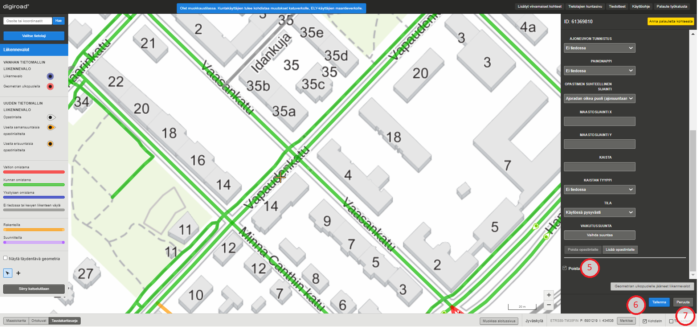

_Liikennevalokohteiden muokkaus._

Liikennevalomerkint&auml; voidaan lis&auml;t&auml; painamalla vasemmassa yl&auml;kulmasta plus-painiketta eli lis&auml;ysty&ouml;kalua (8). Liikennevalo lis&auml;t&auml;&auml;n haluttuun tien kohtaan, minkä jälkeen sivun oikeaan laitaan avautuu ominaisuustietoikkuna (9), johon liikennevalojen tiedot täydennetään, minkä jälkeen painetaan Tallenna-nappia. Takaisin katselutilaan p&auml;&auml;see siirry katselutilaan –painikkeella (10).

# 33. Liikennemerkit

Liikennemerkit ovat tieverkolla olevia tieliikenteen ohjauslaitteita, jotka on jaoteltu Digiroadissa kahdeksaan ryhmään: 

* Varoitusmerkit
* Etuajo-oikeus ja väistämismerkit 
* Kielto- ja rajoitusmerkit
* Määräysmerkit 
* Sääntömerkit
* Opastusmerkit 
* Palvelukohteet
* Muut merkit

Kartalle voi valita liikennemerkit valitsemalla tietolajivalikosta (1) "Liikennemerkit", jolloin kohteet visualisoituvat karttaikkunassa pisteinä, joilla on niiden vaikutussuuntaa kuvaavat nuolet. Tarpeeksi lähelle karttaikkunaa zoomatessa liikennemerkit visualisoituvat niiden tietosisältöä ilmaisevina kuvina.  

_Liikennemerkkien valinta._

## 33.1 Liikennemerkin tietojen katselu

Yksitt&auml;isen liikennemerkin voi valita napauttamalla kartalta sen geometriaa. Valitun kohteen geometria korostuu (2). Sivun oikeaan laitaan avautuu liikennemerkin ominaisuustietoikkuna (3). Ominaisuustietoikkunassa näkyy useita merkkiin liittyviä ominaisuustietoja, kuten sen tyyppi, arvo/tekstisisältö, maastokoordinaatit sekä mahdollisten lisäkilpien tiedot. Valinnan voi poistaa napauttamalla muualle.

Liikennemerkin katselu.

## 33.2 Liikennemerkin muokkaus

Liikennemerkin voi poistaa, siirtää tai lisätä. Lisäksi olemassa olevan liikennemerkin ominaisuustietoja voi muokata liikennemerkin ominaisuustietoikkunassa. Muokkaustilaan p&auml;&auml;see Siirry muokkaustilaan -painikkeesta. N&auml;yt&ouml;n yl&auml;osioon tulee ilmoitus muokkaustilaan siirtymisest&auml;.

### Liikennemerkin poisto, siirto, lis&auml;ys ja tietojen muokkaus

Muokattava liikennemerkki valitaan napauttamalla sen geometriaa. Valitun merkinn&auml;n geometria korostuu. Valittu liikennemerkki voidaan poistaa raksittamalla ominaisuustietoikkunan alaosassa oleva poista-ruutu (4) ja painamalla tallenna-painiketta. Muutokset voidaan kumota peruuta-painikkeella. Olemassa olevan liikennemerkin ominaisuustietoja voi muokata ominaisuustietoikkunassa (5). Liikennemerkeillä on lukuisia ominaisuustietoja ja esimerkiksi kohteen tyyppiä, sen tietosisältöä sekä vaikutussuuntaa voi muokata. Vaikutussuunta kuvautuu liikennemerkissä vaikutussuuntanuolella (6), joka osoittaa merkin vaikutusalueen suuntaan. Muokkaukset tallennetaan painamalla tallenna-painiketta, jolloin kohteen visualisointi kartalla muuttuu ominaisuustietojen muokkauksen yhteydessä. Muutokset voidaan kumota peruuta-painikkeella.

_Liikennemerkin muokkaus._

Yksittäistä liikennemerkkiä voidaan myös siirtää valitsemalla kohde. Ensin napautetaan siirrettävä kohde valituksi. T&auml;m&auml;n j&auml;lkeen kohde voidaan raahata haluttuun kohtaan. Linkki, jolle liikennemerkki siirtyy, korostuu kartalla sinisell&auml; (7). Siirto tallentuu tallenna-painikkeella. Muutokset voidaan kumota peruuta-painikkeella.

_Liikennemerkin siirto._

Liikennemerkki voidaan lis&auml;t&auml; valitsemalla työkalupalkista lis&auml;ys-ty&ouml;kalu (plussa) (8). Liikennemerkki lis&auml;t&auml;&auml;n haluttuun tien kohtaan napauttamalla karttaa (9), jolloin karttaikkuna tummenee. Liikennemerkille täytetään ominaisuustietoikkunassa kohteen tiedot (10). Uusi kohde tallennetaan painamalla Tallenna-nappia. 

_Liikennemerkin lis&auml;ys._

Liikennemerkille voi myös lisätä lisäkilpiä ominaisuustietoikkunassa valitsemalla Linkitä lisäkilpiä -valintaruudun (11). Lisäkilvelle voi täyttää useita ominaisuustietoja (12), esimerkiksi sen tyyppi ja tekstisisältö.

_Lisäkilven lisäys_

Takaisin katselutilaan p&auml;&auml;see siirry katselutilaan –painikkeella.

### Geometrian ulkopuolelle j&auml;&auml;neet liikennemerkit

Liikennemerkki voi jäädä geometrian ulkopuolelle, jos tielinkkigeometria sen alla on muuttunut niin paljon, ettei j&auml;rjestelm&auml; pysty en&auml;&auml; p&auml;&auml;ttelem&auml;&auml;n sen sijaintia geometrialla. Liikennemerkkiä siirt&auml;m&auml;ll&auml; geometriavirhe poistuu.

Geometrian ulkopuolelle j&auml;&auml;neill&auml; liikennemerkeillä on oma lista (13). Liikennemerkit on jaoteltu listalle kunnan sek&auml; kunnan sis&auml;ll&auml; hallinnollisen luokan (kunta, valtio, yksityinen) mukaan. Listalla n&auml;kyy vain ne liikennemerkit, joihin k&auml;ytt&auml;j&auml;ll&auml; on muokkausoikeus. Korjattavaan liikennemerkkiin on listassa linkki, josta p&auml;&auml;see suoraan merkin kohdalle sovelluksessa ja sen voi siirt&auml;&auml; takaisin geometrialle. Lista sulkeutuu Sulje lista -painikkeesta.

_Geometrian ulkopuoliset liikennemerkit löytyvät painikkeen takaa._

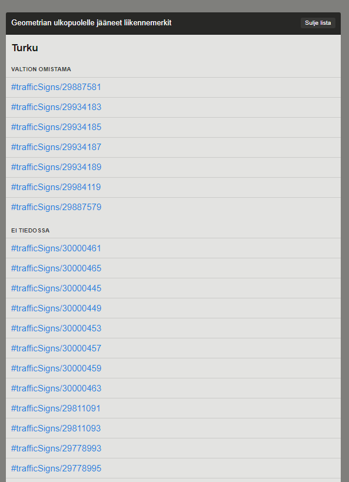

_Geometrian ulkopuolelle j&auml;&auml;neiden liikennemerkkien lista._

### Tie- tai katuverkon ulkopuolelle osoittavat liikennemerkit

Digiroadin käyttöliittymässä liikennemerkin vaikutussuunta ilmenee vaikutussuuntanuolella, joka osoittaa pääsääntöisesti joko tielinkin liikennevirran suuntaan tai sitä vasten. Ominaisuustietoikkunan Vaihda suuntaa -painiketta (14) napauttamalla voi kääntää merkin vastakkaiseen suuntaan eli 180 astetta.

_Vaihda suuntaa -painike_

Kuitenkin on tilanteita, joissa liikennemerkin vaikutussuunta tulisi ilmaista muulla tavoin kuin tiellä olevan liikenteen suuntaisesti. Tällaisia tilanteita voivat olla esimerkiksi piha- tai parkkialueet, joilla ei ole mallinnettu tielinkkejä. Digiroadin käyttöliittymässä tie- tai katuverkon ulkopuolelle osoittava liikennemerkki tallennetaan seuraavasti:

1.	Valitaan Liikennemerkit-tietolajin ominaisuustietoikkunassa "Tie tai katuverkon ulkopuolella, esimerkiksi parkkialueella tai piha-alueella" Sijaintitarkenne-kohdan (15) alasvetovalikosta.
2.	Tämän jälkeen "Vaihda suuntaa" -painike poistuu käytöstä, ja voit määrittää Suuntima-ominaisuustietoon (16) liikennemerkin vaikutussuunnan asteina (0-360). Esimerkiksi, jos parkkialue on tielinkin oikealla puolella, aseta suunta-arvoksi 90, jolloin nuoli osoittaa oikealle.
3.	Tallenna muokkaukset tallenna-painikkeella tai kumoa peruuta-painikkeella.
4.	Jos haluat palauttaa liikennemerkin vaikutussuunnan takaisin tielinkin suuntaiseksi, valitse sijaintitarkenteesta jokin muu vaihtoehto, jolloin "Vaihda suuntaa" -painike aktivoituu uudelleen ja vaikutussuunnan voi tallentaa liikenteen suuntaiseksi.

_Sijaintitarkenne ja suuntima_

# 34. Palvelupiste

Palvelu on liikenneverkon k&auml;ytt&auml;j&auml;&auml; auttava ja tukeva palvelu kuten pys&auml;k&ouml;intitalo tai linja-autoasema. Palvelulla on geometriapiste (palvelupiste), joka sijaitsee palvelun sijaintikohdassa (rakennuksen tai kiinteist&ouml;n keskikohdassa). Yhdess&auml; palvelupisteess&auml; voi olla useita palveluita. Karttaikkunaan voi valita palvelupisteet tietolajivalikosta (1). Kartalle visualisoituvat palvelupisteet sinisen ympyrän päälle.
 

_Palvelupisteiden valinta._

## 34.1 Palvelupisteen tietojen katselu

Yksitt&auml;isen palvelupisteen voi valita napauttamalla kartalta sen geometriaa.

Valitun kohteen geometria korostuu. Sivun oikeaan laitaan avautuu palvelupisteen ominaisuustietoikkuna. Ominaisuustietoikkunassa n&auml;kyy lis&auml;tty j&auml;rjestelm&auml;&auml;n ja muokattu viimeksi -tiedot. Palvelupisteillä on myös muita ominaisuustietoja, jotka vaihtelevat palvelupisteestä riippuen. Valinnan voi purkaa napauttamalla taustakarttaa.
 

_Palvelupisteiden katselu._

## 34.2 Palvelupisteen muokkaus

Palvelupisteen voi poistaa, siirt&auml;&auml; tai lis&auml;t&auml; uuden merkinn&auml;n muokkaustilassa. Muokkaustilaan p&auml;&auml;see Siirry muokkaustilaan -painikkeesta. N&auml;yt&ouml;n yl&auml;osaan tulee ilmoitus muokkaustilaan siirtymisest&auml;.

### Palvelupisteen poisto

Muokattava palvelupiste valitaan napauttamalla sen geometriaa. Valitun kohteen geometria korostuu. Valittu palvelupiste voidaan poistaa raksittamalla oikeassa laidassa oleva poista-ruutu (2) ja painamalla tallenna-painiketta (3). Muutokset voidaan kumota peruuta-painikkeella (4).

### Palvelupisteen siirto ja muokkaus

Yksitt&auml;ist&auml; palvelupistett&auml; voidaan my&ouml;s siirt&auml;&auml;. Ensin napautetaan siirrett&auml;v&auml; kohde valituksi. T&auml;m&auml;n j&auml;lkeen merkint&auml; voidaan raahata haluttuun kohtaan. Palvelupisteen sijainti ei ole riippuvainen tien geometriasta, vaan sen voi sijoittaa mihin kohtaan tahansa. Siirto tallentuu tallenna-painikkeella (3). Muutokset voidaan kumota peruuta-painikkeella(4).

Muokkaustilassa palvelupisteeseen voidaan lis&auml;t&auml; uusi palvelu (5) tai yksitt&auml;inen palvelu voidaan poistaa (6). Palveluun voidaan m&auml;&auml;ritt&auml;&auml; palvelun nimi (7) ja lis&auml;tieto (8). Joihinkin palveluihin on valittavissa my&ouml;s tarkentava lis&auml;kentt&auml; (9), kuten lepoalueella, pys&auml;k&ouml;intialueella, kuorma-autojen pys&auml;k&ouml;intialueella ja rautatieasemalla.

_Palvelupisteiden muokkaus._

### Palvelupisteen lis&auml;ys

Palvelupiste voidaan lis&auml;t&auml; painamalla muokkaustilan työkalupalkin lisää-painiketta (10). Palvelupiste lis&auml;t&auml;&auml;n haluttuun kohtaan ja painetaan tallenna-painiketta (3) tai kumotaan peruuta-painikkeesta (4). Takaisin katselutilaan p&auml;&auml;see siirry katselutilaan –painikkeella (11).

# 35. Rautateiden huoltotie (Vain ELYn ylläpidossa)

Rautateiden huoltotie on viivamainen tietolaji, joka on vain ELY-keskusten ylläpidossa. Huoltotie voi olla tielinkin mittainen tai sitä lyhyempi. Rautateiden huoltotie -tietolajin saa näkyviin kartalle valitsemalla sen aktiiviseksi tietolajivalikosta (1). Kohteet tulevat näkyviin kartalle, kun liikkuu kartalla lähemmäksi. Jos tielinkille on tallennettu tieto huoltotien olemassaolosta, se visualisoituu karttaikkunaan ominaisuustietojensa mukaisesti. Rautateiden huoltotietietoja voi tallentaa vain tielinkeille, joiden toiminnallinen luokka on suurempi kuin 4. 

_Rautateiden huoltotie._

## 35.1 Rautateiden huoltotie -tietojen katselu

Huoltotiet voidaan visualisoida sovelluksessa joko käyttöoikeuden tai huoltovastuun perusteella. Valinta tapahtuu vasemman reunan tietolajipaneelin radionappia painamalla (2). Kun huoltotiekohdetta napauttaa kartalta, se korostuu (3) ja ominaisuustietoikkunaan avautuu kohteen tiedot. Kerran napauttamalla tulee valituksi koko huoltotieketju, eli kaikki tielinkit, joilla on sama huoltotietieto sekä tienumero (maantiellä) tai tiennimi (katuverkolla ja yksityistiellä). Jos käyttäjä haluaa valita vain yhden tielinkin tarkasteluun, voi sen tehdä kaksoisnapauttamalla tielinkkiä. Rautateiden huoltotien ominaisuustietoja ovat (4) huoltotie (kyllä/ei vaihtoehdot), käyttöoikeus, huoltovastuu, tiehoitokunta sekä tarkistettu-painike. Lisäksi ominaisuustietoikkunassa näkyy, milloin tieto on lisätty järjestelmään ja milloin sitä muokattu viimeksi, sekä tieto linkkien lukumäärästä huoltotieketjussa.

_Rautateiden huoltotie -tietolajin katselu._

## 35.2 Rautateiden huoltotie -tietolajin muokkaus

Huoltotietietoja voi muokata muokkaustilassa. Muutokset tallennetaan aina Tallenna-painikkeesta tai perutaan Peruuta-painikkeesta, jolloin alkuper&auml;inen tieto j&auml;&auml; voimaan.
Muokkaustilassa huoltoteille voi antaa uudet ominaisuustiedot ja niit&auml; voi katkaista leikkaustyökalulla. Huoltoteitä voi muokata kolmella tavalla:

1. Koko huoltotieketjulle kerralla.
2. Yksitt&auml;isen linkin mittaiselle osuudelle.
3. Monivalinnan avulla kokonaiselle alueelle.

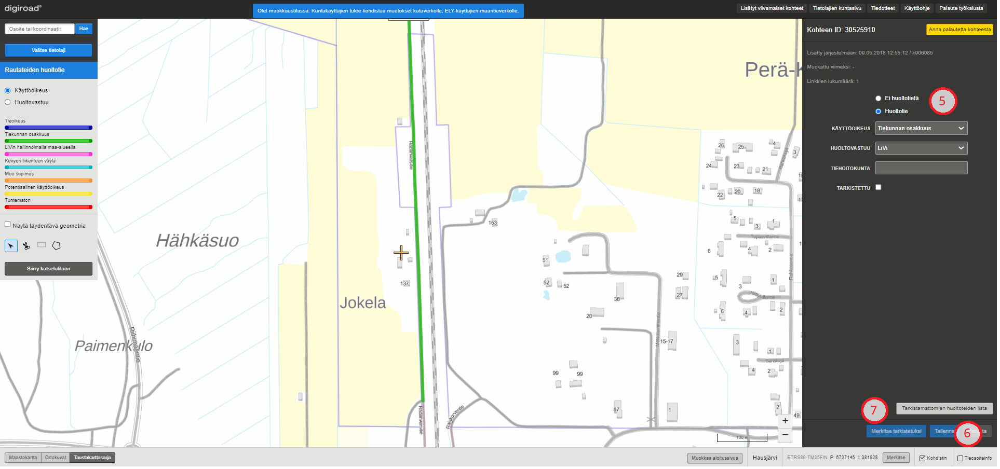

_Huoltotietiedon muokkaus._

### Huoltotietietojen lisäys

Uusi huoltotie lisätään järjestelmään asettamalla ensin tietolajivalikosta rautateiden huoltotie -tietolaji aktiiviseksi. Tämän jälkeen tulee karttaikkunasta napauttaa tielinkin geometriaa, jolle huoltotietieto halutaan lisätä. Karttaikkunan oikean reunan ominaisuustietoikkunaan tulee asettaa Huoltotie-radionappi aktiiviseksi (5), jonka jälkeen tarkentavia ominaisuustietoja kuten käyttöoikeus, huoltovastuu sekä tiehoitokunta kelirikkokausi voidaan asettaa. Huoltotiet visualisoituvat karttaikkunassa joko käyttöoikeustyyppien tai huoltovastuun mukaan riippuen tietolajivalikon radionapin visualisointivalinnasta. Tiedot tallennetaan painamalla Tallenna-painiketta tai peruutetaan painamalla Peruuta (6). Ylläpitäjä voi myös merkata kohteen tarkistetuksi. Tarkistamattomien kohteiden listaa voi tarkastella tarkistamattomien kohteiden listan kautta (7).

### Rautateiden huoltotietiedon poistaminen

Huoltotien voi poistaa napauttamalla karttaikkunasta tielinkkiä, jolta huoltotietieto halutaan poistaa. Tällöin ruudun oikeaan reunaan avautuu kohteen ominaisuustietoikkuna, jossa radionappi "Ei huoltotietä" (8) mahdollistaa huoltotietiedon poistamisen kyseiseltä tielinkiltä tai linkkiketjulta. Muutos tulee tallentaa tai peruuttaa ennen uuden kohteen muokkaamista. Kun huoltotie on poistettu, kohde muuttuu karttaikkunassa harmaaksi.

_Huoltotietiedon poistaminen._

### Rautateiden huoltotie -tietolajin muokkaus monivalintaty&ouml;kalulla

Huoltoteitä voi muokata tai asettaa useammalle tielinkille kerralla. Tielinkit, joille huoltotietieto halutaan asettaa, valitaan napauttamalla niitä ctrl-näppäin pohjassa, jolloin ctrl-näppäimen irti päästämällä avautuu huoltotien muokkausikkuna. Toinen tapa on valita aluevalintatyökaluilla tielinkit käyttämällä joko laatikkotyökalua tai monikulmiotyökalua (9). Laatikkotyökalua käytettäessä valinta päättyy, kun laatikon piirto on lukittu painamalla hiiren vasenta näppäintä. Monikulmiotyökalulla piirtäminen lopetetaan kaksoisnapauttamalla hiiren vasenta näppäintä. Valituksi tulevat kaikki tielinkit laatikon tai monikulmion sisällä ja linkit, joita alueet leikkaavat. Valinnan jälkeen karttaikkunaan avautuu ikkuna (10), jossa määritellään huoltotien ominaisuustiedot. Muutokset tulee tallentaa tai perua ennen seuraavaan kohteeseen siirtymistä.

_Huoltoteiden monivalinta._

### Rautateiden huoltotien katkaisu

Tarvittaessa huoltotien voi katkaista leikkaustyökalulla (edellisen kuvan kohta 11). Leikkaustyökalulla napautetaan huoltotien geometriasta kohtaa, josta se halutaan katkaista. Huoltotien tiegeometrian päällä työkalu näkyy ristinä, jotta tarkka katkaisukohta on helppo määrittää. Huoltotien katkaisussa uusille geometrioille asetetaan uudet ominaisuustiedot karttaikkunan oikean reunan ominaisuustietoikkunasta. Kartalla ja valikkojen vieressä olevat A ja B kirjaimet osoittavat, kummasta geometriasta on kyse. Uudet huoltotietiedot tallennetaan tallenna-painikkeesta. Katkaisun voi peruuttaa peruuta-painikkeella, jolloin alkuperäinen tieto jää voimaan. Katkaisutyökalu valitsee aina vain yhden linkin mittaisen osion geometriasta, ei koko huoltotieketjuja.

Huom! Huoltotien katkaisussa tulee m&auml;&auml;ritt&auml;&auml; uusille geometrioille eri arvot, jotta tallennus on mahdollista.
