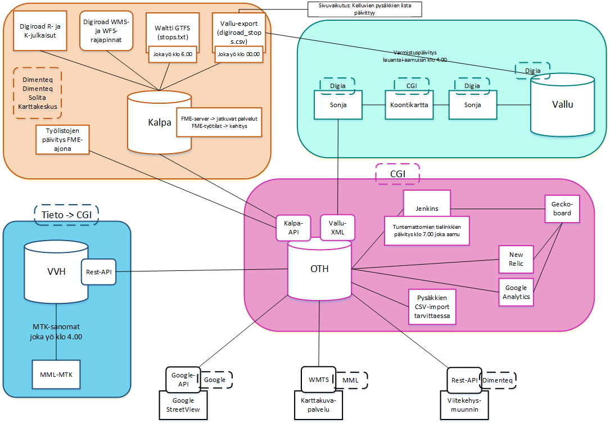
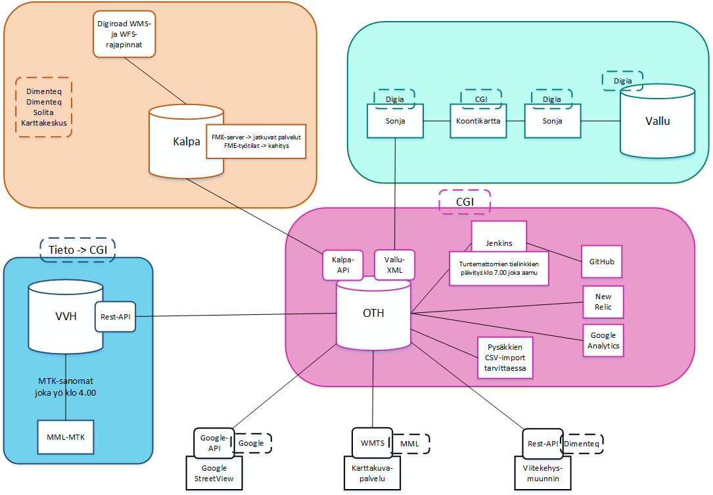
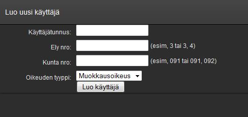
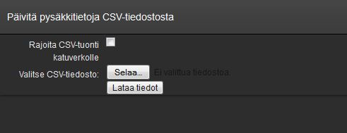
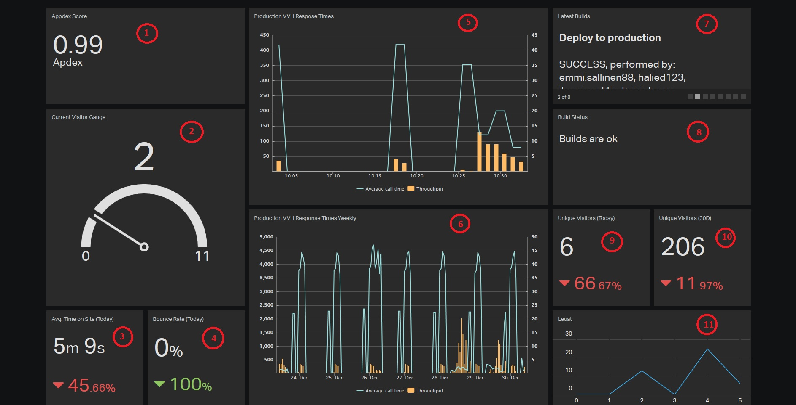

Operaattorin k&auml;ytt&ouml;ohje
=========================

1. Digiroad-yll&auml;pitosovelluksen eri ymp&auml;rist&ouml;t
-----------------------------

Digiroad2-j&auml;rjestelm&auml; koostuu ominaisuustietojen hallinnasta (OTH) ja V&auml;yl&auml;verkon hallinnasta (VVH). T&auml;ss&auml; ohjeessa kerrotaan OTH:n operaattorille tarkoitettuja, tarkempia ohjeita.

OTH hy&ouml;dynt&auml;&auml; VVH:ta seuraavasti:
VVH:n testikanta --> OTH:n testikanta
VVH:n tuotantokanta --> OTH:n koulutuskanta, integraatiotesti ja tuotantokanta

OTH:n eri ymp&auml;rist&ouml;jen osoitteet selaimessa:
Integraatiotesti https://testiextranet.liikennevirasto.fi/digiroad/
Testikanta https://devtest.liikennevirasto.fi/digiroad/
Tuotanto https://extranet.liikennevirasto.fi/digiroad/

Osa tietolajeista on tarkoitettu vain operaattorin yll&auml;pitoon toistaiseksi. N&auml;m&auml; saa n&auml;kyviin lis&auml;&auml;m&auml;ll&auml; osoitteeseen ?isExperimental=true, esim. https://extranet.liikennevirasto.fi/digiroad/?isExperimental=true

Uudet versiot menev&auml;t ensin testikantaan, jossa testaaja tarkistaa version toimivuuden. T&auml;m&auml;n j&auml;lkeen uusi k&auml;ytt&ouml;ohje p&auml;ivitet&auml;&auml;n testikantaan. Toimiva versio vied&auml;&auml;n koulutuskantaan (my&ouml;hemmin my&ouml;s integraatiotestiin) ja tuotantokantaan, eli niiden versiot ovat aina identtiset.

Kaikki Digiroad-yll&auml;pitosovelluksen k&auml;ytt&ouml;liittym&auml;&auml;n liittyv&auml;t sivut toimivat kaikissa ymp&auml;rist&ouml;iss&auml; (sovellus, k&auml;ytt&ouml;ohje, uuden k&auml;ytt&auml;j&auml;n lis&auml;&auml;minen jne.). Vaihtamalla osoitteen alkuun devtest, apptest tai testiextranet voi valita, mihin ymp&auml;rist&ouml;&ouml;n menee. T&auml;ss&auml; ohjeessa olevat linkit ovat tuotantoymp&auml;rist&ouml;&ouml;n (testiextranet).

__Huom! Kaikki ymp&auml;rist&ouml;t n&auml;ytt&auml;v&auml;t selaimessa p&auml;&auml;lisin puolin samalta, joten tulee olla tarkkana, mihin ymp&auml;rist&ouml;&ouml;n muutoksia tekee!__ Sovelluksen vasemmassa yl&auml;kulmassa on teksti, joka kertoo osoiterivin lis&auml;ksi, miss&auml; ymp&auml;rist&ouml;ss&auml; ollaan.

Ohjeessa on useassa kohdassa mainittu, ett&auml; tunnuksien hallinta on Digiroad2-kehitystiimill&auml; ja ne saa osoitteesta kehitys@digiroad.fi.

###Tuotantoymp&auml;rist&ouml; (kuvan saa klikkaamalla suuremmaksi):###



###Integraatiotestausymp&auml;rist&ouml;###


###Testiymp&auml;rist&ouml;:###




2. Uuden k&auml;ytt&auml;j&auml;n lis&auml;&auml;minen
-----------------------------

Digiroad-yll&auml;pitosovelluksessa on viisi erilaista k&auml;ytt&auml;j&auml;ryhm&auml;&auml;:

1. Operaattorik&auml;ytt&auml;j&auml;. Kaikki oikeudet joka paikkaan yll&auml;pitosovelluksessa. M&auml;&auml;ritelty tietokannassa parametrilla "operator".
1. Premium-k&auml;ytt&auml;j&auml;. Muokkausoikeudet m&auml;&auml;riteltyjen kuntien alueella kaikkiin tietolajeihin. M&auml;&auml;ritelty tietokannassa parametrilla "premium" ja listattu kunnat, joihin yll&auml;pito-oikeus.
1. Pys&auml;kkik&auml;ytt&auml;j&auml;. Muokkausoikeudet m&auml;&auml;riteltyjen kuntien alueella vain pys&auml;kkeihin.  Ei parametria tietokannassa ja listattu kunnat, joihin yll&auml;pito-oikeus.
1. Katselija. Katseluoikeudet m&auml;&auml;riteltyjen kuntien alueella kaikkiin tietolajeihin. M&auml;&auml;ritelty tietokannassa parametrilla "viewer" ja listattu kunnat, joihin katselu-oikeus. __Huom!__ Katseluoikeuksia ei lis&auml;t&auml; en&auml;&auml;. Kaikilla k&auml;ytt&auml;jill&auml;, joilla on Livin extranet-tunnus, on oikeudet katsella Digiroadia (ns. vierailija-rooli, k&auml;ytt&auml;j&auml;&auml; ei ole tallennettu Digiroad-yll&auml;pitosovelluksen tietokantaan). Katselemaan p&auml;&auml;see kirjautumalla sovellukseen extranet-tunnuksilla.
1. Vierailija. P&auml;&auml;see l&auml;pi Livin k&auml;ytt&auml;j&auml;nhallinnasta extranet-tunnuksella, oikeus katsella Digiroadia koko Suomesta kaikkien tietolajien osalta. K&auml;ytt&auml;j&auml;&auml; ei ole Digiroad-yll&auml;pitosovelluksen tietokannassa.

Vain operaattori-k&auml;ytt&auml;j&auml; voi lis&auml;t&auml; uuden k&auml;ytt&auml;j&auml;n. Uusi k&auml;ytt&auml;j&auml; lis&auml;t&auml;&auml;n [k&auml;ytt&auml;j&auml;nhallinnassa.](https://extranet.liikennevirasto.fi/digiroad/newuser.html ) K&auml;ytt&auml;j&auml;nhallinnassa lis&auml;tyt k&auml;ytt&auml;j&auml;t ovat Premium-k&auml;ytt&auml;ji&auml;, joilla on oikeudet muokata m&auml;&auml;ritellyill&auml; alueilla kaikkia aineistoja.

K&auml;ytt&ouml;liittym&auml;ss&auml; on lomake, johon tulee t&auml;ydent&auml;&auml; seuraavat tiedot:

1. K&auml;ytt&auml;j&auml;tunnus: K&auml;ytt&auml;j&auml;n tunnus Liikenneviraston j&auml;rjestelmiin
1. Ely nro: ELY:n numero tai pilkulla erotettuna useamman ELY:n numerot (esimerkiksi 1, 2, 3), Ely-taulukko alla
1. Kunta nro: Kunnan numero tai pilkulla erotettuna useamman kunnan numerot (esimerkiksi 091, 092). TVV-alueiden kuntanumerot alla.
1. Oikeuden tyyppi: Muokkausoikeus

Kun lomake on t&auml;ytetty, painetaan "Luo k&auml;ytt&auml;j&auml;". Sovellus ilmoittaa onnistuneesta k&auml;ytt&auml;j&auml;n lis&auml;&auml;misest&auml;. Jos k&auml;ytt&auml;j&auml;ksi lis&auml;t&auml;&auml;n jo olemassa olevan k&auml;ytt&auml;j&auml;, sovellus poistaa vanhan ja korvaa sen uudella k&auml;ytt&auml;j&auml;ll&auml;. K&auml;ytt&auml;j&auml;n lis&auml;&auml;misest&auml; ei l&auml;hde automaattista viesti&auml; loppuk&auml;ytt&auml;j&auml;lle. Operaattorin tulee itse ilmoittaa k&auml;ytt&auml;j&auml;lle, kun k&auml;ytt&ouml;oikeus on luotu. T&auml;m&auml;n j&auml;lkeen k&auml;ytt&auml;j&auml; p&auml;&auml;see kirjautumaan Liikenneviraston tunnuksilla j&auml;rjestelm&auml;&auml;n.

Jos k&auml;ytt&auml;ji&auml; tarkastelee tietokannan service_user -taulussa, tulee muistaa, ett&auml; k&auml;ytt&auml;j&auml;tunnuksien kirjaimet ovat tietokannassa aina pienell&auml; (lower case) riippumatta siit&auml;, miten ne on lis&auml;tty k&auml;ytt&auml;j&auml;nhallinanssa. Esim. select * from service_user where username='lx952744' tuottaa oikean tuloksen, ei 'LX952744'.

Jos halutaan lis&auml;t&auml; k&auml;ytt&auml;j&auml;lle oikeudet vain pys&auml;kkiaineistoon, lis&auml;t&auml;&auml;n k&auml;ytt&auml;j&auml;lle oikeudet ensin k&auml;ytt&ouml;liittym&auml;ss&auml;, ja poistetaan sen j&auml;lkeen tietokannassa k&auml;ytt&auml;j&auml;lt&auml; "premium"-parametri.

Jos halutaan lis&auml;t&auml; operaattori-k&auml;ytt&auml;j&auml;, lis&auml;t&auml;&auml;n k&auml;ytt&auml;j&auml; ensin k&auml;ytt&ouml;liittym&auml;ss&auml;, ja sen j&auml;lkeen lis&auml;t&auml;&auml;n k&auml;ytt&auml;j&auml;lle parametrin "premium" tilalle parametri "operator" tietokannassa. Operaattori-k&auml;ytt&auml;j&auml;lle ei tarvitse antaa kuntalistausta, koska operator-parametri takaa p&auml;&auml;syn kaikkiin k&auml;ytt&ouml;liittym&auml;n ominaisuuksiin.

Huom! Digiroad2-sovelluksen k&auml;ytt&auml;j&auml;nhallintasivu ja k&auml;ytt&auml;j&auml;nhallinta tietokantatasolla eiv&auml;t ole yhteydess&auml; Liikenneviraston k&auml;ytt&auml;j&auml;nhallintaan. On hyv&auml; tiedostaa, ett&auml; n&auml;m&auml; ovat kaksi eri asiaa. Liikenneviraston k&auml;ytt&auml;j&auml;nhallinnan avulla k&auml;ytt&auml;j&auml; p&auml;&auml;see kirjautumaan Digiroad-yll&auml;pitosovellukseen. Digiroadin omassa k&auml;ytt&auml;j&auml;nhallinassa m&auml;&auml;ritell&auml;&auml;n, mihin kaikkialle k&auml;ytt&auml;j&auml;ll&auml; on oikeus tehd&auml; muutoksia Digiroadissa. K&auml;ytt&auml;j&auml;nhallintasivu (newuser.html) ei siis tarkista, onko ko. k&auml;ytt&auml;j&auml;tunnusta oikeasti olemassa Liikenneviraston k&auml;ytt&auml;j&auml;nhallinnassa. Samoin, jos k&auml;ytt&auml;j&auml;n extranet-tunnus poistuu voimasta Liikenneviraston k&auml;ytt&auml;j&auml;nhallinnassa, tulee se poistaa erikseen Digiroad2:sen tietokannasta. Poistuneella k&auml;ytt&auml;j&auml;tunnuksella ei kuitenkaan p&auml;&auml;se kirjautumaan Digiroadiin, koska Liikenneviraston k&auml;ytt&auml;j&auml;nhallinnasta ei p&auml;&auml;se l&auml;pi sill&auml;.



_Uuden k&auml;ytt&auml;j&auml;n lis&auml;&auml;minen._

|Ely|Elyn numero|
|---|-----------|
|Ahvenanmaa|0|
|Lapin ELY-keskus|1|
|Pohjois-Pohjanmaan ELY-keskus|2|
|Etel&auml;-Pohjanmaan ELY-keskus|3|
|Keski-Suomen ELY-keskus|4|
|Pohjois-Savon ELY-keskus|5|
|Pirkanmaan ELY-keskus|6|
|Varsinais-Suomen ELY-keskus|7|
|Kaakkois-Suomen ELY-keskus|8|
|Uudenmaan ELY-keskus|9|


|TVV|Kuntanumerot|
|---|------------|
|Oulun TVV|436,244,425,494,859,139,564|
|Jyv&auml;skyl&auml;n TVV|179,500,410|
|Turun TVV|202,853,529,423,704,680|
|Porin TVV|271,609,531,79,886|
|Lahden TVV|316,398,81,98,16,576,781,532,283,111,560|
|Tampereen TVV|211,980,837,562,604,922,418,536|
|Kuopion TVV|297,749|
|Joensuun TVV|167,276,426|
|Kotkan TVV|75,285,624|
|Meri-Lapin TVV|240,241,751,845,851|

Poikkeuksia / virhetilanteita k&auml;ytt&auml;j&auml;nhallinnassa:

- Jos tekee premium-k&auml;ytt&auml;j&auml;n ilman kuntanumeroita, k&auml;ytt&auml;j&auml; n&auml;kee kaikki tietolajit koko maasta, paitsi pys&auml;kit
- Palvelupisteet n&auml;kyv&auml;t kaikille k&auml;ytt&auml;jille koko maasta, mutta vain oman kuntanumeron omaavia palvelupisteit&auml; voi muokata (tulee virheilmoitus "Tallennus ep&auml;onnistui, yrit&auml; my&ouml;hemmin uudelleen.")

Yll&auml;pitosovelluksen k&auml;ytt&auml;j&auml;nhallinnasta on backlogilla story-lappu, jossa se tullaan uusimaan. T&auml;ss&auml; yhteydess&auml; tehd&auml;&auml;n mm. sellainen muutos, ett&auml; k&auml;ytt&auml;j&auml;t n&auml;kisiv&auml;t kaikki tietolajit koko Suomesta, mutta saisivat muokata kohteita vain m&auml;&auml;riteltyjen kuntien alueella. Nyt k&auml;ytt&auml;j&auml; ei n&auml;e kohteita ollenkaan omien muokkausoikeuksien ulkopuolelta.

3. CSV-import pys&auml;kkien ominaisuustiedoille
-----------

Importeilla tuodaan aineistoja j&auml;rjestelm&auml;&auml;n.

Joukkoliikenteen pys&auml;kkien suomenkielist&auml; nime&auml;, ruotsinkielist&auml; nime&auml;, liikenn&ouml;intisuuntaa, yll&auml;pit&auml;j&auml;n tunnusta, LiVi-tunnusta, matkustajatunnusta, tyyppi&auml; ja varusteita voi p&auml;ivitt&auml;&auml; tuomalla .csv-tiedoston [k&auml;ytt&ouml;liittym&auml;n](https://extranet.liikennevirasto.fi/digiroad/excel_import.html ) kautta j&auml;rjestelm&auml;&auml;n. Valtakunnallinen id ja Tietojen yll&auml;pit&auml;j&auml; ovat pakollisia tietoja. Livi-tunnusta ei voi p&auml;ivitt&auml;&auml; csv-importin avulla. Oletusarvoisesti j&auml;rjestelm&auml; p&auml;ivitt&auml;&auml; kaikilla v&auml;yl&auml;tyypeill&auml; olevia pys&auml;kkej&auml;. P&auml;ivitett&auml;vi&auml; pys&auml;kkej&auml; voi rajata my&ouml;s sen mukaan, mill&auml; v&auml;yl&auml;tyypill&auml; ne sijaitsevat. Rajoitus tehd&auml;&auml;n valitsemalla k&auml;ytt&ouml;liittym&auml;st&auml; halutut v&auml;yl&auml;tyypit.



_K&auml;ytt&ouml;liittym&auml; .csv-tiedostojen tuonnille._

1. Klikkaa "selaa"
1. Etsi .csv-tiedosto hakemistostasi.
1. Klikkaa "Lataa tiedot"

Tietoja k&auml;sitelless&auml;&auml;n sovellus ilmoittaa:"Pys&auml;kkien lataus on k&auml;ynniss&auml;. P&auml;ivit&auml; sivu hetken kuluttua uudestaan". Kun sivun p&auml;ivitys onnistuu, sovellus on k&auml;sitellyt koko tiedoston.

Tuonnin onnistuessa j&auml;rjestelm&auml; ilmoittaa:"CSV tiedosto k&auml;sitelty". Mik&auml;li tuonti ep&auml;onnistuu, j&auml;rjestelm&auml; tulostaa virhelokin virheellisist&auml; tiedoista. CSV-tuontia ei kannata tehd&auml; IE-selaimella, koska selain ei tulosta virhelokia.

Huomioita csv-tiedostosta:

- CSV-tuonti ei toimi oikein, jos tiedostossa on pys&auml;kkej&auml;, jotka ovat irti geometriasta (floating)
- .csv-tiedoston encoding-valinnan tulee olla "Encode in UTF-8 without BOM", encodingin saa vaihettua esimerkiksi Notepad++:lla
- Tiedoston tulee sis&auml;lt&auml;&auml; kaikki tietokent&auml;t, vaikka niit&auml; ei p&auml;ivitett&auml;isik&auml;&auml;n. Esimerkki:

```
Valtakunnallinen ID;Pys&auml;kin nimi;Pys&auml;kin nimi ruotsiksi;Tietojen yll&auml;pit&auml;j&auml;;Liikenn&ouml;intisuunta;Yll&auml;pit&auml;j&auml;n tunnus;LiVi-tunnus;Matkustajatunnus;Pys&auml;kin tyyppi;Aikataulu;Katos;Mainoskatos;Penkki;Py&ouml;r&auml;teline;S&auml;hk&ouml;inen aikataulun&auml;ytt&ouml;;Valaistus;Saattomahdollisuus henkil&ouml;autolla;Lis&auml;tiedot;Korotettu;Roska-astia
165280;pys&auml;kin nimi;stops namn;1;etel&auml;&auml;n;HSL321;LIVI098;09876;2,4;1;2;1;99;2;1;2;1;;; Lis&auml;tietokentt&auml;&auml;n saa sy&ouml;tt&auml;&auml; vapaata teksti&auml;, joka saa sis&auml;lt&auml;&auml; merkkej&auml;(;:!(&), numeroita(1234) ja kirjaimia(AMSKD).
```
- Tiedot on eroteltu puolipisteell&auml; (;).
- Nimi suomeksi ja ruotsiksi, liikenn&ouml;intisuunta, yll&auml;pit&auml;j&auml;n tunnus, LiVi-tunnus ja matkustajatunnus luetaan merkkijonona.
- Tietojen yll&auml;pit&auml;j&auml; -kent&auml;n arvot ovat: (1) Kunta, (2) ELY-keskus, (3) Helsingin seudun liikenne, (99) Ei tiedossa.
- Pys&auml;kin tyypin arvot ovat: (1) Raitiovaunu, (2) Linja-autojen paikallisliikenne, (3) Linja-autojen kaukoliikenne, (4) Linja-autojen pikavuoro ja (5) Virtuaalipys&auml;kki.
- Pys&auml;kin tyypit on eroteltu pilkulla.
- Varusteet (aikataulu, katos, mainoskatos, penkki, py&ouml;r&auml;teline, s&auml;hk&ouml;inen aikataulun&auml;ytt&ouml;, valaistus ja saattomahdollisuus henkil&ouml;autolla) ilmoitetaan koodiarvoina: (1) Ei, (2) Kyll&auml; tai (99) Ei tietoa.
- Lis&auml;tiedot-kentt&auml;&auml;n voi tallentaa vapaata teksti&auml;, joka saa sis&auml;lt&auml;&auml; maksimissaan 4000 merkki&auml;. Huomioitavaa on, ett&auml; &auml;&auml;kk&ouml;set viev&auml;t kaksi merkki&auml;. Jos teksti sis&auml;lt&auml;&auml; puolipisteit&auml; (;) t&auml;ytyy teksti kirjoittaa lainausmerkkien("") sis&auml;&auml;n, jotta koko teksti tallentuu tietokantaan.
- Jos tietokent&auml;n j&auml;tt&auml;&auml; tyhj&auml;ksi, j&auml;&auml; pys&auml;kin vanha tieto voimaan.


4. Pys&auml;kkimuutosten l&auml;hetys Vallu-j&auml;rjestelm&auml;&auml;n
-----------

Pys&auml;kin tietoja muokattaessa muutoksista l&auml;htee v&auml;litt&ouml;m&auml;sti Vallu-j&auml;rjestelm&auml;&auml;n XML-sanoma, jossa ovat muutettujen pys&auml;kkien tiedot. Vallu-XML:n skeema on luettavissa GitHubista https://github.com/finnishtransportagency/digiroad2/blob/77eed2b2e97210443bf40ca960e8831e01b80dc6/src/test/resources/StopChange.xsd

Vallu-XML-logiin eiv&auml;t mene raitiovaunupys&auml;keille tehdyt muutokset.

Lis&auml;ksi Digiroadin ja Vallun Pys&auml;kkieditorin v&auml;lill&auml; on s&auml;&auml;nt&ouml;j&auml;, jotka est&auml;v&auml;t Vallu-XML:st&auml; tulevan muutoksen siirtymist&auml; Valluun. N&auml;ist&auml; voi tarvittaessa kysy&auml; operaattoripalvelun Hannele Komulaiselta (Blom Kartta) tai Liikenneviraston Teemu Peltoselta.

Muuttuneita tietoja voi tarkastella lokista: https://extranet.liikennevirasto.fi/digiroad/vallu-server.log (tuotanto) ja https://devtest.liikennevirasto.fi/digiroad/vallu-server.log (testi). Vallu-XML-lokia ei ole koulutuskannassa.

Vallu l&auml;hetyksen konfiguraatio on ./conf/[ymp&auml;rist&ouml;]/digiroad2.properties tiedostossa.
```
digiroad2.vallu.server.sending_enabled=true
digiroad2.vallu.server.address=http://localhost:9002
```
L&auml;hetettyjen tietojen logitiedot l&ouml;tyv&auml;t palvelimelta ./logs/vallu-messages.log tiedostosta. 


5. Kehitysymp&auml;rist&ouml;n asennus
----------------------------

__Projekti GitHubissa__

Projektin kloonaaminen omalle koneelle edellytt&auml;&auml; tunnuksia [GitHubiin](https://github.com/), jossa versionhallinta toteutetaan. Lis&auml;ksi tarvitaan [Git client](http://git-scm.com/downloads) omalle koneelle. Client on k&auml;ytt&ouml;liittym&auml;, joita on olemassa sek&auml; graafisia ett&auml; komentorivipohjaisia. 

Projektin kloonaaminen suoritetaan clientilla.

Ohjeet kehitysymp&auml;rist&ouml;n asennukseen tarkemmin: https://github.com/finnishtransportagency/digiroad2 -> kohta README.md.


6. Geckoboard
-----------

Digiroadin tuotantoymp&auml;rist&ouml;n tilaa voi seurata Geckoboardilta https://digiroad.geckoboard.com/dashboards/BCEBEC757A01731C (ei vaadi kirjautumista). Geckoboardilta voi esimerkiksi etsi&auml; apua sovelluksen hitausongelmien selvityksess&auml;. Geckoboardin sis&auml;lt&ouml; on selitetty alempana kuvassa olevien numeroiden perusteella. Tiedot ker&auml;t&auml;&auml;n New Relicist&auml; ja Google Analyticsist&auml;. New Relic monitoroi Digiroadin testikannan ja tuotantokannan tilaa. Esimerkiksi suorituskykyongelmia voi tutkia tarkemmin New Relicin avulla. Google Analyticsist&auml; kerrotaan tarkemmin kappaleessa 8.



_Geckoboardin osiot._

1. Appdex Score kertoo sovelluksen suorituskyvyst&auml;. Mit&auml; l&auml;hemp&auml;n&auml; luku on 1:st&auml;, sit&auml; parempi. Noin 0.7:n kohdalla sovellus alkaa hidastella niin, ett&auml; ty&ouml;skentely vaikeutuu huomattavasti. L&auml;hde: New Relic
2. Unique Visitors (30D) on viimeisen 30 p&auml;iv&auml;n yksil&ouml;lliset k&auml;vij&auml;t. L&auml;hde: Google Analytics
3. Unique Visitors (today) on p&auml;iv&auml;n yksil&ouml;lliset k&auml;vij&auml;t. L&auml;hde: Google Analytics
4. Avg. Time on Site (today), keskim&auml;&auml;r&auml;inen vierailuaika sivulla per k&auml;ytt&auml;j&auml; t&auml;m&auml;n p&auml;iv&auml;n aikana. L&auml;hde: Google Analytics
5. Current Visitor Gauge kertoo t&auml;m&auml;n hetkisten aktiivisten k&auml;ytt&auml;jien lukum&auml;&auml;r&auml;n. Oikean laidan luku on k&auml;ytt&auml;jien lukum&auml;&auml;r&auml;n enn&auml;tys. L&auml;hde: Google Analytics
6. Production VVH Response Times on VVH:n vasteajat viimeisen puolen tunnin ajalta. Vasemman laidan asteikko on siniselle viivalle ja se on millisekunteja. Siniset piikit ja tuhansiin kohoavat millisekunnit kertovat, ett&auml; VVH:n vasteajat ovat korkeita ja sovellus todenn&auml;k&ouml;isesti on hidas. L&auml;hde: New Relic
7. Production VVH Response Times Weekly on VVH:n vasteajat viimeisen viikon ajalta. Tarkastellaan samalla tavalla, kuin ylemp&auml;&auml; asteikkoa. Y&ouml;lliset piikit johtuvat joka&ouml;isten pys&auml;kkiexporttien tekemisest&auml;. L&auml;hde: New Relic
8. T&auml;m&auml;n hetkiset aktiiviset k&auml;ytt&auml;j&auml;t kartalla. L&auml;hde: Google Analytics
9. T&auml;m&auml;n hetkiset aktiiviset k&auml;ytt&auml;j&auml;t paikkakunnittain. L&auml;hde: Google Analytics


7. DR2:n Google-tili
--------------------

Digiroad 2:lla on oma Google-tili: Digiroad2@gmail.com. Tili on edellytys, jotta Google Streetview:ll&auml; on mahdollista ladata muutama tuhat kuvaa p&auml;iv&auml;ss&auml;. My&ouml;s Digiroad2:sen Google Driven ja Google Analyticsin omistajuudet ovat ko. tilill&auml;. 

Tunnuksia Google-tiliin voi kysy&auml; kehitystiimilt&auml;: kehitys@digiroad.fi.

8. Google Analytics
-------------------

Digiroad2-sovellus ja siihen liittyv&auml;t sivustot (mm. floating stops ja k&auml;ytt&ouml;ohje) on kytketty [Google Analyticsiin](https://www.google.com/analytics/) . Google Analyticsin avulla voi seurata sovelluksen k&auml;ytt&ouml;&auml; ja k&auml;ytt&auml;j&auml;m&auml;&auml;ri&auml;. Google Analyticsi&auml; p&auml;&auml;see katsomaan Digiroadin omilla gmail-tunnuksilla digiroad.ch5@gmail.com (salasana operaattorilta) tai digiroad2@gmail.com (salasana kehitystiimilt&auml;).

Google Analyticsiin on kytketty kaikki Digiroad2:sen ymp&auml;rist&ouml;t:

-	Production: tuotantokanta, osoite selaimessa testiextranet -alkuinen
-	Staging: testikanta, osoite selaimessa devtest -alkuinen
-	Training: koulutuskanta, osoite selaimessa apptest –alkuinen

Kunkin ymp&auml;rist&ouml;n tilastoihin p&auml;&auml;see k&auml;siksi painamalla sen alta kohtaa ”All Web Site Data”. Ymp&auml;rist&ouml;n valinnan j&auml;lkeen vasemman laidan valikoista voi tarkastella joko reaaliaikaista tilannetta (viimeiset 30 min) tai aiempaa tilannetta joltain aikav&auml;lilt&auml;. Aikav&auml;li&auml; voi muokata oikeasta yl&auml;kulmasta p&auml;iv&auml;m&auml;&auml;r&auml;n tarkkuudella. T&auml;ss&auml; on esitelty muutamia tapoja hy&ouml;dynt&auml;&auml; Google Analyticsi&auml;, mutta eri valikoista l&ouml;yt&auml;&auml; my&ouml;s paljon muita tietoja.

Reaaliaikaisen tilanteen n&auml;kee Reaaliaikainen-valikosta (1). T&auml;&auml;lt&auml; voi tarkastella sek&auml; k&auml;ytt&auml;jien sijainteja ett&auml; tapahtumia. Tapahtumissa Tapahtumaluokka –sarakkeen alta voi klikata tietolajikohtaisesti, mit&auml; ko. tietolajiin kohdistuvia tapahtumia on juuri nyt katselun tai muokkauksen kohteena sovelluksessa. Tietolajia voi klikata erikseen (esim. speedLimit), jolloin p&auml;&auml;see katsomaan, paljonko kyseiseen tietolajiin kohdistuu tapahtumia. Tietolajikohtaisesti on huomioitava, ett&auml; s-p&auml;&auml;tteinen versio (speedLimits, assets, axleWeightLimits yms.) n&auml;ytt&auml;&auml; ruudulle haettujen kohteiden tapahtumat ja tietolajin alta ilman s-kirjainta (speedLimit, asset, axleWeightLimit yms.) l&ouml;yt&auml;&auml; muokkauksen, tallennuksen, siirtojen, uusien luomisen yms. tapahtumat (2). Valinnat voi tyhjent&auml;&auml; ruksista yl&auml;reunasta (3). Tapahtumia voi tarkastella k&auml;ytt&auml;jien lukum&auml;&auml;r&auml;n mukaan tai tapahtumien lukum&auml;&auml;r&auml;n mukaan (4).


Yleis&ouml;-valikon (5) Yleiskatsaus-kohdasta voi katsoa esimerkiksi kaupunkikohtaisia k&auml;vij&auml;m&auml;&auml;ri&auml; (7) ja selaintietoja kohdasta J&auml;rjestelm&auml; (8). N&auml;ist&auml; l&ouml;yt&auml;&auml; my&ouml;s tarkempia tietoja vasemman laidan valikosta kohdasta Maantieteelliset ja selaintiedoista kohdasta Teknologia. 


K&auml;ytt&auml;ytyminen-valikon (6) Yleiskatsaus-kohdasta voi katsoa eri Digiroad2-sovellukseen liittyvien sivujen avauskertoja osoitekohtaisesti tai sivun otsikon mukaan (9). Vasemman laidan valikosta kohdasta Tapahtumat voi katsoa tietyn aikav&auml;lin kymmenen yleisint&auml; tapahtumaa. Rajaamalla aikaikkunaa oikeasta yl&auml;kulmasta n&auml;kee my&ouml;s esimerkiksi tietyn viikon yleisimm&auml;t tapahtumat.


9. Tietolajikohtaisia tarkempia tietoja
-------------------

Digiroad-sovelluksessa on tietolajikohtaisesti joitakin k&auml;sittelys&auml;&auml;nt&ouml;j&auml; kohteille mm. tilanteissa, kun geometria vaihtuu. T&auml;h&auml;n kappaleeseen on kirjattu n&auml;it&auml; operaattori-k&auml;ytt&auml;jien tietoon.

__Sovelluksessa k&auml;ytetyt ID:t__

-   MML ID - MML:n tielinkille yll&auml;pit&auml;m&auml; id, joka n&auml;ytet&auml;&auml;n sovelluksessa tielinkin ominaisuustietona.
-   Linkin ID - V&auml;yl&auml;verkon hallinnan yll&auml;pit&auml;m&auml; tielinkin id, jolla muut tietolajit sidotaan kyseiseen tielinkkiin.

Tielinkkej&auml; haetaan tielinkin ID:ll&auml; yksil&ouml;idyll&auml; URL-osoitteella.
 <a href=https://extranet.liikennevirasto.fi/digiroad/#linkProperty/373320541 target="_blank">https://testiextranet.liikennevirasto.fi/digiroad/#linkProperty/373320541 </a>

Tielinkkej&auml; voi my&ouml;s hakea MML ID:n avulla:
 <a href=https://devtest.liikennevirasto.fi/digiroad/#linkProperty/mml/911196591 target="_blank">https://devtest.liikennevirasto.fi/digiroad/#linkProperty/mml/911196591 </a>
  
Jokaisella kohteella on t&auml;m&auml;n lis&auml;ksi oma yksil&ouml;iv&auml; id.
 
##9.1 Tielinkit##

Tielinkkien geometria p&auml;ivittyy VVH:ssa joka aamu pl. tilanteet, joissa VVH:n kanssa on sovittu, ett&auml; p&auml;ivitys laitetaan pois p&auml;&auml;lt&auml;. Digiroad-operaattori sopii t&auml;m&auml;n VVH:n kanssa. Kun geometria p&auml;ivittyy, ne linkit joiden Link ID on edelleen sama, eiv&auml;t tule millek&auml;&auml;n korjauslistalle eik&auml; niit&auml; saateta siten operaattorin tai yll&auml;pit&auml;jien tietoon. N&auml;ille linkeille j&auml;&auml; siis edelleen sama toiminnallinen luokka, linkkityyppi ja liikennevirran suunta. 

Joillekin uusille tielinkeille generoidaan automaattisesti Maanmittauslaitoksen kohdeluokka-tiedosta toiminnallinen luokka ja linkkityyppi:

-   Kohdeluokka ajopolku t&auml;ydennet&auml;&auml;n Digiroad-sovelluksessa ajopoluksi sek&auml; toiminnalliselta luokalta ett&auml; linkkityypilt&auml;
-   Kohdeluokka ajotielle t&auml;ydennet&auml;&auml;n Digiroad-sovelluksessa toiminnallinen luokka muu yksityistie ja linkkityyppi yksiajoratainen tie
-   Kohdeluokka k&auml;vely- ja py&ouml;r&auml;tie t&auml;ydennet&auml;&auml;n Digiroad-sovelluksessa kevyen liikenteen v&auml;yl&auml;ksi sek&auml; toiminnalliselta luokalta ett&auml; linkkityypilt&auml;

Lis&auml;ksi kaikille uusille tielinkeille otetaan liikennevirran suunta -tieto Maanmittauslaitokselta VVH:n rajapinnasta. Jos Maanmittauslaitokselta tullutta tietoa liikennevirran suunnalle muokataan Digiroad-yll&auml;pitosovelluksessa, ei Maanmittauslaitoksen t&auml;st&auml; eri&auml;v&auml; tieto kumoa Digiroadissa olevaa tietoa (ns. override, tietokantaan tallennetaan MML:n tiedon korvaava tieto). N&auml;in varmistetaan, etteiv&auml;t yll&auml;pit&auml;jien tekem&auml;t muutokset kumoudu Maanmittauslaitoksen virheellisell&auml; tiedolla.

Tielinkeille p&auml;ivitet&auml;&auml;n korjattavien linkkien lista (incomplete_links.html) automaattisesti joka aamu tuotanto-, testi- ja koulutusymp&auml;rist&ouml;&ouml;n klo 7:00. Tielinkilt&auml; tarkistetaan t&auml;ss&auml; yhteydess&auml;, ett&auml; silt&auml; l&ouml;ytyy Digiroadin tietokannasta toiminnallinen luokka ja tielinkin tyyppi. Jos jompi kumpi puuttuu, tielinkki tulee korjattavien tielinkkin listalle. Listan p&auml;ivitys kest&auml;&auml; noin tunnin, eik&auml; se vaikuta ty&ouml;skentelyyn Digiroad-yll&auml;pitosovelluksessa.

__9.1.1 Geometrian k&auml;&auml;nt&ouml; eli ns. Here-flip__

V&auml;yl&auml;verkon hallinassa tielinkkien digitointisuunta on k&auml;&auml;nnetty ns. Here-s&auml;&auml;nn&ouml;n mukaisesti. T&auml;ll&ouml;in tielinkin digitointisuunta on eri kuin Maanmittauslaitoksen k&auml;ytt&auml;m&auml;.

___Digitointisuunta on k&auml;&auml;nnetty seuraavan s&auml;&auml;nn&ouml;n mukaisesti:___

-   Digitointisuunta on aina etel&auml;st&auml; pohjoiseen.
-   Jos tielinkin molemmilla p&auml;ill&auml; on sama pohjoiskoordinaatti on digitointisuunta l&auml;nnest&auml; it&auml;&auml;n.

Digitointisuunnan k&auml;&auml;ntyminen ei n&auml;y yll&auml;pitosovelluksessa mitenk&auml;&auml;n. Operaattorin on kuitenkin hyv&auml; tiedostaa, ett&auml; kaikkien tielinkkien digitointisuunta ei vastaa Maanmittauslaitoksen digitointisuuntaa. Geometrian k&auml;&auml;nt&ouml;&auml; ei pysty n&auml;kem&auml;&auml;n sovelluksesta. Tarvittaessa tiedon n&auml;kee tielinkkien Kalpa-APIsta tai VVH:n rajapinnasta.

##9.2 Pistem&auml;iset tietolajit##

Sovellusten pistem&auml;isill&auml; tietolajeilla on kaikilla sama logiikka, mink&auml; perusteella sovellus katsoo niiden olevan irti geometriasta. Pistem&auml;isi&auml; tietolajeja ovat esimerkiksi joukkoliikenteen pys&auml;kki, suojatie ja rautatien tasoristeys. Geometriasta irti olevaa pistett&auml; kutsutaan "kelluvaksi" (floating).

Pisteen kelluvuus tulee tarkastetuksi kolmessa eri tilanteessa: kun pistett&auml; tarkastellaan kartalla, ajetaan skripti tietokannassa tai kysell&auml;&auml;n kohteita Kalpa-Apista (kohteiden kyseleminen Kalpa-Apista vastaa kartan raahaamista, mutta se on helppo tapa k&auml;yd&auml; koko Suomi l&auml;pi). T&auml;ll&auml; hetkell&auml; ole kellumisen tarkastavia skriptej&auml; k&auml;yt&ouml;ss&auml;, mutta kun pisteet tuodaan ensimm&auml;isen kerran tietokantaan, import-skripti p&auml;ivitt&auml;&auml; kellumistiedon. T&auml;m&auml;n j&auml;lkeen k&auml;tevin tapa p&auml;ivitt&auml;&auml; tuo tieto kaikilta kohteilta on kysell&auml; ne l&auml;pi Kalpa-Apin avulla. T&auml;m&auml;n tekee toistaiseksi Digiroad-operaattorin pyynn&ouml;st&auml; Karttakeskuksen Riikka Nousiainen, joka tekee Digiroad-exporttien FME-ty&ouml;tilat.

Tarkastus perustuu siihen, ett&auml; pisteelle on tallennettu tietokantaan x,y -koordinaatteina sijaintitieto, johon sijaintia nykyisell&auml; geometrialla voidaan verrata. Tarkastus toimii seuraavalla logiikalla:

1. L&ouml;ytyyk&ouml; ko. pisteen linkin ID:ll&auml; edelleen tielinkki ja kuntakoodi s&auml;ilyy samana.
    a. Ei l&ouml;ydy -> Kelluu
    b. L&ouml;ytyy -> Tarkastus siirtyy seuraavaan kohtaan
1. Pisteen sijainnin tarkistus linkill&auml;: sijainti tietokantaan tallennettujen x,y-koordinaattien ja linkin geometrian + pisteen m-arvon v&auml;lill&auml;
    a. Jos et&auml;isyys tietokantaan tallennettujen koordinaattien ja linkin geometrian + pys&auml;kin m-arvon v&auml;lill&auml; on yli 3 metri&auml; -> Kelluu
    b. Jos et&auml;isyys alle tai 3 metri&auml;, pisteen katsotaan olevan tarpeeksi l&auml;hell&auml; samaa sijaintia kuin ennen geometrian p&auml;ivittymist&auml; ja se ei kellu.

Kelluvien pys&auml;kkien lista (floatingstops.html) p&auml;ivittyy automaattisesti tuotantokannassa joka y&ouml; samassa yhteydess&auml;, kun ylemp&auml;n&auml; esitelty pys&auml;kki-csv (Vallu-export) ajetaan. Jos Vallu-export ei ole mennyt l&auml;pi kokonaan, ei my&ouml;sk&auml;&auml;n kelluvien pys&auml;kkien listaus ole p&auml;ivittynyt kokonaisuudessaan.

Muiden pisteiden kelluvien listat p&auml;ivittyv&auml;t esim. kyselem&auml;ll&auml; kohteet l&auml;pi Kalpa-Apista (esim. FME-ajon avulla). My&ouml;s jos kelluvien pys&auml;kkien listaus ei ole p&auml;ivittynyt, voi kohteet kysell&auml; l&auml;pi Kalpa-Apista.
    
##9.3 Nopeusrajoitus##

Nopeusrajoitukset venytet&auml;&auml;n aina linkin mittaisiksi, jos nopeusrajoitus katkeaa ennen linkin alkua tai loppua ja linkill&auml; on vain yksi nopeusrajoitus. Kuitenkin jos venytyst&auml; tehd&auml;&auml;n alle puoli metri&auml;, ei uusia m-arvoja kirjoiteta tietokantaan, vaan venytys n&auml;kyy ainoastaan k&auml;ytt&ouml;liittym&auml;ss&auml; (nopeusrajoitus t&auml;ydent&auml;&auml; koko tielinkin, eik&auml; p&auml;ihin tule mustaa tuntematonta rajoitusta).

T&auml;t&auml; ominaisuutta ei ole muilla viivamaisilla tietolajeilla.

##9.4 Muut viivamaiset tietolajit##

Muilla viivamaisilla tietolajeilla on muutamia k&auml;sittelys&auml;&auml;nt&ouml;j&auml;, miten niiden sijoittuminen alla olevan tielinkin geometriaan tarkistetaan. Tarkistukset ovat sen vuoksi, ett&auml; geometria kohteiden alla p&auml;ivittyy p&auml;ivitt&auml;in. Sovellus tarkistaa aina karttaa raahatessa tai kohteita Kalpa-Apista kyselt&auml;ess&auml;, sovittuuko viivamainen kohde alla olevan tielinkin geometriaan.

Tarkistukset perustuvat kohteelle tallennettuihin m-arvoihin ja tielinkin ID:seen:

1. L&ouml;ytyyk&ouml; ko. viivamaisen kohteen linkin ID:ll&auml; edelleen tielinkki:
	a. Ei l&ouml;ydy -> kohdetta ei piirret&auml; kartalle*
	b. L&ouml;ytyy -> Siirryt&auml;&auml;n seuraavaan kohtaan
1. Kohteen sijainnin tarkistus m-arvojen ja tielinkin pituuden mukaan
	a. Jos tielinkki on lyhentynyt (viivamaisen kohteen loppu m-arvo tielinkin loppupisteen ulkopuolella), katkaistaan sill&auml; oleva viivamainen kohde ja tallennetaan kohteelle tietokantaan uusi loppu m-arvo
	b. Jos uusi tielinkki on vanhaa tielinkki&auml; pidempi, on viivamainen kohde tielinkill&auml; kuten ennenkin. Siten jos kohde oli ennen koko tielinkin mittainen, j&auml;&auml; tielinkille tyhj&auml;&auml; osuutta ko. viivamaisella tietolajilla
	c. Jos keskell&auml; tielinkki&auml; oleva kohde siirtyy alle puoli metri&auml;, korjataan sen m-arvot vastaamaan uutta tilannetta. Jos muutos on yli puoli metri&auml;, kohde ei piirry kartelle*
	d. Jos kohde j&auml;&auml; kokonaan p&auml;ivittyneen tielinkin ulkopuolelle, sit&auml; ei piirret&auml; kartalle

*Kohteet, joita ei piirret&auml; kartalle, s&auml;ilyv&auml;t edelleen tietokannassa. Ne eiv&auml;t siis katoa Digiroadista, mutta niit&auml; ei voida piirt&auml;&auml; kartalle, koska en eiv&auml;t asetu p&auml;ivittyneelle geometrialle sujuvasti.


10. Kalpa-API
--------------

Digiroad-tietokannassa on olemassa Kalpa-API niminen JSON-rajapinta, josta on mahdollista hakea jokaisen tietolajin tiedot kunnittain esimerkiksi FME-ty&ouml;tilaan. Kalpa-APIsta haetaan Digiroad-tietolajien tiedot julkaisua varten.
Kalpa-APIn tarkastelua varten selaimessa kannattaa olla asennettuna JSON-lis&auml;osa. Huom! Isoja tietolajeja (esim. tielinkit, nopeusrajoitus) Kalpa-APIsta tarkastellessa voi tietojen latautuminen selaimeen kest&auml;&auml; todella kauan tai selain voi my&ouml;s kaatua.

Kalpa-APIn osoite on (Liikenneviraston verkon ulkopuolelta)

Testikannassa: https://devtest.liikennevirasto.fi/digiroad/api/integration/tietolaji_tahan?municipality=kuntanumero_tahan
Koulutuksessa: https://apptest.liikennevirasto.fi/digiroad/api/integration/tietolaji_tahan?municipality=kuntanumero_tahan
Tuotannossa: https://extranet.liikennevirasto.fi/digiroad/api/integration/tietolaji_tahan?municipality=kuntanumero_tahan

Esim: https://extranet.liikennevirasto.fi/digiroad/api/integration/mass_transit_stops?municipality=5 (pys&auml;kit kunnasta 5)


_Pys&auml;kki Kalpa-APIssa._

__Tietolajit Kalpa-Apissa:__

Tielinkki road_link_properties
K&auml;&auml;ntymisrajoitus manoeuvres
Pys&auml;kki	mass_transit_stops
Nopeusrajoitus speed_limits
Suurin sallittu massa total_weight_limits
Yhdistelm&auml;n suurin sallittu massa trailer_truck_weight_limits
Suurin sallittu akselimassa axle_weight_limits
Suurin sallittu telimassa bogie_weight_limits
Suurin sallittu korkeus height_limits
Suurin sallittu pituus length_limits
Suurin sallittu leveys width_limits
Valaistu tie lit_roads
P&auml;&auml;llystetty tie paved_roads
Ajoneuvokohtainen rajoitus vehicle_prohibitions
VAK-rajoitus hazardous_material_transport_prohibitions
Leveys widths
Liikennem&auml;&auml;r&auml; traffic_volumes
Ruuhkaantumisherkkyys congestion_tendencies
Kelirikko roads_affected_by_thawing
Talvinopeusrajoitus	speed_limits_during_winter
Kaistojen lukum&auml;&auml;r&auml;	number_of_lanes
Joukkoliikennekaista mass_transit_lanes
Suojatie pedestrian_crossings
Esterakennelma obstacles
Rautatien tasoristeys railway_crossings
Opastustaulu ja sen informaatio	directional_traffic_signs

Jokaisen ymp&auml;rist&ouml;n Kalpa-APIin on oma salasanansa. Salasanoja hallinnoi Digiroadin kehitystiimi. K&auml;ytt&auml;j&auml;tunnus on kaikkiin sama (kalpa).

Liikenneviraston sis&auml;verkossa tai SSH-yhteyden kautta Kalpa-APIa voi k&auml;ytt&auml;&auml; IP-osoitteiden avulla, jolloin ei tarvitse erikseen autentikoitua Livin extranet-tunnuksilla. (IP-osoitteet voisi lis&auml;t&auml;, mutta operaattori ei toistaiseksi tarvitse n&auml;it&auml;)


11. Kuntaliitosten aiheuttamat muutokset vuodenvaihteessa
-------------------

Vuodenvaihteessa tapahtuvat kuntaliitokset aiheuttavat muutoksia sek&auml; OTH:ssa ett&auml; VVH:ssa. VVH:ssa p&auml;ivitet&auml;&auml;n tielinkkien kuntakoodit vastaamaan uutta tilannetta. OTH:ssa on pisteille tallennettu kuntakoodi tietokantaan, mink&auml; vuoksi nuo kuntakoodit tulee korjata vastaamaan uutta tilannetta tietokannassa. 

Seuraavat muutokset tulee huomioida kuntaliitosten yhteydess&auml; (kohtien j&auml;rjestys ei ole n&auml;in tarkka, mutta kaikki ty&ouml;vaiheet tulee suorittaa):

1. VVH p&auml;ivitt&auml;&auml; kuntakoodit -> Kun VVH:ssa p&auml;ivitet&auml;&auml;n kuntakoodit, muuttuvat OTH:n pistem&auml;iset kohteet kelluviksi
2. OTH:ssa p&auml;ivitet&auml;&auml;n asset-tauluun kuntakoodit tietokantaan -> kohteet eiv&auml;t kellu en&auml;&auml;
3. K&auml;ytt&auml;jien k&auml;ytt&ouml;oikeudet uusien kuntanumeroiden mukaisiksi OTH:n tuotantokannassa
4. Turhien kuntien poistaminen OTH:n kunta- ja ely-tauluista tietokannasta

Kuntaliitoksiin liittyv&auml;t muutokset on muistettava tehd&auml; kaikkiin ymp&auml;rist&ouml;iihin (testikanta, koulutuskanta ja tuotantokanta)! Muutokset kannattaa tehd&auml; ensin VVH:n testiin ja OTH:n testiin, ja sen j&auml;lkeen VVH:n tuotantokantaan ja sitten OTH:n koulutuskantaan ja tuotantokantaan.

Linkit:
------

[Loppuk&auml;ytt&auml;j&auml;n ohje](https://extranet.liikennevirasto.fi/digiroad/manual)
 
[L&auml;hdekoodi](https://github.com/finnishtransportagency/digiroad2)


Yhteystiedot
------------

__Digiroadin kehitystiimi:__

kehitys@digiroad.fi

__Palaute operaattorin manuaalista:__

antti.salo@dimenteq.fi