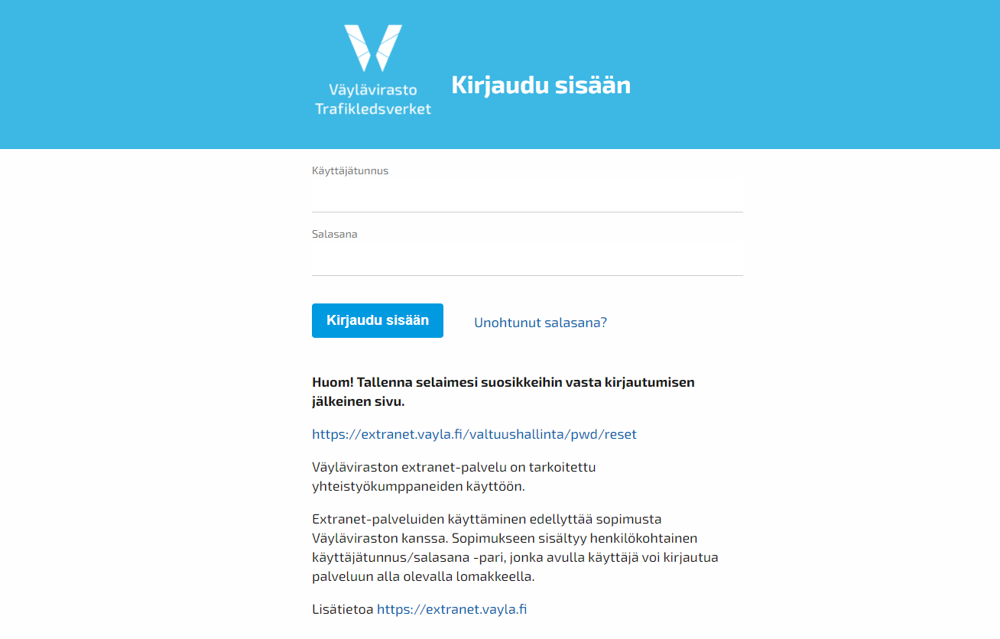

Anv&auml;ndarmanual f&ouml;r applikationen Digiroad
=========================================

__Obs! Anv&auml;ndarmanual har uppdaterats i 18.5.2015!__

__Obs! Vi rekommenderar att man anv&auml;nder Firefox eller Chrome f&ouml;r att uppdatera Digiroad-data med applikationen.__

1. Hur kommer man i g&aring;ng?
-----------------------

1. F&ouml;r att anv&auml;nda Digiroad beh&ouml;vs Trafikverkets anv&auml;ndarnamn och l&ouml;senord. Den som inte har anv&auml;ndarnamn/l&ouml;senord kan best&auml;lla dem fr&aring;n Digiroad-tj&auml;nsten: info@digiroad.fi eller 040-507 2301.

1. Man loggar in i webbapplikationen Digiroad p&aring; adressen:  <a href=https://testiextranet.liikennevirasto.fi/digiroad/ target="_blank">https://testiextranet.liikennevirasto.fi/digiroad/. </a>

1. Som inloggad kan man i kartgr&auml;nssnittet &ouml;ppna ett visningsl&auml;ge &ouml;ver omr&aring;det som anv&auml;ndaren har r&auml;ttighet till. R&auml;ttigheterna har begr&auml;nsats b&aring;de geografiskt och enligt anv&auml;ndarens roll. Anv&auml;ndaren kan se sidan antingen i  __visningl&auml;ge__ eller __redigeringsl&auml;ge__. I visningsl&auml;get har man endast r&auml;tt att titta p&aring; materialet. I redigeringsl&auml;get kan man b&aring;de titta p&aring; och redigera materialet.


R&auml;ttigheterna f&ouml;rdelas geografiskt enligt f&ouml;ljande:

- Utan Digiroad-r&auml;ttigheter kommer man &aring;t att titta p&aring; allt material med Trafikverkets anv&auml;ndarnamn och l&ouml;senord.
- Applikationens anv&auml;ndare har r&auml;ttighet till allt material eller bara till h&aring;llplatsmaterial inom de geografiska kommungr&auml;nser som fastslagits f&ouml;r anv&auml;ndaren.
- Digiroad-operat&ouml;ren har r&auml;ttighet till hela landets material.

Om det efter inloggningen inte &ouml;ppnas ett visningsl&auml;ge i kartgr&auml;nssnittet, s&aring; saknar den inloggade personen Digiroad-r&auml;ttigheter. I s&aring; fall ska man ta kontakt med Digiroad-tj&auml;nsten: info@digiroad.fi eller 040-507 2301.

1.1 Varifr&aring;n f&aring;r man hj&auml;lp?
--------------------------

Via Digiroad-tj&auml;nsten f&aring;r man de anv&auml;ndarnamn/l&ouml;senord och anv&auml;ndarr&auml;ttigheter som kr&auml;vs f&ouml;r webbapplikationen. Via tj&auml;nsten f&aring;r man ocks&aring; hj&auml;lp att anv&auml;nda applikationen i problemsituationer. Tj&auml;nsten svarar p&aring; telefonsamtal och e-postmeddelande vardagar kl. 9–16.

Kontaktuppgifter:

Digiroad-tj&auml;nsten:
info@digiroad.fi
p. 040-507 2301
 <a href=http://www.digiroad.fi/ target="_blank">http://www.digiroad.fi/ </a>

&auml;renden g&auml;llande h&aring;llplatser:
pysakit@digiroad.fi

1.2 Ofta st&auml;llda fr&aring;gor och problemsituationer
----------------------------------------------

Ofta st&auml;llda fr&aring;gor om hur man anv&auml;nder Digiroad-applikationen har samlats p&aring; Digiroad-webbsidan. Till ofta st&auml;llda fr&aring;gor kommer du <a href=http://www.digiroad.fi/yllapito/fi_FI/pysakkiohjeet/  target="_blank">h&auml;rifr&aring;n. </a>

####Problemsituationer#####

Om applikationen inte fungerar som den ska (t.ex. allt material laddas inte upp p&aring; r&auml;tt s&auml;tt), g&ouml;r s&aring; h&auml;r:

- Ladda upp sidan p&aring; nytt genom att trycka p&aring; F5-knappen.
- Kontrollera att du anv&auml;nder en uppdaterad version av webbl&auml;saren (helst Firefox eller Chrome). 
- Om detta inte &aring;tg&auml;rdar problemet, kontakta Digiroad-tj&auml;nsten: info@digiroad.fi 

####Logga in i Digiroad-applikationen####

Man loggar in i webbapplikationen Digiroad p&aring; adressen:  <a href=https://testiextranet.liikennevirasto.fi/digiroad/  target="_blank">https://testiextranet.liikennevirasto.fi/digiroad/. </a>F&ouml;r inloggning kr&auml;vs ett f&ouml;r Trafikverket giltigt anv&auml;ndarnamn och l&ouml;senord. Anv&auml;ndarnamn/l&ouml;senord f&aring;s via Digiroad-tj&auml;nsten (se [Hur kommer man i g&aring;ng?](#1._Hur_kommer_man_i_g&aring;ng?)).



_Logga in i Digiroad._

Efter inloggningen &ouml;ppnas ett visningsl&auml;ge i kartgr&auml;nssnittet. Geografiskt syns det omr&aring;de p&aring; kartan, som anv&auml;ndaren har r&auml;ttigheter till (se [Hur kommer man i g&aring;ng?](#1._Hur_kommer_man_i_g&aring;ng?)).


_Visningsl&auml;get i kartgr&auml;nssnittet._

Om det efter inloggningen inte &ouml;ppnas ett visningsl&auml;ge i kartgr&auml;nssnittet, saknar anv&auml;ndaren r&auml;ttigheter till Digiroad-applikationen. Digiroad-r&auml;ttigheter kan beg&auml;ras via Digiroad-tj&auml;nsten (se  [Hur kommer man i g&aring;ng?](#1._Hur_kommer_man_i_g&aring;ng?)).

2. Allm&auml;nt
----------

Applikationen har tv&aring; l&auml;gen: visningsl&auml;ge och redigeringsl&auml;ge. En anv&auml;ndare som bara har r&auml;tt att titta p&aring; materialet kan bara &ouml;ppna visningl&auml;get. En anv&auml;ndare som ocks&aring; har r&auml;tt att redigera materialet kan &ouml;ppna b&aring;de visnings- och redigeringsl&auml;get. Efter inloggningen &ouml;ppnas visningsl&auml;get, d&auml;r man endast kan titta p&aring; olika dataslag, till exempel h&aring;llplatser eller hastighetsbegr&auml;nsningar. Dataslagen redigeras i redigeringsl&auml;get. I b&aring;da l&auml;gena syns endast de dataslag som anv&auml;ndaren har r&auml;ttigheter till (se [Hur kommer man i g&aring;ng?](#1._Hur_kommer_man_i_g&aring;ng?)). Man kan v&auml;lja ett dataslag i g&aring;ngen p&aring; kartan. Dataslaget v&auml;ljs ur paletten Dataslag (1) i sidans v&auml;nstra balk.

Redigeringsl&auml;get kan aktiveras enligt dataslag genom att klicka p&aring; knappen "G&aring; till redigeringsl&auml;ge / Siirry muokkaustilaan" (3). I &ouml;vre delen av kartan i redigeringsl&auml;get st&aring;r texten "Du anv&auml;nder redigeringsl&auml;get. Kommunanv&auml;ndare ska g&ouml;ra &auml;ndringarna i gatun&auml;tet, NTM-anv&auml;ndare i landsv&auml;gsn&auml;tet." (14). &auml;ndringarna som gjorts i redigeringsl&auml;get sparas genom att trycka p&aring; knappen "Spara / Tallenna" (15). Efter att &auml;ndringarna sparats, sparas redigerarens anv&auml;ndarnamn, datum och klockslag i dataslaget under ”Senast &auml;ndrat”. &auml;ndringar kan &aring;ngras genom att trycka p&aring; knappen "&aring;ngra / Peruuta" (16). Knapparna "Spara / Tallenna" och "&aring;ngra / Peruuta" &auml;r inte aktiva, om det inte har gjorts &auml;ndringar. Om man har gjort &auml;ndringar, men varken &aring;ngrar eller sparar dem, utan forts&auml;tter att redigera n&aring;got annat eller st&auml;nger redigeringsl&auml;get i ett &ouml;ppet dataslag, s&aring; meddelar applikationen att &auml;ndringar har gjorts och att dessa b&ouml;r sparas eller &aring;ngras innan man kan forts&auml;tta. Man g&aring;r tillbaka till visningsl&auml;get genom att klicka p&aring; knappen "G&aring; till visningsl&auml;ge / Siirry katselutilaan" (11).

Alla dataslag syns i b&aring;de visnings- och redigeringsl&auml;get bara om kartan har skalan 1:20 000 eller mindre. Applikationen meddelar om kartans skala &auml;r f&ouml;r inexakt f&ouml;r att dataslaget ska kunna visas.


_Visningsl&auml;ge._


_Redigeringsl&auml;ge._

2.1 Redigering av kartf&ouml;nstret
--------------------------

####Flytta kartan####

Kartan flyttas genom att dra den.

####Kartans skala####

Kartans skala &auml;ndras antingen genom att anv&auml;nda musen, dubbelklicka, trycka Shift+ritverktyg (omr&aring;de) eller anv&auml;nda knapparna f&ouml;r skala (7). Genom att anv&auml;nda knapparna f&ouml;r skala h&aring;lls kartans centrering of&ouml;r&auml;ndrad. D&aring; man anv&auml;nder musen, dubbelklickar eller trycker Shift+ ritverktyg (omr&aring;de) centreras kartan till det st&auml;lle d&auml;r kursorn &auml;r. Den anv&auml;nda skalan syns i kartans nedre v&auml;nstra h&ouml;rn (9).

####Koordinats&ouml;kning####

I anv&auml;ndargr&auml;nssnittet finns en koordinats&ouml;kning (2) som centrerar kartans mittpunkt till den s&ouml;kta koordinatpunkten. Mittpunkten &auml;r utm&auml;rkt p&aring; kartan med en mark&ouml;r. Mark&ouml;ren f&aring;s bort genom att klicka bort alternativet "Visa mark&ouml;ren  /N&auml;yt&auml; kohdistin". 

Knappen "Flytta / Siirry" centrerar kartan till den s&ouml;kta punkten och knappen "Markera / Merkitse" skapar en markering p&aring; den s&ouml;kta punkten. Markeringen blir kvar p&aring; kartan tills man s&ouml;ker en ny position &aring;t den. I inmatningsf&auml;ltet f&ouml;r man in Nord-koordinaten (7 tecken) och Ost-koordinaten (6 tecken) som heltal med en meters noggrannhet i ETRS35FIN-koordinatsystemet. Koordinaterna &aring;tskiljs med kommatecken. Till exempel:

```
6901839,435323
```

I koordinats&ouml;kningen kan man bara f&ouml;ra in koordinater som finns p&aring; applikationens karta. Om koordinaterna inte finns p&aring; kartan, meddelar applikationen "Koordinaterna finns inte p&aring; kartan". Man kan inte f&ouml;ra  in bokst&auml;ver eller m&auml;rken. Om man har f&ouml;rt in fel teckenf&ouml;ljd, s&aring; meddelar applikationen "Anv&auml;nd sifferv&auml;rden i koordinaterna N och O".
####Bakgrundskartor####

Som bakgrundskarta kan man v&auml;lja en terr&auml;ngkarta, ett ortofoto eller en bakgrundskartserie. (8)


_Redigering av kartf&ouml;nstret._

3. V&auml;gl&auml;nkar
------------

En v&auml;gl&auml;nk &auml;r den minsta enheten i v&auml;gars, gators, g&aring;ng- och cykelv&auml;gars eller f&auml;rjef&ouml;rbindelsers mittlinjegeometri. V&auml;gl&auml;nkens egenskapsdata g&auml;ller alltid f&ouml;r v&auml;gl&auml;nkens hela str&auml;cka. V&auml;gl&auml;nkarna v&auml;ljs till kartf&ouml;nstret genom att v&auml;lja V&auml;gl&auml;nkar ur paletten Dataslag (1).


_V&auml;gl&auml;nkar._

####S&ouml;kning av v&auml;gl&auml;nkar####

V&auml;gl&auml;nkar s&ouml;ks med en URL-adress som  identifierats med v&auml;gl&auml;nkens MML-ID. Exempel p&aring;  URL-adress:

 <a href=https://testiextranet.liikennevirasto.fi/digiroad/#linkProperty/373320541 target="_blank">https://testiextranet.liikennevirasto.fi/digiroad/#linkProperty/373320541 </a>

d&auml;r nummerserien 373320541 &auml;r v&auml;gl&auml;nkens MML-ID. Funktionen fokuserar visningsl&auml;get till den s&ouml;kta v&auml;gl&auml;nken i kartgr&auml;nssnittet. V&auml;gl&auml;nkens egenskapsdataf&ouml;nster &ouml;ppnas i sidans h&ouml;gra balk.

##Visning av v&auml;gl&auml;nkens uppgifter##

En enskild v&auml;gl&auml;nks egenskapsdata syns, d&aring; man klickar p&aring; v&auml;gl&auml;nkens geometri p&aring; kartan (4). D&auml;refter framh&auml;vs v&auml;gl&auml;nkens geometri p&aring; kartan och dess egenskapsdata &ouml;ppnas i egenskapsdataf&ouml;nstret (6). V&auml;gl&auml;nkens egenskapsdata &auml;r v&auml;gl&auml;nkens ID, Lantm&auml;teriverkets ID (MML ID) den administrativa klassen, den funktionella klassen, trafikfl&ouml;desriktningen och typen av v&auml;gl&auml;nk.

Man kan v&auml;lja visualisering f&ouml;r v&auml;gl&auml;nkarna i paletten Dataslag (1) under v&auml;gl&auml;nkar. Visualisering kan v&auml;ljas enligt funktionell klass, typ av v&auml;gl&auml;nk eller administrativ klass. Visualiseringens definitioner syns i paletten Dataslag enligt hur man valt. Dessutom har det visualiserats en pil f&ouml;r v&auml;gl&auml;nken, om v&auml;gl&auml;nkens trafikfl&ouml;de bara g&aring;r i en riktning.

Den funktionella klassen definieras enligt f&ouml;ljande:

Klass 1: Standardv&auml;rde riksv&auml;g eller regional huvudgata
Klass 2: Standardv&auml;rde stamv&auml;g eller regional huvudgata
Klass 3: Standardv&auml;rde regionv&auml;g eller regional huvudgata
Klass 4: Standardv&auml;rde f&ouml;rbindelsev&auml;g eller matargata
Klass 5: Anslutningsgata, viktig enskild v&auml;g
Klass 6: Annan enskild v&auml;g
Klass 7: K&ouml;rstig
Klass 8: G&aring;ng-och cykelv&auml;g


_V&auml;gl&auml;nkarna visualiserade enligt funktionell klass._


_V&auml;gl&auml;nkarna visualiserade enligt v&auml;gl&auml;nkens typ._


_V&auml;gl&auml;nkarna visualiserade enligt administrativ klass._

##Redigering av v&auml;gl&auml;nkens egenskapsdata##

Egenskapsdata f&ouml;r en enskild v&auml;gl&auml;nk kan redigeras i redigeringsl&auml;get. V&auml;lj v&auml;gl&auml;nken som ska redigeras genom att klicka med musen.

Av v&auml;gl&auml;nkens egenskapsdata kan man redigera den funktionella klassen, trafikfl&ouml;desriktningen och v&auml;gl&auml;nkens typ.


_Redigering av v&auml;gl&auml;nkens egenskapsdata._

4. Kollektivtrafikens h&aring;llplatser
--------------------------------

Till kollektivtrafikens h&aring;llplatser h&ouml;r h&aring;llplatserna f&ouml;r bussar i lokaltrafik, bussar i fj&auml;rrtrafik, snabbtursbussar och sp&aring;rvagnar samt de virtuella h&aring;llplatserna. V&auml;lj h&aring;llplatser till kartf&ouml;nstret genom att v&auml;lja Kollektivtrafikens h&aring;llplatser fr&aring;n paletten Dataslag (1). H&aring;llplatserna v&auml;ljs enligt h&aring;llplatsens status: befintliga, kommande och/eller indragna. Valet av h&aring;llplats fungerar p&aring; samma s&auml;tt i b&aring;de visnings- och redigeringsl&auml;get.

I h&aring;llplatsf&ouml;nstret &auml;r utg&aring;ngsl&auml;get f&ouml;r v&auml;gl&auml;nkarna att det f&auml;rgmarkerade alternativet Administrativ klass &auml;r valt. Detta kan &auml;ndras genom att klicka bort alternativet Administrativ klass under "Kollektivtrafikens h&aring;llplatser" i menyn Dataslag (1). Bl&aring; f&auml;rg betyder att v&auml;gl&auml;nken &auml;r i privat &auml;go, gr&ouml;n f&auml;rg att kommunen &auml;r &auml;gare och r&ouml;d f&auml;rg att staten &auml;r &auml;gare. V&auml;gl&auml;nkar med gr&aring; f&auml;rg betyder att &auml;garen &auml;r ok&auml;nd. 


_Val av h&aring;llplats i kollektivtrafiken._

####S&ouml;kning av kollektivtrafikens h&aring;llplats####

Kollektivtrafikens h&aring;llplatser s&ouml;ks med en URL-adress som identifierats med h&aring;llplatsens nationella ID. F&ouml;r att man ska kunna s&ouml;ka en h&aring;llplats, m&aring;ste h&aring;llplatsf&ouml;nstret vara &ouml;ppet i applikationen. Exempel p&aring;  URL-adress:

 <a href=https://testiextranet.liikennevirasto.fi/digiroad/#/asset/95374  target="_blank">https://testiextranet.liikennevirasto.fi/digiroad/#/asset/95374  </a>(17)

d&auml;r nummerserien 95374 &auml;r h&aring;llplatsens nationella ID. Funktionen fokuserar visningsl&auml;get till den s&ouml;kta h&aring;llplatsen i kartgr&auml;nssnittet. H&aring;llplatsens egenskapsdataf&ouml;nster (6) &ouml;ppnas i sidans h&ouml;gra balk.


_S&ouml;kning av kollektivtrafikens h&aring;llplatser._

##Visning av h&aring;llplatsens uppgifter##

Uppgifterna f&ouml;r en enskild h&aring;llplats visas d&aring; man klickar p&aring; h&aring;llplatsen. D&auml;refter &ouml;ppnas f&ouml;nstren Google Street View (5) och egenskapsdata (6) i sidans h&ouml;gra balk. F&ouml;r den valda h&aring;llplatsen &ouml;ppnas en inforuta med h&aring;llplatsens riksomfattande ID, namnet p&aring; finska, trafikeringsb&auml;ringen, och typen av h&aring;llplats i bildform. (4)

Om tv&aring; eller flera h&aring;llplatser ligger mindre &auml;n sex meter fr&aring;n varandra, visas h&aring;llplatserna i anv&auml;ndargr&auml;nssnittet i grupper ovanp&aring; varandra. Den &ouml;verlappande placeringen g&ouml;r det m&ouml;jligt att granska en h&aring;llplats utan att f&ouml;r den skull beh&ouml;va flytta h&aring;llplatser som ligger p&aring; samma st&auml;lle. 

I egenskapsdata-l&auml;get &auml;r det inte m&ouml;jligt att redigera f&auml;lt. Genom att klicka p&aring; bilden Google Street View &ouml;ppnas Google Street View i en ny flik. Valet av h&aring;llplats f&aring;s bort genom att klicka p&aring; kartan.


_Visning av uppgifterna f&ouml;r kollektivtrafikens h&aring;llplatser._

####Flytande h&aring;llplatser####

En h&aring;llplats f&ouml;r kollektivtrafik kan vara flytande, om v&auml;gl&auml;nksgeometrin under den har &auml;ndrats s&aring; mycket, att systemet inte l&auml;ngre kan fastst&auml;lla dess position med hj&auml;lp av geometrin. De flytande h&aring;llplatserna har m&auml;rkts ut i kartf&ouml;nstret enligt bilden nedan och i egenskapsdataf&ouml;nstret finns en anm&auml;rkning om att h&aring;llplatsen borde flyttas till en v&auml;gl&auml;nk f&ouml;r att inte l&auml;ngre vara flytande (se  [Flytta h&aring;llplats](#Flytta_h&aring;llplats)). 


_Olika s&auml;tt att visualisera flytande h&aring;llplatser._

En lista &ouml;ver de flytande h&aring;llplatserna finns <a href=https://testiextranet.liikennevirasto.fi/digiroad/floatingstops.html target="_blank">h&auml;r. </a>I listan finns en l&auml;nk fr&aring;n de flytande h&aring;llplatserna och via den kommer man direkt till h&aring;llplatsen i applikationen och kan flytta den tillbaka till geometrin.


_Lista &ouml;ver flytande h&aring;llplatser._

##Redigering av dataegenskaper f&ouml;r h&aring;llplatser inom kollektivtrafiken##

V&auml;lj redigeringsverktyget (12) f&ouml;r att redigera egenskapsdata f&ouml;r en enskild h&aring;llplats. V&auml;lj h&aring;llplatsen som ska redigeras genom att klicka med musen. Av h&aring;llplatser som visas ovanp&aring; varandra kan man v&auml;lja en h&aring;llplats genom att klicka p&aring; den. En h&aring;llplats som valts ur en stack kan urskiljas genom inforutan som &ouml;ppnas f&ouml;r h&aring;llplatsen. D&auml;refter &ouml;ppnas ett f&ouml;nster &ouml;ver h&aring;llplatsen i Google Street View (5) samt h&aring;llplatsens egenskapsdata (6). Om h&aring;llplatsen saknar typ, ska denna f&ouml;ras in innan man sparar. Om det saknas obligatorisk information om h&aring;llplatsen syns ett meddelande i h&aring;llplatsens egenskapsdataf&ouml;nster.

Efter att ha sparat eller &aring;ngrat n&aring;got i h&aring;llplatsens f&ouml;nster, l&auml;mnar man det genom att klicka p&aring; kartan. 


_Redigering av dataegenskaper f&ouml;r h&aring;llplatser inom kollektivtrafiken._

####&auml;ndra h&aring;llplatsens verkningsriktning####

Google Street View-f&ouml;nstret (5) i sidans h&ouml;gra balk har riktats i den riktning som verkningsriktningen som sparats f&ouml;r h&aring;llplatsen f&ouml;ruts&auml;tter. D&aring; man klickar p&aring; f&ouml;nstret &ouml;ppnas fliken Google Street View, d&auml;r man noggrannare kan studera omgivningen kring h&aring;llplatsen. P&aring; kartan syns verkningsriktningen som en droppe p&aring; h&aring;llplatsikonen (10). Toppen p&aring; droppen pekar i samma riktning som h&aring;llplatsens verkningsriktning.

Man kan &auml;ndra h&aring;llplatsens verkningsriktning i egenskapsdataf&ouml;nstret (6) genom att trycka p&aring; knappen "&auml;ndra riktning / Vaihda suuntaa" (18). &auml;ndringen av h&aring;llplatsens verkningsriktning g&ouml;r att ocks&aring; Google Street View-f&ouml;nstret (5) &auml;ndras s&aring; att det motsvarar den nya verkningsriktningen och riktningen p&aring; droppen byts.


_Verkningsriktningen f&ouml;r kollektivtrafikens h&aring;llplatser kan &auml;ndras i egenskapsdataf&ouml;nstret (6) genom att trycka p&aring; knappen "&auml;ndra riktning / Vaihda suuntaa" (18)._

####Redigering av h&aring;llplatsens giltighetsdatum####

Med det f&ouml;rsta giltighetsdatumet (19) avses datumet fr&aring;n om med vilket h&aring;llplatsen anv&auml;nds. Med det sista giltighetsdatumet (20) avses datumet d&aring; h&aring;llplatsen anv&auml;nds f&ouml;r sista g&aring;ngen. B&aring;da datumen kan redigeras i egenskapsdataf&ouml;nstret (6). Datumen kan antingen redigeras genom att skriva in dem i datumf&auml;ltet i formatet dd.mm.&aring;&aring;&aring;&aring; eller genom att v&auml;lja dem i kalendern, som &ouml;ppnas d&aring; man klickar p&aring; datumf&auml;ltet.

Motstridiga datum kan inte f&ouml;ras in s&aring; att "F&ouml;rsta giltighetsdatum" infaller senare &auml;n "Sista giltighetsdatum". De icke-till&aring;tna datumen i kalendern kan inte v&auml;ljas. Om man skriver in ett motstridigt datum i datumf&auml;ltet, kan det inte sparas.

Om "F&ouml;rsta giltighetsdatum" eller "Sista giltighetsdatum" inte &auml;r fastslagna, kan man v&auml;lja alternativet "ingen information" i kalendern.


_Redigering av h&aring;llplatsens giltighetsdatum._

####Redigering av h&aring;llplatsens &ouml;vriga egenskapsdata####

&ouml;vriga egenskapsdata kan redigeras i f&ouml;nstret egenskapsdata (6) i sidans h&ouml;gra balk. Redigera data antingen genom att skriva in i dataf&auml;ltet, v&auml;lja data fr&aring;n rullgardinsmenyn eller genom att kryssa i r&auml;tt data i respektive ruta.


_Redigering av dataegenskaper f&ouml;r h&aring;llplatser inom kollektivtrafiken._

####Egenskapsdata:####

Egenskapsdata genereras antingen av systemet eller f&ouml;rs in av anv&auml;ndaren. De inmatningsbara f&auml;lten f&ouml;r egenskapsdata &auml;r textf&auml;lt, d&auml;r egenskapsdata skrivs in antingen som teckenstr&auml;ng, som flerval d&auml;r man kan v&auml;lja r&auml;tt alternativ, eller som rullgardinsmenyer d&auml;r man kan v&auml;lja ett alternativ.

|Egenskapsdata|Beskrivning|Applikationen genererar|
|---------------|------|----------------|
|Valtakunnallinen ID/Landsomfattande ID|H&aring;llplatsens landsomfattande ID|X|
|Lis&auml;tty j&auml;rjestelm&auml;&auml;n/Lagts till i systemet|Anv&auml;ndaridentifikation f&ouml;r den som skapat uppgiften eller k&auml;llan till massimporten och tidpunkten d&aring; uppgiften lagts till.|X|
|Muokattu viimeksi/Senast &auml;ndrat|Redigerarens anv&auml;ndaridentifikation och tidpunkten d&aring; uppgiften har &auml;ndrats.|X|
|Liikenn&ouml;intisuuntima/Trafikeringsb&auml;ring|Applikationen ber&auml;knar sj&auml;lv p&aring; basis av v&auml;ggeometrin. Nord &auml;r noll grader och hela varvet medurs 360 grader. Meddelar nord, ost, syd eller v&auml;st enligt gradtalet.|X|
|Nimi suomeksi/Namnet p&aring; finska|H&aring;llplatsens namn p&aring; finska. Namnet ska vara identifierbart p&aring; ett riksomfattande plan. T.ex. Inte "Busstationen" utan "Borg&aring; busstation".||
|Nimi ruotsiksi/Namnet p&aring; svenska|H&aring;llplatsens namn p&aring; svenska.||
|Tietojen yll&auml;pit&auml;j&auml;/Datauppdaterare|Uppdaterande myndighet: kommunen, Helsingfors regionaltrafik eller NTM-centralen.||
|Yll&auml;pit&auml;j&auml;n tunnus/Uppdaterarens kod|Datauppdaterarens interna kod f&ouml;r h&aring;llplatsen.||
|LIVI-tunnus/Trafikverkets kod|Trafikverkets kod f&ouml;r h&aring;llplatsen; motsvarar den i V&auml;gdatabanken. Anv&auml;nds bara f&ouml;r h&aring;llplatser l&auml;ngs landsv&auml;gar.||
|Matkustajatunnus/Passagerarkod|H&aring;llplatsens kod, som visas f&ouml;r passagerarna.||
|Maastokoordinaatti X/Terr&auml;ngkoordinaten X|X-koordinat som m&auml;ter h&aring;llplatsens position: EUREF FIN ETRS89-TM35FIN.||
|Maastokoordinaatti Y/Terr&auml;ngkoordinaten Y|Y-koordinat som m&auml;ter h&aring;llplatsens position: EUREF FIN ETRS89-TM35FIN.||
|Maastokoordinaatti Z/Terr&auml;ngkoordinaten Z|Z-koordinat som m&auml;ter h&aring;llplatsens position: I h&ouml;jdsystemet N2000.||
|Liikenn&ouml;intisuunta/Trafikeringsriktning|H&aring;llplatsens riktning beskriven med ord. Till exempel: "Till centrum".||
|Vaikutussuunta/Verkningsriktning|Verkningsriktningen har visualiserats som trafikfl&ouml;dets riktning fr&aring;n h&aring;llplatsen med en droppe (9). Google Street View (4) visar i den riktning d&auml;r h&aring;llplatsen antas ligga.||
|Ensimm&auml;inen voimassaolop&auml;iv&auml;/F&ouml;rsta giltighetsdatum|Datum d&aring; h&aring;llplatsen anv&auml;nds f&ouml;r f&ouml;rsta g&aring;ngen.||
|Viimeinen voimassaolop&auml;iv&auml;/Sista giltighetsdatum|Datum d&aring; h&aring;llplatsen anv&auml;nds f&ouml;r sista g&aring;ngen.||
|Pys&auml;kin tyyppi/Typ av h&aring;llplats| __Obligatorisk information!__ Bussar i lokaltrafik, sp&aring;rvagn, bussar i fj&auml;rrtrafik, snabbtursbussar eller virtuell h&aring;llplats.||
|Aikataulu/Tidtabell|Tidtabell av papper i en ram som f&auml;sts p&aring; h&aring;llplatsens v&auml;gg eller en stolpe. Den inneh&aring;ller information om avg&aring;ngstiderna f&ouml;r rutterna som trafikerar h&aring;llplatsen samt eventuellt ocks&aring; en h&aring;llplatsspecifik tidtabell. M&ouml;jliga v&auml;rden: ja, nej eller ingen information.  Standardv&auml;rdet &auml;r "ingen information."||
|Katos/Skyddstak|Tak vid h&aring;llplatsen som skyddar v&auml;ntande kollektivtrafikpassagerare mot d&aring;ligt v&auml;der. M&ouml;jliga v&auml;rden: ja, nej eller ingen information. Standardv&auml;rdet &auml;r "ingen information."||
|Mainoskatos/Reklamtak|Tak vid h&aring;llplatsen som skyddar v&auml;ntande kollektivtrafikpassagerare mot d&aring;ligt v&auml;der och som inneh&aring;ller reklam. Underh&aring;llet av s&aring;dana h&aring;llplatser sk&ouml;ts av den som uppr&auml;tth&aring;ller reklamen. M&ouml;jliga v&auml;rden: ja, nej eller ingen information. Standardv&auml;rdet &auml;r "ingen information."||
|Penkki/B&auml;nk|B&auml;nk p&aring; h&aring;llplatsen f&ouml;r passagerare som v&auml;ntar p&aring; kollektivtrafik. B&auml;nken st&aring;r vanligen under ett skyddstak. M&ouml;jliga v&auml;rden: ja, nej eller ingen information. Standardv&auml;rdet &auml;r "ingen information."||
|Py&ouml;r&auml;teline/Cykelst&auml;llning|Ja, nej eller ingen information. Standardv&auml;rdet &auml;r "ingen information."||
|S&auml;hk&ouml;inen aikataulun&auml;ytt&ouml;/Elektronisk tidtabellssk&auml;rm|Elektronisk tidtabellssk&auml;rm p&aring; h&aring;llplatsen som producerar information i realtid om h&aring;llplatsens trafikering. M&ouml;jliga v&auml;rden: ja, nej eller ingen information. Standardv&auml;rdet &auml;r "ingen information."||
|Valaistus/Belysning|Med h&aring;llplatsbelysning avses ljuselement som oftast &auml;r inf&auml;llda i taket och lyser upp utrymmet under h&aring;llplatsens tak. M&ouml;jliga v&auml;rden: ja, nej eller ingen information. Standardv&auml;rdet &auml;r "ingen information."||
|Esteett&ouml;myys liikuntarajoitteiselle/Tillg&auml;nglighet f&ouml;r r&ouml;relsehindrade personer|H&aring;llplatsen &auml;r tillg&auml;nglig, vilket m&ouml;jligg&ouml;r sj&auml;lvst&auml;ndigt, obehindrat resande och v&auml;ntande f&ouml;r specialgrupper, t.ex. personer i rullstol. H&aring;llplatsens tillg&auml;nglighet beror p&aring; hur tillg&auml;nglig h&aring;llplats- och plattformskonstruktionerna, stations- och terminalkonstruktionerna och  tidtabellsinformationen &auml;r. Standardv&auml;rdet &auml;r "ingen information."||
|Saattomahdollisuus henkil&ouml;autolla/M&ouml;jligheter f&ouml;r ledsagare med personbil|Anger om det p&aring; en h&aring;llplats (vid riksv&auml;g) har byggs ett separat omr&aring;de f&ouml;r avl&auml;mning/upph&auml;mtning av passagerare. M&ouml;jliga v&auml;rden: ja, nej eller ingen information. Standardv&auml;rdet &auml;r "ingen information."||
|Liitynt&auml;pys&auml;k&ouml;intipaikkojen m&auml;&auml;r&auml;/Antalet infartsparkeringsplatser|Antalet parkeringsplatser som reserverats f&ouml;r bilar som parkeras i n&auml;rheten av h&aring;llplats- eller terminalomr&aring;det utanf&ouml;r centrum. F&auml;ltet l&auml;mnas tomt, om det inte finns infartsparkeringsplatser. Om infartsparkeringsplatserna anv&auml;nds f&ouml;r flera h&aring;llplatser, fylls informationen om infartsparkeringen i skilt f&ouml;r varje h&aring;llplats.||
|Liitynt&auml;pys&auml;k&ouml;innin lis&auml;tiedot/Ytterligare information om infartsparkering|Ytterligare information om infartsparkeringsplatserna i samband med en h&aring;llplats.||
|Pys&auml;kin omistaja/H&aring;llplatsens &auml;gare|Kommunen, Helsingfors regionaltrafik, NTM-centralen eller Trafikverket. I specialfall (t.ex. NTM-centralen i Nyland).||
|Palauteosoite/Adress f&ouml;r respons|Adress till vilken man kan skicka respons om h&aring;llplatser. Till exempel en e-postadress.||
|Lis&auml;tiedot/Ytterligare uppgifter|Offentliga kommentarer. Till exempel: "V&auml;garbete p&aring;g&aring;r i omr&aring;det".||

####Flytta h&aring;llplats####

Flytta en h&aring;llplats med redigeringsverktyget (12). H&aring;llplatser kan bara flyttas i tillr&auml;ckligt detaljerad skala, som &auml;r 1:10 000 eller mindre (9).

Flytta h&aring;llplatsen genom att ta tag i den och dra den till r&auml;tt st&auml;lle. H&aring;llplatsen kan bara flyttas l&auml;ngs befintliga v&auml;gl&auml;nkar (inte l&auml;ngs g&aring;ng- och cykelv&auml;gar eller f&auml;rjerutter) och inom de geografiska gr&auml;nser som anv&auml;ndarens uppdateringsr&auml;ttigheter till&aring;ter. Om h&aring;llplatsen l&ouml;sg&ouml;rs fr&aring;n v&auml;gl&auml;nken s&aring; fastnar den automatiskt i den n&auml;rmaste v&auml;gl&auml;nken som finns p&aring; det geografiska omr&aring;det som anv&auml;ndarens uppdateringsr&auml;ttigheter till&aring;ter. Om det inte finns n&aring;gon annan v&auml;gl&auml;nk tillr&auml;ckligt n&auml;ra, s&aring; g&aring;r det inte att l&ouml;sg&ouml;ra h&aring;llplatsen fr&aring;n l&auml;nken den &auml;r p&aring;. V&auml;gl&auml;nken d&auml;r h&aring;llplatsen st&aring;r &auml;r markerad med bl&aring; f&auml;rg. D&aring; man sl&auml;pper h&aring;llplatsen (sl&auml;pper ner den p&aring; en ny plats), &ouml;ppnas i sidans h&ouml;gra balk Google Street View (5) och dataegenskapsf&ouml;nstret (6), i vilket man kan redigera &ouml;vriga egenskapsdata. Fast h&aring;llplatsen flyttas, &auml;ndras inte terr&auml;ngkoordinaterna som m&auml;tts f&ouml;r h&aring;llplatsen, utan dessa f&ouml;rblir of&ouml;r&auml;ndrade. Spara h&aring;llplatsens nya position genom att trycka p&aring; knappen ”Spara / Tallenna” (15). Genom att trycka p&aring; knappen ”&aring;ngra / Peruuta” (16) flyttas h&aring;llplatsen tillbaka till sin ursprungliga plats. Om h&aring;llplatsens typ inte har angetts, b&ouml;r man komplettera detta innan man sparar. Om det saknas obligatorisk information om h&aring;llplatsen visas ett meddelande i h&aring;llplatsens egenskapsdataf&ouml;nster.

D&aring; man flyttar en h&aring;llplats som ligger i en stack, bildas en lucka f&ouml;r h&aring;llplatsen som ska flyttas till stacken tills flyttningen har sparats eller &aring;ngrats. Om h&aring;llplatsen flyttas n&auml;rmare &auml;n sex meter fr&aring;n en annan h&aring;llplats/andra h&aring;llplatser, blir h&aring;llplatsen en del av stacken.

Flytten av h&aring;llplatsen m&aring;ste sparas eller &aring;ngras innan man kan forts&auml;tta redigera andra h&aring;llplatser eller l&auml;mna redigeringsl&auml;get. Applikationen meddelar om den gjorda &auml;ndringen genom ett inl&auml;gg i &auml;ndringsdialogen.


_Flytta en h&aring;llplats inom kollektivtrafiken._

####L&auml;gga till en ny h&aring;llplats####

Nya h&aring;llplatser kan l&auml;ggas till d&aring; skalan &auml;r 1:10 000 eller mindre. Den h&auml;r skalan &auml;r en niv&aring; noggrannare &auml;n den yttersta niv&aring;n p&aring; skalan d&auml;r h&aring;llplatserna visas. L&auml;gg till en ny h&aring;llplats genom att klicka med verktyget ”L&auml;gg till” (13) i kartans v&auml;gn&auml;t p&aring; den &ouml;nskade positionen f&ouml;r h&aring;llplatsen. Om det inte finns n&aring;gon v&auml;gl&auml;nk p&aring; den valda platsen, skapas h&aring;llplatsen vid den n&auml;rmaste v&auml;gl&auml;nken. Om man f&ouml;rs&ouml;ker skapa h&aring;llplatsen f&ouml;r l&aring;ngt fr&aring;n den n&auml;rmaste v&auml;gl&auml;nken, s&aring; skapas ingen h&aring;llplats. En ny h&aring;llplats markeras med bl&aring; f&auml;rg (4) och i sidans h&ouml;gra balk &ouml;ppnas Google Street View (5) och dataegenskapsf&ouml;nstret (6), i vilket man sparar h&aring;llplatsens egenskapsdata.

Om man inte har definierat alla egenskapsdata, skapar applikationen sj&auml;lv en del data. "F&ouml;rsta giltighetsdatum" f&ouml;rmodas vara innevarande datum. H&aring;llplatsens verkningsriktning f&ouml;rmodas vara den nedanst&aring;ende l&auml;nkens digitaliseringsriktning. Standardv&auml;rdet p&aring; all utrustning &auml;r "Ingen information". Den riksomfattande koden bildas automatiskt i Digiroads egna nummerrymd, s&aring; anv&auml;ndaren beh&ouml;ver inte st&auml;lla in den sj&auml;lv.

Typen av h&aring;llplats &auml;r obligatorisk information och man kan inte spara en ny h&aring;llplats om typen inte har definierats. I egenskapsdataf&ouml;nstret f&ouml;r en ny h&aring;llplats visas ett meddelande, om det saknas obligatorisk information f&ouml;r h&aring;llplatsen. D&aring; egenskapsdata har registrerats, tryck p&aring; knappen ”Spara / Tallenna” (21) f&ouml;r att spara data i databasen. Om man &aring;ngrar sig och inte vill skapa en ny h&aring;llplats, trycker man p&aring; knappen ”&aring;ngra / Peruuta” (22). Det &auml;r bara m&ouml;jligt att redigera den nya h&aring;llplatsens egenskapsdata tills man har klickat p&aring; antingen "Spara / Tallenna" eller "&aring;ngra / Peruuta".

En ny h&aring;llplats kan l&auml;ggas till p&aring; ett under sex meters avst&aring;nd fr&aring;n en befintlig h&aring;llplats. 

__L&auml;gg till en ny h&aring;llplats, steg f&ouml;r steg:__

1. Aktivera redigeringsl&auml;get.
1.	S&ouml;k platsen p&aring; kartan d&auml;r du vill l&auml;gga till en h&aring;llplats.
1.	V&auml;lj skalan 1:10 000 eller mindre (9).
1.	V&auml;lj verktyget L&auml;gg till (13).
1.	Klicka p&aring; det st&auml;lle p&aring; l&auml;nken d&auml;r du vill l&auml;gga till en h&aring;llplats.
1.	L&auml;gg till de obligatoriska och befintliga uppgifterna om h&aring;llplatsen i egenskapsdataf&ouml;nstret (6).
1.	Om du &auml;nd&aring; inte vill skapa h&aring;llplatsen i fr&aring;ga, tryck p&aring; knappen ”&aring;ngra / Peruuta” (22).
1.	D&aring; du har lagt till alla uppgifter, tryck p&aring; knappen ”Skapa / Luo” (21).


_L&auml;gg till en h&aring;llplats inom kollektivtrafiken._

####Definiera en h&aring;llplats som indragen####

En befintlig h&aring;llplats definieras som indragen med redigeringsverktyget (12). Kartan ska vara i skalan 1:20 000 eller mindre, f&ouml;r att man ska kunna definiera h&aring;llplatsen som indragen (9). V&auml;lj en indragen h&aring;llplats genom att klicka p&aring; h&aring;llplatsikonen f&ouml;r att &ouml;ppna egenskapsdataf&ouml;nstret (6).  Den valda h&aring;llplatsen markeras med bl&aring; f&auml;rg (4). Definiera h&aring;llplatsen som indragen genom att f&ouml;ra in h&aring;llplatsens sista giltiga datum i f&auml;ltet ”Sista giltighetsdatum" (20) i egenskapsdataf&ouml;nstret (6). H&aring;llplatsens status &auml;ndras till indragen dagen efter det sista giltighetsdatumet. Man kan &aring;ngra indragningen genom att v&auml;lja "Ingen information" i f&auml;ltet "Sista giltighetsdatum" i kalendern eller genom att t&ouml;mma f&auml;ltet. Om h&aring;llplatsens typ inte har angetts, b&ouml;r detta kompletteras innan man sparar.

Om h&aring;llplatsens sista giltighetsdag redan har g&aring;tt, aktiveras alternativet "Indragna h&aring;llplatser" p&aring; kartan. H&aring;llplatsens ikon f&ouml;rsvinner fr&aring;n kartan d&aring; man st&auml;nger alternativet "Indragna h&aring;llplatser".

Dra in en gammal h&aring;llplats, beskrivning steg f&ouml;r steg:

1.  Aktivera redigeringsl&auml;get.
1.	S&ouml;k fram h&aring;llplatsen som du vill ta bort p&aring; kartan.
1.	V&auml;lj skalan 1:20 000 eller mindre (9).
1.	V&auml;lj redigeringsverktyg (12).
1.	Klicka p&aring; h&aring;llplatsen (4).
1.	St&auml;ll in h&aring;llplatsens sista giltighetsdag genom att skriva in det i f&auml;ltet "Sista giltighetsdag" eller v&auml;lj det i kalendern som &ouml;ppnas genom att klicka f&auml;ltet "Sista giltighetsdag".
1.	Om du inte vill ta bort h&aring;llplatsen, v&auml;lj "Ingen information" i kalendern.
1.	Spara h&aring;llplatsens sista giltighetsdatum genom att trycka p&aring; knappen ”Spara / Tallenna” (15).


_Ta bort en h&aring;llplats inom kollektivtrafiken._

5. Hastighetsbegr&auml;nsningar
--------------------

Hastighetsbegr&auml;nsning &auml;r den st&ouml;rsta till&aring;tna fordonshastigheten som utf&auml;rdats f&ouml;r en trafikled. V&auml;lj hastighetsbegr&auml;nsningar till kartf&ouml;nstret genom att v&auml;lja Hastighetsbegr&auml;nsningar fr&aring;n paletten Dataslag (1). D&aring; man fokuserar kartan syns hastighetsbegr&auml;nsningarna med fetare stil, vilket g&ouml;r det l&auml;ttare att urskilja dem. Hastighetsbegr&auml;nsningarna har visualiserats med olika f&auml;rger enligt  hastighetsbegr&auml;nsningens v&auml;rde. D&auml;rtill anger ringen runt hastighetsbegr&auml;nsningarna dess v&auml;rde. F&ouml;rklaringarna till f&auml;rgkoderna finns under alternativet Hastighetsbegr&auml;nsningar d&aring; man valt Hastighetsbegr&auml;nsningar.

Om v&auml;gl&auml;nken inte har n&aring;gon hastighetsbegr&auml;nsning, genererar applikationen den sj&auml;lv s&aring; att hastighetsbegr&auml;nsningen p&aring; gator &auml;r 50 km/h och p&aring; landsv&auml;gar och enskilda v&auml;gar 80 km/h. Hastighetsbegr&auml;nsningen visas efter att applikationen har genererat den.


_Val av hastighetsbegr&auml;nsningar._

##Visning av hastighetsbegr&auml;nsningens uppgifter##

V&auml;lj en enskild hastighetsbegr&auml;nsning genom att klicka p&aring; dess geometri p&aring; kartan. P&aring; s&aring; s&auml;tt v&auml;ljs alla hastighetsbegr&auml;nsningar som har samma ID. Hastighetsbegr&auml;nsningskedjans geometri blir m&ouml;rkare och f&auml;rgen p&aring; de &ouml;vriga hastighetsbegr&auml;nsningarna blir svagare. F&ouml;nstret f&ouml;r hastighetsbegr&auml;nsningarnas egenskapsdata &ouml;ppnas i sidans h&ouml;gra balk.

I egenskapsdataf&ouml;nstret syns hastighetsbegr&auml;nsningens ID och v&auml;rde (km/h).


_Visning av hastighetsbegr&auml;nsningens uppgifter._

Hastighetsbegr&auml;nsningarna har visualiserats p&aring; olika s&auml;tt beroende p&aring; verkningsriktningen. Hastighetsbegr&auml;nsningens verkningsriktning kan vara i bara ena riktningen eller i b&auml;gge riktningarna. Om verkningsriktningen &auml;r i b&auml;gge riktningarna, har hastighetsbegr&auml;nsningen visualiserats med ett tjockt streck (23). Verkning i bara ena riktningen har visualiserats med ett tunnare streck enligt verkningsriktningen i kanten p&aring; v&auml;glinjen (24).


_Visualisering av hastighetsbegr&auml;nsningarna._

##Redigering av hastighetsbegr&auml;nsningens egenskapsdata##

Redigera hastighetsbegr&auml;nsningens uppgifter i redigeringsl&auml;get med redigeringsverktyget (12). V&auml;lj hastighetsbegr&auml;nsningen som ska redigeras (4) genom att klicka p&aring; dess geometri. Uppgifterna redigeras i egenskapsdataf&ouml;nstret (6). Spara &auml;ndringarna genom att trycka p&aring; knappen ”Spara / Tallenna” i nedre h&ouml;gra h&ouml;rnet (8). Innan man trycker p&aring; ”Spara / Tallenna”-knappen kan man &aring;ngra &auml;ndringarna genom att trycka p&aring; knappen ”&aring;ngra / Peruuta” (9). Knapparna "Spara / Tallenna" och "&aring;ngra / Peruuta" &auml;r inte aktiva, om det inte har gjorts &auml;ndringar. Om man har gjort &auml;ndringar men varken &aring;ngrar eller sparar dem, utan forts&auml;tter att redigera n&aring;got annat eller st&auml;nger redigeringsl&auml;get i ett &ouml;ppet dataslag, g&ouml;r applikationen ett inl&auml;gg i &auml;ndringsdialogen om att &auml;ndringar har gjorts och att dessa b&ouml;r sparas eller &aring;ngras innan man kan forts&auml;tta.


_Redigering av hastighetsbegr&auml;nsningens egenskapsdata._

####&auml;ndra v&auml;rdet p&aring; en hastighetsbegr&auml;nsning####

V&auml;rdet p&aring; en ny hastighetsbegr&auml;nsning v&auml;ljs ur rullgardinsmenyn Begr&auml;nsning. I samband med valet &auml;ndras hastighetsbegr&auml;nsningens visualisering s&aring; att den motsvarar v&auml;rdet p&aring; den valda hastighetsbegr&auml;nsningen.

####&auml;ndra v&auml;rdet p&aring; flera hastighetsbegr&auml;nsningar p&aring; samma g&aring;ng####

Man kan &auml;ndra v&auml;rdet p&aring; fler &auml;n en hastighetsbegr&auml;nsning p&aring; samma g&aring;ng. V&auml;lj de &ouml;nskade hastighetsbegr&auml;nsningarna genom att h&aring;lla ner tangentbordets Ctrl-knapp och samtidigt rita en ruta &ouml;ver hastighetsbegr&auml;nsningarna med musen. D&aring; v&auml;ljs alla hastighetsbegr&auml;nsningar inne i rutan och hastighetsbegr&auml;nsningarna som rutan tangerar. D&auml;refter &ouml;ppnas ett f&ouml;nster i vilket man v&auml;ljer v&auml;rdet p&aring; hastighetsbegr&auml;nsningen som ska sparas och trycker p&aring; ”Spara / Tallenna”. Man kan &aring;ngra &auml;ndringen genom att trycka p&aring; knappen ”&aring;ngra / Peruuta”.


_&auml;ndra v&auml;rdet p&aring; flera hastighetsbegr&auml;nsningar p&aring; samma g&aring;ng._

####Avgr&auml;nsa hastighetsbegr&auml;nsningen####

Hastighetsbegr&auml;nsningen kan delas i tv&aring; delar med sk&auml;rmklippverktyget (13). Klicka med sk&auml;rmklippverktyget p&aring; det st&auml;lle p&aring; hastighetsbegr&auml;nsningens geometri, d&auml;r du vill avgr&auml;nsa hastighetsbegr&auml;nsningen. Verktyget syns som ett kryss ovanp&aring; hastighetsbegr&auml;nsningens geometri, s&aring; att det ska vara l&auml;tt att fastsl&aring; en noggrann avgr&auml;nsningspunkt.


_Avgr&auml;nsa hastighetsbegr&auml;nsningen._

Den ursprungliga begr&auml;nsningens ID och v&auml;rde bibeh&aring;lls i den l&auml;ngre delen av den avgr&auml;nsade hastighetsbegr&auml;nsningen. Den kortare delen v&auml;ljs p&aring; kartan och dess egenskapsdata &ouml;ppnas i egenskapsdataf&ouml;nstret. V&auml;lj ett nytt v&auml;rde f&ouml;r hastighetsbegr&auml;nsningen ur rullgardinsmenyn Begr&auml;nsning. Standardv&auml;rdet &auml;r samma v&auml;rde som den ursprungliga hastighetsbegr&auml;nsningen. 

Spara den nya hastighetsbegr&auml;nsningen med ”Spara / Tallenna”-knappen. Efter att hastighetsbegr&auml;nsningen sparats, genereras ett ID f&ouml;r den i bakgrundssystemet.

Man kan &aring;ngra avgr&auml;nsningen av hastighetsbegr&auml;nsningen genom att trycka p&aring; knappen ”&aring;ngra / Peruuta”, vilket &aring;terst&auml;ller den ursprungliga hastighetsbegr&auml;nsningen.

6. Sv&auml;ngningsbegr&auml;nsningar
--------------------------

V&auml;lj sv&auml;ngningsbegr&auml;nsningar till kartf&ouml;nstret genom att v&auml;lja Sv&auml;ngningsbegr&auml;nsningar fr&aring;n paletten Dataslag (1). D&aring; man fokuserar kartan syns sv&auml;ngningsbegr&auml;nsningarna med fetare stil, vilket g&ouml;r det l&auml;ttare att urskilja dem. Sv&auml;ngningsbegr&auml;nsningarna har visualiserats s&aring; att en l&auml;nk som man inte f&aring;r sv&auml;nga fr&aring;n &auml;r bl&aring; och en l&auml;nk som man inte f&aring;r sv&auml;nga till &auml;r markerad med r&ouml;d streckad linje. F&ouml;rklaringarna till visualiseringen finns under alternativet Sv&auml;ngningsbegr&auml;nsningar  i paletten Dataslag. V&auml;gl&auml;nkar d&auml;r trafikfl&ouml;det bara g&aring;r i en riktning har visualiserats med en pil som visar i trafikfl&ouml;dets riktning.


_Val av sv&auml;ngningsbegr&auml;nsningar._

##Visning av sv&auml;ngningsbegr&auml;nsningens uppgifter##

V&auml;lj en enskild sv&auml;ngningsbegr&auml;nsning genom att klicka p&aring; dess geometri p&aring; kartan. D&auml;refter framh&auml;vs sv&auml;ngningsbegr&auml;nsningen (4) p&aring; kartan och dess egenskapsdata &ouml;ppnas i egenskapsdataf&ouml;nstret (6).


_Visning av sv&auml;ngningsbegr&auml;nsningens uppgifter._

##Redigering av sv&auml;ngningsbegr&auml;nsningar##

Sv&auml;ngningsbegr&auml;nsningar redigeras i redigeringsl&auml;get. V&auml;lj objektet som ska redigeras genom att klicka p&aring; dess geometri (4). Uppgifterna redigeras i egenskapsdataf&ouml;nstret (6). Uppgifterna som kan redigeras &auml;r sv&auml;ngningsbegr&auml;nsningarnas objektl&auml;nkar, fordonstyperna som sv&auml;ngningsbegr&auml;nsningarna inte g&auml;ller samt specifikation (t.ex. tidpunkt). I egenskapsdataf&ouml;nstret finns i samband med l&auml;nken p&aring; kartan bokst&auml;ver som motsvarar objektl&auml;nkarna f&ouml;r att g&ouml;ra det l&auml;ttare att v&auml;lja r&auml;tt l&auml;nk (7). Undantagen (fordonstyper och fritt textf&auml;lt) visas endast d&aring; v&auml;gl&auml;nken i fr&aring;ga har valts som objektl&auml;nk f&ouml;r sv&auml;ngningsbegr&auml;nsningen.

Spara &auml;ndringarna genom att trycka p&aring; knappen ”Spara / Tallenna” (8). Innan man trycker p&aring; ”Spara / Tallenna”-knappen kan man &aring;ngra &auml;ndringarna genom att trycka p&aring; knappen ”&aring;ngra / Peruuta” (9). Knapparna ”Spara / Tallenna” och ”&aring;ngra / Peruuta” &auml;r inte aktiva, om det inte har gjorts &auml;ndringar. Om man har gjort &auml;ndringar men varken &aring;ngrar eller sparar dem, utan l&auml;mnar l&auml;get d&auml;r man kan v&auml;lja sv&auml;ngningsbegr&auml;nsning, g&ouml;r applikationen ett inl&auml;gg i &auml;ndringsdialogen.  &auml;ndringsdialogen meddelar anv&auml;ndaren om att &auml;ndringar har gjorts och att de b&ouml;r sparas eller &aring;ngras innan man kan forts&auml;tta.


_Redigering av sv&auml;ngningsbegr&auml;nsningar._

####L&auml;gga till en ny sv&auml;ngningsbegr&auml;nsning####

En ny sv&auml;ngningsbegr&auml;nsning l&auml;ggs till genom att v&auml;lja den v&auml;gl&auml;nk p&aring; kartan som sv&auml;ngningsbegr&auml;nsningen utg&aring;r fr&aring;n. I sidans h&ouml;gra balk &ouml;ppnas f&ouml;nstret f&ouml;r egenskapsdata (6) som visar v&auml;gl&auml;nkarna fr&aring;n de valda v&auml;gl&auml;nkarna samt bokst&auml;verna som motsvarar dem i kartf&ouml;nstret (7). I egenskapsdataf&ouml;nstret v&auml;ljs de v&auml;gl&auml;nkar som man inte f&aring;r sv&auml;nga till fr&aring;n de valda v&auml;gl&auml;nkarna. N&auml;r man v&auml;ljer l&auml;nken, visas en rullgardinsmeny under den med de fordonsalternativ som sv&auml;ngningsbegr&auml;nsningen inte g&auml;ller samt ett fritt textf&auml;lt. Genom att v&auml;lja ett objekt f&ouml;r sv&auml;ngningsbegr&auml;nsningen visualiseras en ny sv&auml;ngningsbegr&auml;nsning p&aring; kartan. Det g&aring;r inte att l&auml;gga till en sv&auml;ngningsbegr&auml;nsning f&ouml;r en g&aring;ng- och cykelv&auml;g.
 
####Ta bort en ny sv&auml;ngningsbegr&auml;nsning####

Man kan ta bort en sv&auml;ngningsbegr&auml;nsning genom att v&auml;lja den p&aring; objektl&auml;nkens karta. Sv&auml;ngningsbegr&auml;nsningens objekt &ouml;ppnas i egenskapsdataf&ouml;nstret. Sv&auml;ngningsbegr&auml;nsningen f&ouml;rsvinner genom att kryssa bort valet f&ouml;r alla sv&auml;ngningsbegr&auml;nsningsobjekt och trycka p&aring; knappen ”Spara / Tallenna”.

7. St&ouml;rsta till&aring;tna X 7
----------------------

P&aring; kartan kan man v&auml;lja alternativet St&ouml;rsta till&aring;tna fr&aring;n paletten Dataslag  (1). D&aring; man fokuserar kartan syns geometrierna med fetare stil, vilket g&ouml;r det l&auml;ttare att urskilja dem. Geometrierna har visualiserats med r&ouml;d f&auml;rg och v&auml;gl&auml;nkarna, som inte har n&aring;got h&ouml;gsta till&aring;tna v&auml;rde, har visualiserats med gr&aring; f&auml;rg.

St&ouml;rsta till&aring;tna x7:

__St&ouml;rsta till&aring;tna massa__
__Fordonskombinationens st&ouml;rsta till&aring;tna massa__
__St&ouml;rsta till&aring;tna massa p&aring; axel__
__St&ouml;rsta till&aring;tna massa p&aring; boggi__
__St&ouml;rsta till&aring;tna h&ouml;jd__
__Fordonets eller fordonskombinationens st&ouml;rsta till&aring;tna l&auml;ngd__
__St&ouml;rsta till&aring;tna bredd__


_Val av st&ouml;rsta till&aring;tna._

##Visning av uppgifterna f&ouml;r St&ouml;rsta till&aring;tna x7##

V&auml;lj ett enskilt St&ouml;rsta till&aring;tna-objekt genom att klicka p&aring; dess geometri (4) p&aring; kartan. Geometrin blir m&ouml;rkare och f&auml;rgen p&aring; de &ouml;vriga geometrierna blir svagare. Ett f&ouml;nster f&ouml;r det valda objektets egenskapsdata (6) &ouml;ppnas i sidans h&ouml;gra balk.


_Visningsl&auml;ge f&ouml;r St&ouml;rsta till&aring;tna._

##Redigering av uppgifterna f&ouml;r St&ouml;rsta till&aring;tna x7##

Valet St&ouml;rsta till&aring;tna redigeras i redigeringsl&auml;ge. V&auml;lj objektet som ska redigeras genom att klicka p&aring; dess geometri (4). Uppgifterna redigeras i egenskapsdataf&ouml;nstret (6). Spara &auml;ndringarna genom att trycka p&aring; knappen ”Spara / Tallenna” i nedre h&ouml;gra h&ouml;rnet (8). Innan man trycker p&aring; ”Spara / Tallenna”-knappen kan man &aring;ngra &auml;ndringarna genom att trycka p&aring; knappen ”&aring;ngra / Peruuta” (9). Knapparna "Spara / Tallenna" och "&aring;ngra / Peruuta" &auml;r inte aktiva, om det inte har gjorts &auml;ndringar. Om man har gjort &auml;ndringar men varken &aring;ngrar eller sparar dem, utan l&auml;mnar l&auml;get d&auml;r man kan v&auml;lja viktbegr&auml;nsning, g&ouml;r applikationen ett inl&auml;gg i &auml;ndringsdialogen. &auml;ndringsdialogen meddelar anv&auml;ndaren om att &auml;ndringar har gjorts och att de b&ouml;r sparas eller &aring;ngras innan man kan forts&auml;tta.

Obs! Om man sparar n&aring;got annat &auml;n sifferv&auml;rden i begr&auml;nsningens v&auml;rdef&auml;lt orsakar detta fel i begr&auml;nsningarna som h&aring;ller p&aring; att sparas.


_Redigering av valet St&ouml;rsta till&aring;tna._

####Avgr&auml;nsning av objektet St&ouml;rsta till&aring;tna####

Begr&auml;nsningen kan delas i tv&aring; delar med sk&auml;rmklippverktyget (1). Med hj&auml;lp av sk&auml;rmklippverktyget kan man definiera korta begr&auml;nsningar genom att lyfta s&aring;dana begr&auml;nsningar som blivit kvar vid avgr&auml;nsningen. Klicka med sk&auml;rmklippverktyget p&aring; det st&auml;lle p&aring; begr&auml;nsningens geometri, d&auml;r du vill avgr&auml;nsa begr&auml;nsningen. Verktyget syns som ett kryss ovanp&aring; begr&auml;nsningens geometri, s&aring; att att det ska vara l&auml;tt att fastsl&aring; en noggrann avgr&auml;nsningspunkt (2).


_Avgr&auml;nsning av objektet St&ouml;rsta till&aring;tna._

Den ursprungliga begr&auml;nsningens ID och v&auml;rde bibeh&aring;lls i den l&auml;ngre delen av den avgr&auml;nsade begr&auml;nsningen. Den kortare delen v&auml;ljs p&aring; kartan (4) och dess egenskapsdata &ouml;ppnas i egenskapsdataf&ouml;nstret (6). I v&auml;rdef&auml;ltet kan man f&ouml;ra in ett nytt v&auml;rde f&ouml;r begr&auml;nsningen, l&aring;ta det st&aring; of&ouml;r&auml;ndrat eller lyfta det genom att v&auml;lja "Ingen begr&auml;nsning". Standardv&auml;rdet &auml;r samma v&auml;rde som den ursprungliga begr&auml;nsningen. En ny begr&auml;nsning sparas med ”Spara / Tallenna”-knappen (8). Efter att begr&auml;nsningen sparats generereras ett ID f&ouml;r den i bakgrundssystemet. Avgr&auml;nsningen av begr&auml;nsningen kan &aring;ngras innan den sparats med ”&aring;ngra / Peruuta”-knappen, vilket &aring;terst&auml;ller den ursprungliga begr&auml;nsningen (9).


_Avgr&auml;nsning av objektet St&ouml;rsta till&aring;tna._

####Ta bort objektet St&ouml;rsta till&aring;tna####

V&auml;gl&auml;nkens St&ouml;rsta till&aring;tna-objeket tas bort i egenskapsdataf&ouml;nstret (6) genom att v&auml;lja "Ingen begr&auml;nsning" under Begr&auml;nsning.


_Ta bort objektet St&ouml;rsta till&aring;tna._

####L&auml;gga till ett nytt St&ouml;rsta till&aring;tna-objekt####

Man kan l&auml;gga till ett St&ouml;rsta tillt&aring;tna-objekt i v&auml;gl&auml;nken genom att v&auml;lja dess geometri (4) i redigeringsl&auml;get f&ouml;r St&ouml;rsta till&aring;tna. Uppgifterna om St&ouml;rsta till&aring;tna-objektet i v&auml;gl&auml;nken &ouml;ppnas i egenskapsdataf&ouml;nstret (6). V&auml;lj "Begr&auml;nsning" och f&ouml;r in det st&ouml;rsta till&aring;tna v&auml;rdet i inmatningsf&auml;ltet. Det st&ouml;rsta till&aring;tna v&auml;rdet sparas genom att trycka p&aring; ”Spara / Tallenna” (8). Man kan &aring;ngra till&auml;gget av ett nytt St&ouml;rsta till&aring;tna-objekt genom att trycka p&aring; knappen ”&aring;ngra / Peruuta”.


_L&auml;gga till ett St&ouml;rsta till&aring;tna-objekt._
