Digiroad - V&auml;yl&auml;verkon hallinta (VVH) -sovelluksen k&auml;ytt&ouml;ohje
======================================================

1. Yleist&auml;
-----------------------

V&auml;yl&auml;verkon hallinta (VVH) -sovellus on osa Digiroad-tietoj&auml;rjestelm&auml;&auml;. VVH-sovelluksessa hallinnoidaan linkki-solmu -mallista v&auml;yl&auml;verkkoa (geometriaa). Digiroad-tietoj&auml;rjestelm&auml; koostuu ominaisuustietojen hallinta -sovelluksesta (OTH) ja VVH-sovelluksesta yhdess&auml;. VVH tarjoaa OTH:lle geometriatiedot rajapinnan kautta, eik&auml; geometriaa hallinnoida OTH-sovelluksen puolella.

VVH-sovellus tarjoaa geometriatiedot my&ouml;s Viite-sovellukselle. Uudessa Viite-sovelluksessa hallinnoidaan Liikenneviraston tieosoiteverkkoa.

T&auml;ss&auml; ohjeessa k&auml;sitell&auml;&auml;n ainoastaan V&auml;yl&auml;verkon hallinnan sovellusta.

VVH-sovellus tarjoaa geometrian yll&auml;pitoon erilaisia ty&ouml;kaluja, joiden avulla geometriaa voidaan ladata tietokantaan ja muokata:

1. Maanmittauslaitoksen Maastotietokannasta tulevat MTK-p&auml;ivitykset (muutostiedot) ladataan automaattisesti joka y&ouml; klo 23.00*. __T&auml;m&auml; prosessi on kehitystiimin vastuulla,__ koska se tapahtuu automatisoidusti, ja p&auml;ivitysten toiminnasta vastaa sovellustoimittaja (CGI). MML:n toimittamaa aineistoa ei voi my&ouml;sk&auml;&auml;n muokata VVH-sovelluksessa.

1. Suunnitelmageometrian tallennetaminen VVH:n tietokantaan sovelluksen avulla. Ty&ouml; tehd&auml;&auml;n manuaalisesti. Olennaisessa osassa t&auml;t&auml; on VVH-ty&ouml;nohjaus (workflow), jonka mukaan k&auml;ytt&auml;j&auml;n toimenpiteet etenev&auml;t sovelluksessa.

1. T&auml;ydent&auml;v&auml;n geometrian tallennetaminen VVH:n tietokantaan sovelluksen avulla. Ty&ouml; tehd&auml;&auml;n manuaalisesti. Olennaisessa osassa t&auml;t&auml; on VVH-ty&ouml;nohjaus (workflow), jonka mukaan k&auml;ytt&auml;j&auml;n toimenpiteet etenev&auml;t sovelluksessa.

V&auml;yl&auml;verkon hallinta -sovellus on toteutettu Esri ArcGIS-teknologian p&auml;&auml;lle. K&auml;ytett&auml;v&auml; ArcGIS-sovellus on ArcMap 10.3. ArcEditor-lisenssill&auml;. Sovellusta k&auml;ytet&auml;&auml;n Liikenneviraston Citrix-palvelun kautta. Sovelluksessa on k&auml;yt&ouml;ss&auml; my&ouml;s kaikki ArcEditorin tavalliset toiminnot, eik&auml; niit&auml; k&auml;sitell&auml; t&auml;ss&auml; ohjeessa erikseen. Ohje olettaa, ett&auml; k&auml;ytt&auml;j&auml;lle ovat ArcMapin perustoiminnallisuudet tuttuja.

1.1 Yhteystiedot ja k&auml;ytt&auml;j&auml;tunnukset
--------------------------

VVH-sovelluksen k&auml;ytt&ouml;&auml; varten tulee olla p&auml;&auml;sy Liikenneviraston Citrix-palveluun, jonka lis&auml;ksi annetaan erikseen oikeudet VVH-sovellukseen.

__K&auml;ytt&auml;j&auml;tunnukset Citrix-palveluun:__ Liikennevirastosta oman yhteyshenkil&ouml;n kautta
__K&auml;ytt&auml;j&auml;tunnukset VVH-sovellukseen:__ Toistaiseksi Emmi Sallinen, emmi.sallinen@karttakeskus.fi
__Sovellustuki:__ Toistaiseksi Emmi Sallinen, emmi.sallinen@karttakeskus.fi

1.2 Termit ja lyhenteet
--------------------------

__Hallinnollinen luokka__
Tien omistaja (valtio, kunta, yksityinen tai ei tiedossa), yll&auml;pidosta vastaa MML.

__Linkki-solmu verkko tai linkki-solmu malli__
Tielinkkien ja tiesolmujen muodostoma topologisesti ehe&auml; verkko. Tiesolmut liitt&auml;v&auml;t tielinkit toisiinsa.

__Kohdeluokka (tai tieluokka)__
Maanmittauslaitoksen k&auml;ytt&auml;m&auml; luokittelu linkkien hierarkialle, esimerkiksi Autotie Ia, Autotie Ib, ajopolku jne. Digiroadissa vastaava termi on toiminnallinen luokka (+linkkityyppi), mutta n&auml;m&auml; eiv&auml;t vastaa toisiaan suoraan. Jokaisella tielinkill&auml; on kohdeluokka.

__MML__
Maanmittauslaitos

__MTK__
Maanmittauslaitoksen Maastotietokanta.

__Suravage__
Suunniteltu rakentamisvaiheen geometria. Suravage-geometrioita tallennetaan VVH:n tietokantaan ty&ouml;nohjauksen (workflown) mukaisesti VVH:n ja ArcMapin ty&ouml;kaluilla.

__Suunnitelmalinkki__
Suunnitelmalinkki-tasolla ovat Suravage-geometrian tielinkit. Suunnitelmaty&ouml;n&auml; tehdyt ty&ouml;linkit siirtyv&auml;t suunnitelmalinkki-tasolle checkinin yhteydess&auml;, ja poistuvat ty&ouml;linkki-tasolta.

__Suunnitelmasolmu__
Suunnitelmasolmu-tasolla ovat Suravage-geometrian solmut. Suunnitelmaty&ouml;n&auml; tehdyt ty&ouml;solmut siirtyv&auml;t suunnitelmasolmu-tasolle checkinin yhteydess&auml;, ja poistuvat ty&ouml;solmu-tasolta.

__Tielinkki tai linkki__
MML:n ja siten VVH:n tiegeometrian perusyksikk&ouml;. Yhteen tielinkkiin voi liitty&auml; 2-n tiesolmua. Tielinkkej&auml; ei voi muokata VVH-sovelluksessa

__Tiesolmu tai solmu__
K&auml;ytet&auml;&auml;n kuvaamaan kahden tai useamman tielinkin kytk&ouml;st&auml;, tielinkin alkua tai p&auml;&auml;tepistett&auml;. Jokaisella tielinkill&auml; on alkusolmu ja loppusolmu. Solmujen hallinta on automaattista, eli VVH-sovellus lis&auml;&auml; ja poistaa ne sek&auml; t&auml;ydent&auml;&auml; niiden ominaisuustiedot automaattisesti. Yhteen solmuun voi liitty&auml; 1-n tielinkki&auml;.

__Ty&ouml;__
VVH:n ty&ouml;nohjauksen ilmentym&auml;. Ty&ouml;n sis&auml;ll&auml; tehd&auml;&auml;n kaikki muutokset, jotka halutaan ko. ty&ouml;st&auml; tallentaa tietokantaan.

__Ty&ouml;alue__
Ty&ouml;n rajaava aluerajaus (polygoni). Ty&ouml;n luominen alkaa ty&ouml;alueen rajauksella. Ty&ouml;h&ouml;n liittyv&auml;t uudet kohteet luodaan t&auml;m&auml;n ty&ouml;alueen sis&auml;ll&auml;.

__Ty&ouml;linkki__
Ty&ouml;linkki on linkki, joka luodaan ty&ouml;n aikana. Ty&ouml;linkki-tasolla linkit (esim. suunnitelmalinkit) ovat muokattavissa.

__Ty&ouml;nohjaus, workflow__
K&auml;ytt&auml;j&auml;n toiminta sovelluksessa uusien linkkien digitoinnin osalta etenee VVH:n ty&ouml;nohjauksen mukaan. K&auml;ytt&auml;j&auml; ei voi tallentaa uusia tielinkkej&auml; tietokantaan muuten, kuin ty&ouml;nohjauksen mukaisesti. J&auml;rjestelm&auml; est&auml;&auml; ty&ouml;nohjauksesta poikkeavan toiminnan.

__Ty&ouml;solmu__
Ty&ouml;solmu on solmu, joka luodana ty&ouml;n aikana. Ty&ouml;solmu-tasolla solmut ovat muokattavissa. VVH-j&auml;rjestelm&auml;ss&auml; solmujen hallinta on automatisoitu.

__T&auml;ydent&auml;v&auml; linkki__
T&auml;ydent&auml;v&auml; linkki -tasolla ovat t&auml;ydent&auml;v&auml;n geometrian tielinkit. T&auml;ydent&auml;v&auml;n geometrian ty&ouml;n&auml; tehdyt ty&ouml;linkit siirtyv&auml;t t&auml;ydent&auml;v&auml; linkki -tasolle checkinin yhteydess&auml;, ja poistuvat ty&ouml;linkki-tasolta.

__T&auml;ydent&auml;v&auml; solmu__
T&auml;ydent&auml;v&auml; solmu -tasolla ovat t&auml;ydent&auml;v&auml;n geometrian solmut. T&auml;ydent&auml;v&auml;n geometrian ty&ouml;n&auml; tehdyt ty&ouml;solmut siirtyv&auml;t t&auml;ydent&auml;v&auml; solmu -tasolle checkinin yhteydess&auml;, ja poistuvat ty&ouml;solmu-tasolta.

__Verteksi__
Tielinkin taitepistet (digitoidut pisteet). Tielinkill&auml; voi olla 2-n verteksi&auml; riippuen digitoinnin tarkkuudesta.

1.2.1 Kohteiden ID-hallinta
--------------------------

J&auml;rjestelm&auml; huolehtii ID-hallinnasta automaattisesti. Alle on kerrottu, mit&auml; eri ID:t VVH-sovelluksessa tarkoittavat.

__OBJECTID:__ ESRI:n GeoDatabase -kohdeluokan sis&auml;inen tunniste. Geodatabase yll&auml;pit&auml;&auml;. Ei k&auml;ytet&auml; VVH:ssa
__MTKID:__ Maastotietokannan tieviivan tunniste. Siirret&auml;&auml;n sellaisenaan VVH:n tielinkille.
__DRID:__ VVH:n sis&auml;inen tunniste. K&auml;ytet&auml;&auml;n mm. kohteiden v&auml;lisiin relaatioihin ja historian hallintaan. P&auml;ivityssovellus luo ja yll&auml;pit&auml;&auml;. DRID vaihtuu vain jos MTKID ja LinkID vaihtuvat. J&auml;rjestelm&auml; huolehtii DRID:n hallinnasta.
__LINKID:__ VVH:n linkkitunniste. Yksitt&auml;isen VVH-tielinkin identifioiva tunniste, joka muuttuu kun tieverkon  topologia on muuttunut tai tielinkin geometria on oleellisesti muuttunut. J&auml;rjestelm&auml; huolehtii linkki ID:n hallinnasta.
__NODEID:__ VVH:n solmutunniste. Yksitt&auml;isen VVH-tiesolmun identifioiva tunniste, joka muuttuu kun solmun sijainti on   muuttunut ja solmuun yhdistyvien tielinkkien lukum&auml;&auml;r&auml; on muuttunut. J&auml;rjestelm&auml; huolehtii Node ID:n hallinnasta.

DRID, LinkiD ja NodeID muodostetaan kun kohde luodaan ensimm&auml;ist&auml; kertaa VVH-kantaan. Kohteiden p&auml;ivittyess&auml; DRID pysyy aina samana. LinkID voi muuttua perustuen linkin muutokseen (linkin ID:n elinkaaren hallinta).

1.3 Ty&ouml;skentelyn aloitus
--------------------------

V&auml;yl&auml;verkon hallinnan sovellukseen kirjaudutaan osoitteesta https://citrix.liikennevirasto.fi/. Valitaan Apps ->  ArcMap __Standard__.

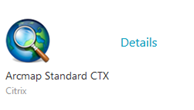

_ArcMap Standard -kuvake Citrixiss&auml;._

N&auml;m&auml; ty&ouml;vaiheet tehd&auml;&auml;n vain kerran, mink&auml; j&auml;lkeen Digiroad-ty&ouml;kalujen tulisi olla k&auml;yt&ouml;ss&auml; aina, kun ArcMap on avattu.

1. Avaa ArcMap

1. Valitse Customize -> Add-In Manager ja Options-v&auml;lilehti

1. Valitse Add Folder..

1. Kirjoita avautuvaan ikkunaan kohtaan Kansio: \\\172.17.204.38\VVH_10_3_1$
	-Huom! Jos Folder-kentt&auml;&auml;n kirjoitetun osoitteen per&auml;ss&auml; on v&auml;lily&ouml;nti, ei toimi oikein
	
1. Paina OK ja Close.

1. Valitse Customize -> Toolbars ja ruksi Digiroadin ty&ouml;kaluvalikot eli Digiroad Editor ja Digiroad Tools

1. Sulje ArcMap ja avaa uudelleen. Nyt Digiroad-ty&ouml;kaluvalikot ovat valmiina k&auml;ytett&auml;viss&auml;.

2. Digiroad Tools: kirjautuminen ja perusty&ouml;kalut
--------------------------

Digiroad toolbar -ty&ouml;kalupalkki sis&auml;lt&auml;&auml; aputy&ouml;kaluja aineiston hallintaan.

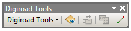

_Digiroad Tools._

2.1 Kirjautuminen j&auml;rjestelm&auml;&auml;n 
--------------------------

Jos j&auml;rjestelm&auml; ei ArcMappia avattaessa kysy kirjautumistietoja, saa kirjautumisen auki Digiroad Tools -> Digiroad: Login. Kirjautuminen on pakollista, jotta VVH:n ty&ouml;kaluja voi k&auml;ytt&auml;&auml;. Oletuksena kirjautuminen tapahtuu VVH:n tuotantokantaan, jolloin osoitteen p&auml;&auml;te on /vvh.

Kirjautumiseen k&auml;ytet&auml;&auml;n Liikenneviraston Citrixiin k&auml;ytett&auml;v&auml;&auml; k&auml;ytt&auml;j&auml;tunnusta (A-, U-, LX-, L- tai K-alkuinen) ja __erikseen VVH-sovellukseen m&auml;&auml;ritetty&auml; salasanaa__. Salasana ei siis ole sama, kuin Citrixiin kirjauduttaessa. Oletussalasana on kerrottu k&auml;ytt&auml;j&auml;lle VVH-sovelluskoulutuksen yhteydess&auml;.

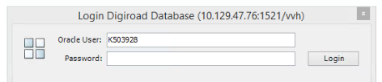

_Kirjautuminen j&auml;rjestelm&auml;&auml;n._

Jos k&auml;ytt&auml;j&auml; haluaa kirjautua muihin tietokantoihin, se tapahtuu klikkaamalla neli&ouml;it&auml; kirjautumisikkunan vasemmassa reunassa, ja valitsemalla avautuvasta alapalkista alasvetovalikosta haluttu tietokanta. Kaikkiin tietokantoihin on omat kirjautumistiedot, joten k&auml;ytt&auml;j&auml;ll&auml; ei oletuksena ole p&auml;&auml;sy&auml; kaikkiin kantoihin.

Jos j&auml;rjestelm&auml; pyyt&auml;&auml; Login-vaiheessa vaihtamaan salasanan, sen voi tehd&auml; heti tai vasta my&ouml;hemmin painamalla Cancel. Salasanan voi vaihtaa my&ouml;hemmin my&ouml;s Digiroad: Options-valikosta (kts. alempaa).

Kirjautuessa j&auml;rjestelm&auml; ilmoittaa my&ouml;s, jos MTK-p&auml;ivitykset eiv&auml;t ole ajossa tai jokin MTK-p&auml;ivitys ei ole mennyt l&auml;pi. N&auml;ihin voi painaa OK. VVH:n kehitystiimi huolehtii p&auml;ivitysten ajosta.

_J&auml;rjestelm&auml; ilmoittaa k&auml;ytt&auml;j&auml;lle kirjautumisen yhteydess&auml;, jos MTK-p&auml;ivitykset eiv&auml;t ole ajossa. N&auml;in kaikki sovelluksen k&auml;ytt&auml;j&auml;t tiet&auml;v&auml;t asiasta._

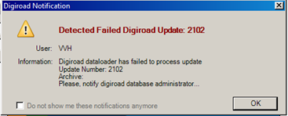

_J&auml;rjestelm&auml; ilmoittaa k&auml;ytt&auml;j&auml;lle, jos jokin MTK-p&auml;ivitys ei ole mennyt l&auml;pi._

2.2 Add Layers
--------------------------

Add Layers -ty&ouml;kalulla voi lis&auml;t&auml; j&auml;rjestelm&auml;ss&auml; valmiiksi olevia karttatasoja kartalle. Add Layersin saa auki Digiroad Tools -alasvetovalikosta tai sen oikealla puolella olevasta kuvakkeesta. Haluttu karttataso ruksitaan valikosta ja painetaan Apply. Tasot tulevat n&auml;kyviin kartalle ja sis&auml;llysluetteloon (Table of Contents). OK-painikkeesta tasot lis&auml;t&auml;&auml;n kartalle ja Add Layers sulkeutuu. Add Layersin voi sulkea my&ouml;s ruksista.

Add Layers -valikossa ylimp&auml;n&auml; ovat “perusgeometriatasot”, jotka ovat Maanmittauslaitoksen Maastotietokannasta. Lis&auml;ksi valittavana ovat historiatasot, suunnitelmalinkkeihin liittyv&auml;t tasot, kuntarajat, maakuntarajat, Ely-rajat, Liikenneviraston raiteet sek&auml; erilaisia MML:n taustakarttoja WMTS-tasoina.

Add Layerisist&auml; voi valita my&ouml;s vain tietyn kunnan kohteet tielinkki-tasolta lis&auml;tt&auml;v&auml;ksi municipality alasvetovalikosta (oletuksena koko Suomi) ja zoomata ko. kuntaan valitsemalla ruksin kohtaan Zoom to selected.

__Huomio tasojen lis&auml;&auml;misest&auml;:__ ArcMap lopettaa piirron painamalla Esc-n&auml;pp&auml;int&auml;. Jos lis&auml;&auml; esim. tielinkki-tason siten, ett&auml; zoomaus on koko Suomeen, kest&auml;&auml; tason piirtyminen melko kauan. Piirto katkeaa Escill&auml;. Usein ennen isojen aineistojen lis&auml;&auml;mist&auml; on hyv&auml; zoomata johonkin pienelle alueelle, niin piirto ei kest&auml; kauan. Milloin tahansa ty&ouml;skentelyn aikana Esc-n&auml;pp&auml;imest&auml; on hy&ouml;ty&auml;, jos ei halua odottaa piirtoa loppuun asti.

Jo lis&auml;tyt tasot v&auml;rj&auml;ytyv&auml;t sinisell&auml; Add Layersiss&auml;, mutta se ei est&auml; lis&auml;&auml;m&auml;st&auml; niit&auml; uudelleen.

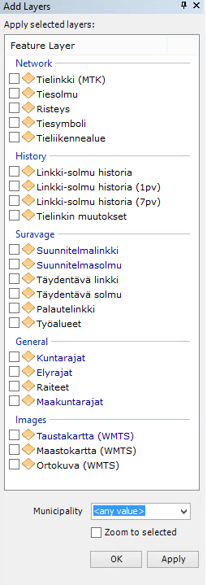

_Add Layers -valikosta voi lis&auml;t&auml; j&auml;rjestelm&auml;ss&auml; valmiina olevia karttatasoja._

2.3 Feature Drawing
--------------------------

Feature Drawing avataan Digiroad tools -alasvetovalikon kautta. Feature Drawing -ikkunan avulla karttatasoille voidaan lis&auml;t&auml; erilaisia piirtoelementtej&auml;, kuten digitointisuuntaa havainnollistavat nuolet.

Digitointisuunnan piirrosta on apua esimerkiksi silloin, kun Suravage-aineistolle on tarkoitus m&auml;&auml;ritt&auml;&auml; yksisuuntaisuus-tietoja. Yksisuuntaisuudet tallennetaan suhteessa linkin digitointisuuntaan.

Feature Drawing tukee seuraavia elementtej&auml;:

1. Draw Start Points piirt&auml;&auml; ensimm&auml;isen verteksin.
1. Draw Vertices piirt&auml;&auml; kohteiden kaikki verteksit paitsi ensimm&auml;isen ja viimeisen.
1. Draw End Points piirt&auml;&auml; viimeisen verteksin.
1. Draw Direction Arrows piirt&auml;&auml; suuntanuolen osoittamaan viivan digitointisuuntaa. Huomaa, ett&auml; suuntanuolen symbolin kulma tulee asettaa niin, ett&auml; se osoittaa vasemmalta oikealle (oletusasetus on n&auml;in, ok)

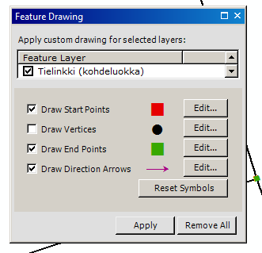

_Feature Drawing._

Jokaisen elementin symboli voidaan asettaa erikseen k&auml;ytt&auml;en ArcMapin symbolieditoria. Symbolieditoriin p&auml;&auml;see kunkin elementin Edit-painikkeesta.

Halutut symbolit lis&auml;t&auml;&auml;n kartalle Apply-painikkeesta. Symbolit piirret&auml;&auml;n karttatasolle niin kauan, kunnes k&auml;ytt&auml;j&auml; ne poistaa tai ArcMap istunto suljetaan. Feature Drawing -ikkunan sulkeminen ei poista symboleita. Erikoispiirrot voi poistaa kaikilta karttatasoilta my&ouml;s painamalla Reset-painiketta.

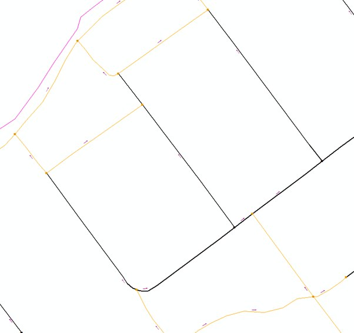

_Feature Drawing -ty&ouml;kalulla saadaan piirtoon mm. kohteiden digitointisuunnat._

2.4 Options
--------------------------

Options-valikko avataan Digiroad Tools -alasvetovalikosta. Digiroad Options - ikkuna on asetusikkuna erilaisten ty&ouml;kalujen ja toiminnallisuuksien asetusten hallintaan k&auml;ytt&auml;j&auml;kohtaisesti. Ikkunan avulla voidaan asettaa mm. “Flash selected geometries” -valinta Tools -v&auml;lilehdelt&auml;.

Optionsin valikoihin kannattaa tutustua, jotta ty&ouml;skennelless&auml; voi valita sielt&auml; itselleen sopivat asetukset.

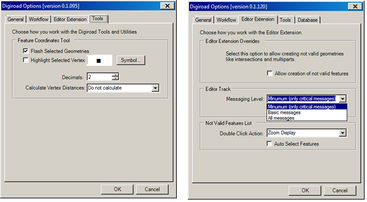

_Digiroad: Options -valikon asetuksia. Oikealla Editor Extension -v&auml;lilehti, josta l&ouml;ytyy esimerkiksi Editor trackiin liittyv&auml;t k&auml;ytt&auml;j&auml;kohtaiset asetukset._

###Salasanan vaihtaminen###

Salasanan vaihtaminen onnistuu Digiroad: Options -valikon General-v&auml;lilehdelt&auml; kohdasta Change Password.

2.5 Muita perusty&ouml;kaluja
--------------------------

###Feature Coordinates###

Feature Coordinates -ty&ouml;kalulla voi tarkastella aineiston karttakoordinaatteja. Toiminto on suunniteltu toimimaan mahdollisimman yhdenmukaisesti ArcMap-vakioty&ouml;kalu Feature Infon kanssa. Erona on se, ett&auml; Feature Info avaa ikkunan kohteiden ominaisuuksien tarkasteluun ja Feature Coordinates vastaavasti avaa ikkunan kohteiden koordinaattien tarkasteluun.    

T&auml;t&auml; ty&ouml;kalua voi k&auml;ytt&auml;&auml; my&ouml;s esimerkiksi siihen, kun tutkii Suravage-geometrian z-koordinaattien arvoja.

Ty&ouml;kalun saa auki valitsemalla Digiroad Toolsista Feature Coordinates, ty&ouml;kalupalkista Feature Coordinates -ty&ouml;kalun

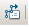

ja valitsemalla sitten kohteita kartalta.

Ty&ouml;kalulla voidaan valita:

1. Yksitt&auml;isi&auml; kohteita klikkaamalla kohdetta kartalta
1. Useita kohteita piirt&auml;m&auml;ll&auml; suorakaide
1. Yksitt&auml;isi&auml; tai uusia kohteita s&auml;ilytt&auml;en aikaisemman valinnan kohteet k&auml;ytt&auml;m&auml;ll&auml; CTRL -n&auml;pp&auml;int&auml;

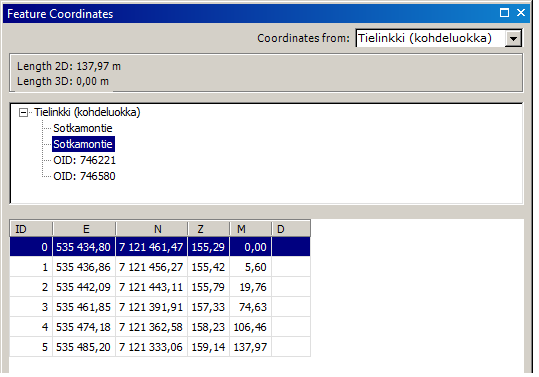

_Feature Coordinates -ty&ouml;kalu._

Ikkuna koostuu kahdesta paneelista ja kohteiden valintalistasta. Ylempi paneeli listaa kaikki valitut kohteet ja mahdolliset kohteiden osat. Alempi paneeli listaa valitun kohteen karttakoordinaatit. Valintalista (Coordinates from) m&auml;&auml;r&auml;&auml; ty&ouml;kalun valintoihin k&auml;ytt&auml;m&auml;n kartattason.

Vaihtoehdot ovat Feature Info -ty&ouml;kalun mukaiset eli:

1. Sis&auml;llysluettelon ylimm&auml;inen  karttataso Top-most Layer
1. N&auml;kyv&auml;t karttatasot Visible Layers
1. Valittavissa olevat karttatasot Selectable Layers
1. Yksitt&auml;inen valittu karttataso, nyt valittuna “Tielinkki (kohdeluokka)”

Ylemm&auml;n paneelin kohdelistasta (nyt Sotkamontie tai OID-arvoilla merkattu kohde) valitaan aktiivinen kohde tai osa, jonka koordinaatit listataan alempaan paneeliin. Kohteiden tarkastelussa helpottaa, jos Digiroad Options -valikosta on valittuna Tools -v&auml;lilehdelt&auml; “Flash selected geometries”, jolloin sovellus v&auml;l&auml;ytt&auml;&auml; kartalla kohdetta, jota klikataan ylemm&auml;st&auml; paneelista. Tuplaklikkamalla kohdetta voidaan kartta kohdistaa kohteeseen.

Alemman paneelin lista sis&auml;lt&auml;&auml; X, Y, M ja Z koordinaatit. Saraketta voidaan k&auml;ytt&auml;&auml; lajittelun kautta esim. kun halutaan l&ouml;yt&auml;&auml; verteksej&auml;, jotka ovat erityisen l&auml;hell&auml; tai kaukana toisistaan (esim. kun tutkitaan laaduntarkistusajojen tuloksia VVH:n kehitystiimiss&auml;).

###Feature Differences###

Feature Differences -ty&ouml;kalulla voi tarkastella aineiston kohteiden ominaisuustietojen eroja. Toiminto on suunniteltu toimimaan mahdollisimman yhdenmukaisesti ArcMap-vakioty&ouml;kalu Feature Infon kanssa. Erona se, ett&auml; Feature Info avaa yhden kohteen kaikki ominaisuudet, kun taas Feature Differences listaa kaikkien valittujen kohteiden ominaisuuksien erot. 

Ty&ouml;kalun saa auki valitsemalla Digiroad Tools -valikosta Feature Differences, ty&ouml;kalupalkista  Feature Differences -ty&ouml;kalun

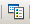

ja valitsemalla sitten kohteita kartalta. Kohteiden valinta suoritetaan samalla tavalla kuin Feature Info ja Feature Coordinates -ty&ouml;kaluilla. Kohdekarttataso valitaan alasvetovalikosta, eli mink&auml; karttatason kohteiden eroja halutaan tarkastella (tielinkit, tiesolmut tms.)

Rivit, joilla arvot eroavat, on v&auml;ritetty keltaisella taustav&auml;rill&auml; (kuva alla). Sarakkeita on yht&auml; monta, kuin kartalta valittuja kohteita (Feature 1, Feature 2 jne.) ja ne ovat kaikki mukana tarkastelussa. T&auml;m&auml;n avulla voi esimerkiksi tarkastella viereisten ajoratojen ominaisuustietojen mahdollisia eroavaisuuksia.

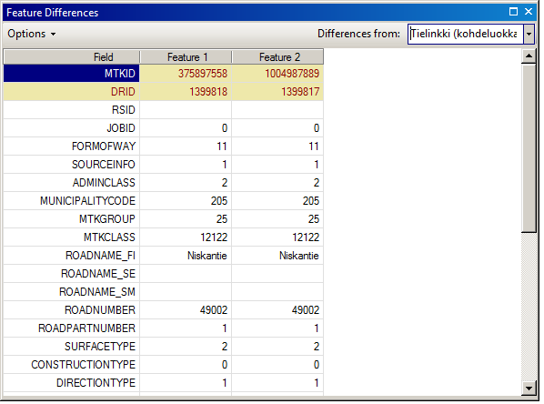

_Feature Differences -ty&ouml;kalu._

Ty&ouml;kalun Options -valikosta voidaan valita mit&auml; listalla n&auml;ytet&auml;&auml;n:

1. Use Field Alias k&auml;ytt&auml;&auml; kohdeluokan kent&auml;n nimen sijaan GeoDatabase -kent&auml;n alias nime&auml;. Esimerkiksi kohtaan MTK-ID tulee teksti MTK-tunniste, JOBID kohtaan ty&ouml;n tunniste jne.
1. Use Domain Values n&auml;ytt&auml;&auml; todellisten tietokanta-arvojen sijaan kent&auml;n arvoille sanalliset selitteet.
1. Drop Fields With Equal Values suodattaa listalta kaikki kent&auml;t, joiden arvot ovat kaikilla valituilla kohteilla samat.

Jos valinnat Use Field Alias ja Use Domain Values ovat valittuna, tulee yll&auml; olevasta valinnasta selke&auml;mmin luettava:

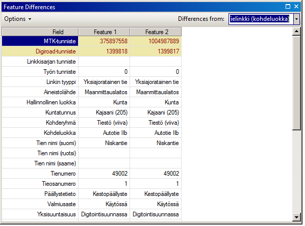

_Feature Diffrences -ty&ouml;kalu, kun Use Field alias ja Use domain values -valinnat ovat k&auml;yt&ouml;ss&auml;._
 
Klikkaammalla kohteen sarakkeen otsikkoa, kohdetta voidaan v&auml;l&auml;ytt&auml;&auml; n&auml;kym&auml;ss&auml; tai tuplaklikkaamalla kohdistaa kohteeseen. 

3. Digiroad Editor ja editoinnin ty&ouml;nohjaus (workflow)
--------------------------

Digiroad Editor -ty&ouml;kaluvalikko sis&auml;lt&auml;&auml; ty&ouml;n ohjaukseen ja ty&ouml;n kulkuun liittyvi&auml; toiminnallisuuksia. Osa ty&ouml;nohjauksen asetuksista voi muuttaa k&auml;ytt&auml;j&auml;kohtaisesti Digiroad Options -valikosta Workflow -v&auml;lilehdelt&auml;.

T&auml;ss&auml; ohjeessa keskityt&auml;&auml;n suunnitelma-aineistojen ty&ouml;nohjaukseen. Sovelluksessa yll&auml;pidet&auml;&auml;n my&ouml;s t&auml;ydent&auml;v&auml;&auml; geometriaa, jonka ty&ouml;nohjaus on t&auml;ysin samanlainen. Tarvittaessa k&auml;ytt&auml;j&auml; voi t&auml;ydent&auml;v&auml;n geometrian osalta tapauksesta riippuen ohittaa osan vaiheista (esim. ominaisuustietojen t&auml;ydellinen t&auml;ytt&auml;minen).

Ty&ouml;kalut esitell&auml;&auml;n ty&ouml;nohjauksen (Workflow) mukaisessa j&auml;rjestyksess&auml;, eli siin&auml; j&auml;rjestyksess&auml; jossa k&auml;ytt&auml;j&auml; etenee VVH-sovelluksessa suunnitelma-aineistoja k&auml;sittelless&auml;&auml;n. Kuitenkin k&auml;yt&auml;nn&ouml;ss&auml; esimerkiksi validointeja tulee tehty&auml; ty&ouml;skentelyn aikana useita kertoja. Kaikki ty&ouml;n vaiheet voikin toistaa tarpeen mukaan k&auml;yt&auml;nn&ouml;ss&auml; useita kertoja, paitsi ty&ouml;alueen luomisen ja ty&ouml;n merkkaamisen valmiiksi.

1. Ty&ouml;alueen luominen: Create a Job
M&auml;&auml;ritell&auml;&auml;n ty&ouml;alue (polygoni), jonka alueella aiotaan ty&ouml;skennell&auml;.

1. Ty&ouml;n rekister&ouml;inti ja ominaisuuksien m&auml;&auml;rittely ja ty&ouml;n avaus: Register New Job
Ty&ouml; rekister&ouml;id&auml;&auml;n ja siihen liitet&auml;&auml;n tarvittavat liitteet ja muut lis&auml;tiedot.

1. Ty&ouml;n ulosmerkkaus: Digiroad: Checkout
Ty&ouml;alueella olevat suunnitelmalinkit ja -solmut siirret&auml;&auml;n suunnitelmalinkki-tasolta muokattavalle tasolle.

1. Aineiston muokkaus: Start editing
Varsinainen editointi eli kohteiden luominen ja muokkaaminen.

1. Validointi: Feature Validation
Kohteiden validointi, jotta ne ovat topologisesti eheit&auml; ja sis&auml;lt&auml;v&auml;t v&auml;himm&auml;istiedot.

1. Aineiston sis&auml;&auml;nmerkkaus: Digiroad: Checkin
Validoidun aineiston palauttaminen tietokantaan ns. prim&auml;&auml;ritasolle, jossa sit&auml; ei voi muokata.

1. Ty&ouml;n merkkaus valmiiksi
Checkin ei sis&auml;ll&auml; ty&ouml; merkkausta valmiiksi. Ty&ouml; merkataan valmiiksi (Complete Job) vasta sen j&auml;lkeen, kun siihen ei varmasti ole en&auml;&auml; tulossa muutoksia.

	Lis&auml;ksi k&auml;ytt&auml;j&auml; voi hallita t&ouml;it&auml; ja ty&ouml;jonoa sek&auml; p&auml;ivitt&auml;&auml; ty&ouml;alueen tarvittaessa:

1. T&ouml;iden ja ty&ouml;jonon hallinta: Digiroad: Suspend Job ja Digiroad: Work Queue
T&ouml;iden keskeytt&auml;minen ja jatkaminen sek&auml; olemassa olevien t&ouml;iden hallinta.

1. Ty&ouml;alueen p&auml;ivitt&auml;minen

Alla on kuva VVH:n ty&ouml;nkulusta (Digiroad VVH Workflow), sek&auml; ty&ouml;linkkien ja ty&ouml;solmujen siirtymisest&auml; muokattavalle tasolle ja pois muokattavalta tasolta (VVH Checkout ja Checkin).

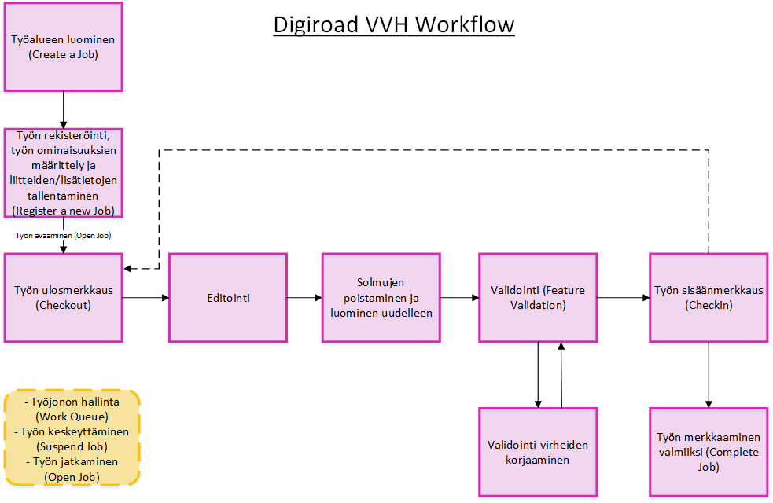

_VVH ty&ouml;nkulku. Aineistolle voi tehd&auml; checkoutin ja checkinin niin monta kertaa, kuin on tarpeen. Vasta Complete Job tekee ty&ouml;st&auml; valmiin, ja sit&auml; ei voi en&auml;&auml; palata editoimaan._

_Suunnitelmalinkkien ja -solmujen siirtyminen eri tasojen v&auml;lill&auml; checkoutin ja checkinin yhteydess&auml;. Aineistolle voi tehd&auml; checkoutin ja checkinin niin monta kertaa, kuin on tarpeen. Vasta Complete Job tekee ty&ouml;st&auml; valmiin, ja sit&auml; ei voi en&auml;&auml; palata editoimaan._

3.1 Ty&ouml;alueen luominen: Create a Job
--------------------------

Ty&ouml;alueen voi luoda kahdella eri tavalla:

1. Create Job Area: Painike

	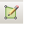 

	jonka j&auml;lkeen alue piirret&auml;&auml;n kartalle. Piirto loppuu tuplaklikkaamalla.

1. Create Job: Valitsemalla kartalta ArcMapin Selection-ty&ouml;kalulla tielinkkej&auml; ja luomalla ty&ouml;alueen tielinkkien kattamalta alueelta valitsemalla painike 

	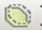 

Ty&ouml;alueen piirt&auml;misen j&auml;lkeen rekister&ouml;inti-ikkuna avautuu. Ty&ouml;alueen kokoa ei ole pakollista m&auml;&auml;ritt&auml;&auml; tarkasti t&auml;ss&auml; vaiheessa. Ty&ouml;alue p&auml;ivittyy silloin, jos k&auml;ytt&auml;j&auml; digitoi ty&ouml;linkkej&auml; ty&ouml;alueen rajan yli tai sen ulkopuolelle. Ty&ouml;aluetta voi p&auml;ivitt&auml;&auml; my&ouml;hemmin my&ouml;s manuaalisesti, kts. kohta 3.8 Ty&ouml;alueen p&auml;ivitt&auml;minen.

3.2 Ty&ouml;n rekister&ouml;iminen: Register Job
--------------------------

Ty&ouml;n rekister&ouml;inniss&auml; annetaan ty&ouml;n perustiedot, kuten tyyppi (alasvetovalikosta) ja nimi. Suravage-aineistoilla ty&ouml;n tyyppi on aina Suunnitelma-aineiston muokkaus ja nimeksi annetaan hankkeen nimi, esim. “Vt 6 TaaLa”. Ty&ouml;n kesto ja prioriteetti eiv&auml;t ole olennaisia tietoja, joten niiden sis&auml;lt&ouml;&ouml;n ei tarvitse puuttua. Kohtaan notes on hyv&auml; kirjoittaa mahdolliset erityispiirteet ko. ty&ouml;st&auml;. 

Rekister&ouml;inniss&auml; lis&auml;t&auml;&auml;n my&ouml;s ty&ouml;h&ouml;n liittyv&auml;t tasot (Layers) ja liitteet (Attachments) rekister&ouml;inti-ikkunan muiden v&auml;lilehtien kautta. Liitteiksi voidaan lis&auml;t&auml; esimerkiksi suunnitelmaan liittyvi&auml; PDF-tiedostoja. Shift-painike pohjassa voi valita useita liitteit&auml; kerrallaan.

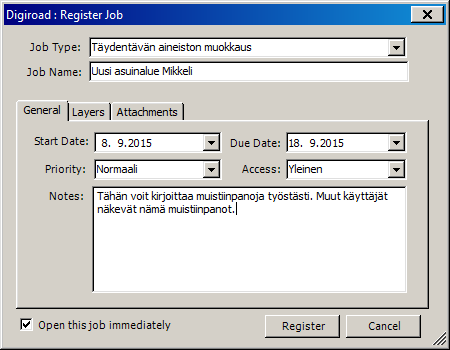 

_Ty&ouml;n rekister&ouml;inti. Layers ja Attachment -v&auml;lilehdill&auml; lis&auml;t&auml;&auml;n ty&ouml;ss&auml; tarvittavat tasot ja liitteet._

Ty&ouml; avautuu automaattisesti painikkeesta Register, jos ruksia Open this job immediately ei poista. Rekister&ouml;innin j&auml;lkeen sovellus kohdistaa ty&ouml;alueeseen. Sovellus my&ouml;s luo automaattisesti ty&ouml;alueelle tasot ty&ouml;solmu ja ty&ouml;linkki, jotka ovat tyhji&auml;. Tasot tulevat n&auml;kyviin sis&auml;llysluetteloon (Table of Contents). Kun ty&ouml;h&ouml;n digitoidaan uusia kohteita, ne tallentuvat n&auml;ille kyseisille tasoille, eiv&auml;t siis samalle tasolle MTK-tielinkkien ja niist&auml; luotujen solmujen kanssa.

3.3 Ty&ouml;n ulosmerkkaus: Digiroad: Checkout
--------------------------

Ty&ouml;n ulosmerkkauksessa kopioidaan ty&ouml;alueella olevat suunnitelmalinkit editoitavalle aineistotasolle. Checkoutissa ty&ouml;linkki-tasolle tulevat ne kohteet, joiden ty&ouml;numero (JOBID) on sama kuin ko. ty&ouml;n tai JOBID on null (ty&ouml; on poistettu, mutta checkin tehty). Vastaavasti ty&ouml;solmu-tasolle tulevat suunnitelmasolmu-tasolta ko. suunnitelmalinkkeihin liittyv&auml;t solmut. 

K&auml;yt&auml;nn&ouml;ss&auml; siis kun ensimm&auml;ist&auml; kertaa ko. alueella ty&ouml;skennell&auml;&auml;n, ei ulosmerkkauksessa tule kartalle viel&auml; mit&auml;&auml;n kohteita ellei ty&ouml;alueella ole suunnitelmalinkkej&auml;, joiden JOBID on null. Merkitys muuttuu, kun checkin on kerran tehty, mutta ty&ouml;n editointia halutaan jatkaa. VVH-j&auml;rjestelm&auml; kuitenkin vaatii checkoutin tekemisen my&ouml;s ensimm&auml;isell&auml; kerralla, kun ty&ouml; aloitetaan.

Huomioitava on, ett&auml; jos samalla alueella on jollain toisella JOBID:ll&auml; suunnitelmalinkkej&auml;, eiv&auml;t ne tule ty&ouml;linkki-tasolle checkoutissa. N&auml;iden linkkien olemassaolon voi helposti tarkistaa laittamalla piirtoon suunnitelmalinkki-tason kohteet. Muissa t&ouml;iss&auml; olevia ty&ouml;linkkej&auml; ei saa n&auml;kyviin kartalle.

Checkout suoritetaan Digiroad Editor-valikosta valitsemalla kohta Digiroad: Checkout. Ilmestyv&auml;st&auml; ikkunasta (alla) painetaan Checkout. T&auml;m&auml; kest&auml;&auml; hetken. Kun Checkout on valmis, ilmestyy ikkunaan teksti “Checkout Completed!” Ikkunan voi sulkea ruksista.

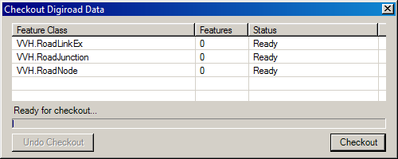 

_Checkout. Checkout hakee ty&ouml;alueelta kaikki kohteet, joilla on sama JOBID tai JOBID null. K&auml;yt&auml;nn&ouml;ss&auml; kun ty&ouml;lle tehd&auml;&auml;n ensimm&auml;ist&auml; kertaa checkout, ei se palauta kartalle uusia kohteita._

Checkoutin voi perua tarvittaessa kohdasta Undo Checkout (palauttaa ty&ouml;linkit ja ty&ouml;solmut tietokantaan suunnitelmalinkki- ja solmu tasoille).

Checkoutin j&auml;lkeen voidaan aloittaa ty&ouml;n kohteiden muokkaaminen.

3.4 Ty&ouml;n muokkaus: Start Editing
--------------------------

Editointi aloitetaan valitsemalla Digiroad Editor valikosta Start Editing. __Editointia ei saa aloittaa ArcMapin vakioeditorilla, koska t&auml;ll&ouml;in editoitavaksi ei tule oikea taso.__ 

Editointitilassa on mahdollista luoda uusia kohteita, muokata niit&auml; sek&auml; muokata kohteiden ominaisuustietoja. Editointi tapahtuu aina ty&ouml;linkki ja ty&ouml;solmu -kohteille, eik&auml; editointi vaikuta Maastotietokannasta tulleisiin tielinkkeihin tai niist&auml; luotuihin solmuihin. My&ouml;sk&auml;&auml;n mit&auml;&auml;n muita VVH-tietokannan tasoja ei voi muokata.

VVH-kantaan viet&auml;v&auml;ksi toimitetut Suravage- (tai muut) aineistot eiv&auml;t v&auml;ltt&auml;m&auml;tt&auml; ole ohjeistuksen mukaisesti tehtyj&auml;, jolloin esimerkiksi suunnitelmageometrioiden katkot eiv&auml;t ole oikeissa paikoissa ja aineistoon muodostuu virheellisi&auml; solmuja. Aineistot voivat jopa menn&auml; VVH:n validoinnista l&auml;pi, mutta ne eiv&auml;t silti vastaa suunnittelijoiden Suravage-ohjeistusta. T&auml;ll&ouml;in on aineiston k&auml;sittelij&auml;n vastuulla huomata n&auml;m&auml; virheet, ja korjata aineisto VVH:n ty&ouml;kaluilla.

3.4.1 Ty&ouml;linkkien muokkaus
--------------------------

P&auml;&auml;asiassa editointi noudattaa ArcMapin vakioty&ouml;kalujen toimintalogiikkaa. Jos k&auml;ytt&auml;j&auml;ll&auml; on jo valmiina jokin taso, joka on tarkoitus kopioida VVH:hon (esim. Suravage-aineistoa), voi sen kopioida ty&ouml;linkki-tasolle tutulla tavalla Ctrl-C, Ctrl-V.

Jos taas haluaa digitoida k&auml;sin uusia viivoja, Digiroad Editor valikon Create Features -painikkeen

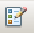

kautta voi valita, millaisia kohteita digitoidaan. Koska solmujen luominen on automaattista (kts. seuraava kohta), k&auml;ytt&auml;j&auml;t digitoivat p&auml;&auml;asiassa vain viivoja. Valittavina ovat K&auml;vely-/py&ouml;r&auml;tie ja Muu tieviiva. Valinta tehd&auml;&auml;n sen mukaan, kumpia ollaan digitoimassa.

Sn&auml;pp&auml;ys on oletuksena p&auml;&auml;ll&auml;, jotta digitointi on helppo kiinnitt&auml;&auml; muihin ty&ouml;linkkeihin ja MTK-tielinkkeihin (ty&ouml;linkkien sn&auml;pp&auml;ys MTK:n linkkeihin ei kuitenkaan katkaise tai muutoin vaikuta MTK-tason tielinkkeihin).

K&auml;ytt&auml;j&auml;ll&auml; on mahdollisuus editoida ty&ouml;linkki-tason kohteita my&ouml;s niiden lis&auml;yksen j&auml;lkeen. K&auml;yt&ouml;ss&auml; ovat kaikki ArcMapin vakioeditointimahdollisuudet, esimerkiksi ty&ouml;linkin katkaisu ja verteksien lis&auml;ys/poisto ja linkkien muokkaus raahaamalla verteksej&auml;. Jos k&auml;ytt&auml;j&auml; digitoi uuden viivan ty&ouml;alueen rajojen yli, laajenee ty&ouml;alue automaattisesti vastaamaan digitoidun viivan m&auml;&auml;rittelemi&auml; rajoja.

Solmujen lis&auml;yksest&auml; ja poistamisesta ei tarvitse huolehtia, vaan ne lis&auml;t&auml;&auml;n j&auml;lkik&auml;teen seuraavan kohdan mukaan.

3.4.2 Ty&ouml;solmujen poisto ja lis&auml;ys
--------------------------

Kun ty&ouml;linkkien editointi on valmis, voi kaikki solmut poistaa ja t&auml;m&auml;n j&auml;lkeen lis&auml;t&auml; uudelleen, jolloin sovellus luo solmujen tyypit ja linkkien ja solmujen v&auml;liset relaatiot automaattisesti. Solmujen poisto ja lis&auml;ys tehd&auml;&auml;n Feature Validation -ikkunassa Tools-v&auml;lilehdell&auml;. 

Editointi tulee olla edelleen p&auml;&auml;ll&auml;, kun solmut poistetaan ja lis&auml;t&auml;&auml;n.

Solmut poistetaan painikkeesta Remove All. T&auml;m&auml; vie hetken (ei indikaattoria etenemiselle), jonka j&auml;lkeen sovellus ilmoittaa poistettujen solmujen lukum&auml;&auml;r&auml;n. Uudet solmut luodaan painikkeesta Create. T&auml;m&auml; vie hetken, jonka j&auml;lkeen sovellus ilmoittaa luotujen solmujen lukum&auml;&auml;r&auml;n.

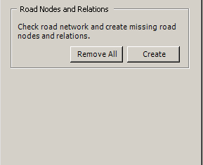

_Solmujen poisto ja lis&auml;ys -ty&ouml;kalu Feature Validation -> Tools-v&auml;lilehti._

Kun sovellus luo uusia solmuja, se luo tarvittaessa linkkikatkoja niihin kohtiin, joissa tielinkit on sn&auml;p&auml;tty risteykseksi, mutta linkkikatko puuttuu. T&auml;m&auml;n huomaa kartalla linkkien “v&auml;l&auml;hdyksin&auml;”.

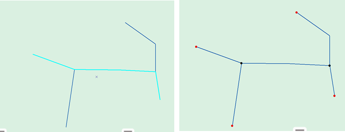

_Vasemmalla tielinkit ennen solmujen luomista, oikealla solmujen luomisen j&auml;lkeen. VVH-sovellus tekee solmuja luodessa linkkikatkot automaattisesti tarvittaessa._

Kun solmut on luotu, tehd&auml;&auml;n tavalliseen tapaan validointi tai jatketaan ty&ouml;skentely&auml;.

_Ty&ouml;linkki ja ty&ouml;solmu -tasojen kohteita. Kohteet on kopioitu VVH-yll&auml;pit&auml;j&auml;lle toimitetusta keskilinjasta. Pinkit solmut ovat pseudosolmuja ja mustat solmut ovat risteyssolmuja._

###Ty&ouml;linkkien digitointi, kun Disable topology checks -valinta ei ole p&auml;&auml;ll&auml;###

Editointi toimii eri tavalla silloin, kun Digiroad: Optionsissa ei ole ruksia kohdassa “Disable topology checks”. Kun k&auml;ytt&auml;j&auml; digitoi kohteita topologiatarkistusten ollessa p&auml;&auml;ll&auml;, j&auml;rjestelm&auml; luo solmut automaattisesti ja tarvittaessa katkoo ty&ouml;linkkej&auml;. My&ouml;s risteyksiss&auml; sovellus huolehtii automaattisesti linkkien katkomisesta. Viivat tulee sn&auml;p&auml;t&auml; toisiinsa, jotta katkominen toimii.

Useimmiten ty&ouml;skentely on helpompaa ja sujuvampaa ilman VVH:n automaattisia topologiatarkistuksia. Mahdolliset virheelliset kohteet tulevat kuitenkin ilmi validoinnissa, esimerkiksi jos solmujen relaatiot ty&ouml;linkkeihin ovat puutteelliset.

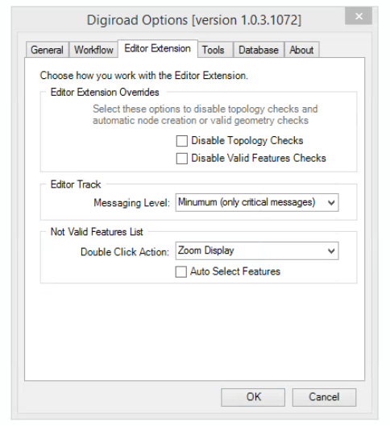

_Disable topology checks ei ole valittuna._

3.4.3 Ty&ouml;linkkien ominaisuustiedot
--------------------------

Ty&ouml;linkin ominaisuustietoja voi muokata tavalliseen tapaan ominaisuustietotaulussa. Useita kohteita voi p&auml;ivitt&auml;&auml; Field Calculatorin avulla antamalla arvoksi ko. koodiarvo. Ominaisuustietoja voi muokata my&ouml;s valitsemalla Digiroad Editor valikosta Attributes

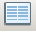

Ominaisuustietojen muokkaus aukeaa sovelluksen oikeaan laitaan kartalta valitulle kohteelle.

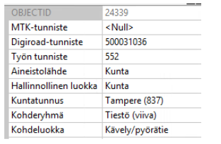

_Suunnitelma-aineiston ominaisuustietoja._

Ominaisuustietoja on erilaisia. Koodiarvollisilla ominaisuustiedoilla on VVH:ssa my&ouml;s domain-arvo, jolloin domain-arvo n&auml;kyy k&auml;ytt&ouml;liittym&auml;ss&auml;. Esimerkiksi Aineistol&auml;hde 7 on “Liikennevirasto”.

Osa ominaisuustiedoista on pakollisia. T&auml;ll&ouml;in my&ouml;s kohteet, joista pakolliset tiedot puuttuvat, j&auml;&auml;v&auml;t kiinni validoinnissa (mik&auml;li pakollisten tietojen validointi on valittuna, validoinnista tarkemmin my&ouml;hemmiss&auml; kappaleissa).

VVH-yll&auml;pit&auml;j&auml;n ohjeesta voi tarkistaa, mitk&auml; tiedot Suravage-aineistolle tulee t&auml;ydent&auml;&auml;. Kaikkia ominaisuustietoja ei t&auml;ydennet&auml; Suravage-aineistolle. Ominaisuustietojen koodiarvoluettelot l&ouml;ytyv&auml;t t&auml;m&auml;n k&auml;ytt&ouml;ohjeen toiselta v&auml;lilehdelt&auml; (yl&auml;reunasta painike VVH koodiarvoluettelot).

__Pakollisia ominaisuustietoja ovat__ (suluissa tietokannan kent&auml;n nimi, joka on tarpeen tiet&auml;&auml; esim. select by attributes kyselyss&auml;):

|Ominaisuustieto|Tyyppi|Lis&auml;tiedot|Oletusarvo|
|---------------|------|---------------|----------|
|Objectid (OBJECTID)|Kokonaisluku|Luodaan automaattisesti||
|Digiroad-tunniste (DRID)|Kokonaisluku|Luodaan automaattisesti||
|Linkkitunniste (LINKID)|Kokonaisluku|Luodaan automaattisesti||
|Ty&ouml;n tunniste (JOBID)|Kokonaisluku|Luodaan automaattisesti||
|Aineistol&auml;hde (SOURCEINFO)|Koodiarvo|Valitaan alasvetovalikosta tai annetaan koodiarvo|null|
|Hallinnollinen luokka (ADMINCLASS)|Koodiarvo|Valitaan alasvetovalikosta tai annetaan koodiarvo|null|
|Kohderyhm&auml; (MTKGROUP)|Koodiarvo|Valitaan alasvetovalikosta tai annetaan koodiarvo|Suunnitelmatiest&ouml; (viiva)|
|Valmiusaste (CONSTRUCTIONTYPE)|Koodiarvo|Valitaan alasvetovalikosta, esim. rakenteilla tai annetaan koodiarvo|Suunnitteilla|
|Yksisuuntaisuus (DIRECTIONTYPE)|Koodiarvo|Valitaan alasvetovalikosta tai annetaan koodiarvo|null|
|Tasosijainti (VERTICALLEVEL)|Koodiarvo|Valitaan alasvetovalikosta, esim. Tunnelissa, kts. luku 4, tai annetaan koodiarvo|null|
|Kuntatunnus (MUNICIPALITYCODE)|Koodiarvo|Koodiarvo, t&auml;ydennet&auml;&auml;n automaattisesti*||
|Hankkeen arvioitu valmistuminen (ESTIMATED_COMPLETION)|P&auml;iv&auml;m&auml;&auml;r&auml; (pp.kk.vvvv)|Jos tieto sy&ouml;tet&auml;&auml;n Field Calculatorin kautta, tulee tieto sy&ouml;tt&auml;&auml; muodossa # kk-pp-vvvv # eli esim. # 10-01-2017 # tarkoittaa 1.10.2017|null|

*) Kuntarajan ylitt&auml;v&auml;n kohteen kuntanumeroa VVH ei t&auml;ydenn&auml;, vaan k&auml;ytt&auml;j&auml;n on t&auml;ydennett&auml;v&auml; se itse. Kuntakoodiksi tulee se kunta, jonka puolella on pidempi osuus tielinkist&auml;.

Muut ominaisuustiedot:

|Ominaisuustieto|Tyyppi|Lis&auml;tiedot|Oletusarvo|
|---------------|------|---------------|----------|
|MTK-tunniste (MTKID)|Kokonaisluku|MML:n k&auml;ytt&auml;m&auml; ID, ei t&auml;ydennet&auml; ty&ouml;linkille|null|
|Kohdeluokka (MTKCLASS)|Koodiarvo|Valitaan alasvetovalikosta tai annetaan koodiarvo. Vastaa MML:n kohdeluokkaa. VVH:ssa annetaan vain arvoja null ja 12314 K&auml;vely- ja/tai py&ouml;r&auml;tie|null|
|Tienumero (ROADNUMBER)|Kokonaisluku||null|
|Tieosanumero (ROADPARTNUMBER)|Kokonaisluku||null|
|Ajoratakoodi (TRACK_CODE)|Kokonaisluku||null|
|P&auml;&auml;llystetieto (SURFACETYPE)|Koodiarvo|Valitaan alasvetovalikosta tai annetaan koodiarvo|null|
|Sijaintitarkkuus (HORIZONTALACCURACY)|Koodiarvo|Valitaan alasvetovalikosta, esim. 0,5 m tai annetaan koodiarvo|null|
|Korkeustarkkuus (VERTICALACCURACY)|Koodiarvo|Valitaan alasvetovalikosta, esim. 0,5 m tai annetaan koodiarvo|null|
|Kulkutapa (VECTORTYPE)|Koodiarvo|Valitaan alasvetovalikosta, esim. Murto tai annetaan koodiarvo|Murto|
|Pituus (GEOMETRYLENGTH)|Desimaaliluku|Lasketaan automaattisesti, digitoidun viivan pituus (3D pituus=mahdolliset Z-arvot otetaan huomioon)||
|Osoitenumero, vasen, alku (FROM_LEFT)|Kokonaisluku||null|
|Osoitenumero, vasen, loppu (TO_LEFT)|Kokonaisluku||null|
|Osoitenumero, oikea, alku (FROM_RIGHT)|Kokonaisluku||null|
|Osoitenumero, oikea, loppu (TO_RIGHT)|Kokonaisluku||null|
|Voimassaolo, alku (VALID_FROM)|P&auml;iv&auml;m&auml;&auml;r&auml;|Valitaan kalenterivalikosta|null|
|Voimassaolo, loppu (VALID_TO)|P&auml;iv&auml;m&auml;&auml;r&auml;|Valitaan kalenterivalikosta|null|
|Perustusp&auml;iv&auml; (CREATED_DATE)|P&auml;iv&auml;m&auml;&auml;r&auml;|T&auml;ydennet&auml;&auml;n automaattisesti, kohteen luontip&auml;iv&auml;||
|Perustaja (CREATED_BY)|Tekstikentt&auml;|T&auml;ydennet&auml;&auml;n automaattisesti, digitoijan k&auml;ytt&auml;j&auml;tunnus||
|Validointistatus (VALIDATIONSTATUS)|Koodiarvo|K&auml;sitell&auml;&auml;n automaattisesti||
|Kohteen olotila (OBJECTSATUS)|Koodiarvo|K&auml;sitell&auml;&auml;n automaattisesti||
|Tien nimi (suomi) (ROADNAME_FI)|Tekstikentt&auml;||null|
|Tien nimi (ruotsi) (ROADNAME_SE)|Tekstikentt&auml;||null|
|Tien nimi (saame) (ROADNAME_SM)|Tekstikentt&auml;||null|
|MTKHEREFLIP|Koodiarvo|T&auml;ydennet&auml;&auml;n automaattisesti, checkin k&auml;&auml;nt&auml;&auml; geometrian digitointisuunnan tarvittaessa, jotta se vastaa ns. Here-flip -s&auml;&auml;nt&ouml;&auml;. Kentt&auml; tulee mukaan vasta checkin-vaiheessa||

3.4.5 Ty&ouml;solmun ominaisuustiedot
--------------------------

Solmujen ominaisuustietoja ei tarvitse t&auml;ydent&auml;&auml;, sill&auml; VVH-j&auml;rjestelm&auml; huolehtii niist&auml; automaattisesti. Poikkeuksena tasan kuntarajalla sijaitsevat ty&ouml;solmut, joille annettaan kuntanumeroksi jomman kumman kunnan kuntanumero.

3.4.6 Editor trackin seuraaminen editoinnin aikana
--------------------------

Editoinnissa tehtyj&auml; muutoksia tietokantaan voi seurata Editor trackin kautta. Editor track kertoo j&auml;rjestelm&auml;ss&auml; editoinnin aikana tapahtuvat (my&ouml;s automaattiset) toiminnot. My&ouml;s kielletyt operaatiot lokittuvat Editor trackiin, jolloin k&auml;ytt&auml;j&auml; n&auml;kee, miksei esimerkiksi kartalle digitoitua viivaa luotu. Editor track avataan Digiroad Editor -> Feature Validation -> Editor track v&auml;lilehti.

Editor track kirjoittaa lokiin oletuksena vain kriittiset viestit, eli esimerkiksi virheelliset geometriat (vasemman puoleinen kuva alla). T&auml;t&auml; asetusta voi muuttaa Digiroad: Optionsista (Digiroad Tools -ty&ouml;kaluista) tai klikkaamalla hiiren oikeaa nappia Editor Trackiss&auml;. Vaihtoehtoisia lokitustasoja on kolme, joista oletuksena on valittuna taso, jossa virheellisten kohteiden digitointi lokitetaan k&auml;ytt&auml;j&auml;lle. Keskitasolla Editor track kirjoittaa lokiin joitakin tapahtumia (linkki luotu, solmu luotu) tai tarkimmalla tasolla kaikki tapahtumat (kohteiden luominen, ominaisuustietojen tallentuminen, kohteiden v&auml;liset relaatiot jne., oikeanpuoleinen kuva alla). Editor trackist&auml; voi siis k&auml;tev&auml;sti seurata, mit&auml; sovelluksessa tapahtuu oman ty&ouml;skentelyn aikana. Eri tasoiset viestit lokitetaan eri v&auml;reill&auml;.

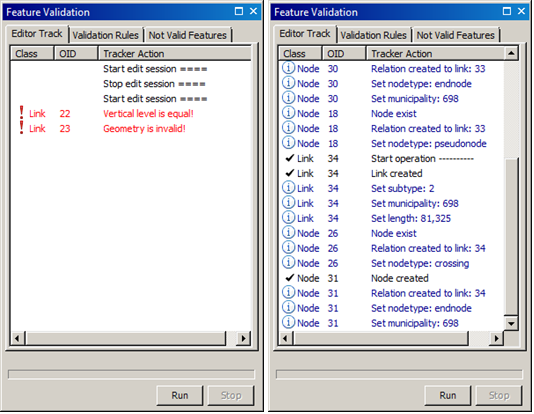

_Editor track. Vasemmalla minimilokitus, oikealla tarkin mahdollinen lokitus._

3.5 Validointi: Feature Validation
--------------------------

K&auml;ytt&auml;j&auml; voi validoida tekemi&auml;&auml;n muutoksia sek&auml; ty&ouml;skentelyn aikana ett&auml; sen j&auml;lkeen. K&auml;ytt&auml;j&auml;n on pakollista validoida tehdyt geometriat ennen niiden vienti&auml; tietokantaan (Digiroad: Checkin) prim&auml;&auml;ritasolle. Validoinnin avulla varmistutaan aineiston topologisesta eheydest&auml;.

3.5.1 Validation rules
--------------------------

Validation rules -v&auml;lilehdelt&auml; k&auml;ytt&auml;j&auml; voi valita, mitk&auml; kohteet “j&auml;&auml;v&auml;t kiinni” validoinnissa. On siis mahdollista tapauskohtaisesti sallia my&ouml;s sellaisten kohteiden validoinnin l&auml;p&auml;isy, jotka eiv&auml;t v&auml;ltt&auml;m&auml;tt&auml; ole topologisesti tai ominaisuustiedoiltaan “t&auml;ydellisi&auml;”. Validointeja voi kuitenkin ty&ouml;skentelyn aikana “ajaa” niin monta kertaa kuin tarpeen, ja kohteet j&auml;&auml;v&auml;t kiinni validoinnissa ruksittujen s&auml;&auml;nt&ouml;jen mukaisesti. T&auml;rke&auml;&auml; (ja pakollista) on ajaa kokonaisvaltainen validointi silloin, kun on aikeissa tehd&auml; checkinin.

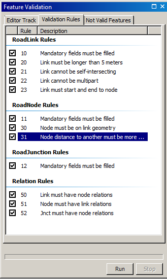

_Validointi. Validointis&auml;&auml;nt&ouml;j&auml; voi vaihdella ruksimalla niit&auml; p&auml;&auml;lle ja pois Feature Validation -ikkunassa._

3.5.2 Validoinnin ajaminen
--------------------------

Editointi on lopetettava ja muutokset tallennettava ennen validointia. T&auml;m&auml;n j&auml;lkeen Feature Validation -ikkunassa Run-painikkeen painaminen k&auml;ynnist&auml;&auml; validoinnin. Kaikki ty&ouml;h&ouml;n kuuluvat ty&ouml;linkit ja ty&ouml;solmut validoidaan. Validoinnin etenemist&auml; voi seurata validointi-ikkunan alareunan palkista. Virheelliset kohteet lokitetaan v&auml;lilehdelle Not Valid Features. Validation Rules -ikkunassa ruksitut kohdat vaikuttavat siihen, millaiset kohteet katsotaan virheellisiksi validoinnissa.

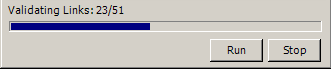

_Validoinnin etenemist&auml; voi seurata validointi-ikkunan alareunasta._

Kun validointi on valmis, sovellus ilmoittaa samassa kohdassa, ett&auml; validointi on valmis. Virheelliset kohteet voi tarkistaa Error List -v&auml;lilehdelt&auml;.

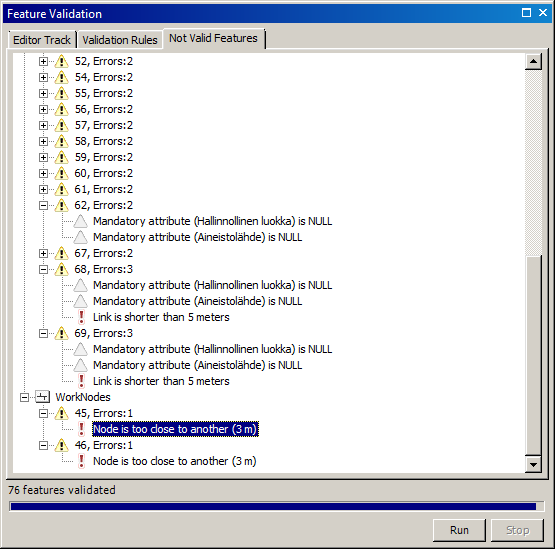

_Validoinnin tulokset, jos aineistossa on ollut virheellisi&auml; kohteita (vanha kuva - v&auml;lilehden nimi on nykyisin Error List)._

Jos validoinnin ajaa t&auml;m&auml;n j&auml;lkeen uudelleen siten, ett&auml; muuttaa validointis&auml;&auml;nt&ouml;j&auml;, poistuvat kohteet korjauslistalta. Esimerkiksi pakollisten ominaisuustietojen poistaminen s&auml;&auml;nn&ouml;ist&auml; edellisess&auml; tapauksessa lyhent&auml;&auml; listaa huomattavasti:

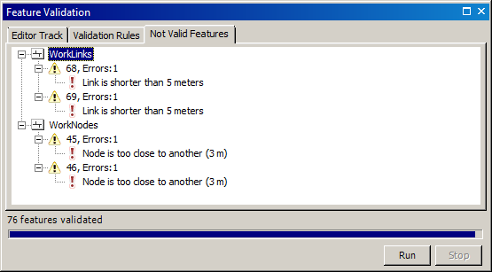

_Validoinnin tulokset, kun osa kohteista on korjattu._

Kohteiden tallentamista tietokantaan prim&auml;&auml;ritasolle eli Checkini&auml; ei voi tehd&auml; ilman, ett&auml; virheelliseksi katsotut kohteet on korjattu. Tuplaklikkaamalla kohdetta virhelistalla, sovellus zoomaa ko. kohteeseen. Kun kohteet on korjattu, ajetaan validointi uudelleen ja tarkistetaan, ett&auml; virhelista on tyhj&auml;.

Pakolliset ominaisuustiedot voi korjata my&ouml;s valitsemalla listalta hiiren oikealla korjattava kohde ja Fix null values. T&auml;ll&auml; tavalla korjausten tekeminen ei edellyt&auml; editointitilaan siirtymist&auml;. Kohteet voi korjata yksi kerrallaan tai kaikki kerrallaan. Esim. aineistol&auml;hde on usein kaikille kohteille sama samalla ty&ouml;alueella.

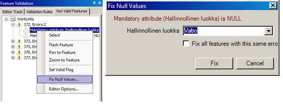

_Fix Null Values. Pakollisia ominaisuustietoja voi korjata my&ouml;s Fix Null Values -toiminnolla._

Jos virheellisen kohteen haluaa hyv&auml;ksy&auml; validointivirheest&auml; huolimatta, voi kohteelle asettaa “Set Valid Flag” -valinnan, jolloin se katsotaan k&auml;ytt&auml;j&auml;n hyv&auml;ksym&auml;ksi kohteeksi ja kohteen voi vied&auml; tietokantaan (seuraava kohta, Digiroad: Checkin).

3.6 Aineiston sis&auml;&auml;nmerkkaus: Digiroad: Checkin
--------------------------

Sis&auml;&auml;nmerkkaamisen avulla kopioidaan ty&ouml;h&ouml;n liittyv&auml; muokattu aineisto tietokantaan prim&auml;&auml;ritasolle eli suunnitelmalinkki-tasolle ja suunnitelmasolmu-tasolle. Suunnitelmalinkki-tasolta kohteet siirtyv&auml;t jatkossa esimerkiksi OTH-sovelluksen ja Viite-sovelluksen k&auml;ytt&ouml;&ouml;n. Ilman Checkini&auml; aineistoa ei siis voi k&auml;ytt&auml;&auml; miss&auml;&auml;n VVH:n rajapintoja hy&ouml;dynt&auml;viss&auml; j&auml;rjestelmiss&auml;.

Jotta Checkin voidaan tehd&auml;, tulee validointi olla kokonaisuudessaan mennyt l&auml;pi, eik&auml; ty&ouml;ss&auml; saa olla kohteita, jotka eiv&auml;t ole l&auml;p&auml;isseet validointia. Checkin ajetaan Digiroad Editor valikosta valitsemalla Digiroad: Checkin. Jos virheellisi&auml; kohteita on, huomauttaa sovellus t&auml;st&auml;. Samoin jos validointi on tekem&auml;tt&auml;, ei checkini&auml; voi tehd&auml;, koska kaikki kohteet katsotaan virheellisiksi.

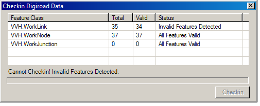

_Checkin, jos validointi on tekem&auml;tt&auml; tai validoinnissa on j&auml;&auml;nyt virheellisi&auml; kohteita._

Kun validointi on tehty onnistuneesti, aktivoituu Checkin painike ja sis&auml;&auml;nmerkkauksen voi ajaa.

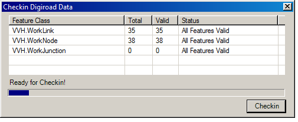

_Checkin, kun validointi on tehty onnistuneesti._

Kun checkin on tehty, kohteet poistuvat ty&ouml;linkki ja ty&ouml;solmu -tasoilta ja siirtyv&auml;t suunnitelmalinkki ja suunnitelmasolmu -tasoille. Ne saa palautettua takaisin tekem&auml;ll&auml; aineistolle taas checkoutin.

Checkin kannattaa tehd&auml; kuitenkin vasta, kuin aineisto on hy&ouml;dynt&auml;miskelpoisessa vaiheessa. Jos ty&ouml; ei ole valmis, vaan se halutaan keskeytt&auml;&auml; esim. kotiin l&auml;hdett&auml;ess&auml;, se tehd&auml;&auml;n Digiroad: Supend Job -valinnalla. Suspend Job on riitt&auml;v&auml;, jos ty&ouml; j&auml;&auml; t&auml;ysin kesken (kts. luku 3.7).

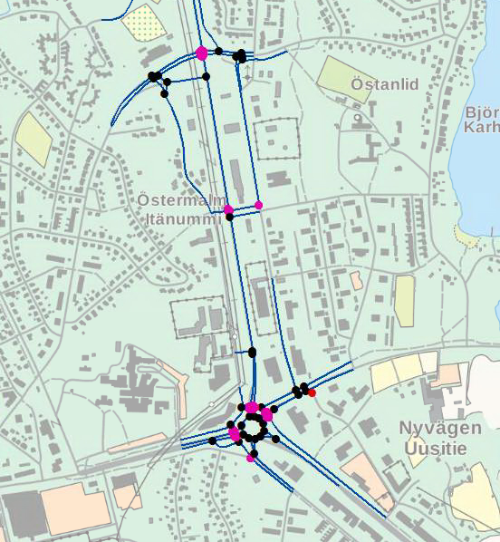

_Ty&ouml;linkit ja ty&ouml;solmut ennen checkini&auml;, kohteet valmiita._

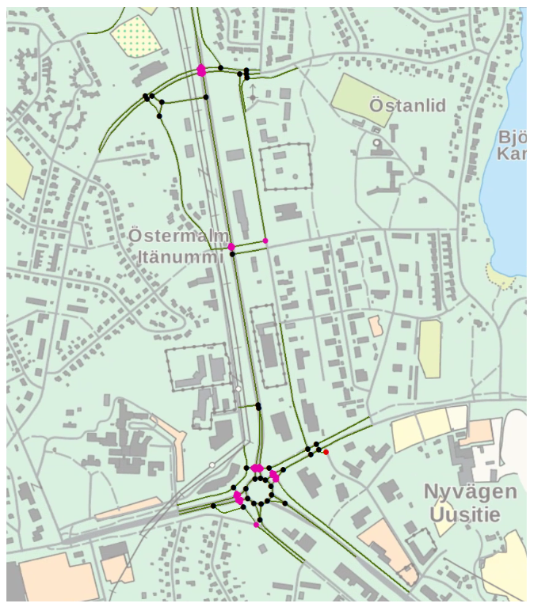

_Kohteet suunnitelmalinkki ja suunnitelmasolmu -tasoilla checkinin j&auml;lkeen._

###Ns. Here-flip checkinin yhteydess&auml;###

Here-flip -s&auml;&auml;nt&ouml; tarkoittaa, ett&auml; kaikkien kohteiden digitointisuunnat noudattavat seuraavia s&auml;&auml;nt&ouml;j&auml;:

1. Linkin alkupiste on aina sen etel&auml;isempi piste
1. T&auml;ysin it&auml;-l&auml;nsisuuntaisella linkill&auml; alkupiste on l&auml;ntinen alkupiste

K&auml;ytt&auml;j&auml;n ei tarvitse huolehtia itse here-flip -s&auml;&auml;nn&ouml;n toteutumisesta.

VVH-sovellus tarkistaa checkinin yhteydess&auml;, ett&auml; tielinkkien digitointisuunnat vastaavat Here-flip -s&auml;&auml;nt&ouml;&auml;. Tarvittaessa digitointisuunta k&auml;&auml;nnet&auml;&auml;n (etel&auml;st&auml; pohjoiseen tai l&auml;nnest&auml; it&auml;&auml;n), ja MTKHEREFLIP -kent&auml;n arvoksi tulee 1. Samalla digitointisuuntariippuvaiset ominaisuustiedot k&auml;&auml;nnet&auml;&auml;n (yksisuuntaisuus, osoitenumerot).

Here-flip -s&auml;&auml;nn&ouml;n toteutumisen voi todentaa checkinin j&auml;lkeen lis&auml;&auml;m&auml;ll&auml; suunnitelmalinkit kartalle ja t&auml;m&auml;n j&auml;lkeen Feature Drawing -ty&ouml;kalulla digitointisuuntanuolen piirtoon. Kaikkien nuolien tulisi osoittaa etel&auml;st&auml; pohjoiseen tai l&auml;nnest&auml; it&auml;&auml;n.

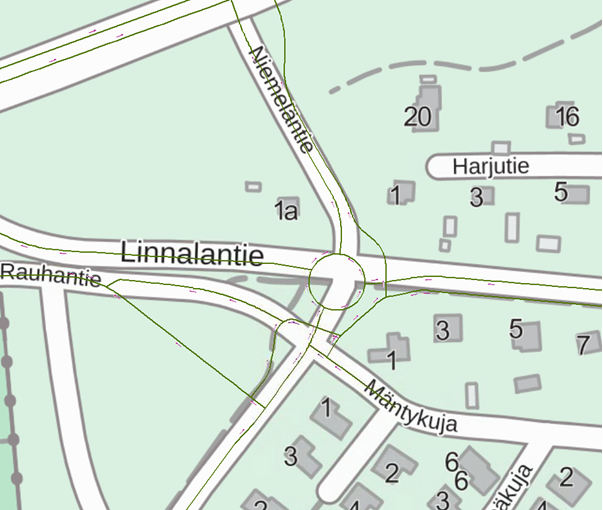

_Suunnitelmalinkkien digitointisuunnat ovat here-flip -s&auml;&auml;nn&ouml;n mukaisia._

3.7 T&ouml;iden ja ty&ouml;jonon hallinta: Digiroad: Suspend Job ja Digiroad: Work Queue
--------------------------

VVH-sovelluksessa on mahdollista hallita t&ouml;it&auml; keskeytt&auml;m&auml;ll&auml; niit&auml;, avaamalla uudelleen sek&auml; muokkaamalla olemassa olevien t&ouml;iden tietoja. Tarvittaessa ty&ouml;n voi my&ouml;s poistaa.

3.7.1 Ty&ouml;n keskeytt&auml;minen: Digiroad: Suspend Job
--------------------------

Ty&ouml;n keskeytt&auml;minen on normaalitilanne esimerkiksi silloin, kun ei ty&ouml;p&auml;iv&auml;n aikana saa ty&ouml;t&auml; valmiiksi, ArcMap suljetaan ja ty&ouml; j&auml;&auml; odottamaan hetke&auml;, jolloin sit&auml; taas jatketaan.  Ty&ouml; keskeytet&auml;&auml;n valitsemalla Digiroad Editor valikosta Suspend Job. Jotta ty&ouml;n voi keskeytt&auml;&auml;, tulee editointi olla pois p&auml;&auml;lt&auml; ja muutokset tallennettuna. Keskeytyksen j&auml;lkeen voi ArcMapin sulkea turvallisesti ja palata ty&ouml;h&ouml;n my&ouml;hemmin.

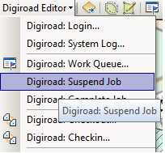

_Digiroad: Suspend Job_

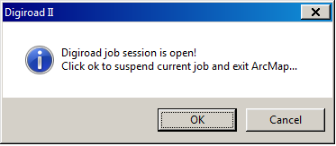

_ArcMapi&auml; ei voi sulkea, jos VVH:ssa on ty&ouml; auki._

Ty&ouml;n uudelleen avaaminen ja  jatkaminen my&ouml;hemmin onnistuu ty&ouml;jonon kautta.

3.7.2 Ty&ouml;jonon hallinta: Digiroad: Work Queue
--------------------------

Keskener&auml;isi&auml; t&ouml;it&auml; voidaan hallita ty&ouml;jonossa.  Mm. t&ouml;iden avaaminen uudelleen (Open Job) keskeytyksen j&auml;lkeen ja ty&ouml;n vapautus (Release Job) tapahtuu ty&ouml;jonon kautta. Ty&ouml;jono avataan Digiroad Editor -valikosta valitsemalla Digiroad: Work Queue. Ty&ouml;jono n&auml;ytt&auml;&auml; kaikki julkiset ty&ouml;t. On t&auml;rke&auml;&auml;, ettei t&ouml;it&auml; turhaan tehd&auml; yksityisiksi, jotta ne n&auml;kyv&auml;t ja ovat hallittavissa ty&ouml;jonossa kaikkien toimesta.

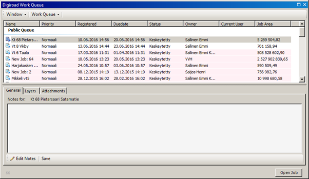

_Ty&ouml;jono._

Klikkamalla ty&ouml;t&auml; ty&ouml;jonosta, n&auml;hd&auml;&auml;n ty&ouml;n tiedot. Eri v&auml;lilehdill&auml; voi hallita my&ouml;s ty&ouml;n liitteit&auml; jne. aivan kuten silloin, kun ty&ouml; rekister&ouml;itiin. Ty&ouml;n tietoja voi muokata vain silloin, kun se ei ole auki. Jos siis haluaa lis&auml;t&auml; ty&ouml;h&ouml;n uuden liitteen tai layerin, tulee se ensin sulkea ja sitten muokata sit&auml; ty&ouml;jonosta.

Julkisten t&ouml;iden hallinta ja niiden avaaminen on sallittua kaikille k&auml;ytt&auml;jille. Esimerkiksi kohtaan Notes voi my&ouml;s toiset kirjoittaa huomiota ty&ouml;st&auml;, jos on jatkanut toisen aloittamaa ty&ouml;t&auml;.

3.7.3 Ty&ouml;n avaaminen (Open Job)
--------------------------

Ty&ouml; avataan uudelleen valitsemalla Open Job. T&auml;m&auml;n j&auml;lkeen voi editointia jatkaa taas tavallisesti. Checkout tehd&auml;&auml;n tarvittaessa. Sovellus ei anna aloittaa editointia, jos checkout on tekem&auml;tt&auml;.

Valmiit ja yksityiset ty&ouml;t saadaan n&auml;kyviin valitsemalla Work Queue -alasvetovalikosta Show Private Queue ja Show Completed Queue. Valmiita t&ouml;it&auml; ei voida avata uudelleen ja yksityisi&auml; t&ouml;it&auml; voi hallita vain niiden omistaja sek&auml; admin-k&auml;ytt&auml;j&auml; (kts. admin-k&auml;ytt&auml;j&auml;n oikeudet ty&ouml;jonon hallinnassa).

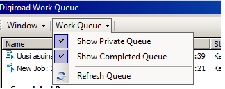

_Valmiit ja yksityiset ty&ouml;t._

3.7.4 Ty&ouml;n merkkaaminen valmiiksi (Complete Job)
--------------------------

Kun Checkin on tehty ja ty&ouml; on kokonaan valmis (siihen ei ole tarpeen palata), voi ty&ouml;n merkata valmiiksi Digiroad Editor -valikosta valitsemalla Digiroad: Complete Job.

Huom! Valmiiksi merkattua ty&ouml;t&auml; ei voi avata en&auml;&auml; uudelleen k&auml;ytt&ouml;liittym&auml;st&auml; eik&auml; sit&auml; p&auml;&auml;se siis en&auml;&auml; editoimaan.

Jos kuitenkin k&auml;ytt&auml;j&auml;ll&auml; on tarve korjata ty&ouml;t&auml; Complete Job -valinnan j&auml;lkeen, voi VVH:n kehitystiimi&auml; pyyt&auml;&auml; palauttamaan ty&ouml; takaisin ty&ouml;jonoon. Kehitystiimille ilmoitetaan ty&ouml;n tarkka nimi (tai ty&ouml;n numero, ei n&auml;y listassa). Jos ty&ouml;n nime&auml; ei muista, sen voi tarkistaa avaamalla ty&ouml;jonosta valmiiden t&ouml;iden listan.

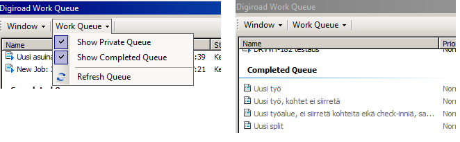

_Valmiiden t&ouml;iden lista._

3.7.5 Ty&ouml;n vapautus (Release Job),  jos ArcMap kaatuu
--------------------------

Ty&ouml;n vapautus on tarpeen, jos esimerkiksi ArcMap on kaatunut kesken ty&ouml;skentelyn. T&auml;ll&ouml;in ty&ouml; j&auml;&auml; tilanteeseen, jossa sit&auml; ei voi jatkaa ilman vapautusta. Ty&ouml; vapautetaan valitsemalla hiiren oikealla ty&ouml; ty&ouml;jonosta, valitsemalla Manage Jobs -> Release Job. 

3.7.6 Ty&ouml;n poistaminen (Delete Job)
--------------------------

Ty&ouml; poistetaan samasta paikasta, mist&auml; ty&ouml; vapautetaan eli valitsemalla hiiren oikealla ty&ouml; ty&ouml;jonosta, valitsemalla Manage Jobs -> Delete Job. P&auml;&auml;asiassa t&ouml;it&auml; ei tarvitse poistaa.

Ty&ouml;n poistaminen johtaa kaikkien ty&ouml;linkkien ja ty&ouml;solmujen poistamiseen. Kuitenkin ne kohteet, joille Checkin on tehty, eiv&auml;t poistu vaan ne j&auml;&auml;v&auml;t tietokantaan, koska ne ovat suunnitelmalinkki ja suunnitelmasolmu -tasoilla. N&auml;iden kohteiden JOBID menee kuitenkin arvolle null, koska ko. ty&ouml; on poistettu.

3.7.7 Admin-k&auml;ytt&auml;j&auml;n oikeudet ty&ouml;jonon hallinnassa
--------------------------

Jos k&auml;ytt&auml;j&auml; on admin, voi k&auml;ytt&auml;j&auml; my&ouml;s vapauttaa ja poistaa toisten t&ouml;it&auml;. Lis&auml;ksi adminilla on oikeudet siirt&auml;&auml; muiden t&ouml;it&auml; yksityiseksi ja julkiseksi. Admin-oikeuksia voi pyyt&auml;&auml; VVH:n kehitystiimilt&auml;.

Jos k&auml;ytt&auml;j&auml;lle annetaan admin-oikeudet, tulee k&auml;ytt&auml;j&auml;n kirjautua VVH-j&auml;rjestelm&auml;&auml;n uudelleen, jotta oikeudet toimivat.

3.7.8 P&auml;&auml;llekk&auml;iset ty&ouml;alueet
--------------------------

VVH:ssa ei ole estett&auml; sille, etteiv&auml;tk&ouml; ty&ouml;alueet voisi olla p&auml;&auml;llekk&auml;in. Kaksi p&auml;&auml;llekk&auml;ist&auml; ty&ouml;aluetta ei kuitenkaan voi olla yht&auml;aikaa auki. Jos yritt&auml;&auml; avata ty&ouml;aluetta, jonka kanssa toinen ty&ouml;alue on jo p&auml;&auml;llekk&auml;in ja auki, ei VVH anna avata toista ty&ouml;aluetta. T&auml;ll&ouml;in tulee odottaa, ett&auml; toinen ty&ouml;alue suljetaan tai ottaa yhteytt&auml; toisen ty&ouml;alueen k&auml;ytt&auml;j&auml;&auml;n ja pyyt&auml;&auml; sulkemaan ty&ouml;alue.

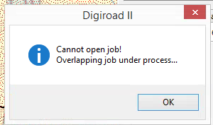

_Ilmoitus, jos yritt&auml;&auml; avata ty&ouml;alueen, jonka kanssa p&auml;&auml;llekk&auml;inen ty&ouml;alue on jo auki._

3.8 Ty&ouml;alueen p&auml;ivitt&auml;minen
--------------------------

Ty&ouml;alueen koko p&auml;ivittyy automaattisesti, jos kohteita digitoi alueen reunaviivojen yli. Ty&ouml;alue suurenee 100 m p&auml;&auml;h&auml;n uloimmasta ty&ouml;linkist&auml;. 

3.8.1 Ty&ouml;alueen suurentaminen
--------------------------

Jos ty&ouml;alueen haluaa p&auml;ivitt&auml;&auml; kokonaisuudessaan isommaksi, sen voi tehd&auml; avaamalla ko. ty&ouml;n ja digitoimalla CTRL-nappi pohjassa uuden ty&ouml;alueen Create Job Area -ty&ouml;kalulla

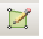

Uuden ty&ouml;alueen tulee leikata vanhan ty&ouml;alueen raja tai ymp&auml;r&ouml;id&auml; se kokonaan. T&auml;m&auml;n j&auml;lkeen sovellus varmistaa, halutaanko ty&ouml;aluetta muokata. Pienemp&auml;&auml; ty&ouml;aluetta ei voi tehd&auml;, koska muuten jo digitoidut kohteet voisivat j&auml;&auml;d&auml; sen ulkopuolelle.

Create Job Area -ty&ouml;kalu on k&auml;yt&ouml;ss&auml; vain silloin, kun editointi ei ole p&auml;&auml;ll&auml;.

3.8.2 Ty&ouml;alueen jakaminen kahteen uuteen ty&ouml;alueeseen (toistaiseksi ei tarpeellinen toiminto)
--------------------------

Olemassa olevan ty&ouml;alueen voi jakaa kahteen uuteen alueeseen. Jaon aikana editointi ei saa olla p&auml;&auml;ll&auml;. T&auml;m&auml; voi olla hy&ouml;dyllist&auml; esimerkiksi silloin, jos osa ty&ouml;alueesta halutaan jakaa toiselle henkil&ouml;lle teht&auml;v&auml;ksi tai teht&auml;v&auml;ksi my&ouml;hemm&auml;ss&auml; vaiheessa. T&auml;m&auml; tehd&auml;&auml;n Create Job Area -ty&ouml;kalulla digitoimalla uusi alue, joka leikkaa vanhan ty&ouml;alueen tai on kokonaan sen sis&auml;ll&auml;. T&auml;m&auml;n j&auml;lkeen avautuu uuden ty&ouml;n rekister&ouml;inti-ikkuna.

Alla on kuvasarja uuden ty&ouml;alueen tekemisest&auml;:

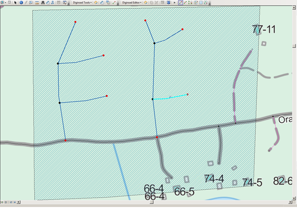

_Ty&ouml;alueen jakaminen. Vanha ty&ouml;alue ennen jakoa._

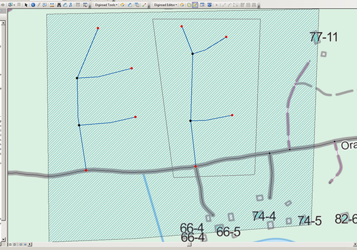

_Ty&ouml;alueen jakaminen. Uuden ty&ouml;alueen digitointi vanhan ty&ouml;alueen sis&auml;lle._

Avautuvassa ikkunassa voi valita, siirret&auml;&auml;nk&ouml; vanhan ty&ouml;n kohteet uuteen ty&ouml;h&ouml;n: “Move contained data to new job”. Uuteen ty&ouml;h&ouml;n siirtyv&auml;t kaikki kokonaan uuden ty&ouml;alueen sis&auml;ll&auml; olevat kohteet, ja ne poistuvat vanhasta ty&ouml;st&auml;.

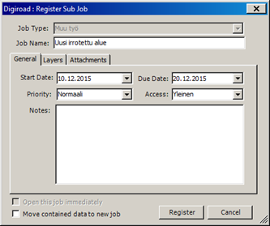

_Uuden ty&ouml;alueen rekister&ouml;inti._

Klikkaamalla register, sovellus kysyy, halutaanko rekister&ouml;id&auml; uusi ty&ouml;alue tai p&auml;ivitt&auml;&auml; vanha.

Jos on valittu Move contained data to new job, vanhasta ty&ouml;alueesta poistuu kohteet uuteen ty&ouml;alueeseen. Jos t&auml;t&auml; ei ole valittu, syntyy uusi ty&ouml;alue, mutta ilman vanhan ty&ouml;alueen kohteita.

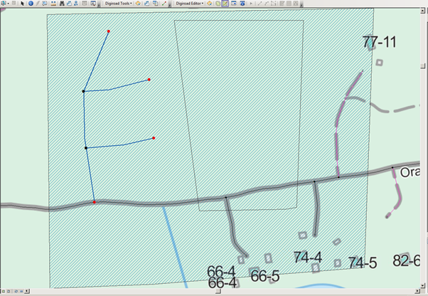

_Vanha ty&ouml;alue jakamisen j&auml;lkeen, kohteet vanhasta ty&ouml;alueesta on siirretty uuteen._

Rekister&ouml;innin j&auml;lkeen uusi ty&ouml;alue on samanlainen ty&ouml;alue, kuin kaikki muutkin ty&ouml;alueet.

4. Tasosijainnin lis&auml;&auml;minen automaattisesti
--------------------------

V&auml;yl&auml;verkon hallintaan tuodulle ty&ouml;linkki-aineistolle on mahdollista lis&auml;t&auml; automaattisesti tasosijainti -tieto, jos aineistossa on mukana Z-koordinaatit. Jos Z-koordinaatit puuttuvat, automaattinen tasosijainti antaa kaikille kohteille arvon 0 eli Pinnalla. Tasosijainnit voi m&auml;&auml;ritell&auml; my&ouml;s manuaalisesti ominaisuustietotauluun, jos Z-koordinaatteja ei ole toimitettu.

Tasosijainteja m&auml;&auml;ritt&auml;ess&auml; editointi tulee olla pois p&auml;&auml;lt&auml;. Tasosijainnit lasketaan Z-koordinaateista automaattisesti valitsemalla Feature Validation -ikkunan Tools -v&auml;lilehdelt&auml; Vertical Level of Links -> Update.

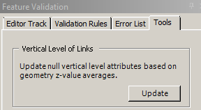

_Vertical Level of Links._

_Kun sovellus on laskenut tasosijainnit, ne on n&auml;ht&auml;viss&auml; ty&ouml;linkkien ominaisuustietotaulussa._

5. Keskener&auml;isen ty&ouml;n alueelle tulleet muutokset MTK-importeissa
--------------------------

SURAVAGE-t&ouml;iden on tarkoitus sopia nykyiseen MTK-geometriaan esim. linkkikatkojen osalta. Koska VVH-yll&auml;pit&auml;j&auml;n on hyv&auml; olla tietoinen keskener&auml;isen ty&ouml;n alueelle MTK-importeissa tulleista muutoksista, sovellus ilmoittaa t&auml;st&auml;, kun ty&ouml;t&auml; avataan. Ilmoitusta ei tule, jos k&auml;sitelt&auml;vien kohteiden lokissa ei ole kohteita (kts. lokin avaaminen seuraavasta luvusta).

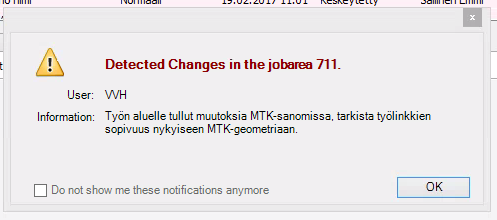

_Ilmoitus ty&ouml;n alueelle tulleista muutoksista._

Loki-ikkunaan voi painaa ok. T&auml;m&auml;n j&auml;lkeen avataan loki, ja tarkistetaan onko muutoksilla vaikutuksia ty&ouml;linkkeihin.

5.1. Lokin avaaminen
--------------------------

Lokin saa n&auml;kyviin valikosta Digiroad: Editor -> Digiroad: Job Changes. Loki aukeaa n&auml;yt&ouml;n vasempaan laitaan.

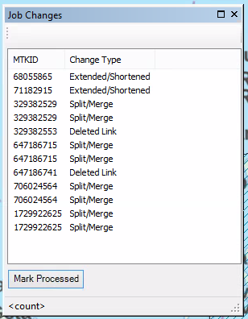

_Ty&ouml;n alueelle tulleiden muutosten loki._

Lokissa olevat sarakkeet kertovat kohteen MTK-ID:n ja MML:n tekem&auml;n muutostyypin. MTK-ID:n avulla k&auml;ytt&auml;j&auml; voi zoomata oikeaan paikkaan tarkistaakseen muutokset.

5.2. Lokin l&auml;pik&auml;ymiseen tarvittavat tasot
--------------------------

Lokin l&auml;pik&auml;ymist&auml; varten varsinaisen Ty&ouml;linkki-tason lis&auml;ksi tulee kartalla olla my&ouml;s taso Tielinkki (MTK), jotta kohteisiin voi zoomata ja niiden vaikutukset ty&ouml;h&ouml;n (ty&ouml;linkkeihin) tarkistaa.

5.3. Lokin l&auml;pik&auml;yminen
--------------------------

1. Klikataan hiiren oikealla __lokista__ kohdetta ja valitaan "Zoom to Extent", sovellus kohdistaa kyseiseen MTK-ID:seen eli tielinkkiin
1. Tarkistetaan, vaikuttaako ko. tielinkiss&auml; tapahtunut muutos ty&ouml;linkkeihin (kohteet eiv&auml;t v&auml;ltt&auml;m&auml;tt&auml; osu edes ty&ouml;linkkeihin, jolloin sen tarkempaa tarkastelua ei tarvita)
1. Kun tarkastelu on tehty, kohteen saa pois lokista painamalla painiketta "Mark Processed"

Jos lokissa on kohde statuksella "Deleted", ei siihen voi kohdistaa, koska se on poistettu. N&auml;m&auml; kohteet l&ouml;ytyv&auml;t tarvittaessa tasolta "Linkki-solmu historia", jos niit&auml; haluaa tarkastella.

6. Suunnitelmalinkkien historiointi manuaalisesti
--------------------------

Kun MML palauttaa suunnitelmalinkit VVH:aan MTK-sanomien mukana, vastaava Suravage-aineisto l&ouml;ytyy my&ouml;s tielinkki-tasolta. Suunnitelmakohteet historioituvat suunnitelmalinkki-tasolta. Jos MML:n toimittama suunnitelmalinkki ei ole t&auml;ysin identtinen suunnitelmalinkin kanssa geometrialtaan, suunnitelmalinkki ei historioidu automaattisesti, vaan se on teht&auml;v&auml; VVH:ssa VVH-yll&auml;pit&auml;j&auml;n toimesta.

Kohteet tulevat manuaaliseen historiointiin, jos

- Kohde on huomattavasti muuttunut MML:lla, esimerkiksi sit&auml; pidennetty, lyhennetty, katkaistu tai yhdistetty toiseen linkkiin
- Kohde on katsottu vastaavan jotain vanhaa MTK-ID:t&auml;, jolloin se ei ole varsinainen uusi Suravage-kohde eik&auml; sit&auml; olisi tarvinnut toimittaa MML:lle Suravage-prosessissa

6.1. Lokin avaaminen
--------------------------

Kullakin k&auml;ytt&auml;j&auml;ll&auml; on loki, jossa on lueteltu ne MTK-ID:t, jotka on tunnistetu Suravage-kohteiksi, mutta joiden suunnitelmalinkki&auml; ei ole voitu historioida automaattisesti. Lokin saa n&auml;kyviin valikosta Digiroad: Editor -> Suravage History Log....

Loki aukeaa n&auml;yt&ouml;n vasempaan laitaan.

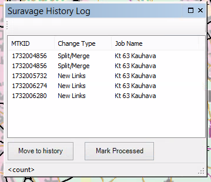

_Suravage manual history log._

Lokissa olevat sarakkeet kertovat kohteen MTK-ID:n, MML:n tekem&auml;n muutostyypin sek&auml; ty&ouml;n nimen, johon suunnitelmalinkki on alunperin tehty.

6.2 Historioinnissa tarvittavat tasot
--------------------------

Historiointia varten kartalle tulee valita Add Layers -valikosta tasot:

- Tielinkki (MTK)
- Suunnitelmalinkki

Tielinkki -tason avulla kohdistetaan lokista kohteeseen, jolle ei ole tunnistettu automaattisesti historioitavaa suunnitelmalinkki&auml;. Suunnitelmalinkki -tasolta vastaavasti valitaan kohteet, jotka historioidaan.

6.3. Historiointiprosessi
--------------------------

Historiointi tapahtuu seuraavalla tavalla:

1. Klikataan hiiren oikealla __lokista__ kohdetta ja valitaan "Zoom to Extent", sovellus kohdistaa kyseiseen MTK-ID:seen eli tielinkkiin
1. Huomataan suunnilleen samasta kohdasta l&ouml;ytyv&auml; suunnitelmalinkki, joka voidaan historioida, koska MTK-kohde on korvannut sen
1. Valitaan ArcMapin valintaty&ouml;kalulla historioitava __suunnitelmalinkki__ kartalta (historiointia varten kannattaa ko. taso laittaa asetukselle "Make this only selectable layer")
1. Painetaan lokin alareunasta painiketta "Move to history"
1. Nyt MTK-ID on k&auml;sitelty, ja sen saa pois lokista painamalla painiketta "Mark Processed"

N&auml;in k&auml;yd&auml;&auml;n l&auml;pi koko loki, jotta suunnitelmalinkit eiv&auml;t j&auml;&auml; roikkumaan suunnitelmalinkki-tasolle kun MTK-linkit ovat ne korvanneet.

7. MTK-p&auml;ivitysten ajaminen ja seuranta (vain kehitystiimin k&auml;ytt&ouml;&ouml;n)
--------------------------

VVH-sovellus p&auml;ivitt&auml;&auml; MTK:n p&auml;ivityssanomat joka aamuy&ouml; automaattisesti. Tarvittaessa p&auml;ivitykset voi my&ouml;s laittaa pois p&auml;&auml;lt&auml; (esim. Digiroad-julkaisua varten). Pois p&auml;&auml;lt&auml; olevista p&auml;ivityksist&auml; tai virheest&auml; p&auml;ivitysajossa ilmoitetaan kaikille k&auml;ytt&auml;jille sis&auml;&auml;nkirjautumisen yhteydess&auml;. Jos p&auml;ivitykset ovat p&auml;&auml;ll&auml;, eik&auml; virhetilanteita ole, niin ilmoitusta ei tule.

P&auml;ivityksi&auml; ja niiden ajoa hallitsee toistaiseksi VVH:n kehitystiimi, eik&auml; muiden k&auml;ytt&auml;jien ole syyt&auml; puuttua p&auml;ivitysten ajoon.

7.1. P&auml;ivitysten hallinta
--------------------------

P&auml;ivitykset voi poistaa automaattiajosta eli disabloida Digiroad Options -valikosta Database v&auml;lilehdelt&auml;. Kun VVH sovellus avataan, k&auml;ytt&auml;j&auml;lle ilmoitetaan, jos MTK-p&auml;ivitykset eiv&auml;t ole ajossa.

P&auml;ivitykset palautetaan ajoon palauttamalla ruksi ko. kohtaan. Normaalitilassa olevista p&auml;ivityksist&auml; ei tule ilmoituksia k&auml;ytt&auml;jille.

_Digiroad Updates. MTK-p&auml;ivitysten disablointi._

_Kirjautumisen yhteydess&auml; n&auml;ytett&auml;v&auml; huomautus p&auml;ivityksien disabloinnista._

7.2. Digiroad: RoadLink Changes
--------------------------

RoadLink Changes -valikossa voi tarkastella MTK-p&auml;ivityksi&auml; ja niiden muutoksia VVH:n tielinkki-aineistossa. RoadLink Changes avataan Digiroad Editor -alasvetovalikosta. Kun RoadLink Changes -ikkunan avaa, tulee kartalle my&ouml;s Tielinkin muutokset.lyr -taso, joka sis&auml;lt&auml;&auml; muutoskohteiden polygonit. Niiden avulla muutoksia voi olla helpompi tarkastella, erityisesti hy&ouml;dynt&auml;m&auml;ll&auml; attribuuttitaulua ja siell&auml; Select by Attributes -toimintoa esim. tietyn tyyppisten muutosten tarkasteluun (tuntematon, lyhennetty, pidennetty..).

_RoadLink Changes. MTK-p&auml;ivitysten tarkastelu._

List Updates -kohdasta voi valita, miten pitk&auml;lt&auml; ajalta haluaa historiaa tarkastella. Klikkaamalla ylemm&auml;st&auml; paneelista t&auml;m&auml;n j&auml;lkeen p&auml;ivityspakettia (zip), avautuu alempaan paneeliin sen tiedot linkkien muutoksista. Mit&auml; muutoksia n&auml;ytet&auml;&auml;n, voi valita Digiroad Optionsin Database -v&auml;lilehdelt&auml; tai RoadLink Changes -ikkunan Window -alasvetovalikosta.

Tuplaklikkaamalla muuttunutta kohdetta tai valitsemalla se hiiren oikealla ja Pan to Extent tai Zoom to extent p&auml;&auml;see tarkastelemaan kohdetta kartalla.

Eri muutostyyppej&auml; ovat:

0 - Tuntematon
1 - Yhdistetty (muokattu osa)
2 - Yhdistetty (poistettu osa)
3 - Pidennetty (yhtenev&auml; osa)
4 - Pidennetty (uusi osa)
5 - Jaettu (muokattu osa)
6 - Jaettu (uusi osa)
7 - Lyhennetty (yhtenev&auml; osa)
8 - Lyhennetty (poistettu osa)
9 - Korvattu uudella (pidemm&auml;ll&auml;)
10 - Korvattu uudella (lyhyemm&auml;ll&auml;)
11 - Poistettu
12 - Uusi
13 - Korvattu uudella (yhtenev&auml; osa)
14 - Korvattu uudella (uusi osa)
15 - Korvattu uudella (poistettu osa)

Kun tarkastelee p&auml;ivityshistorian kohteita, kannattaa kartalle ottaa my&ouml;s tielinkin historia -taso ja visualisoida kaikki historian muutostyypit n&auml;kyviin. Tielinkin historiassa n&auml;kee vanhat tielinkit sellaisenaan, kuin ne ovat menneet historiaan.

7.3 Here-flip
--------------------------

Maastotietokannan kohteiden digitointisuunnat tarkistetaan MTK-importin yhteydess&auml;. Tarvittaessa digitointisuunta ja digitointisuuntariippuvaiset ominaisuustiedot k&auml;&auml;nnet&auml;&auml;n Here-flip -s&auml;&auml;nn&ouml;n mukaisesti. Here-flip -s&auml;&auml;nt&ouml; tarkoittaa, ett&auml; kaikkien tielinkkien digitointisuunnat noudattavat seuraavia s&auml;&auml;nt&ouml;j&auml;:

1. Linkin alkupiste on aina sen etel&auml;isempi piste
1. T&auml;ysin it&auml;-l&auml;nsisuuntaisella linkill&auml; alkupiste on l&auml;ntinen alkupiste

Tarvittaessa digitointisuunta k&auml;&auml;nnet&auml;&auml;n (etel&auml;st&auml; pohjoiseen tai l&auml;nnest&auml; it&auml;&auml;n), ja MTKHEREFLIP -kent&auml;n arvoksi tulee 1. Vastaavasti yksisuuntaisuus tieto k&auml;&auml;nnet&auml;&auml;n (jos arvo on muuta kuin molempiin suuntiin) ja osoitenumeroiden alku- ja loppuarvot k&auml;&auml;nnet&auml;&auml;n toisin p&auml;in.

