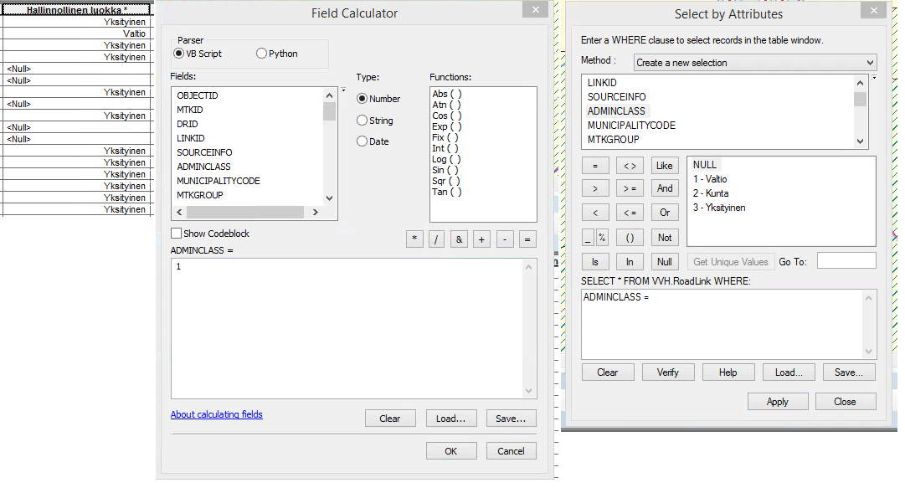

VVH koodiarvoluettelo
=========================================

Ominaisuustietotaulussa kent&auml;n nimi ja koodiarvot n&auml;kyv&auml;t selke&auml;mp&auml;n&auml; versiona. Field Calculator ja Select by Attributes -ty&ouml;kalut k&auml;ytt&auml;v&auml;t kuitenkin tietokannan kenttien nimi&auml; ja koodiarvoja. 

Alla olevaan taulukkoon on kerrottu kenttien nimet molemmilla tavoilla, sek&auml; kunkin kent&auml;n koodiarvoluettelot, jos kentt&auml; on koodiarvollinen.

|Ominaisuustieto|Tyyppi|Koodiarvot|
|---------------|------|-----------|
|Objectid (OBJECTID)|Kokonaisluku||
|Digiroad-tunniste (DRID)|Kokonaisluku||
|Linkkitunniste (LINKID)|Kokonaisluku||
|Ty&ouml;n tunniste (JOBID)|Kokonaisluku||
|Aineistol&auml;hde (SOURCEINFO)|Koodiarvo|0 Muu 1 Maanmittauslaitos 2 SYKE 3 Merenkulkulaitos 4 Mets&auml;hallitus 5 Puolustusvoimat 6 Kunta 7 Liikennevirasto|
|Hallinnollinen luokka (ADMINCLASS)|Koodiarvo|1 Valtio 2 Kunta 3 Yksityinen|
|Kohderyhm&auml; (MTKGROUP)|Koodiarvo|24 Suunnitelmatiest&ouml; 25 Tiest&ouml; (viiva) 45 Tiest&ouml; (piste) 64 Tiest&ouml; (alue)|
|Valmiusaste (CONSTRUCTIONTYPE)|Koodiarvo|0 K&auml;yt&ouml;ss&auml; 1 Rakenteilla 3 Suunnitteilla|
|Yksisuuntaisuus (DIRECTIONTYPE)|Koodiarvo|0 Kaksisuuntainen 1 Digitointisuunnassa 2 Digitointisuuntaa vastaan|
|Tasosijainti (VERTICALLEVEL)|Koodiarvo|10 M&auml;&auml;rittelem&auml;t&ouml;n 0 Pinnalla -1 Pinnan alla 1 Pinnan yll&auml; taso 1 2 Pinnan yll&auml; taso 2 3 Pinnan yll&auml; taso 3 4 Pinnan yll&auml; taso 4 5 Pinnan yll&auml; taso 5 -11 Tunnelissa|
|Kuntatunnus (MUNICIPALITYCODE)|Koodiarvo|Koodiarvo kuntanumeron mukaan|
|Hankkeen arvioitu valmistuminen (ESTIMATED_COMPLETION)|P&auml;iv&auml;m&auml;&auml;r&auml; (pp.kk.vvvv)||
|MTK-tunniste (MTKID)|Kokonaisluku||
|Kohdeluokka (MTKCLASS)|Koodiarvo|Suravagessa k&auml;yt&ouml;ss&auml; vain luokka 12314 K&auml;vely- ja/tai py&ouml;r&auml;tie |
|Tienumero (ROADNUMBER)|Kokonaisluku||
|Tieosanumero (ROADPARTNUMBER)|Kokonaisluku||
|Ajoratakoodi (TRACK_CODE)|Kokonaisluku|K&auml;yt&auml;nn&ouml;ss&auml; arvo 0, 1 tai 2|
|P&auml;&auml;llystetieto (SURFACETYPE)|Koodiarvo|0 Tuntematon 1 Ei p&auml;&auml;llystett&auml; 2 Kestop&auml;&auml;llyste|
|Sijaintitarkkuus (HORIZONTALACCURACY)|Koodiarvo|Ei k&auml;yt&ouml;ss&auml; Suravagessa 500 0,5 m 800 0,8 m 1000 1 m 10000 10 m 100000 100m 12500 12,5 m 15000 15 m 2000 2 m 20000 20 m 25000 25 m 3000 3 m 30000 30 m 4000 4 m 5000 5 m 7500 7,5 m 8000 8 m 80000 80 m 0 Ei m&auml;&auml;ritelty|
|Korkeustarkkuus (VERTICALACCURACY)|Koodiarvo|Ei k&auml;yt&ouml;sss&auml; Suravagessa 500 0,5 m 800 0,8 m 1000 1 m 10000 10 m 100000 100m 12500 12,5 m 15000 15 m 2000 2 m 20000 20 m 25000 25 m 3000 3 m 30000 30 m 4000 4 m 5000 5 m 7500 7,5 m 8000 8 m 80000 80 m 1 Ei m&auml;&auml;ritelty 100001 KM 10 m 201 KM 2 m 250001 KM 25 m|
|Kulkutapa (VECTORTYPE)|Koodiarvo|1 Murto 2 K&auml;yr&auml;|
|Pituus (GEOMETRYLENGTH)|Desimaaliluku||
|Osoitenumero, vasen, alku (FROM_LEFT)|Kokonaisluku||
|Osoitenumero, vasen, loppu (TO_LEFT)|Kokonaisluku||
|Osoitenumero, oikea, alku (FROM_RIGHT)|Kokonaisluku||
|Osoitenumero, oikea, loppu (TO_RIGHT)|Kokonaisluku||
|Voimassaolo, alku (VALID_FROM)|P&auml;iv&auml;m&auml;&auml;r&auml;||
|Voimassaolo, loppu (VALID_TO)|P&auml;iv&auml;m&auml;&auml;r&auml;||
|Perustusp&auml;iv&auml; (CREATED_DATE)|P&auml;iv&auml;m&auml;&auml;r&auml;||
|Perustaja (CREATED_BY)|Tekstikentt&auml;||
|Validointistatus (VALIDATIONSTATUS)|Koodiarvo|0 Ei tarkastettu 1 Virheellinen 2 Hyv&auml;ksytty 3 K&auml;ytt&auml;j&auml;n hyv&auml;ksym&auml;|
|Kohteen olotila (OBJECTSATUS)|Koodiarvo|1 Alkuper&auml;inen 2 Muokattu ominaisuuksia 3 Muokattu 4 Uusi 8 Merkattu poistettavaksi 9 Poistettu|
|Tien nimi (suomi) (ROADNAME_FI)|Tekstikentt&auml;||
|Tien nimi (ruotsi) (ROADNAME_SE)|Tekstikentt&auml;||
|Tien nimi (saame) (ROADNAME_SM)|Tekstikentt&auml;||
|MTKHEREFLIP|Koodiarvo|0 Ei k&auml;&auml;nnetty 1 K&auml;&auml;nnetty|

_Hallinnollinen luokka ominaisuustietotaulussa, Field Calculatorissa ja Select by Attributes -ty&ouml;kalussa._
