Viite-sovelluksen k&auml;ytt&ouml;ohje
======================================================
VIITE
-----------------------

VIITE on Liikenneviraston tieosoitej&auml;rjestelm&auml;n yll&auml;pito-sovellus. Viitteell&auml; hallitaan tieosoitej&auml;rjestelm&auml;n muutoksia ja se tarjoaa ajantasaisen kuvauksen tiest&ouml;st&auml; Digiroadin (VVH:n) ajantasaisella linkkigeometrialla.

Seuraavasta linkist&auml; p&auml;&auml;see Liikenneviraston extranet VIITE-sivulle (t&auml;ll&auml; hetkell&auml; testiextranet k&auml;yt&ouml;ss&auml;, varsinainen extranet-osoite p&auml;ivitet&auml;&auml;n my&ouml;hemmin), jossa kerrotaan Viitteen yleiskuvaus ja annetaan tiedotteita k&auml;ytt&auml;jille. Sivulla yll&auml;pidet&auml;&auml;n my&ouml;s dokumentaatiota Viitteest&auml;. 

https://testiextranet.liikennevirasto.fi/extranet/web/fi/viite?kategoria=7457637 (testi) 

__Huom! Suosittelemme Firefoxia tai Chromea, kun sovelluksella yll&auml;pidet&auml;&auml;n Digiroad-tietoja.__

__Huom! K&auml;ytt&ouml;ohjeen kuvia voi klikata isommaksi, jolloin tekstit erottuvat paremmin.__

1. Miten p&auml;&auml;st&auml; alkuun?
-----------------------

Viite-sovelluksen k&auml;ytt&ouml;&auml; varten tarvitaan Liikenneviraston tunnukset (A-, U-, LX-, K- tai L-alkuinen). Mik&auml;li sinulla ei ole tunnuksia, pyyd&auml; ne yhteyshenkil&ouml;lt&auml;si Liikennevirastosta.

Kaikilla Liikenneviraston tunnuksilla on p&auml;&auml;sy Viite-sovellukseen.

Viite-sovellukseen kirjaudutaan osoitteessa: <a href=https://extranet.liikennevirasto.fi/viite/ target="_blank">https://extranet.liikennevirasto.fi/viite/. </a>

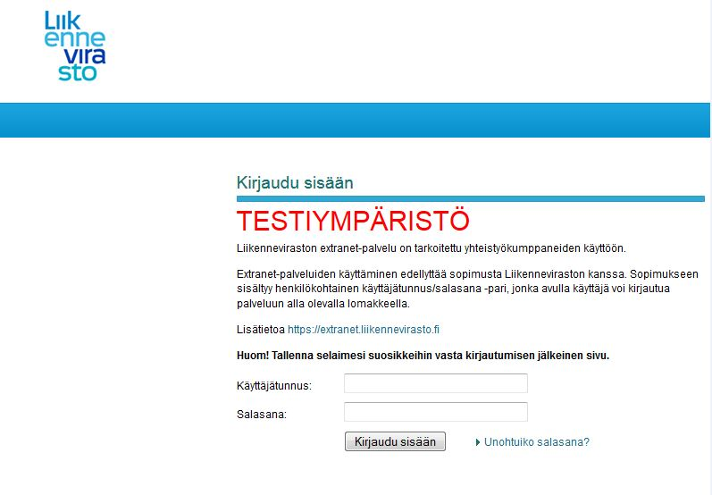

_Kirjautuminen Viite-sovellukseen._

Kirjautumisen j&auml;lkeen avautuu karttak&auml;ytt&ouml;liittym&auml;ss&auml; katselutila.

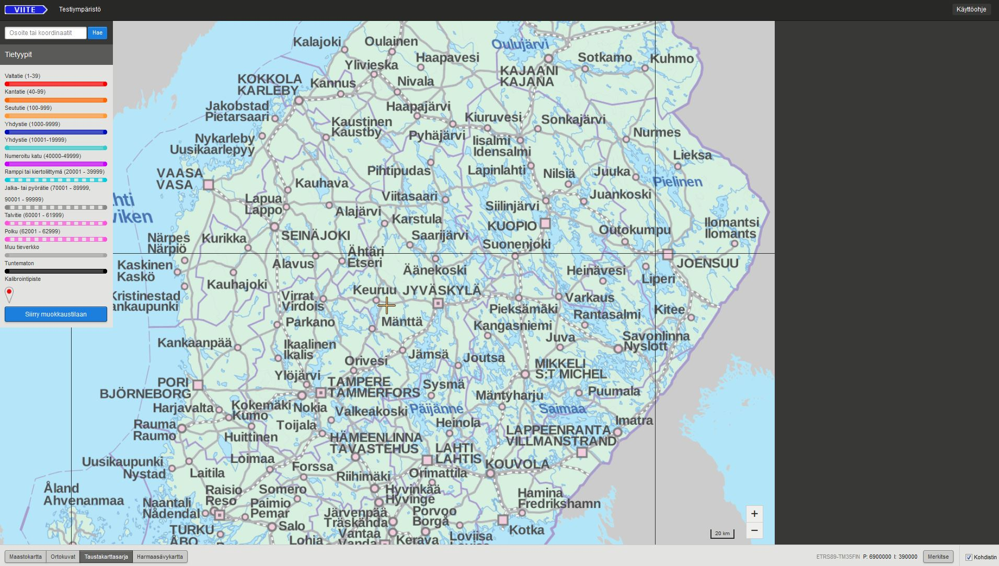

_Karttan&auml;kym&auml; kirjautumisen j&auml;lkeen._

Oikeudet on rajattu maantieteellisesti sek&auml; k&auml;ytt&auml;j&auml;n roolin mukaan.

- Ilman erikseen annettuja oikeuksia Liikenneviraston tunnuksilla p&auml;&auml;see katselemaan kaikkia tieosoitteita
- Sovelluksen k&auml;ytt&auml;j&auml;ll&auml; on oikeudet muokata h&auml;nelle m&auml;&auml;riteltyjen Elyjen maantieteellisten kuntarajojen sis&auml;puolella olevia tieosoitteita
- Joillekin k&auml;ytt&auml;jille on voitu antaa oikeudet koko Suomen alueelle
- Tieosoiteprojektit -painike ja Siirry muokkaustilaan -painike n&auml;kyv&auml;t vain k&auml;ytt&auml;jille, joilla on oikeudet muokata tieosoitteita

Jos kirjautumisen j&auml;lkeen ei avaudu karttak&auml;ytt&ouml;liittym&auml;n katselutilaa, ei kyseisell&auml; tunnuksella ole p&auml;&auml;sy&auml; Liikenneviraston extranettiin. T&auml;ll&ouml;in tulee ottaa yhteytt&auml; Liikennevirastossa tai Elyss&auml; omaan yhteyshenkil&ouml;&ouml;n.

1.1 Mist&auml; saada opastusta?
--------------------------

Viite-sovelluksen k&auml;yt&ouml;ss&auml; avustaa vuoden 2017 loppuun asti Emmi Sallinen, emmi.sallinen@karttakeskus.fi

####Ongelmatilanteet####

Sovelluksen toimiessa virheellisesti (esim. kaikki aineistot eiv&auml;t lataudu oikein) toimi seuraavasti:

- Lataa sivu uudelleen n&auml;pp&auml;imist&ouml;n F5-painikkeella.
- Tarkista, ett&auml; selaimestasi on k&auml;yt&ouml;ss&auml; ajan tasalla oleva versio ja selaimesi on Mozilla Firefox tai Chrome
- Jos edell&auml; olevat eiv&auml;t korjaa ongelmaa, ota yhteytt&auml; emmi.sallinen@karttakeskus.fi

2. Perustietoja Viite-sovelluksesta
--------------------------

2.1 Viite-sovelluksen yhteydet muihin j&auml;rjestelmiin
--------------------------

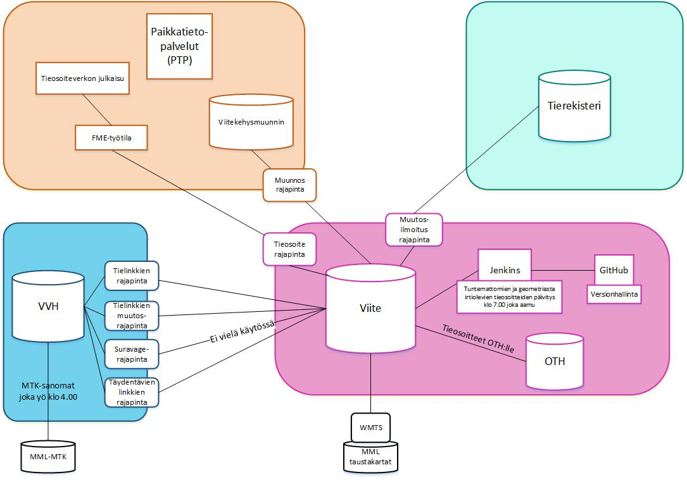

_Viite-sovelluksen yhteydet muihin j&auml;rjestelmiin ja palveluihin._

##V&auml;yl&auml;verkon hallinta (VVH)##

Viite-sovelluksessa pohja-aineistona oleva geometria tulee Liikenneviraston V&auml;yl&auml;verkon hallinnan (VVH) sovelluksessa. VVH-sovellukseen ladataan p&auml;ivitt&auml;in Maanmittauslaitokselta p&auml;ivitykset Maastotietokannan (MTK) keskilinja-aineistoon, jolloin my&ouml;s Viite-sovelluksessa on k&auml;yt&ouml;ss&auml; uusi keskilinjageometria joka p&auml;iv&auml;.

##Digiroad: Ominaisuustietojen hallinta##

Molemmissa sovelluksissa on k&auml;yt&ouml;ss&auml; sama, V&auml;yl&auml;verkon hallinnan tarjoama keskilinjageometria.

Lis&auml;ksi OTH-sovellus hy&ouml;dynt&auml;&auml; Viitteen tieosoitetietoja, jotka n&auml;ytet&auml;&auml;n OTH:ssa tielinkin ominaisuustietona.

##Liikenneviraston Tierekisteri##

_T&auml;ydennet&auml;&auml;n my&ouml;hemmin, kun tieosoitemuutosty&ouml;kalu on pidemm&auml;ll&auml;._

2.2 Tiedon rakentuminen Viite-sovelluksessa
--------------------------

Viite-sovelluksessa tieosoiteverkko piirret&auml;&auml;n VVH:n tarjoaman Maanmittauslaitoksen keskilinja-aineiston p&auml;&auml;lle. Maanmittauslaitoksen keskilinja-aineisto muodostuu tielinkeist&auml;. Tielinkki on tien, kadun, kevyen liikenteen v&auml;yl&auml;n tai lauttayhteyden keskilinjageometrian pienin yksikk&ouml;. Tieosoiteverkko piirtyy geometrian p&auml;&auml;lle tieosoitesegmenttein&auml; _lineaarisen referoinnin_ avulla. 

Tielinkki on Viite-sovelluksen lineaarinen viitekehys, eli sen geometriaan sidotaan tieosoitesegmentit. Kukin tieosoitesegmentti tiet&auml;&auml; mille tielinkille se kuuluu (tielinkin ID) sek&auml; kohdan, josta se alkaa ja loppuu kyseisell&auml; tielinkill&auml;. Tieosoitesegmentit ovat siten tielinkin mittaisia tai niit&auml; lyhyempi&auml; tieosoitteen osuuksia. K&auml;ytt&ouml;liittym&auml;ss&auml; kuitenkin pienin valittavissa oleva osuus on tielinkin mittainen (kts. luvut 4.1 ja 7.1).

Kullakin tieosoitesegmentill&auml; on lis&auml;ksi tiettyj&auml; sille annettuja ominaisuustietoja, kuten tienumero, tieosanumero ja ajoratakoodi. Tieosoitesegmenttien ominaisuustiedoista on kerrottu tarkemmin kohdassa "Tieosoitteen ominaisuustiedot".

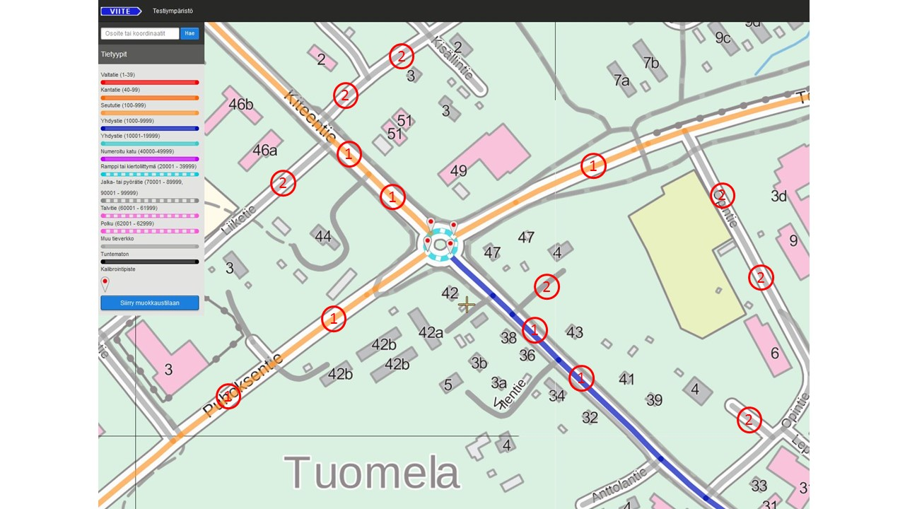

_Tieosoitesegmenttej&auml; (1) ja muita tielinkkej&auml; (2) Viitteen karttaikunnassa._

Tieosoitesegmentit piirret&auml;&auml;n Viite-sovelluksessa kartalle erilaisin v&auml;rein (kts. kohta 4. Tieosoiteverkon katselu). Muut tielinkit, jotka eiv&auml;t kuulu tieosoiteverkkoon, piirret&auml;&auml;n kartalle harmaalla. N&auml;it&auml; ovat esimerkiksi tieosoitteettomat kuntien omistamat tiet, ajopolut, ajotiet jne.

Palautteet geometrian eli tielinkkien virheist&auml; voi laittaa Maanmittauslaitokselle, maasto@maanmittauslaitos.fi. Mukaan selvitys virheest&auml; ja sen sijainnista (esim. kuvakaappaus).

3. Karttan&auml;kym&auml;n muokkaus
--------------------------

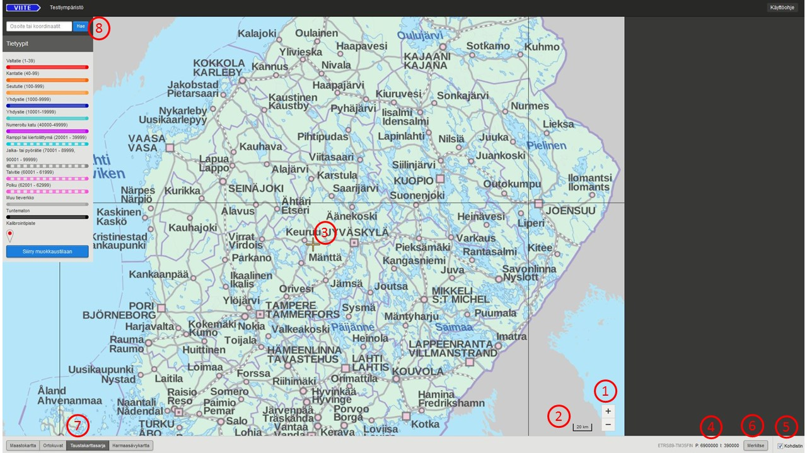

_Karttan&auml;kym&auml;._

####Kartan liikutus####

Karttaa liikutetaan raahaamalla.

####Mittakaavataso####

Kartan mittakaavatasoa muutetaan joko hiiren rullalla, tuplaklikkaamalla, Ctrl+piirto (alue) tai mittakaavapainikkeista (1). Mittakaavapainikkeita k&auml;ytt&auml;m&auml;ll&auml; kartan keskitys s&auml;ilyy. Hiiren rullalla, tuplaklikkaamalla tai Shift+piirto (alue) kartan keskitys siirtyy kursorin kohtaan.  K&auml;yt&ouml;ss&auml; oleva mittakaavataso n&auml;kyy kartan oikeassa alakulmassa (2).

####Kohdistin####

Kohdistin (3) kertoo kartan keskipisteen. Kohdistimen koordinaatit n&auml;kyv&auml;t karttaikkunan oikeassa alakulmassa(4). Kun kartaa liikuttaa eli keskipiste muuttuu, p&auml;ivittyv&auml;t koordinaatit. Oikean alakulman valinnan (5) avulla kohdistimen saa my&ouml;s halutessaan piilotettua kartalta.

####Merkitse piste kartalla####

Merkitse-painike (6) merkitsee sinisen pisteen kartan keskipisteeseen. Merkki poistuu vain, kun merkit&auml;&auml;n uusi piste kartalta.

####Taustakartat####

Taustakartaksi voi valita vasemman alakulman painikkeista maastokartan, ortokuvat tai taustakarttasarjan. K&auml;yt&ouml;ss&auml; on my&ouml;s harmaas&auml;vykartta (t&auml;m&auml;n hetken versio ei kovin k&auml;ytt&ouml;kelpoinen).

####Hakukentt&auml;####

K&auml;ytt&ouml;liittym&auml;ss&auml; on hakukentt&auml; (8), jossa voi hakea koordinaateilla ja katuosoitteella tai tieosoitteella. Haku suoritetaan kirjoittamalla hakuehto hakukentt&auml;&auml;n ja klikkaamalla Hae. Hakutulos tulee listaan hakukent&auml;n alle. Hakutuloslistassa ylimp&auml;n&auml; on maantieteellisesti kartan nykyist&auml; keskipistett&auml; l&auml;himp&auml;n&auml; oleva kohde. Mik&auml;li hakutuloksia on vain yksi, keskittyy kartta automaattisesti haettuun kohteeseen. Jos hakutuloksia on useampi kuin yksi, t&auml;ytyy listalta valita tulos, jolloin kartta keskittyy siihen. Tyhjenn&auml; tulokset -painike tyhjent&auml;&auml; hakutuloslistan.

Tieosoitteella haku: Tieosoitteesta hakukentt&auml;&auml;n voi sy&ouml;tt&auml;&auml; koko osoitteen tai osan siit&auml;. Esim. 2 tai 2 1 150. (Varsinainen tieosoitehaku tieosoitteiden yll&auml;pidon tarpeisiin toteutetaan my&ouml;hemmin)

Koordinaateilla haku: Koordinaatit sy&ouml;tet&auml;&auml;n muodossa "pohjoinen (7 merkki&auml;), it&auml; (6 merkki&auml;)". Koordinaatit tulee olla ETRS89-TM35FIN -koordinaattij&auml;rjestelm&auml;ss&auml;. Esim. 6975061, 535628.

Katuosoitteella haku: Katuosoitteesta hakukentt&auml;&auml;n voi sy&ouml;tt&auml;&auml; koko ositteen tai sen osan. Esim. "Mannerheimintie" tai "Mannerheimintie 10, Helsinki".

4. Tieosoiteverkon katselu
--------------------------

Tieosoiteverkko tulee n&auml;kyviin, kun zoomaa tasolle, jossa mittakaavajanassa on 2 km. T&auml;st&auml; tasosta ja sit&auml; l&auml;hemp&auml;&auml; piirret&auml;&auml;n kartalle valtatiet, kantatiet, seututiet, yhdystiet ja numeroidut kadut. Kun zoomaa tasolle, jossa mittakaavajanassa on suurempi 100 metri&auml; (100 metrin mittakaavajanoja on kaksi kappaletta), tulevat n&auml;kyviin kaikki tieverkon kohteet.

Tieosoiteverkko on v&auml;rikoodattu tienumeroiden mukaan. Vasemman yl&auml;kulman selitteess&auml; on kerrottu kunkin v&auml;rikoodin tienumerot. Lis&auml;ksi kartalle piirtyv&auml;t et&auml;isyyslukemasymbolit, eli ne kohdat, joissa vaihtuu tieosa tai ajoratakoodi. Tieverkon kasvusuunta n&auml;kyy kartalla pisaran mallisena nuolena.

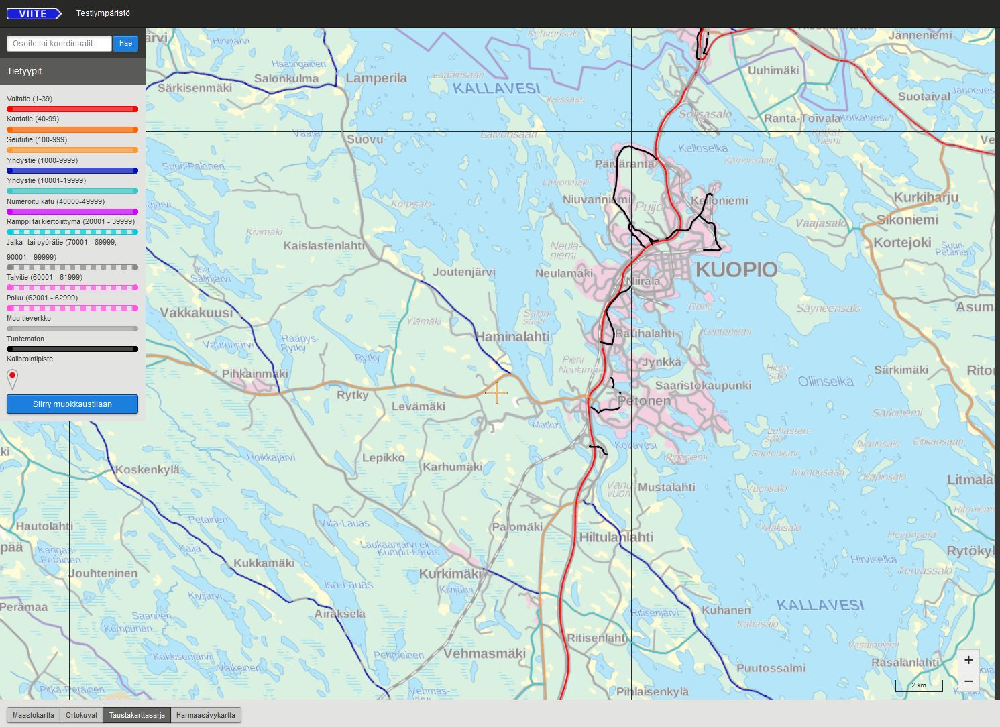

_Mittakaavajanassa 2 km._

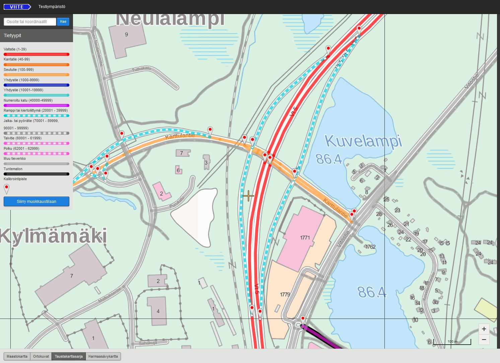

_Mittakaavajanassa 100 m._

Tieosoitteelliset kadut erottuvat kartalla muista tieosoitesegmenteist&auml; siten, ett&auml; niiden ymp&auml;rill&auml; on musta v&auml;ritys.

_Tieosoitteellinen katu, merkattuna mustalla v&auml;rityksell&auml; tienumeron v&auml;rityksen lis&auml;ksi._

Kun hiiren vie tieosoiteverkon p&auml;&auml;lle, tulee kartalle n&auml;kyviin "infolaatikko", joka kertoo kyseisen tieosoitesegmentin tienumeron, tieosanumeron, ajoratakoodin, alkuet&auml;isyyden ja loppuet&auml;isyyden.

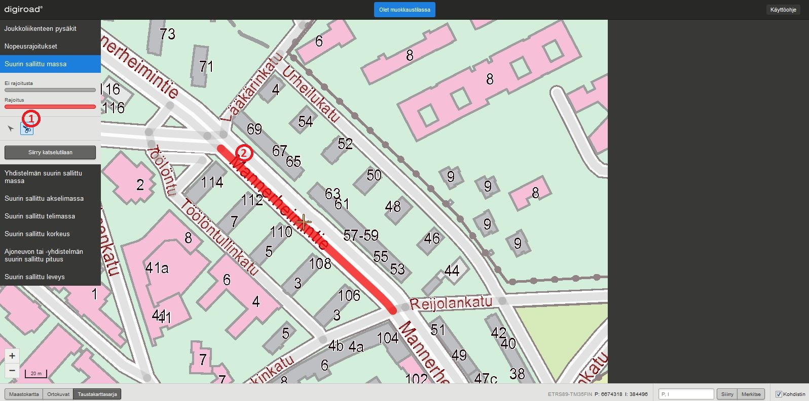

_Infolaatikko, kun hiiri on viety tieosoitesegmentin p&auml;&auml;lle._

4.1 Kohteiden valinta
--------------------------
Kohteita voi valita klikkaamalla kartalta. Klikkaamalla kerran, sovellus valitsee kartalta ruudulla n&auml;kyv&auml;n osuuden kyseisest&auml; tieosasta, eli osuuden jolla on sama tienumero, tieosanumero ja ajoratakoodi. Valittu tieosa korostuu kartalla (1), ja sen tiedot tulevat n&auml;kyviin karttaikkunan oikeaan laitaan ominaisuustieton&auml;kym&auml;&auml;n (2).

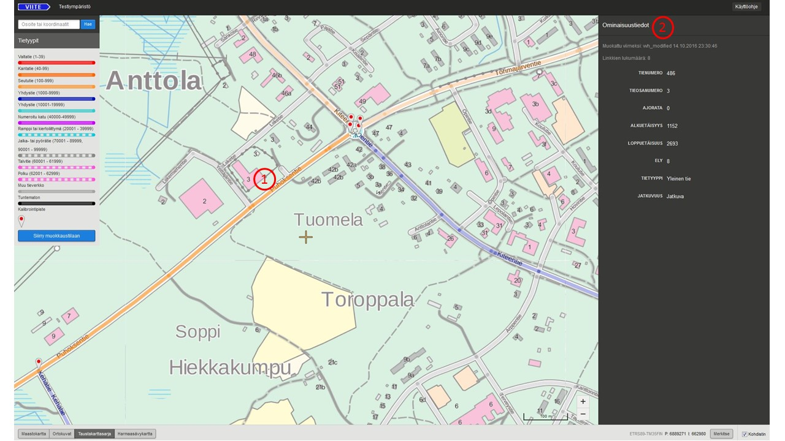

_Tieosan valinta._

Tuplaklikkaus valitsee yhden tielinkin mittaisen osuuden tieosoitteesta. Valittu osuus korostuu kartalla (3), ja sen tiedot tulevat n&auml;kyviin karttaikkunan oikeaan laitaan ominaisuustieton&auml;kym&auml;&auml;n (4).

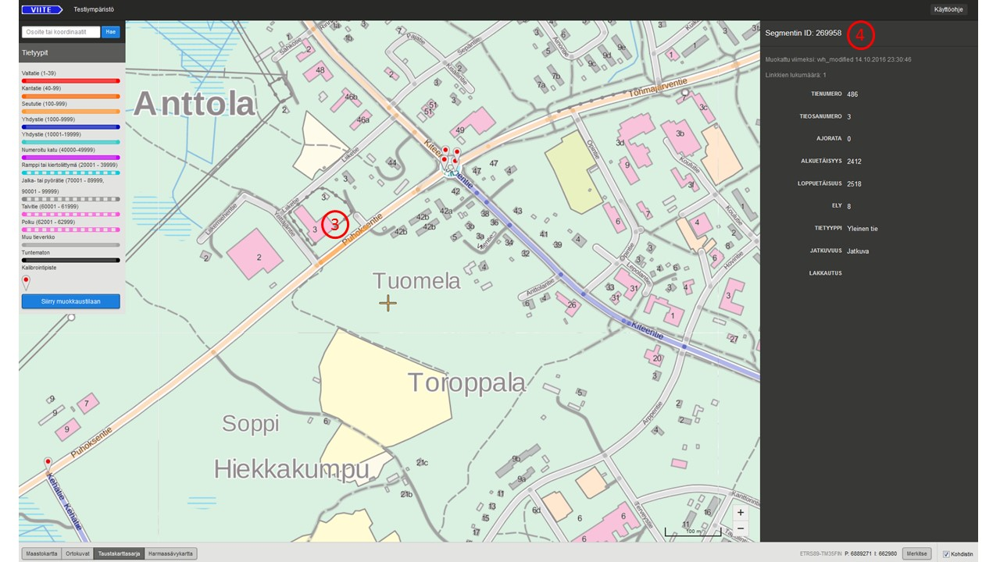

_Tielinkin mittaisen osuuden valinta._

##Tieosoitteen ominaisuustiedot##

Tieosoitteilla on seuraavat ominaisuustiedot:

|Ominaisuustieto|Kuvaus|Sovellus muodostaa|
|---------------|------|----------------|
|Muokattu viimeksi*|Muokkaajan k&auml;ytt&auml;j&auml;tunnus ja tiedon muokkaushetki.|X|
|Linkkien lukum&auml;&auml;r&auml;|Niiden tielinkkien lukum&auml;&auml;r&auml;, joihin valinta  kohdistuu.|X|
|Tienumero|Tieosoiteverkon mukainen tienumero. L&auml;ht&ouml;aineistona Tierekisterin tieosoitteet 2.1.2017.||
|Tieosanumero|Tieosoiteverkon mukainen tieosanumero. L&auml;ht&ouml;aineistona Tierekisterin tieosoitteet 2.1.2017.||
|Ajorata|Tieosoiteverkon mukainen ajoratakoodi. L&auml;ht&ouml;aineistona Tierekisterin tieosoitteet 2.1.2017.||
|Alkuet&auml;isyys**|Tieosoiteverkon et&auml;isyyslukemien avulla laskettu alkuet&auml;isyys. Et&auml;isyyslukeman kohdalla alkuet&auml;isyyden l&auml;ht&ouml;aineistona on Tierekisterin tieosoitteet 2.1.2017.|X|
|Loppuet&auml;isyys**|Tieosoiteverkon et&auml;isyyslukemien avulla laskettu loppuet&auml;isyys. Et&auml;isyyslukeman kohdalla loppuet&auml;isyyden l&auml;ht&ouml;aineistona on Tierekisterin tieosoitteet 2.1.2017.|X|
|ELY|Liikenneviraston ELY-numero.|X|
|Tietyyppi|Muodostetaan Maanmittauslaitoksen hallinnollinen luokka -tiedoista, kts. taulukko alempana. Jos valitulla tieosalla on useita tietyyppej&auml;, ne kerrotaan ominaisuustietotaulussa pilkulla erotettuna.|X|
|Jatkuvuus|Tieosoiteverkon mukainen jatkuvuus-tieto. L&auml;ht&ouml;aineistona Tierekisterin tieosoitteet 2.1.2017.|X|

*)Muokattu viimeksi -tiedoissa vvh_modified tarkoittaa, ett&auml; muutos on tullut Maanmittauslaitokselta joko geometriaan tai geometrian ominaisuustietoihin. Muokattu viimeksi -p&auml;iv&auml;t ovat kaikki v&auml;hint&auml;&auml;n 29.10.2015, koska tuolloin on tehty Maanmittauslaitoksen geometrioista alkulataus VVH:n tietokantaan.

**)Tieosoiteverkon et&auml;isyyslukemat (tieosan alku- ja loppupisteet sek&auml; ajoratakoodin vaihtuminen) m&auml;&auml;rittelev&auml;t mitatut alku- ja loppuet&auml;isyydet. Et&auml;isyyslukemien v&auml;lill&auml; alku- ja loppuet&auml;isyydet lasketaan tieosoitesegmenttikohtaisesti Viite-sovelluksessa.

__Tietyypin muodostaminen Viite-sovelluksessa__

J&auml;rjestelm&auml; muodostaa tietyyppi-tiedon automaattisesti Maanmittauslaitoksen aineiston pohjalta seuraavalla tavalla:

|Tietyyppi|Muodostamistapa|
|---------|---------------|
|1 Maantie|MML:n hallinnollinen luokka arvolla 1 = Valtio|
|2 Lauttav&auml;yl&auml; maantiell&auml;|MML:n hallinnollinen luokka arvolla 1 = Valtio ja MML:n kohdeluokka arvolla lautta/lossi|
|3 Kunnan katuosuus|MML:n hallinnollinen luokka arvolla 2 = Kunta|
|5 Yksityistie|MML:n hallinnollinen luokka arvolla 3 = Yksityinen|
|9 Ei tiedossa|MML:lla ei tiedossa hallinnollista luokkaa|

Palautteet hallinnollisen luokan virheist&auml; voi toimittaa Maanmittauslaitokselle osoitteeseen maasto@maanmittauslaitos.fi. Mukaan selvitys virheest&auml; ja sen sijainnista (kuvakaappaus tms.).

##Kohdistaminen tieosoitteeseen tielinkin ID:n avulla##

Kun kohdetta klikkaa kartalla, tulee selaimen osoiteriville n&auml;kyviin valitun kohteen tielinkin ID. Osoiterivill&auml; olevan URL:n avulla voi my&ouml;s kohdistaa k&auml;ytt&ouml;liittym&auml;ss&auml; ko. tielinkkiin. URL:n voi esimerkiksi l&auml;hett&auml;&auml; toiselle henkil&ouml;lle s&auml;hk&ouml;postilla, jolloin h&auml;n p&auml;&auml;see samaan paikkaan k&auml;ytt&ouml;liittym&auml;ss&auml; helposti.

Esimerkiksi: https://extranet.liikennevirasto.fi/viite/#linkProperty/799497 n&auml;kyy kuvassa osoiterivill&auml; (5). 799497 on tielinkin ID.

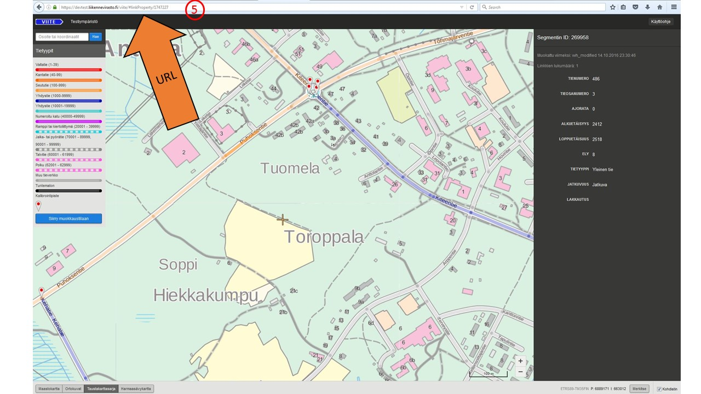

_Kohdistaminen tielinkin ID:ll&auml;._

5. Tuntemattomat tieosoitesegmentit
--------------------------

Tuntemattomilla tieosoitesegmenteill&auml; tarkoitetaan tieosoitesegmenttej&auml;, joilla pit&auml;isi olla tieosoite, mutta niill&auml; ei ole sit&auml;. Puuttuva tieosoite voi johtua esimerkiksi siit&auml;, ett&auml; Maanmittauslaitoksen tekem&auml;t geometriap&auml;ivitykset ovat aiheuttaneet tielinkki-aineistossa niin suuria muutoksia, ettei tieosoitesegmentti&auml; saada en&auml;&auml; sovitettua p&auml;ivittyneen tielinkin p&auml;&auml;lle.

Tuntemattomaksi tieosoitesegmentiksi katsotaan kohteet, joilta puuttuu tieosoitesegmentti ja ne ovat: 

1. Maanmittauslaitoksen hallinnollisessa luokittelussa arvolla 1 = Valtion omistama tie

	- N&auml;m&auml; kohteet muodostavat suurimman osan tieosoiteverkosta

1. Sellaisessa sijainnissa, ett&auml; siin&auml; on aiemmin ollut voimassaoleva tieosoite

	- N&auml;m&auml; kohteet ovat esimerkiksi tieosoitteellisia katuja (Maanmittauslaitoksen hallinnollinen luokka arvolla 2 = Kunnan omistama)

Tuntemattomat tieosoitesegmentit visualisoidaan kartalle mustalla viivalla ja kysymysmerkill&auml; (1). Useimmiten tuntemattoman tieosoitesegmentin kohdalla on my&ouml;s geometriasta irti oleva tieosoitesegmentti, joka tulee korjata uudelle geometrialle (kts. luvut 8 ja 9).

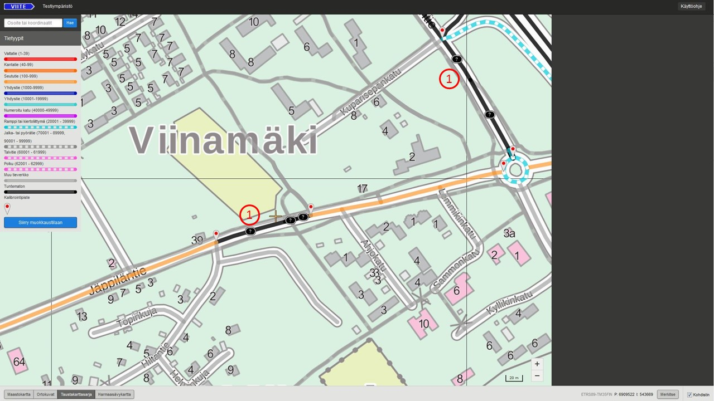

_Tuntemattomia tieosotiesegmenttej&auml;._

Tuntemattomia tieosoitesegmenttej&auml; voi valita ja tarkastella klikkailemalla samalla tavalla, kuin muitakin tieosoitesegmenttej&auml;. Tuntemattoman tieosoitesegmentin tiedot ominaisuustietotaulussa (2) ovat puutteelliset, koska ko. kohdasta puuttuu tiedot tieosoitteesta.

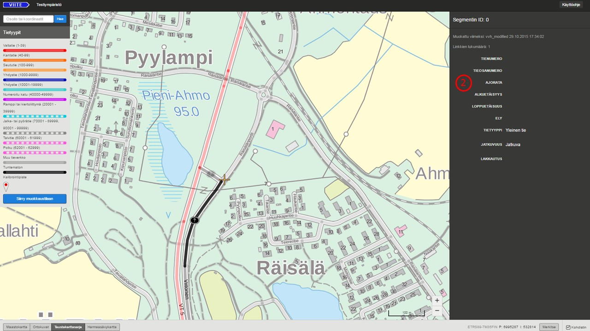

_Tuntematon tieosoitesegmentti valittuna. Ominaisuustietotaulun tiedot ovat puuttelliset._

6. Rakenteilla olevat tielinkit ja niiden tieosoitteet
--------------------------

Rakenteilla olevilla kohteilla tarkoitetaan sellaisia tielinkkej&auml;, joiden valmiusaste/status on Maanmittauslaitoksella "Rakenteilla". 

Rakenteilla olevat, tieosoitteistettavat kohteet n&auml;kyv&auml;t k&auml;ytt&ouml;liittym&auml;ss&auml; oranssi-mustalla raidoituksella (1). N&auml;ill&auml; kohteilla on hallinnollisen luokan arvo 1=Valtion omistama, mutta niilt&auml; puuttuu tieosoite eli kohteet ovat tuntemattomia. Tuntemattomilla, rakenteilla olevilla kohteilla on my&ouml;s musta kysymysmerkki-label kohteen p&auml;&auml;ll&auml;.

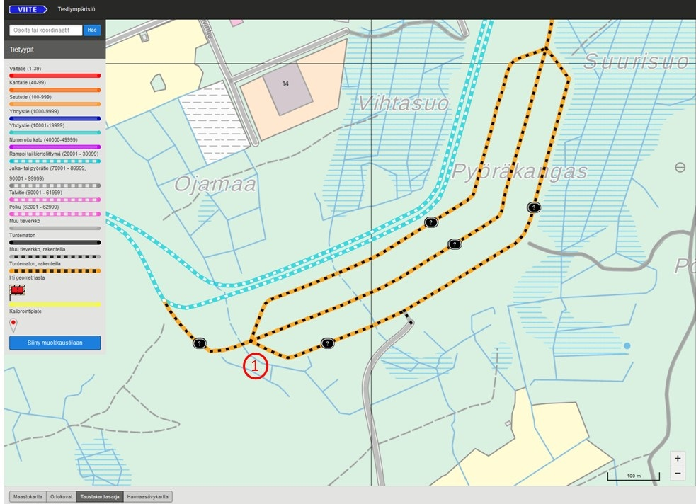

_Tuntematon rakenteilla oleva kohde._

Jos rakenteilla olevalle kohteelle on jo annettu tieosoite, se n&auml;kyy k&auml;ytt&ouml;liittym&auml;ss&auml; kuten muutkin tieosoitteistetut tielinkit (3) ja tieosoitetiedot n&auml;kyv&auml;t my&ouml;s ominaisuustietotaulussa (4).

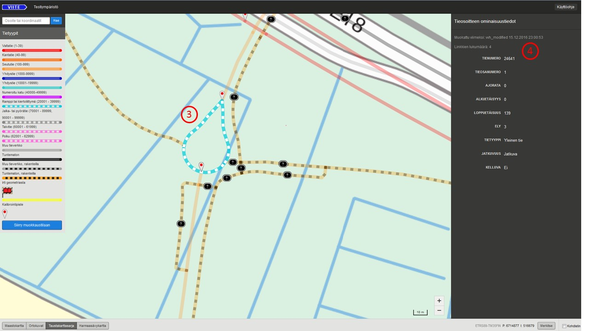

_Pisaraliittym&auml; on rakenteilla, mutta koska se on jo saanut tieosoiteen, se n&auml;kyy k&auml;ytt&ouml;liittym&auml;ss&auml; kuten muutkin tieosoitteistetut tielinkit._

Muut rakenteilla olevat kohteet n&auml;kyv&auml;t k&auml;ytt&ouml;liittym&auml;ss&auml; harmaa-mustalla raidoituksella (2). N&auml;iden hallinnollisen luokan arvo on jotain muuta, kuin 1=Valtion omistama.

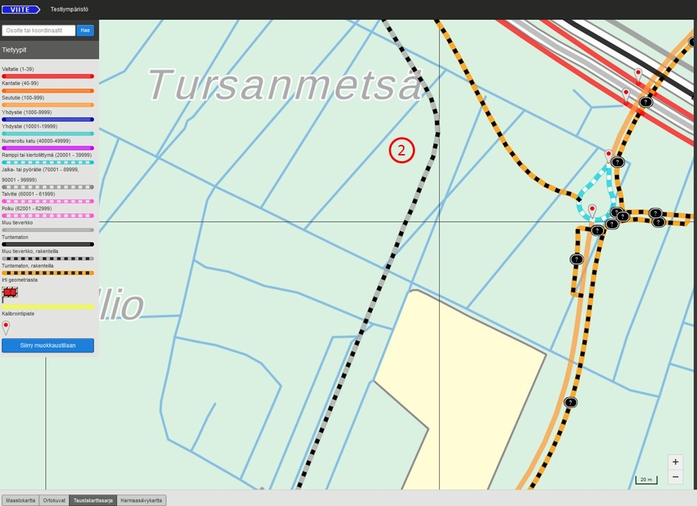

_Rakenteilla oleva kohde, jonka hallinnollisen luokan arvo on jokin muu kuin 1=Valtion omistama._

7. Automatiikka Viite-sovelluksessa
--------------------------
Viite-sovelluksessa on muutamia automatiikan tekemi&auml; yleistyksi&auml; tai korjauksia. Automatiikka ei muuta mit&auml;&auml;n sellaisia tietoja, jotka muuttaisivat varsinaisesti tieosoitteita. Automatiikan tekem&auml;t muutokset liittyv&auml;t siihen, ett&auml; tieosoiteverkkoa yll&auml;pidet&auml;&auml;n keskilinjageometrian p&auml;&auml;ll&auml;, ja tuon keskilinjageometrian yll&auml;pidosta vastaa Maanmittauslaitos. Tietyt automaattiset toimenpiteet helpottavat tieosoiteverkon yll&auml;pit&auml;j&auml;&auml; varsinaisessa tieosoiteverkon hallinnassa.

__Huom! Automatiikka ei koskaan muuta tieosan mitattua pituutta. Arvot tieosien ja ajoratojen vaihtumiskohdissa pysyv&auml;t aina ennallaan automatiikan tekemien korjausten yhteydess&auml;.__

##7.1 Tieosoitesegmenttien yhdistely tielinkin mittaisiksi osuuksiksi##

Kun k&auml;ytt&auml;j&auml; valitsee kartalla kohteita tuplaklikkaamalla (luku 4.1), on pienin valittava yksikk&ouml; tielinkin mittainen osuus tieosoiteverkosta, koska tielinkki on pienin mahdollinen yksikk&ouml; Maanmittauslaitoksen yll&auml;pit&auml;m&auml;ll&auml; linkkiverkolla.

T&auml;t&auml; varten j&auml;rjestelm&auml; tekee automaattista yhdistely&auml;:

- Ne kohteet, joiden tielinkin ID, tie, tieosa, ajorata ja alkup&auml;iv&auml;m&auml;&auml;r&auml; ovat samoja (=tieosoitehistoria yhtenev&auml;), on yhdistetty tietokannassa yhdeksi tielinkin mittaiseksi tieosoitesegmentiksi
- Ne kohteet, joiden tielinkin ID, tie, tieosa, ajorata ovat samoja, mutta alkup&auml;iv&auml;m&auml;&auml;r&auml; ei ole sama (=tieosoitehistoria erilainen) ovat tietokannassa edelleen erillisi&auml; kohteita, mutta k&auml;ytt&ouml;liittym&auml;ss&auml; ne ovat valittavissa vain tielinkin mittaisena osuutena. T&auml;ll&auml; varmistetaan, ett&auml; k&auml;ytt&ouml;liittym&auml; toimii k&auml;ytt&auml;j&auml;n kannalta loogisesti, eli aina on valittavissa tielinkin mittainen osuus, mutta tieosoitehistoria s&auml;ilytet&auml;&auml;n tietokantatasolla.

##7.2 Tieosoitesegmenttien automaattinen korjaus jatkuvasti p&auml;ivittyv&auml;ll&auml; linkkigeometrialla##

Viite-sovellus p&auml;ivitt&auml;&auml; automaattisesti tieosoitesegmentit takaisin ajantasaiselle keskilinjalle, kun MML on tehnyt pieni&auml; tarkennuksia keskilinjageometriaan. T&auml;ss&auml; luvussa on kuvattu tapaukset, joissa Viite-sovellus osaa tehd&auml; korjaukset automaattisesti. Ne tapaukset, joissa korjaus ei tapahdu automaattisesti, segmentit irtoavat geometriasta ja ne on korjattava manuaalisesti (luvut 8 ja 9).

Automatiikka tekee korjaukset, kun...

1. __Tielinkki pitenee tai lyhenee alle metrin:__ Viite-sovellus lyhent&auml;&auml;/pident&auml;&auml; tieosoitesegmentti&auml; automaattisesti muutoksen verran.
1. __Maanmittauslaitos yhdistelee tielinkkej&auml;, esimerkiksi poistamalla tonttiliittymi&auml; maanteiden varsilta:__ Tieosoitesegmentit siirret&auml;&auml;n uudelle geometrialle automaattisesti V&auml;yl&auml;verkon hallinnan (VVH) tarjoaman tielinkkien muutosrajapinnan avulla.

8. Geometriasta irti olevat tieosoitesegmentit
--------------------------
Geometriasta irti olevilla tieosoitesegmenteilla tarkoitetaan sellaisia segmenttej&auml;, joiden alla oleva tielinkkien geometria on muuttunut niin paljon, ett&auml; ne eiv&auml;t en&auml;&auml; sovi geometrialle. Vaikka maastossa ei tapahtuisi muutoksia, Maanmittauslaitos tekee tarkennuksia geometriaan, jolloin keskilinjan sijainti vastaa paremmin todellista maastoa.

Geometriasta irti olevien tieosoitesegmenttien m&auml;&auml;r&auml;&auml;n vaikuttaa se, kuinka suuri osa niist&auml; on voitu korjata automatiikan avulla. Automatiikasta voi lukea k&auml;ytt&ouml;ohjeen luvusta 7.

Geometriasta irti olevan segmentin tunnistaa keltaisesta korostuksesta. Lis&auml;ksi jokaisella tieosoitesegmentilla on punainen huomiolippu. Segmentin voi valita huomiolippua tai keltaista korostusta klikkaamalla (1).  Valitun kohteen tiedot tulevat n&auml;kyviin ominaisuustieton&auml;kym&auml;&auml;n. Geometriasta irti olevalla kohteella on ominaisuustieton&auml;kym&auml;ss&auml; huomiolaatikko joka varoittaa tien geometrian muuttuneen (2).

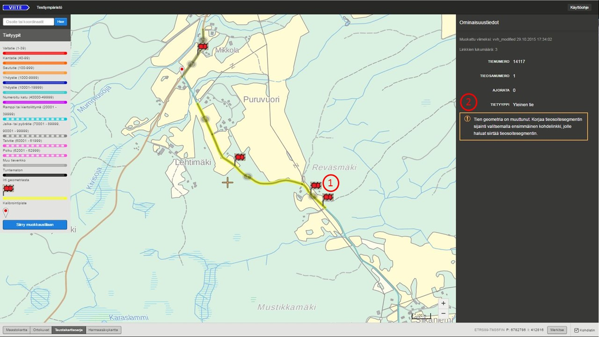

_Geometriasta irti olevia tieosoitesegmenttej&auml;. Segmentin tiedot saa n&auml;kyviin klikkaamalla segmentin keltaista korostetta tai punaista huomiolippua._

Jos keltaisen v&auml;rin alla ei n&auml;y mustaa tieosoitesegmentti&auml;, tarkoittaa t&auml;m&auml; sit&auml;, ett&auml; alla muuttuneen tielinkin ID on edelleen sama, kuin keltaisen tieosoitesegmentin tielinkin ID (muutos yli 1 metrin, mutta linkki ID s&auml;ilynyt). Musta, tuntematon segmentti tulee kuitenkin n&auml;kyviin, kun k&auml;ytt&auml;j&auml; aloittaa geometriasta irti olevan tieosoitesegmentin korjaamisen (luku 9).

Keltaisten kohteiden valinta toimii yksinkertaisemmin, kuin muiden tieosoitesegmenttien. Sek&auml; klikkaamalla kerran ett&auml; tuplaklikkaus valitsevat molemmat ruudulta n&auml;kyv&auml;n osuuden kyseisest&auml; tieosasta, eli osuuden jolla on sama tienumero, tieosanumero ja ajoratakoodi. T&auml;m&auml; sen vuoksi, ett&auml; kohteiden korjaaminen sujuu tehokkaammin, kun valinta tapahtuu aina koko keltaiselle osuudelle tieosasta. Kohdetta valitessa kannattaa olla huolellinen, ett&auml; klikatessa osuu keltaiseen korostukseen eik&auml; tuntemattomaan tielinkkiin (musta kohde). 

9. Geometriasta irti olevien tieosoitesegmenttien korjaaminen takaisin geometrialle
--------------------------

Geometriasta irti olevien tieosoitesegmenttien korjausta varten k&auml;ytt&auml;j&auml;n tulee siirty&auml; muokkaustilaan. Korjausprosessissa geometriasta irti olevat tieosoitesegmentit kiinnitet&auml;&auml;n takaisin geometriaan kertomalla niille uudet tielinkit, joihin ne kiinnittyv&auml;t.

Yleispiirteinen korjausprosessi: ensin valitaan kartalta keltainen, geometriasta irti oleva tieosoitesegmentti. T&auml;m&auml;n j&auml;lkeen sovellus ohjeistaa k&auml;ytt&auml;j&auml;&auml; n&auml;yt&ouml;n oikean laidan ominaisuustietotaulussa jatkamaan valintoja tai painamaan Valinta valmis -painiketta. Muutokset voi tarkistaa Siirr&auml;-painikkeen painamisen j&auml;lkeen ennen Tallennusta.

__Korjausprosessi tarkemmin:__

__Vaihe 1__

Valitaan keltainen tieosoitesegmentti klikkaamalla keltaisesta osuudesta tai klikkaamalla punaisesta huomiolipusta. Valitun kohteen tiedot tulevat n&auml;kyviin ominaisuustietotauluun ja valittu kohde korostuu kartalla (1). 

Muokkaustilassa keltaisten, geometriasta irti olevien tieosoitesegmenttien valinnan poistaminen tehd&auml;&auml;n aina ominaisuustietotaulun oikean alalaidan Peruuta-painikkeen (2) kautta.

__Vaihe 2__

Tarkistetaan ominaisuustietotaulusta, onko kohteen vieress&auml; lis&auml;&auml; valittavia korjattavia tieosoitesegmenttej&auml; (3) (t&auml;ss&auml; tapauksessa ei ole). Jos on tarpeen valita lis&auml;&auml; kohteita, klikataan niit&auml; ominaisuustietotaulun Valitse-painikkeista. Kun kaikki tarpeelliset valinnat on tehty, klikataan Valinta valmis -painiketta (4).

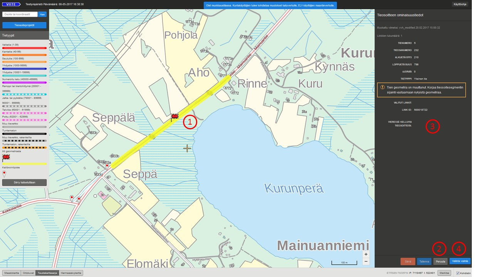

__Vaihe 3__

Kun Valinta valmis -painiketta on painettu, sovellus muuttaa piirtoj&auml;rjestyksen sitten, ett&auml; mustat tuntemattomat kohteet piirtyv&auml;t p&auml;&auml;limm&auml;iseksi. 

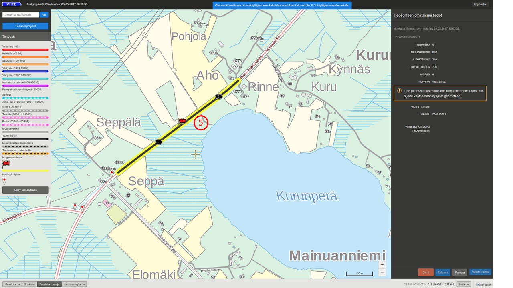

Seuraavaksi valitaan klikkaamalla tuntematon musta tielinkki, jolle kohde halutaan siirt&auml;&auml;. Valinnan j&auml;lkeen sovellus muuttaa valitun tuntemattoman mustan kohteen vihre&auml;ksi, eli valituksi.

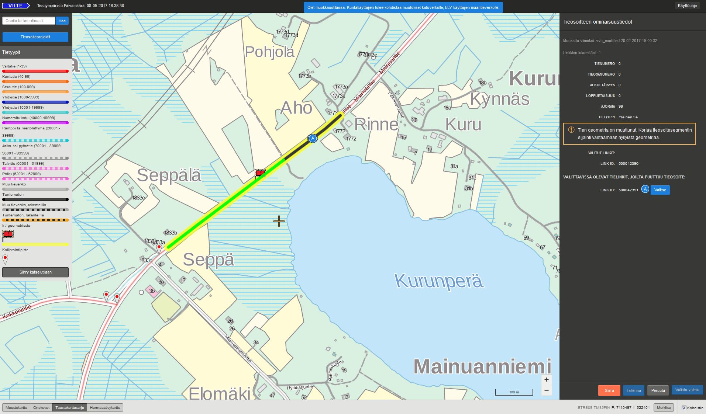

__Vaihe 4__

Tarkistetaan ominaisuustietotaulusta (6), onko kohteen vieress&auml; lis&auml;&auml; valittavia mustia tuntemattomia tieosoitesegmenttej&auml;, joille valitut keltaiset tieosoitesegmentit pit&auml;isi siirt&auml;&auml;. Jos on tarpeen valita lis&auml;&auml; kohteita, klikataan niit&auml; ominaisuustietotaulun Valitse-painikkeesta.

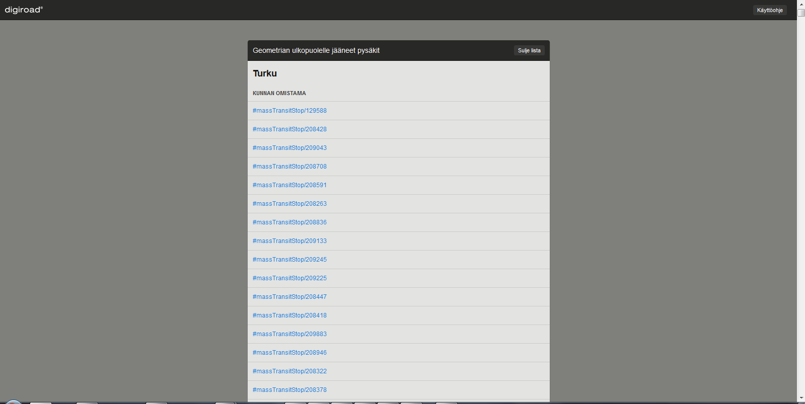

Kaikki valitut linkit listataan ominaisuustietotaulussa (7) ja ne n&auml;kyv&auml;t kartalla vihre&auml;n&auml; (8). Kun kaikki tarpeelliset valinnat on tehty, klikataan oranssia Siirr&auml;-painiketta (9).

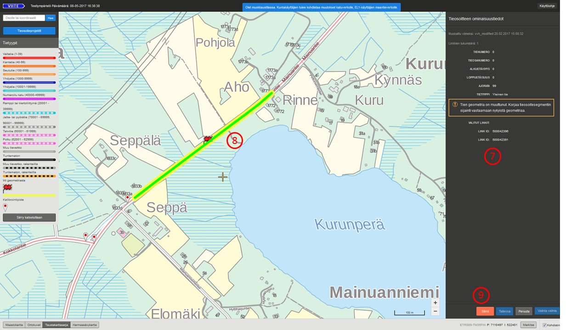

__Vaihe 5__

Siirron j&auml;lkeen sovellus pyyt&auml;&auml; (1) k&auml;ytt&auml;j&auml;&auml; tarkastamaan tuloksen kartalta. Jos tulos on ok, painetaan Tallenna (2). Jos k&auml;ytt&auml;j&auml; haluaa tehd&auml; muutoksia valintoihin, painetaan Peruuta (3).

__Vaihe 6__

Korjauksen j&auml;lkeen tieosoiteverkko on ehe&auml;. Tallentamisen j&auml;lkeen tieosoitesegmenttien et&auml;isyyslukemat ja niiden kohdalla olevat alku- ja loppuet&auml;isyysarvot ovat s&auml;ilyneet ennallaan. Kohteet ovat vain saaneet uudet tielinkit, joihin niiden lineaarilokaatio on kiinnitetty.

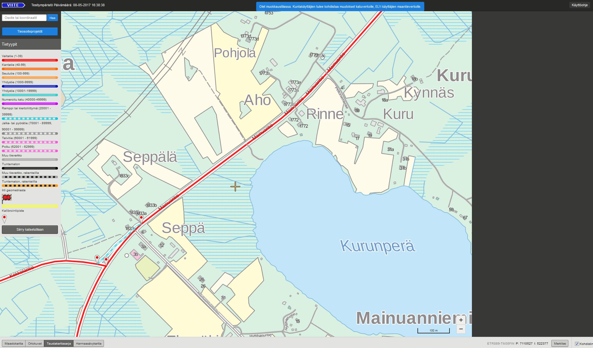

9.1 Siirron ep&auml;onnistuminen
--------------------------

Jos vaiheen 4 siirto ei onnistu, sovellus ilmoittaa t&auml;st&auml; k&auml;ytt&auml;j&auml;lle. T&auml;ll&ouml;in taustaj&auml;rjestelm&auml; ei osaa siirt&auml;&auml; tieosoitesegmenttej&auml; uudelle geometrialle, eik&auml; siirron tietoja tallenneta tietokantaan. N&auml;m&auml; kohteet voi j&auml;tt&auml;&auml; toistaiseksi korjaamatta, ja k&auml;ytt&auml;j&auml;n tulisi ilmoittaa niist&auml; j&auml;rjestelm&auml;tukeen, jotta sovelluksen toimintaa voidaan kehitt&auml;&auml;.

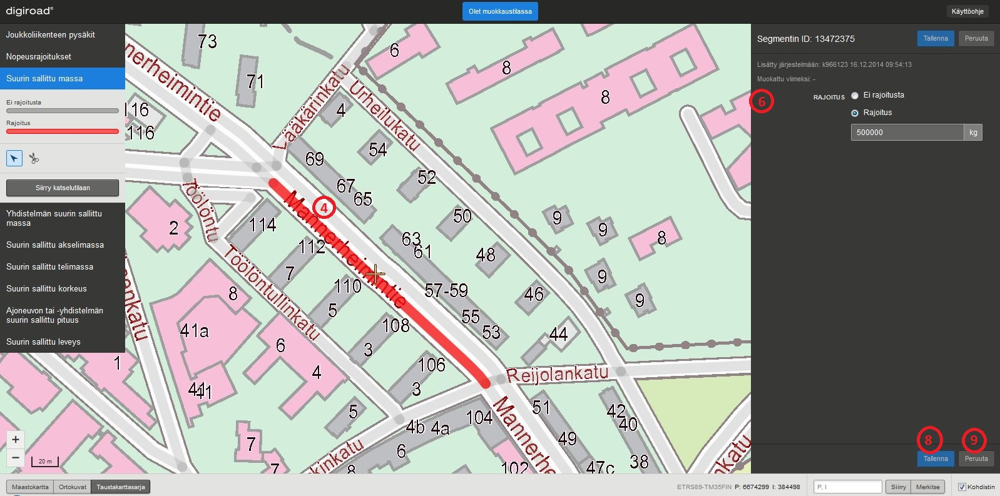

_Ilmoitus siirron ep&auml;onnistumisesta._

Ep&auml;onnistuneen siirron j&auml;lkeen ty&ouml;skentely&auml; voi jatkaa toisella kohteella klikkaamalla Peruuta-painiketta kaksi kertaa.

10. Tieosoiteprojektin tekeminen
--------------------------

Uuden tieosoiteprojektin tekeminen aloitetaan klikkaamalla painiketta Tieosoiteprojektit (1) ja avautuvasta ikkunasta painiketta Uusi tieosoiteprojekti (2).

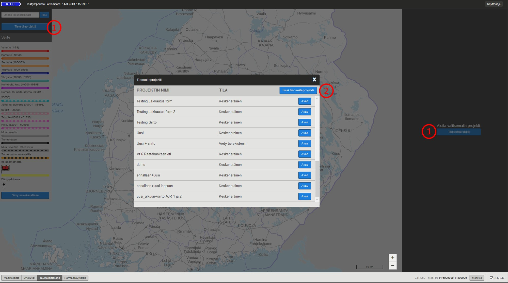

_Tieosoiteprojektit -painike ja Uusi tieosoiteprojekti -painike._

N&auml;yt&ouml;n oikeaan laitaan avautuu lomake tieosoiteprojektin perustietojen t&auml;ydent&auml;miseen. Jos k&auml;ytt&auml;j&auml; ei ole muokkaustilassa, sovellus siirtyy t&auml;ss&auml; vaiheessa automaattisesti muokkaustilaan.

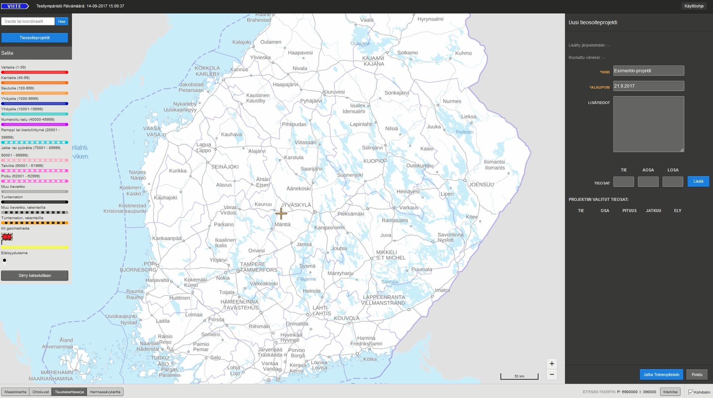

_Tieosoiteprojektin perustietojen lomake._

Pakollisia tietoja ovat nimi ja projektin muutosten voimaantulop&auml;iv&auml;m&auml;&auml;r&auml;, jotka on merkattu lomakkeelle oranssilla (3). Projektiin ei ole pakko t&auml;ydent&auml;&auml; yht&auml;&auml;n tieosaa. Lis&auml;tiedot -kentt&auml;&auml;n k&auml;ytt&auml;j&auml; voi halutessaan tehd&auml; muistiinpanoja tieosoiteprojektista. Tiedot tallentuvat painamalla Jatka toimenpiteisiin -painiketta (4). My&ouml;s Poistu-painikkeesta Viite varmistaa haluaako k&auml;ytt&auml;j&auml; tallentaa projektiin tehdyt muutokset.

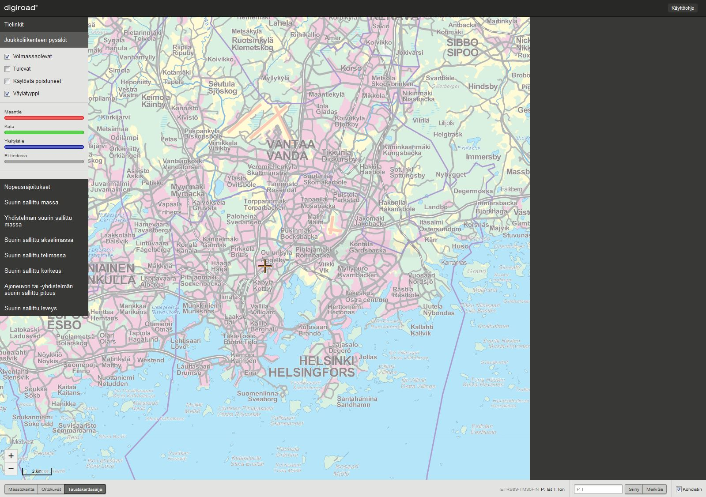

_Tieosoiteprojektin perustietojen t&auml;ytt&auml;minen._

Projektin tieosat lis&auml;t&auml;&auml;n t&auml;ydent&auml;m&auml;ll&auml; niiden tiedot kenttiin tie, aosa, losa ja painamalla painiketta Varaa (5). __Kaikki kent&auml;t tulee t&auml;yt&auml;&auml; aina, kun haluaa varata tieosan!__ 

Varaa -painikkeen painamisen j&auml;lkeen tieosan tiedot tulevat n&auml;kyviin lomakkeelle.

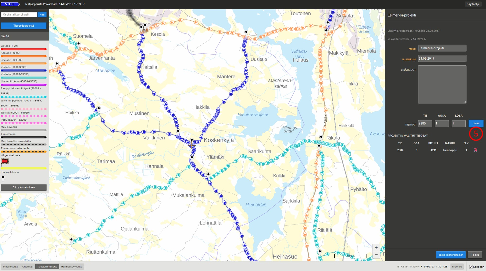

_Tieosan tiedot lomakkeella Lis&auml;&auml; -painikkeen painamisen j&auml;lkeen._

Tieosoiteprojekti tallentuu automaattisesti painikkeesta Jatka toimenpiteisiin, jolloin tiedot tallentuvat tietokantaan ja sovellus siirtyy toimenpiden&auml;yt&ouml;lle. Varaamisen yhteydess&auml; Viite zoomaa kartan varatun tieosan alkuun. Poistu-painikkeesta projekti suljetaan ja k&auml;ytt&auml;j&auml;lt&auml; varmistetaan, halutaanko tallentamattomat muutokset tallentaa. Projektiin p&auml;&auml;see palaamaan Tieosoiteprojektit -listan kautta. 

K&auml;ytt&auml;j&auml; voi poistaa varattuja tieosia klikkaamalla ruksia tieosan oikealla puolella, Projektiin valitut tieosat-listalta. Mik&auml;li tieosille ei ole tehty muutoksia eli ne on pelkast&auml;&auml;n varattu projektiin, varaus poistetaan projektista. Jos tieosille on tehty muutoksia, Viite kysyy k&auml;ytt&auml;j&auml;lt&auml; varmistuksen poistosta. T&auml;ll&ouml;in kaikki muutokset menetet&auml;&auml;n.

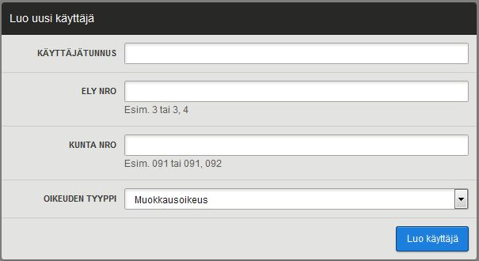

_Kun tieosa on varattu projektiin Viite zoomaa varatun tieosan alkuun mittakaavalle 1000m. Varattu tieosa alkaa kohdistimen n&auml;ytt&auml;m&auml;st&auml; kohdasta, ja jatkuu tieosan p&auml;&auml;h&auml;n et&auml;isyyslukema-symboliin asti._ 

Varauksen yhteydess&auml; j&auml;rjestelm&auml; tekee varattaville tieosille tarkistukset:

- Onko varattava tieosa olemassa projektin voimaantulop&auml;iv&auml;n&auml;
- Onko varattava tieosa vapaana, eik&auml; varattuna mihink&auml;&auml;n toiseen projektiin

Virheellisist&auml; varausyrityksist&auml; j&auml;rjestelm&auml; antaa asianmukaisen virheilmoituksen. Alla olevassa kuvissa on erilaisista virheilmoituksista, joiden mukaan k&auml;ytt&auml;j&auml;n tulee korjata varausta. __K&auml;ytt&auml;j&auml;n tulee huomioida, ett&auml; varauksen yhteydess&auml; kaikki kent&auml;t (TIE, AOSA, LOSA) tulee t&auml;ytt&auml;&auml;, tai k&auml;ytt&auml;j&auml; saa virheilmoituksen!__

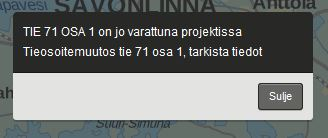

_Yritetty luoda samalla tieosavarauksella tie 71, osa 1 projekti uudelleen. 
Tieosa on kuitenkin jo varattuna aiemmin luotuun projektiin nimelt&auml; "Tieosoitemuutos tie 71 osa 1"._

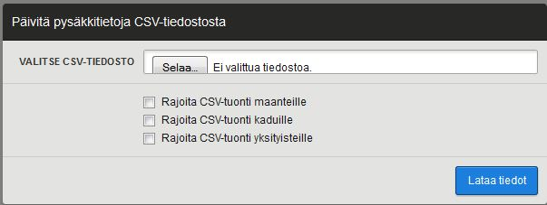

_Tiet&auml; ei ole olemassa._

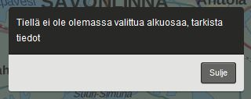

_Tieosaa ei ole olemassa._

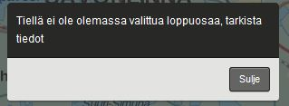

_Tieosaa ei ole olemassa._

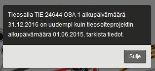

_Ilmoitus, jos varattava tieosa ei ole voimassa p&auml;iv&auml;n&auml;, jolloin projekti tulee voimaan._

10.1 Olemassa olevan tieosoiteprojektin avaaminen Tieosoiteprojektit -listalta
--------------------------

Tallennetun tieosoiteprojektin saa auki Tieosoiteprojektit -listalta painamalla Avaa -painiketta. Avaamisen yhteydess&auml; sovellus zoomaa varatun tieosan alkuun, jotta k&auml;ytt&auml;j&auml; p&auml;&auml;see projektin alueelle.

Tieosoiteprojektit -listalla n&auml;kyv&auml;t kaikkien k&auml;ytt&auml;jien projektit. Projektit ovat projektin nimen mukaisessa aakkosj&auml;rjestyksess&auml;.

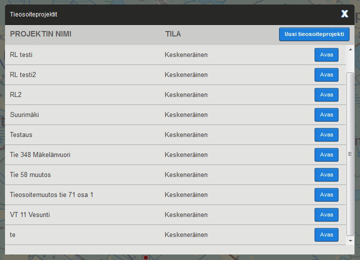

_Tieosoiteprojektit -listaus._

11. Muutosten tekeminen tieosoiteprojektissa
--------------------------

Tieosoiteprojektissa on mahdollista tehd&auml; seuraavia toimenpiteit&auml;:
(T&auml;h&auml;n tehd&auml;&auml;n jatkossa taulukko, jossa toimenpiteet on sanallisesti kuvattu tarkemmin.) 

- lakkautus (tieosoitteen lakkautus) 
- uusi (lis&auml;t&auml;&auml;n uusi tieosoite osoitteettomalle linkille) 
- ennallaan (osa tieosoitteesta s&auml;ilyy ennallaan, kun osaa siit&auml; muutetaan)
- siirto (tieosan alkuet&auml;isyys- ja loppuet&auml;isyysarvot p&auml;ivitet&auml;&auml;n, kun muulle osalle tieosaa tehd&auml;&auml;n muutos)
- numeroinnin muutos (kokonaisen tieosan tienumeron ja/tai tieosanumeron voi muuttaa manuaalisesti) 
- k&auml;&auml;nt&ouml; (tieosoitteen kasvusuunnan k&auml;&auml;nt&ouml;)
- et&auml;isyyslukeman muutos (et&auml;isyyslukeman loppuarvon voi sy&ouml;tt&auml;&auml; tieosalle manuaalisesti)
- et&auml;isyyslukemapisteen siirto [ei viel&auml; toteutettu]

Seuraavissa kappaleissa kuvataan jokaisen toimenpiteen teko Viitteess&auml;.

Tieosoiteprojektissa muutostoimenpiteit&auml; p&auml;&auml;see tekem&auml;&auml;n klikkaamalla Jatka toimenpiteisiin-painiketta tieosoitemuutosprojektin perustietojen lomakkeella. T&auml;m&auml;n j&auml;lkeen sovellus muuttaa varatut tieosat muokattaviksi kohteiksi ja ne n&auml;kyv&auml;t avautuvassa karttan&auml;kym&auml;ss&auml; keltaisella korostettuna (1). Mik&auml;li toimenpiteen&auml; lis&auml;t&auml;&auml;n uusi tieosoite, eli tieosia ei ole varattu projektiin, kartalta ei valikoidu mit&auml;&auml;n ennen k&auml;ytt&auml;j&auml;n tekem&auml;&auml; valintaa. T&auml;m&auml; tarkennetaan tulevissa toimenpiteit&auml; kuvaavissa kappaleissa.

Projektitilassa, vain projektiin varattuja tieosia, tuntemattomia tielinkkej&auml;, muun tieverkon linkkej&auml; tai suunnitelmalinkkej&auml; (suravage-linkkej&auml;), voi valita projektissa klikkaamalla kartalta. Suunnitelmalinkit saa pois piirrosta ja piirtoon sivun alapalkissa olevasta valinnasta. Ne ovat oletuksena piirrossa. Tieverkon tieosoitetietoja voi katsella kartalla viem&auml;ll&auml; hiiren tieosoitelinkin p&auml;&auml;lle. T&auml;ll&ouml;in tielinkin infolaatikko tulee n&auml;kyviin. 
Projektin nimen vieress&auml; on sininen kyn&auml;ikoni (2), josta p&auml;&auml;see projektin perustietojen lomakkeelle muokkaamaan projektin tietoja. Lis&auml;ksi oikeassa yl&auml;kulamssa on Poistu projektista -linkki (3), josta p&auml;&auml;see Viitteen alkutilaan. Viite tarkistaa haluaako k&auml;ytt&auml;j&auml; tallentaa muutokset.

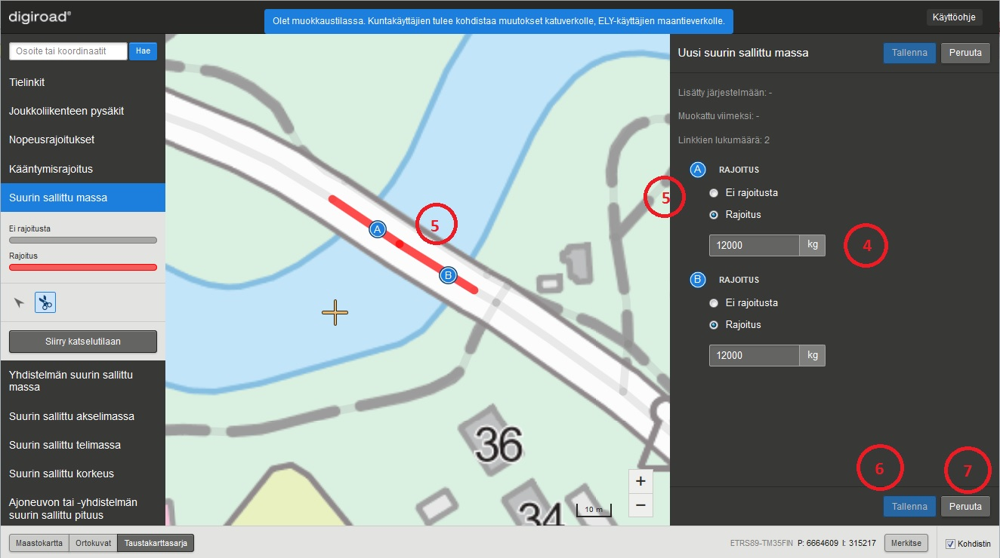

_Projektissa muokattavissa olevat varatut tieosat n&auml;kyv&auml;t kartalla keltaisella v&auml;rill&auml; ja suuntanuolet ovat tien alkuper&auml;isen v&auml;rin mukaiset (siniset). Projektin nimi on "Esimerkki-projekti", joka n&auml;kyy oikeassa yl&auml;kulmassa._

Jokaisessa projektissa muutokset tallentuvat taulukkomuotoon toimenpiteiden/ilmoitusten yhteenvetotauluun, jonka voi avata n&auml;kyviin toimenpiden&auml;kym&auml;n alaoikeasta laidasta sinisest&auml; painikkeesta (4). Yhteenvetotaulun toiminta on kuvattu tarkemmin kappaleessa 11.2. Lis&auml;ksi kaikkien projektien muutostiedot voidaan l&auml;hett&auml;&auml; Tierekisteriin klikkaamalla vihre&auml;&auml; Tee tieosoitemuutosilmoitus -painiketta (5) sivun alaoikealla. Muutosilmoituksen l&auml;hett&auml;minen on kuvattu kappaleessa 11.3. 

Kun keltaista, muokattavaa kohdetta kertaklikkaa kartalla, muuttuu valittu osuus vihre&auml;ksi ja oikeaan laitaan tulee alasvetovalikko, josta voi valita kohteelle teht&auml;v&auml;n toimenpiteen (esim. lakkautus). Kerran klikkaamalla valitaan kartalta homogeeninen jakso (= sama tienumero, tieosanumero ja ajoratakoodi) [HUOM: t&auml;h&auml;n on tullut uusia katkaisus&auml;&auml;nt&ouml;j&auml; liittyen jatkuvuuteen, tietyyppiin ja ELYkoodiin,  jotka tulee tarkistaa ja p&auml;ivitt&auml;&auml;], tuplaklikkaus valitsee yhden tieosoitesegmentin verran (tielinkin mittainen osuus). Kun halutaan valita vain osa tieosan linkeist&auml;, tuplaklikataan ensimm&auml;ist&auml; linkki&auml; ja seuraavat linkit lis&auml;t&auml;&auml;n valintaan shift+tuplaklikkauksella samalta tieosalta. Samalla tavalla voi my&ouml;s poistaa yksitt&auml;isi&auml; linkkej&auml; valinnasta. 

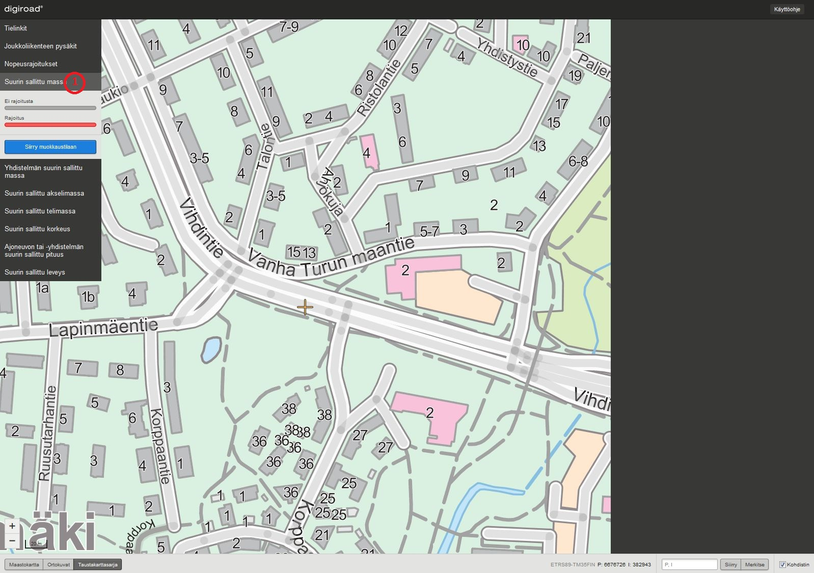

_Kun keltaista, muokattavissa olevaa kohdetta klikataan, muuttuu tieosa vihre&auml;ksi ja oikeaan laitaan tulee n&auml;kyviin valikko, jossa on tieosoitemuutosprojektin mahdolliset toimenpiteet._

Muutokset tallennetaan oikean alakulman Tallenna-painikkeesta. Ennen tallennusta, voi muutokset perua Peruuta-painikkeesta, jolloin Viite palaa edelt&auml;v&auml;&auml;n vaiheeseen.

Jos k&auml;ytt&auml;j&auml; on jo tehnyt projektissa muutoksia tieosoitteille, ne tulevat n&auml;kyviin lomakkeelle klikatessa kyseist&auml; tielinkki&auml;, jolle muutokset on tehty. Esimerkiksi, mik&auml;li tieosalle on toteutettu Lakkautus, tieosa valittaessa sen tiedot lakkautuksesta ilmestyv&auml;t lomakkeelle ja tieosalle on mahdollista tehd&auml; toinen toimenpide. Mahdolliset uudet toimenpidevaihtoehdot kunkin toimenpiteen tallentamisen j&auml;lkeen, on kuvattu seuraavissa kappaleissa, joissa kerrotaan kunkin toimenpiteen tekemisest&auml; tarkemmin. 

Selite projektitilassa on erilainen kuin katselutilassa. Projektitilan selite kuvaa linkkiverkkoon tehdyt toimenpiteet kun taas katselutilan selite kuvaa tieluokitusta.

11.1 Toimenpiteet tieosoiteprojektissa
--------------------------

11.1.1 Lakkautus
--------------------------
Kun halutaan lakkauttaa joko tieosia, tieosa tai osa tieosasta, tulee tarvittavat tieosat varata projektiin. Varaaminen tehd&auml;&auml;n, kuten kpl 10. esitetty, eli sy&ouml;tet&auml;&auml;n projektitietojen lomakkeelle haluttu tienumero ja tieosa sek&auml; painetaan Lis&auml;&auml;-painiketta.
T&auml;m&auml;n j&auml;lkeen Jatka toimenpiteisiin-painiketta, jolla siirryt&auml;&auml;n toimenpidelomakkeelle tekem&auml;&auml;n tieosoitemuutosta. Toimenpidelomakkeella valitaan kartalta projektiin varattu tieosa, -osat tai tarvittavat linkit valitusta tieosasta. Ne muuttuvat valittuna vihre&auml;ksi. (Shif+tuplaklikkaus-painalluksella voi lis&auml;t&auml; yksitt&auml;isi&auml; linkkej&auml; valintaan tai poistaa yksitt&auml;isi&auml; linkkej&auml; valinasta.) Toimenpide-lomakkeelle tulee tiedot valituista linkeist&auml; sek&auml; pudotusvalikko, josta valitaan Lakkautus. T&auml;m&auml;n j&auml;lkeen tallennetaan muutos projektiin. Lakkautettu linkki tulee n&auml;kyviin mustalla ja sen tiedot p&auml;ivittyv&auml;t yhteenvetotaulukkoon, jonka voi avata sinisest&auml; Avaa projektin yhteenvetotaulukko-painikkeesta. Yhteenvetotaulukon toiminta on kuvattu kappaleessa 11.2. Mik&auml;li on lakkautettu vain osa tieosan linkeist&auml;, tulee tieosan muut kuin lakkautetut linkit my&ouml;s k&auml;sitell&auml; joko ennallaan- tai siirto-toimenpiteill&auml;, riippuen tilanteesta. Kun tarvittavat muutoset projektissa on tehty, muutostiedot voi l&auml;hett&auml;&auml; Tierekisteriin painamalla Tee tieosoitemuutosilmoitus-painiketta. 

11.1.2 Uusi
--------------------------

Toimenpiteell&auml; m&auml;&auml;ritet&auml;&auml;n uusi tieosoite tieosoitteettomille linkeille. Tieosoitteettomia muun tieverkon linkkej&auml;, jotka piirtyv&auml;t kartalle harmaina tai tuntemattomia mustia linkkej&auml;, joissa on kysymysmerkkisymboli tai suravage-linkkej&auml;, voi valita kerta- tai tuplaklikkauksella, kuten muitakin tielinkkej&auml;. Tuplaklikkaus valitsee yhden tielinkin ja shit+tuplaklikkauksella voi lis&auml;t&auml; tai poistaa valintaan linkkej&auml; yksi kerrallaan. Kertaklikkaus valitsee homogeenisen jakson, jossa k&auml;ytet&auml;&auml;n VVH:n tienumeroa ja tieosanumeroa. Tienumeron tai tieosanumeron puuttuessa valinnassa k&auml;ytet&auml;&auml;n tienime&auml;. Shift+kertaklikkauksella voi lis&auml;t&auml; aiempaan valintaan koko homogeenisen jakson.

Valitut tielinkit n&auml;kyv&auml;t kartalla vihre&auml;ll&auml; korostettuna. Kun valitaan Toimenpiteet-alasvetovalikosta 'Uusi' (1) lomakkeelle avautuvat kent&auml;t uuden tieosoitteen tiedoille (2). Jos valitulla tieosuudella on jo olemassa VVH:ssa tienumero ja tieosanumero, ne esit&auml;yttyv&auml;t kenttiin automattisesti.

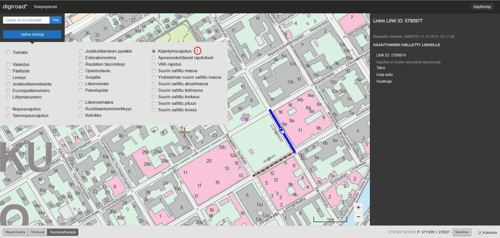

_Kun toimenpidevalikosta valitaan 'Uusi', oikeaan laitaan ilmestyy n&auml;kyviin kent&auml;t uuden tieosoitteen sy&ouml;tt&auml;mist&auml; varten._ 

Tietyyppi&auml; voi muokata pudotusvalikosta (3). Jatkuu-arvo m&auml;&auml;r&auml;ytyy ensimm&auml;isell&auml; tallennuskerralla automaattisesti jatkuvaksi (5 Jatkuva). Muutokset tallennetaan Tallenna-painikkeella (4). Ennen tallennusta, muutokset voi perua Peruuta-painikkeesta. 

Huom: Mik&auml;li jatkuvuutta t&auml;ytyy muokata, esimerkiksi jos kyseess&auml; on tien loppu, se tulee tehd&auml; seuraavasti. K&auml;ytt&auml;j&auml;n tulee klikata viimeinen "Uusi" toimenpiteell&auml; k&auml;sitelty linkki tieosan lopusta aktiiviseksi, jossa tien loppu sijaitsee. Lomakkeelle tulee tiedot linkin osoitteesta ja sille tehdyst&auml; toimenpiteest&auml;. Nyt linkin jatkuvuuskoodin muokkaaminen on mahdollista ja oikea koodi, esimerkiksi 1 Tien lopppu, valitaan pudotusvalikosta ja tallennetaan. P&auml;ivitetty tieto n&auml;kyy my&ouml;s yhteenvetotaulukossa tallennuksen j&auml;lkeen.   

K&auml;ytt&ouml;liittym&auml; varoittaa virheilmoituksella jos uusi tieosoite on jo olemassa projektin alkup&auml;iv&auml;n&auml; tai se on varattuna toisessa tieosoiteprojektissa.

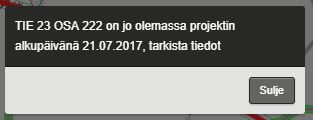

_Tieosoite on jo olemassa projektin alkup&auml;iv&auml;n&auml;._

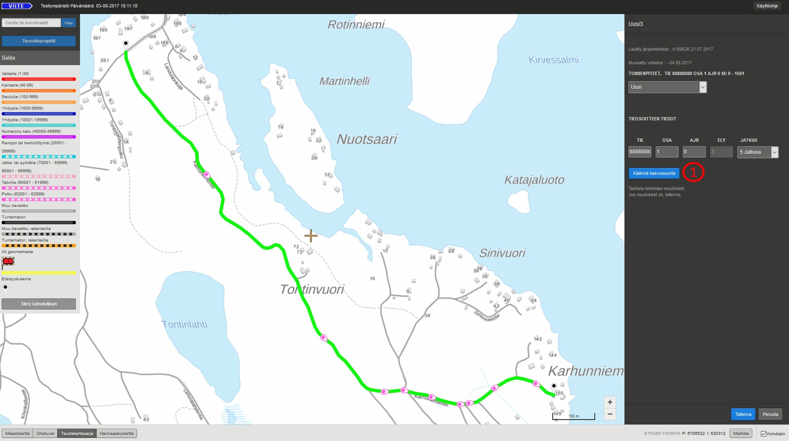

_Valittuna olevan uuden tieosoitteen vaikutussuntaa vaihtuu lomakkeen 'K&auml;&auml;nn&auml; vaikutussuunta'-nappulasta._

Uuden tieosoitteen linkit piirtyv&auml;t kartalle pinkill&auml; (2). Tieosan alku- ja loppupisteisiin sijoitetaan automaattisesti et&auml;isyyslukema-symbolit. Viite laskee uudelle tieosuudelle automaattisesti my&ouml;s linkkien m-arvot k&auml;ytt&auml;en VVH:n tietoja. Uudelle tieosoitteelle m&auml;&auml;rittyy aluksi satunnainen kasvusuunta, joka n&auml;kyy kartalla pinkkien nuolien suunnasta.

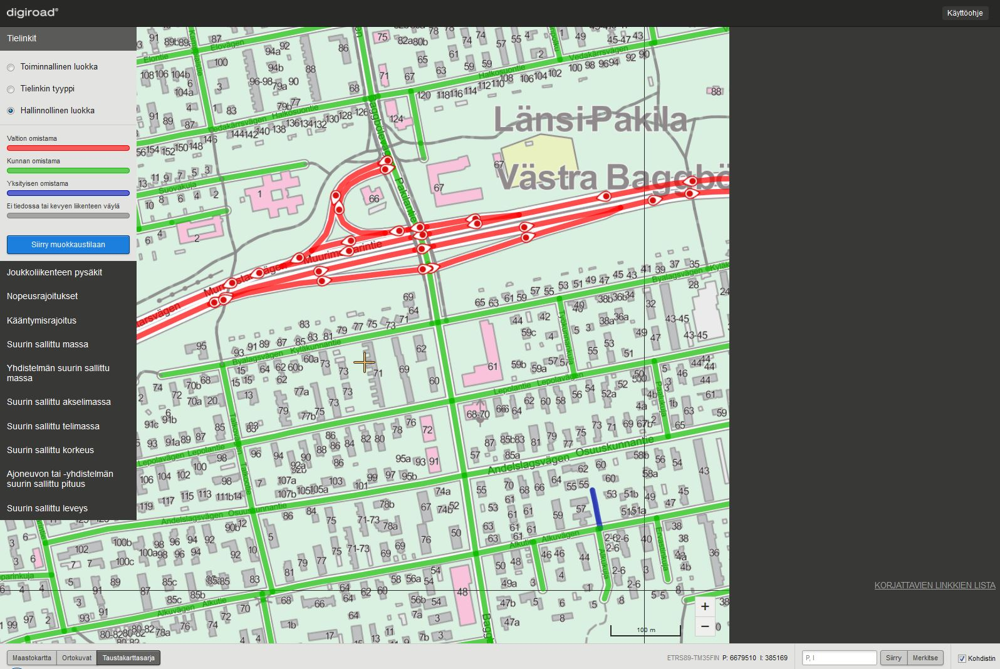

_Uuden tieosoitteen linkit piirtyv&auml;t kartalle pinkill&auml;. Tieosan voi valita klikkaamalla, jolloin se korostuu vihre&auml;ll&auml;._

Tallennettuun tieosoitteeseen voi jatkaa uusien linkkien lis&auml;&auml;mist&auml; vaiheittain. Ensin valitaan tallennetun tieosan jatkeeksi seuraava linkki ja sitten valitaan lomakkeelta toimenpide "uusi" ja annetaan linkeille sama tieosoite (TIE= tienumero, OSA=tieosanumero, AJR=ajoratakoodi). ELY ja Jatkuu arvot Viite t&auml;ytt&auml;&auml; automaattisesti. Tallennetaan lis&auml;ykset. Projektin voi my&ouml;s tallentaa, sulkea ja jatkaa lis&auml;yst&auml; samaan tieosoitteeseen my&ouml;hemmin. Kasvusuunta lis&auml;tylle osuudelle m&auml;&auml;r&auml;ytyy aiemmin osoitteistettujen linkkien mukaan ja sit&auml; voi edelleen k&auml;&auml;nt&auml;&auml; K&auml;&auml;nn&auml; kasvusuunta-painikkeella. M-arvot p&auml;ivittyv&auml;t koko tieosalle, jolle on annettu sama tieosoite.

Tieosoitteen voi antaa Viitteess&auml; my&ouml;s ns. Suravage-linkeille (SuRavaGe = Suunniteltu rakentamisvaiheen geometria). Suravage-tiet n&auml;kyv&auml;t Viitteess&auml; vaaleanpunaisella v&auml;rill&auml; ja niiss&auml; n&auml;kyy my&ouml;s tieosoitteen kasvusuuntanuolet. 

11.1.3 Ennallaan
--------------------------
Tieosan linkkien tieosoitteen voi s&auml;ilytt&auml;&auml; ennallaan esimerkiksi silloin, kun osalle tieosaa halutaan tehd&auml; tieosoitemuutoksia ja osan s&auml;ilyv&auml;n ennallaan. T&auml;ll&ouml;in tieosa k&auml;sitell&auml;&auml;n toimenpiteell&auml; Ennallaan. Toimenpide tehd&auml;&auml;n varaamalla ensin projektitietojen formilla projektiin muokattava tieosa tai -osat. Seuraavaksi siirryt&auml;&auml;n toimenpiden&auml;yt&ouml;lle Jatka toimenpiteisiin - painikkeella. Valittu tieosa tai sen tietyt linkit valitaan kartalta, jolloin ne muuttuvat vihreiksi, ja lomakkeelle ilmestyy alasvetovalikko. Valikosta valitaan toimenpide "Ennallaan" ja tallennetaan muutokset.   

11.1.4 Siirto
--------------------------
Siirto-toimenpide tehd&auml;&auml;n tieosalle uusien m-arvojen laskemiseksi. Siirtoa k&auml;ytet&auml;&auml;n, kun osa tieosan linkeist&auml; k&auml;sitell&auml;&auml;n jollain muulla toimenpiteell&auml; ja loppujen linkkien m-arvot t&auml;ytyy laskea uudelleen. Esimerkkin&auml; osalle tieosan linkeist&auml; voidaan tehd&auml; lakkautus, lis&auml;t&auml; uusia linkkej&auml; ja pit&auml;&auml; osa linkeist&auml; ennallaan. Siirto tehd&auml;&auml;n tieosoiteprojektiin varatulle tieosalle (varaaminen kuvattu kpl:ssa 10) siten, ett&auml; tieosalle on ensin tehty muita toimenpiteit&auml;, kuten lakkautus, uusi tai numerointi. Linkit, joille siirto tehd&auml;&auml;n, valitaan tuplaklikkaamalla ensimm&auml;inen haluttu linkki ja lis&auml;&auml;m&auml;ll&auml; valintaan shift+tuplaklikkaamalla linkkej&auml;. Sitten valitaan toimenpidevalikosta siirto ja tallennetaan. Siirretyt linkit muuttuvat toimenpiteen tallennuksen j&auml;lkeen punaiseksi. Muutokset n&auml;kyv&auml;t projektin yhteenvetotaulukossa.   
   

11.1.5 Numeroinnnin muutos
--------------------------
Tieosoitteen numeroinnin muutoksella tarkoitetaan Viitteess&auml; tienumeron ja/tai tieosanumeron muuttamista. 
Projektiin varataan tarvittava(t) tieosa(t), kuten kappaleessa 10 on kuvattu. Varaamisen j&auml;lkeen siirryt&auml;&auml;n toimenpidelomakkeelle Jatka toimenpiteisiin -painikkeella. Valitaan muokattava keltaisella n&auml;kyv&auml; varattu tieosa klikkaamalla kartalta. Tieosa muuttuu vihre&auml;ksi. Viite poimii t&auml;ll&ouml;in koko tieosan mukaan valintaan, vaikkei se n&auml;kyisi kokonaisuuudessaan karttan&auml;kym&auml;ss&auml; ja k&auml;ytt&auml;j&auml;lle tulee t&auml;st&auml; ilmoitus. Mik&auml;li on tarpeen muuttaa vain tietyn linkin numerointia tieosalla, tehd&auml;&auml;n valinta tuplaklikkauksella halutun linkin p&auml;&auml;lt&auml;. Jos valitaan lis&auml;&auml; yksitt&auml;isi&auml; linkkej&auml;, tehd&auml;&auml;n se shift+tuplaklikkaamalla. Toimenpide-lomakkeelle sy&ouml;tet&auml;&auml;n uusi numerointi (tienumero ja/tai tieosanumero) ja tallennetaan muutokset. Numeroitu osuus muuttuu tallennettaessa ruskeaksi. 
Koska numeroinnin muutos kohdistuu koko tieosaan, muita toimenpiteit&auml; ei tallennuksen j&auml;lkeen tarvitse tehd&auml;. 

11.1.6 K&auml;&auml;nt&ouml;
--------------------------
Tieosoitteen kasvusuunnan voi k&auml;&auml;nt&auml;&auml;. T&auml;m&auml;n voi tehd&auml; joko siirto-toimenpiteen yhteydess&auml;, jolloin k&auml;&auml;nt&ouml; tapahtuu tietyiss&auml; tapauksissa automaattisesti. Kun k&auml;&auml;nn&ouml;n tarvitsee tehd&auml; numeroinnin tai muun toimenpiteen yhteydess&auml;, k&auml;ytt&auml;j&auml; voi tehd&auml; sen toimenpiteen tallentamisen j&auml;lkeen k&auml;ytt&auml;m&auml;ll&auml; "K&auml;&auml;nn&auml; kasvusuunta"-painiketta. 

11.1.7 Et&auml;isyyslukeman muutos
--------------------------
Tieosoiteprojektissa uudelle tieosoitteistettavalle tieosalle on mahdollista asettaa k&auml;ytt&auml;j&auml;n antama tieosan loppuet&auml;isyyslukema. Ensin valitaan haluttu tieosa kartalta, jonka j&auml;lkeen lomakkeelle ilmestyy kentt&auml;, johon loppuet&auml;isyyden voi muuttaa. Muutettu arvo huomioidaan lomakkeella punaisella huutomerkill&auml;. 

11.1.8 Et&auml;isyyslukemapisteen siirto
--------------------------
[Ei viel&auml; toteutettu]

11.1.9 Suunnitelmalinkkien tieosoitteistaminen ja sen jakaminen saksi-ty&ouml;kalulla
--------------------------

__Saksi-ty&ouml;kalun k&auml;ytt&ouml; suunnitelmalinkin jakamiseen__

Saksi-ty&ouml;kalulla voi jakaa suunnitelmalinkin kahteen osaan. Ty&ouml;kalua hy&ouml;dynnet&auml;&auml;n, kun linkin osat halutaan k&auml;sitell&auml; eri toimenpiteill&auml;. Ensin valitaan saksi-ty&ouml;kalu selitteen alaosasta. Seitten ristikursorilla klikataan kartalta tielinkin kohdasta, josta tie jaetaan. Suunnitelmalinkki jakaantuu t&auml;ll&ouml;in A ja B osaan. Sivun oikeaan reunaan avautuu A ja B osille lomake, johon eri toimenpiteet m&auml;&auml;ritell&auml;&auml;n ja tehd&auml;&auml;n tallennus.
Kun osioiden toimenpiteet on tallennettu, suunnitelmalinkin alla sijaitseva nykylinkki tarvittavilta osin lakkautuu automaattisesti oikeasta leikkauskohdasta ja se n&auml;kyy jatkossa C osana lomakkeella. 

11.1.10 Useiden muutosten tekeminen samalle tieosalle
--------------------------

11.2 Muutosilmoituksien tarkastelu taulukkon&auml;kym&auml;ss&auml;
--------------------------

Toimenpiden&auml;kym&auml;ss&auml; on mahdollista tarkastella muutosilmoitus taulukkoa (1). "Avaa projektin yhteenvetotaulukko" -painiketta klikkaamalla avautuu taulukkon&auml;kym&auml;, joka kertoo projektissa olevien tieosoitteiden vanhan ja uuden tilanteen sek&auml; tehdyn toimenpiteen. Taulukossa rivit on j&auml;rjestetty suurimasta pienimp&auml;&auml;n tieosoitteen mukaan (tie, tieosa, alkuet&auml;isyys, ajorata), jotta saman tien tieosuudet ovat taulukossa per&auml;kk&auml;in suurimmasta pienimp&auml;&auml;. Yhteenvetotaulukon AET- ja LET-arvot p&auml;ivittyv&auml;t vasta, kun kaikki tieosan aihiot on k&auml;sitelty. Toimenpiteiden tekoj&auml;rjestyksell&auml; ei ole vaikutusta lopulliseen yhteenvetotaulukoon. 

Taulukon saa suurennettua ja pienennetty&auml; sek&auml; suljettua taulukon oikeasta yl&auml;kulmasta (2). Taulukon voi pit&auml;&auml; auki muokatessa ja muutokset p&auml;ivittyv&auml;t taulukkoon tallennettaessa. Viite-sovelluksen voi esimerkisi venytt&auml;&auml; kahdelle n&auml;yt&ouml;lle, joista toisella voi tarkastella muutostaulukkoa ja k&auml;ytt&auml;&auml; karttan&auml;kym&auml;&auml;. 

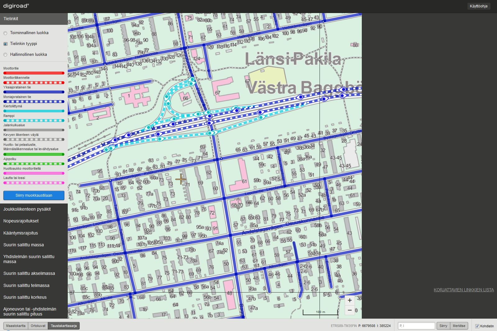

_Taulukon avaus ja muutosilmoitustalukon n&auml;kym&auml;._

11.3 Muutosilmoituksen l&auml;hett&auml;minen Tierekisteriin
--------------------------

Muutosilmoitus vied&auml;&auml;n Tierekisteriin klikkaamalla oikean alakulman vihre&auml;&auml; Tee tieosoitemuutosilmoitus -painiketta. Painikkeen painamisen j&auml;lkeen sovellus ilmoittaa muutosilmoituksen tekemisest&auml; "Muutosilmoitus l&auml;hetetty Tierekisteriin." -viestill&auml;.

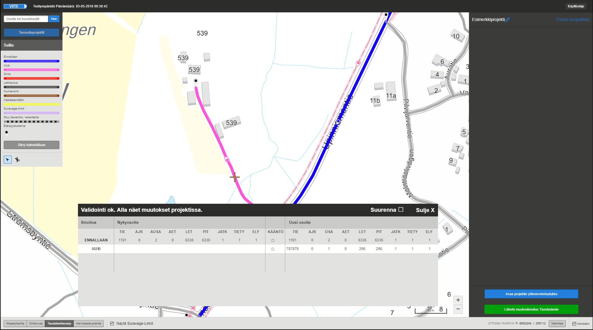

_Muutosilmoituspainike oikeassa alakulmassa._

Kun muutosilmoitus on l&auml;hetetty, muuttuu projektilistauksessa ko. projektin Tila-tieto statukselle "L&auml;hetetty tierekisteriin" (1). Viite-sovellus tarkistaa 10 minuutin v&auml;lein Tierekisterist&auml;, onko muutos viety Tierekisteriss&auml; loppuun asti. Kun t&auml;m&auml; on tehty, muuttuu Tila-tieto statukselle "Viety tierekisteriin" (2). T&auml;ll&ouml;in tieosoiteprojekti on viety onnistuneesti Tierekisteriin, ja se on valmis. Mik&auml;li muutosilmoitus ei ole mennyt l&auml;pi tierekisteriin, lukee tilana "Virhe tierekisteriss&auml;". Tarkemmin virheen tiedot p&auml;&auml;see tarkistamaan viem&auml;ll&auml; hiiren "Virhe tierekisteriss&auml;" -tekstin p&auml;&auml;lle, jolloin infolaatikko virheest&auml; tulee n&auml;kyviin. 

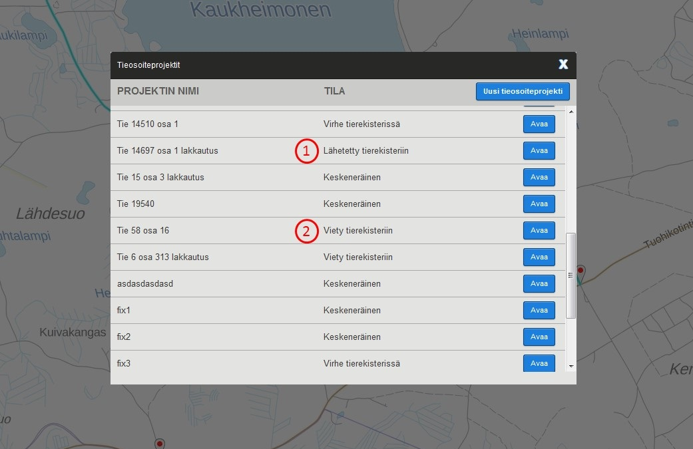

_Tila-statuksia tieosoiteprojektit -listassa._

xx.x Sanasto
--------------------------
ominaisuustieton&auml;kym&auml; == lomake
homogeeninen jakso
et&auml;isyyslukema

