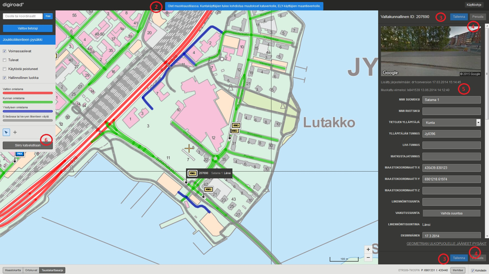

Viite-sovelluksen k&auml;ytt&ouml;ohje
======================================================

__Huom! Suosittelemme Firefoxia tai Chromea, kun sovelluksella yll&auml;pidet&auml;&auml;n Digiroad-tietoja.__

__Huom! K&auml;ytt&ouml;ohjeen kuvia voi klikata isommaksi, jolloin tekstit erottuvat paremmin.__

1. Miten p&auml;&auml;st&auml; alkuun?
-----------------------

Viite-sovelluksen k&auml;ytt&ouml;&auml; varten tarvitaan Liikenneviraston tunnukset (A-, U-, LX-, K- tai L-alkuinen). Mik&auml;li sinulla ei ole tunnuksia, pyyd&auml; ne ty&ouml;n tilaajalta Liikennevirastosta.

Viite-sovellukseen kirjaudutaan osoitteessa: <a href=https://devtest.liikennevirasto.fi/viite/ target="_blank">https://devtest.liikennevirasto.fi/viite/. </a>

Kirjautumisen j&auml;lkeen avautuu karttak&auml;ytt&ouml;liittym&auml;ss&auml; katselutila. Oikeudet on rajattu maantieteellisesti sek&auml; k&auml;ytt&auml;j&auml;n roolin mukaan. Katselijan roolissa aineistoja voi ainoastaan katsella. Muokkaajan roolissa aineistoja voi sek&auml; katsella ett&auml; muokata.

- Ilman erikseen annettuja oikeuksia Liikenneviraston tunnuksilla p&auml;&auml;see katselemaan kaikkia aineistoja.
- Sovelluksen k&auml;ytt&auml;j&auml;ll&auml; on oikeudet h&auml;nelle m&auml;&auml;riteltyjen Elyjen maantieteellisten kuntarajojen sis&auml;puolella oleviin tieosoitteisiin
- Joillekin k&auml;ytt&auml;jille on voitu antaa oikeudet koko Suomen alueelle

Jos kirjautumisen j&auml;lkeen ei avaudu karttak&auml;ytt&ouml;liittym&auml;n katselutilaa, ei kyseisell&auml; tunnuksella ole p&auml;&auml;sy&auml; Liikenneviraston extranettiin. T&auml;ll&ouml;in tulee ottaa yhteytt&auml; Liikennevirastossa omaan yhteyshenkil&ouml;&ouml;n.

2. Karttan&auml;kym&auml;n muokkaus
--------------------------

####Kartan liikutus####

Karttaa liikutetaan raahaamalla.

####Mittakaavataso####

Kartan mittakaavatasoa muutetaan joko hiiren rullalla, tuplaklikkaamalla, Shift+piirto (alue) tai mittakaavapainikkeista. Mittakaavapainikkeita k&auml;ytt&auml;m&auml;ll&auml; kartan keskitys s&auml;ilyy. Hiiren rullalla, tuplaklikkaamalla tai Shift+piirto (alue) kartan keskitys siirtyy kursorin kohtaan.  K&auml;yt&ouml;ss&auml; oleva mittakaavataso n&auml;kyy kartan oikeassa alakulmassa.

####Merkitse piste kartalla####

Merkitse-painike merkitsee sinisen pisteen kartan keskipisteeseen. Merkki poistuu vain, kun merkit&auml;&auml;n uusi piste kartalta. Merkitse-painikkeen vieress&auml; olevat koordinaatit seuraavat kartan keskipistett&auml; ja p&auml;ivittyv&auml;t, kun kartan keskipiste muuttuu.

####Taustakartat####

Taustakartaksi voi valita maastokartan, ortokuvat tai taustakarttasarjan.

_Karttan&auml;kym&auml;n muokkaus._